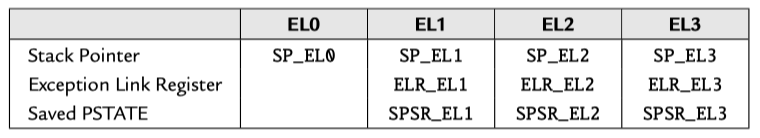

In the AArch64 execution state, there are *three* privileged modes and *one* user mode. These are referred to as ***exception levels***. The higher the exception level, the more privilege the code has.

<!-- more -->

## exception levels

[Arm Compiler armasm User Guide](https://developer.arm.com/documentation/dui0801/latest) | 5. Overview of AArch64 state - 5.2 Exception levels
[ARM 64-Bit Assembly Language](https://www.amazon.com/64-Bit-Assembly-Language-Larry-Pyeatt/dp/0128192216/) | 12.2 AArch64 execution and exception states

The AArch64 processor provides two major modes of operation, referred to as [execution states](./a64-execution-state.md). They are 32-bit AArch32 state, and 64-bit AArch64 state. Both of the these execution states provide privileged modes and a user mode. The AArch32 execution state allows the processor to execute code written for the ARMv7 and older processors.

<figure markdown="span">
    {: style="width:80%;height:80%"}
    <figcaption>Table 12.1 : The ARM User and System Registers</figcaption>
</figure>

In the AArch64 execution state, there are *three* privileged modes and *one* user mode. These are referred to as ***exception levels***. The higher the exception level, the more privilege the code has. Typically, the system uses the exception levels as follows:

- `EL0` User applications, 
- `EL1` OS kernel and other privileged code, 
- `EL2` Hypervisor (support for virtual machines), and 
- `EL3` Secure monitor (manage security contexts).

The major difference between `EL0` and the higher levels is that code executing in `EL0` cannot access system registers. `EL1` can access most system registers, `EL2` has additional privileges, and `EL3` has all privileges. The only way that the processor can change from one exception level to a higher level is when an *exception* occurs. The only way that the processor can move to a lower exception level is by executing an exception *return* instruction. When changing the exception level, it is also possible to switch between AArch64 and AArch32 execution state. The processor also supports two security states: *Secure* and *non-secure*. `EL3` is meant to manage the security state, and `EL2` is meant to provide virtual machine capabilities. In many situations, only `EL0` and `EL1` are required, and some processors may not provide `EL2` and/or `EL3`. On power-up and on reset, the processor enters the highest available exception level.

Each exception level has its own stack pointer, link register, and saved process state register (SPSR). Table 12.1 shows the names of these banked registers. When the exception level changes, the corresponding link register and stack pointer become active, and “replace” the user stack pointer and link register.

### Changing Exception levels

[ARM Cortex-A Series Programmer's Guide for ARMv8-A](https://developer.arm.com/documentation/den0024/latest)

3.2 Changing Exception levels

In the ARMv7 architecture, the processor mode can change under privileged software control or automatically when taking an exception. When an exception occurs, the core saves the current execution state and the return address, enters the required mode, and possibly disables hardware interrupts.

This is summarized in the following table. Applications operate at the lowest level of privilege, `PL0`, previously unprivileged mode. Operating systems run at `PL1`, and the Hypervisor in a system with the Virtualization extensions at `PL2`. The Secure monitor, which acts as a gateway for moving between the Secure and Non-secure (Normal) worlds, also operates at `PL1`.

---

10: AArch64 Exception Handling
10.3 Changes to execution state and Exception level caused by exceptions

When an exception is taken, the processor may change execution state (from AArch64 to AArch32) or stay in the same execution state. For example, an external source may generate an IRQ (interrupt) exception while executing an application running in AArch32 mode and then execute the IRQ handler within the OS Kernel running in AArch64 mode.

Consider an application running in `EL0`, which is interrupted by an IRQ as in Figure 10-5. The Kernel IRQ handler runs at `EL1`. The processor determines which execution state to set when it takes the IRQ exception. It does this by looking at the RW bit of the control register for the Exception level above the one that the exception is being handled in. So, in the example, where the exception is taken in `EL1`, it is `HCR_EL2.RW` which controls the execution state for the handler.

<figure markdown="span">
    
    <figcaption>Figure 10.5. Exception to EL1</figcaption>
</figure>

We must now consider what Exception level an exception is taken at. Again, when an exception is taken, the Exception level may stay the same, or it can get higher. Exceptions are never taken to EL0, as we have already seen.

Synchronous exceptions are normally taken in the current or a higher Exception level. However, asynchronous exceptions can be routed to a higher Exception level. For secure code, `SCR_EL3` specifies which exceptions are to be routed to `EL3`. For hypervisor code, `HCR_EL2` specifies exceptions to be routed to `EL2`.

In both cases, there are separate bits to control routing of IRQ, FIQ and SError. The processor only takes the exception into the Exception level to which it is routed. The Exception level can never go down by taking an exception. Interrupts are always masked at the Exception level where the interrupt is taken.

When taking an exception from AArch32 to AArch64, there are some special considerations. AArch64 handler code may require access to AArch32 registers and the architecture therefore defines mappings to allow access to AArch32 registers.

AArch32 registers `R0` to `R12` are accessed as `X0` to `X12`. The banked versions of the `SP` and `LR` in the various AArch32 modes are accessed through `X13` to `X23`, while the banked `R8` to `R12` FIQ registers are accessed as `X24` to `X29`. Bits [63:32] of these registers are not available in AArch32 state and contains either 0 or the last value written in AArch64. There is no architectural guarantee on which value it is. It is therefore usual to access registers as W registers.

## Security states

[Learn the architecture - Realm Management Extension](https://developer.arm.com/documentation/den0126/latest/) | 2. Security states

RME builds on the Arm TrustZone technology. TrustZone was introduced in Armv6 and provides the following two Security states:

- Secure state
- Non-secure state

The following diagram shows the two Security states in AArch64 with the software components that are typically found in each Security state:

<figure markdown="span">
    
    <figcaption>Figure 2-1: Security states before RME</figcaption>
</figure>

The architecture isolates software running in Secure state from software running in Non-secure state. This isolation enables a software architecture in which trusted code runs in Secure state and is protected from code in Non-secure state.

RME extends this model, and provides the following four Security states:

- Secure state
- Non-secure state
- Realm state
- Root state

The following diagram shows the Security states in an RME-enabled PE, and how these Security states map to Exception levels:

<figure markdown="span">
    
    <figcaption>Figure 2-2: Security states with RME</figcaption>
</figure>

Maintaining Secure state provides backwards compatibility with existing TrustZone use cases. These use cases can also be upgraded to take advantage of new features added by RME, like [dynamic memory assignment](https://developer.arm.com/documentation/den0125/latest).

Realm state constructs protected execution environments called realms. Importantly, RME extends the isolation model introduced in TrustZone.

The architecture provides isolation for the following states:

- Secure state from both Non-secure and realm states
- Realm state from both Non-secure and Secure states

This isolation model provides a software architecture in which the software in Secure and realm states are mutually distrusting.

With RME, Exception level 3 moves out of Secure state and into its own Security state called root. RME isolates Exception level 3 from all other Security states. Exception level 3 hosts the platform and initial boot code and therefore must be trusted by the software in Non-secure, Secure, and realm states. Because these Security states do not trust each other, Exception level 3 must be in a Security state of its own.

[Mixed-safety Systems Using Multicore SoCs With Hypervisors and Multicore Frameworks](https://www.allaboutcircuits.com/industry-articles/mixed-safety-systems-using-multicore-socs-with-hypervisors-and-multicore-frameworks/)

<figure markdown="span">
    
    <figcaption>Figure 2. Supervisory capabilities of hypervisors.</figcaption>
</figure>

### Switching security state

[ARM Cortex-A Series Programmer's Guide for ARMv8-A](https://developer.arm.com/documentation/den0024/latest) | 17: Security

- 17.1 TrustZone hardware architecture
- 17.2 Switching security worlds through interrupts
- 17.4 Switching between Secure and Non-secure state

**17.2 Switching security worlds through interrupts**:

As the cores execute code from the two worlds, context switching between them occurs through execution of the Secure Monitor (`SMC`) instruction or by hardware exception mechanisms, such as interrupts. ARM processors have two interrupt types, FIQ and IRQ.

<figure markdown="span">
    
    <figcaption>Figure 17-1 Non-secure interrupts</figcaption>
</figure>

There is explicit support for Secure interrupts in the form of controls for redirecting exceptions and interrupts to `EL3`, independently of the current DAIF. However, these controls only distinguish between the main interrupt types: IRQ, FIQ and asynchronous aborts. Finer grained control requires interrupts to be filtered into Secure and Non-secure groups. Doing this efficiently requires support from the GIC, which has explicit facilities for this.

A typical use case is for FIQs to be used as Secure interrupts, by mapping Secure interrupt sources as FIQ within the interrupt controller. The relevant peripheral and interrupt controller registers must be marked as Secure access only, to prevent the Normal World from reconfiguring these interrupts.

<figure markdown="span">
    
    <figcaption>Figure 17-2 Secure interrupts</figcaption>
</figure>

These Secure FIQ interrupts must be routed to handlers in the Secure execution state.

Implementations that use security extensions typically have a light-weight trusted kernel that hosts secure services, such as encryption, in the Secure world. A full operating system runs in the Normal world and is able to access the Secure services using the SMC instruction. In this way, the Normal world gets access to service functions without risking exposure of secure assets, such as key material or other protected data, to arbitrary code executing in the Normal world.

**17.4 Switching between Secure and Non-secure state**:

With the ARMv7 Security Extensions, Monitor mode is used by software to switch between the Secure and Non-secure state. This mode is a peer of the other privileged modes within the Secure state.

For the ARMv8 architecture, when `EL3` is using AArch32 the system behaves as ARMv7 to ensure full compatibility, with the result that all the privileged modes within the Secure state are treated as being at `EL3`.

The security model for AArch32 is shown in Figure 17-4. In this scenario, AArch32 is using `EL3` to provide a Secure OS and monitor.

<figure markdown="span">
    
    <figcaption>Figure 17-4 Security model when EL3 is using AArch32</figcaption>
</figure>

In keeping with the ARMv7 architecture, the Secure state `EL1` and `EL0` have a different Virtual Address space from the Non-secure state `EL1` and `EL0`. This permits secure side code from the ARMv7 32-bit architecture to be used in a system with a 64-bit operating system or hypervisor running on the Non-secure side.

Figure 17-5 shows the security model when AArch64 is using `EL3` to provide a Secure monitor. The `EL3` state is not available to AArch32, but `EL1` can be used for the secure OS. When `EL3` is using AArch64, the `EL3` level is used to execute the code responsible for switching between the Non-secure state and the Secure state.

<figure markdown="span">
    
    <figcaption>Figure 17-5 Security model when EL3 is using AArch64</figcaption>
</figure>

## references

[Longterm Security - A Samsung RKP Compendium](https://blog.longterm.io/samsung_rkp.html)
[STBEAT: Software Update on Trusted Environment Based on ARM TrustZone](https://www.researchgate.net/publication/364706816_STBEAT_Software_Update_on_Trusted_Environment_Based_on_ARM_TrustZone)
