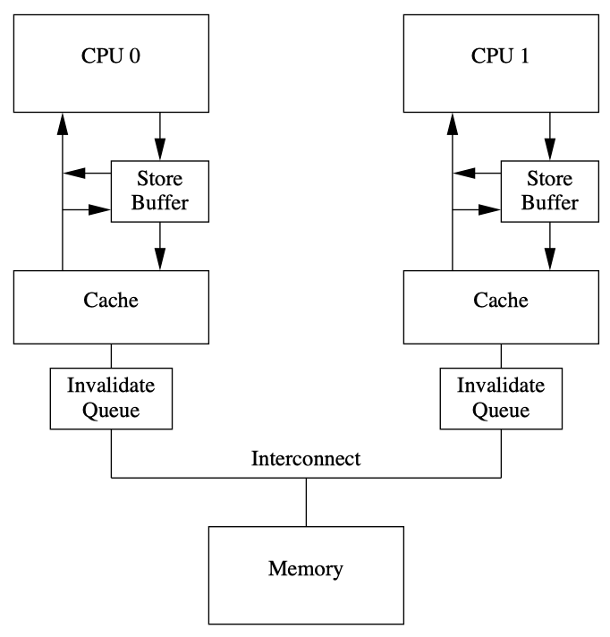

在上一篇 [ARM64 Memory Ordering - re-ordering](./a64-memory-ordering.md) 中，我们介绍了编译器编译时和 CPU 执行时，可能为了提高并行效率，会将指令重排乱序执行。本篇梳理了不同的内存模型下，多处理器并发竞争访问存储器时，指令重排乱序执行可能导致的结果非预期风险。

特别地，在 ARM64 实现的典型的弱一致性内存模型下，程序可能需要添加适当的同步操作来避免竞争访问以保障读写次序。这里说的“同步操作”指的是*`内存屏障指令`*，它是系统编程中很重要的一部分，特别是在多核并行编程中。

<!-- more -->

本文节选自 [《ARM64体系结构编程与实践》](https://item.jd.com/13119117.html) | 第 18.1 节 内存屏障指令产生的原因，仅作学习参考之用途。

## 乱序访问的两个阶段

若程序在执行时的实际内存访问顺序和程序代码指定的访问顺序不一致，会出现**内存乱序访问**。内存乱序访问的出现是为了提高程序执行时的效率。内存乱序访问主要发生在如下两个阶段：

1. 编译时：编译器优化导致内存乱序访问。
2. 执行时：多个 CPU 的交互引起内存乱序访问。

### barrier() 宏规避编译乱序

编译器会把符合人类思维逻辑的高级语言代码（如 C 语言的代码）翻译成符合 CPU 运算规则的江编指令。编泽器会在翻泽成汇编指令时对其进行优化，如内存访问指令的重新排序可以提高指令级并行效率。然而，这些优化可能会与程序员原始的代码逻辑不符，导致一些错误发生。

在 GCC 中，您可以基于 [Extended Asm](https://gcc.gnu.org/onlinedocs/gcc/Extended-Asm.html) 插入 Inline Assembly 指定内存 Clobber，来表示指令修改了内存，以使优化器无法跨越屏障重排内存访问指令。`barrier()` 函数宏告诉编译器，不要为了性能优化而将这些代码乱序重排。

```c
// https://lxr.linux.no/linux+v2.6.31/include/linux/compiler-gcc.h
/* Optimization barrier */
/* The "volatile" is due to gcc bugs */
#define barrier() __asm__ __volatile__("": : :"memory")

// linux-6.9/arch/um/include/shared/user.h
/* Copied from linux/compiler-gcc.h since we can't include it directly */
#define barrier() __asm__ __volatile__("": : :"memory")
```

关于 C 代码内嵌 ASM 汇编语法，详情参考 [GCC Extended Asm - C/C++ inline assembly](../toolchain/gcc-ext-asm.md)，其中有关于 Clobber="memory" 的作用说明。

[Compile-time memory barrier implementation](https://en.wikipedia.org/wiki/Memory_ordering#Compile-time_memory_barrier_implementation): These barriers prevent a compiler from reordering instructions during compile time – they do not prevent reordering by CPU during runtime.

Any of these GNU inline assembler statements forbids the GCC compiler to reorder read and write commands around it:

```c
asm volatile("" ::: "memory"); // or
__asm__ __volatile__ ("" ::: "memory");
```

This C11/C++11 function forbids the compiler to reorder read and write commands around it:

```cpp
atomic_signal_fence(memory_order_acq_rel);
```

1. [atomic_signal_fence](https://en.cppreference.com/w/c/atomic/atomic_signal_fence)/[std::atomic_signal_fence](https://en.cppreference.com/w/cpp/atomic/atomic_signal_fence): Only reordering of the instructions by the compiler is suppressed as order instructs. For example, a fence with `release` semantics prevents reads or writes from being moved *past* subsequent writes and a fence with `acquire` semantics prevents reads or writes from being moved *ahead* of preceding reads.
2. [memory_order](https://en.cppreference.com/w/c/atomic/memory_order)/[std::memory_order](https://en.cppreference.com/w/cpp/atomic/memory_order): `memory_order_acq_rel`: No memory reads or writes in the current thread can be reordered *before* the load, nor *after* the store.

=== "gcc -O2 reordering"

    ```c title="barrier-0.c" linenums="1"
    int c(int *d, int *e) {
        int r;
        d[0] += 1;
        r = e[0]; // no dependency on d
        d[1] += 1;
        return r;
    }
    ```

    The `-O2` will optimize even more than `-O[1]`, it will turn on optimization flags like `-fhoist-adjacent-loads`, `-fstore-merging`.

    To reduce the number of transfers, it uses a single instruction `LDP`(Load Pair) instead of two `LDR`s to hoist adjacent loads.

    The load and modification of `d[1] += 1` are reordered before `r = e[0]`, while the write-back microstep remains after the load of e[0].

    ```bash
    $ gcc -O2 barrier-0.c -c
    $ objdump -d barrier-0.o

    barrier-0.o:     file format elf64-littleaarch64


    Disassembly of section .text:

    0000000000000000 <c>:
    0:	aa0003e2 	mov	x2, x0       // x2 = d
    4:	29400c00 	ldp	w0, w3, [x0] // w0 = d[0]; w3 = d[1]
    8:	11000400 	add	w0, w0, #0x1 // w0 += 1;
    c:	b9000040 	str	w0, [x2]     // d[0] = w0
    10:	11000463 	add	w3, w3, #0x1 // w3 += 1;
    14:	b9400020 	ldr	w0, [x1]     // w0 = e[0];
    18:	b9000443 	str	w3, [x2, #4] // d[1] = w3
    1c:	d65f03c0 	ret
    ```

=== "gcc -O2 barrier/fence"

    ```c title="barrier-1.c" linenums="1"
    // #include <stdatomic.h> // for atomic_signal_fence

    #define barrier() __asm__ __volatile__ ("" ::: "memory")

    int c(int *d, int *e) {
        int r;
        d[0] += 1;
        r = e[0];
        barrier(); // atomic_signal_fence(memory_order_acq_rel);
        d[1] += 1;
        return r;
    }
    ```

    The barrier/fence will prevent the reordering optimization and execute in program order.

    ```bash
    # the same as: gcc -O barrier-0.c -c && objdump -d barrier-0.o

    $ gcc -O2 barrier-1.c -c
    $ objdump -d barrier-1.o

    barrier-1.o:     file format elf64-littleaarch64


    Disassembly of section .text:

    0000000000000000 <c>:
    0:	aa0003e2 	mov	x2, x0          // x2 = d
    4:	b9400000 	ldr	w0, [x0]        // w0 = d[0]
    8:	11000400 	add	w0, w0, #0x1    // w0 += 1
    c:	b9000040 	str	w0, [x2]        // d[0] = w0
    10:	b9400020 	ldr	w0, [x1]        // w0 = e[0]
    14:	b9400441 	ldr	w1, [x2, #4]    // w1 = d[1]
    18:	11000421 	add	w1, w1, #0x1    // w1 += 1
    1c:	b9000441 	str	w1, [x2, #4]    // d[1] = w1
    20:	d65f03c0 	ret
    ```

### 执行时的存储一致性问题

在古老的处理器设计当中，指令是完全按照顺序执行的，这样的模型称为**顺序执行模型**（sequential execution mode）。现代 CPU 为了提高性能，已经抛弃了这种古老的顺序执行模型，采用很多现代化的技术，比如流水线（[Instruction pipelining](https://en.wikipedia.org/wiki/Instruction_pipelining)）、写缓存（[Store Buffer](https://developer.arm.com/documentation/ddi0363/g/Chdcahcf)）、高速缓存（[Cache](https://en.wikipedia.org/wiki/Cache_(computing))）、超标量技术（[Superscalar processor](https://en.wikipedia.org/wiki/Superscalar_processor)）、乱序执行（[Out-of-order execution](https://en.wikipedia.org/wiki/Out-of-order_execution)）等。这些新技术其实对编程者来说是透明的。

在一个单处理器系统里面，不管 CPU 怎么乱序执行，它最终的执行结果都是程序员想要的结果，也就是类似于顺序执行模型。在单处理器系统里，指令的乱序和重排对程序员来说是透明的，但是在多核处理器系统中，一个 CPU 内核中内存访问的乱序执行可能会对系统中其他的观察者（例如其他 CPU 内核）产生影响，即它们可能观察到的内存执行次序与实际执行次序有很大的不同，特别是多核并发访问共享数据的情况下。因此，这里引申出一个 ***存储一致性问题***，即系统中所有处理器所看到的对不同地址访问的次序问题。缓存一致性协议（例如 MESI 协议）用于解决多处理器对*同一个*地址访问的一致性问题，而存储一致性问题是多处理器对*多个不同*内存地址的访问次序引发的问题。在使能与未使能高速缓存的系统中都会存在存储一致性问题。

由于现代处理器普遍采用超标量架构、乱序发射以及乱序执行等技术来提高指令级并行效率，因此指令的执行序列在处理器流水线中可能被打乱，与程序代码编写时的序列不一致，这就产生了程序员错觉——处理器访问内存的次序与代码的次序相同。

> It is still possible to preserve the illusion that the hardware executes instructions in the order you wrote them.

另外，现代处理器采用多级存储结构（寄存器、高速缓存、存储缓冲区、无效队列、内存），如何保证处理器对存储子系统访问的正确性也是一大挑战。

<figure markdown="span">
    {: style="width:75%;height:75%"}
</figure>

例如，在一个系统中有n个处理器 $P_1$\~$P_n$，假设每个处理器包含 $S_i$ 个存储器操作，那么从全局来看，可能的存储器访问序列有多种组合。为了保证内存访问的一致性，需要按照某种规则来选出合适的组合，这个规则叫作**内存一致性模型**（memory consistency model）。这个规则需要在保证正确性的前提下，同时保证多个处理器访问时有较高的并行度。

## 顺序一致性内存模型

在一个单核处理器系统中，保证访问内存的正确性比较简单。每次存储器读操作所获得的结果是最近写入的结果，但是在多个处理器并发访问存储器的情况下就很难保证其正确性了。

我们很容易想到使用一个全局时间比例（global time seale）部件来决定存储器访问时序，从而判断最近访问的数据。这种访间的内存一致性模型是严格一致性（strict consisteney）内存模型，称为**原子一致性**（atomic consistency）内存模型。实现全局时间比例部件的代价比较大，因此退而求其次。采用每一个处理器的局部时间比例（local time scale）部件来确定最新数据的内存模型称为**顺序一致性**（[Sequential Consisteney](https://en.wikipedia.org/wiki/Sequential_consistency), SC）内存模型。1979年，Lanmport 提出了顺序一致性的概念。顺序一致性可以总结为两个约束条件：

1. 从单处理器角度看，存储访问的执行次序以程序为准。
2. 从多处理器角度看，所有的内存访问都是原子性的，其执行顺字不必严格遵循时间顺序。

在下面的例子中，假设系统实现的是顺序一致性内存模型，变基 a、b、x 和 y 的初始值为 0。

```text
CPU0   CPU1
------------
a=1    x=b
b=1    y=a
```

当 CPU1 读出 b 的值为 1 时，我们不可能读出 a 的值为 0。根据顺序一致性内存模型的意义，在 CPU0 侧，先写入变量 a，后写入变量 b，这个写操作改字是可以得到保证的。同理，在 CPU1 侧，先读 b 的值，后读 a 的值，这两次读操作的次序也是可以得到保证的。当 CPU1 读取 b 的值为 1 时，表明 CPU0 已经把 1 成功写入变量 b，于是 a 的值也会被成功写入 1，所以我们不可能读到 a 的值为 0 的情况。但是，如果这个系统实现的不是顺序一致性模型，那么 CPU1 有可能读到 a=0，因为读取 a 的操作可能会重排到读取 b 的操作前面，即不能保证这两次读的次序。

总之，顺序一致性内存模型保证了每一条加载/存储指令与后续加载/存储指令严格按照程序的次序来执行，即保证了“读一读”、“读一写”、“写一写”以及“写一读”4种情况的次序。

## 处理器一致性内存模型

处理器一致性（[Processor Consistency](https://en.wikipedia.org/wiki/Processor_consistency), PC）内存模型是顺序一致性内存模型的进一步弱化，放宽了较早的写操作与后续的读操作之间的次序要求，即放宽了“写一读”操作的次序要求。

处理器一致性模型允许一条加载指令从存储缓冲区（store buffer）中读取一条还没有执行的存储指令的值，而且这个值还没有被写入高速缓存中。x86_64 处理器实现的全序写（Total Store Ordering, TSO）模型就属于处理器一致性内存模型的一种。

## 弱一致性内存模型

对处理器一致性内存模型进一步弱化，可以放宽对“读一读”、“读一写”、“写一写”以及“写一读”4种情况的执行次序要求，不过这并不意味着程序就不能得到正确的预期结果。其实在这种情况下，程序需要添加适当的同步操作。例如，若一个处理器的存储访问想在另外一个处理器的存储访问之后发生，我们需要使用同步来实现，这里说的同步操作指的是*内存屏障指令*。

对内存的访问可以分成如下几种方式。

- *共享访问*：多个处理器同时访问同一个变量，都是读操作。
- *竞争访问*：多个处理器同时访问同一个变量，其中至少有一个是写操作，因此存在竞争访问。例如，一个写操作和一个读操作同时发生可能会导致读操作返回不同的值，这取决于读操作和写操作的次序。

在程序中适当添加同步操作可以避免竞争访问的发生。与此同时，在同步点之后处理器可以改宽对存储访问的次序要求，因为这些访问次序是安全的。基于这种思路，存储器访问指令可以分成**数据访问指令**和**同步指令**（也称为内存屏障指令）两大类，对应的内存模型称为**弱一致性**（weak consistency）内存模型（weakly ordered memory model）。

1986年，Dubois 等发表的论文描述了弱一致性内存模型的定义，在这个定义中使用全局同步变量（global synchronizing variabile）来描述一个同步访问，这里的全局同步变最可以理解为内存屏障指令。在一个多处理器系统中，满足如下3个条件的内存访问称为弱一致性的内存访问：

1. 对全局同步变量的访问是顺序一致的。
2. 在一个同步访问（例如发出内存屏障指令）可以执行之前，所有以前的数据访问必须完成。
3. 在一个正常的数据访问可以执行之前，所有以前的同步访问（内存屏障指令）必须完成。

弱一致性内存模型实质上把一致性问题留给了程序员来解决，程序员必须正确地向处理器表达哪些读/写操作是需要同步的。

ARM64 处理器实现了这种弱一致性内存模型，因此 ARM64 处理器使用内存屏障指令实现同步访问。内存屏障指令的基本原则如下：

- 在内存屏障指令后面的所有数据访问必须**等待**内存屏障指令（例如 ARM64 的 `DMB` 指令）执行完。
- 多条内存屏障指令是按**顺序**执行的。

当然，处理器会根据内存屏障的作用进行细分，例如，ARM64 处理器把内存屏障指令细分为数据存储屏障指令（`DMB`）、数据同步屏障指令（`DSB`）以及指令同步屏障指令（`ISB`）。参考 [ARM64 Memory Ordering - barriers](./a64-memory-barrier.md)。

## ARM64的内存模型

前面介绍了几种内存模型，其中**弱一致性内存模型**在 ARM64 处理器上得到广泛应用。在普通类型内存里实现的就是弱一致性内存模型。在弱一致性内存模型下，CPU 的加载和存储访问的序列有可能和程序中的序列不一致。因此，ARM64 体系结构的处理器支持如下预测式的操作：

- 从内存中预取数据或者指令。
- 预测指令预取。
- 分支预测（branch prediction）。
- 乱序的数据加载 （out of order data load）。
- 预测的高速缓存行的填充（speculative cache line fill），这里主要涉及包括 LSU （Load Store Unit，加载存储单元）、存储缓冲区、无效队列以及缓存等与内存相关的子系统。

注意，预测式的数据访问只支持普通类型内存（Normal Memory），设备类型内存（Device Memory）是不支持预测式的数据访问的，因为设备内存实现的是强一致性的内存模型，它的内存访问次序是强一致性的。

另一个场景是指令的预取是否支持预测式。指令预取和数据存储是两种不同的方式，一个在 CPU 的前端，一个在 CPU 的后端。在 ARMv8 体系结构里，预测式的指令预取是可以支持任意内存类型的，包括普通内存和设备内存（参考 [ARM64 Memory Types](./a64-memory-types.md)）。

## 参考资料

[linux/tools/memory-model/Documentation/](https://git.kernel.org/pub/scm/linux/kernel/git/torvalds/linux.git/tree/tools/memory-model/Documentation/) @[github](https://github.com/torvalds/linux/blob/master/tools/memory-model/Documentation/)

Russ Cox: [research!rsc: Memory Models.PDF](https://research.swtch.com/mm) - [筆記1](https://blog.kennycoder.io/2022/07/18/Hardware-Memory-Models-%E7%AD%86%E8%A8%98/)，[筆記2](https://blog.kennycoder.io/2022/07/26/Programming-Language-Memory-Models-%E7%AD%86%E8%A8%98/)
[Memory Barriers - a Hardware View for Software Hackers.PDF](https://www.puppetmastertrading.com/images/hwViewForSwHackers.pdf)
[A Primer on Memory Consistency and Cache Coherence.PDF](https://link.springer.com/book/10.1007/978-3-031-01764-3) - [笔记](https://www.cnblogs.com/icwangpu/category/2394256.html)

[Consistency model](https://en.wikipedia.org/wiki/Consistency_model):

- [Memory Consistency Models: A Tutorial](https://jamesbornholt.com/blog/memory-models/)
- [Memory Consistency Models of Modern CPUs.PDF](https://es.cs.rptu.de/publications/datarsg/Geor16.pdf)

x86 Total Store Order:

- [Total Store Order and the x86 Memory Model](https://link.springer.com/chapter/10.1007/978-3-031-01764-3_4)
- [Sequential Consistency & Total Store Order.PDF](https://www.cis.upenn.edu/~devietti/classes/cis601-spring2016/sc_tso.pdf)
- [How do modern Intel x86 CPUs implement the total order over stores](https://stackoverflow.com/questions/62465382/how-do-modern-intel-x86-cpus-implement-the-total-order-over-stores)
- [Understanding memory models: an introduction to sequential consistency and total store order](https://techblog.lycorp.co.jp/en/20231216a)
