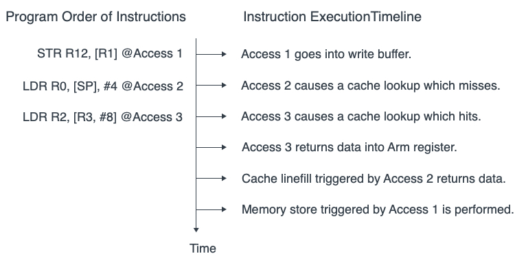
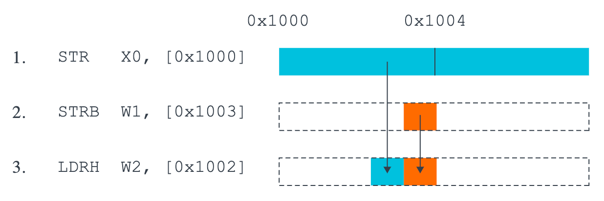

Early implementations of the ARM architecture such as the ARM7TDMI executed all instructions in program order. Each instruction was fully executed before the next instruction was started.

Newer processors employ a number of optimizations that relate to the order in which instructions are executed and the way memory accesses are performed.

<!-- more -->

As we have seen, the speed of execution of instructions by the core is significantly higher than the speed of external memory. Caches and write buffers are used to partially hide the latency associated with this difference in speed. One potential effect of this is for memory addresses to be ***re-ordered***. This would mean that the order in which load and store instructions are executed by the core will not necessarily be the same as the order in which the accesses are seen by external devices.

[Memory ordering](https://en.wikipedia.org/wiki/Memory_ordering) describes the order of accesses to computer *memory* by a CPU. The term can refer either to the memory ordering generated by the *compiler* during compile time, or to the memory ordering generated by a *CPU* during runtime.

In modern microprocessors, memory ordering characterizes the CPU's ability to reorder memory operations – it is a type of [out-of-order execution](https://en.wikipedia.org/wiki/Out-of-order_execution). Memory reordering can be used to fully **utilize** the bus-bandwidth of different types of memory such as caches and memory banks.

Let's look at the following two assembly instructions as preamble:

```asm
LDR X0, [X1]
STR X2, [X3]
```

The `LDR` instruction reads the contents of addressed by `X1`, and the `STR` instruction writes the value of `X2` to the address stored in `X3`. If these two instructions have no *data dependency* or *address dependency*, then the CPU can execute the `STR` instruction first or the `LDR` instruction first, and there will be no difference in the final result.

## secure order

**`Data dependency`** refers to the dependency of adjacent load and store operations on *intermediate* operands (variables). An Data Dependency occurs when a load or store uses the result of a previous load.

For example, if the content is read from the address stored in `Xi` to the `Xj` register, and then the value of `Xj` is written to the address stored in `Xk`, then `Xj` is the data dependency of these two instructions. The following is pseudo code.

```asm
// int a, *b, *c;
LDR Xj, [Xi] // a = *b;
STR Xj, [Xk] // *c = a;
```

**`Address dependency`** refers to the dependency of adjacent load and store operations on the *intermediate* address (pointer). An Address Dependency occurs when a load or store uses the result of a previous load as an address.

For example, read the content from the address stored in `Xi` to the `Xj` register, and then write the value of `Xk` to the address stored in `Xj`, then `Xj` is the address dependency of these two instructions. The following is pseudo code.

```asm
// int *a, **b, *c;
LDR Xj, [Xi] // a = *b;
STR Xk, [Xj] // *a = *c;
```

If there is a dependency between two memory accesses, the processor must maintain the order. In other words, whether it is a data dependency or an address dependency, the order is enforced.

## rearrangement

The ARMv8 architecture employs a *`weakly-ordered`* model of memory. In general terms, this means that the order of memory accesses is *not* required to be the *same* as the program order for load and store operations. The processor is able to ***re-order*** memory read operations with respect to each other. Writes may also be ***re-ordered*** (for example, write combining) . As a result, hardware optimizations, such as the use of *cache* and *write buffer*, function in a way that improves the performance of the processor, which means that the required *bandwidth* between the processor and external memory can be reduced and the long latencies associated with such external memory accesses are hidden.

Reads and writes to Normal memory can be **re-ordered** by hardware, being subject *only* to data dependencies and explicit memory barrier instructions. Certain situations require stronger ordering rules. You can provide information to the core about this through the [memory type](./a64-memory-types.md) attribute of the translation table entry that describes that memory.

[Example of memory reordering](https://developer.arm.com/documentation/102336/0100/Memory-ordering):

<!-- https://documentation-service.arm.com/static/62a304f231ea212bb6623218 -->


In this diagram, three instructions are listed in program order:

1. The first instruction, Access 1, performs a write to external memory that goes to the write buffer. This instruction is followed in program order by two reads.
2. The first read, Access 2, misses in the cache.
3. The next read, Access 3, hits in the cache.

Both read accesses could complete *before* the write buffer completes the write that is associated with Access 1. Caches which support Hit-Under-Miss mean that a load that hits in the cache, like Access 3, can complete before a load earlier in the program that missed in the cache, like Access 2.

[ARM Cortex-A Series Programmer's Guide for ARMv8-A](https://developer.arm.com/documentation/den0024/latest) | Chapter 13 Memory Ordering
[ARM Cortex-R Series Programmer's Guide](https://developer.arm.com/documentation/den0042/latest/Memory-Ordering) | Chapter 10 Memory Ordering

If your code interacts directly either with the hardware or with code executing on other cores, or if it directly loads or writes instructions to be executed, or modifies page tables, you need to be aware of *memory ordering* issues.

It is possible to reorder accesses to locations that are marked Normal, Device-nGRE, or DeviceGRE. Consider [the following example code sequence](https://developer.arm.com/documentation/102336/0100/Memory-ordering):

<!-- https://documentation-service.arm.com/static/62a304f231ea212bb6623218 -->


If the processor reordered these accesses, we might end up with the *wrong* value in memory, which is not allowed.

For accesses to the *same* bytes, ordering must be maintained. The processor needs to detect the read-after-write hazard and ensure that the accesses are ordered correctly for the intended outcome.

This does not mean that there is no possibility of optimization with this example. The processor could **merge** the two stores together, presenting a single combined store to the memory system. The processor could also detect that the load operation is from the bytes that are written by the store instructions. This means that the processor could return the new value *without* rereading it from memory.

## reorder cases

Very high performance systems might support techniques such as speculative memory reads, multiple issuing of instructions, or out-of-order execution and these, along with other techniques, offer further possibilities for hardware re-ordering of memory access:

**Multiple issue of instructions**

> A processor might issue and execute multiple instructions per cycle, so that instructions that are after each other in program order can be executed at the same time.

**Out-of-order execution**

> Many processors support out-of-order execution of *non-dependent* instructions. Whenever an instruction is stalled while it *waits* for the result of a preceding instruction, the processor can execute subsequent instructions that *do not* have a dependency.

**Speculation**

> When the processor encounters a *conditional* instruction, such as a branch, it can speculatively begin to execute instructions before it knows for sure whether that particular instruction must be executed or not. The result is, therefore, available sooner if conditions resolve to show the speculation was correct.

**Speculative loads**

> If a load instruction that reads from a cacheable location is speculatively executed, this can result in a cache linefill and the potential eviction of an existing cache line.

**Load and store optimizations**

> As reads and writes to external memory can have a long latency, processors can reduce the number of transfers by, for example, **merging** together a number of stores(`STP`, `SIMD`(*Neon*), etc.) into one larger transaction.

**External memory systems**

> In many complex System on Chip (`SoC`) devices, there are a number of agents capable of initiating transfers and multiple routes to the slave devices that are read or written. Some of these devices, such as a DRAM controller, might be capable of accepting simultaneous requests from different masters. Transactions can be *buffered*, or *re-ordered* by the interconnect. This means that accesses from different masters might therefore take varying numbers of cycles to complete and might overtake each other.

**Cache coherent multi-core processing**

> In a multi-core processor, hardware cache coherency can migrate cache lines between cores. Different cores might therefore see updates to cached memory locations in a different order to each other.

**Optimizing compilers**

> An optimizing compiler can re-order instructions to hide latencies or make best use of hardware features. It can often move a memory access *forwards*, to make it *earlier*, and give it more time to complete before the value is required.

In a single core system, the effects of such re-ordering are generally *transparent* to the programmer, as the individual processor can check for hazards and **ensure** that data dependencies are respected. However, in cases where you have multiple cores that communicate through shared memory, or share data in other ways, memory ordering considerations become more important. This chapter discusses several topics that relate to [Multiprocessing](https://en.wikipedia.org/wiki/Multiprocessing) (`MP`) operation and synchronization of multiple execution threads. It also discusses memory types and rules defined by the architecture and how these are controlled.

## references

[Learn the architecture - Memory Systems, Ordering, and Barriers](https://developer.arm.com/documentation/102336/latest/)
