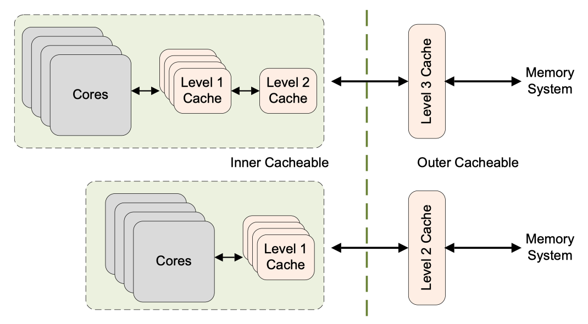
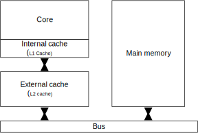

The ARMv8 architecture defines two mutually-exclusive memory types. All regions of memory are configured as one or the other of these two types, which are `Normal` and `Device`. A third memory type, *Strongly Ordered*, is part of the ARMv7 architecture. The differences between this type and Device memory are few and it is therefore now **omitted** in ARMv8.

In addition to the memory type, *attributes* also provide control over cacheability, shareability, access, and execution permissions. Shareable and cache properties pertain *only* to Normal memory. Device regions are always *deemed* to be `non-cacheable` and `outer-shareable`. For cacheable locations, you can use attributes to indicate cache allocation policy to the processor.

<!-- more -->

## Normal memory

[ARM Cortex-R Series Programmer's Guide](https://developer.arm.com/documentation/den0042/latest/) | Chapter 10 Memory Ordering - ARM memory ordering model: Normal memory is used to describe most parts of the memory system. All ROM and RAM devices are considered to be Normal memory. All code to be executed by the processor *must* be in Normal memory. The architecture *does not* permit code to be in a region of memory that is marked as Device or Strongly-ordered.

You can use `Normal memory` for all code and for most data regions in memory. Examples of Normal memory include areas of *RAM*, *Flash*, or *ROM* in physical memory. This kind of memory provides the highest processor performance as it is *weakly ordered* and has fewer restrictions placed on the processor. The processor can **re-order**, **repeat**, and **merge** accesses to Normal memory.

Furthermore, address locations that are marked as Normal can be accessed *speculatively* by the processor, so that data or instructions can be read from memory without being explicitly referenced in the program, or *in advance* of the actual execution of an explicit reference. Such speculative accesses can occur as a result of branch prediction, speculative cache linefills, out-of-order data loads, or other hardware optimizations.

For best performance, always mark application code and data as `Normal` and in circumstances where an enforced memory ordering is required, you can achieve it through the use of explicit `barrier` operations. Normal memory implements a weakly-ordered memory mode. There is no requirement for Normal accesses to complete in order with respect to either other Normal accesses or to Device accesses.

However, the processor must always handle hazards caused by *address dependencies*.

For example, consider the following simple code sequence:

```asm
STR X0, [X2]
LDR X1, [X2]
```

The processor always **ensures** that the value placed in `X1` is the value that was written to the address stored in `X2`.

This of course applies to more complex dependencies.

Consider the following code:

```asm
ADD X4, X3, #3
ADD X5, X3, #2

STR X0, [X3]
STRB W1, [X4]
LDRH W2, [X5]
```

In this case, the accesses take place to addresses that overlap each other. The processor must **ensure** that the memory is updated as if the `STR` and `STRB` occurred in order, so that the `LDRH` returns the most up-to-date value. It would still be valid for the processor to **merge** the `STR` and `STRB` into a single access that contained the latest, correct data to be written.

### Cache policies

[ARM Cortex-A Series Programmer's Guide for ARMv8-A](https://developer.arm.com/documentation/den0024/latest) | 11: Caches - 11.3 Cache policies

The cache policies enable us to describe when a line should be *allocated* to the data cache and what should happen when a store instruction is executed that *hits* in the data cache.

The cache **`allocation policies`** are:

- Write allocation (WA): A cache line is allocated(perform a cache linefill) on a write miss
- Read allocation (RA): A cache line is allocated(perform a cache linefill) on a read miss

The cache **`update policies`** are:

- Write-back (WB): A write *updates* the cache only and *marks* the cache line as dirty. External memory is ***updated*** only when the line is *evicted* or explicitly *cleaned*.
- Write-through (WT): A write updates *both* the cache and the external memory system. This does not mark the cache line as dirty.

The **`cacheable properties`** of normal memory are specified separately as `inner` and `outer` attributes. The divide between inner and outer is *IMPLEMENTATION DEFINED* and is covered in greater detail in Chapter 13. Typically, *`inner`* attributes are used by the *integrated* caches, and *`outer`* attributes are made available on the processor memory bus for use by *external* caches.

<figure markdown="span">
    {: style="width:75%;height:75%"}
    <figcaption>Figure 11-10 Cacheable properties of memory</figcaption>
</figure>

### Cacheability attributes

Regions of [Normal memory](https://developer.arm.com/documentation/den0042/latest/Memory-Ordering/ARM-memory-ordering-model/Normal-memory) must also have cacheability attributes described (see [Chapter 7 Caches](https://developer.arm.com/documentation/den0042/latest/Caches) for details of the supported cache policies). The ARM architecture supports cacheability attributes for Normal memory for two levels of cache, the `inner` and `outer` cache. The mapping between these levels of cache and the implemented physical levels of cache is implementation defined.

<figure markdown="span">
    <!-- https://documentation-service.arm.com/static/60ffb7c39ebe3a7dbd3a78c7 -->
    
    <figcaption>Figure 7.1. A basic cache arrangement</figcaption>
</figure>

**`Inner`** refers to the innermost caches, and always includes the processor *Level 1* cache. An implementation might not have any outer cache, or it can apply the **`outer`** cacheability attribute to an *Level 2* cache. For example, in a system containing a Cortex-R7 processor and the L2C-310 Level 2 cache controller, the L2C-310 is considered to be the outer cache.

### Shareable attributes

[Normal memory](https://developer.arm.com/documentation/den0042/latest/Memory-Ordering/ARM-memory-ordering-model/Normal-memory) must also be identified either as *Shareable* or *Non-Shareable*. A region of Normal memory with the `Non-Shareable` attribute is one that is used *only* by this core. There is no requirement for the core to make accesses to this location coherent with other cores. If other cores do *share* this memory, any coherency issues must be handled in software. For example, this can be done by having individual cores perform cache maintenance and barrier operations.

A region with the `Shareable` attribute set is one that can be accessed by other agents in the system. Accesses to memory in this region by other processors within the *same* shareability domain are coherent. This means that you can safely ignore the effects of data or caches. Without the Shareable attribute, in situations where cache coherency is not maintained between processors for a region of shared memory, you would have to explicitly manage coherency yourself.

The ARMv7 architecture enables you to specify Shareable memory as `Inner Shareable` or `Outer Shareable` (this latter case means that the location is both Inner and Outer Shareable). The Cortex-R processors do not distinguish between outer and inner shareable memory.

!!! note "SoC specific sharability"

    Whether a cache is inner shareable or outer shareable is determined during the SoC design phase, and different design solutions have different results. Comparing the two systems in Figure 11-10, we can see that whether the `L2` cache is an inner shareable cache or an outer shareable cache depends on the design of the SoC.

## Device memory

[ARM Cortex-R Series Programmer's Guide](https://developer.arm.com/documentation/den0042/latest/) | Chapter 10 Memory Ordering - ARM memory ordering model: Accesses to Strongly-ordered and Device memory have the same memory-ordering model.

You can use `Device memory` for all memory regions where an access might have a side-effect. For example, a read to a FIFO location or timer is not repeatable, as it returns different values for each read. A write to a control register might trigger an interrupt. It is typically only used for peripherals in the system. The Device memory type **imposes** more restrictions on the core. Speculative data accesses **cannot** be performed to regions of memory marked as Device. There is a single, uncommon exception to this. If `NEON` operations are used to read bytes from Device memory, the processor might read bytes not explicitly referenced if they are within an aligned 16-byte block that contains one or more bytes that are explicitly referenced.

Trying to execute code from a region marked as Device, is generally *`UNPREDICTABLE`*. The implementation might either handle the instruction fetch as if it were to a memory location with the Normal non-cacheable attribute, or it might take a permission fault.

There are four different types of device memory, to which different rules apply.

- Device-nGnRnE most restrictive (equivalent to Strongly Ordered memory in the ARMv7 architecture).
- Device-nGnRE
- Device-nGRE
- Device-GRE least restrictive

The letter suffixes refer to the following three properties:

1. Gathering or non Gathering (`G` or `nG`)
2. Re-ordering (`R` or `nR`)
3. Early Write Acknowledgement (`E` or `nE`)

## references

[Learn the architecture - AArch64 memory management Guide](https://developer.arm.com/documentation/101811/latest)
[Learn the architecture - AArch64 memory attributes and properties](https://developer.arm.com/documentation/102376/latest/)
