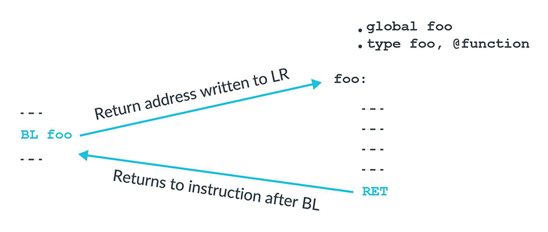

In this article we'll introduce the basic concepts of AAPCS (AArch64 PCS), including program flow, function/subroutine and the Procedure Call Standard.

<!-- more -->

[aapcs32](https://github.com/ARM-software/abi-aa/blob/2a70c42d62e9c3eb5887fa50b71257f20daca6f9/aapcs32/aapcs32.rst) / [aapcs64](https://github.com/ARM-software/abi-aa/blob/2a70c42d62e9c3eb5887fa50b71257f20daca6f9/aapcs64/aapcs64.rst) | 6 The Base Procedure Call Standard

abbrev of ABI Standards:

SHORTCUT | MEANING
---------|----------
AAPCS    |  Procedure Call Standard for the Arm Architecture
СРРАВІ   |  The C++ ABl for Arm Architecture
EHABI    |  Exception Handling ABl for the Arm Architecture
AAELF    |  ELF for the Arm Architecture
AADWARF  |  DWARF for the Arm Architecture
RTABI    |  Runtime ABI for the Arm Architecture
CLIBABI  |  The C Library ABI for the Arm Architecture
ВРАВІ    |  The Base Platform ABI for the Arm Architecture
PSABI    |  Processor Specific Application Binary Interface

[Learn the architecture - A64 Instruction Set Architecture Guide](https://developer.arm.com/documentation/102374/latest) | 27. Procedure Call Standard

The Arm architecture places few restrictions on how general purpose registers are used. To recap, integer registers and floating-point registers are general purpose registers. However, if you want your code to *interact* with code that is written by someone else, or with code that is produced by a compiler, then you need to *agree* rules for register usage. For the Arm architecture, these rules are called the Procedure Call Standard, or **`PCS`**.

## Program flow

[Learn the architecture - A64 Instruction Set Architecture Guide](https://developer.arm.com/documentation/102374/latest) | 22. Program flow & 26. Function calls

Ordinarily, a processor executes instructions in program order. This means that a processor executes instructions in the same order that they are *set* in memory. One way to *change* this order is to use branch instructions. Branch instructions *change* the program flow and are used for loops, decisions and function calls.

When calling a function or sub-routine, we need a way to get *back* to the caller when finished. Adding an `L` to the `B` or `BR` instructions turns them into a branch with *link*. This means that a return address is written into `LR` (`X30`) as part of the branch.

There is a specialist function return instruction, `RET`. This performs an indirect branch to the address in the link register.

<!--  -->

Why do we need a special function return instruction? Functionally, `BR LR` would do the same job as `RET`. Using `RET` tells the processor that this is a function return. Most modern processors, and all Cortex-A processors, support branch prediction. Knowing that this is a function return allows processors to more accurately *predict* the branch.

## Calling subroutines

[ARM 64-Bit Assembly Language](https://www.amazon.com/64-Bit-Assembly-Language-Larry-Pyeatt/dp/0128192216/) | 5 Structured programming - 5.4 Subroutines

A **`subroutine`** is a sequence of instructions to perform a specific task, packaged as a single *unit*. Depending on the particular programming language, a subroutine may be called a procedure, a function, a routine, a method, a subprogram, or some other name. Some languages, such as Pascal, make a distinction between functions and procedures. A *`function`* must return a value and must not alter its input arguments or have any other side effects (such as producing output or changing static or global variables). A *`procedure`* returns no value, but may alter the value of its arguments or have other side effects.

Other languages, such as C, make *no* distinction between procedures and functions. In these languages, functions may be described as *pure* or *impure*. A function is pure if:

1. the function always evaluates the *same* result value when given the same argument value(s), and
2. evaluation of the result does not cause any semantically observable side effect or output.

The first condition implies that the function result *cannot* depend on any hidden information or state that may change as program execution proceeds, or between different executions of the program, nor can it depend on any external input from I/O devices. The result value of a pure function does not depend on anything other than the argument values. If the function returns multiple result values, then these two conditions must apply to all returned values. Otherwise the function is impure. Another way to state this is that impure functions have side effects while pure functions have no side effects.

Assembly language does not impose any distinction between procedures and functions, pure or impure. The assembly language will provide a way to call subroutines and return from them. It is up to the programmer to decide how to pass arguments to the subroutines and how to pass return values back to the section of code that called the subroutine. Once again, the expert assembly programmer will use these structured programming concepts to write efficient, readable, debugable, and maintainable code.

The stack pointer (`sp`), link register (`x30`), and program counter (`pc`), along with the argument registers, are all involved in performing subroutine calls. The calling subroutine must place arguments in the argument registers, and possibly on the stack as well. Placing the arguments in their proper locations is known as *marshaling* the arguments. After marshaling the arguments, the calling subroutine executes the `bl` instruction, which will modify the program counter and link register. The `bl` instruction copies the contents of the program counter to the link register, then loads the program counter with the address of the first instruction in the subroutine that is being called. The CPU will then fetch and execute its next instruction from the address in the program counter, which is the first instruction of the subroutine that is being called.

## The Procedure Call Standard

[Arm Assembly Internals and Reverse Engineering](https://www.amazon.com/Blue-Fox-Assembly-Internals-Analysis/dp/1119745306) | Chapter 8 Control Flow - Functions and Subroutines

The Application Binary Interface (**`ABI`**) for the Arm Architecture is a collection of standards defining protocols that regulate the interoperation of binary files and development tools in a variety of Arm-based execution environments and enable functions to efficiently communicate with each other, both inside and between binary modules.

The table below lists the main ABI standards, most of which are more relevant for authors of C and C++ compilers, linkers, and runtime libraries. For the purpose of reverse engineering Arm binaries, we will focus on the basics of the Procedure Call Standard for the Arm Architecture (`AAPCS`).

SHORTCUT | MEANING
---------|----------
AAPCS    |  Procedure Call Standard for the Arm Architecture
СРРАВІ   |  The C++ ABl for Arm Architecture
EHABI    |  Exception Handling ABl for the Arm Architecture
AAELF    |  ELF for the Arm Architecture
AADWARF  |  DWARF for the Arm Architecture
RTABI    |  Runtime ABI for the Arm Architecture
CLIBABI  |  The C Library ABI for the Arm Architecture
ВРАВІ    |  The Base Platform ABI for the Arm Architecture
PSABI    |  Processor Specific Application Binary Interface

The AAPCS standard specifies the base for a group of Procedure Call Standard (`PCS`) variants and defines obligations between caller and callee routines, and their execution environment to create, preserve, and alter program states. It defines which registers can be freely modified or should be preserved across the call, as well as the layout, alignment, and size of C and C++ data types. The handover mechanism by which a function (the *`caller`*) transmits arguments to the invoked function (the *`callee`*) and by which return values are transmitted back is called the [calling convention](../cs/calling-convention.md).

The following table summarizes the [general-purpose registers](./a64-regs.md) visible to the A64 instruction set and their purpose in the AAPCS64 standard. Note that in this table, the labels `r0`...`r30` refer to both 64-bit (`Xn`) and 32-bit (`Wn`) registers.

REGISTER | SPECIAL | ROLE/USAGE
---------|---------|------------------
SP       |         | The Stack Pointer.
r30      | LR      | The Link Register.
r29      | FP      | The Frame Pointer
r19…r28  |         | Callee-saved registers
r18      |         | The Platform Register, if needed; otherwise a temporary register.
r17      | IP1     | The second intra-procedure-call temporary register (can be used by call veneers and *PLT* code); at other times may be used as a temporary register.
r16      | IP0     | The first intra-procedure-call scratch register (can be used by call veneers and *PLT* code); at other times may be used as a temporary register.
r9…r15   |         | Caller-Saved Temporary registers
r8       |         | Indirect result location register; Linux system call number.
r0…r7    |         | Parameter/result registers

### Arguments and Return Values

The AAPCS defines several integer registers that can be used for passing arguments. Each argument is passed directly in integer registers, ordered from left to right, on the registers `X0` ... `X7` for A64, and `R0`...`R3` for A32.

These registers can also be used as scratch registers, meaning they can hold an immediate value as part of a calculation. In cases where a function needs to preserve the contents of a scratch register over another function call, it must save and restore the value.

In A32, integral and pointer return values are returned in `R0`, and 8- and 16-byte compound structures, including 64-bit integer return values, are returned on `R0`-`R4`.

In A64, integral and pointer return values are returned in `X0`, and 16-byte compound structures returned by value are returned on `X0` and `X1`, with `X0` containing the low-order 64-bits.

### Leaf and Nonleaf Functions

Now that we have roughly covered how functions and subroutines pass arguments and return values between each other, we need to understand the difference between leaf and nonleaf functions and their function prologue and epilogue. In the previous section we learned that subroutine branch instructions such as `BL` and `BLX` save the return address to a dedicated register for the callee to find its way back to the caller function. In this section we will see why `LR` is a nonvolatile register and the circumstances in which it needs to be *preserved* through the subroutine prologue and epilogue.

Leaf functions are functions that don't call another subroutine. But what happens when func calls another subroutine? By this logic, the `LR` containing the return address to the main function would be overwritten as soon as func calls another subroutine using a `BL` or `BLR` instruction. For this reason, nested function calls like in the previous example need to save the initial `LR` before calling another subroutine and overwriting `LR` with a new return address.
