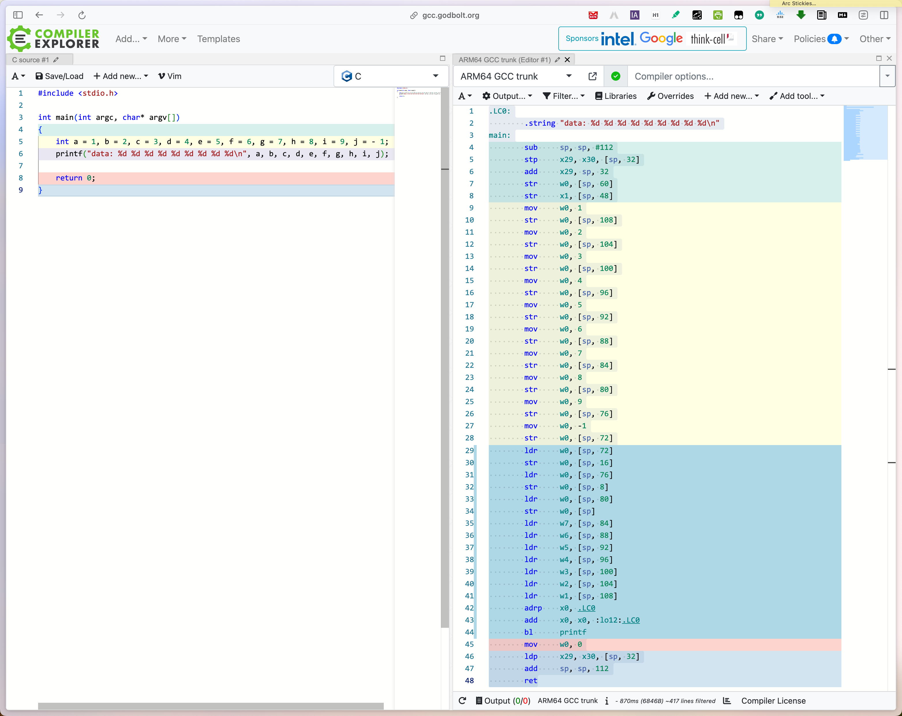

[Previously](./a64-pcs-concepts.md), we've introduced the basic concepts associated with AAPCS (AArch64 Procedure Call Standard).

In this article we'll have a closer look at the ARM64 PCS, with demonstrations of the call conventions and stack layout.

<!-- more -->

## calling convention

The Procedure Call Standard (`PCS`) is used to describe how parent/child functions are compiled and linked, in particular the conventions for the calling relationship between the parent and child functions, such as stack layout, parameter passing, etc. Each processor architecture has different function calling standards. This section focuses on the function calling standards of the ARM64.

The C program below uses the `printf` function to print the values ​​of 10 parameters. According to the function call convention, `X0`~`X7` can be used to pass the first 8 parameters, and the following parameters can only be passed using the stack.

```c title="format-extra-args.c"
#include <stdio.h>

int main(int argc, char* argv[])
{
    int a = 1, b = 2, c = 3, d = 4, e = 5, f = 6, g = 7, h = 8, i = 9, j = - 1;
    printf("data: %d %d %d %d %d %d %d %d %d\n", a, b, c, d, e, f, g, h, i, j);

    return 0;
}
```

The following is the equivalent handwritten assembly.

```asm title="format-extra-args.s" linenums="1"
    .arch armv8-a
    .section .rodata
    .align 3

format:
    .asciz "data: %d %d %d %d %d %d %d %d %d\n"

// give variable a a label, and let b~j follow it.
data:
    .word 1, 2, 3, 4, 5, 6, 7, 8, 9, -1

    .text
    .align 2

.global main

main:
    stp x29, x30, [sp, #-32]!   // push FP & LR
    str x19, [sp, #16]          // save x19
    adr x19, data               // x19 = &data

    // load the eight register parameters
    adrp x0, format
    add x0, x0, :lo12:format    // adr x0, format // x0 = &format
    ldr w1, [x19, #(4*0)]       // w1 = a
    ldr w2, [x19, #(4*1)]       // w2 = b
    ldr w3, [x19, #(4*2)]       // w3 = c
    ldr w4, [x19, #(4*3)]       // w4 = d
    ldr w5, [x19, #(4*4)]       // w5 = e
    ldr w6, [x19, #(4*5)]       // w6 = f
    ldr w7, [x19, #(4*6)]       // w7 = g

    // marshal params on stack in reverse order - h at bottom
    ldr w9, [x19, #(4*7)]       // w9 = h
    ldr w10, [x19, #(4*8)]      // w10 = i
    ldr w11, [x19, #(4*9)]      // w11 = j

    // stack grows downward 32 bytes
    add sp, sp, #-32

    // store w9~w11 into stack, 8 bytes per register
    str w11, [sp, #16]
    str w10, [sp, #8]
    str w9, [sp]

    // call printf
    bl printf

    // pop h, i, and j from the stack
    add sp, sp, #32

    mov w0, wzr             // return 0, EXIT_SUCCESS
    ldr x19, [sp, #16]      // restore : x19
    ldp x29, x30, [sp], #32 // pop FP & LR
    ret
```

In line 18, the stack space is first grown (extended) by 32 bytes, and then the values ​​of the `X29` and `X30` registers are saved to the stack, where the value of register `X29` is saved to the position pointed to by SP, the value of register `X30` is saved to the position pointed to by SP plus 8, and the value of `X19` is saved to the position pointed to by SP plus 16. The extra 8 bytes are left vacant.

```text
P_FP
 SB → +-------+    |
      |       |    | grows
      |-------|    |
      |  X19  |    |
      |-------|    | downward
      |  X30  |    |
      |-------|    |
      |  X29  |    | 32 bytes
 SP → +-------+    v
```

Since there are eleven arguments, the last three must be pushed to the program stack. 

Line 34\~36, the arguments are loaded into `W9`-`W11` and then the arguments are stored on the stack in *reverse* order. Even though the parameters are 4 bytes each, they are pushed onto the stack using 8 bytes each. The top 4 bytes are *padding*. Note that the eleventh argument `j` is placed in the stack at a higher location than the ninth and tenth arguments(`h`, `i`).

Line 39 decrements the stack pointer by 16 bytes, providing room for up to four 8-byte double-words. This is necessary because the AArch64 stack pointer must always be on a 16-byte boundary. Since we have three 8-byte arguments to push, we must allocate 32 bytes, rounding up to the next 16-byte boundary.

Line 44\~43 then stores `X9` at address of the stack pointer, and `X10` 8 bytes above that. Line 42 stores `X11` 16 bytes above the (decremented) stack pointer. The remaining arguments are loaded in `X0`\~`X7`. Note that we assume that format has previously been defined to be "data: %d %d %d %d %d %d %d %d %d\n" using an `.asciz` or `.string` assembler directive.

```text
P_FP
 SB → +-------+    |
      |       |    | grows
      |-------|    |
      |  X19  |    |
      |-------|    | downward
      |  X30  |    |
      |-------|    |
      |  X29  |    | 32 bytes
      +-------+    v
      |       |         | grows
      |-------|         |
      | W11   |         | downward
      |-------|         | 
      | W10   |         | another
      |-------|         |
      | W9    |         | 32 bytes
 SP → +-------+         v
```

Line 42\~44 store three parameters into the stack. It can be implemented with a `STP` and a `STR` instruction. This would be slightly more efficient than the original version for it saves a `STR` instruction. The `STP` instruction is used to store `W9` and `W10` on the stack and adjust the stack pointer. After `W11` is stored on the stack, note that they have been placed in reverse order.

```asm
stp x9, x10, [sp, #-32]!    // 8 bytes per parameter
str x11, [sp, #16]
```

A little care must be taken to ensure that the arguments are stored in the correct order on the stack. Remember that the `STP` instruction will always push the first register to the lower address, and the stack grows downward. Therefore, `X9`, which is the ninth argument will be pushed onto the stack first. Because pre-indexing is used, `X9` is actually at the lowest address. The 64-bit notation is used because otherwise `STP` would store both registers in just 8 bytes, and 16 bytes are needed. 

Additionally, the `printf` instruction does not care what the rest of the bits are for each int, they are just treated as padding on the stack. Moreover, the `X9` register has zeroes in the upper 32-bits because 32-bit operations, such as `LDR` zero the upper bits unless they are explicitly sign-extended using an instruction like `LDRSW`. Finally, the stack must always be 16-byte aligned, which is why it is pushed down 32 bytes instead of just 24.

After the `printf` function is called, the ninth, tenth, and eleventh arguments must be popped from the stack. If those values are no longer needed, then there is no need to load them into registers. The quickest way to pop them from the stack is to simply adjust the stack pointer back to its original value. In this case, we pushed three arguments onto the stack, using a total of 32 bytes (each argument required 8 bytes, but the stack is only allowed to grow or shrink in multiples of 16 bytes). Therefore, all we need to do is add 32 to the stack pointer, thereby restoring its original value, see line 50.

Run `gcc` to compile and disassemble with the following commands:

```bash
$ cc format-extra-args.c -c
$ objdump -d format-extra-args.o
```

If you want to see what the disassembly of a program looks like with different compilers and compiler versions, you can use the 
[Compiler Explorer](https://gcc.godbolt.org/). It highlights individual code sections and displays the equivalent disassembly in their respective colors.

Here we choose the source language as `C` and the target as `ARM64 GCC`. The equivalent disassembly is generated as follows.



Disassemble function `main` by r2:

```bash
$ cc format-extra-args.o -o format-extra-args
$ r2 -Ad format-extra-args
```

=== "r2 -Ad format-extra-args"

    ```bash
    [0xffff82ed4c40]> dcu entry0
    [0xaaaaafc20640]> dcu main
    [0xaaaaafc20754]> pdf
      main + 0              ;-- x3:
      main + 0              ;-- x23:
      main + 0              ;-- pc:
      main + 0              ;-- d3:
      main + 0              ;-- d23:
    ┌ 180: int main (int argc, char **argv, int64_t envp);
    │  main + 0              ; arg int argc @ x0
    │  main + 0              ; arg char **argv @ x1
    │  main + 0              ; arg int64_t envp @ sp+0xe0
    │  main + 0              ; var int64_t var_20h @ sp+0x20
    │  main + 0              ; var int64_t var_48h @ sp+0x48
    │  main + 0              ; var int64_t var_4ch @ sp+0x4c
    │  main + 0              ; var int64_t var_50h @ sp+0x50
    │  main + 0              ; var int64_t var_54h @ sp+0x54
    │  main + 0              ; var int64_t var_58h @ sp+0x58
    │  main + 0              ; var int64_t var_5ch @ sp+0x5c
    │  main + 0              ; var int64_t var_60h @ sp+0x60
    │  main + 0              ; var int64_t var_64h @ sp+0x64
    │  main + 0              ; var int64_t var_68h @ sp+0x68
    │  main + 0              ; var int64_t var_6ch @ sp+0x6c
    │  main + 0              0xaaaaafc20754      ffc301d1       sub sp, sp, 0x70
    │  main + 4              0xaaaaafc20758      fd7b02a9       stp x29, x30, [sp, 0x20]
    │  main + 8              0xaaaaafc2075c      fd830091       add x29, var_20h
    │  main + 12             0xaaaaafc20760      e03f00b9       str w0, [sp, 0x3c]
    │  main + 16             0xaaaaafc20764      e11b00f9       str x1, [sp, 0x30]
    │  main + 20             0xaaaaafc20768      20008052       mov w0, 1
    │  main + 24             0xaaaaafc2076c      e04b00b9       str w0, [sp, 0x48]
    │  main + 28             0xaaaaafc20770      40008052       mov w0, 2
    │  main + 32             0xaaaaafc20774      e04f00b9       str w0, [sp, 0x4c]
    │  main + 36             0xaaaaafc20778      60008052       mov w0, 3
    │  main + 40             0xaaaaafc2077c      e05300b9       str w0, [sp, 0x50]
    │  main + 44             0xaaaaafc20780      80008052       mov w0, 4
    │  main + 48             0xaaaaafc20784      e05700b9       str w0, [sp, 0x54]
    │  main + 52             0xaaaaafc20788      a0008052       mov w0, 5
    │  main + 56             0xaaaaafc2078c      e05b00b9       str w0, [sp, 0x58]
    │  main + 60             0xaaaaafc20790      c0008052       mov w0, 6
    │  main + 64             0xaaaaafc20794      e05f00b9       str w0, [sp, 0x5c]
    │  main + 68             0xaaaaafc20798      e0008052       mov w0, 7
    │  main + 72             0xaaaaafc2079c      e06300b9       str w0, [sp, 0x60]
    │  main + 76             0xaaaaafc207a0      00018052       mov w0, 8
    │  main + 80             0xaaaaafc207a4      e06700b9       str w0, [sp, 0x64]
    │  main + 84             0xaaaaafc207a8      20018052       mov w0, 9
    │  main + 88             0xaaaaafc207ac      e06b00b9       str w0, [sp, 0x68]
    │  main + 92             0xaaaaafc207b0      00008012       mov w0, -1
    │  main + 96             0xaaaaafc207b4      e06f00b9       str w0, [sp, 0x6c]
    │  main + 100            0xaaaaafc207b8      e06f40b9       ldr w0, [var_6ch]
    │  main + 104            0xaaaaafc207bc      e01300b9       str w0, [sp, 0x10]
    │  main + 108            0xaaaaafc207c0      e06b40b9       ldr w0, [var_68h]
    │  main + 112            0xaaaaafc207c4      e00b00b9       str w0, [sp, 8]
    │  main + 116            0xaaaaafc207c8      e06740b9       ldr w0, [var_64h]
    │  main + 120            0xaaaaafc207cc      e00300b9       str w0, [sp]
    │  main + 124            0xaaaaafc207d0      e76340b9       ldr w7, [var_60h]
    │  main + 128            0xaaaaafc207d4      e65f40b9       ldr w6, [var_5ch]
    │  main + 132            0xaaaaafc207d8      e55b40b9       ldr w5, [var_58h]
    │  main + 136            0xaaaaafc207dc      e45740b9       ldr w4, [var_54h]
    │  main + 140            0xaaaaafc207e0      e35340b9       ldr w3, [var_50h]
    │  main + 144            0xaaaaafc207e4      e24f40b9       ldr w2, [var_4ch]
    │  main + 148            0xaaaaafc207e8      e14b40b9       ldr w1, [var_48h]
    │  main + 152            0xaaaaafc207ec      00000090       adrp x0, segment.LOAD0
    │  main + 156            0xaaaaafc207f0      00a02091       add x0, x0, 0x828
    │  main + 160            0xaaaaafc207f4      8fffff97       bl sym.imp.printf
    │  main + 164            0xaaaaafc207f8      00008052       mov w0, 0
    │  main + 168            0xaaaaafc207fc      fd7b42a9       ldp x29, x30, [var_20h]
    │  main + 172            0xaaaaafc20800      ffc30191       add sp, envp
    └  main + 176            0xaaaaafc20804      c0035fd6       ret
    ```

=== "e!asm.pseudo"

    ```bash
    [0xaaaaafc20754]> e!asm.pseudo
    [0xaaaaafc20754]> pdf
      main + 0              ;-- x3:
      main + 0              ;-- x23:
      main + 0              ;-- pc:
      main + 0              ;-- d3:
      main + 0              ;-- d23:
    ┌ 180: int main (int argc, char **argv, int64_t envp);
    │  main + 0              ; arg int argc @ x0
    │  main + 0              ; arg char **argv @ x1
    │  main + 0              ; arg int64_t envp @ sp+0xe0
    │  main + 0              ; var int64_t var_20h @ sp+0x20
    │  main + 0              ; var int64_t var_48h @ sp+0x48
    │  main + 0              ; var int64_t var_4ch @ sp+0x4c
    │  main + 0              ; var int64_t var_50h @ sp+0x50
    │  main + 0              ; var int64_t var_54h @ sp+0x54
    │  main + 0              ; var int64_t var_58h @ sp+0x58
    │  main + 0              ; var int64_t var_5ch @ sp+0x5c
    │  main + 0              ; var int64_t var_60h @ sp+0x60
    │  main + 0              ; var int64_t var_64h @ sp+0x64
    │  main + 0              ; var int64_t var_68h @ sp+0x68
    │  main + 0              ; var int64_t var_6ch @ sp+0x6c
    │  main + 0              0xaaaaafc20754      ffc301d1       sp = sp - 0x70
    │  main + 4              0xaaaaafc20758      fd7b02a9       [sp + 0x20] = (x29, 2)
    │  main + 8              0xaaaaafc2075c      fd830091       x29 = var_20h
    │  main + 12             0xaaaaafc20760      e03f00b9       [sp + 0x3c] = w0
    │  main + 16             0xaaaaafc20764      e11b00f9       [sp + 0x30] = x1
    │  main + 20             0xaaaaafc20768      20008052       w0 = 1
    │  main + 24             0xaaaaafc2076c      e04b00b9       [sp + 0x48] = w0    // a
    │  main + 28             0xaaaaafc20770      40008052       w0 = 2
    │  main + 32             0xaaaaafc20774      e04f00b9       [sp + 0x4c] = w0    // b
    │  main + 36             0xaaaaafc20778      60008052       w0 = 3
    │  main + 40             0xaaaaafc2077c      e05300b9       [sp + 0x50] = w0    // c
    │  main + 44             0xaaaaafc20780      80008052       w0 = 4
    │  main + 48             0xaaaaafc20784      e05700b9       [sp + 0x54] = w0    // d
    │  main + 52             0xaaaaafc20788      a0008052       w0 = 5
    │  main + 56             0xaaaaafc2078c      e05b00b9       [sp + 0x58] = w0    // e
    │  main + 60             0xaaaaafc20790      c0008052       w0 = 6
    │  main + 64             0xaaaaafc20794      e05f00b9       [sp + 0x5c] = w0    // f
    │  main + 68             0xaaaaafc20798      e0008052       w0 = 7
    │  main + 72             0xaaaaafc2079c      e06300b9       [sp + 0x60] = w0    // g
    │  main + 76             0xaaaaafc207a0      00018052       w0 = 8
    │  main + 80             0xaaaaafc207a4      e06700b9       [sp + 0x64] = w0    // h
    │  main + 84             0xaaaaafc207a8      20018052       w0 = 9
    │  main + 88             0xaaaaafc207ac      e06b00b9       [sp + 0x68] = w0    // i
    │  main + 92             0xaaaaafc207b0      00008012       w0 = -1
    │  main + 96             0xaaaaafc207b4      e06f00b9       [sp + 0x6c] = w0    // j
    │  main + 100            0xaaaaafc207b8      e06f40b9       w0 = [var_6ch]
    │  main + 104            0xaaaaafc207bc      e01300b9       [sp + 0x10] = w0    // j
    │  main + 108            0xaaaaafc207c0      e06b40b9       w0 = [var_68h]
    │  main + 112            0xaaaaafc207c4      e00b00b9       [sp + 8] = w0       // i
    │  main + 116            0xaaaaafc207c8      e06740b9       w0 = [var_64h]
    │  main + 120            0xaaaaafc207cc      e00300b9       [sp] = w0           // h
    │  main + 124            0xaaaaafc207d0      e76340b9       w7 = [var_60h]
    │  main + 128            0xaaaaafc207d4      e65f40b9       w6 = [var_5ch]
    │  main + 132            0xaaaaafc207d8      e55b40b9       w5 = [var_58h]
    │  main + 136            0xaaaaafc207dc      e45740b9       w4 = [var_54h]
    │  main + 140            0xaaaaafc207e0      e35340b9       w3 = [var_50h]
    │  main + 144            0xaaaaafc207e4      e24f40b9       w2 = [var_4ch]
    │  main + 148            0xaaaaafc207e8      e14b40b9       w1 = [var_48h]
    │  main + 152            0xaaaaafc207ec      00000090       x0 = segment.LOAD0
    │  main + 156            0xaaaaafc207f0      00a02091       x0 = x0 + 0x828
    │  main + 160            0xaaaaafc207f4      8fffff97       sym.imp.printf ()
    │  main + 164            0xaaaaafc207f8      00008052       w0 = 0
    │  main + 168            0xaaaaafc207fc      fd7b42a9       (x29, 2) = 3
    │  main + 172            0xaaaaafc20800      ffc30191       sp = envp
    └  main + 176            0xaaaaafc20804      c0035fd6
    ```

## stack layout

In the ARM64 architecture, the stack grows from high addresses to low addresses. The starting address of the stack is called the *base*, and the point at which the stack grows from high to low addresses is called the *top*. The stack plays a very important role in the function call process, including storing local variables used by the function, passing parameters, etc. The stack is built step by step during the function call process. The stack interval allocated to a single function, that is, the space from the bottom/base of the stack (high address) to the top of the stack (low address) of the function, is called the **`stack frame`**.

[ARM Cortex-A Series Programmer's Guide for ARMv8-A](https://developer.arm.com/documentation/den0024/latest) | 9: The ABI for ARM 64-bit Architecture - 9.1.2 Indirect result location

An AAPC64 stack frame shown in Figure 9-2. The frame pointer (`X29`) should point to the *previous* frame pointer saved on stack, with the saved LR (`X30`) stored after it. The final frame pointer in the *chain* should be set to 0. The Stack Pointer (`SP`) must always be aligned on a 16 byte boundary. There can be some variation of the exact layout of a stack frame, particularly in the case of variadic or frameless functions.

<figure markdown="span">
    
    <figcaption>Figure 9.2. Stack frame</figcaption>
</figure>

!!! note "AAPCS unspecified"

    The AAPCS only specifies the `FP`, `LR` block layout and how these blocks are chained together. Everything else in Figure 9.2 (including the precise location of the boundary between frames of the two functions) is unspecified, and can be freely chosen by the compiler.

To reiterate, the `X8` (`XR`) register is used to pass the indirect result location. Here is some code:

```c title="xr-struct.c"
#include <stdio.h>

typedef struct {
    int i0;
    int i1;
    double d0;
    double d1;
} structA;

structA bar(int i0, int i1, double d0, double d1) {
    structA a;

    a.i0 = i0;
    a.i1 = i1;
    a.d0 = d0;
    a.d1 = d1;

    return a;
}

void foo() {
    structA a = bar(0, 1, 1.0, 2.0);
    printf("a = {%d, %d, %f, %f}\n", a.i0, a.i1, a.d0, a.d1);
}

int main(int argc, char* argv[]) {
    foo();

    return 0;
}
```

and that can be compiled using:

```bash
$ armclang -target aarch64-arm-none-eabi -c test.c fromelf-c test.o
```

> This code is compiled without optimization to demonstrate the mechanisms and principles involved. It is possible that with optimization, the compiler might remove all of this.

Run `gcc` to compile and disassemble with the following commands:

```bash
$ cc xr-struct.c -c
$ objdump -j .rodata -s xr-struct.o
$ objdump -d xr-struct.o
```

> See corresponding disassembly against C source code in [Compiler Explorer](https://gcc.godbolt.org/)(C → ARM64 GCC).

Disassemble function `main` and subroutines(`foo`, `bar`) debuging by r2:

```bash
$ cc xr-struct.o -o xr-struct
# objdump -d xr-struct
    $ rabin2 -z xr-struct
    [Strings]
    nth paddr      vaddr      len size section type  string
    ―――――――――――――――――――――――――――――――――――――――――――――――――――――――
    0   0x00000970 0x00000970 21  22   .rodata ascii a = {%d, %d, %f, %f}\n

$ r2 -Ad xr-struct
```

=== "r2 -Ad xr-struct"

    ```bash
    [0xffffb98f8c40]> dcu main
    [0xaaaac5ab0934]> pdf
      main + 0              ;-- x3:
      main + 0              ;-- x23:
      main + 0              ;-- pc:
      main + 0              ;-- d3:
      main + 0              ;-- d23:
    ┌ 32: int main (int argc, char **argv);
    │  main + 0              ; arg int argc @ x0
    │  main + 0              ; arg char **argv @ x1
    │  main + 0              0xaaaac5ab0934      fd7bbea9       stp x29, x30, [sp, -0x20]!
    │  main + 4              0xaaaac5ab0938      fd030091       mov x29, sp
    │  main + 8              0xaaaac5ab093c      e01f00b9       str w0, [sp, 0x1c]
    │  main + 12             0xaaaac5ab0940      e10b00f9       str x1, [sp, 0x10]
    │  main + 16             0xaaaac5ab0944      daffff97       bl sym.foo
    │  main + 20             0xaaaac5ab0948      00008052       mov w0, 0
    │  main + 24             0xaaaac5ab094c      fd7bc2a8       ldp x29, x30, [sp], 0x20
    └  main + 28             0xaaaac5ab0950      c0035fd6       ret
    [0xaaaac5ab0934]> pdf @ sym.foo
    ┌ 136: sym.foo ();
    │  sym.foo + 0              ; var int64_t var_10h @ sp+0x10
    │  sym.foo + 0              ; var int64_t var_14h @ sp+0x14
    │  sym.foo + 0              ; var int64_t var_18h @ sp+0x18
    │  sym.foo + 0              ; var int64_t var_20h @ sp+0x20
    │  sym.foo + 0              ; var int64_t var_28h @ sp+0x28
    │  sym.foo + 0              0xaaaac5ab08ac      fd7bbda9       stp x29, x30, [sp, -0x30]!
    │  sym.foo + 4              0xaaaac5ab08b0      fd030091       mov x29, sp
    │  sym.foo + 8              0xaaaac5ab08b4      80000090       adrp x0, map._home_pifan_Projects_cpp_xr_struct.rw_
    │  sym.foo + 12             0xaaaac5ab08b8      00f447f9       ldr x0, [x0, 0xfe8]
    │  sym.foo + 16             0xaaaac5ab08bc      010040f9       ldr x1, [x0]
    │  sym.foo + 20             0xaaaac5ab08c0      e11700f9       str x1, [sp, 0x28]
    │  sym.foo + 24             0xaaaac5ab08c4      010080d2       mov x1, 0
    │  sym.foo + 28             0xaaaac5ab08c8      e0430091       add x0, var_10h
    │  sym.foo + 32             0xaaaac5ab08cc      e80300aa       mov x8, x0
    │  sym.foo + 36             0xaaaac5ab08d0      0110601e       fmov d1, 2
    │  sym.foo + 40             0xaaaac5ab08d4      00106e1e       fmov d0, 1
    │  sym.foo + 44             0xaaaac5ab08d8      21008052       mov w1, 1
    │  sym.foo + 48             0xaaaac5ab08dc      00008052       mov w0, 0
    │  sym.foo + 52             0xaaaac5ab08e0      ddffff97       bl sym.bar
    │  sym.foo + 56             0xaaaac5ab08e4      e01340b9       ldr w0, [var_10h]
    │  sym.foo + 60             0xaaaac5ab08e8      e11740b9       ldr w1, [var_14h]
    │  sym.foo + 64             0xaaaac5ab08ec      e00f40fd       ldr d0, [var_18h]
    │  sym.foo + 68             0xaaaac5ab08f0      e11340fd       ldr d1, [var_20h]
    │  sym.foo + 72             0xaaaac5ab08f4      e203012a       mov w2, w1
    │  sym.foo + 76             0xaaaac5ab08f8      e103002a       mov w1, w0
    │  sym.foo + 80             0xaaaac5ab08fc      00000090       adrp x0, segment.LOAD0
    │  sym.foo + 84             0xaaaac5ab0900      00c02591       add x0, x0, 0x970
    │  sym.foo + 88             0xaaaac5ab0904      7fffff97       bl sym.imp.printf
    │  sym.foo + 92             0xaaaac5ab0908      1f2003d5       nop
    │  sym.foo + 96             0xaaaac5ab090c      80000090       adrp x0, map._home_pifan_Projects_cpp_xr_struct.rw_
    │  sym.foo + 100            0xaaaac5ab0910      00f447f9       ldr x0, [x0, 0xfe8]
    │  sym.foo + 104            0xaaaac5ab0914      e21740f9       ldr x2, [var_28h]
    │  sym.foo + 108            0xaaaac5ab0918      010040f9       ldr x1, [x0]
    │  sym.foo + 112            0xaaaac5ab091c      420001eb       subs x2, x2, x1
    │  sym.foo + 116            0xaaaac5ab0920      010080d2       mov x1, 0
    │  sym.foo + 120        ┌─< 0xaaaac5ab0924      40000054       b.eq 0xaaaac5ab092c
    │  sym.foo + 124        │   0xaaaac5ab0928      6affff97       bl sym.imp.__stack_chk_fail
    │  sym.foo + 128        └─> 0xaaaac5ab092c      fd7bc3a8       ldp x29, x30, [sp], 0x30
    └  sym.foo + 132            0xaaaac5ab0930      c0035fd6       ret
    [0xaaaac5ab0934]> pdf @ sym.bar
    ┌ 88: sym.bar (int64_t arg1, int64_t arg2, int64_t arg_40h);
    │  sym.bar + 0              ; arg int64_t arg1 @ x0
    │  sym.bar + 0              ; arg int64_t arg2 @ x1
    │  sym.bar + 0              ; arg int64_t arg_40h @ sp+0x80
    │  sym.bar + 0              ; var int64_t var_8h @ sp+0x8
    │  sym.bar + 0              ; var int64_t var_10h @ sp+0x10
    │  sym.bar + 0              ; var int64_t var_18h @ sp+0x18
    │  sym.bar + 0              ; var int64_t var_1ch @ sp+0x1c
    │  sym.bar + 0              ; var int64_t var_28h @ sp+0x28
    │  sym.bar + 0              0xaaaac5ab0854      ff0301d1       sub sp, sp, 0x40
    │  sym.bar + 4              0xaaaac5ab0858      e20308aa       mov x2, x8
    │  sym.bar + 8              0xaaaac5ab085c      e01f00b9       str w0, [sp, 0x1c]
    │  sym.bar + 12             0xaaaac5ab0860      e11b00b9       str w1, [sp, 0x18]
    │  sym.bar + 16             0xaaaac5ab0864      e00b00fd       str d0, [sp, 0x10]
    │  sym.bar + 20             0xaaaac5ab0868      e10700fd       str d1, [sp, 8]
    │  sym.bar + 24             0xaaaac5ab086c      e01f40b9       ldr w0, [var_1ch]
    │  sym.bar + 28             0xaaaac5ab0870      e02b00b9       str w0, [sp, 0x28]
    │  sym.bar + 32             0xaaaac5ab0874      e01b40b9       ldr w0, [var_18h]
    │  sym.bar + 36             0xaaaac5ab0878      e02f00b9       str w0, [sp, 0x2c]
    │  sym.bar + 40             0xaaaac5ab087c      e00b40fd       ldr d0, [var_10h]
    │  sym.bar + 44             0xaaaac5ab0880      e01b00fd       str d0, [sp, 0x30]
    │  sym.bar + 48             0xaaaac5ab0884      e00740fd       ldr d0, [var_8h]
    │  sym.bar + 52             0xaaaac5ab0888      e01f00fd       str d0, [sp, 0x38]
    │  sym.bar + 56             0xaaaac5ab088c      e30302aa       mov x3, x2
    │  sym.bar + 60             0xaaaac5ab0890      e2a30091       add x2, var_28h
    │  sym.bar + 64             0xaaaac5ab0894      400440a9       ldp x0, x1, [x2]
    │  sym.bar + 68             0xaaaac5ab0898      600400a9       stp x0, x1, [x3]
    │  sym.bar + 72             0xaaaac5ab089c      400840f9       ldr x0, [x2, 0x10]
    │  sym.bar + 76             0xaaaac5ab08a0      600800f9       str x0, [x3, 0x10]
    │  sym.bar + 80             0xaaaac5ab08a4      ff030191       add sp, arg_40h
    └  sym.bar + 84             0xaaaac5ab08a8      c0035fd6       ret
    ```

=== "e!asm.pseudo"

    ```bash
    [0xaaaac5ab0934]> e!asm.pseudo
    [0xaaaac5ab0934]> pdf
      main + 0              ;-- x3:
      main + 0              ;-- x23:
      main + 0              ;-- pc:
      main + 0              ;-- d3:
      main + 0              ;-- d23:
    ┌ 32: int main (int argc, char **argv);
    │  main + 0              ; arg int argc @ x0
    │  main + 0              ; arg char **argv @ x1
    │  main + 0              0xaaaac5ab0934      fd7bbea9       [sp - 0x20]! = (x29, 2)
    │  main + 4              0xaaaac5ab0938      fd030091       x29 = sp
    │  main + 8              0xaaaac5ab093c      e01f00b9       [sp + 0x1c] = w0
    │  main + 12             0xaaaac5ab0940      e10b00f9       [sp + 0x10] = x1
    │  main + 16             0xaaaac5ab0944      daffff97       sym.foo ()
    │  main + 20             0xaaaac5ab0948      00008052       w0 = 0
    │  main + 24             0xaaaac5ab094c      fd7bc2a8       (x29, 2) = 3
    └  main + 28             0xaaaac5ab0950      c0035fd6
    [0xaaaac5ab0934]> pdf @ sym.foo
    ┌ 136: sym.foo ();
    │  sym.foo + 0              ; var int64_t var_10h @ sp+0x10
    │  sym.foo + 0              ; var int64_t var_14h @ sp+0x14
    │  sym.foo + 0              ; var int64_t var_18h @ sp+0x18
    │  sym.foo + 0              ; var int64_t var_20h @ sp+0x20
    │  sym.foo + 0              ; var int64_t var_28h @ sp+0x28
    │  sym.foo + 0              0xaaaac5ab08ac      fd7bbda9       [sp - 0x30]! = (x29, 2)
    │  sym.foo + 4              0xaaaac5ab08b0      fd030091       x29 = sp
    │  sym.foo + 8              0xaaaac5ab08b4      80000090       x0 = map._home_pifan_Projects_cpp_xr_struct.rw_
    │  sym.foo + 12             0xaaaac5ab08b8      00f447f9       x0 = [x0 + 0xfe8]
    │  sym.foo + 16             0xaaaac5ab08bc      010040f9       x1 = [x0]
    │  sym.foo + 20             0xaaaac5ab08c0      e11700f9       [sp + 0x28] = x1
    │  sym.foo + 24             0xaaaac5ab08c4      010080d2       x1 = 0
    │  sym.foo + 28             0xaaaac5ab08c8      e0430091       x0 = var_10h
    │  sym.foo + 32             0xaaaac5ab08cc      e80300aa       x8 = x0
    │  sym.foo + 36             0xaaaac5ab08d0      0110601e       d1 = 2
    │  sym.foo + 40             0xaaaac5ab08d4      00106e1e       d0 = 1
    │  sym.foo + 44             0xaaaac5ab08d8      21008052       w1 = 1
    │  sym.foo + 48             0xaaaac5ab08dc      00008052       w0 = 0
    │  sym.foo + 52             0xaaaac5ab08e0      ddffff97       sym.bar ()
    │  sym.foo + 56             0xaaaac5ab08e4      e01340b9       w0 = [var_10h]
    │  sym.foo + 60             0xaaaac5ab08e8      e11740b9       w1 = [var_14h]
    │  sym.foo + 64             0xaaaac5ab08ec      e00f40fd       d0 = [var_18h]
    │  sym.foo + 68             0xaaaac5ab08f0      e11340fd       d1 = [var_20h]
    │  sym.foo + 72             0xaaaac5ab08f4      e203012a       w2 = w1
    │  sym.foo + 76             0xaaaac5ab08f8      e103002a       w1 = w0
    │  sym.foo + 80             0xaaaac5ab08fc      00000090       x0 = segment.LOAD0
    │  sym.foo + 84             0xaaaac5ab0900      00c02591       x0 = x0 + 0x970
    │  sym.foo + 88             0xaaaac5ab0904      7fffff97       sym.imp.printf ()
    │  sym.foo + 92             0xaaaac5ab0908      1f2003d5
    │  sym.foo + 96             0xaaaac5ab090c      80000090       x0 = map._home_pifan_Projects_cpp_xr_struct.rw_
    │  sym.foo + 100            0xaaaac5ab0910      00f447f9       x0 = [x0 + 0xfe8]
    │  sym.foo + 104            0xaaaac5ab0914      e21740f9       x2 = [var_28h]
    │  sym.foo + 108            0xaaaac5ab0918      010040f9       x1 = [x0]
    │  sym.foo + 112            0xaaaac5ab091c      420001eb       x2 = x2 - x1
    │  sym.foo + 116            0xaaaac5ab0920      010080d2       x1 = 0
    │  sym.foo + 120        ┌─< 0xaaaac5ab0924      40000054       if (eq) goto 0xaaaac5ab092c
    │  sym.foo + 124        │   0xaaaac5ab0928      6affff97       sym.imp.__stack_chk_fail ()
    │  sym.foo + 128        └─> 0xaaaac5ab092c      fd7bc3a8       (x29, 2) = 3
    └  sym.foo + 132            0xaaaac5ab0930      c0035fd6
    [0xaaaac5ab0934]> pdf @ sym.bar
    ┌ 88: sym.bar (int64_t arg1, int64_t arg2, int64_t arg_40h);
    │  sym.bar + 0              ; arg int64_t arg1 @ x0
    │  sym.bar + 0              ; arg int64_t arg2 @ x1
    │  sym.bar + 0              ; arg int64_t arg_40h @ sp+0x80
    │  sym.bar + 0              ; var int64_t var_8h @ sp+0x8
    │  sym.bar + 0              ; var int64_t var_10h @ sp+0x10
    │  sym.bar + 0              ; var int64_t var_18h @ sp+0x18
    │  sym.bar + 0              ; var int64_t var_1ch @ sp+0x1c
    │  sym.bar + 0              ; var int64_t var_28h @ sp+0x28
    │  sym.bar + 0              0xaaaac5ab0854      ff0301d1       sp = sp - 0x40
    │  sym.bar + 4              0xaaaac5ab0858      e20308aa       x2 = x8
    │  sym.bar + 8              0xaaaac5ab085c      e01f00b9       [sp + 0x1c] = w0
    │  sym.bar + 12             0xaaaac5ab0860      e11b00b9       [sp + 0x18] = w1
    │  sym.bar + 16             0xaaaac5ab0864      e00b00fd       [sp + 0x10] = d0
    │  sym.bar + 20             0xaaaac5ab0868      e10700fd       [sp + 8] = d1
    │  sym.bar + 24             0xaaaac5ab086c      e01f40b9       w0 = [var_1ch]
    │  sym.bar + 28             0xaaaac5ab0870      e02b00b9       [sp + 0x28] = w0
    │  sym.bar + 32             0xaaaac5ab0874      e01b40b9       w0 = [var_18h]
    │  sym.bar + 36             0xaaaac5ab0878      e02f00b9       [sp + 0x2c] = w0
    │  sym.bar + 40             0xaaaac5ab087c      e00b40fd       d0 = [var_10h]
    │  sym.bar + 44             0xaaaac5ab0880      e01b00fd       [sp + 0x30] = d0
    │  sym.bar + 48             0xaaaac5ab0884      e00740fd       d0 = [var_8h]
    │  sym.bar + 52             0xaaaac5ab0888      e01f00fd       [sp + 0x38] = d0
    │  sym.bar + 56             0xaaaac5ab088c      e30302aa       x3 = x2
    │  sym.bar + 60             0xaaaac5ab0890      e2a30091       x2 = var_28h
    │  sym.bar + 64             0xaaaac5ab0894      400440a9       (x0, 2) = 3
    │  sym.bar + 68             0xaaaac5ab0898      600400a9       stp x0, x1, [x3]
    │  sym.bar + 72             0xaaaac5ab089c      400840f9       x0 = [x2 + 0x10]
    │  sym.bar + 76             0xaaaac5ab08a0      600800f9       [x3 + 0x10] = x0
    │  sym.bar + 80             0xaaaac5ab08a4      ff030191       sp = arg_40h
    └  sym.bar + 84             0xaaaac5ab08a8      c0035fd6
    ```

When the parent function `foo` prepares to execute the child function `bar`, the stack pointer (`SP`) is extended to a lower address (from the lowest point of the parent function stack frame down) to create a stack frame for the `bar` function. Some local variables used by `bar` are stored in this stack frame. When `bar` returns, `SP` is adjusted back to the parent function stack frame. At this point the stack space of `bar` is released.

The function call chain is *main* -> *foo* -> *bar*. The following figure shows the layout of the stack frame when functions are called in a nested way.

```text
                  stack
high addr       +-------+      \
    ↓           |       |      |
                |  ...  |      |
                |       |      |
                |-------|       > main stack frame
                |  LR   |      |
                |-------|      |
                |  P_FP |      |
   main SP/FP → +-------+ ←-+  /   \
                |       |   |      |
                |  ...  |   |      |
                |       |   |      |
                |-------|   |       > foo stack frame
                |  LR   |   |      |
                |-------|   |      |
                |  P_FP | -→+      |
    foo SP/FP → +-------+ ←-+      /   \
                |       |   |          |
                |  ...  |   |          |
                |       |   |          |
                |-------|   |           > bar stack frame
                |  LR   |   |          |
                |-------|   |          |
                |  P_FP | -→+          |
    bar SP/FP → +-------+              /
```

The key points of the function stack layout of the ARM64 architecture can be summarised as follows.

- All function call stacks form a single linked list.

- Each stack consists of two addresses to form this linked list. Both addresses are 64 bits wide and are located at the top of the stack.

    - Low address storage: the stack base address `FP` points to the previous stack frame (the stack frame of the parent function), similar to the *prev* pointer of the linked list. Here we call this address `P_FP` (Previous FP) to distinguish it from the FP register inside the processor.

    - High address memory: the return address of the current function, i.e. the value of `LR` when the function is called. Here we call this address `P_LR` (Previous LR).

- The `FP` and `SP` registers of the processor are the *same*. When a function is executed, the `SP` register always points to the `FP` of the function stack space.

- When the function returns, the ARM64 processor first loads the value of `P_LR` on the stack into the current `LR` and then executes the `RET` instruction. This performs an indirect branch to the address in the link register.

---

In this example, the structure contains more than 16 bytes. According to the AAPCS for AArch64, the returned object is written to the memory pointed to by `XR`.

The disassembly code shows:

- sym.foo + 36\~48: `W0`, `W1`, `D0` and `D1` are used to pass the integer and double parameters.
- `foo()` makes space on the stack for the return structure value of `bar()` and puts `SP`(var_10h) into `X8`.
- sym.foo + 32: `foo()` passes `X8`, together with the parameters in `W0`, `W1`, `D0` and `D1` into `bar()` before `bar()` takes the address for further operations.

```text
                  stack
high addr       +-------+      \
    ↓           |       |      |
                |  ...  |      |
                |       |      |
                |-------|       > main stack frame
                |  LR   |      |
                |-------|      |
                |  P_FP |      |
   main SP/FP → +-------+      /    \
            ｜  |   x1  |            |
            ｜  |-------|+0x28       |
            ｜  |       |            |
            ｜  |-------|+0x20       |
            ｜  |       |            |
            ｜  |-------|+0x18        > foo stack frame
            ｜  |       |            |
            ｜  |-------|+0x10(x8)   |
            ｜  |  LR   |            |
            ｜  |-------|+0x8        |
            +<--|  P_FP |            |
    foo SP/FP → +-------+           /    \
                |   d1  |                |
                |-------|+0x38           |
                |   d0  |                |
                |-------|+0x30           |
                |w0 | w1|                |
                |-------|+0x28           |
                |       |                |
                |-------|+0x20            > bar stack frame
                |w1 | w0|                |
                |-------|+0x18           |
                |   d0  |                |
                |-------|+0x10           |
                |   d1  |                |
                |-------|+0x8            |
                |       |                |
    bar SP/FP → +-------+                /
```

**bar** return struct variable `a` via `X8`:

- sym.bar + 60\~64: x0=\*var_28h=w1|w0; x1=\*(var_28h+8)=d0;
- sym.bar + 68: [`x8`]=x0=w1|w0; [`x8+0x8`]=x1=d0;
- sym.bar + 72: x0=[x2, 0x10]=\*(var_28h+0x10)=\*var_38h=d1
- sym.bar + 76: [`x8+0x10`]=x0=d1;

**bar** might corrupt `X8`, so `foo()` accesses the return structure using `SP`(from var_10h=sp+0x10).

```text
                  stack
high addr       +-------+      \
    ↓           |       |      |
                |  ...  |      |
                |       |      |
                |-------|       > main stack frame
                |  LR   |      |
                |-------|      |
                |  P_FP |      |
   main SP/FP → +-------+      /    \
            ｜  |   x1  |            |
            ｜  |-------|+0x28       |
            ｜  |   d1  |            |
            ｜  |-------|+0x20       |
            ｜  |   d0  |            |
            ｜  |-------|+0x18        > foo stack frame
            ｜  |w0 | w1|            |
            ｜  |-------|+0x10(x8)   |
            ｜  |  LR   |            |
            ｜  |-------|+0x8        |
            +<--|  P_FP |            |
    foo SP/FP → +-------+           /
```

The advantage of using `X8` (`XR`) is that it does not reduce the availability of registers for passing the function parameters.

## references

related contents:

- [ABI & Calling conventions](../cs/calling-convention.md)
- [Register file of ARM64](./a64-regs.md)
- [ARM Push/Pop Stack Modes](./arm-stack-modes.md)

[《ARM64体系结构编程与实践》](https://item.jd.com/13119117.html) | 第 21 章 操作系统相关话题

[Modern Arm Assembly Language Programming](https://www.amazon.com/Modern-Assembly-Language-Programming-Armv8/dp/1484262662/) | Chapter 12: Armv8-64 Core Programming – Part 2 Stack Arguments and Local Storage
