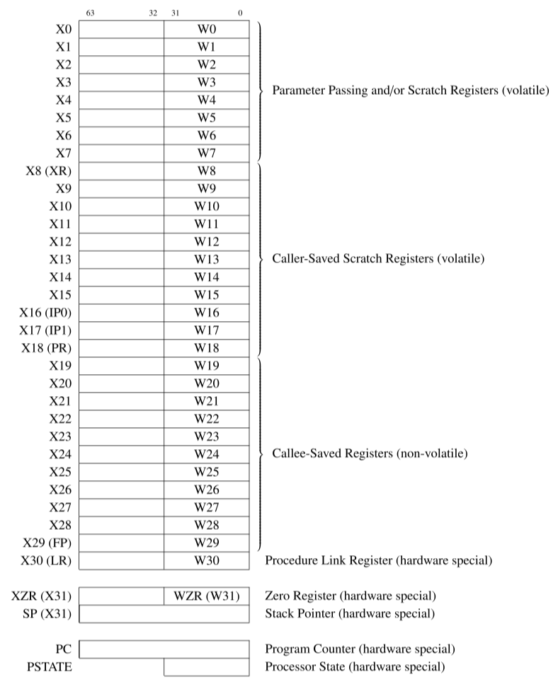

The ISA is a contract between the hardware and the software. It defines the set of instructions and the set of registers that the hardware must support.

The most important components of the CPU are the registers, where data is stored, and the arithmetic and logic unit (ALU), where arithmetic and logical operations are performed on the data.

Arm® processors provide general-purpose and special-purpose registers. Some additional registers are available in privileged execution modes.

Registers which can be used freely are referred to as *volatile*, and registers which must be preserved or restored before returning are referred to as *non-volatile*.

<!-- more -->

## isa guide - Registers in AArch64

[Learn the architecture - A64 Instruction Set Architecture Guide](https://developer.arm.com/documentation/102374/latest)

- 6.Registers in AArch64 - general-purpose registers
- 7.Registers in AArch64 - other registers
- 8.Registers in AArch64 - system registers

### general-purpose registers

Most A64 instructions operate on registers. The architecture provides 31 general purpose registers. Each register can be used as a 64-bit `X` register (X0..X30), or as a 32-bit `W` register (W0..W30). These are two separate ways of looking at the *same* register. For example, this register diagram shows that `W0` is the bottom 32 bits of `X0`, and `W1` is the bottom 32 bits of `X1`:

<figure markdown="span">
    
    <figcaption>Figure 6-1 Register diagram</figcaption>
</figure>

For data processing instructions, the choice of X or W determines the size of the operation. Using `X` registers will result in 64-bit calculations, and using `W` registers will result in 32-bit calculations. This example performs a 32-bit integer addition:

```asm
ADD W0, W1, W2
```

This example performs a 64-bit integer addition:

```asm
ADD X0, X1, X2
```

When a `W` register is written, as seen in the example above, the top 32 bits of the 64-bit register are zeroed.

There is a *separate* set of 32 registers used for floating point and vector operations. These registers are 128-bit, but like the general-purpose registers, can be accessed in several ways. `Bx` is 8 bits, `Hx` is 16 bits and so on to `Qx` which is 128 bits.

<figure markdown="span">
    
    <figcaption>Figure 6-2 Register diagram</figcaption>
</figure>

### other registers

Here are some other registers in the A64 that you should know about:

- The zero registers, `XZR` and `WZR`, always read as 0 and ignore writes.

- You can use the stack pointer (`SP`) as the base address for loads and stores. You can also use the stack pointer with a limited set of data-processing instructions, but it is not a regular general purpose register. Armv8-A has multiple stack pointers, and each one is associated with a *specific* Exception level. When `SP` is used in an instruction, it means the current stack pointer. The guide to the exception model explains how the stack pointer is selected.

- `X30` is used as the Link Register and can be referred to as `LR`. Separate registers, `ELR_ELx`, are used for returning from exceptions. This is discussed in more detail in the guide to the exception model.

- The Program Counter (`PC`) is not a general-purpose register in A64, and it cannot be used with data processing instructions. The PC can be read using:

<figure markdown="span">
    [ARM Cortex-A Series Programmer's Guide for ARMv8-A](https://developer.arm.com/documentation/den0024/latest) | 4: ARMv8 Registers
    {: style="width:75%;height:75%"}
    <figcaption>Table 4-1 Special registers in AArch64</figcaption>
</figure>

```asm
ADR Xd, .
```

The `ADR` instruction returns the address of a label, calculated based on the current location. Dot (`.`) means ‘here’, so the shown instruction is returning the address of itself. This is equivalent to reading the `PC`. Some branch instructions, and some load/store operations, implicitly use the value of the `PC`.

!!! note "PC/SP distinction between A32 & A64"

    In the A32 and T32 instruction sets, the `PC` and `SP` are general purpose registers. This is not the case in A64 instruction set.

[Blue Fox: Arm Assembly Internals and Reverse Engineering](https://www.amazon.com/Blue-Fox-Assembly-Internals-Analysis/dp/1119745306) | Chapter 4 The Arm Architecture - The AArch64 Execution State - AArch64 Registers:

The only ordinary instructions that can read the `PC` are the following:

- Branch with link instructions (`BL`, `BLR`) that need to read the `PC` to store a return address in the link register (`LR`)
- Instructions for PC-relative address generation, such as `ADR` and `ADRP`, direct branches, and literal loads(`LDR` pseudo instruction).

## armasm guide - Registers in AArch64 state

[Arm Compiler armasm User Guide](https://developer.arm.com/documentation/dui0801/latest) | 5. Overview of AArch64 state

- 5.1 Registers in AArch64 state
- 5.3 Link registers
- 5.4 Stack Pointer register

Arm® processors provide general-purpose and special-purpose registers. Some additional registers are available in privileged execution modes.

In AArch64 state, the following registers are available:

- Thirty-one 64-bit general-purpose registers `X0`-`X30`, the bottom halves of which are accessible as `W0`-`W30`.
- Four stack pointer registers `SP_EL0`, `SP_EL1`, `SP_EL2`, `SP_EL3`.
- Three exception link registers `ELR_EL1`, `ELR_EL2`, `ELR_EL3`.
- Three saved program status registers `SPSR_EL1`, `SPSR_EL2`, `SPSR_EL3`.
- One program counter(`PC`).

!!! note "CPSR vs. PSTATE"

    In AArch64 state, there is no Current Program Status Register (`CPSR`).
    ALU flags stored in `PSTATE` and needs to be generated by a previous instruction such as a compare (`CMP`).
    The `PSTATE` register contains bits that indicate the status of the current process, including information about the results of previous operations.

All these registers are 64 bits wide except `SPSR_EL1`, `SPSR_EL2`, and `SPSR_EL3`, which are 32 bits wide.

Most A64 integer instructions can operate on either 32-bit or 64-bit registers. The register width is determined by the register identifier, where `W` means 32-bit and `X` means 64-bit. The names `Wn` and `Xn`, where *n* is in the range 0-30, refer to the same register. When you use the 32-bit form of an instruction, the upper 32 bits of the source registers are ignored and the upper 32 bits of the destination register are set to zero.

There is no register named `W31` or `X31`. Depending on the instruction, register 31 is either the stack pointer or the zero register. When used as the stack pointer, you refer to it as `SP`. When used as the zero register, you refer to it as `WZR` in a 32-bit context or `XZR` in a 64-bit context.

<figure markdown="span">
    [ARM Cortex-A Series Programmer's Guide for ARMv8-A](https://developer.arm.com/documentation/den0024/latest) | 4: ARMv8 Registers:

    {: style="width:80%;height:80%"}
    <figcaption>Figure 4-3 AArch64 special registers</figcaption>

    {: style="width:80%;height:80%"}
    <figcaption>Table 4-2 Special registers by Exception level</figcaption>
</figure>

## ARM 64-Bit Assembly Language

[ARM 64-Bit Assembly Language](https://www.amazon.com/64-Bit-Assembly-Language-Larry-Pyeatt/dp/0128192216/), Larry D Pyeatt & William Ughetta, 2019

### User Program Registers

3 Load/store and branch instructions - 3.2 AArch64 user registers:

As shown in Fig. 3.2, the AArch64 ISA provides 31 general-purpose registers, which are called `X0` through `X30`. These registers can each store 64 bits of data. To use all 64 bits, they are referred to as `x0` through `x30` (capitalization is optional). To use only the lower (least significant) 32 bits, they are referred to as `w0`-`w30`. Since each register has a 64-bit name and a 32-bit name, we use `R0` through `R30` to specify a register without specifying the number of bits. For example, when we refer to `R12`, we are really referring to either `x12` or `w12`.

<figure markdown="span">
    {: style="width:80%;height:80%"}
    <figcaption>Figure 3.2: AArch64 general purpose registers and special registers</figcaption>
</figure>

5 Structured programming - 5.4 Subroutines - 5.4.4 Passing parameters:

These programming conventions are simply a set of *rules* for how registers should be used. In AArch64 assembly, all of the registers have alternate names that can be used to help remember the rules for using them. Fig. 5.1 shows an expanded view of the AArch64 registers, including their alternate names and conventional use.

<figure markdown="span">
    {: style="width:80%;height:80%"}
    <figcaption>Figure 5.1: AArch64 User Program Registers</figcaption>
</figure>

### volatile vs. non-volatile

The argument registers, `x0`-`x7`, are considered to be ***volatile***, because their contents can change whenever a subroutine is called. If the contents are needed after the subroutine call, then they must be saved either to a *non-volatile* register or to the stack before the subroutine is called.

Registers `x8`-`x17` are used for holding local *variables* in a subroutine. These registers are also considered to be ***volatile***. Some of these registers are used for special purposes by the operating system and/or compiler. From the perspective of the programmer who is writing a user-level program, the special purposes are not important.

Registers `x19`-`x28` can also be used for holding local variables. However, before using them, the subroutine must **save** their contents (usually on the stack) and their contents must be **restored** before the subroutine exits. These registers are considered ***non-volatile*** because their contents will not be changed by a subroutine call. More precisely, the subroutine may use them, but it will restore their contents before it returns.

!!! note "volatile vs. non-volatile in a nutshell"

    Registers which can be used freely are referred to as ***volatile***, and registers which must be preserved or restored before returning are referred to as ***non-volatile***.

    - registers `x0`-`x18` are *volatile*,
    - registers `x19`-`x29` are *non-volatile* (they can be used, but their contents *must* be restored to their original value before the function returns),
    - register `x30` can be used by the function, but its contents must be saved so that they can be loaded into the program counter, which will cause the function to return to its caller.
