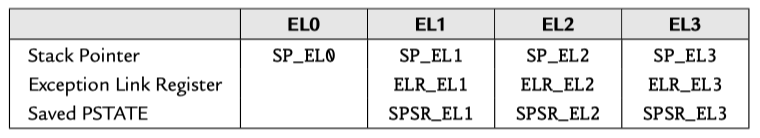
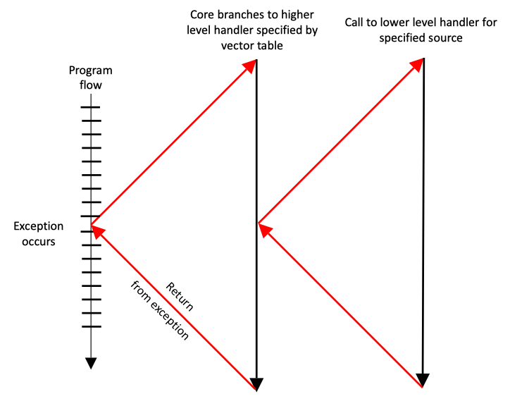

Software interrupts, or *SVCs* as they are now known, are generated by using the ARM instruction [SVC](https://developer.arm.com/documentation/ddi0602/2024-03/Base-Instructions/SVC--Supervisor-Call-?lang=en). This causes an exception to be taken, and forces the processor into Supervisor mode, which is privileged. A user program can request services from an operating system through such exception handling mechanisms.[^1]

<!-- more -->

## AArch64 exception levels

[ARM 64-Bit Assembly Language](https://www.amazon.com/64-Bit-Assembly-Language-Larry-Pyeatt/dp/0128192216/) | 12.2 AArch64 execution and exception states

The AArch64 processor provides two major modes of operation, referred to as *execution states*. They are 32-bit AArch32 state, and 64-bit AArch64 state. Both of these execution states provide privileged modes and a user mode. The AArch32 execution state allows the processor to execute code written for the ARMv7 and older processors.

<figure markdown="span">
    {: style="width:80%;height:80%"}
    <figcaption>Table 12.1 : The ARM User and System Registers</figcaption>
</figure>

In the AArch64 execution state, there are three privileged modes and one user mode. These are referred to as exception levels. The higher the exception level, the more privilege the code has. Typically, the system uses the exception levels as follows:

- `EL0` User applications, 
- `EL1` OS kernel and other privileged code, 
- `EL2` Hypervisor (support for virtual machines), and 
- `EL3` Secure monitor (manage security contexts).

The major difference between `EL0` and the higher levels is that code executing in `EL0` cannot access system registers. `EL1` can access most system registers, `EL2` has additional privileges, and `EL3` has all privileges. The only way that the processor can change from one exception level to a higher level is when an *exception* occurs. The only way that the processor can move to a lower exception level is by executing an exception *return* instruction. When changing the exception level, it is also possible to switch between AArch64 and AArch32 execution state. The processor also supports two security states: *Secure* and *non-secure*. `EL3` is meant to manage the security state, and `EL2` is meant to provide virtual machine capabilities. In many situations, only `EL0` and `EL1` are required, and some processors may not provide `EL2` and/or `EL3`. On power-up and on reset, the processor enters the highest available exception level.

Each exception level has its own stack pointer, link register, and saved process state register (SPSR). Table 12.1 shows the names of these banked registers. When the exception level changes, the corresponding link register and stack pointer become active, and “replace” the user stack pointer and link register.

[Learn the architecture - Introducing Arm Confidential Compute Architecture](https://developer.arm.com/documentation/den0125/0300/Device-Assignment--DA--and-Memory-Encryption-Contexts--MEC-):

<figure markdown="span">
    
</figure>

[Mixed-safety Systems Using Multicore SoCs With Hypervisors and Multicore Frameworks](https://www.allaboutcircuits.com/industry-articles/mixed-safety-systems-using-multicore-socs-with-hypervisors-and-multicore-frameworks/)

<figure markdown="span">
    
</figure>

## A64 system calls

Each user-mode process operates in isolation from other code on the system, with no direct visibility of the code or data of other processes or of the operating system kernel itself, and user-mode processes have no direct access to device hardware, unless explicitly authorized by the operating system kernel. When user-mode programs do have a specific need to **interact** with other processes, access files, and other system resources, or to interact with hardware, they must do so via OS-provided APIs in the form of so-called system calls, or ***syscalls***.[^2]

In Armv8-A, a user-mode process invokes a system call to request a service provided by the kernel using the supervisor call (`SVC`) instruction. This instruction causes the processor to issue an SVC exception, which causes the process to suspend and immediately transition control to the kernel’s registered SVC handler in kernel mode. The kernel can then decode which system call was requested and invoke the corresponding kernel-mode routine to service the request. Once the system call routine is complete, the result of the system call is relayed back to the process, and the user-mode process resumes at the instruction immediately following the SVC instruction that triggered the request.

### A64 Instruction Set Architecture

[Learn the architecture - A64 Instruction Set Architecture Guide](https://developer.arm.com/documentation/102374/latest) | 28. System calls

Sometimes it is necessary for software to request a function from a more *privileged* entity. This might happen when, for example, an application requests that the OS opens a file.

In A64, there are special instructions for making such system calls. These instructions cause an exception, which allows controlled entry into a more *privileged* Exception level.

- `SVC` Supervisor call causes an exception targeting `EL1`. Used by an application to call the OS.
- `HVC` Hypervisor call causes an exception targeting `EL2`. Used by an OS to call the hypervisor, not available at `EL0`.
- `SMC` Secure monitor call causes an exception targeting `EL3`. Used by an OS or hypervisor to call the `EL3` firmware, not available at `EL0`.

If an exception is executed from an Exception level higher than the target exception level, then the exception is taken to the current Exception level. This means that an `SVC` at `EL2` would cause exception entry to `EL2`. Similarly, an `HVC` at `EL3` causes exception entry to `EL3`. This is consistent with the rule that an exception can never cause the processor to lose privilege.

### Programmer's Guide for ARMv8-A

[ARM Cortex-A Series Programmer's Guide for ARMv8-A](https://developer.arm.com/documentation/den0024/latest)

6.5 System control and other instructions - 6.5.1 Exception handling instructions

There are three exception handling instructions whose purpose it is to cause an exception to be taken. These are used to make a call to code that runs in a higher Exception level in the OS (`EL1`), the Hypervisor (`EL2`), or Secure Monitor (`EL3`):

- `SVC #imm16` // Supervisor call, allows application program to call the kernel // (EL1).
- `HVC #imm16` // Hypervisor call, allows OS code to call hypervisor (EL2).
- `SMC #imm16` // Secure Monitor call, allows OS or hypervisor to call Secure // Monitor (EL3).

The immediate value is made available to the handler in the *Exception Syndrome Register*. This is a change from ARMv7, where the immediate value had to be determined by reading the opcode of the calling instruction. See Chapter 10 AArch64 Exception Handling for further information.

To return from an exception, use the `ERET` instruction. This instruction restores processor state by copying `SPSR_ELn` to PSTATE and branches to the saved return address in `ELR_ELn`.

---

10: AArch64 Exception Handling - Exception generating instructions

Execution of certain instructions can generate exceptions. Such instructions are typically executed to request a service from software that runs at a higher privilege level:

- The Supervisor Call (`SVC`) instruction enables User mode programs to request an OS service.
- The Hypervisor Call (`HVC`) instruction enables the guest OS to request hypervisor services.
- The Secure monitor Call (`SMC`) instruction enables the Normal world to request Secure world services.

If the resulting exception was generated as a result of an instruction fetch at `EL0`, it is taken as an exception to `EL1`, unless the `HCR_EL2`.TGE bit is set in the Non-secure state, in which case it is taken to `EL2`.

If the exception was generated as a result of an instruction fetch at any other Exception level, the Exception level remains unchanged.

Earlier in the book, we saw that the ARMv8-A architecture has four Exception levels. Processor execution can only move between Exception levels by taking, or returning from, an exception. When the processor moves from a higher to a lower Exception level, the execution state can stay the same, or it can switch from AArch64 to AArch32. Conversely, when moving from a lower to a higher Exception level, the execution state can stay the same or switch from AArch32 to AArch64.

<figure markdown="span">
    <!-- https://documentation-service.arm.com/static/5fbd26f271eff94ef49c7002 -->
    {: style="width:80%;height:80%"}
    <figcaption>Figure 10.1. Exception flow</figcaption>
</figure>

Figure 10-1 shows schematically the program flow associated with an exception occurring when running an application. The processor branches to a vector table which contains entries for each exception type. The vector table contains a dispatch code which typically identifies the cause of the exception, and select and call the appropriate function to handle it. This code completes execution and then return to the high-level handler which then executes the ERET instruction to return to the application.

---

10.2 Synchronous and asynchronous exceptions

10.2.3 System calls

Some instructions or system functions can only be carried out at a *specific* Exception level. If code running at a lower Exception level needs to perform a privileged operation, for example, when application code requests functionality from the kernel. One way to do this is by using the `SVC` instruction. This allows applications to **generate** an exception. Parameters may be passed in registers, or coded within the System call.

10.2.4 System calls to EL2/EL3

We saw earlier how `SVC` may be used to call from user applications at `EL0` to the kernel at `EL1`. The `HVC` and `SMC` system call instructions move the processor in a similar fashion to `EL2` and `EL3`. When the processor is executing at `EL0` (Application), it cannot call directly into the hypervisor (`EL2`) or Secure monitor (`EL3`). This is only possible from `EL1` and above. Applications must therefore use `SVC` to call into kernel and allow the kernel to call into higher Exception levels on their behalf.

From the OS kernel (`EL1`), software can call the hypervisor (`EL2`) with the `HVC` instruction, or call the Secure monitor (`EL3`) with the SMC instruction. If the processor is implemented with `EL3`, the ability to have `EL2` trap `SMC` instructions from `EL1` is provided. If there is no `EL3`, the `SMC` is unallocated and triggers at the current Exception level.

Similarly, from hypervisor code (`EL2`), the program can call the Secure monitor (`EL3`) with the SMC instruction. If you make an `SVC` call when in `EL2` or `EL3` it will still cause a synchronous exception at the same Exception level, and the handler for that Exception level can decide how to respond.

---

10.3 Changes to execution state and Exception level caused by exceptions

When an exception is taken, the processor may change execution state (from AArch64 to AArch32) or stay in the same execution state. For example, an external source may generate an IRQ (interrupt) exception while executing an application running in AArch32 mode and then execute the IRQ handler within the OS Kernel running in AArch64 mode.

Consider an application running in `EL0`, which is interrupted by an IRQ as in Figure 10-5. The Kernel IRQ handler runs at `EL1`. The processor determines which execution state to set when it takes the IRQ exception.

<figure markdown="span">
    
    <figcaption>Figure 10.5. Exception to EL1</figcaption>
</figure>

## linux syscall conventions

[What is the interface for ARM system calls and where is it defined in the Linux kernel?](https://stackoverflow.com/questions/12946958/what-is-the-interface-for-arm-system-calls-and-where-is-it-defined-in-the-linux)

[syscall(2) - Linux manual page](https://man7.org/linux/man-pages/man2/syscall.2.html#NOTES) - Architecture calling conventions

[Chromium OS Docs - Linux System Call Table](https://chromium.googlesource.com/chromiumos/docs/+/master/constants/syscalls.md#arm64-64_bit)

- [Linux System Calls quick and easy](https://syscall.sh/)
- [Linux system calls table for several architectures](https://gpages.juszkiewicz.com.pl/syscalls-table/syscalls.html)

arch    | syscall NR | return | arg0 | arg1 | arg2 | arg3 | arg4 | arg5
--------|------------|--------|------|------|------|------|------|-----
arm     | r7         | r0     | r0   | r1   | r2   | r3   | r4   | r5
arm64   | x8         | x0     | x0   | x1   | x2   | x3   | x4   | x5
x86     | eax        | eax    | ebx  | ecx  | edx  | esi  | edi  | ebp
x86_64  | rax        | rax    | rdi  | rsi  | rdx  | r10  | r8   | r9

[Programming with 64-Bit ARM Assembly Language: Single Board Computer Development for Raspberry Pi and Mobile Devices](https://www.amazon.com/Programming-64-Bit-ARM-Assembly-Language/dp/1484258800/) | Chapter 7: Linux Operating System Services - Calling Convention

The calling convention for system calls is different from that for functions. It uses a software interrupt to switch context from our user-level program to the context of the Linux kernel.

The calling convention is

1. `X0–X7`: Input parameters, up to eight parameters for the system call.
2. `X8`: The Linux system call number.
3. Call software interrupt 0 with `SVC 0`.
4. `X0`: The return code from the call.

> `SVC 0` command that executes software interrupt number 0. This branches to the interrupt handler in the Linux kernel, which interprets the parameters we’ve set in various registers and does the actual work.[^3]

The software interrupt is a clever way for us to call routines in the Linux kernel without knowing where they are stored in memory. It also provides a mechanism to run at a higher security level while the call executes.

We know 93 is the Linux system call number for exit and 64 is the number for write to a file. These seem rather cryptic. Where do we look these up? Can’t we use something symbolic in our programs rather than these magic numbers? The Linux system call numbers are defined in the C include file: [/usr/include/asm-generic/unistd.h](https://github.com/torvalds/linux/blob/ea5f6ad9ad9645733b72ab53a98e719b460d36a6/include/uapi/asm-generic/unistd.h)

In this file, there are define statements such as the following:

```c title="/usr/include/asm-generic/unistd.h"
/* fs/read_write.c */
#define __NR_write 64

/* kernel/exit.c */
#define __NR_exit 93
```

This defines the symbol `__NR_write` to represent the magic number 64 for the Linux system call [write](https://man7.org/linux/man-pages/man2/write.2.html), and 93 for [exit](https://man7.org/linux/man-pages/man2/_exit.2.html).

## aarch64-linux svc 0

Request Linux service to write a string of bytes/characters to the standard output device.

=== "svc64.s"

    ```asm linenums="1"
            .text
            .align 2

            // syscall NR defined in /usr/include/asm-generic/unistd.h
            .equ    __NR_write, 64       // 0x40
            .equ    __NR_exit, 93        // 0x5d
            .equ    __STDOUT, 1

            .global  _start              // Provide program starting address to linker
    _start:
            mov     x0, #__STDOUT        // target fd=stdout (standard output, i.e., monitor)
            ldr     x1, =msgtxt          // Set x1 pointing to message to be displayed
            mov     x2, #10              // Number of bytes in message
            mov     x8, #__NR_write      // Linux service command code to write string.
            svc     0                    // Issue command to display string on stdout
            mov     x0, #0               // Exit Status code 0 for "normal completion"
            mov     x8, #__NR_exit       // Service command code to terminate this program
            svc     0                    // Issue Linux command to terminate program
            .data
    msgtxt: .ascii  "Hey there\n"        // 10 character message (blank and In each count as 1 char.)
            .end
    ```

=== "equivalent svc64.c"

    ```c
    #include <stdio.h>

    int main(int argc, char *argv[])
    {
        puts("Hey there");

        return 0;
    }
    ```

Compile, link and run in rpi3b-ubuntu/aarch64:

```Shell
# compile assembly to object
$ as svc64.s -o svc64.o
# link object to executable binary
$ ld svc64.o -o svc64
# execute binary
$ ./svc64
Hey there

# cc svc64.c -o svc64 && ./svc64
```

## references

[Linux system call flow in ARM64](https://embeddedvenkatpari.blogspot.com/2022/03/linux-system-call-flow-in-arm64.html)
[Longterm Security - A Samsung RKP Compendium](https://blog.longterm.io/samsung_rkp.html)
[STBEAT: Software Update on Trusted Environment Based on ARM TrustZone](https://www.researchgate.net/publication/364706816_STBEAT_Software_Update_on_Trusted_Environment_Based_on_ARM_TrustZone)

[^1]:[ARM Assembly Language: Fundamentals and Techniques, 2nd Edition](https://www.oreilly.com/library/view/arm-assembly-language/9781482229851/) | Chapter 14: Exception Handling : ARM7TDMI - 14.8 PROCEDURES FOR HANDLING EXCEPTIONS - 14.8.5 SVCs

[^2]:[Blue Fox: Arm Assembly Internals and Reverse Engineering](https://www.amazon.com/Blue-Fox-Assembly-Internals-Analysis/dp/1119745306) | Chapter 3 OS Fundamentals - OS Architecture Overview - User Mode vs. Kernel Mode, System Calls

[^3]: [Programming with 64-Bit ARM Assembly Language](https://www.amazon.com/Programming-64-Bit-ARM-Assembly-Language/dp/1484258800/) | Chapter 1: Getting Started - Hello World - Assembly Instructions
