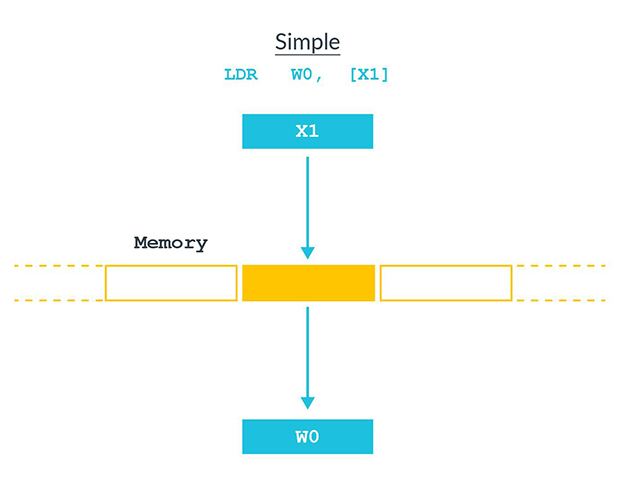
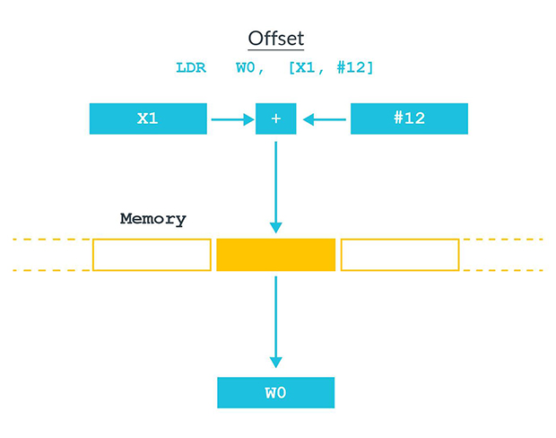
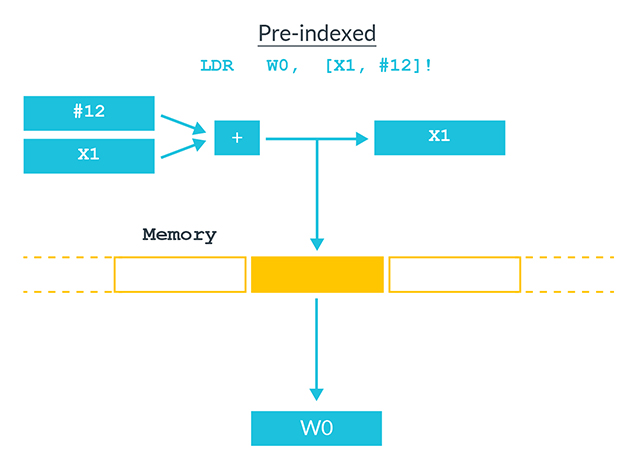
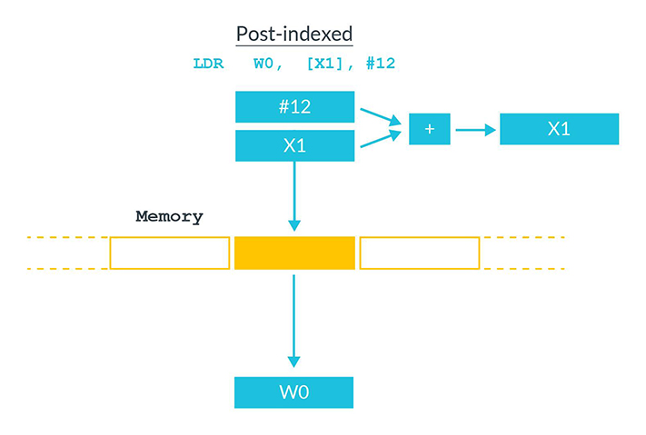

In this article, we'll comb through the Load/Store addressing modes based on offset and index in ARM(A32/A64).

There are three fundamental addressing modes in AArch64 instructions: register offset, immediate offset, and literal.

For information about addressing modes, see [Load/Store addressing modes](https://developer.arm.com/documentation/ddi0487/latest).

<!-- more -->

[ARM 64-Bit Assembly Language](https://www.amazon.com/64-Bit-Assembly-Language-Larry-Pyeatt/dp/0128192216/) | 3 Load/store and branch instructions - 3.3 Instruction components - 3.3.3 Addressing modes
[Arm Assembly Internals and Reverse Engineering](https://www.amazon.com/Blue-Fox-Assembly-Internals-Analysis/dp/1119745306) | Chapter 6 Memory Access Instructions - Addressing Modes and Offset Forms

The AArch64 architecture has a strict separation between instructions that perform computation and those that move data between the CPU and memory. Computational instructions can only modify registers, not main memory. Because of this separation between load/store operations and computational operations, it is a classic example of a ***load-store*** architecture.

All *computational* instructions assume that the registers already contain the data. *Load* instructions are used to move data from memory into the registers, and *store* instructions are used to move data from the registers to memory.

## armasm

Memory Access/Data Transfer Instructions.

[ARM Compiler armasm Reference Guide](https://developer.arm.com/documentation/dui0802/latest)

- 3: A32 and T32 Instructions - 3.3 Memory access instructions
- 5: A64 General Instructions
- 6: A64 Data Transfer Instructions

[Arm Compiler armasm User Guide](https://developer.arm.com/documentation/dui0801/latest)

7\. Writing A32/T32 Assembly Language - 7.19 Memory accesses

17\. A64 General Instructions

- Table 17-1: Summary of A64 general instructions

18\. A64 Data Transfer Instructions

- Table 18-1: Summary of A64 data transfer instructions

### addressing modes

7.19 Memory accesses

Many load and store instructions support different addressing modes.

**Offset addressing**

The offset value is *applied* to an address obtained from the base register. The result is used as the address for the memory access. The base register is *unchanged*. The assembly language syntax for this mode is:

```asm
[Rn, offset]
```

**Pre-indexed addressing**

The offset value is *applied* to an address obtained from the base register. The result is used as the address for the memory access, and *written back* into the base register. The assembly language syntax for this mode is:

```asm
[Rn, offset]!
```

**Post-indexed addressing**

The address obtained from the base register is used, *unchanged*, as the address for the memory access. The offset value is applied to the address, and *written back* into the base register. The assembly language syntax for this mode is:

```asm
[Rn], offset
```

In each case, `Rn` is the base register and *offset* can be:

- An immediate constant.
- An index register, `Rm`.
- A shifted index register, such as `Rm`, LSL *#shift*.

### LDR/STR

[LDR (literal)](https://developer.arm.com/documentation/ddi0602/latest/Base-Instructions/LDR--literal---Load-Register--literal--): Load Register (literal).
[LDR (register)](https://developer.arm.com/documentation/ddi0602/latest/Base-Instructions/LDR--register---Load-Register--register--): Load Register (register).
[LDR (immediate)](https://developer.arm.com/documentation/ddi0602/latest/Base-Instructions/LDR--immediate---Load-Register--immediate--): Load Register (immediate).

Load Register (immediate) loads a word or doubleword from memory and writes it to a register. The address that is used for the load is **calculated** from a *base* register and an immediate *offset*. The Unsigned offset variant **scales** the immediate offset value by the size of the value accessed *before* adding it to the base register value.

It has encodings from 3 classes: *Post-index*, *Pre-index* and *Unsigned offset*.

[STR (register)](https://developer.arm.com/documentation/ddi0602/latest/Base-Instructions/STR--register---Store-Register--register--): Store Register (register).
[STR (immediate)](https://developer.arm.com/documentation/ddi0602/latest/Base-Instructions/STR--immediate---Store-Register--immediate--): Store Register (immediate).

Store Register (immediate) stores a word or a doubleword from a register to memory. The address that is used for the store is **calculated** from a *base* register and an immediate *offset*.

It has encodings from 3 classes: *Post-index*, *Pre-index* and *Unsigned offset*.

### STP/LDP

[STP](https://developer.arm.com/documentation/ddi0602/latest/Base-Instructions/STP--Store-Pair-of-Registers-): Store Pair of Registers.

Store **Pair** of Registers calculates an address from a base register value and an immediate offset, and stores two 32-bit words or two 64-bit doublewords to the calculated address, from two registers.

It has encodings from 3 classes: *Post-index*, *Pre-index* and *Signed offset*.

[LDP](https://developer.arm.com/documentation/ddi0602/latest/Base-Instructions/LDP--Load-Pair-of-Registers-): Load Pair of Registers.

Load **Pair** of Registers calculates an address from a base register value and an immediate offset, loads two 32-bit words or two 64-bit doublewords from memory, and writes them to two registers.

It has encodings from 3 classes: *Post-index*, *Pre-index* and *Signed offset*.

## ISA guide

[A64 Instruction Set Architecture Guide](https://developer.arm.com/documentation/102374/latest/)

18. Loads and stores - addressing
19. Loads and stores - load pair and store pair

### ldr addressing

The addresses for load and store instructions appear within the square brackets, as shown in this example:

```asm
LDR W0, [X1]
```

There are several **addressing modes** that define how the address is formed.

**Base register** - The simplest form of addressing is a single register. Base register is an X register that contains the full, or absolute, virtual address of the data being accessed, as you can see in this figure:


<!--  -->

Offset addressing modes - An offset can be applied optionally to the base address, as you can see in this figure:


<!--  -->

In the preceding figure, `X1` contains the base address and `#12` is a byte offset from that address. This means that the accessed address is `X1+12`. The offset can be either a constant or another register. This type of addressing might be used for structs, for example. The compiler maintains a pointer to the base of struct using the offset to select different members.

Pre-index addressing modes - In the instruction syntax, pre-indexing is shown by adding an exclamation mark `!` after the square brackets, as this figure shows:


<!--  -->

Pre-indexed addressing is like offset addressing, except that the base pointer is updated as a result of the instruction. In the preceding figure, `X1` would have the value `X1+12` after the instruction has completed.

Post-index addressing modes - With post-index addressing, the value is loaded from the address in the base pointer, and then the pointer is updated, as this figure shows:


<!--  -->

Post-index addressing is useful for popping off the stack. The instruction loads the value from the location pointed at by the stack pointer, and then moves the stack pointer on to the next full location in the stack.

### load/store pair

So far, we have discussed the load and store of a single register. A64 also has load (`LDP`) and store pair (`STP`) instructions.

These `LDP` and `STP` pair instructions transfer two registers to and from memory. Registers are processed in operand order, from left-to-right. That is, the first register operand is loaded or stored first, and the second register operand is loaded or stored next.

Consider the following examples.

The first instruction loads `[X0]` into `W3`, and loads `[X0 + 4]` into `W7`:

```asm
LDP        W3, W7, [X0]
```

This second instruction stores `D0` to `[X4]` and stores `D1` to `[X4 + 8]`:

```asm
STP        D0, D1, [X4]
```

Load and store pair instructions are often used for pushing, and popping off the stack. This first instruction pushes `X0` and `X1` onto the stack:

```asm
STP        X0, X1, [SP, #-16]!
```

This second instruction pops `X0` and `X1` from the stack:

```asm
LDP        X0, X1, [SP], #16
```

Remember that in AArch64 the stack-pointer(X29/FP?) must be 128-bit aligned.

### Index modes

[ARM Cortex-A Series Programmer's Guide for ARMv8-A](https://developer.arm.com/documentation/den0024/latest) | Chapter 8 Porting to A64

There are some changes to the available addressing modes for load and store instructions. The offset, pre-index and post-index forms from A32 and T32 are still available in A64. There is a new, PC-relative addressing mode, as the PC cannot be accessed in the same way as a general-purpose register.

**Index modes** are similar to offset modes, but they also update the base register. The syntax is the same as in A32 and T32, but the set of operations is more restrictive. Usually, *only* immediate offsets can be provided for index modes.

There are two variants: `pre-index` modes which apply the offset before accessing the memory, and `post-index` modes which apply the offset after accessing the memory.

Table 6-9 Index addressing modes:

Example instruction       | Description
--------------------------|--------------------------------------------------------------------------------------
`LDR X0, [X1, #8]!`       | Pre-index: Update X1 first (to X1 + #8), then load from the new address
`LDR X0, [X1], #8`        | Post-index: Load from the unmodified address in X1 first, then update X1 (to X1 + #8)
`STP X0, X1, [SP, #-16]!` | Push X0 and X1 to the stack.
`LDP X0, X1, [SP], #16`   | Pop X0 and X1 off the stack.

## refs

[ABI & Calling conventions](../cs/calling-convention.md)
[Register file of ARM64](./a64-regs.md)
[ARM LDR literal and pseudo-instruction](./arm-ldr.md) & [demo](./arm-ldr-demo.md)
