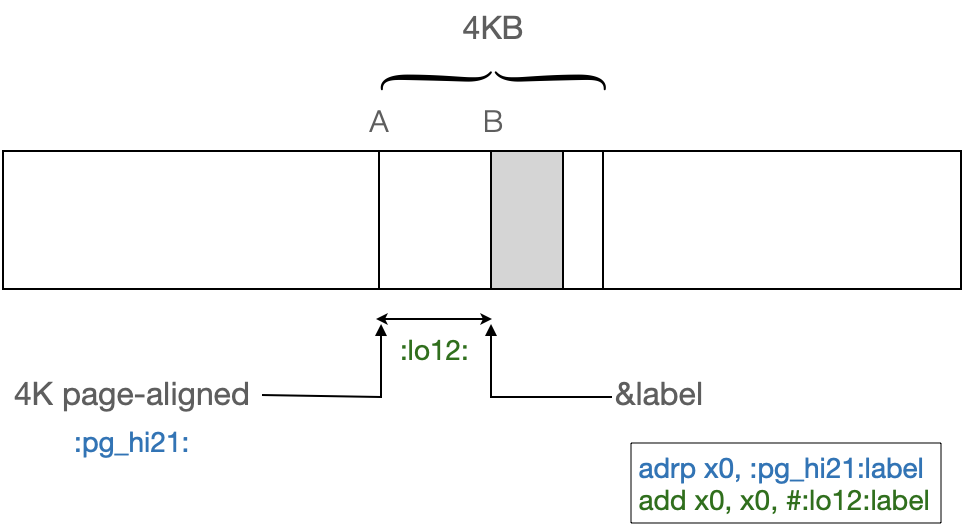

In the previous two articles([ARM ADR (PC-relative)](./arm-adr-ldr.md) & [ARM ADRP and ADRL pseudo-instruction](./arm-adrp-adrl.md)), we've combed AMR `ADR` instructions to load a pc-relative label address to a register.

Here we collect some enlightening demos from some classic textbooks to consolidate knowledge that is not solid.

<!-- more -->

## ADR vs. ADRP

[ARM 64-Bit Assembly Language](https://www.amazon.com/64-Bit-Assembly-Language-Larry-Pyeatt/dp/0128192216/)

3 Load/store and branch instructions - 3.5 Branch instructions - 3.5.5 Form PC-relative address

These instructions are used to calculate the address associated with a label:

- `adr`: Form PC-Relative Address
- `adrp`: Form PC-Relative Address to 4 KB Page

They are more efficient than the `ldr Rx,=label` pseudo instruction, because they can calculate a 64-bit address in one or two instructions without performing a memory access. They can be used to load any address that is *within* range. If the label is out of range, then the assembler or linker will emit an error, and the programmer can change their code to use the `ldr Rx,=label` syntax.

**Syntax**

```asm
<op> Rd, <label> // <op> is either adr or adrp.
```

- `adr` has a range of ±1 MB. (21 bit immediate).
- `adrp` has a range of ±4 GB to the nearest 4 KB page (4096 bytes). The 21-bit immediate is *shifted* left by 12 bits and added to the pc.

    - The lower 12 bits of a label's address can be added to `adrp` to exactly **address** a label.

**Operations**

Name   | Effect | Description
-------|--------|------------
`adr`  | Rd ← Address of label          | Load address with pc-relative immediate addressing.
`adrp` | Rd ← Page address of label     | Load address of the beginning of the 4-Kilobyte memory page which contains the label using pc-relative immediate addressing.

## ADRL=ADRP+ADD

In A64, `ADRL` assembles to two instructions, an `ADRP` followed by `ADD`.

[ARM relocation generation](https://sourceware.org/binutils/docs/as/ARM_002dRelocations.html) / [AArch64-Relocations](https://sourceware.org/binutils/docs/as/AArch64_002dRelocations.html)

- [assembly - AArch64 relocation prefixes - Stack Overflow](https://stackoverflow.com/questions/38570495/aarch64-relocation-prefixes)

Relocations for `ADRP`, and `ADD`, `LDR` or `STR` instructions can be generated by prefixing the label with ‘`:pg_hi21:`’ and ‘`#:lo12:`’ respectively.

<figure markdown="span">
    {: style="width:75%;height:75%"}
    <figcaption>ADRL = ADRP + ADD</figcaption>
</figure>

For example to use 33-bit (±4GB) pc-relative addressing to load the address of *foo* into `X0`:

```asm
    adrp x0, :pg_hi21:foo
    add  x0, x0, #:lo12:foo
```

Or to load the value of *foo* into `X0`:

```asm
    adrp x0, :pg_hi21:foo
    ldr  x0, [x0, #:lo12:foo]
```
Note that ‘`:pg_hi21:`’ is optional.

- `adrp x0, foo` is equivalent to `adrp x0, :pg_hi21:foo`

In Linux kernel for arm64, the assembler has defined some handy pseudo-op macros:

- [\[01/15\] ARM: assembler: introduce adr_l, ldr_l and str_l macros - Patchwork](https://patchwork.kernel.org/project/kvm/patch/20170805205222.19868-2-ard.biesheuvel@linaro.org/)

```asm title="arch/arm64/include/asm/assembler.h"
	/*
	 * @dst: destination register (32 or 64 bit wide)
	 * @sym: name of the symbol
	 * @tmp: optional 64-bit scratch register to be used if <dst> is a
	 *       32-bit wide register, in which case it cannot be used to hold
	 *       the address
	 */
	.macro	ldr_l, dst, sym, tmp=
	.ifb	\tmp
	adrp	\dst, \sym
	ldr	\dst, [\dst, :lo12:\sym]
	.else
	adrp	\tmp, \sym
	ldr	\dst, [\tmp, :lo12:\sym]
	.endif
	.endm

	/*
	 * @src: source register (32 or 64 bit wide)
	 * @sym: name of the symbol
	 * @tmp: mandatory 64-bit scratch register to calculate the address
	 *       while <src> needs to be preserved.
	 */
	.macro	str_l, src, sym, tmp
	adrp	\tmp, \sym
	str	\src, [\tmp, :lo12:\sym]
	.endm
```

## Examples

[Arm Assembly Internals and Reverse Engineering](https://www.amazon.com/Blue-Fox-Assembly-Internals-Analysis/dp/1119745306)

Chapter 11 Dynamic Analysis - Command-Line Debugging; Debugging a Memory Corruption
Chapter 12 Reversing arm64 macOS Malware - Background - macOS Hello World (arm64)

### ADRP farFarAway

[ARM 64-Bit Assembly Language](https://www.amazon.com/64-Bit-Assembly-Language-Larry-Pyeatt/dp/0128192216/)

3 Load/store and branch instructions - 3.5 Branch instructions - 3.5.5 Form PC-relative address

The range of `adr` is just as limited as an unconditional `b` or a `bl`. To address a label that is a greater distance away, yet within 4 GB in either direction, the `adrp` instruction can be used.

> For the ARM processor, the `.space` and `.skip` directives are equivalent. This directive is very useful for declaring large arrays in the `.bss` section.

```asm linenums="1" hl_lines="11-12"
        .bss
closeBy:
        .word 0x00000000
        .skip 4000000000 // reserve 4G memory, filled with zero
farFarAway:
        .word 0xffffffff
        .text
        .type main, %function
        .global main
main:
        adrp x0, farFarAway
        add x0, x0, #:lo12:farFarAway

        ret
        .size main, (. - main)
```

A special notation(`#:lo12:`) is used to add only the lowest 12 bits of the label to the `ADRP` address. This fully calculates the label address because the 4 KB page is addressable with 12 bits.

- `adrp x0, :pg_hi21:farFarAway`: 4K page-aligned boundary
- `add x0, x0, #:lo12:farFarAway`: offset within page

### gcc -S HelloWorld

I'll begin with our famous doorstep program -- HelloWorld.c.
It's commonplace but novice-friendly and worth using as a stepping stone.

```c title="helloworld.c"
#include <stdio.h>

int main(int argc, char *argv[])
{
    printf("Hello world from C!\n");

    return 0;
}
```

Next, invoke `GCC` to compile with the `-S` option to stop before assembling.
The `-fverbose-asm` option enriches the corresponding context information.

!!! note "GCC -S -fverbose-asm"

    GCC - [Overall Options](https://gcc.gnu.org/onlinedocs/gcc/Overall-Options.html)

    > `-S`: Stop after the stage of compilation proper; do not assemble. The output is in the form of an assembler code file for each non-assembler input file specified.

    GCC - [Options for Code Generation Conventions](https://gcc.gnu.org/onlinedocs/gcc/Code-Gen-Options.html)

    > `-fverbose-asm`: Put extra commentary information in the generated assembly code to make it more readable. This option is generally only of use to those who actually need to read the generated assembly code (perhaps while debugging the compiler itself).

Emit the result direct to stdout via `-o -` or specify output file(e.g. helloworld.s) and pipe it to cat. Anyway, it's completely your choice.

```bash linenums="1" hl_lines="30 31"
# gcc helloworld.c -S -fverbose-asm -o helloworld.s && cat ./helloworld.s
$ gcc helloworld.c -S -fverbose-asm -o -
	.arch armv8-a
	.file	"helloworld.c"
// GNU C17 (Ubuntu 11.4.0-1ubuntu1~22.04) version 11.4.0 (aarch64-linux-gnu)
//	compiled by GNU C version 11.4.0, GMP version 6.2.1, MPFR version 4.1.0, MPC version 1.2.1, isl version isl-0.24-GMP

// GGC heuristics: --param ggc-min-expand=91 --param ggc-min-heapsize=115878
// options passed: -mlittle-endian -mabi=lp64 -fasynchronous-unwind-tables -fstack-protector-strong -fstack-clash-protection
	.text
	.section	.rodata
	.align	3
.LC0:
	.string	"Hello world from C!"
	.text
	.align	2
	.global	main
	.type	main, %function
main:
.LFB0:
	.cfi_startproc
	stp	x29, x30, [sp, -32]!	//,,,
	.cfi_def_cfa_offset 32
	.cfi_offset 29, -32
	.cfi_offset 30, -24
	mov	x29, sp	//,
	str	w0, [sp, 28]	// argc, argc
	str	x1, [sp, 16]	// argv, argv
// helloworld.c:4:     printf("Hello world from C!\n");
	adrp	x0, .LC0	// tmp94,
	add	x0, x0, :lo12:.LC0	//, tmp94,
	bl	puts		//
// helloworld.c:6:     return 0;
	mov	w0, 0	// _3,
// helloworld.c:7: }
	ldp	x29, x30, [sp], 32	//,,,
	.cfi_restore 30
	.cfi_restore 29
	.cfi_def_cfa_offset 0
	ret	
	.cfi_endproc
.LFE0:
	.size	main, .-main
	.ident	"GCC: (Ubuntu 11.4.0-1ubuntu1~22.04) 11.4.0"
	.section	.note.GNU-stack,"",@progbits
```

Now take a close look at the generated assembly codes. Concentrate on the highlighted lines 30-31. It's a typical usage of `ADRL` which assembles to two instructions, an `ADRP` followed by `ADD`.

Their co-occurrence is for calculating the address of label `.LC0`, which resides in the `.rodata` section. It comes from the first parameter of `printf` and refers to a literal string of format-specifier.

```c
int printf(const char *format, ...);
```

Well, that's enough. Eating too much at once can lead to indigestion. Let's not get into it, just get acquainted at first time. A resuscitation, two back to familiar, three back when the teacher.

### C runtime data

[Programming with 64-Bit ARM Assembly Language](https://www.amazon.com/Programming-64-Bit-ARM-Assembly-Language/dp/1484258800/) | Chapter 15: Reading and Understanding Code - Code Created by GCC

Listing 15-3. Assembly code generated by the C compiler for our upper-case function

```asm linenums="1" hl_lines="3 5 13-14"
  0000000000000690 <main>:
    690:        agbf7bfd        stp     x29, x30, [sp, #-16]!
    694:        b0000080        adrp    x0, 11000 <_cxa_finalize
                                                    @GLIBC_2.17>
    698:        90000082        adrp    x2, 10000  <_FRAME_END_+Oxf588>
    69C:        910003fd        mov     x29, sp

    // ...

    6e8:        381ff080        sturb w0, [x4, #-1]
    6ec:        35fffe00        cbnz w0, 6ac <main+0x1c>
    6f0:        f947d42         ldr  x2, [x2, #4024]
    6f4:        90000000        adrp x0, 0 <_init-0x600>
    6f8:        91242000        add  x0, x0, #0×908
    6fc:        97ffffe1        bl   680 <printf@plt>
    700:        52800000        mov  w0, #0x0         // #0
    704:        a8c17bfd        ldp  x29, x30, [sp], #16
    708:        d65f03c0        ret
```

The compiler uses the `ADRP` instruction to load the values of pointers. We covered `ADR` in Chapter 5, “Thanks for the Memories”; `ADRP` works like `ADR`, *except* that it loads to a 4K page boundary. This means that it has a greater range than `ADR`, but for humans it's harder to use. The compiler must set it to a page boundary, which in this case points to C runtime data and then uses cumbersome offsets to get to the correct data. This is good for compilers, not so good for humans to code.

### PLT stub

`gcc helloworld.c` will generate `a.out`. It's kind of statically linked DYN PIE ELF, see [GCC Compilation Quick Tour - dynamic](../elf/gcc-compilation-dynamic.md), [DYN ELF Walkthrough](../elf/elf-dyn-tour.md) and [puts@plt - static analysis](../elf/plt-puts-analysis.md).

The following is the disassembly of the PLT stub `puts@plt` for dynamic-linking and lazy-loading symbol `libc/puts`.

```bash
# objdump -j .plt -d a.out
$ objdump --disassemble=puts@plt a.out

a.out:     file format elf64-littleaarch64


Disassembly of section .init:

Disassembly of section .plt:

0000000000000630 <puts@plt>:
 630:	90000090 	adrp	x16, 10000 <__FRAME_END__+0xf770>
 634:	f947e611 	ldr	x17, [x16, #4040]
 638:	913f2210 	add	x16, x16, #0xfc8
 63c:	d61f0220 	br	x17
 640:	Address 0x0000000000000640 is out of bounds.


Disassembly of section .text:

Disassembly of section .fini:
```

In r2, use `pxb` to hexdump 4 instructions in bytes/bits form after `dcu rsym.puts`.

```bash
# pf4d / pfedddd
[0xaaaadfbc0630]> pxW $l*4
0xaaaadfbc0630 0x90000090
0xaaaadfbc0634 0xf947e611
0xaaaadfbc0638 0x913f2210
0xaaaadfbc063c 0xd61f0220

[0xaaaadfbc0630]> pxb $l*4
0xaaaadfbc0630 1001_0000  0000_0000  0000_0000  1001_0000  0x90000090  ....
0xaaaadfbc0634 0001_0001  1110_0110  0100_0111  1111_1001  0x11e647f9  ..G.
0xaaaadfbc0638 0001_0000  0010_0010  0011_1111  1001_0001  0x10223f91  ."?.
0xaaaadfbc063c 0010_0000  0000_0010  0001_1111  1101_0110  0x20021fd6   ...

# bitstream of 32 bits
[0xaaaadfbc0630]> pb $l*8
10010000000000000000000010010000

# bitstream of 4 bytes for next inst
[0xaaaadfbc0630]> pB $l @ pc+4
00010001111001100100011111111001
```

We can analyse the instructions using [capstone-tool](https://www.capstone-engine.org/).

```bash title="cstool arm64 0x90000090"
# opcode fetched as LE, happens to be palindromic bytes
$ rax2 Bx90000090
10010000000000000000000010010000b

$ rasm2 -de -a arm 0x90000090
adrp x16, 0x10000
$ cstool arm64be 0x90000090
0  90 00 00 90  adrp	x16, #0x10000

$ cstool -d arm64be 0x90000090
0  90 00 00 90  adrp	x16, #0x10000
	ID: 20 (adrp)
	op_count: 2
		operands[0].type: REG = x16
		operands[0].access: WRITE
		operands[1].type: IMM = 0x10000
		operands[1].access: READ
	Registers modified: x16
```

In the AArch64 execution state, data accesses can be `LE` or `BE`, while instruction fetches are always `LE`.

```bash
# opcode fetched as LE, endianness swapped
# Rn=0b100000=16; Rt=0b10001=17
$ rax2 Bxf947e611
11111001010001111110011000010001b

# memory storage perspective:
# $ cstool arm64 $(rax2 -ke 0xf947e611)
#  0  11 e6 47 f9  ldr	x17, [x16, #0xfc8]

# endianness already swapped, just decode it as BE.
$ rasm2 -de -a arm 0xf947e611
ldr x17, [x16, 0xfc8]
$ cstool arm64be 0xf947e611
 0  f9 47 e6 11  ldr	x17, [x16, #0xfc8]

# memory storage perspective:
# cstool -d arm64 $(rax2 -ke 0xf947e611)

# opcode decode/bitset perspective:
$ cstool -d arm64be 0xf947e611
 0  f9 47 e6 11  ldr	x17, [x16, #0xfc8]
	ID: 162 (ldr)
	op_count: 2
		operands[0].type: REG = x17
		operands[0].access: WRITE
		operands[1].type: MEM
			operands[1].mem.base: REG = x16
			operands[1].mem.disp: 0xfc8
		operands[1].access: READ
	Registers read: x16
	Registers modified: x17
```

Or write a short Python snippet to make analysing intuitive.

```Python title="ADRP analysis.py"
opcode=0x90000090
#format(opcode, '032b')
#f'{opcode=:#032b}'

immlo_mask=(1<<30)|(1<<29)
# f'{immlo_mask=:032b}'
immhi_mask=(2**24-1)&(~(2**5-1))
# f'{immhi_mask=:032b}'

immlo=((opcode&immlo_mask)<<1)>>30
# f'immlo: {immlo=:02b}'
immhi=(opcode&immhi_mask)>>5
# f'immhi: {immhi=:019b}'

imm=(immhi<<2|immlo)<<12
f'{imm=:#8x}'
```

`imm= 0x10000` is the PC-relative literal that encoded in the ADRP instruction.

For practical run-time debugging status, see [reloc puts@plt via GOT - pwndbg](../elf/plt-puts-pwndbg.md) or [reloc puts@plt via GOT - r2 debug](../elf/plt-puts-r2debug.md).
