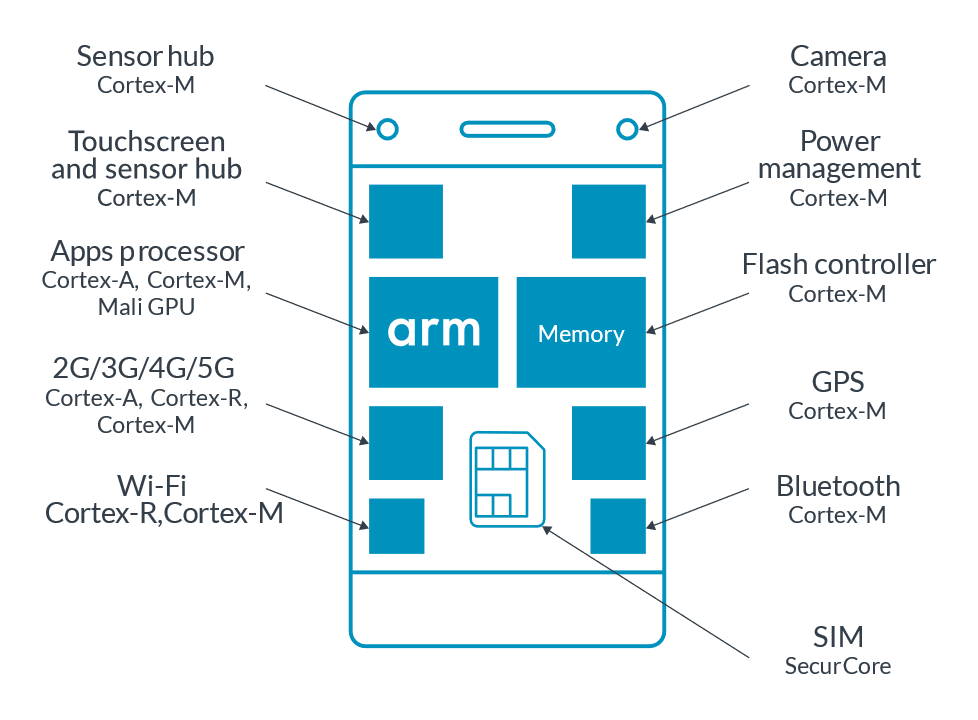
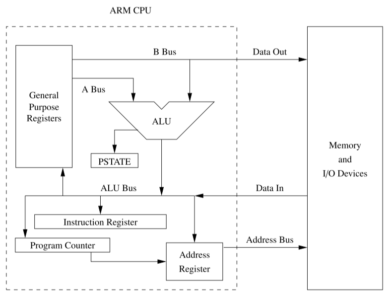

`ARM`'s original abbreviation was *Acorn RISC Machine*.

The cores and instruction sets used by ARM do not correspond one-to-one.

In November 1990, Acorn, Apple and VLSI jointly funded the creation of ARM. Acorn RISC Machine has also been officially renamed *Advanced RISC Machine*.

After ARM11, ARM processor cores no longer have the ARM prefix. But the word `ARM` has not disappeared from the Cortex series. The three major series of Cortex, *M-R-A*, together are ARM.

<!-- more -->

## profiles

[About the Arm architecture](https://developer.arm.com/documentation/102404/0201/About-the-Arm-architecture?lang=en)

- [A-Profile Architecture](https://developer.arm.com/Architectures/A-Profile%20Architecture)
- [R-Profile Architecture](https://developer.arm.com/Architectures/R-Profile%20Architecture)
- [M-Profile Architecture](https://developer.arm.com/Architectures/M-Profile%20Architecture)

The Arm architecture is one of the most popular processor architectures in the world. Billions of Arm-based devices are shipped every year.

The following table describes the three architecture profiles: `A`, `R`, and `M`:

**A**-Profile (Applications) | **R**-Profile (Real-Time) | **M**-Profile (Microcontroller)
-------------------------|-----------------------|----------------------------
High performance | Targeted at systems with real-time requirements | Small, highly power- efficient devices
Designed to run a complex operating system, such as Linux or Windows | Commonly found in networking equipment, and embedded control systems | Found at the heart of many IoT devices

These three profiles allow the Arm architecture to be tailored to the needs of different use cases, while still sharing several base features.

!!! note "Arm brands"

    Arm `Cortex` and Arm `Neoverse` are the brand names that are used for the Arm processor IP offerings. Our partners offer other processor brands using the Arm architecture.

<figure markdown="span">
    <!-- https://documentation-service.arm.com/static/64dcdf2a934840622b3496cf -->
    {: style="width:80%;height:80%"}
</figure>

This example smartphone contains the following processor types:

- An **A**-profile processor as the main CPU running a rich OS like Android.
- A cellular modem, based on an **R**-profile processor, provides connectivity.
- Several **M**-profile processors handle operations like system power management.
- The SIM card uses SecurCore, an M-profile processor with additional security features. SecurCore processors are commonly used in smart cards.

[Introduction to the Armv8-M Architecture and its Programmers Model User Guide](https://developer.arm.com/documentation/107656/0101/Introduction-to-Armv8-architecture-and-architecture-profiles):

The `Armv8` architecture has several different profiles. These profiles are variants of the architecture that target different markets and use cases. The Armv8-M architecture is one of these architecture profiles.

Arm defines three architecture profiles: Application (***A***), Real-time (***R***), and Microcontroller (***M***).

## aarch64

[AArch64](https://en.wikipedia.org/wiki/AArch64): `AArch64` or `ARM64` is the 64-bit extension of the ARM architecture family. It was first introduced with the ***Armv8-A*** architecture, and had many extension updates.

Announced in October 2011, **ARMv8-A** represents a fundamental change to the ARM architecture. It adds an optional 64-bit architecture, named "`AArch64`", and the associated new "`A64`" instruction set.

AArch64 provides user-space *compatibility* with the existing 32-bit architecture ("`AArch32`" / ARMv7-A), and instruction set ("`A32`"). The 16-32bit Thumb instruction set is referred to as "`T32`" and has no 64-bit counterpart.

ARMv8-A allows 32-bit applications to be executed in a 64-bit OS, and a 32-bit OS to be under the control of a 64-bit hypervisor.

!!! abstract "aapcs64 - Terms"

    [aapcs64](https://github.com/ARM-software/abi-aa/blob/2a70c42d62e9c3eb5887fa50b71257f20daca6f9/aapcs64/aapcs64.rst) - 2.2 Terms and abbreviations:

    `AArch32`: The 32-bit general-purpose register width *state* of the Armv8 architecture, broadly *compatible* with the Armv7-A architecture.
    `AArch64`: The 64-bit general-purpose register width state of the Armv8 architecture.

ARMv8-A includes the VFPv3/v4 and advanced SIMD (Neon) as standard features in both AArch32 and AArch64. It also adds cryptography instructions supporting AES, SHA-1/SHA-256 and finite field arithmetic.

<figure markdown="span">
    {: style="width:75%;height:75%"}
    <figcaption>A simplified conceptual view of the AArch64 architecture</figcaption>
</figure>

### Naming conventions

model | Arch | Spec | ISA | Suffixes
------|------|------|-----|---------
64 + 32 bit | AArch64 | ARMv8-A | A64 + A32 | v8-A
32 + 16 (Thumb) bit | AArch32 | ARMv8-R / ARMv7-A | A32 + T32 | -A32 / -R / v7-A.

[Differences between arm64 and aarch64](https://stackoverflow.com/questions/31851611/differences-between-arm64-and-aarch64)

Originally there was just the 32-bit architecture, called "ARM".

The ARMv8-A spec introduced a new 64-bit execution state called "AArch64", short for "Arm Architecture 64-bit", which is the official name. The official then retroactively renamed the old 32-bit architecture "AArch32".

"arm64" is an unofficial name some people use because the official name sucks.

It seems that ARM64 was created by Apple and AARCH64 by the others, most notably GNU/GCC guys.

```bash
# mbpa2991-macOS
$ arch
arm64

# rpi4b-ubuntu
$ arch
aarch64
```

The following commands is excerpted from [Arm GNU Toolchain](https://developer.arm.com/Tools%20and%20Software/GNU%20Toolchain) - [Downloads](https://developer.arm.com/downloads/-/arm-gnu-toolchain-downloads):

```bash
sudo apt install gcc-arm-none-eabi -y
# arm-linux-gnueabihf-gcc
sudo apt install gcc-arm-linux-gnueabihf -y
# aarch64-linux-gnu-gcc
sudo apt install gcc-aarch64-linux-gnu -y
```

The following section is taken from the online manual of the GAS:

- [ARM-Dependent (Using as)](https://sourceware.org/binutils/docs/as/ARM_002dDependent.html)
- [AArch64-Dependent (Using as)](https://sourceware.org/binutils/docs/as/AArch64_002dDependent.html)

### AArch64 features

***New instruction set, A64***:

- Has `31` general-purpose 64-bit registers.
- Has dedicated zero or stack pointer (`SP`) register (depending on instruction).
- The program counter (`PC`) is no longer directly accessible as a register.
- Instructions are still ==32== bits long and mostly the same as A32 (with LDM/STM instructions and most conditional execution dropped).

    - Has paired loads/stores (in place of LDM/STM).
    - No predication for most instructions (except branches).

- Most instructions can take 32-bit or 64-bit arguments.
- Addresses assumed to be 64-bit.

***Advanced SIMD (Neon) enhanced***:

- Has 32 × 128-bit registers (up from 16), also accessible via VFPv4.
- Supports double-precision floating-point format.
- Fully IEEE 754 compliant.
- AES encrypt/decrypt and SHA-1/SHA-2 hashing instructions also use these registers.

***A new exception system***: Fewer banked registers and modes.

***Memory translation*** from 48-bit virtual addresses based on the existing Large Physical Address Extension (LPAE), which was designed to be easily extended to 64-bit.

***Extension***: Data gathering hint (ARMv8.0-DGH).

### R & M

AArch64 was introduced in `ARMv8-A` and is included in subsequent versions of ARMv8-A. It was also introduced in `ARMv8-R` as an option, after its introduction in ARMv8-A; it is *not* included in `ARMv8-M`.

!!! info "ARM-R (real-time architecture)"

    Optional AArch64 support was added to the Armv8-R profile, with the first Arm core implementing it being the *Cortex-R82*. It adds the `A64` instruction set, with some changes to the memory barrier instructions.

## products

### Apple

[Apple silicon](https://en.wikipedia.org/wiki/Apple_silicon)

[List of iPhone models](https://en.wikipedia.org/wiki/List_of_iPhone_models)

[List of Apple's mobile device codes types](https://gist.github.com/adamawolf/3048717)

[iPhone chip list: Here's what A-series chip is in each model - 9to5Mac](https://9to5mac.com/2022/07/27/iphone-chip-list/)

[List of Apple processors | Apple Wiki | Fandom](https://apple.fandom.com/wiki/List_of_Apple_processors)

- Apple A7 — (2013) introduced in the iPhone 5S, the company's first 64-bit mobile processor. Also used in the 2nd and 3rd generation iPad minis and 1st generation iPad Air.

### Raspberry Pi

[Processors - Raspberry Pi Documentation](https://www.raspberrypi.com/documentation/computers/processors.html)
[Raspberry Pi Specifications](https://en.wikipedia.org/wiki/Raspberry_Pi#Specifications)

model | Release date | Soc | ISA | CPU
------|--------------|------|-----|----
RPi 3 Model B | Feb 2016 | BCM2837 | ARMv8-A (64/32-bit) | 4× Cortex-A53 1.2 GHz
RPi 4 Model B | Jun 2019​/May 2020 | BCM2711 | ARMv8-A (64/32-bit) | 4× Cortex-A72 1.5 GHz or 1.8 GHz
RPi 5 | Oct 2023 | BCM2712 | ARMv8.2-A (64/32-bit) | 4× Cortex-A76 2.4 GHz

- [Raspberry Pi 3 Model B](https://www.raspberrypi.com/products/raspberry-pi-3-model-b/) / [Raspberry Pi 3 Model B+](https://www.raspberrypi.com/products/raspberry-pi-3-model-b-plus/) - [datasheet](https://datasheets.raspberrypi.com/rpi3/raspberry-pi-3-b-plus-product-brief.pdf)
- [Raspberry Pi 4 Model B](https://www.raspberrypi.com/products/raspberry-pi-4-model-b/) - [Tech Specs](https://www.raspberrypi.com/products/raspberry-pi-4-model-b/specifications/), [datasheet](https://datasheets.raspberrypi.com/rpi4/raspberry-pi-4-product-brief.pdf)
- [Raspberry Pi 5](https://www.raspberrypi.com/products/raspberry-pi-5/) - [datasheet](https://datasheets.raspberrypi.com/rpi5/raspberry-pi-5-product-brief.pdf)

ARMv8-A 64-bit milestones:

- Model A (no Ethernet): Nov 2018
- Model B (with Ethernet) series: since RPi 2 Model B v1.2/Oct 2016​
- Compute Module series: since Jan 2017
- Zero: RPi Zero 2 W/Nov 2015
- Keyboard: RPi 400/Nov 2020

[RPi3 in ARMv8 Mode » Raspberry Pi Geek](https://www.raspberry-pi-geek.com/Archive/2017/23/Operating-the-Raspberry-Pi-3-in-64-bit-mode)

[ARM Reveals Cortex-A72 Architecture Details](https://www.anandtech.com/show/9184/arm-reveals-cortex-a72-architecture-details)
[ARM Cortex-A72 MPCore Processor Technical Reference Manual](https://developer.arm.com/documentation/100095/latest/)
[Cortex-A72 Software Optimization Guide](https://developer.arm.com/documentation/uan0016/a/)

[Arm's Cortex-A76 CPU Unveiled: Taking Aim at the Top for 7nm - Print View](https://www.anandtech.com/print/12785/arm-cortex-a76-cpu-unveiled-7nm-powerhouse)
[Arm Cortex-A76 Software Optimization Guide](https://developer.arm.com/documentation/pjdoc466751330-7215/latest/)

[raspberrypi/firmware](https://github.com/raspberrypi/firmware/)
[raspberrypi/linux](https://github.com/raspberrypi/linux)
[ARM/RaspberryPi - Ubuntu Wiki](https://wiki.ubuntu.com/ARM/RaspberryPi)

## a64-isa-guide

[A64 Instruction Set Architecture Guide](https://developer.arm.com/documentation/102374/latest/)

1. Overview

- An Instruction Set Architecture (*ISA*) is part of the abstract model of a computer. It defines how software **controls** the processor.

- The Arm ISA allows you to write software and firmware that **conforms** to the Arm specifications. This mean that, if your software or firmware conforms to the specifications, any Arm-based processor will execute it in the same way.

2. Why you should care about the ISA?

- As developers, you may not need to write directly in assembler in our day-to-day role. However, assembler is still important in some areas, such as the first stage boot software or some low-level kernel activities.

- Even if you are not writing assembly code directly, understanding what the instruction set can do, and how the compiler makes use of those instructions, can help you to write more efficient code. It can also help you to understand the output of the compiler. This can be useful when debugging.

3. Instruction sets in the Arm architecture

- Armv8-A supports three instruction sets: `A32`, `T32` and `A64`.

- The `A64` instruction set is used when executing in the *AArch64 Execution state*. It is a fixed-length ==32==-bit instruction set. The 64 in the name refers to the use of this instruction by the AArch64 Execution state. It does not refer to the size of the instructions in memory.

- The `A32` and `T32` instruction sets are also referred to as `Arm` and `Thumb`, respectively. These instruction sets are used when executing in the *AArch32 Execution state*.

## references

[Arm Community Blogs](https://community.arm.com/arm-community-blogs/)
[ARM vs. Harvard vs. von Neumann](https://www.reddit.com/r/AskElectronics/comments/1dchu7/arm_vs_harvard_vs_von_neumann/)
[GENERAL: Harvard vs von Neumann Architectures](https://developer.arm.com/documentation/ka002816/latest/)
[How to explain the harvard architecture of ARM processor at instruction level?](https://community.arm.com/support-forums/f/architectures-and-processors-forum/8615/how-to-explain-the-harvard-architecture-of-arm-processor-at-instruction-level)
