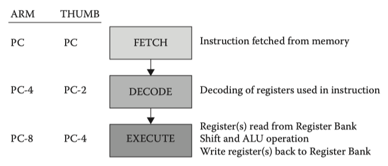

In the A32 and T32 instruction sets, the *Program Counter*(`PC`) and *Stack Pointer*(`SP`) are general purpose registers. This is not the case in A64 instruction set.

As a general-purpose register in ARMv7, the `PC` introduced compiler complications and complex pipeline design.

Removing direct access to the `PC` in ARMv8 makes return prediction easier and simplifies the ABI specification.

<!-- more -->

## PC in AArch32 state

[Arm Compiler armasm User Guide](https://developer.arm.com/documentation/dui0801/latest) | 4.9 Program Counter in AArch32 state

You can use the Program Counter explicitly, for example in some T32 data processing instructions, and implicitly, for example in branch instructions.

The Program Counter (`PC`) is accessed as PC (or R15). It is incremented by the size of the instruction executed, which is always *four* bytes in A32 state. Branch instructions load the destination address into the PC. You can also load the PC directly using data operation instructions. For example, to branch to the address in a general purpose register, use:

```asm
MOV PC,R0
```

During execution, the `PC` does not contain the address of the currently executing instruction. The address of the currently executing instruction is typically ==PC-8== for A32, or ==PC-4== for T32.

!!! note "Use BX instead of writing PC"

    Arm recommends you use the `BX` instruction to jump to an address or to return from a function, rather than writing to the PC directly.

---

[Blue Fox: Arm Assembly Internals and Reverse Engineering](https://www.amazon.com/Blue-Fox-Assembly-Internals-Analysis/dp/1119745306) | Chapter 4 The Arm Architecture

The AArch32 Execution State - AArch32 Registers

AArch32’s program counter (`PC`) is a 32-bit integer register that stores the location in memory of the next instruction the processor should execute. For historical reasons, the PC in AArch32 reads the address of the current instruction plus ==8== when executing an A32 instruction and plus ==4== when executing a T32 instruction. In AArch32, many data-processing instructions can write to the PC and even redirect the program flow when overwriting the PC with an address the program can branch to. Using the PC as the destination register of an instruction has the effect of converting that instruction into a branch-type instruction. Depending on the instruction set state, values written to the PC will be aligned accordingly because the PC ignores the least significant bit and treats it as 0.

### PC != current !?

[ARM7TDMI Technical Reference Manual r4p1](https://developer.arm.com/documentation/ddi0210/c/Introduction/About-the-ARM7TDMI-core/The-instruction-pipeline)

Introduction - About the ARM7TDMI core - The instruction pipeline

The ARM7TDMI core uses a pipeline to increase the speed of the flow of instructions to the processor. This enables several operations to take place simultaneously, and the processing and memory systems to operate continuously.

A three-stage pipeline is used, so instructions are executed in three stages:

- Fetch
- Decode
- Execute.

The instruction pipeline is shown in Figure 1.1.

<figure markdown="span">
    
    <figcaption>Figure 1-1 Instruction pipeline</figcaption>
</figure>

During normal operation, while one instruction is being *executed*, its successor is being *decoded*, and a third instruction is being *fetched* from memory.

The program counter points to the instruction being ^^fetched^^ rather than to the instruction being executed. This is important because it means that the *Program Counter* (`PC`) value used in an executing instruction is always ==two== instructions ahead of the address.

[ARM Assembly Language: Fundamentals and Techniques, 2nd Edition](https://www.oreilly.com/library/view/arm-assembly-language/9781482229851/)

Chapter 2: The Programmer’s Model - 2.3 ARM7TDMI - 2.3.2 Registers

The [ARM7TDMI](https://en.wikipedia.org/wiki/ARM7TDMI) is a pipelined architecture, as shown in Figure 2.3, meaning that while one instruction is being *fetched*, another is being *decoded*, and yet another is being *executed*. The address of the instruction that is being ^^fetched^^ (not the one being executed) is contained in the Program Counter.

<figure markdown="span">
    {: style="width:80%;height:80%"}
    <figcaption>Figure 2.3 ARM7TDMI pipeline diagram</figcaption>
</figure>

## PC in AArch64 state

[ARM Cortex-A Series Programmer's Guide for ARMv8-A](https://developer.arm.com/documentation/den0024/latest) | 4: ARMv8 Registers

4.1 AArch64 special registers - 4.1.3 Program Counter

One feature of the original ARMv7 instruction set was the use of R15, the Program Counter (`PC`) as a general-purpose register. The PC enabled some clever programming tricks, but it introduced complications for compilers and the design of complex pipelines. Removing direct access to the `PC` in ARMv8 makes return prediction easier and simplifies the ABI specification.

The PC is *never* accessible as a named register. Its use is implicit in certain instructions such as PC-relative load and address generation. The PC cannot be specified as the destination of a data processing instruction or load instruction.

[ARM 64-Bit Assembly Language](https://www.amazon.com/64-Bit-Assembly-Language-Larry-Pyeatt/dp/0128192216/) | 3 Load/store and branch instructions

3.2 AArch64 user registers - 3.2.7 Program counter

The program counter, `pc`, always contains the address of the ==next== instruction that will be executed. The processor increments this register by *four*, automatically, after each instruction is fetched from memory. By moving an address into this register, the programmer can cause the processor to *fetch* the next instruction from the new address. This gives the programmer the ability to jump to any address and begin executing code there. Only a small number of instructions can access the pc directly. For example instructions that create a PC-relative address, such as `adr`, and instructions which load a register, such as `ldr`, are able to access the program counter directly.

### PC accessibility

[Arm Compiler armasm User Guide](https://developer.arm.com/documentation/dui0801/latest) | 5.7 Program Counter in AArch64 state

In AArch64 state, the Program Counter (`PC`) contains the address of the currently executing instruction. It is incremented by the size of the instruction executed, which is always *four* bytes.

In AArch64 state, the PC is *not* a general purpose register and you *cannot* access it explicitly. The following types of instructions read it implicitly:

- Instructions that compute a PC-relative address.
- PC-relative literal loads.
- Direct branches to a PC-relative label.
- Branch and link instructions, which store it in the procedure link register.

The only types of instructions that can write to the PC are:

- Conditional and unconditional branches.
- Exception generation and exception returns.

Branch instructions load the destination address into the PC.

---

[Blue Fox: Arm Assembly Internals and Reverse Engineering](https://www.amazon.com/Blue-Fox-Assembly-Internals-Analysis/dp/1119745306)

**Chapter 4 The Arm Architecture**

The AArch64 Execution State - AArch64 Registers - The Program Counter

The program counter register, `PC`, holds the address of the ==current== instruction. Each instruction is conceptually loaded in from the memory location referenced by the PC before being executed. Unless the PC is explicitly changed by the normal execution of the instruction (e.g., via a branch), the PC automatically *advances* to the ==next== instruction. In Armv8, the PC *cannot* be accessed directly or specified as the destination of load or data processing instructions. The PC can be explicitly updated only through exception generations, exception returns, and branches.

The only ordinary instructions that can read the `PC` are the following:

- Branch with link instructions (`BL`, `BLR`) that need to read the `PC` to store a return address in the link register (`LR`)
- Instructions for PC-relative address generation, such as `ADR` and `ADRP`, direct branches, and literal loads(`LDR` pseudo instruction).

**Chapter 6 Memory Access Instructions**

Addressing Modes and Offset Forms - Literal (PC-Relative) Addressing - Loading an Address into a Register

Keep in mind that in A64, only PC-relative address generating instructions are permitted to read the PC, such as `ADR`, `ADRP`, `LDR` (literal), `LDRW` (literal), direct branches that use an immediate offset, and unconditional branch with link instructions.

## PC-relative expressions

[Arm Compiler armasm User Guide](https://developer.arm.com/documentation/dui0801/latest) | 13.5 PC-relative expressions

The assembler supports PC-relative and register-relative expressions.

A register-relative expression evaluates to a named register **combined** with a numeric expression.

You write a PC-relative expression in source code as a label or the PC, optionally combined with a numeric expression. Some instructions can also accept PC-relative expressions in the form `[PC, #number]`.

If you specify a label, the assembler calculates the *offset* from the PC value of the current instruction to the address of the label. The assembler encodes the offset in the instruction. If the offset is too large, the assembler produces an error. The offset is either **added** to or **subtracted** from the PC value to form the required address.

Arm recommends you write PC-relative expressions using labels rather than the PC because the value of the PC depends on the instruction set.

**In A32 code**:

- the value of the PC is the address of the current instruction plus ==8== bytes.

**In T32 code**:

- For `B`, `BL`, `CBNZ`, and `CBZ` instructions, the value of the PC is the address of the current instruction plus ==4== bytes.

- For all other instructions that use labels, the value of the PC is the address of the current instruction plus ==4== bytes, with bit of the result cleared to 0 to make it word-aligned.

**In A64 code**:

- the value of the PC is the address of the ==current== instruction.
