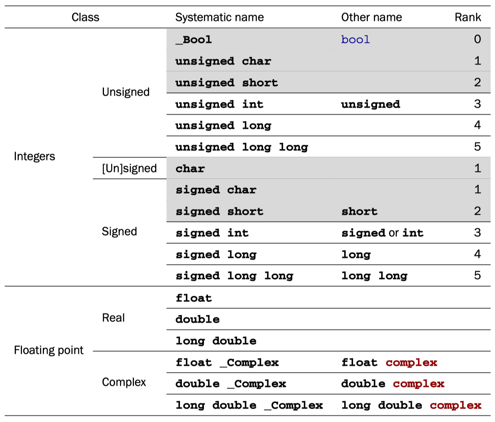
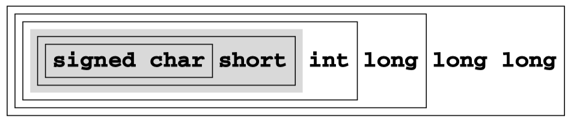
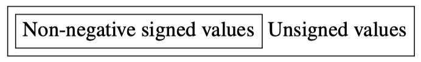
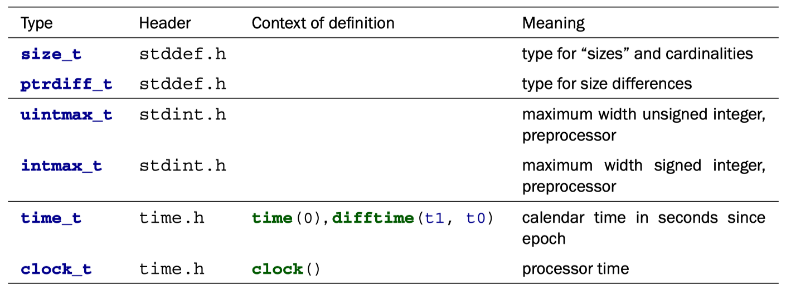

All basic C types are kinds of numbers, but not all of them can be used directly for arithmetic.

<!-- more -->

## 5 Basic values and data

We will now change our focus from “how things are to be done” (statements and expressions) to the things on which C programs operate: `values` and `data`. A concrete program at an instance in time has to *represent* values.

Similarly, representations of values on a computer can vary “culturally” from architecture to architecture or are determined by the *type* the programmer gave to the value. Therefore, we should try to reason primarily about values and not about representations if we want to write portable code.

!!! note "TAKEAWAY 5.1"

    TAKEAWAY 5.1 C programs primarily reason about values and not about their representation.

The representation that a particular value has should in most cases not be your concern; the compiler is there to organize the translation back and forth between values and representations.

### 5.1 The abstract state machine

To explain the abstract state machine, we first have to look into the concepts of a *value* (what state are we in), the *type* (what this state represents), and the *representation* (how state is distinguished). As the term abstract suggests, C's mechanism allows different platforms to realize the abstract state machine of a given program differently according to their needs and capacities.

### 5.2 Basic types

C has a series of basic types and means of constructing derived types from them.

Mainly for historical reasons, the system of basic types is a bit complicated, and the syntax to specify such types is not completely straightforward. There is a first level of specification that is done entirely with keywords of the language, such as **signed**, **int**, and **double**. This *first* level is mainly organized according to C internals. On top of that is a *second* level of specification that comes through header files, and we have already seen examples: `size_t` and `bool`. This second level is organized by type semantics, specifying what properties a particular type brings to the programmer.

We will start with the first-level specification of such types. As we discussed earlier (takeaway 5.2), all basic values in C are numbers, but there are different kinds of numbers. As a principal distinction, we have two different classes of numbers, each with two subclasses: unsigned integers, signed integers, real floating-point numbers, and complex floating-point numbers. Each of these four classes contains several types.They differ according to their precision, which determines the valid range of values that are allowed for a particular type. Table 5.1 contains an overview of the 18 base types.

> Types with a gray background don't allow for arithmetic; they are promoted before doing arithmetic. Type char is special since it can be unsigned or signed, depending on the platform. All types in this table are considered to be distinct types, even if they have the same class and precision.

<figure markdown="span">
    
    <figcaption>Table 5.1 Base types according to the four main type classes</figcaption>
</figure>

As you can see from the table, there are six types that we can't use directly for arithmetic, the so-called ***narrow types***. They are **promoted** to one of the wider types before they are considered in an arithmetic expression. Nowadays, on any realistic platform, this promotion will be a *signed int* of the same value as the narrow type, regardless of whether the narrow type was signed.

!!! note "TAKEAWAY 5.10"

    TAKEAWAY 5.10 Before arithmetic, narrow integer types are promoted to **signed int**.

Observe that among the narrow integer types, we have two prominent members: `char` and `bool`. The first is C's type that handles printable characters for text, and the second holds truth values, false and true. As we said earlier, for C, even these are just some sort of numbers.

The 12 remaining, unpromoted, types split nicely into the four classes.

!!! note "TAKEAWAY 5.11"

    TAKEAWAY 5.11 Each of the four classes of base types has three distinct unpromoted types.

Contrary to what many people believe, the C standard doesn't prescribe the precision of these 12 types: it only constrains them. They depend on a lot of factors that are ***implementation defined***.

One of the things the standard *does* prescribe is that the possible ranges of values for the signed types must include each other according to their *rank*:

<figure markdown="span">
    {: style="width:80%;height:80%"}
</figure>

But this inclusion does not need to be strict. For example, on many platforms, the set of values of `int` and `long` are the same, although the types are considered to be different. An analogous inclusion holds for the six unsigned types:

<figure markdown="span">
    {: style="width:80%;height:80%"}
</figure>

But remember that for any arithmetic or comparison, the narrow unsigned types are promoted to `signed int` and not to `unsigned int`, as this diagram might suggest.

The comparison of the ranges of signed and unsigned types is more difficult. Obviously, an unsigned type can never include the negative values of a signed type. For the non-negative values, we have the following inclusion of the values of types with corresponding rank:

<figure markdown="span">
    {: style="width:80%;height:80%"}
</figure>

That is, for a given rank, the non-negative values of the signed type fit into the unsigned type. On any modern platform you encounter, this inclusion is strict: the unsigned type has values that do not fit into the signed type. For example, a common pair of maximal values is 2^31^ −1 = 2 147 483 647 for `signed int` and 2^32^ − 1 = 4 294 967 295 for `unsigned int`.

Because the interrelationship between integer types depends on the platform, choosing the “best” type for a given purpose in a portable way can be a tedious task. Luckily, we can get some help from the compiler implementation, which provides us with **typedef** s such as `size_t` that represent certain features.

!!! note "TAKEAWAY 5.12"

    TAKEAWAY 5.12 Use `size_t` for sizes, cardinalities, or ordinal numbers.

Remember that unsigned types are the most convenient types, since they are the only types that have an arithmetic that is defined consistently with mathematical properties: the modulo operation. They can't raise signals on overflow and can be optimized best. They are described in more detail in section 5.7.1.

!!! note "TAKEAWAY 5.13"

    TAKEAWAY 5.13 Use **unsigned** for small quantities that can't be negative.

If your program really needs values that may be both positive and negative but don't have fractions, use a signed type (see section 5.7.5).

!!! note "TAKEAWAY 5.14~5.15"

    - TAKEAWAY 5.14 Use **signed** for small quantities that bear a sign.
    - TAKEAWAY 5.15 Use `ptrdiff_t` for large differences that bear a sign.

If you want to do fractional computation with a value such as 0.5 or 3.77189E+89, use floating-point types (see section 5.7.7).

!!! note "TAKEAWAY 5.16~5.17"

    - TAKEAWAY 5.16 Use **double** for floating-point calculations.
    - TAKEAWAY 5.17 Use **double complex** for complex calculations.

The C standard defines a lot of other types, among them other arithmetic types that model special use cases. Table 5.2 lists some of them. The second pair represents the types with maximal width that the platform supports. This is also the type in which the preprocessor does any of its arithmetic or comparison.

The C standard defines a lot of other types, among them other arithmetic types that model special use cases. Table 5.2 lists some of them. The second pair represents the types with maximal width that the platform supports. This is also the type in which the preprocessor does any of its arithmetic or comparison.

<figure markdown="span">
    
</figure>

The two types `time_t` and `clock_t` are used to handle times. They are semantic types, because the precision of the time computation can be different from platform to platform. The way to have a time in seconds that can be used in arithmetic is the function *difftime*: it computes the difference of two timestamps. `clock_t` values present the platform's model of processor clock cycles, so the unit of time is usually much less than a second; *CLOCKS_PER_SEC* can be used to convert such values to seconds.

## 6 Derived data types

All other data types in C are derived from the basic types that we know now. There are four strategies for deriving data types. Two of them are called aggregate data types, because they combine multiple instances of one or several other data types:

- Arrays: These combine items that all have the same base type.
- Structures: These combine items that may have different base types.

The two other strategies to derive data types are more involved:

**Pointers**: Entities that refer to an object in memory.

> Pointers are by far the most involved concept, and we will delay a full discussion of them to chapter 11. Here, in section 6.2, we will only discuss them as opaque data types, without even mentioning the real purpose they fulfill.

**Unions**: These overlay items of different base types in the same memory location. Unions require a deeper understanding of C's memory model and are not of much use in a programmer's everyday life, so they are only introduced later, in section 12.2.

> There is a fifth strategy that introduces new names for types: typedef. Unlike the previous four, this does not create a new type in C's type system, but only creates a new name for an existing type. In that way, it is similar to the definition of macros with #define; thus the choice for the keyword for this feature.

---

!!! warning "Copyright clarification"

    Excerpt from [Modern C, 1st Edition, 2019](https://www.amazon.com/Modern-C-Jens-Gustedt-ebook/dp/B0978347Z6/).
    Copyright credit to [Jens Gustedt](https://gustedt.gitlabpages.inria.fr/modern-c/). 🫡
    For studying only, not commercial.
