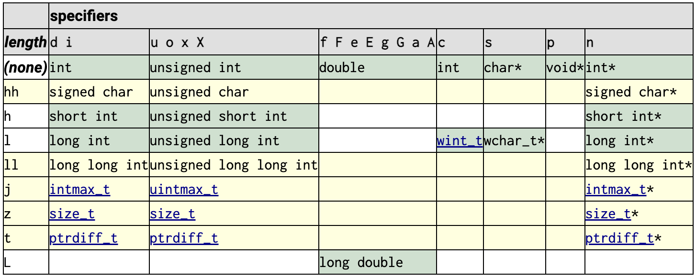

A C program, whatever its size, consists of functions and variables. A function contains statements that specify the computing operations to be done, and variables store values used during the computation.

在 C 程序里，函数（function）就是指令，变量（variable）就是数据。数据类型定义了变量的存储和访问属性，约束了其大小边界（size/boundary）、取值范围（value range）、解释呈现（interpretation/representation）和可操作集（operation set）。

<!-- more -->

## C Concepts


## C Program

[C Programming Language(2e)](https://www.amazon.com/Programming-Language-2nd-Brian-Kernighan/dp/0131103628/) - Brian W. Kernighan, Dennis M. Ritchie, 1988

1.1 Getting Started

> A C program, whatever its size, consists of functions and variables. A function contains statements that specify the computing operations to be done, and variables store values used during the computation.

1.2 Variables and Arithmetic Expressions

> A declaration announces the properties of variables; it consists of a [type] name and a list of variables.

《[C语言标准与实现](https://att.newsmth.net/nForum/att/CProgramming/3213/245)》姚新颜，2004

> 03 从汇编语言开始：简单地说，一个程序最重要的两个部分分别是数据和对数据进行操作的指令。因此，我们必须要清楚地了解一个程序的数据与指令是如何被组织起来的。
> 08 C 语言的变量：在 C 程序里，变量（variable）就是数据，函数（function）就是指令。

《[汇编语言(4e)](https://item.jd.com/12841436.html)》王爽, 2019

> 1.5 指令和数据：指令和数据是应用上的概念。在内存或磁盘上，指令和数据没有任何区别，都是二进制信息。CPU 在工作的时候把有的信息看作指令，有的信息看作数据，为同样的信息赋予了不同的意义。

## C data types

[C data types](https://en.wikipedia.org/wiki/C_data_types)

In the C programming language, `data types` constitute the semantics and characteristics of *storage* of data elements. They are expressed in the language syntax in form of declarations for memory locations or variables. Data types also **determine** the types of operations or methods of processing of data elements.

The C language provides basic arithmetic types, such as integer and real number types, and syntax to build array and compound types. *Headers* for the [C standard library](https://en.wikipedia.org/wiki/C_standard_library), to be used via include directives, contain definitions of support types, that have additional properties, such as providing storage with an exact size, independent of the language implementation on specific hardware platforms.

C 语言中的基本数据类型: char、short、int、long，float、double。

C 语言包含的数据类型[如图所示](https://item.jd.com/12720594.html)：

<figure markdown="span">
    {: style="width:80%;height:80%"}
</figure>

[The GNU C Reference Manual](https://www.gnu.org/software/gnu-c-manual/gnu-c-manual.html) - [2 Data Types](https://www.gnu.org/software/gnu-c-manual/gnu-c-manual.html#Data-Types)

## Type support

C language Basic Concepts - [Type](https://en.cppreference.com/w/c/language/type)

- Type classification
- Compatible types
- Composite types
- Incomplete types
- Type names

Type groups

*   *object types*: all types that aren't function types
*   *character types*: char, signed char, unsigned char
*   *integer types*: char, signed integer types, unsigned integer types, enumerated types
*   *real types*: integer types and real floating types
*   [arithmetic types](https://en.cppreference.com/w/c/language/arithmetic_types "c/language/arithmetic types"): integer types and floating types
*   *scalar types*: arithmetic types, pointer types, and [nullptr\_t](https://en.cppreference.com/w/c/types/nullptr_t "c/types/nullptr t")(since C23)
*   *aggregate types*: array types and structure types
*   *derived declarator types*: array types, function types, and pointer types

Constructing a complete object type such that the number of bytes in its object representation is not representable in the type [size\_t](https://en.cppreference.com/w/c/types/size_t "c/types/size t") (i.e. the result type of [`sizeof`](https://en.cppreference.com/w/c/language/sizeof "c/language/sizeof") operator), including forming such a VLA type at runtime,(since C99) is undefined behavior.

[Type support](https://en.cppreference.com/w/c/types)

- Additional basic types and convenience macros: [<stddef.h\>](https://en.cppreference.com/w/c/types)
- [Fixed width integer types (since C99)](https://en.cppreference.com/w/c/types/integer)

    - Types & Macro constants: <stdint.h\>
    - Format macro constants: <inttypes.h\>

- [Numeric limits](https://en.cppreference.com/w/c/types/limits): <limits.h\>, [<stdint.h\>](https://en.cppreference.com/w/c/types/integer)

    - [Data Type Ranges | Microsoft Learn](https://learn.microsoft.com/en-us/cpp/cpp/data-type-ranges?view=msvc-170)
    - GNU [A.5 Data Type Measurements](http://www.gnu.org/software/libc/manual/html_node/Data-Type-Measurements.html#Data-Type-Measurements) : [Width of an Integer Type](https://www.gnu.org/software/libc/manual/html_node/Width-of-Type.html) & [Range of an Integer Type](https://www.gnu.org/software/libc/manual/html_node/Range-of-Type.html)

The following table summarizes all available integer types and their [properties](https://en.cppreference.com/w/c/language/arithmetic_types):

<figure markdown="span">
    
</figure>

## printf format specifier

[C data types](https://en.wikipedia.org/wiki/C_data_types#stddef.h) - Main types - Format specifier

[printf(3) - Linux manual page](https://man7.org/linux/man-pages/man3/printf.3.html) @[opengroup](https://pubs.opengroup.org/onlinepubs/9699919799/functions/fprintf.html#)

- Flag characters
- Field width
- Precision
- Length modifier
- Conversion specifiers

printf: [cppreference.com](https://en.cppreference.com/w/c/io/fprintf), [cplusplus.com](https://cplusplus.com/reference/cstdio/printf/)

<figure markdown="span">
    
</figure>

[Fixed width integer types (since C99)](https://en.cppreference.com/w/c/types/integer)

- Format macro constants - Defined in header <inttypes.h\>
- Format constants for the fprintf family of functions
- Each of the `PRI` macros listed here is defined if and only if the implementation defines the corresponding typedef name.
- 预处理 dump 相关格式宏：`echo "#include <inttypes.h>" | cpp -dM | grep 'FMT\|PRI'`。

[fmtlib/fmt: A modern formatting library](https://github.com/fmtlib/fmt)
[Comparison of C++ Format and C library's printf](https://vitaut.net/posts/2015/comparison-of-cppformat-and-printf/)

## Standard Variants

机器字长（[Machine Word](../cs/machine-word.md) - `__WORDSIZE`）和平台采用的数据模型（[Data Models](../cs/data-model.md)）决定了 `long` 和 `pointer` 的位宽（size in bytes、width in bits）。

GCC/Clang 编译器预定义的宏（Predefined Macros）中，涉及到机器字长并决定数据模型相关的宏：

- `__SIZEOF_LONG__` @[intel](https://www.intel.com/content/www/us/en/developer/articles/technical/size-of-long-integer-type-on-different-architecture-and-os.html)
- `__SIZEOF_POINTER__`, `__POINTER_WIDTH__`

Types varying by data model 的相关类型及相关的宏：

1. `wchar_t`: 实现相关

    - `__WCHAR_TYPE__`, `__WCHAR_WIDTH__`, `__SIZEOF_WCHAR_T__`

2. `size_t`: 机器字长相关

    - `__SIZE_TYPE__`, `__SIZE_WIDTH__`, `__SIZEOF_SIZE_T__`

3. `intptr_t`/`uintptr_t`: 机器字长相关

    - `__INTPTR_TYPE__`, `__INTPTR_WIDTH__`; `__UINTPTR_TYPE__`, `__UINTPTR_WIDTH__`

4. `ptrdiff_t`: 机器字长相关

    - `__PTRDIFF_TYPE__`, `__PTRDIFF_WIDTH__`

### wchar_t

[Null-terminated wide strings](https://en.cppreference.com/w/c/string/wide)

- <wchar.h\>(since C95): Extended multibyte and wide character utilities
- <wctype.h\>(since C95): Functions to determine the type contained in wide character data
- `wchar_t` : integer type that can hold any valid wide character(typedef)

[aapcs64](https://github.com/ARM-software/abi-aa/blob/2a70c42d62e9c3eb5887fa50b71257f20daca6f9/aapcs64/aapcs64.rst) - 7 The standard variants - 10.1.2 Types varying by data model:

C/C++ Type | ILP32 (Beta) | LP64 | LLP64
-----------|--------------|------|------
wchar_t | unsigned word | unsigned word | unsigned halfword

> 在 MSVC - [C++ type system](https://learn.microsoft.com/en-us/cpp/cpp/cpp-type-system-modern-cpp) 中定义 wchar\_t 位宽为 2 bytes。

相关宏：

- `__WCHAR_TYPE__`
- `__SIZEOF_WCHAR_T__`, `__WCHAR_WIDTH__`


### size_t

[Type support](https://en.cppreference.com/w/c/types) - <stddef.h\>

- `size_t`: unsigned integer type returned by the sizeof operator(typedef)

[aapcs64](https://github.com/ARM-software/abi-aa/blob/2a70c42d62e9c3eb5887fa50b71257f20daca6f9/aapcs64/aapcs64.rst) - 7 The standard variants - 10.1.4 Additional types:

Typedef | ILP32 (Beta) | LP64 | LLP64
--------|--------------|------|------
size_t | unsigned long | unsigned long | unsigned long long

相关宏：

- `__SIZE_TYPE__`
- `__SIZEOF_SIZE_T__`, `__SIZE_WIDTH__`

rpi4b-ubuntu 的 /usr/include/stdint.h 中定义了：

```c
# define SIZE_WIDTH __WORDSIZE
```

### intptr_t/uintptr_t

[Fixed width integer types (since C99)](https://en.cppreference.com/w/c/types/integer) - <stdint.h\>

- `intptr_t`: integer type capable of holding a pointer
- `uintptr_t`: unsigned integer type capable of holding a pointer

相关宏：

- `__INTPTR_TYPE__`, `__INTPTR_WIDTH__`
- `__UINTPTR_TYPE__`, `__UINTPTR_WIDTH__`

指针位数一般和 `__WORDSIZE` 相等：

- sizeof(`__INTPTR_TYPE__`) = sizeof(`__UINTPTR_TYPE__`) = `__SIZEOF_POINTER__`
- `__INTPTR_WIDTH__` = `__UINTPTR_WIDTH__` = `__POINTER_WIDTH__` = `__WORDSIZE`

rpi4b-ubuntu 的 /usr/include/stdint.h 中定义了：

```c
# define INTPTR_WIDTH __WORDSIZE
# define UINTPTR_WIDTH __WORDSIZE
```

### ptrdiff_t

[Type support](https://en.cppreference.com/w/c/types) - <stddef.h\>

- `ptrdiff_t`: signed integer type returned when subtracting two pointers(typedef)

[aapcs64](https://github.com/ARM-software/abi-aa/blob/2a70c42d62e9c3eb5887fa50b71257f20daca6f9/aapcs64/aapcs64.rst) - 7 The standard variants - 10.1.4 Additional types:

Typedef | ILP32 (Beta) | LP64 | LLP64
--------|--------------|------|------
ptrdiff_t | signed long | signed long | signed long long

相关宏：

- `__PTRDIFF_TYPE__`
- `__PTRDIFF_WIDTH__`

rpi4b-ubuntu 的 /usr/include/stdint.h 中定义了：

```c
# define PTRDIFF_WIDTH __WORDSIZE
```
