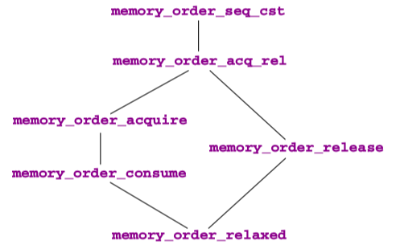

The "happens before" relation is the only possible way to reason about timing between different threads. It is only established through synchronization that uses either atomic objects or very specific C library functions.

Sequential consistency is the default consistency model for atomics, but not for other C library functions. It additionally assumes that all corresponding synchronization events are totally ordered. This is an assumption that can be expensive.

Explicitly using acquire-release consistency can lead to more efficient code, but it needs a careful design to supply the correct arguments to the atomic functions with a *`_explicit`* suffix.

<!-- more -->

## Sequential consistency

The data consistency for atomic objects that we described earlier, guaranteed by the *happened-before* relation, is called *acquire-release* consistency. Whereas the C library calls we have seen always synchronize with that kind of consistency, no more and no less, accesses to atomics can be specified with different consistency models.

As you remember, all atomic objects have a *modification order* that is consistent with all sequenced-before relations that see these modifications *on the same* object. *Sequential consistency* has even more requirements than that; see figure 19.3. Here we illustrate the common timeline of all sequentially consistent operations on top. Even if these operations are performed on different processors and the atomic objects are realized in different memory banks, the platform has to **ensure** that all threads perceive all these operations as being consistent with this one global linearization.

> TAKEAWAY 19.13: All atomic operations with sequential consistency occur in one global modification order, regardless of the atomic object they are applied to.

So, sequential consistency is a very ***strong*** requirement. Not only that, it enforces acquire-release semantics (a causal partial ordering between events), but it rolls out this partial ordering to a total ordering. If you are interested in parallelizing the execution of your program, sequential consistency *may not* be the right choice, because it may force sequential execution of the atomic accesses.

So, sequential consistency is a very strong requirement. Not only that, it **enforces** acquire-release semantics (a causal partial ordering between events), but it rolls out this *partial* ordering to a *total* ordering. If you are interested in parallelizing the execution of your program, sequential consistency may not be the right choice, because it may force sequential execution of the atomic accesses.

The standard provides the following functional interfaces for atomic types. They should conform to the description given by their name and also perform synchronization:

```c
void atomic_store (A volatile* obj, C des) ;
C atomic_load (A volatile* obj) ;
C atomic_exchange (A volatile* obj, C des) ;
bool atomic_compare_exchange_strong (A volatile* obj, C *expe, C des) ;
bool atomic_compare_exchange_weak (A volatile* obj, C *expe, C des) ;
C atomic_fetch_add(A volatile* obj, M operand) ;
C atomic_fetch_sub (A volatile* obj, M operand) ;
C atomic_fetch_and(A volatile* obj, M operand) ;
C atomic_fetch_or (A volatile* obj, M operand) ;
C atomic_fetch_xor (A volatile* obj, M operand) ;
bool atomic_flag_test_and_set (atomic_flag volatile* obj);
void atomic_flag_clear (atomic_flag volatile* obj);
```

Here `C` is any appropriate data type, `A` is the corresponding atomic type, and `M` is a type that is compatible with the arithmetic of `C`. As the names suggest, for the fetch and operator interfaces the call returns the value that `*obj` had before the modification of the object. So these interfaces are not equivalent to the corresponding compound assignment operator (`+=`), since that would return the result after the modification.

All these functional interfaces provide *sequential consistency*.

> TAKEAWAY 19.14: All operators and functional interfaces on atomics that don't specify otherwise have sequential consistency.

Observe also that the functional interfaces differ from the operator forms, because their arguments are `volatile` qualified.

There is another function call for atomic objects that does not imply synchronization:

```c
void atomic_init(A volatile* obj, C des);
```

Its effect is the same as a call to `atomic_store` or an assignment operation, but concurrent calls from different threads can produce a race. View `atomic_init` as a cheap form of *assignment*.

## Other consistency models

[Memory model - cppreference.com](https://en.cppreference.com/w/c/language/memory_model) | Threads and data races

A thread of execution is a flow of control within a program that begins with the invocation of a top-level function by [thrd_create](https://en.cppreference.com/w/c/thread/thrd_create) or other means.

Any thread can potentially **access** any object in the program (objects with automatic and thread-local storage duration may still be accessed by another thread through a *pointer*).

Different threads of execution are always allowed to **access** (read and modify) different memory locations concurrently, with no interference and no synchronization requirements. (note that it is *not safe* to concurrently update two non-atomic bit-fields in the same structure if all members declared between them are also (non-zero-length) bit-fields, no matter what the sizes of those intervening bit-fields happen to be)

When an evaluation of an expression ***writes*** to a memory location and another evaluation ***reads*** or ***modifies*** the same memory location, the expressions are said to *`conflict`*. A program that has two conflicting evaluations has a *`data race`* unless either

- both conflicting evaluations are [atomic operations](https://en.cppreference.com/w/c/language/atomic)
- one of the conflicting evaluations happens-before another (see [memory_order](https://en.cppreference.com/w/c/atomic/memory_order))

If a data race occurs, the behavior of the program is undefined.

> in particular, [mtx_unlock](https://en.cppreference.com/w/c/thread/mtx_unlock) is synchronized-with, and therefore, *happens-before* [mtx_lock](https://en.cppreference.com/w/c/thread/mtx_lock) of the same mutex by another thread, which makes it possible to use mutex locks to **guard** against data races)

---

A different consistency model can be requested with a complementary set of functional interfaces. For example, an equivalent to the postfix `++` operator with just acquire-release consistency could be specified with

```c
    _Atomic (unsigned) at = 67;
    // ...
    if (atomic_fetch_add_explicit (&at, 1, memory_order_acq_rel)) {
        // ...
    }
```

> TAKEAWAY 19.15: Synchronizing functional interfaces for atomic objects have a form with `_explicit` appended that allows us to **specify** their consistency model.

These interfaces accept additional arguments in the form of symbolic constants of type [memory_order](https://en.cppreference.com/w/c/atomic/memory_order) that specify the memory semantics of the operation:

```c
// Defined in header <stdatomic.h>
enum memory_order {
    memory_order_relaxed,
    memory_order_consume,
    memory_order_acquire,
    memory_order_release,       // (since C11)
    memory_order_acq_rel,
    memory_order_seq_cst
};
```

Value | Explanation
------|------------
`memory_order_relaxed` | Relaxed operation: there are ***no*** synchronization or ordering constraints imposed on other reads or writes, ***only*** this operation's *`atomicity`* is guaranteed (see Relaxed ordering below).
`memory_order_consume` | A `load` operation with this memory order performs a *consume operation* on the affected memory location: ***no*** reads or writes in the current thread *dependent* on the value currently loaded can be reordered *before* this load. Writes to data-dependent variables in other threads that release the same atomic variable are *visible* in the current thread. On most platforms, this affects compiler optimizations only (see Release-Consume ordering below).
`memory_order_acquire` | A `load` operation with this memory order performs the *acquire operation* on the affected memory location: ***no*** reads or writes in the current thread can be reordered *before* this load. All writes in other threads that release the same atomic variable are *visible* in the current thread (see Release-Acquire ordering below).
`memory_order_release` | A `store` operation with this memory order performs the *release operation*: ***no*** reads or writes in the current thread can be reordered *after* this store. All writes in the current thread are *visible* in other threads that acquire the same atomic variable (see Release-Acquire ordering below) and writes that carry a dependency into the atomic variable become *visible* in other threads that consume the same atomic (see Release-Consume ordering below).
`memory_order_acq_rel` | A `read-modify-write` operation with this memory order is both an *acquire operation* and a *release operation*. ***No*** memory reads or writes in the current thread can be reordered *before* the load, nor *after* the store. All writes in other threads that release the same atomic variable are *visible* before the modification and the modification is visible in other threads that acquire the same atomic variable.
`memory_order_seq_cst` | A `load` operation with this memory order performs an *acquire operation*, a `store` performs a *release operation*, and `read-modify-write` performs *both* an acquire operation and a release operation, plus a single total order exists in which all threads **observe** all modifications in the same order (see Sequentially-consistent ordering below).

Refer to [Concurrency support library - cppreference.com](https://en.cppreference.com/w/c/thread) about the APIs of Atomic operations.

1. `memory_order_seq_cst` requests sequential consistency. Using this is equivalent to the forms without `_explicit`.
2. `memory_order_acq_rel` is for an operation that has *acquire-release* consistency. Typically, for general atomic types, you'd use it for a *read-modify-write* operation such as [atomic_fetch_add](https://en.cppreference.com/w/c/atomic/atomic_fetch_add) or [atomic_compare_exchange_weak](https://en.cppreference.com/w/c/atomic/atomic_compare_exchange), or for [atomic_flag](https://en.cppreference.com/w/c/atomic/atomic_flag) with [atomic_flag_test_and_set](https://en.cppreference.com/w/c/atomic/atomic_flag_test_and_set).
3. `memory_order_release` is for an operation that has only *release* semantics. Typically this would be [atomic_store](https://en.cppreference.com/w/c/atomic/atomic_store) or [atomic_flag_clear](https://en.cppreference.com/w/c/atomic/atomic_flag_clear).
4. `memory_order_acquire` is for an operation that has only *acquire* semantics. Typically this would be [atomic_load](https://en.cppreference.com/w/c/atomic/atomic_load).
5. `memory_order_consume` is for an operation that has a *weaker* form of causal dependency than acquire consistency. Typically this would also be [atomic_load](https://en.cppreference.com/w/c/atomic/atomic_load).
6. `memory_order_relaxed` is for an operation that adds ***no*** synchronization requirements. The only guarantee for such an operation is that it is indivisible(atomic). A typical use case for such an operation is a performance counter that is used by different threads, but for which we are only interested in a final accumulated count.

The consistency models can be compared with respect to the restrictions they impose to the platform. Figure 19.4 shows the implication order of the `memory_order` models.

<figure markdown="span">
    {: style="width:60%;height:60%"}
    <figcaption>Figure 19.4 Hierarchy of consistency models, from least to most constraining</figcaption>
</figure>

Whereas `memory_order_seq_cst` and `memory_order_relaxed` are admissible for all operations, there are some restrictions for other `memory_order`s. Operations that can only occur on one side of a synchronization can only specify an order for that side. Therefore, the two operations that only ***store*** (`atomic_store` or `atomic_flag_clear`) may not specify acquire semantics. Three operations only perform a ***load*** and may not specify release or consume semantics: besides `atomic_load`, these are `atomic_compare_exchange_weak` and `atomic_compare_exchange_strong` in case of failure. Thus, the latter two need two `memory_order` arguments for their *`_explicit`* form, such that they can distinguish the requirements for the success and failure cases:

```c
 bool
 atomic_compare_exchange_strong_explicit (A volatile* obj, C *expe, C des,
                                          memory_order success,
                                          memory_order failure) ;
 bool
 atomic_compare_exchange_weak_explicit (A volatile* obj, C *expe, C des,
                                        memory_order success,
                                        memory_order failure) ;
```

Here, the `success` consistency must be at least as strong as the `failure` consistency; see figure 19.4.

Up to now, we have implicitly assumed that the *acquire* and *release* sides of a synchronization are symmetric, but they aren't: whereas there always is just one writer of a modification, there can be several readers. Because moving new data to several processors or cores is expensive, some platforms allow us to avoid the propagation of all visible effects that happened before an atomic operation to all threads that read the new value. C's *consume consistency* is designed to map this behavior. We will not go into the details of this model, and you should use it only when you are certain that some effects prior to an atomic read will *not* affect the reading thread.

---

!!! warning "Copyright clarification"

    Excerpt from [Modern C, 1st Edition, 2019](https://www.amazon.com/Modern-C-Jens-Gustedt-ebook/dp/B0978347Z6/).
    Copyright credit to [Jens Gustedt](https://gustedt.gitlabpages.inria.fr/modern-c/). 🫡
    For studying only, not commercial.

## references

[C和C++中的volatile、内存屏障和CPU缓存一致性协议MESI](https://cloud.tencent.com/developer/article/1403223)
[深入理解C11/C++11内存模型](https://cloud.tencent.com/developer/article/2120357)
[理解 C++ 内存一致性模型](https://weakyon.com/2023/07/23/understanding-of-the-cpp-memory-order.html)
