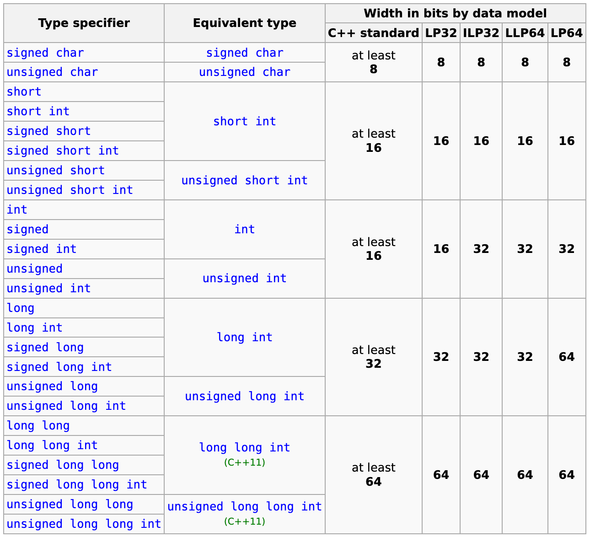
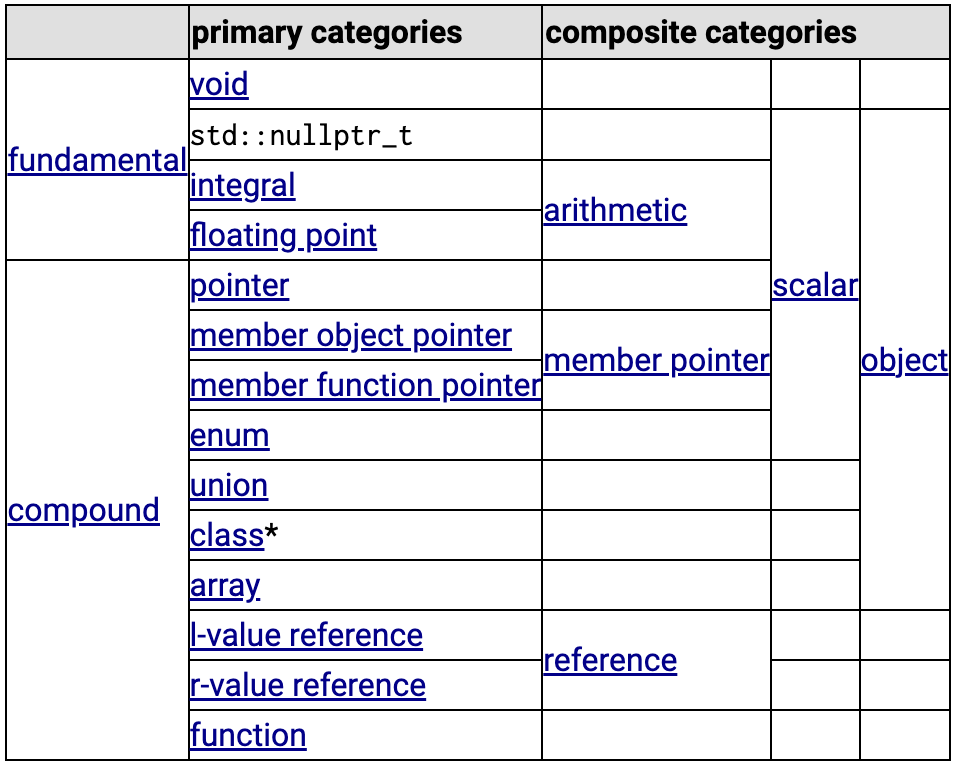
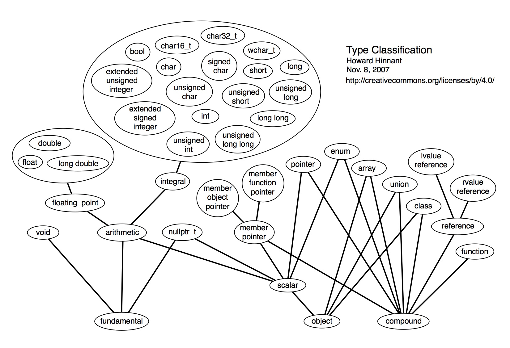

Every name and every expression has a type that determines the operations that may be performed on it.

Types built out of the built-in types using C++’s abstraction mechanisms are called *user-defined types*. They are referred to as structures, classes and enumerations.

<!-- more -->

## C++ Type

C++ language Basic Concepts - [Type](http://en.cppreference.com/w/cpp/language/type)

Objects, references, functions including function template specializations, and expressions have a property called ***type***, which both restricts the *operations* that are permitted for those entities and provides *semantic meaning* to the otherwise generic sequences of bits.

-  Type classification
-  Program-defined type
-  Type naming
-  Elaborated type specifier
-  Static type
-  Dynamic type
-  Incomplete type

There are fundamental types and compound types.

- **Fundamental types** are the arithmetic types, void, and std::nullptr_t.  
- **Compound types** are arrays, functions, pointers, references, classes, unions, enumerations, and pointers to non-static members.  

<figure markdown="span">
    
</figure>

C++ language Basic Concepts - [Fundamental types](https://en.cppreference.com/w/cpp/language/types)

- Void type
- std::nullptr_t (since C++11)
- Data models
- Integral types
- Floating-point types
- Range of values

C++ Utilities library - [Type support (basic types, RTTI)](https://en.cppreference.com/w/cpp/types)

- Additional basic types and macros
- Fixed width integer types (since C++11)
- Fixed width floating-point types (since C++23)
- Numeric limits
- Runtime type identification

[Numerics library](https://en.cppreference.com/w/cpp/numeric)

- Mathematical functions and types
- Numeric algorithms
- Miscellanous

[C++98](http://www.cplusplus.com/doc/oldtutorial/) : [Variables. Data Types.](http://www.cplusplus.com/doc/oldtutorial/variables/)
[C++ Language: Variables and types](https://cplusplus.com/doc/tutorial/variables/)

### Integral types

Modifies the basic integer type. Can be mixed in any order. Only one of each group can be present in type name.

**Signedness**:

- `signed` — target type will have signed representation (this is the default if omitted)
- `unsigned` — target type will have unsigned representation

**Size**:

- `short` — target type will be optimized for space and will have width of at *least* 16 bits.
- `long` — target type will have width of at *least* 32 bits.
- `long long` — target type will have width of at least 64 bits. (since C++11)

!!! note "Modifiers Order Indiference"

    as with all type specifiers, any order is permitted: unsigned long long int and long int unsigned long name the same type.

**Properties**:

The following table summarizes all available standard integer types and their properties in various common data models:

<figure markdown="span">
    
</figure>

### Type straits and Constraints

[Type traits and metaprogramming library](https://en.cppreference.com/w/cpp/meta#Type_traits)

Type traits define compile-time template-based interfaces to **query** the properties of types.

[<type_traits\>](http://www.cplusplus.com/reference/type_traits/): This header defines a series of classes to **obtain** type information on compile-time.

- Helper classes: Standard classes to assist in creating compile-time constants.
- Type traits: Classes to obtain characteristics of types in the form of compile-time constant values.
- Type transformations: Classes to obtain new types by applying specific transformations to existing types.

A basic trait for types is the categories in which they can be classified. This is a chart on how these categories overlap:

- `*` = excluding unions

<figure markdown="span">
    {: style="width:80%;height:80%"}
</figure>

[Constraints and concepts](https://en.cppreference.com/w/cpp/language/constraints) & [Concepts library](https://en.cppreference.com/w/cpp/concepts) (since C++20)

Class templates, function templates, and non-template functions (typically members of class templates) might be associated with a *constraint*, which specifies the *requirements* on template arguments, which can be used to select the most appropriate function overloads and template specializations.

Named sets of such requirements are called ***concepts***. Each concept is a *predicate*, evaluated at compile time, and becomes a part of the interface of a template where it is used as a constraint.

### Compiler Conformances

GCC libstdc++ [Types](https://gcc.gnu.org/onlinedocs/libstdc++/manual/support.html)

MSDN - [C++ Type System](https://learn.microsoft.com/en-us/cpp/cpp/cpp-type-system-modern-cpp)

The following illustration shows the relative sizes of the built-in types in the Microsoft C++ implementation:

<figure markdown="span">
    
    <figcaption>MSVC built-in type sizes</figcaption>
</figure>

MSDN - [Built-in types (C++)](https://learn.microsoft.com/en-us/cpp/cpp/fundamental-types-cpp)

- Void type
- std::nullptr_t
- Boolean type
- Character types
- Floating-point types
- Integer types
- Sizes of built-in types

[LLVM Features](https://en.wikipedia.org/wiki/LLVM): The type system consists of basic types such as `integer` or `floating-point` numbers and five derived types: `pointers`, `arrays`, `vectors`, `structures`, and `functions`. A type construct in a concrete language can be represented by combining these basic types in LLVM. For example, a class in C++ can be represented by a *mix* of structures, functions and arrays of function pointers.

## TC++PL4

[A Tour of C++(3e)-2022](https://www.stroustrup.com/tour3.html)
[The\_C++\_Programming\_Language(4e)-2013](https://www.stroustrup.com/4th.html)

- 2.2 The Basics | 2.2.2 Types, Variables, and Arithmetic
- 2.3 User-Defined Types : Structures; Classes; Enumerations

[C++ Data Types](https://www.geeksforgeeks.org/cpp-data-types/):

<figure markdown="span">
    
</figure>

[TypeHiearchy.pdf](https://howardhinnant.github.io/TypeHiearchy.pdf):

<figure markdown="span">
    
</figure>

### 2.2 The Basics

Every name and every expression has a type that determines the operations that may be performed on it. For example, the declaration

```cpp
int inch;
```
specifies that inch is of type int; that is, inch is an integer variable.

A declaration is a statement that introduces a name into the program. It specifies a type for the named entity:

- A `type` defines a set of possible values and a set of operations (for an object).
- An `object` is some memory that holds a value of some type.
- A `value` is a set of bits interpreted according to a type.
- A `variable` is a named object.

Each fundamental type corresponds directly to hardware facilities and has a fixed size that determines the range of values that can be stored in it.

- bool: 1
- char: 1
- int: 4
- double: 8

A char variable is of the natural size to hold a character on a given machine (typically an 8-bit byte), and the sizes of other types are quoted in multiples of the size of a char. The size of a type is implementation-defined (i.e., it can vary among different machines) and can be obtained by the sizeof operator; for example, sizeof(char) equals 1 and sizeof(int) is often 4.

### 2.3 User-Defined Types

We call the types that can be built from the fundamental types, the const modifier, and the declarator operators ***built-in types***. C++’s set of built-in types and operations is rich, but deliberately low-level. They directly and efficiently reflect the capabilities of conventional computer hardware. However, they don’t provide the programmer with high-level facilities to conveniently write advanced applications. Instead, C++ augments the built-in types and operations with a sophisticated set of *abstraction mechanisms* out of which programmers can build such high-level facilities.

The C++ abstraction mechanisms are primarily designed to let programmers design and implement their own types, with suitable representations and operations, and for programmers to simply and elegantly use such types. Types built out of the built-in types using C++’s abstraction mechanisms are called ***user-defined types***. They are referred to as structures, classes and enumerations.

User-defined types can be built out of both built-in types and other user-defined types. User-defined types are often preferred over built-in types because they are easier to use, less error-prone, and typically as efficient for what they do as direct use of built-in types, or even more efficient.
