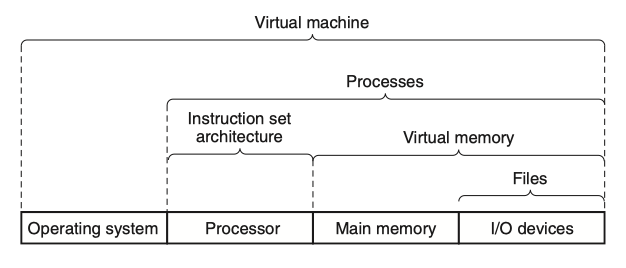

In software engineering and computer science, [abstraction](https://en.wikipedia.org/wiki/Abstraction_(computer_science)) is the process of generalizing concrete details, such as attributes, away from the study of objects and systems to focus attention on details of greater importance. Abstraction is a fundamental concept in computer science and software engineering, especially within the object-oriented programming paradigm.

In computing, [virtualization](https://en.wikipedia.org/wiki/Virtualization) (refer to [IBM](https://www.ibm.com/topics/virtualization), [AWS](https://aws.amazon.com/what-is/virtualization/)) is the act of creating a virtual (rather than actual) version of something at the same abstraction level, including virtual computer hardware platforms, storage devices, and computer network resources.

<!-- more -->

## Abstractions

[Computer Systems - A Programmer's Perspective](https://www.amazon.com/Computer-Systems-OHallaron-Randal-Bryant/dp/1292101768/) | Chapter 1: A Tour of Computer Systems

**1.9: Important Themes** - 1.9.3: The Importance of Abstractions in Computer Systems

The use of abstractions is one of the most important concepts in computer science. For example, one aspect of good programming practice is to formulate a simple *application program interface* (`API`) for a set of functions that allow programmers to use the code without having to delve into its inner workings. Different programming languages provide different forms and levels of support for abstraction, such as Java class declarations and C function prototypes.

<figure markdown="span">
    
    <figcaption>Figure 1.18 Some abstractions provided by a computer system.</figcaption>
</figure>

> A major theme in computer systems is to provide abstract representations at different levels to *hide* the complexity of the actual implementations.

We have already been introduced to several of the abstractions seen in computer systems, as indicated in Figure 1.18. On the processor side, the *instruction set architecture* (`ISA`) provides an abstraction of the actual processor hardware. With this abstraction, a machine-code program behaves as if it were executed on a processor that performs just one instruction at a time. The underlying hardware is far more elaborate, executing multiple instructions in parallel, but always in a way that is consistent with the simple, sequential model. By keeping the same execution model, different processor implementations can execute the same machine code while offering a range of cost and performance.

On the operating system side, we have introduced three abstractions: `files` as an abstraction of I/O devices, `virtual memory` as an abstraction of program memory, and `processes` as an abstraction of a running program. To these abstractions we add a new one: the `virtual machine`, providing an abstraction of the *entire* computer, including the operating system, the processor, and the programs. The idea of a virtual machine was introduced by IBM in the 1960s, but it has become more prominent recently as a way to manage computers that must be able to run programs designed for multiple operating systems (such as Microsoft Windows, Mac OS X, and Linux) or different versions of the same operating system.

**1.10 Summary**:

A computer system consists of hardware and systems software that cooperate to run application programs. Information inside the computer is represented as groups of bits that are interpreted in different ways, depending on the context. Programs are translated by other programs into different forms, beginning as ASCII text and then translated by compilers and linkers into binary executable files.

Processors read and interpret binary instructions that are stored in main memory. Since computers spend most of their time copying data between memory, I/O devices, and the CPU registers, the storage devices in a system are arranged in a hierarchy, with the *CPU registers* at the top, followed by multiple levels of hardware *cache* memories, *DRAM* main memory, and *disk* storage. Storage devices that are higher in the hierarchy are faster and more costly per bit than those lower in the hierarchy. Storage devices that are higher in the hierarchy serve as caches for devices that are lower in the hierarchy. Programmers can optimize the performance of their C programs by understanding and exploiting the memory hierarchy.

The operating system kernel serves as an *`intermediary`* between the application and the hardware. It provides three fundamental abstractions: (1) `Files` are abstractions for I/O devices. (2) `Virtual memory` is an abstraction for both main memory and disks. (3) `Processes` are abstractions for the processor, main memory, and I/O devices.

Finally, `networks` provide ways for computer systems to communicate with one another. From the viewpoint of a particular system, the network is just *another* I/O device.

## Virtualization

[Modern Operating Systems(4e)](https://www.amazon.com/Modern-Operating-Systems-Andrew-Tanenbaum/dp/013359162X/) | 7 VIRTUALIZATION AND THE CLOUD

In some situations, an organization has a multicomputer but does not actually want it. A common example is where a company has an email server, a Web server, an FTP server, some e-commerce servers, and others. These all run on different computers in the same equipment rack, all connected by a high-speed network, in other words, a multicomputer. One reason all these servers run on separate machines may be that one machine cannot handle the *load*, but another is *reliability*: management simply does not trust the operating system to run 24 hours a day, 365 or 366 days a year, with no failures. By putting each service on a separate computer, if one of the servers crashes, at least the other ones are not affected. This is good for security also. Even if some malevolent intruder manages to compromise the Web server, he will not immediately have access to sensitive emails also—a property sometimes referred to as **`sandboxing`**. While isolation and fault tolerance are achieved this way, this solution is expensive and hard to manage because so many machines are involved.

Mind you, these are just two out of many reasons for keeping separate machines. For instance, organizations often depend on more than one operating system for their daily operations: a Web server on Linux, a mail server on Windows, an e-commerce server for customers running on OS X, and a few other services running on various flavors of UNIX. Again, this solution works, but cheap it is definitely not.

What to do? A possible (and popular) solution is to use virtual machine technology, which sounds very hip and modern, but the idea is old, dating back to the 1960s. Even so, the way we use it today is definitely new. The main idea is that a `VMM` (*Virtual Machine Monitor*) creates the illusion of *multiple* (virtual) machines on the same physical hardware. A `VMM` is also known as a `hypervisor`. As discussed in Sec. 1.7.5, we distinguish between type 1 hypervisors which run on the bare metal, and type 2 hypervisors that may make use of all the wonderful services and abstractions offered by an underlying operating system. Either way, virtualization allows a single computer to **host** multiple virtual machines, each potentially running a completely different operating system.

The advantage of this approach is that a failure in one virtual machine does not bring down any others. On a virtualized system, different servers can run on different virtual machines, thus maintaining the *partial-failure model* that a multicomputer has, but at a lower cost and with easier maintainability. Moreover, we can now run multiple different operating systems on the same hardware, benefit from virtual machine isolation in the face of attacks, and enjoy other good stuff.

Of course, consolidating servers like this is like putting all your eggs in one basket. If the server running all the virtual machines fails, the result is even more catastrophic than the crashing of a single dedicated server. The reason virtualization works, however, is that most service outages are due not to faulty hardware, but to ill-designed, unreliable, buggy and poorly configured software, emphatically including operating systems. With virtual machine technology, the only software running in the highest privilege mode is the hypervisor, which has two orders of magnitude fewer lines of code than a full operating system, and thus two orders of magnitude fewer bugs. A hypervisor is simpler than an operating system because it does only one thing: *emulate* multiple copies of the bare metal (most commonly the Intel x86 architecture).

Running software in virtual machines has other advantages in addition to strong isolation. One of them is that having fewer physical machines saves money on hardware and electricity and takes up less rack space. For a company such as Amazon or Microsoft, which may have hundreds of thousands of servers doing a huge variety of different tasks at each data center, reducing the physical demands on their data centers represents a huge cost savings. In fact, server companies frequently locate their data centers in the middle of nowhere—just to be close to, say, hydroelectric dams (and cheap energy). Virtualization also helps in trying out new ideas. Typically, in large companies, individual departments or groups think of an interesting idea and then go out and buy a server to implement it. If the idea catches on and hundreds or thousands of servers are needed, the corporate data center expands. It is often hard to move the software to existing machines because each application often needs a different version of the operating system, its own libraries, configuration files, and more. With virtual machines, each application can take its own environment with it.

Another advantage of virtual machines is that checkpointing and migrating virtual machines (e.g., for load balancing across multiple servers) is much easier than migrating processes running on a normal operating system. In the latter case, a fair amount of critical state information about every process is kept in operating system tables, including information relating to open files, alarms, signal handlers, and more. When migrating a virtual machine, all that have to be moved are the memory and disk images, since all the operating system tables move, too.

Another use for virtual machines is to run legacy applications on operating systems (or operating system versions) no longer supported or which do not work on current hardware. These can run at the same time and on the same hardware as current applications. In fact, the ability to run at the same time applications that use different operating systems is a big argument in favor of virtual machines.

Yet another important use of virtual machines is for software development. A programmer who wants to make sure his software works on Windows 7, Windows 8, several versions of Linux, FreeBSD, OpenBSD, NetBSD, and OS X, among other systems no longer has to get a dozen computers and install different operating systems on all of them. Instead, he merely creates a dozen virtual machines on a single computer and installs a different operating system on each one. Of course, he could have partitioned the hard disk and installed a different operating system in each partition, but that approach is more difficult. First of all, standard PCs support only four primary disk partitions, no matter how big the disk is. Second, although a multiboot program could be installed in the boot block, it would be necessary to reboot the computer to work on a new operating system. With virtual machines, all of them can run at once, since they are really just glorified processes.

Perhaps the most important and buzzword-compliant use case for virtualization nowadays is found in the **`cloud`**. The key idea of a cloud is straightforward: outsource your computation or storage needs to a well-managed data center run by a company specializing in this and staffed by experts in the area. Because the data center typically belongs to someone else, you will probably have to pay for the use of the resources, but at least you will not have to worry about the physical machines, power, cooling, and maintenance. Because of the isolation offered by virtualizaton, cloud-providers can allow multiple clients, even competitors, to share a single physical machine. Each client gets a piece of the pie. At the risk of stretching the cloud metaphor, we mention that early critics maintained that the pie was only in the sky and that real organizations would not want to put their sensitive data and computations on someone else's resources. By now, however, virtualized machines in the cloud are used by countless organization for countless applications, and while it may not be for all organizations and all data, there is no doubt that cloud computing has been a success.
