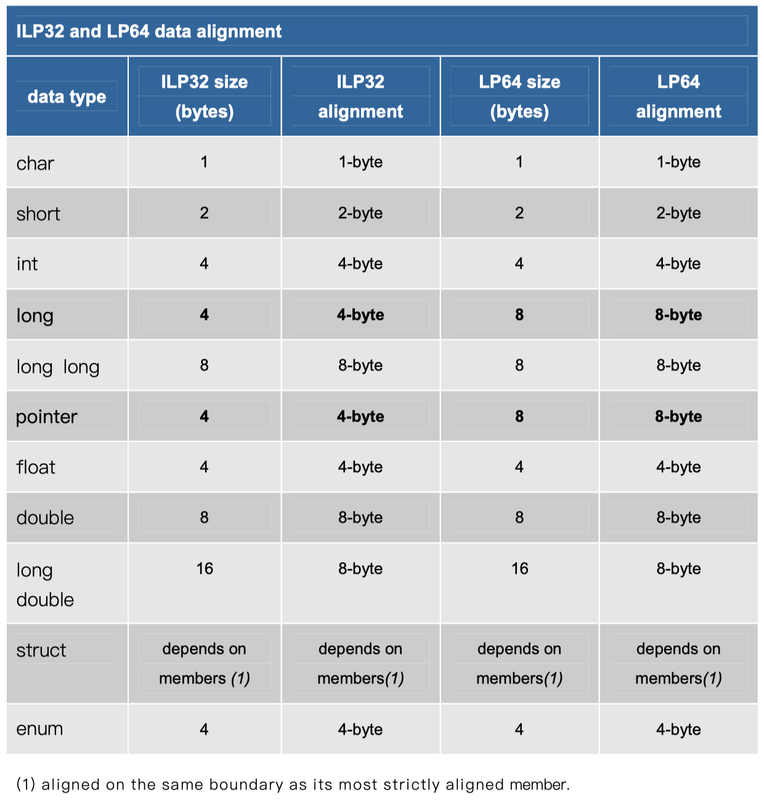
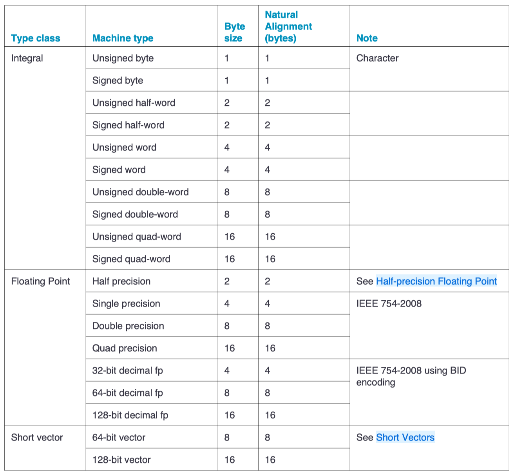

One of the low-level features of C/C++ is the ability to specify the precise alignment of objects in memory to take maximum advantage of a specific hardware architecture. By default, the compiler **aligns** class and struct members on their size value.

<!-- more -->

[Alignment and memory addresses](https://learn.microsoft.com/en-us/cpp/cpp/alignment-cpp-declarations#alignment-and-memory-addresses)

Alignment is a property of a memory address, expressed as the numeric address modulo a power of 2. For example, the address `0x0001103F` modulo 4 is 3. That address is said to be aligned to $4n+3$, where 4 indicates the chosen power of 2. The alignment of an address depends on the chosen power of 2. The same address modulo 8 is 7. An address is said to be aligned to X if its alignment is $Xn+0$.

CPUs execute instructions that operate on data stored in memory. The data are identified by their addresses in memory. A single datum also has a size. We call a datum ***naturally aligned*** if its address is aligned to its size. It's called ***misaligned*** otherwise. For example, an 8-byte floating-point datum is naturally aligned if the address used to identify it has an 8-byte alignment.

---

[Data structure alignment](https://en.wikipedia.org/wiki/Data_structure_alignment) is the way data is arranged and accessed in computer memory. It consists of three separate but related issues: `data alignment`, `data structure padding`, and `packing`.

The CPU in modern computer hardware performs reads and writes to memory most efficiently when the data is *naturally aligned*, which generally means that the data's memory address is a *multiple* of the data size. For instance, in a 32-bit architecture, the data may be aligned if the data is stored in four consecutive bytes and the first byte lies on a 4-byte boundary.

*Data alignment* is the aligning of elements according to their natural alignment. To ensure natural alignment, it may be necessary to insert some *padding* between structure elements or after the last element of a structure. For example, on a 32-bit machine, a data structure containing a 16-bit value followed by a 32-bit value could have 16 bits of padding between the 16-bit value and the 32-bit value to align the 32-bit value on a 32-bit boundary. Alternatively, one can *pack* the structure, omitting the padding, which may lead to slower access, but uses three quarters as much memory.

## reasons

[Data structure alignment - Problems](https://en.wikipedia.org/wiki/Data_structure_alignment#Problems):

The CPU accesses memory by a single memory word at a time. As long as the memory word size is at least as large as the largest primitive data type supported by the computer, **aligned** accesses will always access a *single* memory word. This may not be true for **misaligned** data accesses.

If the highest and lowest bytes in a datum are not within the same memory word the computer must split the datum access into multiple memory accesses. This requires a lot of complex circuitry to generate the memory accesses and coordinate them. To handle the case where the memory words are in different memory pages the processor must either verify that both pages are present before executing the instruction or be able to handle a *TLB miss* or a *page fault* on any memory access during the instruction execution.

《[C语言标准与实现(姚新颜)-2004](https://att.newsmth.net/nForum/att/CProgramming/3213/245)》 #1基础知识 | 11 内存地址对齐：

以P6处理器为例，使数据的地址按一定的边界对齐主要有三方面的考虑：

1. **提高效率**：P6处理器读/写内存中的数据需要一个或数个内存总线周期，对于8位数据，处理器一个周期就可以访问完毕；对于16位数据，如果数据的地址是2字节对齐（被2整除），P6 处理器耗费一个总线周期就可以访问完毕；如果不是双字节对齐，但只要它的地址没有横跨在相邻两个对齐的32位数据地址上，则处理器仍然只需一个内存总线周期就可完成操作，否则处理器需要两个周期才能完成操作；对于32位数据，如果数据的地址是4字节对齐（被4整除）的话，P6处理器耗费一个总线周期就可以访问完毕，否则需要两个周期进行操作；对于64位数据，如果数据的地址是8字节对齐（被8整除）的话，P6处理器耗费一个总线周期就可以访问完毕，否则需要两个周期进行操作。可见，对于最常用的32/64位数据，访问地址对齐的数据比访问地址没有对齐的数据在理论上节省50%的时间，因此，我们可以看到 gcc 在默认情况下生成的汇编代码总是把数据按照对应的对齐规则指示链接程序安排适当的地址。

2. **指令要求**：某些 SSE、SSE2 指令要求内存操作数的地址必须是16字节对齐的，否则就引发异常。Pentium III 处理器开始支持 SSE 指令，Pentium 4处理器开始支持 SSE2 指令， 而这些指令的其中一部分需要地址是16字节对齐的内存操作数，例如：`movdqa`（SSE 指令）、`movapd`（SSE2指令）。当使用这些指令并且其中一个操作数是内存操作数时，内存操作数的地址必须满足16字节对齐，否则处理器引发13号异常。

3. 保证对内存的访问是**原子操作**（atomic operation）。在多处理器环境下，为了保证各个处理器对内存操作的正确性，系统必须确保某些读/写操作在一个内存总线周期内完成。从前面我们已经知道，对于地址满足适当对齐条件的16/32/64位数据，P6处理器均可以在一个内存总线周期内完成访问，这很自然地满足原子操作的要求。如果数据地址不满足对应的对齐条件，那么处理器必须用2个内存总线周期才能完成读/写操作，万一在这两个周期之间其它处理器刚好获得总线的使用权并且在随后的连续两个周期内访问到该数据，则该访问的结果将是不正确的。虽然P6处理器可以使用 LOCK 命令前缀在一条指令执行完毕之前锁住总线的使用权，但 LOCK 前缀的使用范围有限，并不是所有指令都可以加上 LOCK 前缀，例如最常见的 `MOV` 指令就不能使用 LOCK 前缀。因此，要保证数据的完整性，最好让数据的地址按照适当的规则对齐从而保证处理器访问内存是原子操作。

《[现代C++语言核心特性解析-2021](https://item.jd.com/12942311.html)》 - 第30章 alignas 和 alignof：

一个类型的属性除了其数据长度，还有一个重要的属性——数据对齐的字节长度。

为什么我们需要数据对齐呢？原因说起来很简单，就是硬件需要。

首当其冲的就是**CPU**了，CPU对数据对齐有着迫切的需求，一个好的对齐字节长度可以让CPU运行起来更加轻松快速。反过来说，不好的对齐字节长度则会让CPU运行速度减慢，甚至抛出错误。通常来说所谓好的对齐长度和CPU访问数据总线的宽度有关系，比如CPU访问32位宽度的数据总线，就会期待数据是按照32位对齐，也就是4字节。这样CPU读取4字节的数据只需要对总线访问一次，但是如果要访问的数据并没有按照4字节对齐，那么CPU需要访问数据总线两次，运算速度自然也就减慢了。另外，对于数据对齐问题引发错误的情况（Alignment Fault），通常会发生在ARM架构的计算机上。当然除了CPU之外，还有**其他硬件**也需要数据对齐，比如通过DMA访问硬盘，就会要求内存必须是4K对齐的。

总的来说，配合现代编译器和CPU架构，可以让程序获得令人难以置信的性能，但这种良好的性能取决于某些编程实践，其中一种编程实践是正确的数据对齐。

[Computer Systems - A Programmer’s Perspective](https://www.amazon.com/Computer-Systems-OHallaron-Randal-Bryant/dp/1292101768/) - 3.9.3: Data Alignment:

Many computer systems place restrictions on the allowable addresses for the primitive data types, requiring that the address for some objects must be a multiple of some value $K$ (typically 2, 4, or 8). Such ***alignment restrictions*** simplify the design of the hardware forming the interface between the processor and the memory system.

For example, suppose a processor always fetches 8 bytes from memory with an address that must be a multiple of 8. If we can guarantee that any `double` will be aligned to have its address be a multiple of 8, then the value can be read or written with a *single* memory operation. Otherwise, we may need to perform *two* memory accesses, since the object might be split across two 8-byte memory blocks.

## natural alignment

[Computer Systems - A Programmer’s Perspective](https://www.amazon.com/Computer-Systems-OHallaron-Randal-Bryant/dp/1292101768/) - 3.9.3: Data Alignment:

The x86-64 hardware will work correctly regardless of the alignment of data. However, Intel recommends that data be aligned to improve memory system performance. Their alignment rule is based on the principle that any primitive object of $K$ bytes must have an *address* that is a multiple of $K$. We can see that this rule leads to the following alignments:

K | Types
--|------
1 | char
2 | short
4 | int, float
8 | long, double, char *

Alignment is **enforced** by making sure that every data type is organized and allocated in such a way that every object within the type **satisfies** its alignment restrictions.

[ILP32 and LP64 data models.PDF](https://scc.ustc.edu.cn/zlsc/czxt/200910/W020100308601263456982.pdf) - [HP-UX](https://en.wikipedia.org/wiki/HP-UX) 64-bit data model list ILP32 and LP64 data alignment:

### x86 ABI

[x64 ABI conventions](https://learn.microsoft.com/en-us/cpp/build/x64-software-conventions#x64-type-and-storage-layout) - [x64 type and storage layout](https://learn.microsoft.com/en-us/cpp/build/x64-software-conventions#x64-type-and-storage-layout) - Scalar types

- Byte - 8 bits / 1 bytes
- [Word](./x86-word.md) - 16 bits / 2 bytes
- Doubleword - 32 bits / 4 bytes
- Quadword - 64 bits / 8 bytes
- Octaword - 128 bits / 16 bytes

Scalar type | C data type | Storage size (in bytes) | Recommended alignment
------------|-------------|-------------------------|----------------------
INT8 | `char` | 1 | Byte
UINT8 | `unsigned char` | 1 | Byte
INT16 | `short` | 2 | Word
UINT16 | `unsigned short` | 2 | Word
INT32 | `int`, `long` | 4 | Doubleword
UINT32 | `unsigned int`, `unsigned long` | 4 | Doubleword
INT64 | `__int64` | 8 | Quadword
UINT64 | `unsigned __int64` | 8 | Quadword
FP32 (single precision) | `float` | 4 | Doubleword
FP64 (double precision) | `double` | 8 | Quadword
POINTER | `*` | 8 | Quadword
\_\_m64 | `struct __m64` | 8 | Quadword
\_\_m128 | `struct __m128` | 16 | Octaword

参考 Apple Developer Document 相关内容:

- [32-bit](https://developer.apple.com/library/archive/documentation/DeveloperTools/Conceptual/LowLevelABI/100-32-bit_PowerPC_Function_Calling_Conventions/32bitPowerPC.html) / [64-bit](https://developer.apple.com/library/archive/documentation/DeveloperTools/Conceptual/LowLevelABI/110-64-bit_PowerPC_Function_Calling_Conventions/64bitPowerPC.html) PowerPC Function Calling Conventions - Data Types and Data Alignment

!!! note "Apple PowerPC alignment modes"

    1. **Natural alignment**. The alignment of a data type when allocated in memory or assigned a memory address.
    The natural alignment of a data type is its *size*.
    2. **Embedding alignment**. The alignment of a data type within a composite data structure.

    > For example, the alignment of an `unsigned short` variable on the stack may differ from that of an `unsigned short` data item embedded in a data structure.

- [IA-32 Function Calling Conventions](https://developer.apple.com/library/archive/documentation/DeveloperTools/Conceptual/LowLevelABI/130-IA-32_Function_Calling_Conventions/IA32.html) - Data Types and Data Alignment
- [Writing 64-bit Intel code for Apple Platforms](https://developer.apple.com/documentation/xcode/writing-64-bit-intel-code-for-apple-platforms) - Handle data types and data alignment properly

!!! note "Apple IA-32 alignment rules"

    1. Scalar data types use their ***natural*** alignment.
    2. Composite data types (arrays, structures, and unions) take on the alignment of the member with the ***highest*** alignment. An array assumes the ***same*** alignment as its elements. The size of a composite data type is a *multiple* of its alignment (padding may be required).

### ARM ABI

[ARM Compiler v5.06 for uVision armcc User Guide](https://developer.arm.com/documentation/dui0375/g/C-and-C---Implementation-Details/Basic-data-types-in-ARM-C-and-C--) ｜ Basic data types in ARM C and C++ - Size and alignment of basic data types

- The following table gives the size and natural alignment of the basic data types under ILP32 data model.

[aapcs64](https://github.com/ARM-software/abi-aa/blob/2a70c42d62e9c3eb5887fa50b71257f20daca6f9/aapcs64/aapcs64.rst) - 5.1 Fundamental Data Types, 5.9   Composite Types:

1. The member alignment of an element of a composite type is the alignment of that member after the application of any language alignment *modifiers* to that member.
2. The natural alignment of a composite type is the ***maximum*** of each of the member alignments of the 'top-level' members of the composite type i.e. before any alignment adjustment of the entire composite is applied.

> 注意：这里的 `word` 沿袭了 A32/T32 下的 word-size。

<figure markdown="span">
    
    <figcaption>Byte size and byte alignment of fundamental data types</figcaption>
</figure>

[Overview of ARM64 ABI conventions](https://learn.microsoft.com/en-us/cpp/build/arm64-windows-abi-conventions) - [Alignment](https://learn.microsoft.com/en-us/cpp/build/arm64-windows-abi-conventions#alignment)

Default layout alignment for `locals`:

Size in bytes | Alignment in bytes
--------------|-------------------
1 | 1
2 | 2
3, 4 | 4
> 4 | 8

Default layout alignment for `globals` and `statics`:

Size in bytes | Alignment in bytes
--------------|-------------------
1 | 1
2 - 7 | 4
8 - 63 | 8
>= 64 | 16

[Writing ARM64 code for Apple platforms](https://developer.apple.com/documentation/xcode/writing-arm64-code-for-apple-platforms) - Handle data types and data alignment properly:

| Data type | Size (in bytes) | Natural alignment (in bytes) |
|-----------|-----------------|------------------------------|
| `BOOL`, `bool` | 1 | 1 |
| `char` | 1 | 1 |
| `short` | 2 | 2 |
| `int` | 4 | 4 |
| `long` | 8 | 8 |
| `long long` | 8 | 8 |
| pointer | 8 | 8 |
| `size_t` | 8 | 8 |
| `NSInteger` | 8 | 8 |
| `CFIndex` | 8 | 8 |
| `fpos_t` | 8 | 8 |
| `off_t` | 8 | 8 |

## x86 misalignment

The x86-64 hardware will work correctly regardless of the alignment of data.

[Are machine code instructions fetched in little endian 4-byte words on an Intel x86-64 architecture?](
https://stackoverflow.com/a/68229991/3721132)

x86 machine code is a [byte-stream](https://stackoverflow.com/questions/60905135/how-to-interpret-objdump-disassembly-output-columns); there's nothing word-oriented about it, except for 32-bit displacements and immediates which are little-endian. e.g. in `add qword [rdi + 0x1234], 0xaabbccdd`. It's physically fetched in 16-byte or 32-byte chunks on modern CPUs, and split on instruction boundaries in parallel to feed to decoders in parallel.

x86-64 is not a word-oriented architecture; there is no single natural word-size, and things **don't** have to be aligned. That concept is not very useful when thinking about x86-64. The integer register width happens to be 8 bytes, but that's not even the default operand-size in machine code, and you can use any operand-size from byte to qword with most instructions, and for SIMD from 8 or 16 byte up to 32 or 64 byte. And most importantly, alignment of wider integers isn't required in machine code, or even for data.

[assembly - What's the size of a QWORD on a 64-bit machine? - Stack Overflow](https://stackoverflow.com/a/55430777/3721132)

The whole concept of "machine word" [doesn't really apply to x86](https://stackoverflow.com/questions/68229585/are-machine-code-instructions-fetched-in-little-endian-4-byte-words-on-an-intel/68229991#68229991), with its machine-code format being a byte stream, and equal support for multiple operand-sizes, and unaligned loads/stores that mostly **don't** care about naturally aligned stuff, only cache line boundaries for normal cacheable memory.

[Modern C, 1st Edition, 2019](https://www.amazon.com/Modern-C-Jens-Gustedt-ebook/dp/B0978347Z6/) - 12 The C memory model | 12.7 Alignment:

Some architectures are more tolerant of **misalignment** than others, and we might have to force the system to error out on such a condition. We use the following function at the beginning to force crashing:

!!! note "enable alignment check for i386 processors"

    Intel’s i386 processor family is quite tolerant in accepting misalignment of data. This can lead to irritating bugs when ported to other architectures that are not as tolerant.

    This function enables a check for this problem also for this family or processors, such that you can be sure to detect this problem early.

    I found that code on [Ygdrasil’s blog](http://orchistro.tistory.com/206): `void enable_alignment_check(void);`.
