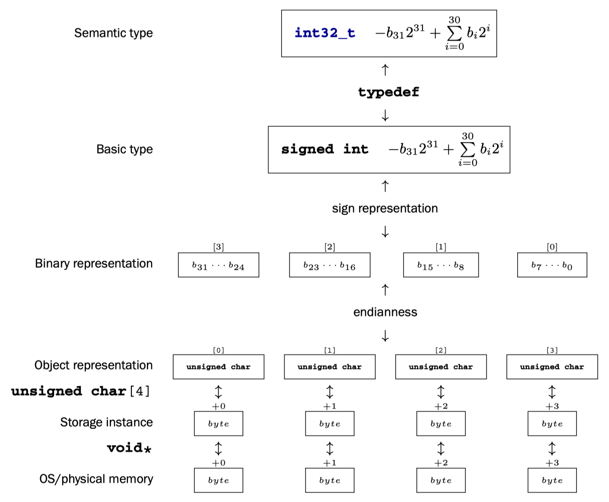

Pointers present us with a certain abstraction of the environment and state in which our program is executed, the *C memory model*. We may apply the unary operator & to (almost) all objects to retrieve their address and use it to inspect and change the state of our execution.

<!-- more -->

This access to objects via pointers is still an abstraction, because seen from C, no distinction of the “real” location of an object is made. It could reside in your computer’s RAM or on a disk file, or correspond to an IO port of a temperature sensor on the moon; you shouldn’t care. C is supposed to do the right thing, regardless.

And indeed, on modern operating systems, all you get via pointers is something called *virtual memory*, basically a fiction that maps the *address space* of your process to physical memory addresses of your machine.

The only thing C must care about is the *type* of the object a pointer addresses. Each pointer type is derived from another type, its base type, and each such derived type is a distinct new type.

Figure 12.1 The different levels of the value-memory model for an `int32_t`. Example of a platform that maps this type to a 32-bit signed int that has two’s complement sign representation and little-endian object representation.



> TAKEAWAY 12.1 Pointer types with distinct base types are distinct.

In addition to providing a virtual view of physical memory, the memory model also simplifies the view of objects themselves. It makes the assumption that each object is a collection of bytes, the object representation (section 12.1); 2 see figure 12.1 for a schematic view. A convenient tool to inspect that object representation is unions (section 12.2). Giving direct access to the object representation (section 12.3) allows us to do some fine tuning; but on the other hand, it also opens the door to unwanted or conscious manipulations of the state of the abstract machine: tools for that are untyped pointers (section 12.4) and casts (section 12.5). Effective types (section 12.6) and alignment (section 12.7) describe formal limits and platform constraints for such manipulations.

## A uniform memory model

Even though generally all objects are typed, the memory model makes another simplification: that all objects are an assemblage of ***bytes***. The `sizeof` operator that we introduced in the context of arrays measures the size of an object in terms of the bytes that it uses. There are three distinct types that by definition use exactly one byte of memory: the character types `char`, `unsigned char`, and `signed char`.

> TAKEAWAY 12.2 sizeof(char) is 1 by definition.

Not only can all objects be “accounted” in size as character types on a lower level, they can even be inspected and manipulated as if they were arrays of such character types. A little later, we will see how this can be achieved, but for the moment we will just note the following:

> TAKEAWAY 12.3 Every object A can be viewed as `unsigned char[sizeof A]`.
> TAKEAWAY 12.4 Pointers to character types are special.

Unfortunately, the types that are used to compose all other object types are derived from char, the type we looked at for the characters of strings. This is merely a historical accident, and you shouldn’t read too much into it. In particular, you should clearly distinguish the two different use cases.

> TAKEAWAY 12.5 Use the type `char` for character and string data.
> TAKEAWAY 12.6 Use the type `unsigned char` as the *atom* of all object types.

The type `signed char` is of much less importance than the two others.

As we have seen, the `sizeof` operator counts the size of an object in terms of how many `unsigned char`s it occupies.

> TAKEAWAY 12.7 The `sizeof` operator can be applied to objects and object types.

In the previous discussion, we can also distinguish two syntactic variants for `sizeof`: with and without parentheses. Whereas the syntax for an application to objects can have both forms, the syntax for types needs parentheses:

> TAKEAWAY 12.8 The size of all objects of type T is given by `sizeof(T)`.

## Unions & Endianess

Let us now look at a way to examine the individual bytes of objects. Our preferred tool for this is the `union`. These are similar in declaration to `struct` but have different semantics:

```c title="endianness.c"
#include <inttypes.h>

typedef union unsignedInspect unsignedInspect;
union unsignedInspect {
unsigned val;
unsigned char bytes[sizeof(unsigned)];
};
unsignedInspect twofold = { .val = 0xAABBCCDD, };
```

The difference here is that such a `union` doesn’t collect objects of different type into one bigger object, but rather *overlays* an object with a different type interpretation. That way, it is the perfect tool to **inspect** the individual bytes of an object of another type.

Let us first try to figure out what values we would expect for the individual bytes. In a slight abuse of language, let us speak of the different parts of an unsigned number that correspond to the bytes as *representation digits*. Since we view the bytes as being of type `unsigned char`, they can have values 0 ... `UCHAR_MAX`, inclusive, and thus we interpret the number as written with a base of `UCHAR_MAX+1`. In the example, on my machine, a value of type `unsigned` can be expressed with `sizeof(unsigned) == 4` such representation digits, and I chose the values 0xAA, 0xBB, 0xCC, and 0xDD for the highest- to lowest-order representation digit. The complete `unsigned` value can be computed using the following expression, where `CHAR_BIT` is the number of bits in a character type:

```c
((0xAA << (CHAR_BIT * 3)) 
    |(0xBB << (CHAR_BIT * 2)) 
    |(0xCC << CHAR_BIT) 
    |0xDD)
```

With the `union` defined earlier, we have two different facets to look at the same twofold object: twofold.val presents it as being an `unsigned`, and twofold.bytes presents it as an array of `unsigned char`. Since we chose the length of twofold.bytes to be exactly the size of twofold.val, it represents *exactly* its bytes, and thus gives us a way to inspect the ***object representation*** C of an `unsigned` value: all its representation digits:

```c title="endianness.c"
printf("value is 0x%.08X\n", twofold.val);
for (size_t i = 0; i < sizeof twofold.bytes; ++i)
    printf("byte[%zu]: 0x%.02hhX\n", i, twofold.bytes[i]);
```

On my computer, I receive a result as shown here:

```Shell
value is 0xAABBCCDD
byte[0]: 0xDD
byte[1]: 0xCC
byte[2]: 0xBB
byte[3]: 0xAA
```

For my machine, we see that the output has the low-order representation digits of the integer first, then the next-lower order digits, and so on. At the end, the highest-order digits are printed. So the in-memory representation of such an integer on my machine has the loworder representation digits before the high-order ones.

This is *not* normalized by the standard, but is an implementation-defined behavior.

That is, a platform provider might decide to provide a *storage order* that has the highest-order digits first, and then print lower-order digits one by one. The storage order, the ***endianness***, as given for my machine, is called ***little-endian***. A system that has high-order representation digits first is called ***big-endian***. Both orders are commonly used by modern processor types. Some processors are even able to switch between the two orders on the fly.

The previous output also shows another implementation-defined behavior: I used the feature of my platform that one representation digit can be printed nicely by using two hexadecimal digits. In other words, I assumed that `UCHAR_MAX+1` is 256 and that the number of value bits in an `unsigned char`, `CHAR_BIT`, is 8. Again, this is implementation-defined behavior: although the vast majority of platforms have these properties, there are still some around that have wider character types.

> TAKEAWAY 12.10 On most architectures, `CHAR_BIT` is 8 and `UCHAR_MAX` is 255.

In the example, we have investigated the in-memory representation of the simplest arithmetic base types, unsigned integers. Other base types have in-memory representations that are more complicated: signed integer types have to encode the sign; floating-point types have to encode the sign, mantissa, and exponent; and pointer types may follow any internal convention that fits the underlying architecture.

---

!!! warning "Copyright clarification"

    Excerpt from [Modern C, 1st Edition, 2019](https://www.amazon.com/Modern-C-Jens-Gustedt-ebook/dp/B0978347Z6/).
    Copyright credit to [Jens Gustedt](https://gustedt.gitlabpages.inria.fr/modern-c/). 🫡
    For studying only, not commercial.
