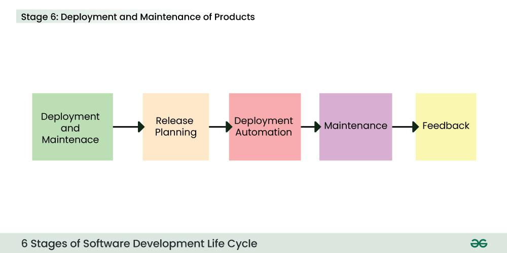

The abbreviation `SDLC` stands for [Software Development Life Cycle](https://en.wikipedia.org/wiki/Software_development_process). It is frequently used in technology to refer to the entire process of technology innovation and support.

In software engineering, a software development process or software development life cycle is a process of planning and managing software development. It typically involves dividing software development work into smaller, parallel, or sequential steps or sub-processes to improve design and/or product management.

Most modern development processes can be vaguely described as [agile](https://en.wikipedia.org/wiki/Agile_software_development "Agile software development"). Other methodologies include [waterfall](https://en.wikipedia.org/wiki/Waterfall_model "Waterfall model"), [prototyping](https://en.wikipedia.org/wiki/Software_prototyping "Software prototyping"), [iterative and incremental development](https://en.wikipedia.org/wiki/Iterative_and_incremental_development "Iterative and incremental development"), [spiral development](https://en.wikipedia.org/wiki/Spiral_development "Spiral development"), [rapid application development](https://en.wikipedia.org/wiki/Rapid_application_development "Rapid application development"), and [extreme programming](https://en.wikipedia.org/wiki/Extreme_programming "Extreme programming").

<!-- more -->

## whatis

Software development life cycle (SDLC) is a structured *process* that software organizations/development teams use to design, develop, and build high-quality software.

SDLC is a *methodology* that defines the entire procedure of software development step-by-step. It outlines a series of steps that divide the software development process into tasks you can assign, complete, and measure.

In practice, SDLC in software engineering models consists of a precise plan for each phase/stage so that each phase/stage of the software development model can perform its task efficiently to deliver the software at a low cost(cost-effective) within a given time frame(time-efficient) that meets users' requirements.

The life cycle defines a method to minimize project risks through forward planning and to improve the quality of the software throughout the development process. The goal of the SDLC model is to deliver high-quality, maintainable software that meets customer expectations during production and beyond.

## stages

How does SDLC work?

The development process goes through several stages as developers add new features and fix bugs in the software. SDLC outlines/specifies the task(s) to be performed by a software engineer or developer at various stages to build a software application.

It ensures that the end product is able to meet the customer's expectations and fits within the overall budget. Hence, it's vital for a software developer to have prior knowledge of this software development process.

The details of the SDLC process vary for different teams. However, the typical SDLC model involves six phases or stages while developing any software. SDLC is a collection of these six stages, and the stages of SDLC are as follows:

1. Planning
2. Defining
3. Design
4. Development
5. Testing
6. Deployment

### Planning(Research & Collect)

The quality of the project is a result of planning. Planning is a crucial step in everything, just as in software development.

At this stage, the product team collects ideas from various stakeholders such as customers, internal and external experts, and managers. The initial requirements are gathered/attained from customer input, and sales/market surveys/research.

The *product team* will produce a draft software requirements specification document, which may include a product prototype. The specification may define the project scope, objectives and deliverables. After internal evaluation (e.g. cost-benefit analysis), they may contact the project management team for a staffing review and resource estimate.

### Defining(Analyse & Review)

The product manager then takes the draft specification and discusses it with the development team. Together they analyze the requirements from a product logic and technical realization perspective. This is usually called a Software Requirements Review (`SRR`).

After the SRR, the product manager may revise the requirements back and forth until every conceivable product detail for the target software is agreed. The product manager may take the revised specification for further validation with customers, market analysts, and stakeholders. Next all requirements are specified and brought to an approved state.

This is achieved through the use of the `SRS` (Software Requirement Specification). It is a type of document that specifies all the things that need to be defined and created throughout the project cycle. The SRS sets expectations and defines common goals. In the SRS, the product manager breaks down the requirements into logical details that will aid project planning.

According to the product prototype and revised SRS, the UI/UX team can design a basic project with all the available information. Meanwhile, the development team, after assessing the feasibility, is asked to provide a specific schedule. The schedule should include a start and end date. This will allow the project manager to allocate resources/manpower.

### Design(arch, preliminary, detailed)

In the design phase, software engineers analyze requirements and identify the best solutions to create the software. For example, they may consider integrating pre-existing modules, make technology choices, and identify development tools. They will look at how to best integrate the new software into any existing IT infrastructure the organization may have.

SRS is a reference for software designers to come up with the best architecture for the software. Hence, with the requirements defined in SRS, multiple designs for the product architecture are present in the Design Document Specification (`DDS`).

This DDS is assessed by market analysts and stakeholders. After evaluating all the possible factors, the most practical and logical design is chosen for development.

DSS typically consists of general architecture, preliminary and detailed design at different levels of granularity. Following the SRS and DDS, developers can estimate costs, create a schedule with specific timelines, and have a detailed plan to achieve their goals.

### Development(coding, implementing)

At this stage, the fundamental development of the product starts, i.e. the development team codes the product. For this, developers use a specific programming code as per the design in the DDS. Hence, it is important for the coders to follow the protocols set by the association. They analyze the requirements to identify smaller coding tasks they can do daily to achieve the final result.

Conventional programming tools such as compilers, interpreters, debuggers, etc. are also used at this stage. Some popular languages such as C/C++, Python, Java, etc. are used according to the software regulations. Version control, code review, building, CI (continuous integration) may be involved in the development phase.

Simultaneously, the test team should start designing and writing test cases. They will usually ask the development team to review the test cases before testing.

### Testing(track, bugfix, retest)

Quality analysis includes testing the software for errors and checking if it meets customer requirements. After the development of the product, testing of the software is necessary to ensure its smooth execution.

Because developers immediately test the code they write, there is minimal testing at each stage of the SDLC. Once the key features of the product have been implemented and self-tested according to the SRS and DDS, the product can be handed over to the product manager for experience. If the product experience is satisfactory and the self-test checklist is passed, the product can be formally submitted for testing.

The test team combines automated and manual testing to check against their test cases. At this stage, all likely flaws/issues are tracked down, fixed and retested iteratively. This ensures that the product meets/confronts the quality requirements of SRS.

### Deployment(config, preview, release)

After detailed unit testing and system integration testing, it's expected that all bugs have been fixed. The product can then be showcased to the Senior Product Manager. If it passes the showcase, the product is ready for release. The final product is rolled out in phases according to the organisation's strategy.

Typically, the deployment team will perform the configuration and test the preview/pre-release version of the production in a real industrial environment, e.g. A/B test, test flight. The process involves feedback-improving and CD (continuous delivery/deployment). It is important to ensure its fulfilment and smooth performance.

If it performs well, after retrieving beneficial feedback, the company releases it as it is or with auxiliary improvements to make it further helpful for the customers. However, this alone is not enough. Therefore, along with the deployment, the product's supervision.

When teams develop software, they code and test on a different copy of the software than the one that the users have access to. The software that customers use is called production, while other copies are said to be in the build environment, or testing environment.

Having separate build and production environments ensures that customers can continue to use the software even while it is being changed or upgraded. The deployment phase includes several tasks to move the latest build copy to the production environment, such as packaging, environment configuration, and installation.

### Maintenance

After deployment, it comes to the stage of maintenance. In the maintenance phase, among other tasks, the team fixes bugs, resolves customer issues, and manages software changes. In addition, the team monitors overall system performance, security, and user experience to identify new ways to improve the existing software.

## models

A software development lifecycle (SDLC) model conceptually presents SDLC in an organized fashion to help organizations implement it. Different models arrange the SDLC phases in varying chronological order to optimize the development cycle. We look at some popular SDLC models below.

### Waterfall

The waterfall model is very simple. It is the fundamental model of the SDLC and is the basis for all other models.

The waterfall model arranges all the phases *sequentially* so that each new phase **depends** on the outcome of the previous phase. Conceptually, the design flows from one phase down to the next, like that of a `waterfall`.

In the waterfall model, once a phase seems to be completed, it cannot be changed, and due to this less flexible nature, the waterfall model is not in practice anymore.

**Pros and cons**:

The waterfall model provides discipline to project management and gives a tangible output at the *end* of each phase. However, there is little room for change once a phase is considered complete, as changes can affect the software's delivery time, cost, and quality. Therefore, the model is most suitable for *small* software development projects, where tasks are easy to arrange and manage and requirements can be pre-defined accurately.

### Iterative

In the Iterative model in SDLC, each cycle results in a *semi-developed* but *deployable* version; with each cycle, some requirements are added to the software, and the final cycle results in the software with the complete requirement specification.

The iterative process suggests that teams begin software development with a small *subset* of requirements. Then, they iteratively *enhance* versions over time until the complete software is ready for production. The team **produces** a *new* software version at the end of each iteration.

**Pros and cons**:

It’s easy to identify and manage risks, as requirements can change between iterations. However, repeated cycles could lead to scope change and underestimation of resources.

### Spiral

The spiral model in SDLC is one of the most crucial SDLC models that provides support for *risk handling*. It has various spirals in its diagrammatic representation; the number of spirals depends upon the type of project. Each loop in the spiral structure indicates the Phases of the Spiral model.

The spiral model **combines** the iterative model's small repeated cycles with the waterfall model's linear sequential flow to prioritize *risk analysis*. You can use the spiral model to ensure software's gradual release and improvement by building prototypes at each phase.

**Pros and cons**:

The spiral model is suitable for large and complex projects that require *frequent* changes. However, it can be expensive for smaller projects with a limited scope.

### Agile

The agile model in SDLC was mainly designed to adapt to changing requests quickly. The main goal of the Agile model is to facilitate quick project completion. The agile model refers to a group of development processes. These processes have some similar characteristics but also possess certain subtle differences among themselves.

The agile model arranges the SDLC phases into several development cycles. The team iterates through the phases rapidly, delivering only small, incremental software changes in each cycle. They continuously **evaluate** requirements, plans, and results so that they can **respond** quickly to change. The agile model is both *iterative* and *incremental*, making it more *efficient* than other process models.

**Pros and cons**:

Rapid development cycles help teams identify and address issues in *complex* projects early on and before they become significant problems. They can also engage customers and stakeholders to obtain feedback throughout the project lifecycle. However, overreliance on customer feedback could lead to excessive scope changes or end the project midway.

## FAQ

1. How does SDLC work?

> The SDLC involves planning the project, gathering requirements, designing the system, coding the software, testing it for issues, deploying it to users, and maintaining it post-release. Each phase ensures the software meets user needs and functions correctly, from start to finish.

2. What are the main phases of SDLC?

> The main phases of SDLC include Requirements (Planning & Defining), Design, Implementation (Coding), Testing, Deployment, and Maintenance. These phases represent the stages a software project goes through from initiation to completion.

3. Why is SDLC important?

> SDLC ensures a structured and organized *approach* to software development, leading to the creation of reliable and high-quality software. It helps *manage* resources efficiently, *reduces* development time, and *minimizes* the risk of project failure.

4. What are the key objectives of SDLC?

> The key objectives of SDLC include delivering a high-quality product, meeting customer requirements, managing project resources effectively, minimizing risks, and providing a clear and transparent development process.

5. How does SDLC differ from Agile methodology?

> SDLC is a more *traditional*, *sequential* approach to software development, while Agile is an *iterative* and *flexible* methodology. SDLC follows a structured path, while Agile allows for *incremental* development with frequent reassessment and adaptation.

## terms

### Systems development lifecycle

The abbreviation `SDLC` can sometimes refer to the [Systems Development Lifecycle](https://en.wikipedia.org/wiki/Systems_development_life_cycle), the process for planning and creating an IT system. As a system can be composed of hardware only, software only, or a combination of both, the system typically consists of several hardware and software components that work together to perform complex functions.

**Software development lifecycle compared to systems development lifecycle**

The software development lifecycle addresses *only* the development and testing of software components. On the other hand, system development is a *broader* superset involving the setup and management of the software, hardware, people, and processes that can make up a system. It can include tasks like organizational training and change management policies that don't fall under the software development umbrella.

### Application lifecycle management

Application lifecycle management (`ALM`) is the creation and maintenance of software applications *until* they are no longer required. It involves multiple processes, tools, and people working together to manage every lifecycle aspect, such as ideation, design and development, testing, production, support, and eventual redundancy.

**SDLC compared to ALM**

SDLC describes the application development phase in greater detail. It is a *part* of ALM. ALM includes the entire lifecycle of the application and continues *beyond* SDLC. ALM can have multiple SDLCs during an application's lifecycle.

## references

[Software Development Life Cycle (SDLC) - GeeksforGeeks](https://www.geeksforgeeks.org/software-development-life-cycle-sdlc/)
[What is SDLC? - Software Development Lifecycle Explained - AWS](https://aws.amazon.com/what-is/sdlc/)
