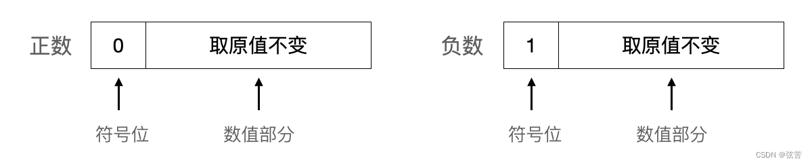
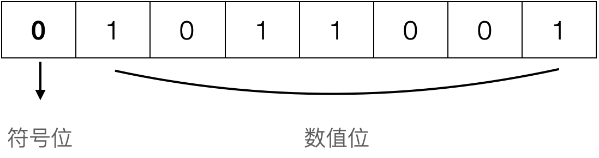
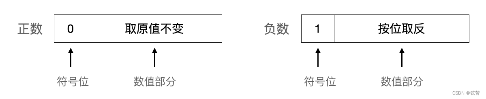
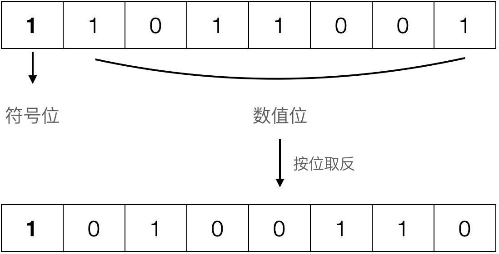
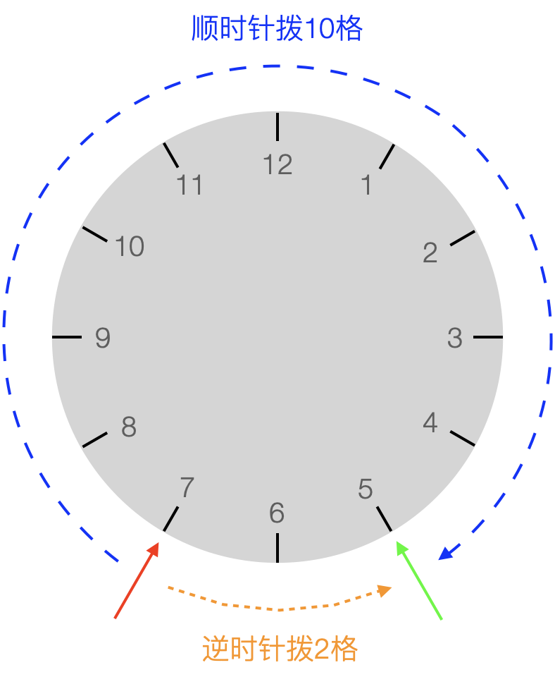
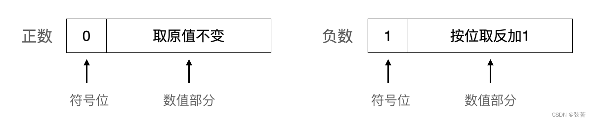
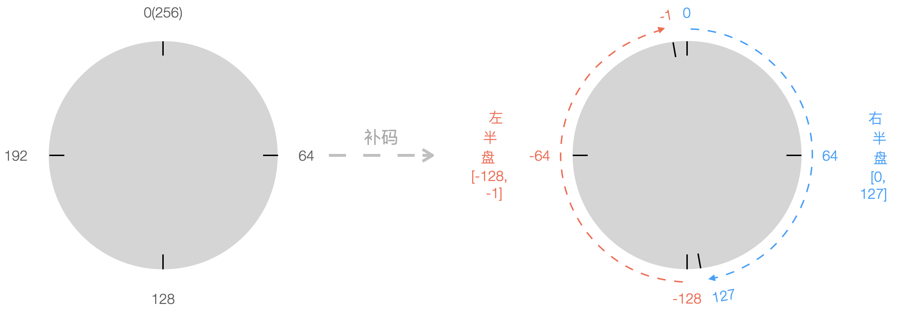
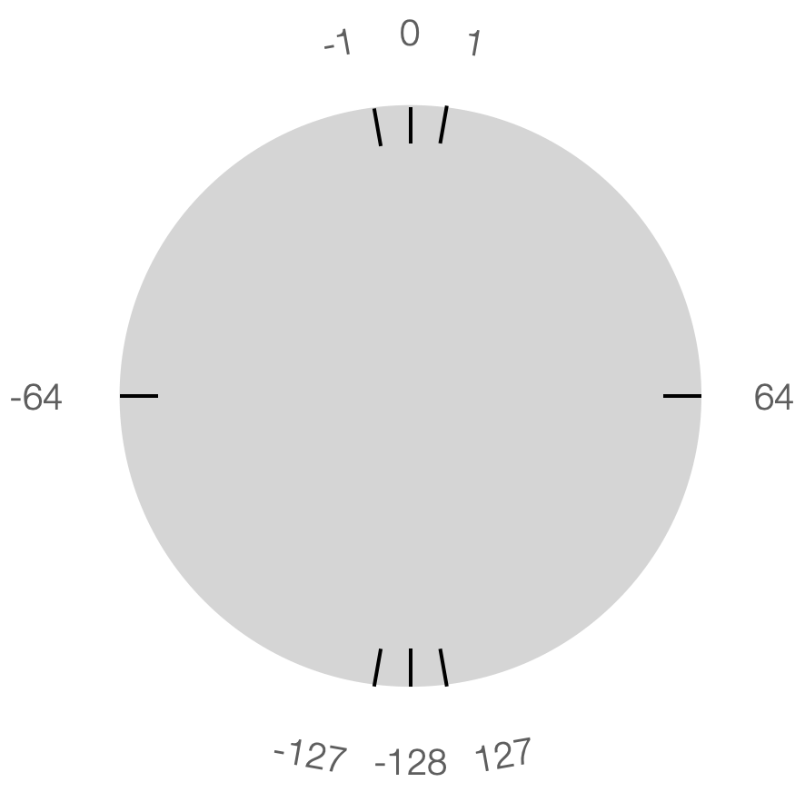
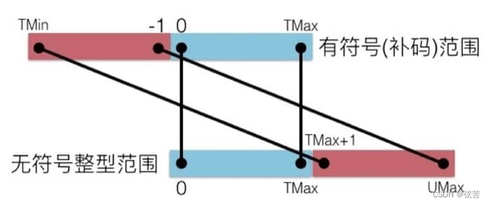

对于无符号整数，一般来说，所有的数位都被用来表示数值。
对于带符号整数，数位被划分为符号位（只能占一位）与数值位（剩余的其它位）。

符号位的权值有不同的解释：

1. 权值是零（符号位是“1”则表示数值为负），称为“符号-绝对值”模式（Sign and magnitude）。
2. 权值是 –(2^N-1^-1)，“1的补码”方式（Ones’ complement）。
3. 权值是 –2^N-1^，“2的补码”方式（Two's complement）。

<!-- more -->

## 无符号数的编码

粗略地概括，整数类型分为两大类：无符号整数（`unsigned` integer）和带符号整数（`signed` integer）。

1. 长短修饰符 `short` 和 `long` 用于修饰整形：默认为 long 长整形，短整形需显式指定 short。
2. 符号修饰符 `signed` 和 `unsigned` 用于修饰字符型和整形：缺省为 `signed` 有符号类型，无符号需显式指定 `unsigned` 修饰。
3. 当用 `signed` / `unsigned`、`short` / `long` 来修饰 int 整形时，int 可省略。

以下是字符型、短整型、整型有无符号的区分表示：

- 有符号字符型：char/signed char；无符号字符型：unsigned char
- 有符号短整型：short [int] /signed short [int]；无符号短整型：unsigned short [int]
- 有符号整型：int /signed [int]；无符号整型：unsigned [int]

相关话题前置参考：

- [C Data Types](../c/c-data-types.md)
- [C Basic Types - Binary Representions](../c/c-binary-representation.md)
- [C语言标准与实现之整数类型](../c/c-standard-integer-types.md)

---

无符号整数编码基于传统的二进制表示法，一般所有的数位都被用来表示数值。

假设有一个整数数据类型有 $n$ 位。我们可以将位向量写成 $\vec{x}$ 表示整个向量，或者写成 $[x_{n-1}, x_{n-2}, \cdots, x_0]$，表示向量中的每一位。把 $\vec{x}$ 看成一个二进制表示的数，就获得了  $\vec{x}$ 的无符号表示。在这个二进制编码中，每个位 $x_i$ 都取值0或1，后一种取值意味着数值   $2^i$ 应为数字值的一部分。我们用一个函数 $B2U_n$（Binary to Unsigned的缩写，长度为$n$）来表示。

对位向量 $\vec{x} = [x_{n-1}, x_{n-2}, \dotsc, x_0]$：

$$
B2U_n(\vec{x}) \dot=\sum_{i=0}^{n-1}x_i\ast2^i
$$

在这个等式中，等号“$\dot=$”表示左边被定义为等于右边。函数 $B2U_n$ 将一个长度为 $n$ 的0、1串映射到非负整数。

$n$ 位所能表示的最小值用位向量$[00\cdots0]$（全零）表示，也就是整数值0，而最大值是用位向量$[11\cdots1]$（全1），也就是整数值 $UMax_n\dot=\sum_{i=0}^{n-1}x_i\ast2^i=2^n-1$。即$n$位二进制位串所能表示的数值范围是 $[0, 2^n-1]$。

在主流64位LP64架构实现中，unsigned char、unsigned short [int]、unsigned [int]、unsigned long [int]（或 long unsigned [int]）分别占1、2、4、8个字节（8、16、32、64位）。无符号字符（unsigned char）占用1个字节（8位），所能表示的数值范围是 $[0, 2^8-1] = [0, 255]$，共$2^8$=256 个数。

## 有符号数的编码

对于很多应用，我们还希望表示负数值。在计算机中，如何表示符号呢？

对于带符号整数，数位被划分为符号位（只能占一位）与数值位（剩余的其它位）。

在计算机中，对于数的符号（正号`+`和负号`-`）也只能用0和1这两位数字表示。通常用一个数的最高位作为符号位，最高位为0表示符号位为正；最高位为1表示符号位为负。这样，数的符号标识也“数码化”了。即带符号数的数值和符号统一用二进制数码形式来表示。

在将数的符号用数码（0或1）表示后，数值部分究竟是保留原来的形式，还是按一定的规则做某些变化，这要取决于运算方法的需要，从而有四种常见的机器数形式：*原码*、*反码*、*补码* 和 *移码*。

为了区别原来的数与它在机器中的表示形式，将一个数（连同符号）在机器中加以数码化后的形式，称为**机器数**或机器码，而把机器数所代表的实际数值称为**真值**。

### 原码（Sign-Magnitude）

原码表示法比较直观，其数值部分保留其真值（的绝对值）。



例如，正数89的二进制表示为 $+1011001$，正号 `+` 直接用0代替，其机器原码表示为：

<figure markdown="span">
    {: style="width:75%;height:75%"}
</figure>

负数-89的二进制表示为$-1011001$（数值位宽为7），负号 `-` 直接用1代替，其机器原码表示为：

<figure markdown="span">
    {: style="width:75%;height:75%"}
</figure>

若符号真值为X，最终机器原码的位向量 $\vec{x} = [x_{n-1}, x_{n-2} ,\dotsc, x_0]$ 宽度为 $n$，除最高符号位 $x_{n-1}$ 外的数值位宽为 $n-1$，则可将原码表示规则用表达式形式定义如下：

$$
% 原码
[X]_原=
\begin{cases}
		X，&  X=+0 \quad || \quad 0 \lt X \lt 2^{n-1} \\
		2^{n-1}-X = 2^{n-1}+\lvert X \rvert，& X=-0 \quad || -2^{n-1} \lt X \lt 0 \\
\end{cases}
$$

- 8位二进制原码表示的数值范围为 11111111-10000000,00000000-01111111，即 -127 - -0,+0 - +127。其中，“0”有-0和+0之分，$[-0]_原=1 0000000$，$[+0]_原=0 0000000$。
- $[-89]_原=2^{8-1}-(-89) = 2^7+89 = 0b10000000+0b1011001 = 0b11011001$。

> 原码表示法的优点是比较直观、简单易懂，后面在浮点数中有使用到原码编码。
> 原码的符号位不是数值的一部分，不能直接参与运算，导致加法运算复杂。
> 为了解决这些矛盾，人们引入了反码和补码。

### 反码（Ones' Complement）

对于正数而言，其反码形式与其原码相同：最高位为符号位，用0表示正数，其余位为数值位不变。对于负数而言，其反码表示为：最高位符号位为1，其余数值位在原码的基础上按位取反。反码在机器中的表示形式如下：



-89的二进制表示为 $-1011001$，其原码表示为 $1 1011001$，则其反码表示为 $1 0100110$。

<figure markdown="span">
    {: style="width:75%;height:75%"}
</figure>

若符号真值为X，最终机器反码的位向量 $\vec{x} = [x_{n-1}, x_{n-2} ,\dotsc, x_0]$ 宽度为 $n$，除最高符号位 $x_{n-1}$ 外的数值位宽为 $n-1$，则可将反码表示规则用表达式形式定义如下：

$$
% 反码
[X]_反=
\begin{cases}
		X，&  X=+0 \quad || \quad 0 \lt X \lt 2^{n-1} \\
		(2^n-1) + X = (2^n-1)- \lvert X \rvert，& X=-0 \quad || -2^{n-1} \lt X \lt 0
\end{cases}
$$

- 当 X<0 或 X=-0 时，按照无符号数解析位向量，$\lvert X \rvert + \overrightarrow{[X]_反}=2^n-1$（n位全1）。例如当n=8时，$\lvert X \rvert + \overrightarrow{[X]_反}=0b11111111=255$。$\overrightarrow{[X]_反}$ 相当于 $\lvert X \rvert$ 的按位取反（bitwise inversion）= ~$\lvert X \rvert$。
- 8位二进制反码表示的数值范围为 10000000-11111111,00000000-01111111（负数数值部分求反复原：11111111-10000000,00000000-01111111），即 -127 - -0,+0 - +127。其中，“0”有-0和+0之分，$[-0]_反=1 1111111$，$[+0]_反=0 0000000$。

求-89的8位反码时，无需按照“原码→反码”这个步骤，基于以上表达式即可计算出其反码的无符号真值，其对应的二进制位向量即为-89的反码。

- $[-89]_反=(2^8-1)+(-89) = (2^8-1)-(89) = 166 = 0b10100110$。
- $[-89]_反$=~(-89)=166=$0b10100110$。

> 虽然过去生产过基于反码表示的机器，但是几乎所有的现代机器都使用补码形式表示有符号整数。
> 现在通常已不再单独使用反码，而主要是作为求补码的一个**中间步骤**来使用。

### 补码（Two's Complement）

在计算机中，最常见的有符号（整）数的表示方式是补码。采用补码运算可以将减法变成补码加法运算，在微处理器中只需加法的电路就可以实现加法、减法运算。

#### 概念导读

为了理解补码的概念，我们先来看看圆周运动的例子。

在现实生活中，一个圆周的可视角度度量为0-2π（或0°-360°），以原点为起点的射线OA逆时针旋转一圈的弧度为2π。

圆周运动具有周期性，即具有“周而复始”的变化规律。假设OA的初始弧度为α，终边OA每绕原点旋转一周，α增加2π弧度（旋转k周后，弧度变成α+k·2π），但OA位置不变。由三角函数的定义可知，终边相同的角的同一三角函数的值相等。

$$
\begin{gather*}
    \sin(\alpha+k·2\pi) = \sin\alpha \\
    \cos(\alpha+k·2\pi) = \cos\alpha \\
	\tan(\alpha+k·2\pi) = \tan\alpha
\end{gather*}
$$

由上面的公式可知，可以把求任意角的三角函数值，转化为求0-2π（或0°-360°）角的三角函数值。射线OA逆时针旋转π和顺时针旋转π（-π）的终边是相同的，逆时针旋转5π/3和顺时针旋转π/3（-π/3）的终边是相同的。以下将负弧度的正弦计算转化到0-2π区间换算：

$$
 \begin{gather*}
    \sin(-\pi+2\pi) = \sin\pi \\
    \sin(-\frac{\pi}{3}+2\pi) = \sin\frac{5\pi}{3}
\end{gather*}
$$

***

我们再来进一步看看日常生活中校正时钟的例子。

假定时钟停在7点，而正确时间是5点，要拨准时钟可以有两种不同的拨法：倒拨2个格或顺拨10个格。

想象一下，龟兔在7点钟刻度背向而行，假设兔子的速度是乌龟的5倍，兔子顺时针跑10格，乌龟逆时针跑2格，它们将在5点刻度处迎面相遇。

<figure markdown="span">
    {: style="width:50%;height:50%"}
</figure>

由于钟面的容量有限，其表盘刻度实际上是十二进制，12h以后又从0开始计数。倒拨2个格，即7-2=5（做减法）；顺拨10个格，即7+10=12+5（做加法）。而钟面上12=0，故12+5回归到刻度5。这就表明，在舍掉进位的情况下，“从7减去2”和“往7加上10”所得的结果是一样的。在十二进制下，12+5丢失进位12，此处12是溢出量，又称为**模**（mod）。而-2和10的绝对值之和恰好等于模数12，我们把10称为-2对于模数12的**补数**。在圆周运动中，每转动一周的 $2\pi$ 弧度可视为溢出量（模），$\frac{5\pi}{3}$ 为 $-\frac{\pi}{3}$ 对于模数 $2\pi$ 的补数。

$$
\begin{align*}
10 & \equiv -2 & \mod 12 \\
\frac{5\pi}{3} & \equiv -\frac{\pi}{3} & \mod 2\pi
\end{align*}
$$

在电脑和手机的日期和时间偏好设置中，通常可以设置显示24小时，因为地球自转一圈是一天（接近24h）。24h制的01点和13点（下午1点）都对应12h制钟表盘上的1点位：$1 \equiv 13 \mod 12$。“天天向上”、“日复一日”中的“天”和“日”即为溢出量，每过24h（模）又将开启崭新的一天。假设现在是今天0点，则32h后就是明天上午8点：$8 \equiv 32 \mod 24$。

计算机中的运算受一定字长的限制，它的运算部件、寄存器和存储单元都有一定的位数，因而在运算过程中也会产生溢出量，<u>所产生的溢出量实际上就是模</u>。可见，计算机的运算也是一种**有模运算**。

#### 编码格式

对于正数而言，其补码形式与其原码、反码相同：最高位为符号位，用0表示正数，其余位为数值位不变。对于负数而言，其补码表示为：最高位符号位为1，其余数值位在原码的基础上按位取反并加1（反码+1）。补码在机器中的表示形式如下：



-89的二进制表示为 $-1011001$，其原码表示为 $1 1011001$，其反码表示为 $1 0100110$，则其补码表示为 $1 0100111$。

<figure markdown="span">
    {: style="width:75%;height:75%"}
</figure>

若符号真值为X，最终机器补码的位向量 $\vec{x} = [x_{n-1}, x_{n-2} ,\dotsc, x_0]$ 宽度为 $n$，除最高符号位 $x_{n-1}$ 外的数值位宽为 $n-1$，则可将反码表示规则用表达式形式定义如下：

$$
% 补码
[X]_补=
\begin{cases}
		X, & 0 \le X \lt 2^{n-1} \\
		2^n+X = 2^n- \lvert X \rvert, & -2^{n-1} \le X \lt 0 \quad (\mod 2^n)
\end{cases}
$$

- 当 X<0 时，按照无符号数解析位向量，$\lvert X \rvert+\overrightarrow{[X]_补}=2^n$（相对反码加1）。例如当n=8时，$\lvert X \rvert+\overrightarrow{[X]_补}=2^8=256$。8位全1（0b11111111）时，能表示最大无符号数 $2^8-1$ 或最大有符号数($-1$)，再加1则会超出8位所能表示的最大值，变成9位二进制0b100000000，高位截断溢出为0b00000000，即超过256从零开始计数（$0 \equiv 256 \mod 256$）。
- 8位二进制补码表示的数值范围为 10000000-11111111,00000000-01111111，即 -128 - -1,+0 - +127。其中，无-0和+0之分，保证了0的唯一性。另外，取值范围为连贯区间 [-128, 127]，包含128个负数、128个非负数。负数、非负数各占一半，负数比正数多一个。

设想一个有256个刻度的大笨钟，当采用补码重新编码刻度后，表盘的256个刻度被**重新编码**，划分成右边顺时针半盘[0,127]和左边逆时针半盘[-128,-1]。

<figure markdown="span">
    
</figure>

---

-89的二进制补码表示为 $1 0100111$，按照无符号数解析位向量的值为167，满足：

$$
\lvert -89 \rvert + 167 = 256 \implies 167 \equiv -89 \mod 256
$$

求-89的8位补码时，无需按照“原码→反码→+1”这个步骤，可基于以上表达式计算其补数：

- $[-89]_补=2^8+(-89) = 2^8-89 = 167 \implies -89 \mod 256 = 256+(-89) \equiv 167$

负数-89对应的无符号补数167的二进制位向量 0b10100111，即为其补码。

#### 按权展开

-89的二进制表示为 $-1011001$，其原码表示为 $1 1011001$，其反码表示为 $1 0100110$，其补码表示为 $1 0100111$。

$\lvert -89 \rvert$ 的二进制位向量为 $01011001$：

- 不考虑最高符号位，根据反码的定义，反码数值部分位向量=

$$
(2^{n-1}-1)-\lvert X \rvert \overset{\text{n=8}}{=\!=\!=} 127-\lvert -89 \rvert=0b01111111-0b01011001=0b00100110
$$

- 不考虑最高符号位，补码数值部分位向量=

$$
(2^{n-1}-1)-\lvert X \rvert+1 = 2^{n-1}-\lvert X \rvert \overset{\text{n=8}}{=\!=\!=} 127-\lvert -89 \rvert+1=0b01111111-0b01011001+1=0b00100111
$$

补码高位符号位占1位，其余数值部分占 n-1 位。当将最高符号位解释为负权（$-2^{n-1}$）时，整体位向量的真值即为原始负值：

$$
\underbrace{-2^{n-1}}_{1} + \underbrace{2^{n-1}-\lvert X \rvert}_{n-1} = -\lvert X \rvert
$$

我们用一个函数 $B2T_n$（Binary to Two's Complement 的缩写，长度为$n$）来表示位向量 $\vec{x} = [x_{n-1}, x_{n-2} , \dotsc, x_0]$ 到补码的编码映射：

$$
B2T_n(\vec{x}) \dot=-x_{n-1}\ast2^{n-1} + \sum_{i=0}^{n-2}x_i\ast2^i
$$

最高有效位 $x_{n-1}$ 称为符号位，它的“权重”为 $-2^{n-1}$，是无符号表示中权重的负数。符号位被设置为1时，表示值为负，而当设置为0时，值为非负。

$\lvert -89 \rvert$ 的二进制位向量为 $01011001$，-89的二进制补码表示为 $1 0100111$，可基于 $B2T_n$ 函数按权展开复原补码的真值：

$$
\begin{aligned}
	& B2T_8([0 1011001]) = -0\ast2^7+1\ast2^6+1\ast2^4+1\ast2^3+1\ast2^0=-0+64+16+8+1=89 \\
	& B2T_8([1 0100111]) = -1\ast2^7+1\ast2^5+1\ast2^2+1\ast2^1+1\ast2^0=-128+32+4+2+1=-89
\end{aligned}
$$

让我们基于 $B2T_n$ 展开式，重新推导一下 $n$ 位补码所能表示的取值范围。

- 最小值是位向量 $[10\cdots0]$，只设置负权，其他正权位清零，此种情形负得最多，其整数值为 $TMin_{n}\dot=-2^{n-1}$。
- 当设置了负权时，设置其他所有正权位，位向量为  $[11\cdots1]$。此种情形正权打满（负得最少），其整数值为 $-2^{n-1}+\sum_{i=0}^{n-2}x_i\ast2^i=-2^{n-1}+(2^{n-1}-1)=-1$，即最大负整数。
- 最大值是位向量 $[01\cdots1]$，清除负权（即为非负数），清除其他所有正权位，其值为0；若设置其他所有正权位，其整数值为 $TMax_{n}\dot=\sum_{i=0}^{n-2}x_i\ast2^i=2^{n-1}-1$。

以$n=8$为例，一个字节（byte）的补码编码所能表示数值范围是 $[-2^{8-1}, 2^{8-1}-1]$，即 $[-128, 127]$，包含128个负数（-128 - -1）、128个非负数（0 - 127）。

#### 补码加法

我们在初中时代学习初等代数时，就引入负数这一重要的概念用来表示“相反意义的量”。有了负数的概念后，减法也可以理解为加法：<u>减去一个正数的等效表述是加了一个负数</u>。

回想调拨钟表的例子，定义顺时针为正（加法），逆时针为负（减法）。假设初始刻度为x，减量为n（n>0），加量为其补数 (12-n)，显然有 $x-n \equiv x+(12-n) \mod 12$。令 n=2，在 mod12 的钟表盘上，逆时针回拨2格等效于顺时针拨动10格，殊途同归。

计算机的表示法使用有限数量的位对一个数字编码，当结果太大以至不能表示时，某些运算就
会溢出（overflow）。因此，我们说计算机运算也是一种有模运算。当然，在计算机中不是像上述时钟例子那样以12为模，在定点小数的补码表示中是以 $2$ 为模，在定点整数中则以 $2^n$ 为模（n=8,16,32,64,...）。

在计算机中，在字宽容量（模数）范围内，负数的补码表示是对数值位（或绝对值）取反+1，“取反”实际上已经暗含了减法，“+1” 则将补码进一步换算成了补数。假设 X<0，其补码位向量的无符号值  $\overrightarrow{[X]_补} = 2^n- \lvert X \rvert$，实际上就是$\mod 2^n$。当 n=8 时, 就是$\mod 256$。

类比钟表调拨，减去正数可视作加上负数的补码。这样，在计算机中就不用单独设置减法器，而是基于补码一律按加法运算规则实现减法的等效计算。在这一过程中，操作数和运算结果都统一用补码表示。

另一方面，补码的最高符号位统一按照负权解释，即补码的符号位可视作整体数值的一部分。从这个角度来讲，符号位直接参与运算貌似也是解释得通。

$$
[X]_补+[Y]_补=
\begin{cases}
    X+(2^n+Y) & \equiv X+Y & \mod 2^n, \set{X,Y|X\gt0, Y\lt0} \\
    (2^n+X)+(2^n+Y) & \equiv X+Y & \mod 2^n, \set{X,Y|X\lt0, Y\lt0} 
\end{cases}
$$

【例1】已知X=+0000111（7），Y=-0010011（-19），求两数的补码之和。

- $[X]_补=0 0000111，[Y]_补=1 1101101$，人工计算 Z=X+Y=7+(-19)=-12（补码为11110100）。

若将 $\overrightarrow{[Y]_补}$ 也视作无符号数=237，将计算结果Z也视为无符号数$\overrightarrow{[Z]_补}$=244，满足 7+237=244，而 $244 \equiv -12 \mod 256$。

还是借用256大笨钟来阐述，初始在刻度7点处，逆时针回拨19格和顺时针拨动237格，效果都是拨到刻度244处。当采用补码重新编码刻度后，原先的244点映射为左半盘的-12点位。换个角度来说，由于 $\lvert -19 \rvert \gt \lvert 7 \rvert$，这里异号相加，负数占主导，也可以想象为初始刻度在左半盘-19点，+7表示顺时针拨动7格，将拨到-12点，仍然在左半盘（没有溢出）。

补码可以视作无符号数直接参与竖式按位加计算，接下来重点看看补码加法的溢出问题、判断及处理。

【例2】已知X=+1000000（64），Y=+1000001（65），求两数的补码之和。

- 直接对补码列竖式计算如下：

$$
\begin{array}{c|lcr}
\:\:\:\:\: & \: \quad 0\ 1 \qquad\qquad\qquad  (C_fC_0)\\
\:\:\:\:\: [X]_补 & \qquad 0\ 1000000 \qquad (+64的补码) \\
+) [Y]_补 & \qquad 0\ 1000001 \qquad (+65的补码)  \\
\hline
\ & \qquad 1\ 0000001  \qquad 129
\end{array}
$$

- 两个正数相加，结果为负数！？补码之和是129，超出了 [0, 127]，即产生了溢出现象。此时，数值部分向符号位产生进位$C_0=1$，符号位未向高位产生进位 $C_f=0$。

这里两个正数相加，结果超出了8位补码的非负数表示范围。竖式计算的结果为二进制位向量 10000001，无符号数值是 129，补码表示的真值为-127。

> $C_0=1$ 表示有溢出，符号位从正变成负。

还是借用256大笨钟来阐述，初始在刻度65点处，顺时针拨动64格后将到129点。但是，当采用补码表示时，129点越过右半盘（取值范围为[0,127]）的分界线127点两格，对应左半盘（取值范围为[-128,-1]）的-127点位：+127左溢一格是-128，再左溢一格是-127。

<figure markdown="span">
    {: style="width:50%;height:50%"}
</figure>

用以下C语言代码测试验证，计算结果Z的位向量为0x81（即无符号数129），补码对应的真值=$-127 \equiv 129 \mod 256$。

```c title="signed+overflow.c"
    signed char X = 64;
    signed char Y = 65;
    signed char Z = X+Y;
    printf("Z=0x%hhx, %hhd\n", Z, Z);
```

【例3】已知X=-1111111（-127），Y=-0000010（-2），要求进行补码的加法运算。

- 直接对补码列竖式计算如下：

$$
\begin{array}{c|lcr}
\:\:\:\:\: & \: \quad 1\ 0 \qquad\qquad\qquad  (C_fC_0)\\
\:\:\:\:\: [X]_补 & \qquad 1\ 0000001 \qquad (-127的补码：129) \\
+) [Y]_补 & \qquad 1\ 1111110 \qquad (-2的补码：254)  \\
\hline
\ & \qquad 0\ 1111111  \qquad 127
\end{array}
$$

- 两个负数相加，结果为正数！？预期的结果-129超出了8位补码所能表示的负数范围 [-128, -1]，即产生了溢出现象。此时，数值部分向符号位未产生进位 $C_0=0$，符号位向高位产生进位 $C_f=1$。

这里两个负数相加，结果超出了8位补码的负数表示范围，溢出到了正数区。竖式计算的结果为二进制位向量 01111111，无符号数值即其补码真值为127。

> $C_f=1$ 表示有溢出，符号位从负变成正。

由于 $\lvert -127 \rvert \gt \lvert -2 \rvert$，这里的负负相加，-127占主导。还是借用256大笨钟来阐述，当采用补码重新编码刻度后，想象初始刻度左半盘-127点处，-2表示逆时针拨动2格，越过左半盘分界线-128点一格，对应右半盘（取值范围为[0,127]）的127点位：-127右溢一格是-128，再右溢一格是+127。

$$
[X]_补+[Y]_补=(2^n+X)+(2^n+Y)  \equiv X+Y \mod 2^n \\
[-127]_{补8}+[-2]_{补8}=(256+(-127)) + (256+(-2)) = \\
129+254 = 383 \mod 256 \equiv 127
$$

用以下C语言代码测试验证，计算结果Z的位向量为0x7f，补码对应的真值是127（383溢除模256）。

```c title="signed-overflow.c"
    signed char X = -127;
    signed char Y = -2;
    signed char Z = X+Y;
    printf("Z=0x%hhx, %hhd\n", Z, Z);
```

【例4】已知X=-0000011（-3），Y=-0000010（-2），要求进行补码的加法运算。

- 直接对补码列竖式计算如下：

$$
\begin{array}{c|lcr}
\:\:\:\:\: & \: \quad 1\ 1 \qquad\qquad\qquad  (C_fC_0)\\
\:\:\:\:\: [X]_补 & \qquad 1\ 1111101 \qquad (-3的补码：253) \\
+) [Y]_补 & \qquad 1\ 1111110 \qquad (-2的补码：254)  \\
\hline
\ & \qquad 1\ 1111011  \qquad (-5的补码：251)
\end{array}
$$

- 直接补码运算产生的结果的无符号数值是251，正是预期结果-5的补码！此时，数值部分向符号位产生进位 $C_0=1$，符号位向高位产生进位 $C_f=1$。

直观判断，两个小负数相加不会溢出。从单个溢出位判断：

1. 两个负数相加，总会导致 $C_f=1$，符号位从负变成正。
2. 然后 $C_0=1$，符号位又从正变成负。

所以，整体上，符号位还是保持为负，即没有溢出。
下面来从数理角度来具体推导一下溢出判断逻辑。

#### 溢出判断

下面基于8位补码，根据符号的异同性，详细讨论上面四个例子对应的符号组合（`+、-`、`+、+`、`-、-`）时补码加法的溢出条件及判断逻辑。

> s1、s2 为补码最高符号位，取值0或1。
> x、y 分别为 X、Y 除符号位的其他数值位的真值。

​【例1】一正一负：假设 s1=1,s2=0, 按权展开相加 $B2T_8(X)+B2T_8(Y) = (-2^7+x)+y = -2^7+(x+y)$

$$
0 \le x,y \le 2^7-1 \to 0 \le x+y \le 2^8-2 \implies \\
-2^7 \le B2T_8(X)+B2T_8(Y) \le 2^7-2 \\ 
$$

- 结果 Z 的对应区间为 [-128, 126]，不会产生溢出。
- 另外，s1+s2=1，当 $C_0=0$ 时，$C_f=0$；当 $C_0=1$ 时，$C_f=1$。

【例2】两个正数：s1=s2=0，按权展开相加 B2T_8(X)+B2T_8(Y) = x+y

$$
0 \le x,y \le 2^7-1 \to 0 \le x+y \le 2^8-2 \implies \\
0 \le B2T_8(X)+B2T_8(Y) \le 2^8-2，
$$

- 结果 Z 的对应区间为 [0, 254] = [0,127]+[128,254]，当结果落入 [128,254] 时，有符号补码真值溢出为负值：$Z \mod 256 \equiv Z-256$ 对应区间 [-128, -2]。
- 另外，s1+s2=0，我们来看看进位情况：

	- 当 x+y 小于或等于最大正数127（0b11111111）时，无溢出，此时 $C_0=0$，$C_f=0$。
	- 当 x+y 大于最大正数127（0b11111111）时，溢出为负，此时 $C_0=1$，$C_f=0$。

【例3】两个负数，s1=s2=1，按权展开相加 $B2T_8(X)+B2T_8(Y) = (-2^7+x)+(-2^7+y) = -2^8+(x+y)$

$$
0 \le x,y \le 2^7-1 \to 0 \le x+y \le 2^8-2 \implies \\
-2^8 \le B2T_8(X)+B2T_8(Y) \le -2
$$

- 结果 Z 的对应区间为 [-256, -2] = [-256,-129]+[-128,-2]，当结果落入 [-256,-129] 时，有符号补码真值溢出为正值：$Z \mod 256 \equiv Z+256$ 对应区间 [0, 127]。
- 另外，s1+s2=0（$C_f=1$），我们来看看进位情况：

	- 当数值部分和（x+y）小于等于127（小于128）时，$Z \le -128$，溢出为正，此时 $C_0=0$。
	- 当数值部分和（x+y）大于127（大于等于128）时，$Z \gt -128$，无溢出，此时 $C_0=1$。

---

以上例1和例4中，8位正数之和、8位负数之和未超出8位补码表示的数值范围时，没有产生溢出，结果正确。此时，满足 $C_0=C_f$，同时为0或同时为1。
以上例2和例3中，8位正数之和、8位负数之和超出8位补码表示的数值范围时，产生了溢出，结果错误。此时，满足 $C_0 \ne C_f$，一个为0且一个为1。
 
综合以上，可用逻辑异或表达式 $\boxed{OF = C_f \oplus C_0}$ 来检验补码加法的溢出情况。

## 扩展一个数字的位表示

一个常见的运算是在不同字长的整数之间转换，同时又保持数值不变。考虑从一个较小的数据类型转换到一个较大的类型，即扩大位宽。

要将一个无符号数转换成一个更大的数据类型时，只要简单地在开头添加0。具体来说，原数值的字节保持在低（权）位不变，在新增的高（权）位补0。

要将一个补码数字转换为一个更大的数据类型，可以执行一个符号扩展（sign extension）。具体来说，原数值的字节保持在低（权）位不变，在新增的高（权）位复制符号位。

1. 对于正数，高位复制符号位0，不影响其真值。
2. 对于负数，高位复制符号位1，也不影响真值。

考虑负数的补码位向量 $\vec{x} = [x_{n-1}, x_{n-2} ,\dotsc, x_0]$，其编码映射如下：

$$
B2T_n(\vec{x}) \dot=-x_{n-1}\ast2^{n-1} + \sum_{i=0}^{n-2}x_i\ast2^i
$$

当复制高符号位 $x_{n-1}$ 时，位向量 $\vec{x'} = [{ \underline{x_{n-1} ,\dotsc, x_{n-1}} }, x_{n-1}, x_{n-2} ,\dotsc, x_0]$，则有 $B2T_n(\vec{x}) = B2T_{n'}(\vec{x'})$。

---

以-89为例，其8位补码位向量为$[1 0100111]$，将其符号扩展为16位的位向量位$[{ 11111111 } 10100111]$：

$$
\begin{aligned}
& B2T_8([1 0100111]) = -1\ast2^7+1\ast2^5+1\ast2^2+1\ast2^1+1\ast2^0 \\
& B2T_{16}([{ 11111111 } 10100111]) =-1\ast2^{15}+1\ast2^{14}+\cdots+1\ast2^8+1\ast2^7+1\ast2^5+1\ast2^2+1\ast2^1+1\ast2^0
\end{aligned}
$$

设补码除符号位后的位数值为v，则

$$
\begin{aligned}
& B2T_8([1 0100111]) =-1\ast2^7+v \\
& B2T_{16}([{ 11111111 } 10100111]) =-1\ast2^{15}+1\ast2^{14}+\cdots+1\ast2^8+1\ast2^7+v
\end{aligned}
$$

更进一步有：

$$
\begin{aligned}
B2T_{16}([{ 11111111 } 10100111]) & = 2^8(-2^7+2^6+\cdots+2^0)+2^7+v \\ 
												   & = 2^8(-2^7+(2^7-1))+2^7+v \\
												   & = -2^8+2^7+v \\
												   & = -2^7+v
\end{aligned}
$$

对比可知，符号扩展前后的补码所表示的真值不变。

## 有符号数和无符号数之间的转换

C语言允许在各种不同的数据类型之间做强制类型转换。例如，假设变量x声明为int，u声明为unsigned。表达式 `(unsigned)x` 会将x的值转换为一个无符号数值，而 `(int)u` 将u的值转换为一个有符号整数。

考虑以下代码：

```c title="signed-convertion.c"
    short int v = -12345;
    unsigned short uv = (unsigned short)v;
    printf("v=%hd, uv=%hu\n", v, uv);
    printf("v=0x%hx, uv=0x%hx\n", v, uv);
```

在一台采用补码的机器上，上述代码运行输出：

```
v=-12345, uv=53191
v=0xcfc7, uv=0xcfc7
```

可以看到，强制类型转换的结果保持位向量（位模组）不变，只是改变了解释这些位的方式。
v=-12345 的补码表示和 uv=53191 的无符号表示是完全一样的。

以上代码片段示例演示了负数补码转换成无符号数。对于负数，补码中最高位作为符号位，本来解释为负权 $-2^{n-1}$，按照无符号解释为正权数值位  $2^{n-1}$。由于后面位的数值 $v$ 保持不变，相当于在补码表示的真值基础上加上 $2^n$。

对满足 $TMin_n \le x \le TMax_n$ 的 $x$ 有：

$$
T2U_n(x)=
\begin{cases}
		x, & x\ge0 \\
		2^n+x（2^n- \lvert x \rvert）, & x<0
\end{cases}
$$

简单推导如下：

$$
\begin{aligned}
B2U_n(x) - B2T_n(x) & = (2^{n-1}+v)-(-2^{n-1}+v) = 2\ast2^{n-1}=2^n \\
& \implies B2U_n(x) = B2T_n(x) + 2^n
\end{aligned}
$$

例如：$T2U_{16}(-12345) = -12345+2^{16}=53191$。

---

同理，无符号数的最高位解释为正权数值位  $2^{n-1}$，当将其位向量解释成补码时，最高位将作为符号位，解释为负权 $-2^{n-1}$。由于后面位的数值 $v$ 保持不变，相当于在无符号真值基础上减去 $2^n$。

对满足 $0 \le u \le UMax_n$ 的 $u$ 有：

$$
U2T_n(u)=
\begin{cases}
		u, & u \le TMax_n \\
		u - 2^n, & u>TMax_n
\end{cases}
$$

对于 $n=8$，当 $u \le TMax_n = 127$ 时，即 $0 \le u \le 127$，刚好落入8位补码所能表示的非负数区间 ；当 $u \gt TMax_n = 127$ 时，例如 $128 \le u \le 255$，则原始高位1变成负号，补码释义为负数。原来位向量按无符号解释出的真值需减去 $2^8=256$，换算出按补码解释的正确真值，对应负数区间 $[-1, -128]$。

在数轴上把有符号数和无符号数画出来的话，就能很清晰的看出相对的关系：

<figure markdown="span">
    {: style="width:75%;height:75%"}
</figure>

## signed arithmetic overflow

[C Basic Types - Binary Representions](../c/c-binary-representation.md):

> TAKEAWAY 5.49 The same value may have different binary representations.

The following two functions are basically all that is needed to interpret unsigned values as signed values:

```c title="is_signed_less.c" linenums="1"
# inclue <limits.h>

bool is_negative(unsigned a) {
    unsigned const int_max = UINT_MAX/2;
    return a > int_max;
}

bool is_signed_less(unsigned a, unsigned b) {
    if (is_negative(b) && !is_negative(a)) return false;
    else return a < b;
}
```

[C语言标准与实现之整数类型](../c/c-standard-integer-types.md):

下面的代码试图从大到小打印 [0，99] 区间内的所有整数，请思考可能存在的问题。

```c title="unsigned-decrement-gteq.c"
unsigned i;
for (i = 99; i >= 0; --i)
    printf("%u\n", i);
```

以下是《C语言深度解剖（第2版）》附录中的 C 语言基础测试题5，请思考输出结果。

```c title="signed-char-array.c"
#include <stdio.h>
#include <string.h>

int main(int argc, char* arg[]) {
    signed char a[1000];
    int i;
    for (i = 0; i<1000; i++)
        a[i] = -1-i;
    printf("%lu", strlen((const char*)a));

    return 0;
}
```

[C Basic Types - Binary Representions](../c/c-binary-representation.md):

> TAKEAWAY 5.50 Unsigned arithmetic wraps nicely.

```c
/*incremented up to UINT_MAX and then wraps around to 0*/
for (unsigned i = 1; i; ++i) do_something();
```

> TAKEAWAY 5.57 Signed arithmetic may trap badly.

Where unsigned values are forced to wrap around, the behavior of a signed overflow is ***undefined***.

```c
for (signed i = 1; i; ++i) do_something();
```

The as-if Rule (takeaway 5.8) allows it to optimize the second loop to an `while(true)` infinite loop.

> TAKEAWAY 5.56 It is your responsibility to avoid undefined behavior of all operations.

[C++ Standard - Data Types](../cpp/cpp-std-data-types.md)

[ISO/IEC-N4950](https://www.open-std.org/jtc1/sc22/wg21/docs/papers/2023/n4950.pdf) - 6.8.2 Fundamental types

!!! note "signed arithmetic overflow"

    Unsigned arithmetic does not overflow. Overflow for signed arithmetic yields undefined behavior (7.1).

## 参考

《深入理解计算机系统》（第3版）
《计算机组成原理》（第3版），唐朔飞
《微机原理与接口技术》（第2版），王克义
《汇编语言程序设计》（第4版），文全刚

[深入谈谈二进制](https://zhuanlan.zhihu.com/p/553246755)
[补码表示法的本质原理](https://zhuanlan.zhihu.com/p/481479873)
[【读薄 CSAPP】壹 数据表示](https://wdxtub.com/csapp/thin-csapp-1/2016/04/16/)
[从晶体管开始聊聊计算机为什么采用二进制](https://blog.csdn.net/JWbonze/article/details/85075990)
