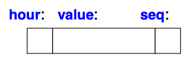
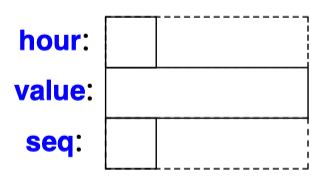
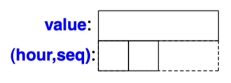

An object doesn't just need enough storage to hold its representation. In addition, on some machine architectures, the bytes used to hold it must have proper alignment for the hardware to access it efficiently.

Where alignment most often becomes visible is in object layouts: sometimes structs contain "`holes`" to improve alignment.

<!-- more -->

## struct padding holes

### TCPL

Excerpt from [C Programming Language, 2nd Edition - 1988](https://www.amazon.com/Programming-Language-2nd-Brian-Kernighan/dp/0131103628/).

---

**6.4 Pointers to Structures**

Don't assume, however, that the size of a structure is the sum of the sizes of its members. Because of alignment requirements for different objects, there may be unnamed "`holes`" in a structure. Thus, for instance, if a char is one byte and an int four bytes, the structure.

```c
struct {
    char c;
    int i;
};
```

might well require eight bytes, not five. The `sizeof` operator returns the proper value.

---

**6.5 Self-referential Structures**

objects of certain types must satisfy alignment restrictions

Alignment requirements can generally be satisfied easily, at the cost of some wasted space, by ensuring that the allocator always returns a pointer that meets *all* alignment restrictions.

### TC++PL

Excerpt from [The C++ Programming Language(4e)-2013](https://www.stroustrup.com/4th.html).

---

6. Types and Declarations | 6.2 Types | **6.2.9 Alignment**

An object doesn't just need enough storage to hold its representation. In addition, on some machine architectures, the bytes used to hold it must have proper alignment for the hardware to access it efficiently (or in extreme cases to access it at all). For example, a 4-byte `int` often has to be aligned on a word (4-byte) boundary, and sometimes an 8-byte `double` has to be aligned on a word (8-byte) boundary. Of course, this is all very implementation specific, and for most programmers completely implicit. You can write good C++ code for decades without needing to be explicit about alignment. Where alignment most often becomes visible is in object layouts: sometimes structs contain "`holes`" to improve alignment.

The `alignof` operator returns the alignment of its argument expression.

---

8. Structures, Unions, and Enumerations | 8.2 Structures | **8.2.1 struct Layout**

An object of a **struct** holds its members in the order they are declared. For example, we might store primitive equipment readout in a structure like this:

```c
struct Readout {
    char hour;  // [0:23]
    int value;
    char seq;   // sequence mark ['a':'z']
};
```

You could imagine the members of a `Readout` object laid out in memory like this:



Members are allocated in memory in declaration order, so the address of `hour` must be less than the address of `value`. See also §8.2.6.

However, the size of an object of a **struct** is not necessarily the sum of the sizes of its members. This is because many machines require objects of certain types to be allocated on architecture dependent *boundaries* or handle such objects much more *efficiently* if they are. For example, integers are often allocated on word boundaries. On such machines, objects are said to have to be properly ***aligned*** (§6.2.9). This leads to "`holes`" in the structures. A more realistic layout of a `Readout` on a machine with 4-byte int would be:



In this case, as on many machines, `sizeof(Readout)` is 12, and not 6 as one would naively expect from simply adding the sizes of the individual members.

You can minimize wasted space by simply ordering members by size (*largest member first*). For example:

```c
struct Readout {
    int value;
    char hour;  // [0:23]
    char seq;   // sequence mark ['a':'z']
};
```



Note that this still leaves a 2-byte "`hole`" (unused space) in a `Readout` and `sizeof(Readout)==8`. The reason is that we need to maintain alignment when we put two objects next to each other, say, in an array of `Readout`s. The size of an array of 10 `Readout` objects is `10∗sizeof(Readout)`.

It is usually best to order members for readability and sort them by size only if there is a demonstrated need to optimize.

Use of multiple access specifiers (i.e., `public`, `private`, or `protected`) can affect layout (§20.5).

## struct alignment rule

在上一节 [Memory Address Alignment](./address-alignment.md) 中，提到了基础类型（basic/fundamental types）的自然对齐规则（natural alignment rule）：任何 $K$ 字节的基本对象的存储地址必须是 $K$ 的倍数。

结构体成员变量的存放地址也有“地址边界对齐限制”：在默认编译配置下，成员变量存放的地址相对结构体起始地址的**偏移量**也必须满足自然对齐，即偏移量为该成员变量自身类型大小的倍数。

各成员变量在存放的时候根据在结构体中声明的顺序依次申请空间，同时按照“地址边界对齐限制”原则调整存放位置（地址），空缺的字节会自动填充。

### largest member first

下面以 `struct st_dci` 为例来说明结构体的存储布局。

```c
struct st_dci
{
    double d;
    char c;
    int i;
};
```

1. 先为 `d` 分配存储空间，其起始地址和结构体起始地址相同，偏移量0为sizeof(double)=8的倍数，占用8字节。
2. 再为 `c` 分配存储空间，地址偏移量为8，是sizeof(char)=1的倍数，占用1个字节。
3. 继续为 `i` 分配存储空间，地址偏移量为9，不是sizeof(int)=4的倍数。为满足“地址边界对齐限制”，将自动填充3个字节，在偏移量为12的地址处存放 i，占用4个字节。

至此，各成员变量都已分配了相对地址，sizeof(struct st_dci) = 8+1+(3)+4=16。其中，括号里的 *3* 为 padding bits 位数。

> 20230510 - [ISO/IEC-N4950](https://www.open-std.org/jtc1/sc22/wg21/docs/papers/2023/n4950.pdf) - 6.8.2 Fundamental types: Padding bits have *unspecified* value, but cannot cause traps.

可以调用 <stddef.h\> 中定义的宏 [offsetof](https://en.wikibooks.org/wiki/C_Programming/stddef.h/Function_reference#offsetof) 来读取各个成员的实际偏移量。

### largest member middle

上面的 `struct st_dci` 是一种类似 TC++PL 中调整后的 struct Readout - largest member first 的内存布局。

交换一下成员变量d和c的位置，将占位最长的 d 放在中间，新的结构体 `struct st_cdi` 的内存布局和占用空间又是怎样的呢？

```c
struct st_cdi
{
    char c;
    double d;
    int i;
};
```

按照结构体成员变量的“地址边界对齐限制”原则，分析一下 `struct st_cdi` 的地址分配。

1. 先为 `c` 分配存储空间，其起始地址和结构体起始地址相同，是sizeof(char)=1的倍数，占用1个字节。
2. 再为 `d` 分配存储空间，地址偏移量为1，不是sizeof(double)=8的倍数，为满足“地址边界对齐限制”，先填充7个字节，再从地址偏移量为8的地址处存放d，占用8字节。
3. 继续为 `i` 分配存储空间，地址偏移量为16，是sizeof(int)=4的倍数。

经以上推演相对存储分配布局后，sizeof(struct st_cdi) = 1+(7)+8+4=20。其中，括号里的 *7* 为 padding bits 位数。

按照成员变量的“地址边界对齐限制”原则，似乎已经讨论完毕，但问题不止如此。

结构体 `struct st_cdi` 最终的实际大小，请见下节分析。

### struct array

考虑定义一个结构体 `struct st_cdi` 的数组：

```c
struct st_cdi st[4];
```

按照上面的讨论，sizeof(struct st_cdi)=20，假设数组（第一个结构体）的起始地址为 Sa，则第二、三、四个结构体的地址分别为 Sa+20, Sa+40, Sa+60。

第一个结构体 st[0] 内部的成员 c、d、i 固然能满足“地址边界对齐限制”，但是紧随其后的第二、三、四个结构体中的每个成员变量是否能满足“地址边界对齐限制”呢？

以第二个结构体 st[1] 为例，其起始地址为 Sa+20，成员 c 满足对齐限制，占用1字节+填充7字节后，成员 d 的起始地址为 Sa+28。取 Sa 为典型的 8 或 16，均不能满足 d 的“地址边界对齐限制”。

实际上，编译器在为 `struct st_cdi` 分配空间时，除了使每个成员变量满足“地址边界对齐限制”外，还必须保证结构体所占的总字节数是结构中最长类型所占字节数（这里是sizeof(double)=8）的倍数（satisfy the strictest alignment requirement）。

具体来说，在为最后一个成员变量 i 分配地址后，已占 20 个字节，还必须在尾部填充4个字节。这样，结构体整体大小 sizeof(struct st_cdi) = 1+(7)+8+4+(4)=24，为 8 的倍数。

只要确保结构数组起始地址 Sa（&st[0]）是 8 的倍数，就能够保证其后的每个元素（st[1]，st[2]，...）中的成员变量都满足自身的地址对齐限制。

## compiler support

关于存储地址对齐的原因及自然对齐规则，参考上一篇 《[Memory Address Alignment](./address-alignment.md)》 中的 reasons 和 natural alignment 部分。

相关测试验证，参考下一篇《[Struct Alignment Specify](./struct-alignment-specify.md)》中的测试程序 struct-packed-aligned.c 及其结果分析。

### default alignment

**MSVC** - [/Zp (Struct Member Alignment)](https://learn.microsoft.com/en-us/cpp/build/reference/zp-struct-member-alignment)：Controls how the members of a structure are packed into memory and specifies the same packing for all structures in a module.

- [x64 ABI conventions](https://learn.microsoft.com/en-us/cpp/build/x64-software-conventions#x64-type-and-storage-layout) - [x64 type and storage layout](https://learn.microsoft.com/en-us/cpp/build/x64-software-conventions#x64-type-and-storage-layout) - Scalar types alignment

/Zp argument | Effect
------- | -------
1 | Packs structures on 1-byte boundaries. Same as `/Zp`.
2 | Packs structures on 2-byte boundaries.
4 | Packs structures on 4-byte boundaries.
8 | Packs structures on 8-byte boundaries (default for x86, ARM, and ARM64).
16 | Packs structures on 16-byte boundaries (default for x64 and ARM64EC).

> Don't use this option unless you have specific alignment requirements.

在 MSVC Project Settings->C/C++->Struct member alignment 中默认值为 8，可在程序中使用 `#pragma pack` 预处理来指定。

32、64 位下的基本数据类型占用最大空间是 8 字节（sizeof(long long)、sizeof(double)），这个也是自然对齐的最大参数。

!!! warning "Don't change the default alignment"

    The C/C++ headers in the Windows SDK assume the platform's *default* alignment is used. Don't change the setting from the default when you include the Windows SDK headers, either by using `/Zp` on the command line or by using `#pragma pack`. Otherwise, your application may cause memory corruption at runtime.

**GCC** - [Common Variable Attributes](https://gcc.gnu.org/onlinedocs/gcc/Common-Variable-Attributes.html):

As in the preceding examples, you can explicitly specify the alignment (in bytes) that you wish the compiler to use for a given variable or structure field. Alternatively, you can leave out the alignment factor and just ask the compiler to align a variable or field to the default alignment for the target architecture you are compiling for. The default alignment is **fixed** for a particular target ABI.

- pipermail/gcc-help - [default alignment](https://gcc.gnu.org/pipermail/gcc-help/2015-June/124424.html)

[Arm Compiler for Embedded Reference Guide](https://developer.arm.com/documentation/101754/0622/armclang-Reference/Compiler-specific-Function--Variable--and-Type-Attributes/--attribute----aligned---type-attribute):

- For `AArch32`, the default alignment is 8 bytes.
- For `AArch64`, the default alignment is 16 bytes.

### BIGGEST_ALIGNMENT

The default alignment is *sufficient* for all scalar types, but may not be enough for all vector types on a target that supports vector operations.

!!! note "x86 strictest 16-bytes alignment"

    [x86 Assembly/SSE](https://en.wikibooks.org/wiki/X86_Assembly/SSE#SSE2:_Added_with_Pentium_4) - `movapd`: move two 64-bit(double precision) floats, vector is 16 byte aligned. Refer to [Demystifying SSE Move Instructions](https://www.gamedev.net/blog/615/entry-2250281-demystifying-sse-move-instructions/).

    [x64 calling convention](https://learn.microsoft.com/en-us/cpp/build/x64-calling-convention) - [Alignment](https://learn.microsoft.com/en-us/cpp/build/x64-calling-convention#alignment): Most structures are aligned to their natural alignment. The primary exceptions are the stack pointer and `malloc` or `alloca` memory, which are 16-byte aligned to aid performance. Alignment above 16 bytes must be done manually. Since 16 bytes is a common alignment size for **XMM** operations, this value should work for most code. For more information about structure layout and alignment, see [x64 type and storage layout](https://learn.microsoft.com/en-us/cpp/build/x64-software-conventions#x64-type-and-storage-layout). For information about the stack layout, see [x64 stack usage](https://learn.microsoft.com/en-us/cpp/build/stack-usage).

[GCC](https://gcc.gnu.org/onlinedocs/gcc/Common-Variable-Attributes.html) also provides a target specific macro `__BIGGEST_ALIGNMENT__`, which is the *largest* alignment ever used for *any* data type on the target machine you are compiling for.

!!! warning "linker limitations for maximal alignment size"

    Note that the effectiveness of aligned attributes for static variables may be limited by inherent limitations in the system linker and/or object file format. On some systems, the linker is only able to arrange for variables to be aligned up to a certain maximum alignment. (For some linkers, the maximum supported alignment may be very very small.) If your linker is only able to align variables up to a maximum of 8-byte alignment, then specifying aligned(16) in an `__attribute__` still only provides you with 8-byte alignment. See your linker documentation for further information.

    Stack variables are not affected by linker restrictions; GCC can properly align them on any target.

可以借助 cpp / gcc -E -dM 预编译，过滤打印出 `__BIGGEST_ALIGNMENT__` 宏定义：

```Shell
$ gcc -dM -E -arch armv7 -x c /dev/null | grep '__BIGGEST_ALIGNMENT__'
$ gcc -dM -E -arch arm -x c /dev/null | grep '__BIGGEST_ALIGNMENT__'
$ gcc -dM -E -arch arm64 -x c /dev/null | grep '__BIGGEST_ALIGNMENT__'
$ gcc -dM -E -arch x86_64 -x c /dev/null | grep '__BIGGEST_ALIGNMENT__'
$ gcc -dM -E -x c /dev/null | grep '__BIGGEST_ALIGNMENT__'
$ echo | cpp -dM | grep '__BIGGEST_ALIGNMENT__'
```

测试结果：

- macOS clang/llvm-gcc ： armv7、arm 下定义为 4；arm64 下定义为 8；x86_64 下定义为 16。
- 在 rpi3b-raspbian/armv7l(armhf? aarch32?) 下定义为 8；在 rpi3b-ubuntu/aarch64 下定义为 16。
- 在 rpi4b-ubuntu/aarch64 下定义为 16。

!!! abstract "std::max_align_t"

    [max_align_t](https://en.cppreference.com/w/c/types/max_align_t)(since C11) is a type whose alignment requirement is at least as strict (as large) as that of every scalar type.

    Pointers returned by allocation functions such as malloc are suitably aligned for *any* object, which means they are aligned at *least* as strictly as `max_align_t`.

### alignof

GCC - [Determining the Alignment of Functions, Types or Variables](https://gcc.gnu.org/onlinedocs/gcc/Alignment.html): The keyword `__alignof__` determines the alignment requirement of a function, object, or a type, or the minimum alignment usually required by a type. Its syntax is just like sizeof and [C11 _Alignof](https://en.cppreference.com/w/c/keyword/_Alignof)([until C23](https://en.cppreference.com/w/c/language/_Alignof)).

[Microsoft-specific](https://learn.microsoft.com/en-us/cpp/cpp/alignof-operator?view=msvc-170): `alignof` and `__alignof` are synonyms in the Microsoft compiler. Before it became part of the standard in C++11, the Microsoft-specific `__alignof` operator provided this functionality.

> For maximum portability, you should use the `alignof` operator instead of the 
GCC-specific `__alignof__` operator or Microsoft-specific `__alignof` operator.

可以通过 [<stddef.h\>](https://en.cppreference.com/w/c/types) 中提供的的相关宏读取结构体成员变量的偏移量和对齐参数：

1. 通过宏 `offset` 可读取结构体中的成员变量的相对地址偏移量；
2. 通过宏 `alignof` 可读取变量或结构体的对齐参数。

在下一篇《[Struct Alignment Specify](./struct-alignment-specify.md)》中，我们可以看到测试程序 struct-packed-aligned.c 测得的 `alignof(max_align_t)` 结果与对应平台上的 `__BIGGEST_ALIGNMENT__` 相等。

## refs

[C Structure Padding Initialization](https://interrupt.memfault.com/blog/c-struct-padding-initialization)
[How Struct Memory Alignment Works in C](https://levelup.gitconnected.com/how-struct-memory-alignment-works-in-c-3ee897697236)  

[Computer Systems - A Programmer’s Perspective](https://www.amazon.com/Computer-Systems-OHallaron-Randal-Bryant/dp/1292101768/) - 3.9.3: Data Alignment

[老码识途-从机器码到框架的系统观逆向修炼之路-2012](https://book.douban.com/subject/19930393/) - 1.5 无法沟通——对齐的错误
