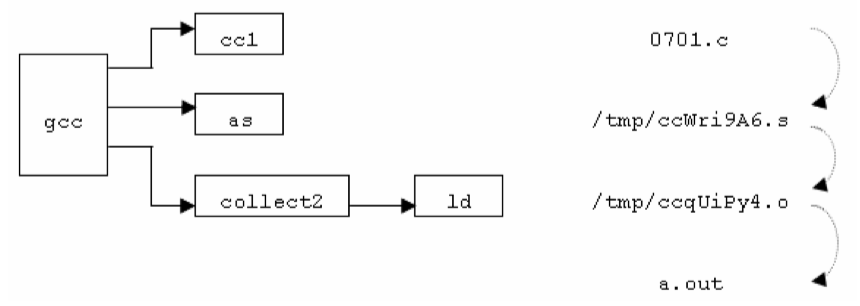
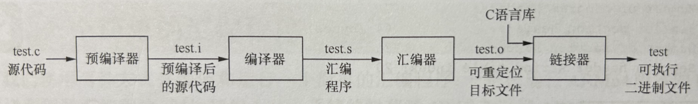

The compilation is the process of converting the source code of the C language into machine code. As C is a mid-level language, it needs a compiler to convert it into an executable code so that the program can be run on our machine.

In computing, a [compiler](https://en.wikipedia.org/wiki/Compiler) is a computer program that translates computer code written in one programming language (the source language) into another language (the target language). The name "compiler" is primarily used for programs that translate source code from a high-level programming language to a low-level programming language (e.g. assembly language, object code, or machine code) to create an executable program.

In C and C++ programming language terminology, a [translation unit](https://en.wikipedia.org/wiki/Translation_unit_(programming)) (or more casually a compilation unit) is the ultimate input to a C or C++ compiler from which an object file is generated. A translation unit roughly consists of a source file after it has been processed by the C preprocessor, meaning that header files listed in `#include` directives are literally included, sections of code within #ifndef may be included, and macros have been expanded.

<!-- more -->

## The compilation process

[C development on Linux - Introduction](https://linuxconfig.org/c-development-on-linux-introduction-i)

<figure markdown="span">
    
</figure>

[Compilation Process of C Program](https://www.codewithrish.com/compilation-process-of-c-program)


## Compile, Load, Execute

<figure markdown="span">
    {: style="width:70%;height:70%"}
</figure>

## Development Flow

[ARM Assembly Language Tools v18.1.0.LTS User's Guide](https://downloads.ti.com/docs/esd/SPNU118U/)

- [1 Introduction to the Software Development Tools](https://downloads.ti.com/docs/esd/SPNU118U/#SPNU118U_HTML/introduction-to-the-software-development-tools.html)

<figure markdown="span">
    
    <figcaption>ARM Device Software Development Flow</figcaption>
</figure>

## compilation steps

《[C语言标准与实现](https://att.newsmth.net/nForum/att/CProgramming/3213/245)》 | 07 C 源文件的编译和链接

实际上，整个工作至少要分四个阶段，分别由不同的程序完成:

1. 由预处理程序执行C源文件中的预处理指令；
2. C编译器把经过预处理的C代码文件编译成汇编代码文件；
3. 汇编编译器把汇编代码文件编详成目标代码文件；
4. 链接程序把所有目标代码链接起来产生可执行文件。

《C语言标准与实现(姚新颜,2004)》07 C 源文件的编译和链接

我们用 `-v` 选项编译07-01（下面的输出信息有省略）：

```Shell
$ gcc -v 0701.c

cc1 0701.c -o /tmp/ccWri9A6.s
#include <... › search starts here:
/opt/gcc/lib/gcc-lib/i686-pc-linux-gnu/4.0/include
as -o /tmp/ccqUiPy4.o /tmp/ccWri9A6.s
collect2 ld-linux.so.2 crt1.o crti.o crtbegin.o /tmp/ccqUiPy4.o
crtend.o crtn.o -lc -lgcc -lgcc_eh
```

1. `gcc` 首先会调用 C 语言编译程序 `cc1` 编译07-01，而在编译过程中，`cc1` 首先对 0701.c 进行预处理。

    - 由于07-01使用了 `#include` 指令包含 `<stdio.h>`，所以 `cc1` 需要在设定的目录中展开搜索。

2. 当预处理完成后，`cc1` 就会进行编译工作，并在临时目录 “/tmp” 下生成汇编语言程序文件 ccWri9A6.s。

3. 然后，gcc 会调用 `as` 把 ccWri9A6.s 编译成目标代码文件 ccqUiPy4.o，最后 gcc 调用 `collect2` 进行链接（`collect2` 再调用 `ld` 来完成主要的链接工作），生成最终的可执行文件 a.out。





## references

[C Program Compilation steps & Example with GCC Linux](https://2183-87846.medium.com/c-program-compilation-steps-example-with-gcc-linux-451bfbb20678)
[GCC and Make - Compiling, Linking and Building C/C++ Applications](https://www3.ntu.edu.sg/home/ehchua/programming/cpp/gcc_make.html)

[CS271: Compiling](https://www.cs.nmsu.edu/\~rth/cs/cs271/notes/Compiling.html)
[Compilation : How does it work?](https://cactussius-primus.medium.com/compilation-how-does-it-work-40e4d56fed27)
[Compiling a C Program: Behind the Scenes](https://www.geeksforgeeks.org/compiling-a-c-program-behind-the-scenes/)

[The compilation process in C](https://medium.com/@elodieriou/the-compilation-process-in-c-b4325a4dd953)
[Compilation Process In C Language](https://medium.com/@3637/compilation-process-in-c-language-f80fa754993f)

[Steps of compilation in C](https://medium.com/basic-command-ls-linux/steps-of-compilation-in-c-737600b43bec)
[C Programming: The Four Stages of Compilation](https://2787.medium.com/c-programming-the-four-stages-of-compilation-f3268b62fbc7)
