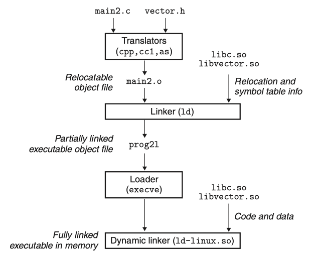

In this article I'll explore the basic concepts associated with dynamic linking - PIC, dynamic relocation, GOT and PLT.

<!-- more -->

[Computer Systems - A Programmer's Perspective](https://www.amazon.com/Computer-Systems-OHallaron-Randal-Bryant/dp/1292101768/) | Chapter 7: Linking

- 7.10: Dynamic Linking with Shared Libraries
- 7.12: Position-Independent Code (PIC)

[Arm Assembly Internals and Reverse Engineering](https://www.amazon.com/Blue-Fox-Assembly-Internals-Analysis/dp/1119745306) | Chapter 2 ELF File Format Internals - The Dynamic Section and Dynamic Loading

- Program Relocations
- The Global Offset Table (GOT)
- The Procedure Linkage Table (PLT)

## Dynamic Linking with Shared Libraries

Figure 7.6 Member object files in the libvector library.

=== "addvec.c"

    ```c
    int addcnt = 0;
    void addvec(int *x, int *y, 
                int *z, int n)
    {
        int i;
        addcnt++;
        for (i = 0; i < n; i++)
            z[i] = x[i] + y[i];
    }
    ```

=== "multvec.c"

    ```c
    int multcnt = 0;
    void multvec(int *x, int *y,
                int *z, int n)
    {
        int i;
        multcnt++;
        for (i = 0; i < n; i++)
            z[i] = x[i] * y[i];
    }
    ```

Figure 7.7 Example program 2. This program invokes a function in the libvector library.

```c title="main2.c"
#include <stdio.h>
#include "vector.h"

int x[2] = {1, 2};
int y[2] = {3, 4};
int z[2];

int main ()
{
    addvec (x, y, z, 2);
    printf ("z = [%d %d]\n", z[0], z[1]);
    return 0;
}
```

The static libraries that we studied in Section 7.6.2 address many of the issues associated with making large collections of related functions available to application programs. However, static libraries still have some significant disadvantages. Static libraries, like all software, need to be maintained and updated periodically. If application programmers want to use the most recent version of a library, they must somehow become aware that the library has changed and then explicitly relink their programs against the updated library.

Another issue is that almost every C program uses standard I/O functions such as `printf` and `scanf`. At run time, the code for these functions is *duplicated* in the text segment of each running process. On a typical system that is running hundreds of processes, this can be a significant waste of scarce memory system resources. (An interesting property of memory is that it is always a *scarce* resource, regardless of how much there is in a system. Disk space and kitchen trash cans share this same property.)

*`Shared libraries`* are modern innovations that address the disadvantages of static libraries. A shared library is an object module that, at either run time or load time, can be loaded at an *arbitrary* memory address and linked with a program in memory. This process is known as `dynamic linking` and is performed by a program called a `dynamic linker`. Shared libraries are also referred to as `shared objects`, and on Linux systems they are indicated by the `.so` suffix. Microsoft operating systems make heavy use of shared libraries, which they refer to as `DLLs` (dynamic link libraries).

Shared libraries are **shared** in two different ways. First, in any given file system, there is exactly one `.so` file for a particular library. The code and data in this `.so` file are *shared* by all of the executable object files that reference the library, as opposed to the contents of static libraries, which are copied and embedded in the executables that reference them. Second, a single copy of the `.text` section of a shared library in memory can be *shared* by different running processes. We will explore this in more detail when we study virtual memory in Chapter 9.

<figure markdown="span">
    {: style="width:80%;height:80%"}
    <figcaption>Figure 7.16 Dynamic linking with shared libraries.</figcaption>
</figure>

Figure 7.16 summarizes the dynamic linking process for the example program in Figure 7.7. To build a shared library `libvector.so` of our example vector routines in Figure 7.6, we invoke the compiler driver with some special directives to the compiler and linker:

```bash
$ linux> gcc -shared -fpic -o libvector.so addvec.c multvec.c
```

The `-fpic` flag directs the compiler to generate position-independent code (more on this in the next section). The -shared flag directs the linker to create a shared object file. Once we have created the library, we would then link it into our example program in Figure 7.7:

```bash
$ linux> gcc -o prog2l main2.c ./libvector.so
```

This creates an executable object file prog2l in a form that can be linked with libvector.so at run time. The basic idea is to do some of the linking *statically* when the executable file is created, and then complete the linking process *dynamically* when the program is loaded. It is important to realize that none of the code or data sections from `libvector.so` are actually copied into the executable prog2l at this point. Instead, the linker copies some relocation and symbol table information that will allow references to code and data in `libvector.so` to be *resolved* at load time.

When the loader loads and runs the executable prog2l, it loads the *partially* linked executable prog2l, using the techniques discussed in Section 7.9. Next, it notices that prog2l contains a `.interp` section, which contains the path name of the dynamic linker, which is itself a shared object (e.g., `ld-linux.so` on Linux systems). Instead of passing control to the application, as it would normally do, the loader loads and runs the dynamic linker. The dynamic linker then finishes the linking task by performing the following relocations:

- Relocating the text and data of `libc.so` into some memory segment
- Relocating the text and data of `libvector.so` into another memory segment
- Relocating any *references* in prog2l to symbols defined by `libc.so` and `libvector.so`

Finally, the dynamic linker passes control to the application. From this point on, the locations of the shared libraries are fixed and do not change during execution of the program.

## Position-Independent Code (PIC)

A key purpose of shared libraries is to allow multiple running processes to **share** the same library code in memory and thus save precious memory resources. So how can multiple processes share a single copy of a program? One approach would be to assign a priori a *dedicated* chunk of the address space to each shared library, and then require the loader to always load the shared library at that address. While straightforward, this approach creates some serious problems. It would be an *inefficient* use of the address space because portions of the space would be allocated even if a process didn't use the library. It would also be difficult to manage. We would have to ensure that none of the chunks *overlapped*. Each time a library was modified, we would have to make sure that it still fit in its assigned chunk. If not, then we would have to find a new chunk. And if we created a new library, we would have to find room for it. Over time, given the hundreds of libraries and versions of libraries in a system, it would be difficult to keep the address space from fragmenting into lots of small unused but unusable holes. Even worse, the assignment of libraries to memory would be different for each system, thus creating even more management headaches.

To avoid these problems, modern systems compile the code segments of shared modules so that they can be loaded ***anywhere*** in memory without having to be modified by the linker. With this approach, a *single* copy of a shared module's code segment can be shared by an unlimited number of processes. (Of course, each process will still get its own copy of the read/write data segment.)

Code that can be loaded without needing any relocations is known as *position independent code* (`PIC`). Users direct GNU compilation systems to generate *PIC* code with the `-fpic` option to gcc. Shared libraries must always be compiled with this option.

On x86-64 systems, references to symbols in the same executable object module require no special treatment to be *PIC*. These references can be compiled using PC-relative addressing and relocated by the static linker when it builds the object file. However, references to *external* procedures and global variables that are defined by shared modules require some special techniques, which we describe next.

## Dynamic Relocations

As the loader initially processes the program and later processes each shared library dependency and dynamically loaded shared library, the loader keeps track of the (nonlocal) symbols defined in each program to build a *database* of all symbols in the current program.

During the program relocation stage, the dynamic linker may encounter relocations indicating that the relocation is not a reference to some internal pointer that needs to be updated, but rather the relocation is a *`reference`* to a symbol defined *outside* of the program binary or shared library. For these dynamic relocations, the loader checks the relocation's symbol entry to discover the name of the symbol being imported and checks this against the database of all symbols in the current program.

If the loader can **find** a *match* in the database, the loader **writes** the absolute address of the symbol to the location indicated in the relocation entry, which normally will be a slot location in the global offset table(`GOT`) section of the ELF binary.

By way of concrete example, suppose `program.so` is written to make use of the `puts` function, defined in `libc.so`. During program initialization, the loader sees that `program.so` references `libc.so` via a `NEEDED` directive and sets about loading `libc.so`. The loader **adds** all of the externally visible symbols from `libc.so` to the global database of symbols at this point. Suppose, by way of example, `libc.so` is loaded to address 0x1000000 and `puts` is at offset 0x3000 in this file, meaning the `puts` symbol's address will be stored in the database as 0x1003000. Later, as the loader processes the relocations for `program.so`, it will encounter a dynamic relocation entry referencing the `puts` symbol. The loader will check the database, see that the `puts` symbol has address 0x1003000, and **write** this value to the address indicated by the relocation entry in `program.so`'s `GOT`.

Later, when `program.so` attempts to invoke the `puts` function, an *indirect* call will occur via `program.so`'s `GOT`. This will mean that the call to `puts` from `program.so` will continue at the function definition of `puts` inside `libc.so`.

## The Global Offset Table (GOT)

As we saw in the previous section, *`dynamic relocations`* specify a location in the program that should be set to the address of an *imported* symbol, such as the address of `puts` inside `libc`. In practice, however, a program may import a given symbol such as `puts` a very large number of times. In principle, emitting a symbol lookup for every call is permitted; however, since symbol lookup is a time-consuming operation requiring a string-based lookup in the global symbol table, this process is not ideal.

The solution to this is the ***Global Offset Table*** (`.got`) section of the ELF binary. The `GOT` consolidates resolution of *external* symbols so that every symbol needs to be looked up *only* once. A program that uses `puts` in 256 distinct places will therefore emit only one relocation asking the loader to look up `puts`, with the address placed in the corresponding `GOT` slot location. Calls to `puts` at runtime then can be performed by loading the address inside this slot and branching to its address.

## The Procedure Linkage Table (PLT)

A further common optimization of this process makes use of another section, called the ***procedure linkage table***(`.plt`), which is designed to facilitate *lazy symbol binding*.

Lazy binding is based on the observation that a given program may import a large number of symbols, but the program may not actually use all of the symbols it imports on all program runs. If we delay symbol resolution to just before the first time a symbol is used, we can **save** the performance cost associated with resolving all of the symbols that are not used. For functions, we can perform this lazy-resolution optimization via the `PLT`.

`PLT stubs` are micro-functions designed ultimately to call the imported function. Imported functions are **rewritten** by the linker to call the `PLT` instead, so program calls to `puts` are rewritten to instead call the corresponding `puts` PLT stub, normally called `puts@plt`. The first time the `puts@plt` stub is called, the `PLT` calls a lazy-loading routine that resolves the puts symbol into its real address and then branches to this address to call `puts`. Subsequent calls to the `PLT` stub use the previously resolved address directly. The overall result is that each function symbol is loaded *once* per program run just before the first invocation of the function.

## references

[TIS - ELF v1.2](https://refspecs.linuxfoundation.org/elf/elf.pdf)

- Book I: ELF - 1. Object Files; 2. Program Loading and Dynamic Linking
- Book III: SYSV - 2. Program Loading and Dynamic Linking

[Arm Assembly Internals and Reverse Engineering](https://www.amazon.com/Blue-Fox-Assembly-Internals-Analysis/dp/1119745306) | Chapter 2 ELF File Format Internals

- The Dynamic Section and Dynamic Loading - Program Relocations(Static, Dynamic, GOT, PLT).

[Practical Binary Analysis](https://www.amazon.com/Practical-Binary-Analysis-Instrumentation-Disassembly/dp/1593279124) | Chapter 2: The ELF Format

- 2.3.4 Lazy Binding and the `.plt`, `.got`, and `.got.plt` Sections
- 2.3.5 The `.rel.*` and `.rela.*` Sections
- 2.3.6 The `.dynamic` Section
