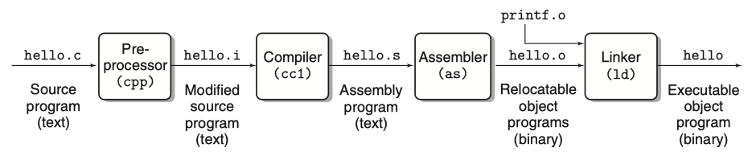
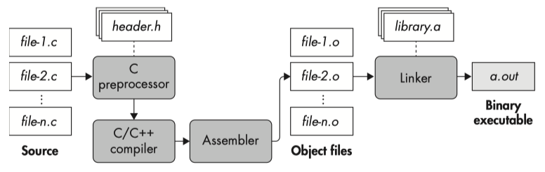
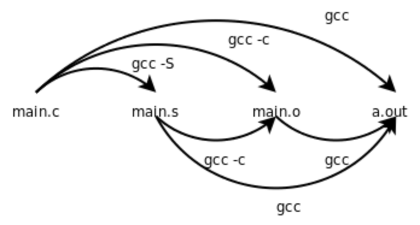

GCC is a collection of compilers.

The C *compiler* itself turns C code into an assembly code listing, and this is sent to the *assembler* to be converted into an object file and later *linked* into a target binary.

If you only want some of the stages of compilation, you can use `-x` (or filename suffixes) to tell gcc where to start, and one of the options `-c`, `-S`, or `-E` to say where `gcc` is to stop.

<!-- more -->

## GNU Compiler Collection

[GCC, the GNU Compiler Collection](https://gcc.gnu.org/) @[git](git://gcc.gnu.org/git/gcc.git) - [wiki](https://en.wikipedia.org/wiki/GNU_Compiler_Collection)

[GCC online documentation](https://gcc.gnu.org/onlinedocs/) - [gcc](https://gcc.gnu.org/onlinedocs/gcc/) - [gccint](https://gcc.gnu.org/onlinedocs/gccint/index.html)

- [Option Summary](https://gcc.gnu.org/onlinedocs/gcc/Option-Summary.html)
- [Overall Options](https://gcc.gnu.org/onlinedocs/gcc/Overall-Options.html)

The `GCC`(GNU Compiler Collection) includes front ends for [C](https://gcc.gnu.org/c99status.html), [C++](https://gcc.gnu.org/projects/cxx-status.html), Objective-C, Fortran, Ada, Go, and D, as well as libraries for these languages (libstdc++,...). 

When we invoke `gcc -v` to comile a program, it will print (on standard error output) the commands executed to run the stages of compilation.

```bash
$ gcc -v helloworld.c
Using built-in specs.
COLLECT_GCC=gcc
COLLECT_LTO_WRAPPER=/usr/lib/gcc/aarch64-linux-gnu/11/lto-wrapper
```

What does the first two lines mean?

[Mainstream Compiler](../toolchain/mainstream-compiler.md) - [GNU C Compiler Internals/Architecture](https://en.wikibooks.org/wiki/GNU_C_Compiler_Internals/GNU_C_Compiler_Architecture)

For a C source file they are the preprocessor and compiler `cc1`, the assembler `as`, and the linker `collect2`. The first and the third programs come with a GCC *distribution*, the assembler is a part of the GNU *binutils* package.

<figure markdown="span">
    
</figure>

[Developer Options](https://gcc.gnu.org/onlinedocs/gcc/Developer-Options.html): `-dumpspecs` : Print the compiler’s built-in [Spec Files](https://gcc.gnu.org/onlinedocs/gcc/Spec-Files.html):

- cpp : Options to pass to the C preprocessor
- cc1 : Options to pass to the C compiler
- cc1plus : Options to pass to the C++ compiler

[cpp - The C Preprocessor](https://gcc.gnu.org/onlinedocs/cpp/)

- [Invocation](https://gcc.gnu.org/onlinedocs/cpp/Invocation.html): the preprocessor is actually *integrated* with the compiler rather than a separate program.
- [Preprocessor Options](https://gcc.gnu.org/onlinedocs/gcc/Preprocessor-Options.html): `-no-integrated-cpp`: Perform preprocessing as a *separate* pass before compilation.

[FAQ - GCC Wiki](https://gcc.gnu.org/wiki/FAQ#include_search_path): the GCC C compiler (`cc1`) and C++ compiler (`cc1cplus`)

[Why cc1 is called cc1?](https://stackoverflow.com/questions/13753854/why-cc1-is-called-cc1) [Relationship between cc1 and gcc?](https://unix.stackexchange.com/questions/77779/relationship-between-cc1-and-gcc)

> The 1 in `cc1` indicates that it is the first stage of the build process. The second stage is `collect2`.

[Collect2 (GCC Internals)](https://gcc.gnu.org/onlinedocs/gccint/Collect2.html): The program `collect2` is installed as `ld` in the directory where the passes of the compiler are installed.

## The C Compilation Process

[Computer Systems - A Programmer's Perspective](https://www.amazon.com/Computer-Systems-OHallaron-Randal-Bryant/dp/1292101768/) | Chapter 1: A Tour of Computer Systems - 1.2 Programs Are Translated by Other Programs into Different Forms

The *hello* program begins life as a high-level C program because it can be read and understood by human beings in that form. However, in order to run `hello.c` on the system, the individual C statements must be *translated* by other programs into a sequence of low-level machine-language instructions. These instructions are then packaged in a form called an executable object program and stored as a binary disk file. Object programs are also referred to as executable object files.

On a Unix system, the translation from source file to object file is performed by a compiler driver such as `gcc`:



Here, the gcc compiler driver reads the source file hello.c and translates it into an executable object file hello. The translation is performed in the sequence of four phases shown in the figure above. The programs that perform the *four* phases (preprocessor, compiler, assembler, and linker) are known collectively as the *`compilation system`*.

[Practical Binary Analysis](https://www.amazon.com/Practical-Binary-Analysis-Instrumentation-Disassembly/dp/1593279124) | Chapter 1: Anatomy of a Binary

Binaries are produced through *compilation*, which is the process of translating human-readable source code, such as C or C ++ , into machine code that your processor can execute. The following figure shows the steps involved in a typical compilation process for C code (the steps for C ++ compilation are similar).



Compiling C code involves four phases, one of which (awkwardly enough) is also called *compilation*, just like the full compilation process. The phases are `preprocessing`, `compilation`, `assembly`, and `linking`. In practice, modern compilers often merge some or all of these phases, but for demonstration purposes, I will cover them all separately.

## gcc stop at specified stage

[GCC online documentation](https://gcc.gnu.org/onlinedocs/) - [gcc](https://gcc.gnu.org/onlinedocs/gcc/)

- [Option Summary](https://gcc.gnu.org/onlinedocs/gcc/Option-Summary.html)
- [Overall Options](https://gcc.gnu.org/onlinedocs/gcc/Overall-Options.html)

> Previous related post: [Mainstream Compiler - gcc/clang/msvc](../toolchain/mainstream-compiler.md).

You can tell `gcc` to stop at a certain stage by passing options.

`-E`: Stop after the preprocessing stage; do not run the compiler proper. The output is in the form of preprocessed source code, which is sent to the standard output.

- related post: [Dump Compiler Options](../toolchain/dump-compiler-options.md)

!!! note ""

    [Preprocessor-Options](https://gcc.gnu.org/onlinedocs/gcc/Preprocessor-Options.html): Options Controlling the Preprocessor

    `-dletters`: Says to make debugging dumps during compilation as specified by letters(`M`|`D`|`N`|`I`|`U`). The flags documented here are those relevant to the preprocessor. Other letters are interpreted by the compiler proper, or reserved for future versions of GCC, and so are silently ignored. If you specify letters whose behavior conflicts, the result is undefined. See [GCC Developer Options](https://gcc.gnu.org/onlinedocs/gcc/Developer-Options.html), for more information.

    `-P`: Inhibit generation of linemarkers in the output from the preprocessor. This might be useful when running the preprocessor on something that is not C code, and will be sent to a program which might be confused by the linemarkers.

`-S`: Stop after the stage of compilation proper; *do not assemble*. The output is in the form of an assembler code file for each non-assembler input file specified.

- By default, the assembler file name for a source file is made by replacing the suffix ‘.c’, ‘.i’, etc., with ‘`.s`’.

!!! note "-fverbose-asm"

    [Options for Code Generation Conventions](https://gcc.gnu.org/onlinedocs/gcc/Code-Gen-Options.html)

    `-fverbose-asm`: Put extra commentary information in the generated assembly code to make it more readable. This option is generally only of use to those who actually need to read the generated assembly code (perhaps while debugging the compiler itself).

    `-fno-verbose-asm`, the default, causes the extra information to be omitted and is useful when comparing two assembler files.

    The added comments include:

    * information on the compiler version and command-line options,
    * the source code lines associated with the assembly instructions, in the form `FILENAME:LINENUMBER:CONTENT OF LINE`,
    * hints on which high-level expressions correspond to the various assembly instruction operands.

`-c`: Compile or assemble the source files, but *do not link*. The linking stage simply is not done. The ultimate output is in the form of an object file for each source file.

- By default, the object file name for a source file is made by replacing the suffix ‘.c’, ‘.i’, ‘.s’, etc., with ‘`.o`’.

[Linux C编程一站式学习](https://book.douban.com/subject/4141733/) | 第18章 汇编与C之间的关系 - 18.2 main函数、启动例程和退出状态

<figure markdown="span">
    {: style="width:75%;height:75%"}
</figure>

[gcc程序的编译过程和链接原理](https://blog.csdn.net/czg13548930186/article/details/78331692):

<figure markdown="span">
    
</figure>

[GCC: 编译C语言的流程](https://veryitman.com/2017/10/03/GCC-%E7%BC%96%E8%AF%91C%E8%AF%AD%E8%A8%80%E7%9A%84%E6%B5%81%E7%A8%8B/)

<figure markdown="span">
    
</figure>

## gcc -S stop assembling

After the preprocessing phase is complete, the source is ready to be compiled. The compilation phase takes the preprocessed code and translates it into assembly language.

Why does the compilation phase produce assembly language and not machine code? This design decision doesn’t seem to make sense in the context of just one language (in this case, C), but it does when you think about all the other languages out there.

We can intercept this assembly listing to view what the compiler itself is generating using the command-line option `–S`, e.g., invoking `gcc main.c -S`. GCC will then compile our program in main.c into an assembly listing and write it to the file `main.s`.

Most compilers also perform heavy optimization in this phase, typically configurable as an optimization level through command line switches such as options `-O0` through `-O3` in gcc. As you’ll see later, the degree of optimization during compilation can have a profound effect on disassembly.

=== "test-gdb.c"

    ```c
    #include <stdio.h>

    int func(int n)
    {
        int sum=0,i;
        for(i=0; i<n; i++)
        {
            sum+=i;
        }
        return sum;
    }

    int main(int argc, char* argv[])
    {
        int i;
        long result = 0;
        for(i=1; i<=100; i++)
        {
            result += i;
        }

        printf("result[1-100] = %ld\n", result );
        printf("result[1-250] = %d\n", func(250) );

        return 0;
    }
    ```

=== "cc test-gdb.c -S -o -"

    ```bash
    # cc test-gdb.c -S [-o test-gdb.s]
    $ cc test-gdb.c -S -o -
        .arch armv8-a
        .file	"test-gdb.c"
        .text
        .align	2
        .global	func
        .type	func, %function
    func:
    .LFB0:
        .cfi_startproc
        sub	sp, sp, #32
        .cfi_def_cfa_offset 32
        str	w0, [sp, 12]
        str	wzr, [sp, 24]
        str	wzr, [sp, 28]
        b	.L2
    .L3:
        ldr	w1, [sp, 24]
        ldr	w0, [sp, 28]
        add	w0, w1, w0
        str	w0, [sp, 24]
        ldr	w0, [sp, 28]
        add	w0, w0, 1
        str	w0, [sp, 28]
    .L2:
        ldr	w1, [sp, 28]
        ldr	w0, [sp, 12]
        cmp	w1, w0
        blt	.L3
        ldr	w0, [sp, 24]
        add	sp, sp, 32
        .cfi_def_cfa_offset 0
        ret
        .cfi_endproc
    .LFE0:
        .size	func, .-func
        .section	.rodata
        .align	3
    .LC0:
        .string	"result[1-100] = %ld\n"
        .align	3
    .LC1:
        .string	"result[1-250] = %d\n"
        .text
        .align	2
        .global	main
        .type	main, %function
    main:
    .LFB1:
        .cfi_startproc
        stp	x29, x30, [sp, -48]!
        .cfi_def_cfa_offset 48
        .cfi_offset 29, -48
        .cfi_offset 30, -40
        mov	x29, sp
        str	w0, [sp, 28]
        str	x1, [sp, 16]
        str	xzr, [sp, 40]
        mov	w0, 1
        str	w0, [sp, 36]
        b	.L6
    .L7:
        ldrsw	x0, [sp, 36]
        ldr	x1, [sp, 40]
        add	x0, x1, x0
        str	x0, [sp, 40]
        ldr	w0, [sp, 36]
        add	w0, w0, 1
        str	w0, [sp, 36]
    .L6:
        ldr	w0, [sp, 36]
        cmp	w0, 100
        ble	.L7
        ldr	x1, [sp, 40]
        adrp	x0, .LC0
        add	x0, x0, :lo12:.LC0
        bl	printf
        mov	w0, 250
        bl	func
        mov	w1, w0
        adrp	x0, .LC1
        add	x0, x0, :lo12:.LC1
        bl	printf
        mov	w0, 0
        ldp	x29, x30, [sp], 48
        .cfi_restore 30
        .cfi_restore 29
        .cfi_def_cfa_offset 0
        ret
        .cfi_endproc
    .LFE1:
        .size	main, .-main
        .ident	"GCC: (Ubuntu 11.4.0-1ubuntu1~22.04) 11.4.0"
        .section	.note.GNU-stack,"",@progbits
    ```

=== "cc test-gdb.c -S -fverbose-asm -o -"

    ```bash
    # cc test-gdb.c -S -fverbose-asm [-o test-gdb.s]
    $ cc test-gdb.c -S -fverbose-asm -o -
        .arch armv8-a
        .file	"test-gdb.c"
    // GNU C17 (Ubuntu 11.4.0-1ubuntu1~22.04) version 11.4.0 (aarch64-linux-gnu)
    //	compiled by GNU C version 11.4.0, GMP version 6.2.1, MPFR version 4.1.0, MPC version 1.2.1, isl version isl-0.24-GMP

    // GGC heuristics: --param ggc-min-expand=91 --param ggc-min-heapsize=115878
    // options passed: -mlittle-endian -mabi=lp64 -fasynchronous-unwind-tables -fstack-protector-strong -fstack-clash-protection
        .text
        .align	2
        .global	func
        .type	func, %function
    func:
    .LFB0:
        .cfi_startproc
        sub	sp, sp, #32	//,,
        .cfi_def_cfa_offset 32
        str	w0, [sp, 12]	// n, n
    // test-gdb.c:5:     int sum=0,i;
        str	wzr, [sp, 24]	//, sum
    // test-gdb.c:6:     for(i=0; i<n; i++)
        str	wzr, [sp, 28]	//, i
    // test-gdb.c:6:     for(i=0; i<n; i++)
        b	.L2		//
    .L3:
    // test-gdb.c:8:         sum+=i;
        ldr	w1, [sp, 24]	// tmp95, sum
        ldr	w0, [sp, 28]	// tmp96, i
        add	w0, w1, w0	// tmp94, tmp95, tmp96
        str	w0, [sp, 24]	// tmp94, sum
    // test-gdb.c:6:     for(i=0; i<n; i++)
        ldr	w0, [sp, 28]	// tmp98, i
        add	w0, w0, 1	// tmp97, tmp98,
        str	w0, [sp, 28]	// tmp97, i
    .L2:
    // test-gdb.c:6:     for(i=0; i<n; i++)
        ldr	w1, [sp, 28]	// tmp99, i
        ldr	w0, [sp, 12]	// tmp100, n
        cmp	w1, w0	// tmp99, tmp100
        blt	.L3		//,
    // test-gdb.c:10:     return sum;
        ldr	w0, [sp, 24]	// _6, sum
    // test-gdb.c:11: }
        add	sp, sp, 32	//,,
        .cfi_def_cfa_offset 0
        ret	
        .cfi_endproc
    .LFE0:
        .size	func, .-func
        .section	.rodata
        .align	3
    .LC0:
        .string	"result[1-100] = %ld\n"
        .align	3
    .LC1:
        .string	"result[1-250] = %d\n"
        .text
        .align	2
        .global	main
        .type	main, %function
    main:
    .LFB1:
        .cfi_startproc
        stp	x29, x30, [sp, -48]!	//,,,
        .cfi_def_cfa_offset 48
        .cfi_offset 29, -48
        .cfi_offset 30, -40
        mov	x29, sp	//,
        str	w0, [sp, 28]	// argc, argc
        str	x1, [sp, 16]	// argv, argv
    // test-gdb.c:16:     long result = 0;
        str	xzr, [sp, 40]	//, result
    // test-gdb.c:17:     for(i=1; i<=100; i++)
        mov	w0, 1	// tmp96,
        str	w0, [sp, 36]	// tmp96, i
    // test-gdb.c:17:     for(i=1; i<=100; i++)
        b	.L6		//
    .L7:
    // test-gdb.c:19:         result += i;
        ldrsw	x0, [sp, 36]	// _1, i
        ldr	x1, [sp, 40]	// tmp98, result
        add	x0, x1, x0	// tmp97, tmp98, _1
        str	x0, [sp, 40]	// tmp97, result
    // test-gdb.c:17:     for(i=1; i<=100; i++)
        ldr	w0, [sp, 36]	// tmp100, i
        add	w0, w0, 1	// tmp99, tmp100,
        str	w0, [sp, 36]	// tmp99, i
    .L6:
    // test-gdb.c:17:     for(i=1; i<=100; i++)
        ldr	w0, [sp, 36]	// tmp101, i
        cmp	w0, 100	// tmp101,
        ble	.L7		//,
    // test-gdb.c:22:     printf("result[1-100] = %ld\n", result );
        ldr	x1, [sp, 40]	//, result
        adrp	x0, .LC0	// tmp102,
        add	x0, x0, :lo12:.LC0	//, tmp102,
        bl	printf		//
    // test-gdb.c:23:     printf("result[1-250] = %d\n", func(250) );
        mov	w0, 250	//,
        bl	func		//
        mov	w1, w0	//, _2
        adrp	x0, .LC1	// tmp103,
        add	x0, x0, :lo12:.LC1	//, tmp103,
        bl	printf		//
    // test-gdb.c:25:     return 0;
        mov	w0, 0	// _11,
    // test-gdb.c:26: }
        ldp	x29, x30, [sp], 48	//,,,
        .cfi_restore 30
        .cfi_restore 29
        .cfi_def_cfa_offset 0
        ret	
        .cfi_endproc
    .LFE1:
        .size	main, .-main
        .ident	"GCC: (Ubuntu 11.4.0-1ubuntu1~22.04) 11.4.0"
        .section	.note.GNU-stack,"",@progbits
    ```

## gcc -c stop linking

In the assembly phase, you finally get to generate some real *machine code*! The input of the assembly phase is the set of assembly language files generated in the compilation phase, and the output is a set of *object files*, sometimes also referred to as *modules*. Object files contain machine instructions that are in principle executable by the processor. You need to do some more work before you have a ready-torun binary executable file.

Typically, each source file corresponds to one assembly file, and each assembly file corresponds to one object file. To generate an object file, you can pass the `-c` flag to gcc. This option tells GCC to create the object file *without* invoking the linking process.

```bash
$ cc test-gdb.c -c
```

It can be broken down into two steps, as follows:

1. compile to assembly: `cc test-gdb.c -S [-o test-gdb.s]`
2. assemble to object: `as test-gdb.s -o test-gdb.o`

Next time, let's take a look at the object file generated by `gcc -c`.
