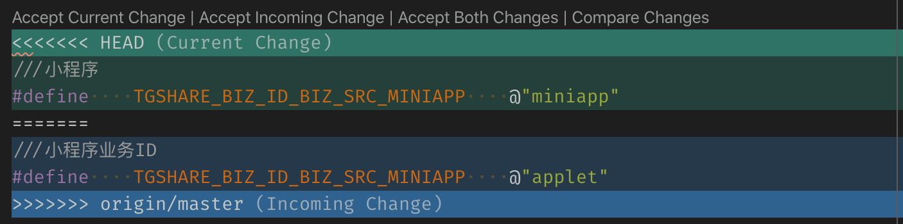

本文梳理了解决 git 冲突的基本操作方法。

<!-- more -->

## manual resolve

[Resolving a merge conflict using the command line](https://help.github.com/en/github/collaborating-with-issues-and-pull-requests/resolving-a-merge-conflict-using-the-command-line)

conflict marker `<<<<<<<`

Delete the conflict markers `<<<<<<<`, `=======`, `>>>>>>>` and make the changes you want in the final merge. 

Add or stage your changes and commit.

```Shell
<<<<<<< HEAD
///小程序
#define    TGSHARE_BIZ_ID_BIZ_SRC_MINIAPP    @"miniapp"
=======
///小程序业务ID
#define    TGSHARE_BIZ_ID_BIZ_SRC_MINIAPP    @"applet"
>>>>>>> origin/master
```

## [Git: Handling Merge Conflicts Using "Ours" and "Theirs"](https://howchoo.com/g/njcyntcxmwq/git-merge-conflicts-rebase-ours-theirs)

Using `--ours`/`--theirs` during a merge

```Shell
(feature) $ git merge master
Auto-merging myscript.py
CONFLICT (content): Merge conflict in myscript.py
Automatic merge failed; fix conflicts and then commit the result.
```

Use `--ours` keep the version in the current branch

```Shell
$ git checkout --ours myscript.py
```

Use `--theirs` to keep the version from the branch being merged in

```Shell
$ git checkout --theirs myscript.py
```

## [Git – Resolve Merge Conflicts](https://easyengine.io/tutorials/git/git-resolve-merge-conflicts/)

Change working directory to project folder.
Search for all conflicting files.

```Shell
$ cd project-folder
$ grep -lr '<<<<<<<' .
```

Above will list all files which has marker special marker `<<<<<<<` in them.

**Resolve easy/obvious conflicts**

At this point you may review each files. If solution is to accept local/our version, run:

```Shell
$ git checkout --ours PATH/FILE
```

If solution is to accept remote/other-branch version, run:

```Shell
$ git checkout --theirs PATH/FILE
```

If you have multiple files and you want to accept local/our version, run:

```Shell
$ grep -lr '<<<<<<<' . | xargs git checkout --ours
```

If you have multiple files and you want to accept remote/other-branch version, run:

```Shell
$ grep -lr '<<<<<<<' . | xargs git checkout --theirs
```

**For complex conflicts**

For files that needs manual review/edit, use vim or any text editor to resolve differences.

## [Resolve Git merge conflicts in favor of their changes during a pull](https://stackoverflow.com/questions/10697463/resolve-git-merge-conflicts-in-favor-of-their-changes-during-a-pull)

```Shell
$ git help merge

       -X <option>, --strategy-option=<option>
           Pass merge strategy specific option through to the merge strategy.

```

```Shell
$ git pull -s recursive -X theirs <remoterepo or other repo>
```

> Note that `-s` recursive here is redundant, since that's the default merge strategy.

Or, simply, for the default repository:

```Shell
$ git pull -X theirs
```

> The `git pull -X theirs` answers may create an ugly merge commit,

If you're already in conflicted state...

```Shell
$ git checkout --theirs path/to/file
```

> `git checkout --theirs path/to/file`  

---

```Shell
$ git merge -X theirs
```

This doesn't work if you are already in the conflict resolution state.  
In that case I believe the best way to resolve is to `git checkout <ref to theirs> -- the/conflicted.file` and then git add their changes. 

---

Please not that sometimes this will not work:

```Shell
$ git checkout --ours path/to/file
# or
$ git checkout --theirs path/to/file
```

---

I did this instead, assuming `HEAD` is ours and `MERGE_HEAD` is theirs

```Shell
# 主干合入分支时，优先采用当前主干 HEAD，再手动合入
$ git checkout HEAD -- path/to/file
# 分支 rebase 主干时，以主干 MERGE_HEAD 为准，再手动合入
$ git checkout MERGE_HEAD -- path/to/file
```

After we do this and we are good:

```Shell
$ git add .
```

> 采用本端的 HEAD 或远端的 MERGE_HEAD，以一方作为参考基准之后，再手动将相对修改合入基准，再提交。

执行 `git merge origin/master` 有冲突时，可以
执行 `git rev-parse HEAD` 和 `git log -1 | cat` 查看确认当前 index 的版本号；  
执行 `git rev-parse MERGE_HEAD` 和 `git log -1 origin/master | cat` 查看确认 origin/master 的版本号。  

## refs

[Git MERGE_HEAD 冲突](https://www.jianshu.com/p/d97981c4011f)

```Shell
git merge --abort
git reset --merge
git pull
```

[Resolve conflict using "MERGE_HEAD (origin/HEAD)"](https://www.cnblogs.com/wzwyc/p/10229278.html)

vscode 快捷解决冲突：



- Accept Current Change: ours  
- Accept Incoming Change: theirs  
- Accept Both Changes: first ours, then theirs  
- Compare Changes: compare side-by-side  
