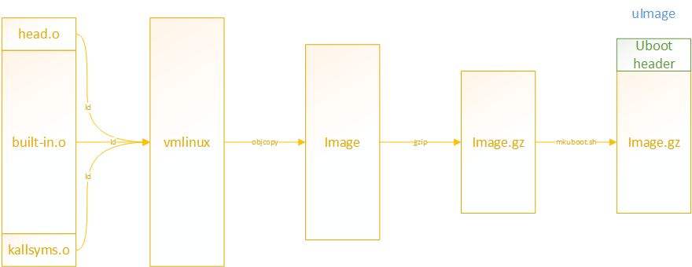

The kernel is the core of the Linux system. It is the first component loaded into the memory upon boot up. It provides a user interface that allows us to interact with the operating system and remains in the memory throughout the computer’s use.

<!-- more -->

!!! abstract "vmlinux"

    [vmlinux](https://en.wikipedia.org/wiki/Vmlinux) is a statically linked executable file that contains the Linux kernel in one of the object file formats supported by Linux, which includes Executable and Linkable Format (ELF) and Common Object File Format (COFF). The vmlinux file might be required for kernel debugging, symbol table generation or other operations, but must be made bootable before being used as an operating system kernel by *adding* a [multiboot](https://en.wikipedia.org/wiki/Multiboot_specification) header, *bootsector* and *setup* routines.

## vmlinux

A kernel image is a file with the binary representation of the kernel code and other components. When we compile a custom kernel, we can produce it into one of the following kernel images. The original, uncompressed Linux kernel image is called `vmlinux`. vmlinux is the kernel in a uncompressed and *non-bootable* form. It’s the intermediate step to producing `vmlinuz`.

> The *`vm`* preceding the Linux stands for *virtual memory*. In Linux, we can use a portion of the hard disk space as virtual memory, hence the name `vm`.

In most cases, vmlinux is used to develop kernels, debug, and analyze them. The vmlinux image should be bootable before being loaded to an operating system kernel. To make it bootable, we *add* a multi-boot header, boot sector, and set up routines.

Kernel image formats differ based on compression, architecture, and specific use cases.

- `zimage` refers to a distinct compressed kernel image file format. It’s designed for X86-based systems.
- `bzimage` refers to a compressed kernel image file used by the Linux bootloader to load and initialize the kernel during the system boot.
- `uImage` is a kernel image dedicated to U-Boot, which is processed from a `zImage` using the [mkimage](https://manpages.ubuntu.com/manpages/bionic/man1/mkimage.1.html) tool. U-Boot uses uImage through the `bootm` command.

> uImage has a U-Boot wrapper(64 bytes of metadata header) that indicates the kernel version, load location, creation time, size and other information.

## vmlinux.lds

The target file generated after kernel compilation is `vmlinux` in ELF format. The vmlinux is each source code according to the rules set by `vmlinux.lds`. The object file obtained after linking is not an executable file and cannot be run on the ARM platform.

The `vmlinux.lds` is generated after sorting the output of the linker `ld` by the `vmlinux.lds.S` during kernel compilation; `vmlinux.lds.S` is used to sort the sections in the output file and define related symbols.

When the kernel is compiled, `vmlinux.lds` serves as the linker script of the Makefile and participates in linking to generate the kernel image `vmlinux`.

In short, `vmlinux` is generated according to the `vmlinux.lds` linker script, and `vmlinux.lds` is generated by `vmlinux.lds.S`.

## references

[简析Linux镜像生成过程: vmlinux->uImage](https://www.cnblogs.com/arnoldlu/p/14102272.html)

[Linux内核链接脚本vmlinux.lds.S详解](https://blog.csdn.net/shift_wwx/article/details/134209465)
[linux内核链接脚本vmlinux.lds分析（十一）](https://www.cnblogs.com/jianhua1992/p/16852795.html)

[Differences Between vmlinux, vmlinuz, zimage and bzimage](https://www.baeldung.com/linux/kernel-images)
[linux kernel - Image vs zImage vs uImage](https://stackoverflow.com/questions/22322304/image-vs-zimage-vs-uimage)
