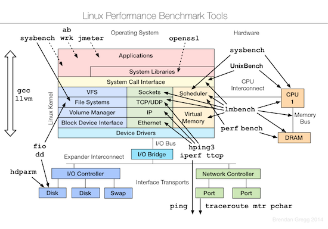

Linux Performance Observability, Benchmark, Tuning Tools

<!-- more -->

## linux-observability-tools


## linux-benchmarking-tools



## linux-tuning-tools


## linux file hier

执行命令 `man hier` [打印Linux文件系统层次](https://www.kancloud.cn/chandler/bc-linux/1903024)。

以下为 macOS 下查看 hier - layout of filesystems :

```Shell
HIER(7)              BSD Miscellaneous Information Manual              HIER(7)

NAME
     hier -- layout of filesystems

DESCRIPTION
     A historical sketch of the filesystem hierarchy.  The modern OS X filesystem is documented in the ``File System Programming Guide'' available on
     Apple Developer.

     /             root directory of the filesystem
```

以下为 raspberry-pi 上查看 Raspberry/Debian 的 hier - filesystem hierarchy :

```Shell
HIER(7)                                                                Linux Programmer's Manual                                                               HIER(7)

NAME
       hier - description of the filesystem hierarchy

DESCRIPTION
       A typical Linux system has, among others, the following directories:

       /      This is the root directory.  This is where the whole tree starts.
```
