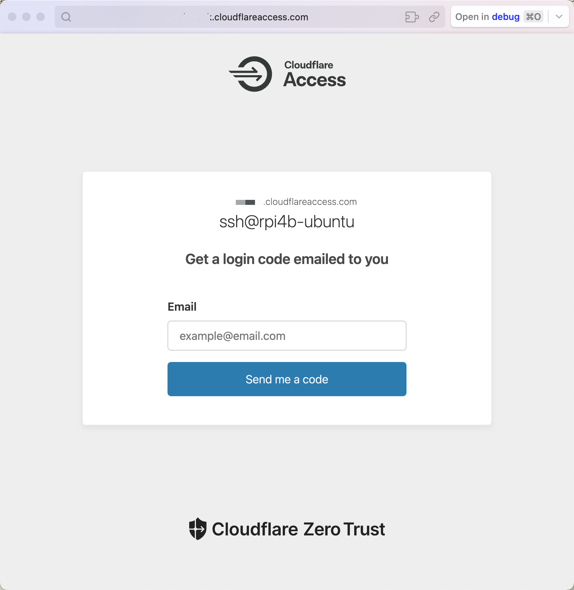
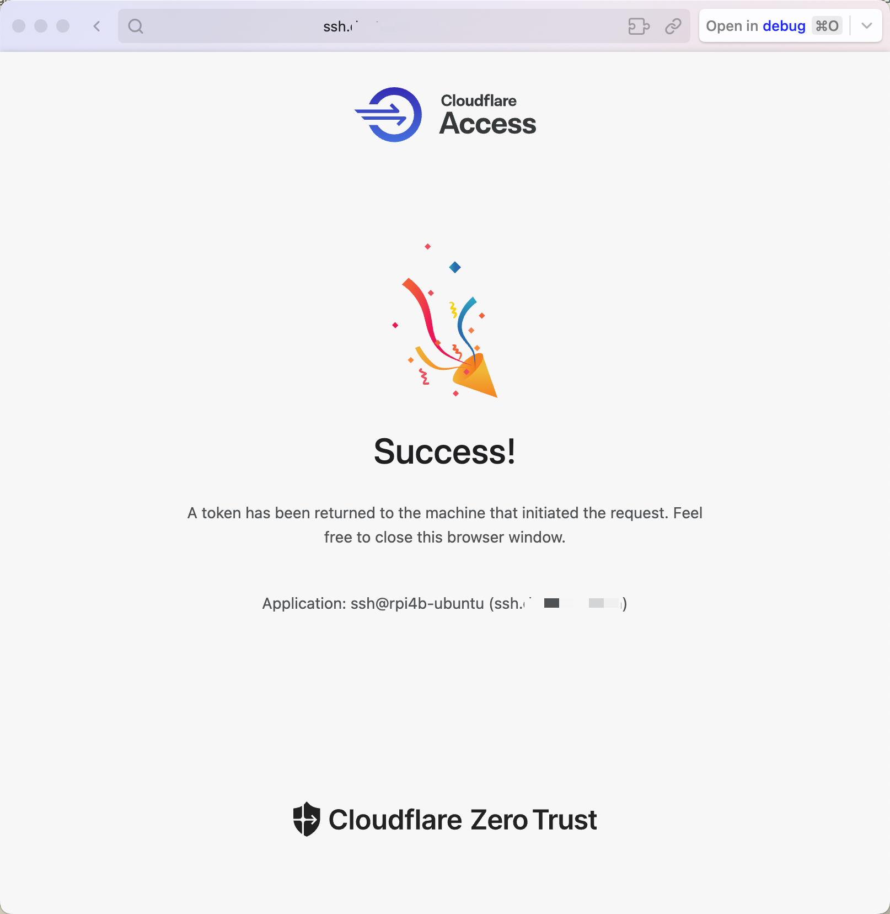

[Previously](./ubuntu-cloudflare-tunnel.md), I've created and run a cloudflared tunnel for web server exposure on the rpi4b-ubuntu platform.

In this article, I'll try to configure remote SSH through the Cloudflare zero-trust application and tunnel route, reusing a public hostname.

<!-- more -->

## Official guidelines

[Connect with SSH through Cloudflare Tunnel](https://developers.cloudflare.com/cloudflare-one/connections/connect-networks/use-cases/ssh/)

Cloudflare Zero Trust offers two solutions to provide secure access to SSH servers:

- [ ] Private subnet routing with Cloudflare WARP to Tunnel
- [x] Public hostname routing with cloudflared access

**Connect to SSH server with cloudflared access**

Cloudflare Tunnel can also route *applications* through a public hostname, which allows users to connect to the application *without* the [WARP client](https://developers.cloudflare.com/cloudflare-one/connections/connect-devices/warp/). This method requires having `cloudflared` installed on both the server machine and on the client machine, as well as an active zone on Cloudflare. The traffic is proxied over this connection, and the user logs in to the server with their Cloudflare Access credentials.

**Connect the server to Cloudflare**

1. Create a Cloudflare Tunnel by following our dashboard setup guide.

2. In the **Public Hostnames** tab, choose a domain from the drop-down menu and specify any *subdomain* (for example, `ssh.example.com`).

3. For **Service**, select _SSH_ and enter `localhost:22`. If the SSH server is on a different machine from where you installed the tunnel, enter `<server IP>:22`.

4. Select **Save hostname**.

5. (Recommended) [Add a self-hosted application](https://developers.cloudflare.com/cloudflare-one/applications/configure-apps/self-hosted-apps/) to Cloudflare Access in order to manage access to your server.

As the tunnel is ready, I will focus on the final recommendation of adding a self-hosted application for the SSH session.

## DNS route to ssh

When cloudflared receives an incoming request, it evaluates each ingress rule from top to bottom to find which rule matches the request. Rules can match either the hostname or path of an incoming request, or both.

!!! note "Wildcards"

    You can use wildcards to match traffic to multiple subdomains or paths. For example, if you set the hostname key to `*.example.com`, both `test.example.com` and `try.example.com` will route traffic to your origin.

Open the [Cloudflare Dashboard](https://dash.cloudflare.com/), click `Websites` and choose a domain (e.g. `dummy.com`), then click `DNS - Records` in the left panel, the *CNAME* record lists the following.

Type  | Name        | Content                                               | Proxy status | TTL
------|-------------|-------------------------------------------------------|--------------|-----
CNAME | `dummy.com` | 79983784-9f0c-4fd7-b28c-cbdfc066f584.cfargotunnel.com | Proxied      | Auto

You can change the name `dummy.com` to a wildcard `*`. This will make it easier to configure the subdomains that map to the intranet SSH service.

Type  | Name | Content                                               | Proxy status | TTL
------|------|-------------------------------------------------------|--------------|-----
CNAME | `*`  | 79983784-9f0c-4fd7-b28c-cbdfc066f584.cfargotunnel.com | Proxied      | Auto

In this case, the tunnel route is now actually `*.dummy.com`, which corresponds to all the sub-domains, such as `ssh.dummy.com`.

A more practical solution is to add another CNAME record that configures subdomain `ssh`(.dummy.com) routing to the same target `cfargotunnel`.

Type  | Name        | Content                                               | Proxy status | TTL
------|-------------|-------------------------------------------------------|--------------|-----
CNAME | `dummy.com` | 79983784-9f0c-4fd7-b28c-cbdfc066f584.cfargotunnel.com | Proxied      | Auto
CNAME | `ssh`       | 79983784-9f0c-4fd7-b28c-cbdfc066f584.cfargotunnel.com | Proxied      | Auto

Apart from the DNS routing solution, you can of course create another dedicated tunnel `cloudflared tunnel --hostname ssh.dummy.com --url ssh://localhost:22` for SSH as an alternative.

## Config tunnel ingress rules

Return to the machine running the cloudflared service.

Last time, we've just exposed web server through the cloudflared tunnel:

```yaml title="config.yml"
tunnel: cft
credentials-file: /home/pifan/.cloudflared/79983784-9f0c-4fd7-b28c-cbdfc066f584.json
url: http://localhost:81
```

To expose the SSH service, we need to reorganize the `config.yml` and configure ingress rules for traffic routing.

```yaml
$ sudo vim /etc/ssh/sshd_config

tunnel: cft
credentials-file: /home/pifan/.cloudflared/79983784-9f0c-4fd7-b28c-cbdfc066f584.json

ingress:
    - hostname: dummy.com
      service: http://localhost
    - hostname: ssh.dummy.com
      service: ssh://localhost:22
    - service: http_status:404
```

To validate the ingress rules in your configuration file, run:

```bash
$ cloudflared tunnel ingress validate
Validating rules from /home/pifan/.cloudflared/config.yml
OK
```

To verify that cloudflared will proxy the right traffic to the right local service, use `cloudflared tunnel ingress rule`.
This checks a URL against every rule, from first to last, and shows the first rule that matches.

```bash
$ cloudflared tunnel ingress rule https://dummy.com/
Using rules from /home/pifan/.cloudflared/config.yml
Matched rule #0
        hostname: dummy.com
        service: http://localhost

$ cloudflared tunnel ingress rule ssh://ssh.dummy.com
Using rules from /home/pifan/.cloudflared/config.yml
Matched rule #1
        hostname: ssh.dummy.com
        service: ssh://localhost:22
```

Restart the cloudflared service for the rules to take effect immediately.

```bash
$ sudo systemctl restart cloudflared
```

## Add an Access Application

Open [Cloudflare Dashboard](https://dash.cloudflare.com/), Click Zero Trust to enter [Cloudflare One](https://one.dash.cloudflare.com/) page, select an account to log in.

Click `Access - Applications` in the left panel, find the `+ Add an Application` button on the right and click. On your first attempt, you'll have to choose a *plan* before proceeding.

**Steps**: Select type > Configure application > Add policies > Setup.

To grant a user access to an application, simply add their email address to an Access policy.

1. Select application type: `Self-hosted`

2. Configure application:

    - Application Name: `ssh@rpi4b-ubuntu`
    - Session Duration: `24h`
    - Subdomain: `ssh`
    - Domain: `dummy.com`

3. Add [policies](https://developers.cloudflare.com/cloudflare-one/policies/):

    - Policy Name: `Only You`
    - Action: `Allow`
    - Session Duration: `Same as application session timeout` or `24h`
    - Selector -> `Email`
    - Value -> `Your Email Address`(support multiple addresses)

4. Additional settings:

    - Turn on `Enable automatic cloudflared authentication`
    - Browser rendering (Beta): `SSH`

5. Add application.

## Configure short-lived cert

[User management](https://developers.cloudflare.com/cloudflare-one/identity/users/) - [Short-lived certificates](https://developers.cloudflare.com/cloudflare-one/identity/users/short-lived-certificates/)

Still in the [Zero Trust / Cloudflare One](https://one.dash.cloudflare.com/) page, goto `Access - Service Auth - SSH`, select an application and click the `Generate certificate` button to generate a short-lived certificate.

Click the *Application name* in the *Short-lived certificates* area, copy the `public key` and paste it into `/etc/ssh/ca.pub` on rpi4b-ubuntu.

Assuming your policy email is `cft@gmail.com`, add the following lines to `/etc/ssh/sshd_config` on rpi4b-ubuntu running *sshd* service.

```bash
Match user gmail
  AuthorizedPrincipalsCommand /bin/echo 'cft'
  AuthorizedPrincipalsCommandUser nobody
```

Move on and carry out the following two steps:

1. Uncomment `PubkeyAuthentication yes`
2. Append `TrustedUserCAKeys /etc/ssh/ca.pub`

Then restart SSH service: `sudo systemctl restart ssh`.

## Configure SSH client

End users can connect to the SSH session without any configuration by using Cloudflare's browser-based terminal. Users visit the URL of the application and Cloudflare's terminal handles the short-lived certificate flow.

On an SSH client platform such as macOS, run `cloudflared access ssh-config` to print the required configuration command:

```bash hl_lines="4-7"
$ cloudflared access ssh-config --hostname ssh.dummy.com --short-lived-cert

Add to your /Users/faner/.ssh/config:
Match host ssh.dummy.com exec "/opt/homebrew/bin/cloudflared access ssh-gen --hostname %h"
  ProxyCommand /opt/homebrew/bin/cloudflared access ssh --hostname %h
  IdentityFile ~/.cloudflared/%h-cf_key
  CertificateFile ~/.cloudflared/%h-cf_key-cert.pub
```

Copy the SSH configuration generated above to `~/.ssh/config` and try `ssh` to initiate a [One-time PIN login](https://developers.cloudflare.com/cloudflare-one/identity/one-time-pin/).

> Add the `-v` option to enable verbose mode, printing more detailed debugging messages.

```bash
$ ssh -v pifan@ssh.dummy.com

A browser window should have opened at the following URL:

https://ssh.dummy.com/cdn-cgi/access/cli?aud=82a2ef3493f83718ae779bf1658b1e574634f81b7ba3a88102d35545fe7ffb73&edge_token_transfer=true&redirect_url=https%3A%2F%2Fssh.dummy.com%3Faud%3D82a2ef3493f83718ae779bf1658b1e574634f81b7ba3a88102d35545fe7ffb73%26token%3DpUNqPtNXsokMC-eMAVSSzgd9P-fvefdty12IKF2_Oy4%253D&send_org_token=true&token=pUNqPtNXsokMC-eMAVSSzgd9P-fvefdty12IKF2_Oy4%3D

If the browser failed to open, please visit the URL above directly in your browser.

```

It will open the access URL in default browser and redirect to `YOURGROUP.cloudflareaccess.com`'s sign-in page. On the Sign-in page, enter your email(`cft@gmail.com`) and click `Send me a code`.

<figure markdown="span">
    <!--  -->
    {: style="width:80%;height:80%"}
</figure>

If the email is allowed by an Access policy, you will receive a PIN in your inbox. This secure PIN expires 10 minutes after the initial request.

Paste the PIN into the Access login page and select Sign in.

<figure markdown="span">
    <!---->
    {: style="width:80%;height:80%"}
</figure>

If the code was valid, you will be redirected to the application, and it will congratulate you on your success.

<figure markdown="span">
    {: style="width:80%;height:80%"}
</figure>

As indicated, a token has been returned to the requesting machine. Run `ls -l ~/.cloudflared/` to check the generated tokens and cf_keys.

```bash
$ ls -l ~/.cloudflared/
total 40
-rw-------@ 1 faner  staff   13 Jun 21 16:22 {Org-Name}.cloudflareaccess.com-org-token
-rw-------@ 1 faner  staff  874 Jun 21 16:22 ssh.dummy.com-{AUD-Tag}-token
-rw-------@ 1 faner  staff  227 Jun 21 16:05 ssh.dummy.com-cf_key
-rw-------@ 1 faner  staff  793 Jun 21 16:05 ssh.dummy.com-cf_key-cert.pub
-rw-------@ 1 faner  staff  161 Jun 21 16:05 ssh.dummy.com-cf_key.pub
```

Meanwhile, the console will prompt you to check and confirm the connection. Type `yes` or `fingerprint`(paste public key for verification).

```bash
The authenticity of host 'ssh.dummy.com (<no hostip for proxy command>)' can't be established.
ECDSA key fingerprint is SHA256:E6EQTRP/000BaadDaad1989FeedBabe0604DeadBeaf.
Are you sure you want to continue connecting (yes/no/[fingerprint])? yes
Warning: Permanently added 'ssh.dummy.com' (ECDSA) to the list of known hosts.
```

Next, you should be asked to enter the password for the SSH service.

```bash
debug1: Next authentication method: password
pifan@ssh.dummy.com's password:
```

If nothing else, you'd have successfully connected to your SSH server and been greeted with a welcome message.

```bash
debug1: Authentication succeeded (password).
Authenticated to ssh.dummy.com (via proxy) using "password".

Welcome to Ubuntu 22.04.4 LTS (GNU/Linux 5.15.0-1055-raspi aarch64)

```

Side Notes: Visit [Zero Trust / Cloudflare One](https://one.dash.cloudflare.com/) to view application statistics, trends and analytics.

1. Zero Trust Overview: View and check `Top logins by application`.
2. Click `My Team - Users` to view account identity and session management. You can revoke sessions or remove user as needed.

## references

### Multiplex

[Many services, one cloudflared](https://blog.cloudflare.com/many-services-one-cloudflared/)
[Highly available and highly scalable Cloudflare tunnels](https://blog.cloudflare.com/highly-available-and-highly-scalable-cloudflare-tunnels/)

[How to set up subdomain through a tunnel?](https://community.cloudflare.com/t/how-to-set-up-subdomain-through-a-tunnel/447909/2)
[Cloudflare tunnel with second domain issue](https://community.cloudflare.com/t/cloudflare-tunnel-with-second-domain-issue/639792)
[Is it possible to connect two tunnels to one domain?](https://community.cloudflare.com/t/is-it-possible-to-connect-two-tunnels-to-one-domain/622018)
[How to set a second cloudflare tunnel to my subdomain?](https://community.cloudflare.com/t/how-to-set-a-second-cloudflare-tunnel-to-my-subdomain/425396/4)

[Multiple tunnels per config?](https://community.cloudflare.com/t/multiple-tunnels-configs-per-cloudflared-process/414995)
[Multiple Tunnels Same Server](https://community.cloudflare.com/t/multiple-tunnels-same-server/480957)
[Run 2 cloudflared instances on 1 machine](https://community.cloudflare.com/t/run-2-cloudflared-instances-on-1-machine/280330/3)
[Multiple Tunnels, One Cloudflared instance](https://community.cloudflare.com/t/multiple-tunnels-one-cloudflared-instance/507149/5)
[One Tunnel for Multiple Servers with Different Services](https://community.cloudflare.com/t/one-tunnel-for-multiple-servers-with-different-services/496345/7)
[macos - Cloudflared tunnel for hosting Multiple Domains on a single PC](https://stackoverflow.com/questions/75167514/cloudflared-tunnel-for-hosting-multiple-domains-on-a-single-pc)
[Best practices - running multiple websites/services on the same cloudflared tunnel IPv4 & IPv6?](https://community.cloudflare.com/t/best-practices-running-multiple-websites-services-on-the-same-cloudflared-tunnel-ipv4-ipv6/321017/3)

### Access SSH

[Create an Access application](https://developers.cloudflare.com/learning-paths/zero-trust-web-access/access-application/create-access-app/)
[Add non-HTTP applications](https://developers.cloudflare.com/cloudflare-one/applications/non-http/)

[Connect to application using cloudflared](https://developers.cloudflare.com/cloudflare-one/applications/non-http/cloudflared-authentication/)
[Create SSH connections with Cloudflare Access](https://www.youtube.com/watch?v=lq7WpGJZvk4)
[Accessing Your Raspberry Pi Remotely Using Cloudflare](https://mhrsntrk.com/blog/raspberry-pi-cloudflare)

[How to SSH into a server protected by Cloudflare DNS](https://wearecreator.uk/insights/ssh-cloudflare-dns/)
[HOW TO: SSH into Raspberry Pi remotely through Cloudflare tunnel (terminal and putty).](https://www.youtube.com/watch?v=fNSf7D8CXgA)
[HOW TO: Remote access a Raspberry Pi using a Cloudflare tunnel (node-red and ssh).](https://www.youtube.com/watch?v=Z6b3l1z0N7w)

[使用cloudflare tunnel免费内网穿透，实现网站的外网访问和远程桌面](https://www.horosama.com/archives/281)
[SSHing to my Raspberry Pi 400 from a browser, with Cloudflare Tunnel and Auditable Terminal](https://blog.cloudflare.com/ssh-raspberry-pi-400-cloudflare-tunnel-auditable-terminal)
[How to access your Raspberry Pi via SSH or VNC from anywhere in the World using CloudFlare's Zero Trust](https://medium.com/@mohsentaleb/how-to-access-your-raspberry-pi-via-ssh-orvnc-from-anywhere-in-the-world-using-cloudflares-zero-9dcd2e75a9d7)
