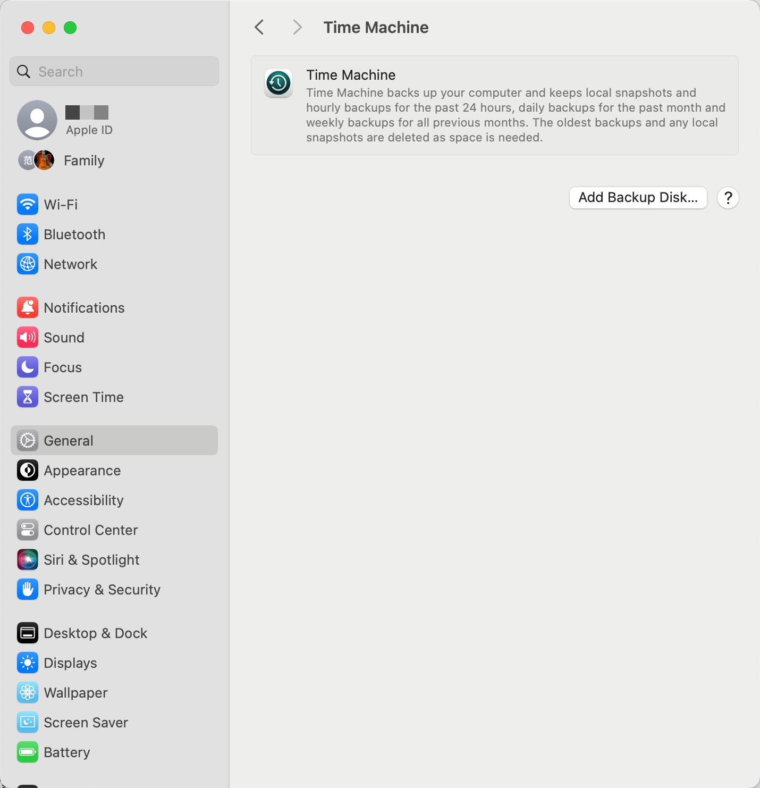
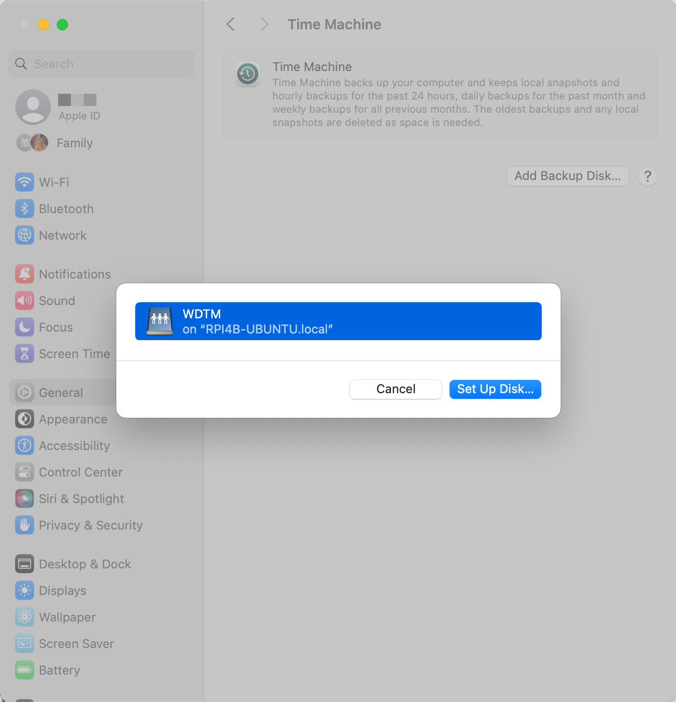
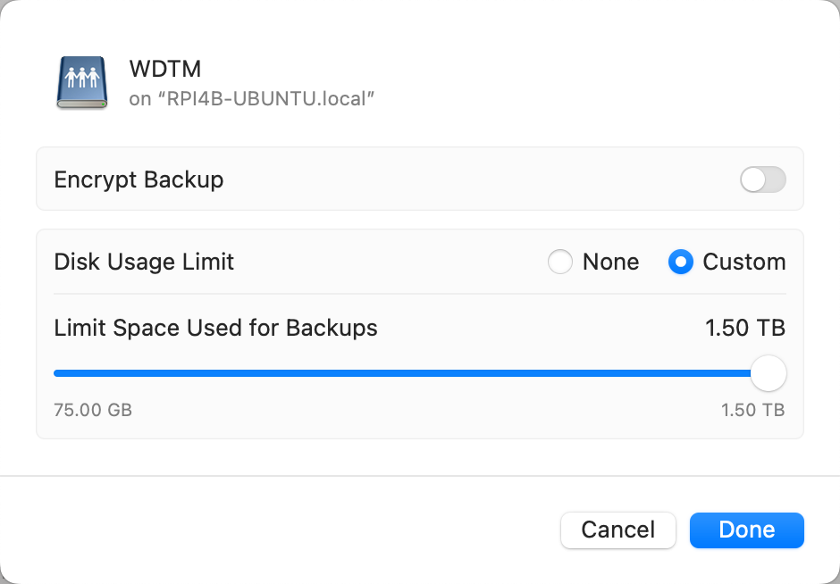
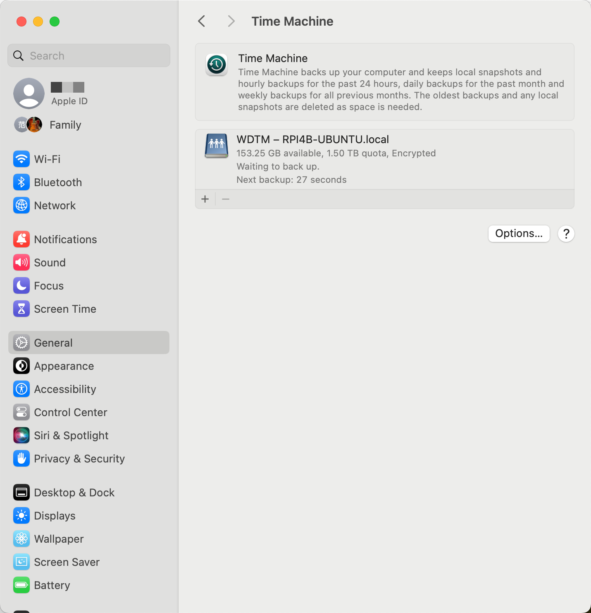

本文梳理了为树莓派 RPI4B/Ubuntu 外挂硬盘配置 samba 局域网共享服务，并将其中一个分区作为 macOS TM 备份分区，实现局域网无线备份。

<!-- more -->

## disk info

2T 的 WD 硬盘之前格式化为 macExt 格式，其中 1.5T 的 sda2 为 macOS 备份分区，0.5T 的 sda3 为普通分区。

可使用 [hdparm](https://manpages.ubuntu.com/manpages/noble/en/man8/hdparm.8.html) 命令获取或设置硬盘信息（get/set SATA/IDE device parameters），参考 [Master the Linux 'hdparm' Command: A Comprehensive Guide](https://hopeness.medium.com/master-the-linux-hdparm-command-a-comprehensive-guide-73214ba71219)。

也可使用 udev/udevadm 命令管理配置和查看设备相关信息：

- [udev - Dynamic device management](https://manpages.ubuntu.com/manpages/noble/en/man7/udev.7.html)
- [udevadm - udev management tool](https://manpages.ubuntu.com/manpages/noble/en/man8/udevadm.8.html)

### lsblk

[lsblk - list block devices](https://manpages.ubuntu.com/manpages/noble/en/man8/lsblk.8.html)

```Shell
$ lsblk
NAME        MAJ:MIN RM   SIZE RO TYPE MOUNTPOINTS
loop0         7:0    0  59.7M  1 loop /snap/core20/2186
loop1         7:1    0    59M  1 loop /snap/core20/1638
loop2         7:2    0  69.2M  1 loop /snap/core22/1125
loop3         7:3    0 131.9M  1 loop /snap/lxd/23893
loop4         7:4    0 134.1M  1 loop /snap/lxd/27054
loop5         7:5    0    34M  1 loop /snap/snapd/21185
loop6         7:6    0  35.2M  1 loop /snap/snapd/20674
sda           8:0    0   1.8T  0 disk
├─sda1        8:1    0   200M  0 part
├─sda2        8:2    0   1.4T  0 part
└─sda3        8:3    0 465.6G  0 part
mmcblk0     179:0    0  59.5G  0 disk
├─mmcblk0p1 179:1    0   256M  0 part /boot/firmware
└─mmcblk0p2 179:2    0  59.2G  0 part /
```

!!! note "blkid"

    [blkid - locate/print block device attributes](https://manpages.ubuntu.com/manpages/noble/en/man8/blkid.8.html)

    执行 `sudo blkid` 可以查看硬盘块设备 id 信息，包括 LABEL、UUID 和 TYPE（文件系统类型）。

### fdisk

[fdisk - manipulate disk partition table](https://manpages.ubuntu.com/manpages/noble/en/man8/fdisk.8.html)

- `-l` / `--list`: List the partition tables for the specified devices and then exit.

```Shell
$ sudo fdisk -l

...

Device          Start        End    Sectors   Size Type
/dev/sda1          40     409639     409600   200M EFI System
/dev/sda2      409640 2930008111 2929598472   1.4T Apple HFS/HFS+
/dev/sda3  2930270256 3906701271  976431016 465.6G Apple HFS/HFS+
```

## mount disk

> 关于 mount 命令用法，参考 [mount - mount a filesystem](https://manpages.ubuntu.com/manpages/noble/en/man8/mount.8.html)。

创建挂载点目录：

```Shell
$ sudo mkdir /media/WDHD

$ ls -l /media/
total 4
drwxr-xr-x 2 root root 4096 Apr  7 03:22 WDHD
```

修改挂载点目录的所有人为当前用户（组）：

```Shell
$ sudo chown pifan:ubuntu /media/WDHD

$ ls -l /media/
total 4
drwxr-xr-x 2 pifan ubuntu 4096 Apr  7 03:22 WDHD
```

挂载外接硬盘的 sda3 分区：

```Shell
# sudo mount /dev/sda3 /media/WDHD
$ sudo mount -o uid=pifan,gid=ubuntu /dev/sda3 /media/WDHD
```

!!! note "uid/gid"

    执行 `id` 命令可查看当前用户的 uid/gid。
    mount 需指定和 mkdir 创建的挂载点目录一致的 uid/gid。
    如不指定，默认加载 uid/gid=99，无写权限，需要 chmod 或 chown。

执行 [df](https://manpages.ubuntu.com/manpages/noble/en/man1/df.1.html)（report file system space usage）命令查看挂载的文件设备使用情况：

```Shell
$ df -hT
Filesystem     Type     Size  Used Avail Use% Mounted on
tmpfs          tmpfs    781M  5.7M  776M   1% /run
/dev/mmcblk0p2 ext4      59G   14G   43G  25% /
tmpfs          tmpfs    3.9G     0  3.9G   0% /dev/shm
tmpfs          tmpfs    5.0M     0  5.0M   0% /run/lock
/dev/mmcblk0p1 vfat     253M  138M  115M  55% /boot/firmware
tmpfs          tmpfs    781M  4.0K  781M   1% /run/user/1000
/dev/sda3      hfsplus  466G  201G  265G  44% /media/WDHD
```

### test writability

最古朴的测验方式是尝试在外挂硬盘上创建一个文件夹，如果提示“Read-only file system”说明只读：

```Shell
$ mkdir /media/WDHD/test
$ mkdir: cannot create directory ‘/media/WDHD/test’: Read-only file system
```

参考 Server Fault 上的陈年老铁 [linux - Determine if filesystem or partition is mounted RO or RW via Bash Script?](https://serverfault.com/questions/193971/determine-if-filesystem-or-partition-is-mounted-ro-or-rw-via-bash-script)，其中提供了更现代化和优雅的测试方式。

```Shell
$ grep 'sda[2,3]' /proc/mounts
/dev/sda3 /media/WDHD hfsplus ro,nosuid,nodev,relatime,umask=22,uid=1000,gid=1000,nls=utf8 0 0

$ [ -w /media/WDHD ] && echo "rw" || echo "ro"
ro
```

### install hfsprogs

参考 [mount - How to read and write HFS+ journaled external HDD in Ubuntu without access to OS X? - Ask Ubuntu](https://askubuntu.com/questions/332315/how-to-read-and-write-hfs-journaled-external-hdd-in-ubuntu-without-access-to-os) 和 [How to mount a HFS partition in Ubuntu as Read/Write?](https://www.racoonlab.com/2021/04/how-to-mount-a-hfs-partition-in-ubuntu-as-read-write/)。

执行以下命令安装 hfsprogs（mkfs and fsck for HFS and HFS+ file systems）：

```Shell
$ sudo apt-get install hfsprogs -y
```

执行以下命令重新加载硬盘：

```Shell
$ sudo mount -t hfsplus -o remount,force,rw /media/WDHD
```

或者卸载后执行以下命令加载硬盘：

```Shell
$ sudo umount /media/WDHD/
$ sudo mount -t hfsplus -o force,rw,uid=pifan,gid=ubuntu /dev/sda3 /media/WDHD
```

重新执行 `mkdir /media/WDHD/test` 创建文件夹成功。

如果之前有非正常操作，如暴力插拔或断电重启，系统检测到上一次磁盘没有正常卸载，也会挂载为只读。

```Shell title="/var/log/syslog"
5934 Apr  7 04:13:48 rpi4b-ubuntu kernel: [   50.657465] hfsplus: Filesystem was not cleanly unmounted, running fsck.hfsplus is recommended.  mounting read-only.

7258 Apr  7 04:22:20 rpi4b-ubuntu kernel: [  457.863826] hfsplus: filesystem was not cleanly unmounted, running fsck.hfsplus is recommended.  leaving read-only.
7259 Apr  7 04:22:52 rpi4b-ubuntu systemd[1]: media-WDHD.mount: Deactivated successfully.
```

分区损坏甚至导致 [无法挂载](https://juejin.cn/post/7065592541206282253)，此时可执行 `sudo fsck.hfsplus /dev/sda3` 命令检查磁盘状态，尝试修复。

!!! abstract "man fsck"

    === "macOS"

        `fsck` – filesystem consistency check and interactive repair
        It should be noted that fsck is now essentially a wrapper that invokes other `fsck_XXX` utilities as needed.

    === "ubuntu"

        `fsck` - check and repair a Linux filesystem
        In actuality, fsck is simply a front-end for the various filesystem checkers (fsck.fstype) available under Linux.

fsck.hfsplus 检查的结果一般有以下三种：

=== "OK"

    ** The volume WDHD appears to be OK.

=== "repaired successfully"

    ** The volume WDHD was repaired successfully.

=== "repaired unsuccessfully"

    ```Shell
    ** Checking extended attributes file.
       Keys out of order
    (8, 5)
    ** Rebuilding extended attributes B-tree.
    ** The volume WDHD could not be repaired.
    ```

如果检查结果是前两种，可尝试 remount 或 umount/mount 重新挂载，正常的可写性检测结果如下：

```Shell
$ grep 'sda[2,3]' /proc/mounts
/dev/sda3 /media/WDHD hfsplus rw,relatime,umask=22,uid=1000,gid=1000,nls=utf8 0 0

$ [ -w /media/WDHD ] && echo "rw" || echo "ro"
rw
```

如果是第三种修复失败（repair failure）的情况，尝试按照 [Force repair of external hfsplus HD](https://ubuntuforums.org/showthread.php?t=1632718)，抢救失败！

请尽快拷贝数据备份，考虑使用 macOS 自带的 [diskutil/Disk Utility.app](https://qizhanming.com/blog/2021/12/13/how-to-use-diskutil-format-flash-disk-on-macos) 或其他磁盘修复工具对分区重新格式化。

### config mount in fstab

> 关于 fstab 命令，参考 [Ubuntu Manpage: fstab - static information about the filesystems](https://manpages.ubuntu.com/manpages/noble/en/man5/fstab.5.html)、[Fstab - Community Help Wiki](https://help.ubuntu.com/community/Fstab) 和 [An introduction to the Linux /etc/fstab file](https://www.redhat.com/sysadmin/etc-fstab)。

!!! abstract "what is fstab?"

    The filesystem table, aka fstab, contains descriptive information about the filesystems the system can mount.

编辑文件 `sudo vim /etc/fstab`，其条目格式（syntax of a fstab entry）如下：

```Shell
[Device] [Mount Point] [File System Type] [Options] [Dump] [Pass]
```

第 1 列可以为 UUID（PARTUUID？）、LABEL、Network ID（samba: //server/share）和 Device（/dev/sda3，not recommended）。
由于 UUID 可能会变，故下面采用 LABEL。

参考 [linux mint - HFS+ file system being mounted as read-only](https://unix.stackexchange.com/questions/452062/hfs-file-system-being-mounted-as-read-only) 和 [ubuntu - How to Mount HFS+ drive as read-write on startup](https://unix.stackexchange.com/questions/639476/how-to-mount-hfs-drive-as-read-write-on-startup)，在 fstab 中加入启动加载项：

```Shell title="/etc/fstab"
LABEL=WDHD /media/WDHD auto uid=1000,gid=1000,nosuid,nodev,nofail,x-gvfs-show,force,rw 0 0
```

`sudo reboot` 重启，成功挂载为 rw。

!!! note "must disableJournal for HFS+ Volume?"

    [Fstab - Community Help Wiki](https://help.ubuntu.com/community/Fstab) 中的 File System Specific Examples 部分有提到 HFS: 
    if you want to write data on this partition, you **must** disable the journalization of this partition with `diskutil` under Mac OS.

    关于 Hard Drive Journaling 参考以下网帖：

    - [What is Mac Hard Drive Journaling and why it is important to have?](https://www.macintosh-data-recovery.com/blog/mac-hard-drive-journaling/)
    - [Disabling Journalling for external drive](https://forums.macrumors.com/threads/disabling-journalling-for-external-drive.2019865/)
    - [Can not disable external drive Journaling](https://discussions.apple.com/thread/7789814?sortBy=best)

    我这里并未执行 `diskutil disableJournal /Volumes/WDHD`，具体不详。

## config samba for WDHD

### install samba

samba - Server to provide AD and SMB/CIFS services to clients

执行以下命令安装 samba：

```Shell
$ sudo apt install samba -y
$ sudo apt install samba-vfs-modules -y
```

1. `samba -V`: 查看软件版本；
2. `samba --help`：查看帮助（usage）；
3. `man samba`：查看帮助手册（manual）；

```Shell
$ samba -V
Version 4.15.13-Ubuntu
```

### config samba

Samba配置文件通常在 /etc/samba/ 路径下：

```Shell
$ ls -l /etc/samba/
total 20
-rw-r--r-- 1 root root    8 Jan  5 21:23 gdbcommands
-rw-r--r-- 1 root root 8950 Apr  7 05:00 smb.conf
drwxr-xr-x 2 root root 4096 Jan  5 21:23 tls
```

编辑 Samba 配置文件：

```Shell
$ sudo vim /etc/samba/smb.conf
```

在配置文件底部添加如下配置（注意请移除行尾注释）：

```Shell
[WDHD]
    # 共享描述
    comment = WD - Hard Disk
    # 共享目录（mount point）
    path = /media/WDHD
    # sudo smbpasswd -a pifan 创建共享用户密码
    valid users = pifan
    # 可读写
    browseable = yes
    read only = no
    writeable = yes
    # 不允许 guest 账户访问
    public = no
    guest ok = no
    # 客户端上传文件的默认权限
    create mask = 0777
    # 客户端创建目录的默认权限
    directory mask = 0777
```

### smbpasswd

配置完毕后执行 `sudo smbpasswd -a pifan` 来设置用户名密码。

!!! note "关于 Samba 账户"

    Samba 需要 Linux 账户才能使用，可以使用 已有账户 或 创建新用户。虽然用户名可以和 Linux 系统共享，但 Samba 使用的是单独的密码管理。

设置完毕后重启 Samba 服务：`sudo samba restart` 或 `sudo systemctl restart smbd`。

执行 `systemctl status smbd`（或 smbd.service）可查看 samba 服务状态。

### test samba

局域网 macOS 中打开 Finder，选择 菜单栏–前往–连接服务器（或者直接 Command + K），在弹出的窗口中输入 `smb://树莓派的IP地址` 后选择 「连接–输入设置」 的账户和密码后就能访问了。

```Shell
smb://192.168.0.202/
smb://rpi4b-ubuntu.local/
smb://rpi4b-ubuntu.local/WDHD
```

[How to Mount SMB Share from Command Line on Mac](https://osxdaily.com/2023/02/13/mount-smb-share-command-line-mac/)

```Shell
# 创建挂载点
$ mkdir $HOME/WDHD

# 挂载samba
# mount_smbfs is alias of mount -t smbfs
$ mount -t smbfs //pifan@rpi4b-ubuntu.local/WDHD $HOME/WDHD
Password for rpi4b-ubuntu.local:

# 卸载samba
$ umount $HOME/WDHD
```

## config samba for WDTM

WD 硬盘的 sda3 分区是普通分区，挂载后局域网通过 smb 协议访问可直接读写。

sda2 分区之前为 macOS 备份分区，每次想要备份，都要插拔磁盘。

这里将其挂载到树莓派，配置 samba 共享为局域网无线备份。

!!! danger "直插备份盘迁移为samba无线备份的风险预警"

    直插备份盘改为局域网外挂磁盘配置samba共享无线备份，可能会破坏之前备份盘的元数据，导致无法识别旧的备份数据（Backups.backupdb）。
    参考 [Time Machine Notes](https://gist.github.com/martian111/e0d9885004eb56fd6abf3d1ba7671737) 中提供的 Migration from External HDD to Samba 方案，做好数据迁移的前置工作。
    生命不止，折腾不息。硬盘有价，数据无价。“季文子三思而后行”，老子曰“知止不殆，可以长久”。
    ---
    此框大约浓缩了博主数年累积 1T 的血与泪 😱

先创建挂载点，将该分区挂载为 `/media/WDTM`：

```Shell
# 1. 创建挂载点目录
$ sudo mkdir /media/WDTM

$ ls -l /media/
total 0
drwxrwxr-x 1 pifan ubuntu 24 Apr  7 04:23 WDHD
drwxrwxr-x 1 root root 21 Apr  7 10:46 WDTM

# 2. 修改挂载点目录的所有人为当前用户（组）：
$ sudo chown pifan:ubuntu /media/WDTM

$ ls -l /media/
total 0
drwxrwxr-x 1 pifan ubuntu 24 Apr  7 04:23 WDHD
drwxrwxr-x 1 pifan ubuntu 21 Apr  7 10:46 WDTM

# 3. 挂载外接硬盘的 sda2 分区
$ sudo mount -t hfsplus -o force,rw,uid=pifan,gid=ubuntu /dev/sda2 /media/WDTM
```

挂载成功后，查看挂载点及其目录内容：

```Shell
$ df -h
Filesystem      Size  Used Avail Use% Mounted on
tmpfs           781M  5.2M  776M   1% /run
/dev/mmcblk0p2   59G   14G   42G  26% /
tmpfs           3.9G     0  3.9G   0% /dev/shm
tmpfs           5.0M     0  5.0M   0% /run/lock
/dev/mmcblk0p1  253M  138M  115M  55% /boot/firmware
tmpfs           781M  4.0K  781M   1% /run/user/1000
/dev/sda3       466G  204G  263G  44% /media/WDHD
/dev/sda2       1.4T  1.3T  135G  91% /media/WDTM

$ ls -l /media/WDTM
total 288
drwxr-xr-x  1 faner  staff   16384 Mar 16 10:38 Backups.backupdb
dr-xr-xr-x  1 faner  staff   16384 Sep  9  2017 _HF2VN~W
-rwxr-xr-x  1 faner  staff  111620 Feb 21  2017 tmbootpicker.efi
```

再为 sda2 分区挂载点 /media/WDTM 配置 samba 共享服务，供局域网内的 macOS 无线备份。

在配置文件 /etc/samba/smb.conf 的全局配置段（[global]）下增加如下设置，以禁用 SMB1 协议和支持 macOS 系统的拓展属性：

> Apple extensions ("AAPL") run under SMB2/3 protocol, make that the minimum (probably shouldn't be running SMB1 anyway...)

```Shell
[global]
    # 最小支持为 SMB2
    min protocol = SMB2
    # Apple 扩展需要支持扩展属性(xattr)
    ea support = yes
    # smb encrypt = required
```

在配置文件末尾添加 WDTM 配置：

```Shell
[WDTM]
    # 共享描述
    comment = WD - Time Machine
    # 共享目录（mount point）
    path = /media/WDTM
    # 可读写
    browseable = yes
    read only = no
    writeable = yes
    # 不允许 guest 账户访问
    public = no
    guest ok = no
    # valid users = pifan
    # create mask = 0700
    # vfs objects = fruit streams_xattr
    vfs objects = catia fruit streams_xattr
    fruit:aapl = yes
    fruit:time machine = yes
    fruit:metadata = stream
    fruit:model = MacSamba
    # 文件清理的一些配置
    fruit:veto_appledouble = no
    fruit:nfs_aces = no
    fruit:posix_rename = yes
    fruit:zero_file_id = yes
    fruit:wipe_intentionally_left_blank_rfork = yes
    fruit:delete_empty_adfiles = yes
```

设置完毕后重启 Samba 服务：`sudo systemctl restart smbd`。
执行 `systemctl status smbd` 可查看 samba 服务状态。

局域网 macOS 中打开 Finder，Command + K 输入 `smb://rpi4b-ubuntu.local/WDTM`，按照提示输入账户和密码就能访问了。

编辑文件 `sudo vim /etc/fstab`，增加开机自启动条目：

```Shell title="/etc/fstab"
LABEL=WDTM /media/WDTM auto uid=1000,gid=1000,nosuid,nodev,nofail,x-gvfs-show,force,rw 0 0
```

### set as macOS Backup Disk

系统设置中打开时间机器（Settings - General - Time Machine），点击 `Add Backup Disk...` 按钮：

<figure markdown="span">
    {: style="width:95%;height:95%"}
</figure>

点击弹出的 `WDTM on RPI4B-UBUNTU.local`：


<figure markdown="span">
    {: style="width:95%;height:95%"}
</figure>

设置 Encrypt Backup 加密密码，Disk Usage Limit 默认最大：


<figure markdown="span">
    {: style="width:95%;height:95%"}
</figure>

确认点击 Done 后，Time Machine 面板出现新添加的备份网盘 WDTM - RPI4B-UBUNTU.local：

<figure markdown="span">
    {: style="width:95%;height:95%"}
</figure>

这样，随时随地进行局域网无线备份，再也不用专门为了备份而插拔硬盘。

## refs

[Configure Samba to Work Better with Mac OS X](https://wiki.samba.org/index.php/Configure_Samba_to_Work_Better_with_Mac_OS_X)
[How to Mount Windows Share on Linux using CIFS](https://linuxize.com/post/how-to-mount-cifs-windows-share-on-linux/)

[树莓派挂载移动硬盘 | Notes](https://monsoir.github.io/Notes/RaspberryPie/raspberry-extend-storage.html)
[树莓派搭建低配版文件存储及家庭影音库 - 少数派](https://sspai.com/post/69050)
[教女朋友一样教你用树莓派和移动硬盘搭NAS - 知乎](https://zhuanlan.zhihu.com/p/456124824)

[Types of disks you can use with Time Machine on Mac](https://support.apple.com/en-hk/guide/mac-help/mh15139/mac)
[Samba and macOS Time Machine](https://www.jpatrickfulton.dev/blog/2023-06-23-samba-and-timemachine/)
[利用树莓派打造时间机器 - 少数派](https://sspai.com/post/69197)

[局域网内使用 Samba 搭建 macOS 时间机器的远程备份 - huoyanCC](https://www.cnblogs.com/huoyanCC/p/17281882.html)
[局域网内部署 SMB 服务器实现 macOS Time Machine 自动备份](https://huangxt.cn/manual/lan-macos-tmachine/)
[Linux使用SMB给macOS做无线Time Machine备份 - 知乎](https://zhuanlan.zhihu.com/p/628939584)
