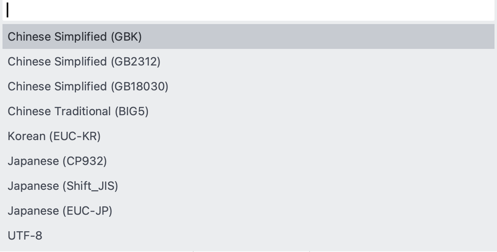
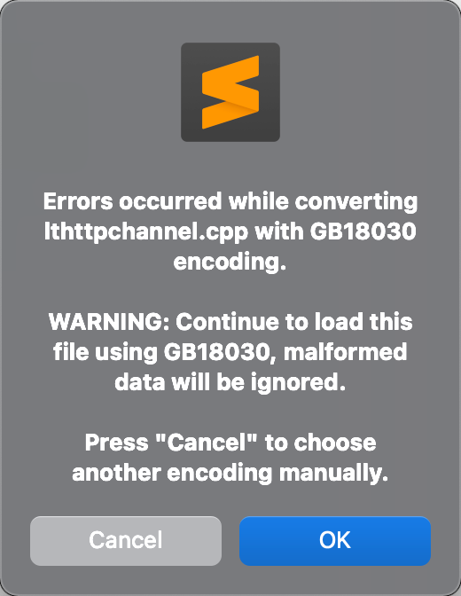

linux 下文件编码格式转换相关的命令简介。

<!-- more -->

## 字符集编码

### GB2312, GBK & GB18030

[关于GBK、GB2312、UTF8](http://csumissu.iteye.com/blog/1090053)  
[GB2312、GBK、GB18030 这几种字符集的主要区别是什么？](https://www.zhihu.com/question/19677619)  

[常用字符集编码详解](https://blog.csdn.net/zhoubl668/article/details/6914018)  
[ASCII，ISO8859-1，GBK，GB18030，Unicode，UTF-8详解](https://blog.csdn.net/lxwalaz1s1s/article/details/88629318)  

GB2312 是 GBK 的子集，GBK 是 GB18030 的子集。


### UTF-8 BOM

BOM（Byte Order Mark），意为字节序标记。

BOM 在 UTF-16 中用来表示高低字节序列。在字节流之前有 BOM 表示采用低字节序列（低字节在前面）。

在 [UCS](https://en.wikipedia.org/wiki/Universal_Coded_Character_Set)（[THE UNIVERSAL CHARACTER SET](http://www.open-std.org/CEN/TC304/guidecharactersets/guideannexb.html)）编码中有一个叫做 "ZERO WIDTH NO-BREAK SPACE" 的字符，它的编码是 **`FE FF`**。而 `FF FE` 在 UCS 中是不存在的字符，所以不应该出现在实际传输中。

UCS 规范建议我们在传输字节流前，先传输字符 "ZERO WIDTH NO-BREAK SPACE"。

- 如果收到 `FE FF`，就表明这个字节流是 `Big-Endian` 的；  
- 如果收到 `FF FE`，就表明这个字节流是 `Little-Endian` 的。

因此，字符 "ZERO WIDTH NO-BREAK SPACE" 又被称作 **BOM**。

---

UTF-8 以字节为编码单元，没有字节序的问题，故 UTF-8 有无 BOM 都可以。UTF-8 不需要 BOM 来表明字节顺序，但可以用 BOM 来表明编码方式。

字符 "ZERO WIDTH NO-BREAK SPACE" 的 UTF-8 编码是 **`EF BB BF`**，所以如果接收者收到以 `EF BB BF` 开头的字节流，就知道这是 UTF-8 编码了。

Windows 就是使用 BOM 来标记文本文件的编码方式的。

> 使用 Sublime Text 3 打开文件，通过菜单 `File | Save with Encoding` 可以选择设置保存编码为 [`UTF8 with BOM`](https://stackoverflow.com/questions/21289157/set-encoding-of-file-to-utf8-with-bom-in-sublime-text-3)。

[UCS-2 and UTF-8](https://www.ibm.com/support/knowledgecenter/en/ssw_aix_71/com.ibm.aix.nlsgdrf/ucs-2_utf-8.htm)  

[UTF8 带BOM和不带BOM](http://www.cnblogs.com/yongssu/p/4926506.html)  
[UTF8 with BOM 与 UTF8 without BOM](http://www.cnblogs.com/zhongru_tu/archive/2008/04/11/1147792.html)  
[UTF-8 and UTF-8 without BOM](http://blog.csdn.net/LJL1603/article/details/4303971)  
[⎡带 BOM 的 UTF-8⎦ 和 ⎡无 BOM 的 UTF-8⎦](http://www.zhihu.com/question/20167122)  

### 中文显示乱码问题

Xcode 代码文档的默认编码通常是中英文混排的 `No Explicit Encoding`。  
但老版本的 Xcode 对带 BOM 头的 UTF8 文件编码无法识别，使用了 GBK 编码的文件在 Xcode 下也无法识别的，从而导致 [Xcode 下的中文显示可能乱码](http://linyehui.me/2014/07/09/convert-gbk-to-utf8-on-mac/)。

VS2015 只支持带 BOM 的 UTF-8，否则无法识别其中的中文部分；XCode 能够直接打开和编辑 `UTF-8 with BOM` 编码的文件。因此，**[`UTF-8 with BOM`](http://zplutor.github.io/2017/04/02/the-most-compatible-text-encoding-between-visual-studio-and-xcode/)** 是目前跨平台开发兼容性最好的编码选择。

遗憾的是，两款 IDE 都不能直接创建这种编码的文件，只能在创建之后再手工或借助第三方编辑工具转换。  

> [解决Visual Studio 2005显示中文乱码](http://blog.csdn.net/kevinojt/article/details/2009619)  
> [解决VS2008生成的文件在XCode下中文乱码](http://blog.csdn.net/ani_di/article/details/6657341)  
> [使用Xcode打开Winnows下C文件中文乱码问题解决](https://www.jianshu.com/p/b5441c8f1847)  
> [Visual Studio 2015 中如何使文件默认保存为 UTF - 8 编码格式？](https://www.zhihu.com/question/37252051)  

## 查看文件编码

[How do I determine file encoding in OSX?](https://stackoverflow.com/questions/539294/how-do-i-determine-file-encoding-in-osx)  
[How to Determine File Type & Encoding from Command Line in Mac OS X](http://osxdaily.com/2015/08/11/determine-file-type-encoding-command-line-mac-os-x/)  
[linux下查看文件编码及修改编码](http://blog.csdn.net/jnbbwyth/article/details/6991425)  

### file 命令

macOS Bash Shell 内置的 `file` 命令可以用来打印文件类型信息。

```Shell
pi@raspberrypi:~ $ man file

FILE(1)                                         BSD General Commands Manual                                        FILE(1)

NAME
     file — determine file type

SYNOPSIS
     file [-bcdEhiklLNnprsvzZ0] [--apple] [--extension] [--mime-encoding] [--mime-type] [-e testname] [-F separator]
          [-f namefile] [-m magicfiles] [-P name=value] file ...
     file -C [-m magicfiles]
     file [--help]

DESCRIPTION
     This manual page documents version 5.30 of the file command.

     file tests each argument in an attempt to classify it.  There are three sets of tests, performed in this order:
     filesystem tests, magic tests, and language tests.  The first test that succeeds causes the file type to be printed.
```

#### 使用 file 命令

执行 file 命令，查看当前目录下 include 和 src 子目录下的文件属性信息：

```Shell
$ file include/* src/*
include/CheckPCIf.h:      C++ source text, UTF-8 Unicode text
include/UtilcFunctions.h: C++ source text, ASCII text
include/WifiPhotoIf.h:    C++ source text, ISO-8859 text
include/liteif.h:         C++ source text, ISO-8859 text, with CRLF line terminators
include/litelog.h:        c program text, UTF-8 Unicode (with BOM) text
include/litenet.h:        c program text, ASCII text, with CRLF, LF line terminators
include/litestd.h:        c program text, ASCII text, with CRLF line terminators
include/litetime.h:       c program text, ASCII text, with CRLF line terminators
src/CheckPC:              directory
src/FileHash:             directory
src/WiFiPhoto:            directory
src/base:                 directory
src/http:                 directory
src/liteafx.h:            C++ source text, ASCII text, with CRLF, LF line terminators
src/liteconststr.cpp:     ASCII text, with CRLF line terminators
src/liteconststr.h:       c program text, ASCII text, with CRLF line terminators
src/litetransfer.cpp:     C++ source text, ISO-8859 text, with CRLF line terminators
src/litetransfer.h:       C++ source text, ASCII text, with CRLF line terminators
src/sink.h:               C++ source text, ASCII text, with CRLF, LF line terminators
src/tcprelaychannel:      directory
src/transfer:             directory
src/tuple.h:              C++ source text, ISO-8859 text, with CRLF line terminators
```

> 包括 UTF8 编码的 with BOM 信息。

带 `-I` 选项执行 `file -I filename` 将输出 MIME 类型信息：

```Shell
$ file -I include/*
include/CheckPCIf.h:      text/x-c++; charset=utf-8
include/UtilcFunctions.h: text/x-c++; charset=us-ascii
include/WifiPhotoIf.h:    text/x-c++; charset=iso-8859-1
include/liteif.h:         text/x-c++; charset=iso-8859-1
include/litelog.h:        text/x-c; charset=utf-8
include/litenet.h:        text/x-c; charset=us-ascii
include/litestd.h:        text/x-c; charset=us-ascii
include/litetime.h:       text/x-c; charset=us-ascii
```

查看单个文件时，file 命令设置 `-b`（--brief）不显示文件名：

```
$ file -b include/WifiPhotoIf.h
C++ source text, ISO-8859 text

$ file -bI include/WifiPhotoIf.h
text/x-c++; charset=iso-8859-1
```

从 `file include/* src/*` 输出结果看，src 下存在多级子目录，而 file 命令只能通配 src 目录下的文件，无法穿越子目录。  
`file *` 通配当前目录，相当于 find 指定了 -maxdepth 1。若想递归查找指定目录及其子目录下的所有文件，find 默认不指定 maxdepth 即可。

```
$ find include src -type f | xargs file | tee include_src-file.log
```

查看 `include_src-file.log` 可知，总共有四大类编码格式：

1. ASCII text  
2. UTF-8 Unicode  
3. ISO-8859 text  
4. Non-ISO extended-ASCII text  

#### 过滤指定编码的文件

过滤出当前目录下文件编码为 `ISO-8859` 的文件信息：

```Shell
$ file * | grep -i 'ISO-8859'
build.bat:              DOS batch file text, ISO-8859 text, with CRLF line terminators
```

调用 find 递归查找当前目录及其子目录下的所有文件，并过滤出编码为 `ISO-8859` 的文件：

```
find . -type f -exec file {} \; | grep -i 'ISO-8859'
find . -type f | xargs file | grep -i 'ISO-8859'
```

过滤出 incldue 目录下文件编码为 `ISO-8859` 和 `Non-ISO` 的文件：

```
$ file include/* | grep -i 'ISO-8859\|Non-ISO'
include/WifiPhotoIf.h:    C++ source text, ISO-8859 text
include/liteif.h:         C++ source text, ISO-8859 text, with CRLF line terminators
```

递归查找 include 和 src 子目录下编码为 `ISO-8859` 和 `Non-ISO` 的文件：

```
find include src -type f -exec file {} \; | grep -i 'ISO-8859\|Non-ISO'
find include src -type f | xargs file | grep -i 'ISO-8859\|Non-ISO'
```

### enca 命令

`enca` 命令可查看、转换文件的编码。

#### 安装 enca

macOS 通过包管理器 brew 可搜索安装 enca 工具包：

```Shell
# 查找 enca
ifan@FAN-MC1:~|$ brew search enca
==> Searching local taps...
enca
==> Searching taps on GitHub...
==> Searching blacklisted, migrated and deleted formulae...

# enca 概述
ifan@FAN-MC1:~|$ brew desc enca
enca: Charset analyzer and converter

# enca 信息
ifan@FAN-MC1:~|$ brew info enca
enca: stable 1.19 (bottled), HEAD
Charset analyzer and converter
https://cihar.com/software/enca/
Not installed
From: http://android.oa.com/homebrew-core/Formula/enca.rb

# 安装 enca
ifan@FAN-MC1:~|$ brew install enca

# 查看 enca 版本信息
faner@MBP-FAN:~|$ enca -v
enca 1.19

Features: -librecode-interface +iconv-interface +external-converter +language-detection +locale-alias +target-charset-auto +ENCAOPT 

Copyright (C) 2000-2005 David Necas (Yeti) (<yeti@physics.muni.cz>),
              2005 Zuxy Meng (<zuxy.meng@gmail.com>).

Enca is free software; it can be copied and/or modified under the terms of
version 2 of GNU General Public License, run `enca --license' to see the full
license text.  There is NO WARRANTY; not even for MERCHANTABILITY or FITNESS
FOR A PARTICULAR PURPOSE.
```

raspbian 通过包管理器 apt 可搜索安装 enca 工具包：

```Shell
# 查找 enca
pi@raspberrypi:~ $ apt-cache search enca --names-only 
enca - Extremely Naive Charset Analyser - binaries

# 查看 enca 安装包信息
pi@raspberrypi:~ $ apt-cache show enca

Description: Extremely Naive Charset Analyser - binaries
 Enca is an Extremely Naive Charset Analyser. It detects the character set and
 the encoding of text files and can also convert them to other encodings using
 either a built-in converter or external libraries and tools like libiconv,
 librecode, or cstocs.

# 安装 enca
pi@raspberrypi:~ $ sudo apt-get install enca

# 查看 enca 版本信息
pi@raspberrypi:~ $ enca -v

```

#### 使用 enca 命令

用 enca 命令检测文件编码信息：

```Shell
# -f, --human-readable
$ enca -L zh_CN include/* src/*
include/CheckPCIf.h: Universal transformation format 8 bits; UTF-8
include/UtilcFunctions.h: 7bit ASCII characters
include/WifiPhotoIf.h: Unrecognized encoding
include/liteif.h: Simplified Chinese National Standard; GB2312
  CRLF line terminators
include/litelog.h: Universal transformation format 8 bits; UTF-8
include/litenet.h: 7bit ASCII characters
  Mixed line terminators
include/litestd.h: 7bit ASCII characters
  CRLF line terminators
include/litetime.h: 7bit ASCII characters
  CRLF line terminators
enca: Cannot read file `src/CheckPC': Is a directory
enca: Cannot read file `src/FileHash': Is a directory
enca: Cannot read file `src/WiFiPhoto': Is a directory
enca: Cannot read file `src/base': Is a directory
enca: Cannot read file `src/http': Is a directory
src/liteafx.h: 7bit ASCII characters
  Mixed line terminators
src/liteconststr.cpp: 7bit ASCII characters
  CRLF line terminators
src/liteconststr.h: 7bit ASCII characters
  CRLF line terminators
src/litetransfer.cpp: Simplified Chinese National Standard; GB2312
  CRLF line terminators
src/litetransfer.h: 7bit ASCII characters
  CRLF line terminators
src/sink.h: 7bit ASCII characters
  Mixed line terminators
enca: Cannot read file `src/tcprelaychannel': Is a directory
enca: Cannot read file `src/transfer': Is a directory
src/tuple.h: Simplified Chinese National Standard; GB2312
  CRLF line terminators
```

`enca -m` 同 `file -I`，查看文件的 MIME 类型信息：

```
# -m, --mime-name，同 file -I
$ enca -L zh_CN -m include/*
include/CheckPCIf.h: UTF-8
include/UtilcFunctions.h: US-ASCII
include/WifiPhotoIf.h: unknown
include/liteif.h: GB2312
include/litelog.h: UTF-8
include/litenet.h: US-ASCII
include/litestd.h: US-ASCII
include/litetime.h: US-ASCII
```

```
# -i, --iconv-name
$ enca -L zh_CN -i include/*
include/CheckPCIf.h: UTF-8
include/UtilcFunctions.h: ASCII
include/WifiPhotoIf.h: ???
include/liteif.h: GBK
include/litelog.h: UTF-8
include/litenet.h: ASCII
include/litestd.h: ASCII
include/litetime.h: ASCII
```

> 无法检测 BOM 信息？

借助 cut 命令，可提取出以冒号字符为分割符号，提取文件和编码：

```
enca -L zh_CN -i include/* | cut -d ':' -f 1
enca -L zh_CN -i include/* | cut -d ':' -f 2 # 前面有空格
```

建议采用更为灵活的 awk 命令，可指定字符串（冒号空格）为分割符：

```
enca -L zh_CN -i include/* | awk -F ': ' '{print $1}'
enca -L zh_CN -i include/* | awk -F ': ' '{print $2}'
```

借助 find 命令，可以递归查找指定目录及其子目录下的所有文件，再重定向给 enca 查看编码信息：

```
$ find include src -type f | xargs enca -L zh_CN -i | tee include_src-enca.log
```

查看 `include_src-enca.log` 可知，总共有四大类编码格式：

1. ASCII  
2. UTF-8  
3. GBK  
4. ???  

`enca -m` 按 MIME 类型过滤出编码为 `GB2312` 和 `unknown` 的文件：

```
find include src -type f | xargs enca -L zh_CN -m | grep -i 'GB2312\|unknown'
```

或 `enca -i` 按 iconv-name 过滤出编码为 `GBK` 和 `???` 的文件：

```
find include src -type f | xargs enca -L zh_CN -i | grep -i 'GBK\|\?\?\?'
```

### Editor File Inspector

用 Vim 打开文件，执行底行命令 `:set fileencoding ?` 可查看当前文件编码，貌似检测不准确？

> 具体编码格式可查询关键字 encoding-names 和 encoding-values。

Sublime Text 3 默认不在状态栏显示编码格式，`~/Library/Application Support/Sublime Text 3/Packages/Default/Preferences.sublime-settings` 中默认配置如下：

```json
    // Display file encoding in the status bar
    "show_encoding": false,
```

`Preferences > Settings - Users` 打开 `~/Library/Application Support/Sublime Text 3/Packages/User/Preferences.sublime-settings`，在其中设置 

```json
    "show_encoding": true,
```

则在状态栏中将有一格显示当前文件编码格式：

 

### 特殊编码文件

以下有两个特殊编码的文件：

- `include/WifiPhotoIf.h`  
- `src/WiFiPhoto/WifiPhotoConnMgr.h`  
- `src/http/lthttpchannel.cpp`  

`file` 命令查看文件编码信息：

```
$ file include/WifiPhotoIf.h src/WiFiPhoto/WifiPhotoConnMgr.h src/http/lthttpchannel.cpp
include/WifiPhotoIf.h:            C++ source text, ISO-8859 text
src/WiFiPhoto/WifiPhotoConnMgr.h: C++ source text, Non-ISO extended-ASCII text
src/http/lthttpchannel.cpp:       c program text, Non-ISO extended-ASCII text, with CRLF line terminators
```

`enca` 命令无法识别文件编码信息：

```
$ enca -L zh_CN include/WifiPhotoIf.h src/WiFiPhoto/WifiPhotoConnMgr.h src/http/lthttpchannel.cpp
include/WifiPhotoIf.h: Unrecognized encoding
src/WiFiPhoto/WifiPhotoConnMgr.h: Unrecognized encoding
src/http/lthttpchannel.cpp: Unrecognized encoding
```

尝试用 Sublime Text 3 打开以上3个文件：

- `include/WifiPhotoIf.h`：Detected WINDOWS-1252 vs Western (Windows 1252) with 73% confidence；  
- `src/WiFiPhoto/WifiPhotoConnMgr.h`：Detected WINDOWS-1252 vs Western (Windows 1252) with 62% confidence； 

弹窗让用户自行选择可能的编码：



- 打开 `src/http/lthttpchannel.cpp` 时，弹窗提示错误：

```
Errors occurred while converting lthttpchannel.cpp with GB18030 encoding.

WARNING: Continue to load this file using GB18030, malformed data will be ignored.

Press "Cancel" to choose another encoding manually.
```



底部状态栏编码显示为 `GB18030`、`Western(Windows 1252)`，如果点击 Cancel 也会弹出上面的编码选择列表。

## 文件编码格式转换

[Visual Studio C/C++](http://zcodes.net/2016/09/29/visual-studio-cpp-encoding.html) 可以 [将新建的源码文件的编码格式自动设置成UTF8](http://blog.csdn.net/maxwoods/article/details/44828295)，或从其他格式 [更改编码格式为 UTF-8](http://blog.csdn.net/caroline_wendy/article/details/13169837)。

对于某些在 Xcode 中文乱码问题，通过右侧栏的 Text Settings | Text Encoding 选择 `Simplified Chinese(Mac OS)` 可正确显示。

当然，也可借助 Sublime Text 等第三方可视化编辑器，打开文件后对已有编码执行转换。

另外一种思路是借助 `iconv` 或 `enca` 等命令行工具实现转码。

### iconv 命令转码

> [Linux下GBK->UTF-8文件编码批量转换命令](http://blog.csdn.net/a280606790/article/details/8504133)  
> [linux 批量转换GBK到UTF-8编码的方法](http://blog.csdn.net/qq_14821541/article/details/78860018)  
> [用iconv实现的gb18030到utf-8的编码转换](http://blog.csdn.net/zhaoweikid/article/details/308676)  
> [macOS 使用 iconv 命令将 gb18030 编码转换为 utf-8 格式](http://blog.csdn.net/ft2028739/article/details/15809019)  

控制台输入 `iconv --help` 查看 iconv 命令帮助：

```
$ iconv --help
Usage: iconv [OPTION...] [-f ENCODING] [-t ENCODING] [INPUTFILE...]
or:    iconv -l

Converts text from one encoding to another encoding.

Options controlling the input and output format:
  -f ENCODING, --from-code=ENCODING
                              the encoding of the input
  -t ENCODING, --to-code=ENCODING
                              the encoding of the output

Options controlling conversion problems:
  -c                          discard unconvertible characters
  --unicode-subst=FORMATSTRING
                              substitution for unconvertible Unicode characters
  --byte-subst=FORMATSTRING   substitution for unconvertible bytes
  --widechar-subst=FORMATSTRING
                              substitution for unconvertible wide characters

Options controlling error output:
  -s, --silent                suppress error messages about conversion problems

Informative output:
  -l, --list                  list the supported encodings
  --help                      display this help and exit
  --version                   output version information and exit

Report bugs to <bug-gnu-libiconv@gnu.org>.
```

`iconv` 命令默认将转码结果输出到控制台（stdout）上。

- 新版 iconv（raspbian 下的 2.24）可通过 `-o` 选项指定输出文件（outputfile）；  
- 旧版 iconv（macOS 下的 1.11）命令不支持 `-o` 选项，则可使用 `>` 将转码结果重定向到指定文件。  

iconv 命令主要由 `-f` 和 `-t` 两个选项，指定原始编码和目标转码：

- `-f` ENCODING, --from-code=ENCODING : the encoding of the input
- `-t` ENCODING, --to-code=ENCODING : the encoding of the output

```Shell
iconv -f GBK -t UTF-8 file1 -o file2
iconv -f GB18030 -t UTF-8 file1 -o file2

# macOS 下不支持 -o 选项，只能重定向
iconv -f GB2312 -t UTF-8 file1 > file2
```

转换前 `include/` 目录下的文件编码信息如下：

```Shell
# 转换前
$ file include/*
include/CheckPCIf.h:      C++ source text, UTF-8 Unicode text # 中英文
include/UtilcFunctions.h: C++ source text, ASCII text # 纯英文
include/WifiPhotoIf.h:    C++ source text, ISO-8859 text # 中英文
include/liteif.h:         C++ source text, ISO-8859 text, with CRLF line terminators # 中英文
include/litelog.h:        c program text, UTF-8 Unicode (with BOM) text # 纯英文
include/litenet.h:        c program text, ASCII text, with CRLF, LF line terminators # 纯英文
include/litestd.h:        c program text, ASCII text, with CRLF line terminators # 中英文
include/litetime.h:       c program text, ASCII text, with CRLF line terminators # 纯英文

$ enca -L zh_CN include/*
include/CheckPCIf.h: Universal transformation format 8 bits; UTF-8
include/UtilcFunctions.h: 7bit ASCII characters
include/WifiPhotoIf.h: Unrecognized encoding
include/liteif.h: Simplified Chinese National Standard; GB2312
  CRLF line terminators
include/litelog.h: Universal transformation format 8 bits; UTF-8
include/litenet.h: 7bit ASCII characters
  Mixed line terminators
include/litestd.h: 7bit ASCII characters
  CRLF line terminators
include/litetime.h: 7bit ASCII characters
  CRLF line terminators
```

执行 `iconv` 转换编码为 UTF-8：

```Shell
$ mkdir include2
# 转换
$ iconv -f GB18030 -t UTF-8 include/CheckPCIf.h > include2/CheckPCIf.h
iconv: include/CheckPCIf.h:5:24: cannot convert
$ iconv -f GB18030 -t UTF-8 include/UtilcFunctions.h > include2/UtilcFunctions.h
$ iconv -f GB18030 -t UTF-8 include/WifiPhotoIf.h > include2/WifiPhotoIf.h
$ iconv -f GB18030 -t UTF-8 include/liteif.h > include2/liteif.h
$ iconv -f GB18030 -t UTF-8 include/litelog.h > include2/litelog.h
iconv: include/litelog.h:1:2: cannot convert
$ iconv -f GB18030 -t UTF-8 include/litenet.h > include2/litenet.h
$ iconv -f GB18030 -t UTF-8 include/litestd.h > include2/litestd.h
$ iconv -f GB18030 -t UTF-8 include/litetime.h > include2/litetime.h
```

> CheckPCIf.h 和 litelog.h 本身已是 UTF-8 Unicode 编码，部分字元无法转换？

转换成功后，重新执行 `file` 和 `enca` 命令：

```Shell
# 转换后
$ file include2/*
include2/CheckPCIf.h:      UTF-8 Unicode text
include2/UtilcFunctions.h: C++ source text, ASCII text
include2/WifiPhotoIf.h:    C++ source text, UTF-8 Unicode text
include2/liteif.h:         C++ source text, UTF-8 Unicode text, with CRLF line terminators
include2/litelog.h:        UTF-8 Unicode text, with no line terminators
include2/litenet.h:        c program text, ASCII text, with CRLF, LF line terminators
include2/litestd.h:        c program text, ASCII text, with CRLF line terminators
include2/litetime.h:       c program text, ASCII text, with CRLF line terminators

$ enca -L zh_CN include/*
include2/CheckPCIf.h: Universal transformation format 8 bits; UTF-8
include2/UtilcFunctions.h: 7bit ASCII characters
include2/WifiPhotoIf.h: Universal transformation format 8 bits; UTF-8
include2/liteif.h: Universal transformation format 8 bits; UTF-8
  CRLF line terminators
include2/litelog.h: Universal transformation format 8 bits; UTF-8
include2/litenet.h: 7bit ASCII characters
  Mixed line terminators
include2/litestd.h: 7bit ASCII characters
  CRLF line terminators
include2/litetime.h: 7bit ASCII characters
  CRLF line terminators
```

> 貌似只有 ISO-8859 的被转码了？litelog.h 丢了 BOM?

`ASCII text`：表示纯 ASCII 编码，只有英文字符，没有中文等其他语言字符。  
当输入中文等其他语言字符后，则编码将显示为 `UTF-8 Unicode text`。  

#### [iconv 批量更改文件编码](http://blog.csdn.net/longxibendi/article/details/5889110)  

将当前目录下所有的 php 文件 `$file` 从 GB18030 转码为 utf8 文件 `$file.new`，然后将 `$file.new` 重命名为 `$file`，即覆盖源文件。

```Shell
#!/bin/bash
for file in *.php
do
    iconv -f GB18030 -t utf8 -o "$file.new" "$file" &&
    mv -f "$file.new" "$file"
done
```

也可利用 find 递归查找当前目录及其子目录下的所有 php 文件进行转码。

1. 将每个 find 结果行（文件名）读取到变量 file 中，然后 echo 打印出文件名；  
2. 紧接着将 `$file` 从 GB18030 转码为 UTF-8 文件 `$file.utf8`；  
3. 第一个 mv 命令将源文件重命名为 `*.18030` 备份；  
4. 第二个 mv 将转码文件（`*.utf8`）改名覆盖源文件。

```Shell
#!/bin/bash
find . -type f -name "*.php" | while read file;
do
   echo $file
   iconv -f GB18030 -t UTF-8 $file > ${file}.utf8
   mv $file ${file}.18030
   mv ${file}.utf8 $file
done
```

[format_converter.sh](https://gist.github.com/dedeexe/b222b932539ea373fb0c)

> iconv 命令不能直接转码覆盖源文件，只能通过 `mv -f` 强制覆盖。

[How can I make iconv replace the input file with the converted output?](https://unix.stackexchange.com/questions/10241/how-can-i-make-iconv-replace-the-input-file-with-the-converted-output)  

---

```
find include src -type f | xargs file | grep -i 'ISO-8859\|Non-ISO' | cut -d ':' -f 1 | xargs iconv -f GB18030 -t UTF-8
```

如何重定向输出 src？

```
find include src -type f | xargs file | grep -i 'ISO-8859\|Non-ISO' | cut -d ':' -f 1 | xargs -I src iconv -f GB18030 -t UTF-8 src
```

单行命令貌似不好实现，只能编写shell脚本。

### enca 命令转换

`enca -L zh_CN -x utf-8 *` 将当前目录下的所有文件转码为 UTF-8。  

如果不想覆盖，则可以执行 `enca -L zh_CN -x UTF-8 < file1 > file2`，将 file1 转换成 file2。

利用管道批量查找过滤出混合中文编码的文件：

```Shell
find include src -type f | xargs file | grep -i 'ISO-8859\|Non-ISO' | cut -d ':' -f 1
find include src -type f | xargs enca -L zh_CN -i | grep -i 'GBK\|\?\?\?' | awk -F: '{print $1}'
```

1. 利用 `find` 命令查找指定文件夹及其子目录下的所有文件；  
2. 针对查找结果集，利用 **xargs** 重定向执行 `file` 或 `enca` 命令查看编码信息；  
3. 利用 `grep` 命令过滤出编码为 ISO-8859(iso-8859)/GBK(GB2312) 的文件信息；  
4. 利用 `cut` 或 `awk` 命令对grep结果集的文件信息行以 `:` 切割提取出第一列相对路径文件名；  
5. 对相对路径文件名结果集执行 `enca -L zh_CN -x utf-8` 命令将其转码为 UTF-8。  

```Shell
find include src -type f | xargs file | grep -i 'ISO-8859\|Non-ISO' | cut -d ':' -f 1 | xargs enca -V -L zh_CN -x utf-8 | tee enca-x.log
```

### UTF8 + BOM

[Set Encoding of File to UTF8 With BOM in Sublime Text 3](https://stackoverflow.com/questions/21289157/set-encoding-of-file-to-utf8-with-bom-in-sublime-text-3)  

使用 iconv 或 enca 命令将所有 GB18030 字符都转换为 UTF8 后，再使用 Sublime Text 3 打开文件，通过菜单 File | Save with Encoding 选择 `UTF8 with BOM`：

```Shell
$ file *
UtilcFunctions.h: c program text, UTF-8 Unicode (with BOM) text
WifiPhotoIf.h:    c program text, UTF-8 Unicode (with BOM) text
liteif.h:         c program text, UTF-8 Unicode (with BOM) text
litelog.h:        c program text, UTF-8 Unicode (with BOM) text
litenet.h:        c program text, UTF-8 Unicode (with BOM) text, with CRLF line terminators
litestd.h:        c program text, UTF-8 Unicode (with BOM) text, with CRLF line terminators
litetime.h:       c program text, UTF-8 Unicode (with BOM) text, with CRLF line terminators

$ enca *
UtilcFunctions.h: Universal transformation format 8 bits; UTF-8
WifiPhotoIf.h: Universal transformation format 8 bits; UTF-8
liteif.h: Universal transformation format 8 bits; UTF-8
litelog.h: Universal transformation format 8 bits; UTF-8
litenet.h: Universal transformation format 8 bits; UTF-8
  CRLF line terminators
litestd.h: Universal transformation format 8 bits; UTF-8
  CRLF line terminators
litetime.h: Universal transformation format 8 bits; UTF-8
  CRLF line terminators
```

## Line Endings
### 回车换行

以下摘自《[我的电脑生涯（2）：ASCII码](http://blog.sina.com.cn/s/blog_4a20485e0102dr82.html)》：

> 使用过机械式英文打字机的人都知道，当一行字符快打完的时候，打字机会发出“叮”的一声铃响，提醒打字员别再不停地击键了，否则字符就打到纸外面去了。此时，打字员要用手把打字机的滑车推到最左边，这个动作称为“[**回车**](https://zh.wikipedia.org/wiki/%E5%9B%9E%E8%BD%A6%E7%AC%A6)”。  

>> **`\r`**（ASCII 码为 0x0d）：本义是光标重新回到本行开头，r 即 **r**eturn，控制字符可以写成 CR（[Carriage Return](https://en.wikipedia.org/wiki/Carriage_return)）；  

> 仅仅回车是不够的，如果此时打字员继续打字，字符就会重叠在刚才已经打过字的这一行上面，所以打字员还要用手把纸卷滚筒向前转一下，这个动作叫“[**换行**](https://zh.wikipedia.org/wiki/%E6%8F%9B%E8%A1%8C)”。  

>> **`\n`**（ASCII 码为 0x0a）：本义是光标往下一行（不一定到下一行行首），n 及 **n**ewline，控制字符可以写成 LF（[Line Feed](https://en.wikipedia.org/wiki/Newline)）。  

在计算机上编辑文本，每当按下 enter(return) 键，系统会在行末（EOL）插入不可见的结束符（invisible **Line Ending**）标记换行，同时光标自动移动到下一行首。

在非英语系国家的键盘上，回车键会用 <kbd>↵</kbd>（U+21B5、`&crarr;`）符号表示，形象直观地说明了该键的功能。

尽管回车换行这两个概念也被挪到了计算机上，但是早期存储器较贵，一些科学家认为在每行结尾加两个额外的字符来标识行末太浪费存储，加一个即可。

具体到文本编码中，不同的操作系统在敲下 enter 键时插入的不可见行末结束符有所不同。具体分为[三大流派](https://zhuanlan.zhihu.com/p/25503610)：

- 在 Windows 系统下，`\r\n` 这两个字符连在一起标识行末，本义表示回车换行；  
- 在 UNIX 类系统（包括最新的 macOS）中，换行符 `\n` 标识行末，表示光标移到下一行并回到行首；  
- 在已经退出历史舞台的 Mac OS  9 及更古，`\r` 标识行末，表示回到本行开头并往下一行。  

两大主流操作系统阵营采用不同的 Line Endings，造成的后果是：

- Unix/macOS 系统下的文件在 Windows 中打开，所有文字都会变成一行；  
- 而 Windows 下的文件在 Unix/macOS 下打开的话，在每行的结尾可能会多出一个 `^M` 符号。  

---

1. Xcode 右侧的 Line Endings：

	- macOS/Unix(LF)  
	- Classic Mac OS(CR)  
	- Windows(CRLF)  

2. 在 vim 下底行模式输入命令 `:set fileformat ?` 可查询当前文档的 EOL 格式；问号可换为 unix/dos 设置具体格式。  
3. 在终端命令行中使用 `od -A x -t xCa tuple.h` 或 `hexdump -C tuple.h`，或在 Sublime Text 下使用 hexviewer 可查看 tuple.h 文件的十六进制码，以查验行末结束符。  
4. 在 python 中（sublime text 控制台）执行 `import os;os.linesep` 可以查看行分隔符（`line separator in text files`）。  

### vim 编辑替换

在 vim 下执行 `:%s/\r//g` 可将DOS文件中的回车符 `^M` 替换为空（即删除）。  

> [Vim 中如何去掉 ^M 字符？](https://www.zhihu.com/question/22130727)  
> [vim linux下查找显示^M并且删除](http://www.cnblogs.com/juandx/p/5663064.html)  

### tr 命令

dos2unix（crlf->lf）: 

利用 `tr -s` 替换回车换行符（`\r\n`）为换行符（`\n`），仅供调试：

```
tr -s "[\r\n]" "[\n*]" < include/litestd.h
tr -s "[\015\012]" "[\012*]" < include/litestd.h
```

利用 `tr -d` 删除回车控制字符（`\r`），并输出到新文件：

```
cat include/litestd.h | tr -d '[\r]' > include/litestd2.h
tr -d '[\r]' < include/litestd.h > include/litestd2.h
tr -d "[\015]" < include/litestd.h | tee include/litestd2.h
```

### sed 替换

dos2unix（crlf->lf）

批量替换方案：`find . -type f -print0 | xargs -0 sed -i 's/^M$//'`，貌似不行。

修改为 `sed -i '' 's/\r//g' file`，对单个文件执行OK。
改为以下管接报错，尚待完善！

```
$ find include -type f -print0 | xargs -0 file | grep -i 'CRLF' | cut -d ':' -f 1 | xargs sed -i '' 's/\r//g'
sed: RE error: illegal byte sequence
```

---

unix2dos（lf->crlf）转换方案参考 [如何使用sed替换换行符？](https://www.imooc.com/wenda/detail/560901) - [腾讯云](https://cloud.tencent.com/developer/ask/137080)。

> [sed 匹配\n换行符](https://www.cnblogs.com/chenfool/p/3820029.html)  
> [sed命令如何替换换行符“\n”](https://blog.csdn.net/u011729865/article/details/71773840/)  

在 GNU 中采用 sed 解决：

```
sed ':a;N;$!ba;s/\n/\r\n/g' file
```

这将在循环中读取整个文件，然后实现 lf->crlf 替换。

1. 创建标签 `a`。  
2. 通过 `N` 指令将当前和下一行附加到模式空间；  
3. 在最后一行之前（`$!`），则跳转到标签a（`ba`）；  
    > $! 意味着不要在最后一行执行，因为应该有一个最终换行符。  
4. 通过 `s` 替换指令将整个文件（`g`标记）中的 lf 替换为 crlf。  

支持 BSD 和 macOS 的跨平台兼容sed语法：

```
sed -i -e ':a' -e 'N' -e '$!ba' -e 's/\n/\r\n/g' file
```

改为以下管接报错，尚待完善！

```
$ find include -type f -print0 | xargs -0 file | grep -v 'CRLF' | cut -d ':' -f 1 | xargs sed -i '' -e ':a' -e 'N' -e '$!ba' -e 's/\n/\r\n/g'
sed: RE error: illegal byte sequence
```

### Sublime Text 3 编辑替换

Sublime Text 的 `~/Library/Application Support/Sublime Text 3/Packages/Default/Preferences.sublime-settings`

```json
    // Determines what character(s) are used to terminate each line in new files.
    // Valid values are 'system' (whatever the OS uses), 'windows' (CRLF) and
    // 'unix' (LF only).
    "default_line_ending": "system",
    
    // Display line endings in the status bar
    "show_line_endings": false,
```

`default_line_ending`: 默认 line ending 跟随系统，macOS 下是 LF。  
`show_line_endings`: 默认不在状态栏显示当前 Line Ending，可以 `Preferences > Settings - Users` 打开 `~/Library/Application Support/Sublime Text 3/Packages/User/Preferences.sublime-settings`，在其中设置：

```json
    "show_line_endings": true,
```

底部状态栏将显示当前 Line Ending：

- Windows：Windows Line Endings(CRLF)  
- Unix：Unix Line Endings(LF)  
- CR：Mac OS 9 Line Endings(CR)  

可以点击选择切换，将 `litenet.h`,`litestd.h`,`litetime.h` 这3个文件的 Line Ending 都切换为 Unix(LF)。

[Difference between CR LF, LF and CR line break types?](https://stackoverflow.com/questions/1552749/difference-between-cr-lf-lf-and-cr-line-break-types)  

[Dealing with line endings](https://help.github.com/articles/dealing-with-line-endings/)  
[git replacing LF with CRLF](https://stackoverflow.com/questions/1967370/git-replacing-lf-with-crlf)  

[crlf.py](https://gist.github.com/jonlabelle/dd8c3caa7808cbe4cfe0a47ee4881059): Replace CRLF (windows) line endings with LF (unix) line endings in files.  

[How to Ensure Always LF not CRLF on Windows](https://intellij-support.jetbrains.com/hc/en-us/community/posts/205969644-How-to-Ensure-Always-LF-not-CRLF-on-Windows)  
