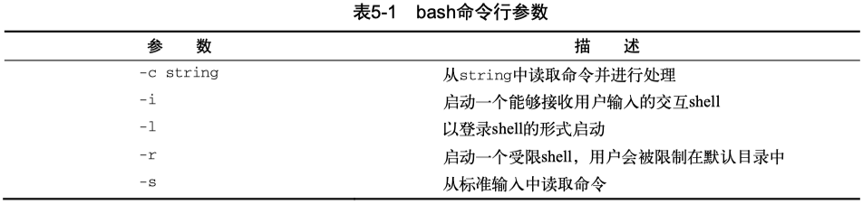

Linux 下的 Shell 编程基本概念。

<!-- more -->

## 使用多个命令

shell可以将多个命令串起来，一次执行完成。
如果想多个命令一起运行，可以把它们放在同一行中，彼此间用分号（`;`）隔开。

```Shell
[] ~ date
Mon Dec  9 22:39:22 CST 2019
[] ~ who
faner    console  Nov 29 07:00
faner    ttys000  Dec  7 07:48
faner    ttys002  Dec  7 07:48
faner    ttys004  Dec  8 07:02
faner    ttys006  Dec  9 22:39
```

两个命令写到一行执行：

```Shell
[] ~ date ; who
Mon Dec  9 22:39:40 CST 2019
faner    console  Nov 29 07:00
faner    ttys000  Dec  7 07:48
faner    ttys002  Dec  7 07:48
faner    ttys004  Dec  8 07:02
faner    ttys006  Dec  9 22:39
```

使用这种办法就能将多个命令串连在一起执行，只要不超过最大命令行字符数255就行。
用分号串联的命令之间没有逻辑依赖，还可以用 `&&` 或 `||` 将多条命令串联形成 command-lists。

对于小型脚本尚可，但它有一个很大的缺陷：每次都必须在命令提示符下输入整个命令。
可以将这些命令组合成一个简单的脚本文件，这样就不需要每次都重复输入了。
后续需要运行这些命令时，只要运行这个脚本文件就行了，以便复用。

## 创建脚本

可以把要执行的命令写入sh脚本文件中，shell 解释器会根据命令在脚本文件中的顺序解释执行。

```Shell
#!/bin/bash
# This script displays the date and who's logged on
date
who
```

### shebang

脚本首行的 [shebang](https://en.wikipedia.org/wiki/Shebang_(Unix))，一般用来告诉系统采用哪种解释器来解释运行该脚本。

在大多数 Linux 和 BSD 发行版中，env 的路径都是 [usr/bin/env](https://www.ltsplus.com/linux/shell-script-portable-with-usr-bin-env)。
shebang 的一般是以 `#!` 开头，在 `/usr/bin/env` 后面空格接解释器名称。

```Shell
#!/usr/bin/env interpreter

```

例如，.py 和 .js 文件的sha-bang 申明如下：

- python：`#!/usr/bin/env python`  
- node js：`#! /usr/bin/env node`  

在创建bash shell脚本时，第一行的 shebang，通常有以下格式为：

```Shell
#!/bin/sh
#!/bin/bash
#!/usr/bin/env sh
#!/usr/bin/env bash
```

在通常的shell脚本中，井号（`#`）用作注释行，shell会忽略脚本中的注释行，不会解释执行。
然而，shell脚本文件的第一行是个例外，`#!` 告诉系统该脚本用哪种shell来解释执行。
如果写的是zsh脚本，那么 shebang 可以写成 `#!/bin/zsh`。

`/bin/sh` 和 `/bin/bash` 一致：

```Shell
$ /bin/sh --version
GNU bash, version 3.2.57(1)-release (x86_64-apple-darwin21)
Copyright (C) 2007 Free Software Foundation, Inc.

$ /bin/bash --version
GNU bash, version 3.2.57(1)-release (x86_64-apple-darwin21)
Copyright (C) 2007 Free Software Foundation, Inc.
```

关于 #!/bin/bash 和 #!/usr/bin/env bash 这两种 shebang 的区别，可以参考以下话题：

- `#!/usr/bin/python` 与 `#!/usr/bin/env python` 的区别：[1](https://www.jianshu.com/p/96d02f07423d)，[2](https://blog.csdn.net/abcdefg90876/article/details/105445579)，[3](https://www.cnblogs.com/gne-hwz/p/8547173.html)。  
- [#!/bin/bash 和 #!/usr/bin/env bash 的区别](https://blog.csdn.net/qq_37164975/article/details/106181500)  
- [What is the difference between "#!/usr/bin/env bash" and "#!/usr/bin/bash"?](https://stackoverflow.com/questions/16365130/what-is-the-difference-between-usr-bin-env-bash-and-usr-bin-bash)  
- [Why is it better to use "#!/usr/bin/env NAME" instead of "#!/path/to/NAME" as my shebang?](https://unix.stackexchange.com/questions/29608/why-is-it-better-to-use-usr-bin-env-name-instead-of-path-to-name-as-my)  

[Bash Shebang 小结 ](https://www.cnblogs.com/sparkdev/p/9843024.html)：

1. `#!/bin/bash` 是指定解释器绝对路径的经典写法，但无法保证所有系统中的 bash 程序都安装在 /bin 目录。

    - 例如 macOS 可能通过 brew 安装了最新的 GNU bash，需要 shebang 替换成新安装的bash路径：`#!/usr/local/bin/bash`。

2. `#!/usr/bin/env bash` 不指定绝对路径，在当前环境中查找程序的默认版本，因此在不同系统上的移植性更好。

    - 可能的安全隐患：用户误创建了名称为 bash 的程序，并把它的路径添加到 PATH 变量的靠前位置，这样就会使用假 bash 来执行脚本！

3. 如果脚本调用了OS特性相关命令，只需在单一系统中执行，无需考虑兼容性，可采用第一种写法。  
4. 如果目标是面向跨多种类 Unix 系统，则脚本设计需要兼容通用，建议采用可移植性较强的写法。  

另外，sed 和 awk 都支持 `-f` 选项，从指定脚本文件中加载执行命令，也可以在 .sed 和 .awk 脚本开头指定 shebang。

- linux: `#!/bin/sed -f`，`#!/bin/awk -f`  
- macOS: `#!/usr/bin/sed -f`， `#!/usr/bin/awk -f`  

接下来就可以直接在命令行执行 `./scripts/test.sed`、`./scripts/test.awk` 来加载解释运行 sed/awk 脚本了。

### 执行权限

```
$ ./test1
bash: ./test1: Permission denied
```

快速查看一下文件权限就能找到问题所在：

```
$ ls -l test1
-rw-rw-r-- 1 user   user    73 Sep 24 19:56 test1
```

执行  `chmod +x test1`、`chmod u+x test1` 或 `chmod a+x test1`  可添加执行权限。

### 命令行参数

1. `$#`：参数个数；  
2. `$0`：相对或绝对的脚本名称；  

    - `$(dirname $0)` 取脚本相对路径；  
    - `$(basename $0)` 取纯脚本名称；  

3. `$1`、`$2`、...、`$9`，`${10}`、`${11}`、...：顺序位置参数；  

    - `${!#}` 代表最后一个参数；

4. `$@`（或 `$*`）: 所有参数；  

    - `$@` 代表参数数组，遵循索引规则和切片写法，
    - `${@:2}` 表示从索引2开始的后面的所有参数，
    - `exec "${@:2}"` 则将后面所有的参数当做命令执行。

index变量赋值索引3，则 `${!index}` 表示引用第3个参数。

```Shell
#!/bin/bash

index=3
echo "${!index}"

eval opt3="\$$index"
echo "$opt3"
```

#### \$@ 和 \$*

有时候需要抓取命令行上提供的所有参数，不需要基于变量个数 `$#` 进行遍历，而是可以基于特殊变量来解决这个问题。
`$*` 和 `$@` 这两个变量都能够在单个变量中存储所有的命令行参数，使得我们可以轻松访问所有的命令行参数。

`$*` 变量会将命令行上提供的所有参数当作一个单词保存，这个单词包含了命令行中出现的每一个参数值。也就是说，`$*` 变量会将这些参数视为一个整体，而不是多个个体。
`$@` 变量会将命令行上提供的所有参数当作同一字符串中的多个独立的单词，这样你就能够通过for遍历读取每个参数。
这两个变量的工作方式不太容易理解，通过下面的示例演绎，可以帮助我们更好地理解二者之间的区别。

> 但是在脚本中，对于参数数组的切片写法 `${*:2:3}` 和 `${@:2:3}` 是等效的，都是读取 $2 开始的3个元素。

```Shell
$ cat test11.sh

#!/bin/bash
# testing $* and $@ 
#
echo
echo "Using the \$* method: $*"
echo
echo "Using the \$@ method: $@"
```

测试结果：

```Shell
$ ./test11.sh rich barbara katie jessica

Using the $* method: rich barbara katie jessica

Using the $@ method: rich barbara katie jessica
```

从表面上看，两个变量产生了同样的输出，都显示出了所有命令行参数。

下面的例子，通过for循环遍历可以看出二者的差异。

```Shell
#!/bin/bash
# testing $* and $@
#
echo
count=1
#
for param in "$*"; do
    echo "\$* Parameter #$count = $param"
    count=$((count + 1))
done
#
echo
count=1
#
for param in "$@"; do
    echo "\$@ Parameter #$count = $param"
    count=$((count + 1))
done
```

测试结果：

```Shell
$ ./test12.sh rich barbara katie jessica

$* Parameter #1 = rich barbara katie jessica

$@ Parameter #1 = rich
$@ Parameter #2 = barbara
$@ Parameter #3 = katie
$@ Parameter #4 = jessica
```

通过使用for命令遍历这两个特殊变量，可以看到它们是如何不同地处理命令行参数的。
`$*` 变量会将所有参数当成单个参数；而 `$@` 变量会单独处理每个参数。
故通常基于 `$@` 遍历读取命令行参数。

我们再来看看下列测试程序

```Shell
#!/usr/bin/env bash

mainAt() {
  echo "mainAt param count = $#"
  count=1
  for param in "$@"; do
    echo "\$@ Parameter #$count = $param"
    count=$((count + 1))
  done
}

mainAs() {
  echo "mainAs param count = $#"
  count=1
  # for 1
  for param in $*; do
  # for 2
  # for param in "$*"; do
    echo "\$* Parameter #$count = $param"
    count=$((count + 1))
  done
}

mainAt "$@"
# mainAs 1
mainAs $*
# mainAs 2
# mainAs "$*"
```

从运行结果可知，当给函数传递 `$*` 和 for 循环中引用 `$*` 时，都没加引号，for遍历效果才符合预期。

如果给函数传递 `"$*"`加了双引号，或在for循环的 `$*` 加了双引号，那么将会被当成一个字符串，不会按空格切割数组。

> [SC2066](https://github.com/koalaman/shellcheck/wiki/SC2066): Since you double quoted this, it will not word split, and the loop will only run once.

```Shell
# mainAs 1, for 1
$ ./test-array-param.sh p q r
mainAt param count = 3
$@ Parameter #1 = p
$@ Parameter #2 = q
$@ Parameter #3 = r
mainAs param count = 3
$* Parameter #1 = p
$* Parameter #2 = q
$* Parameter #3 = r

# mainAs 2, for 1
$ ./test-array-param.sh p q r
mainAt param count = 3
$@ Parameter #1 = p
$@ Parameter #2 = q
$@ Parameter #3 = r
mainAs param count = 1
$* Parameter #1 = p
$* Parameter #2 = q
$* Parameter #3 = r

# mainAs 1, for 2
$ ./test-array-param.sh p q r
mainAt param count = 3
$@ Parameter #1 = p
$@ Parameter #2 = q
$@ Parameter #3 = r
mainAs param count = 3
$* Parameter #1 = p q r

# mainAs 2, for 2
$ ./test-array-param.sh p q r
mainAt param count = 3
$@ Parameter #1 = p
$@ Parameter #2 = q
$@ Parameter #3 = r
mainAs param count = 1
$* Parameter #1 = p q r
```

## 执行脚本

bash shell程序可使用命令行参数修改shell启动方式。下表列举了bash中常用的启动参数：



## 用户输入参数

read 指定接收变量的个数应与实际输入的参数个数一致，如果变量数量不够，剩下的数据就全部分配给最后一个变量。

### echo -n + read

unix/POSIX - [echo](https://pubs.opengroup.org/onlinepubs/9699919799/utilities/echo.html)  
FreeBSD/Darwin - [echo](https://www.freebsd.org/cgi/man.cgi?query=echo)  

linux - [echo(1)](https://man7.org/linux/man-pages/man1/echo.1.html) - [echo(1p)](https://man7.org/linux/man-pages/man1/echo.1p.html)  
debian/Ubuntu - [echo](https://manpages.debian.org/buster/coreutils/echo.1.en.html)  

[echo(1)](https://man7.org/linux/man-pages/man1/echo.1.html) - display a line of text

```
 -n    Do not print the trailing newline characte.
```

`echo -n` 不换行提示加 `read` 捕获变量：

```
#!/bin/bash

echo -n "PLS input the num (1-10): "
read num
let i=num+5
echo $i
```

### read -p

unix/POSIX - [read](https://pubs.opengroup.org/onlinepubs/9699919799/utilities/read.html)  
FreeBSD/Darwin - read is a shell builtin  

linux - [read(1p)](https://man7.org/linux/man-pages/man1/read.1p.html) - [read(2)](https://man7.org/linux/man-pages/man2/read.2.html) - [read(3p)](https://man7.org/linux/man-pages/man3/read.3p.html)  
debian/Ubuntu - [read](https://manpages.debian.org/buster/manpages-zh/read.1.zh_CN.html)  

[read(1p)](https://man7.org/linux/man-pages/man1/read.1p.html) — read a line from standard input

SYNOPSIS: `read [−r] var...`

The read utility shall read a single line from standard input.

另外一种方式更简洁，`read` 指定 `-p` 选项，提示行续接输入捕获到变量：

```
#!/bin/bash

read -p "PLS input the num (1-10): " num
let i=num+5
echo $i
```

如果 read 不指定变量，则默认放进环境变量 `REPLY` 中。

### read file or stdin

很多系统自带命令的设计时，实现了很灵活的传参机制，除了支持读取文件数据进行处理外，也可支持读取键盘输入stdin作为待处理数据。

- `xxd`: If no infile is given, standard input is read.
- `hexdump`: displays the specified files, or the standard input.
- `shasum`: With no FILE, or when FILE is -, read standard input.
- `cat` : If file is a single dash (`-`) or absent, cat reads from the standard input.

[How to read from a file or standard input in Bash](https://stackoverflow.com/questions/6980090/how-to-read-from-a-file-or-standard-input-in-bash)

以下脚本实现了类似的机制：如果传入了参数$1，则将其作为read输入，否则等待接收stdin标准输入。

```Shell
#!/bin/bash

# https://stackoverflow.com/a/7126967

cat "${1:-/dev/stdin}" > "${2:-/dev/stdout}"
```

```Shell
#!/bin/bash

# https://stackoverflow.com/a/7045517

# Read either the first argument or from stdin
while read line
do
  echo "$line"
done < "${1:-/dev/stdin}"
```

To read from the file or stdin (if argument is not present), you can extend it to:

```Shell
#!/bin/bash

# https://stackoverflow.com/a/28786207

file=${1--} # POSIX-compliant; ${1:--}
while IFS= read -r line; do
  printf '%s\n' "$line" # Or: env POSIXLY_CORRECT=1 echo "$line"
done < <(cat -- "$file")
```

`FILE=${1:--}` 可理解为 `[ "$1" ] && FILE=$1 || FILE="-"`。

If no arguments are given, set `-`(stdin) as the first positional parameter.

```Shell
#!/bin/bash

# https://stackoverflow.com/a/28788047

(($#)) || set -- -
while (($#)); do
   { [[ $1 = - ]] || exec < "$1"; } &&
   while read -r; do
      printf '%s\n' "$REPLY"
   done
   shift
done
```

测试用例：

1. `./read_by_line.sh README.md`：打印文件。  
2. `./read_by_line.sh`：等待键盘输入，然后回显。  
3. `./read_by_line.sh << eof`：等待键盘输入内容，输入eof结束，然后回显。  
4. `./read_by_line.sh <<< hello`：打印回显。  

### read 的其他选项

- `read -t seconds`：指定多少秒后提示超时；  
- `read -s`：隐藏方式读取，不回显密码等隐秘数据（实际上是将文本颜色设置和背景色一致）。  

## 脚本参数解析

如果想更专业的处理输入参数列表，可以结合 `shift` 命令、`getopts`（getopt）提取分离参数，具体参考 [argparse](./11-argparse.md) 一节。

## 相关参考

[一篇教会你写90%的shell脚本](https://zhuanlan.zhihu.com/p/264346586)  
[阮一峰](https://www.ruanyifeng.com/blog/2020/04/bash-tutorial.html) - [《Bash 脚本教程》](https://wangdoc.com/bash/index.html)  

[explainshell](https://explainshell.com/)  
[Shell Tips!](https://www.shell-tips.com/)  
[Shell Scripting Tutorial](https://www.shellscript.sh/)  

[Bash-lib by aks](http://aks.github.io/bash-lib/)  
