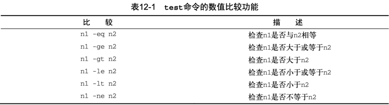
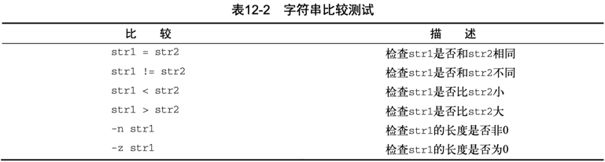
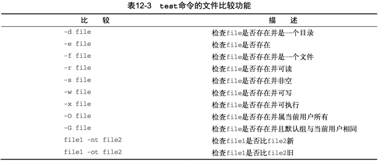

Linux 下的 Shell 编程之比较和测试表达式。

<!-- more -->

到目前为止，在if语句中看到的都是普通shell命令。
你可能想问，if-then语句是否能测试命令退出状态码之外的条件呢？
答案是不能。但在bash shell中有个好用的工具可以帮你通过if-then 语句测试其他条件。

test命令提供了在if-then语句中测试不同条件的途径。

1. 如果test命令中列出的条件成立，test命令就会退出并返回退出状态码0。这样if-then语句就与其他编程语言中的if-then语句以类似的方式工作了。  
2. 如果条件不成立，test命令就会退出并返回非零的退出状态码，这使得 if-then语句不会再被执行。  

test命令的格式非常简单。

```
test condition
```

condition是test命令要测试的一系列参数和值。

当用在if-then语句中时，test命令看起来是这样的：

```
if test condition
then
    commands
fi
```

如果不写 test 命令的 condition 部分，它会以非零的退出状态码退出，并执行 elif/else 语句块。

bash shell 提供了另一种条件测试方法，无需在 if-then 语句中声明 test 命令。

```
if [ condition ]
then
    commands
fi
```

**方括号** 定义了测试条件。

注意，第一个方括号之后和第二个方括号之前必须加上一个空格，否则就会报语法错。

test 命令（方括号）可以判断三类条件：

- 数值比较  
- 字符串比较  
- 文件属性判断  

## 方括号

bash shell 提供了另一种条件测试方法，无需在 if-then 语句中声明 test 命令。

```Shell
if [ condition ]
then
    commands
fi
```

**方括号** 定义了测试条件。

注意，第一个方括号之后和第二个方括号之前必须加上一个空格，否则就会报错。

test 命令可以判断三类条件：

1. 数值比较  
2. 字符串比较  
3. 文件比较  

### 非空判断

方括号 `if [ condition ]`（等效 `test condition`），可用于变量判空：

1. 变量 set 有值，则返回 TRUE；  
2. 变量 unset 为空，则返回 FALSE；  

```Shell
# equiv: if [ ${#isAtHome} -ne 0 ]
Ξ ~ → if [ $isAtHome ] ; then echo "isAtHome" ; fi
isAtHome
# equiv: if [ ${#isAtOffice} -ne 0 ]
Ξ ~ → if [ $isAtOffice ] ; then echo "isAtOffice" ; fi
Ξ ~ →
```

### 数值比较

使用 test 命令最常见的情形是对两个数值进行比较。数值条件测试可以用在数字和变量上。



对于命令执行的返回状态码，可按数值形式进行判断：`if [ $? -eq 0 ]` or `if [ $? -ne 0 ]`。

### 字符串比较

条件测试还允许比较字符串值。比较字符串比较烦琐，你马上就会看到。



- `[ -n string ]`：测试字符串非空，成立返回0；  
- `[ -z string ]`：测试字符串为空，成立返回0；  

对于命令执行的返回状态码，也可按字符串形式进行判断：`if [ "$?" = "0" ]` or `if [ "$?" != "0" ]`。

以下针对 `$isAtOffice` 的 `-n`/`-z` 判断均成立！？

```Shell
Ξ ~ → if [ -n $isAtOffice ] ; then echo "isAtOffice" ; fi
isAtOffice
# 或者
Ξ ~ → if [ -z $isAtOffice ] ; then echo "not isAtOffice" ; fi
not isAtOffice
```

需要对变量引用添加双引号字符串化，再判断：

```Shell
Ξ ~ → if [ -n "$isAtOffice" ] ; then echo "isAtOffice" ; fi
Ξ ~ →
Ξ ~ → if [ -z "$isAtOffice" ] ; then echo "not isAtOffice" ; fi
not isAtOffice
```

当然，还可以这样判空：`"$isAtOffice" = ""`。

MacBook 上一般没有有线网卡，执行 awk 匹配为空，打印 eth_dev 为空：

```Shell
$ eth_dev=$(networksetup -listallhardwareports | awk '/Hardware Port: Ethernet/{getline; print $NF}')
$ echo $eth_dev

```

但是 `[ -n $eth_dev ]` 测试为真：

```Shell
$ if [ -n $eth_dev ]; then echo "not empty"; fi
not empty
```

原因是 awk 未匹配，实际上不会执行变量定义（及赋值），对于 unset 的 eth_dev，`$eth_dev` 被当成字符串，而不是解引用变量！
修改为 `[ -n "$eth_dev" ]` 则符合预期，则双引号内部会尝试解引用，unset 变量的值为空串。

```Shell
$ if [ -n "$eth_dev" ]; then echo "not empty"; fi

# 测取字符串长度
$ echo ${#eth_dev}
0
```

可以进一步通过变量替换测试来验证以上问题。

```Shell
$ echo "${eth_dev:-unset_or_null}"
unset_or_null
# macOS bash shell 版本较低，返回空
$ echo "${eth_dev-unset}"

# ubuntu 等新 bash shell，返回unset
$ echo "${eth_dev-unset}"
unset
```

为了安全起见，对于方括号中对变量的引用判空，建议**加双引号确保解引用**，兼顾变量 unset 的情况。

- [ ] : <s>if [ -n $var ]; then echo "not empty" ; fi</s>  
- [x] : if [ -n "$var" ]; then echo "not empty" ; fi  

### 文件属性判断

最后一类比较测试很有可能是 shell 编程中最为强大、也是用得最多的比较形式。它允许你测试 Linux 文件系统上文件和目录的状态。



---

[Check if a directory exists in a shell script](https://stackoverflow.com/questions/59838/check-if-a-directory-exists-in-a-shell-script)  

[Linux / UNIX: Find Out If a Directory Exists or Not](https://www.cyberciti.biz/tips/find-out-if-directory-exists.html)  

1. 以下脚本使用 `-d` 判断目录是否存在：

```Shell
# 当前目录下如果有 `forms-debug` 文件夹则进入，否则先创建再进入。
([ -d forms-debug ] || mkdir forms-debug) && cd forms-debug
```

> 括号的使命令列表变成了进程列表，生成了一个子shell来执行对应的命令。

2. 参考 [Create Permanent aliases](https://linoxide.com/linux-how-to/create-remove-alias-linux/)，考虑将常用的便捷命令收集在 `~/.bash_aliases`，然后在 `~/.bashrc` 或 `~/.zshrc` 中判断文件有效 source 载入。

```Shell
if [ -f ~/.bash_aliases ]; then
    . ~/.bash_aliases # source
fi
```

3. 在 `/etc/zprofile` 和 `/etc/profile` 中使用 `-x` 测试脚本可执行，然后 eval 执行：

```Shell
$ cat /etc/zprofile

# System-wide profile for interactive zsh(1) login shells.

# Setup user specific overrides for this in ~/.zprofile. See zshbuiltins(1)
# and zshoptions(1) for more details.

if [ -x /usr/libexec/path_helper ]; then
	eval `/usr/libexec/path_helper -s`
fi
```

4. 在 `/etc/profile` 中使用 `-r` 测试脚本可读，然后 source 引入：

```Shell
$ cat /etc/profile

# System-wide .profile for sh(1)

if [ -x /usr/libexec/path_helper ]; then
	eval `/usr/libexec/path_helper -s`
fi

if [ "${BASH-no}" != "no" ]; then
	[ -r /etc/bashrc ] && . /etc/bashrc
fi
```

5. 在 [transfer.sh](https://transfer.sh/) 中使用 ` ! -e ` 排查捕获处理文件不存在的情形：

```Shell
        if [ ! -e "$file" ]; then
            echo "$file: No such file or directory" >&2
            return 1
        fi
        if [ -d "$file" ]; then
            # ...
        fi
```

### 复合条件测试

if-then 语句允许你使用布尔逻辑来组合测试。有两种布尔运算符可用：

- [ condition1 ] && [ condition2 ]  
- [ condition1 ] || [ condition2 ]  

第一种布尔运算使用 AND 布尔运算符来组合两个条件。要让 then 部分的命令执行，两个条件都必须满足。  
第二种布尔运算使用 OR 布尔运算符来组合两个条件。如果任意条件为 TRUE，then 部分的命令就会执行。  

返回值和执行结果综合判断示例：

> `-a` 选项用来对其他两个选项的结果执行布尔AND运算。

```Shell
is_iosdeploy_installed()
{
    # ios-deploy -V | read ios_deploy_version # wrong???
    ios_deploy_version=$(ios-deploy -V)
    if [ $? -eq 0 -a $ios_deploy_version ]
    # if test $ios_deploy_version
    # if [ -n "$ios_deploy_version" ]
    then
        echo "ios-deploy version: $ios_deploy_version"
        return 0
    else
        echo "ios-deploy not found, PLS install first!!!"
        return 1
    fi
}
```

注意以下复合条件测试的综合示例：

```Shell
if is_iosdeploy_installed
then
    ios_deploy_device=`ios-deploy -c`
    # if [ $? -eq 0 -a $ios_deploy_device ]         # [: too many arguments
    # if [ $? -eq 0 ] && [ $ios_deploy_device ]     # [: too many arguments
    # if [[ $? -eq 0 ]] && [[ $ios_deploy_device ]] # right, not recommended
    if [ $? -eq 0 ] && [ -n "$ios_deploy_device" ]  # SC2166 建议写法
    then
        echo $ios_deploy_device
        main $@ # $*
    else
        echo "ios-deploy detect failed!"
    fi
fi
```

## if-then 的高级特性

bash shell 提供了两项可在 if-then 语句中使用的高级特性：

- 用于数学表达式的双括号  
- 用于高级字符串处理功能的双方括号  

### 双括号

双括号命令 `(( expression ))` 支持更多的数学运算符。
双括号表达式有状态返回码，当运算结果非零时，返回0；否则，返回1。
相比test命令只能使用简单的算术操作，双括号命令允许在比较过程中使用高级数学表达式。

```Shell
$ man bash

((expression))

The expression is evaluated according to the rules described below under ARITHMETIC EVALUATION. If the value of the expression is non-zero, the return status is 0; otherwise the return status is 1. This is exactly equivalent to let "expression".
```


可以在脚本中使用双括号来执行数学运算，也可以使用if判断计算结果状态。

```sh
#!/bin/bash

n=0
(( n += 1 )) #Increment
echo $? # 返回0
(( n -= 1))
echo $? # 返回1
echo "n = $n"

val1=10

if (( $val1 ** 2 > 90 ))
then (( val2 = $val1 ** 2 ))
    echo "The square of $val1 is $val2"
fi
```

### 双方括号

双方括号表达式 `[[ expression ]]` 提供了针对字符串比较的高级特性。

```Shell
$ man bash

[[ expression ]]

Return a status of 0 or 1 depending on the evaluation of the conditional expression expression.
```

双方括号里的expression使用了test命令中采用的标准字符串比较。但它提供了test命令未提供的另一个特性——**模式匹配**（pattern matching）。

在 [ohmyzsh/plugins/shell-proxy/](https://github.com/ohmyzsh/ohmyzsh/tree/master/plugins/shell-proxy) 中，这里的双方括号貌似可以改为单方括号？

```Shell
$ cat $HOME/.config/proxy

#!/bin/bash

if [[ "$(uname)" = Darwin ]]; then
  echo "http://127.0.0.1:6152" # Surge Mac
else
  echo "http://127.0.0.1:8123" # polipo
fi
```

在模式匹配中，可以定义一个正则表达式来匹配字符串值。

```Shell
#!/bin/bash
# using pattern matching
#

if [[ $USER == r* ]]
then
    echo "Hello $USER"
else
    echo "Sorry, I do not know you"
fi
```

双等号（`==`）将右边的字符串（`r*`）视为一个模式，并应用模式匹配规则。

另外一种写法是利用 `=~` 判断匹配包含关系。

```Shell
strA="helloworld"
strB="low"
if [[ $strA =~ $strB ]]
then
    echo "包含"
else
    echo "不包含"
fi
```

命令行测试：

```
➜  ~ strA="helloworld"
➜  ~ strB="low"
➜  ~ if [[ $strA == *low* ]] ; then echo "包含" ; else echo "不包含" ; fi
包含
➜  ~ if [[ $strA =~ $strB ]] ; then echo "包含" ; else echo "不包含" ; fi
包含
```

## 关于shell中的boolean

[shell有bool运算么](https://blog.csdn.net/weixin_42353805/article/details/111929566)

在shell脚本中没有布尔值的概念，只能按照字符串处理。

```Shell
doFirst=true
# ...
if [ $doFirst = true ]; then
    doFirst=false
fi
# ...
```

[How can I declare and use Boolean variables in a shell script?](https://stackoverflow.com/questions/2953646/how-can-i-declare-and-use-boolean-variables-in-a-shell-script)

```Shell
the_world_is_flat=true
# ...do something interesting...
if [ "$the_world_is_flat" = true ] ; then
    echo 'Be careful not to fall off!'
fi
```

---

Say we have the following condition.

```Shell
if $var; then
  echo 'Muahahaha!'
fi
```

In the following cases2, this condition will evaluate to true and execute the nested command.

```
# Variable var not defined beforehand. Case 1
var=''  # Equivalent to var="".      # Case 2
var=                                 # Case 3
unset var                            # Case 4
var='<some valid command>'           # Case 5
```

What I do recommend:

Here are ways I recommend you check your "Booleans". They work as expected.

```Shell
my_bool=true

if [ "$my_bool" = true ]; then
if [ "$my_bool" = "true" ]; then

if [[ "$my_bool" = true ]]; then
if [[ "$my_bool" = "true" ]]; then
if [[ "$my_bool" == true ]]; then
if [[ "$my_bool" == "true" ]]; then

if test "$my_bool" = true; then
if test "$my_bool" = "true"; then
```

## refs

[Bash字符串判断](https://blog.csdn.net/weihongrao/article/details/11028231)  
[逻辑判断和字符串比较](https://blog.csdn.net/wxc_qlu/article/details/82826106)  
