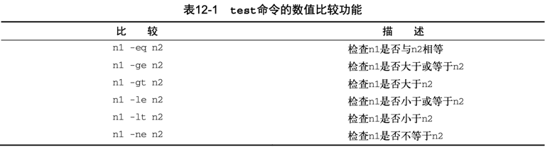
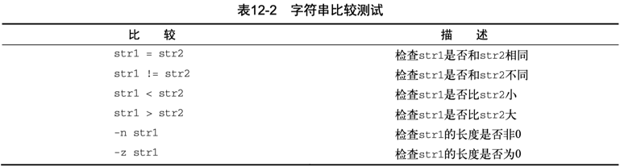
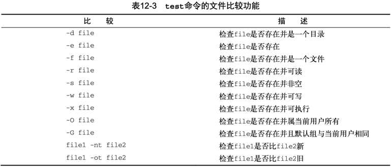

Linux 下的 Shell 编程之比较和测试表达式。

<!-- more -->

到目前为止，在 if 语句中看到的都是普通shell命令。
你可能想问，if-then 语句是否能测试命令退出状态码之外的条件呢？
答案是不能。但在 bash shell 中有个好用的工具可以帮你通过 if-then 语句测试其他条件。

## test condition（条件判断）

test命令提供了在if-then语句中测试不同条件的途径。

1. 如果test命令中列出的条件成立，test命令就会退出并返回退出状态码0。这样if-then语句就与其他编程语言中的if-then语句以类似的方式工作了。  
2. 如果条件不成立，test命令就会退出并返回非零的退出状态码，这使得 if-then语句不会再被执行。  

test命令的格式非常简单。

```bash
test condition
```

condition是test命令要测试的一系列参数和值。

当用在if-then语句中时，test命令看起来是这样的：

```bash
if test condition
then
    commands
fi
```

如果不写 test 命令的 condition 部分，它会以非零的退出状态码退出，并执行 elif/else 语句块。

bash shell 提供了另一种条件测试方法，无需在 if-then 语句中声明 test 命令。

```bash
if [ condition ]
then
    commands
fi
```

**方括号** 定义了测试条件。

注意，第一个方括号之后和第二个方括号之前必须加上一个空格，否则就会报语法错。

test 命令（方括号）可以判断三类条件：

- 数值比较  
- 字符串比较  
- 文件属性判断  

bash shell 提供了另一种条件测试方法，无需在 if-then 语句中声明 test 命令。

```bash
if [ condition ]
then
    commands
fi
```

**方括号** 定义了测试条件。

注意，第一个方括号之后和第二个方括号之前必须加上一个空格，否则就会报错。

test 命令可以判断三类条件：

1. 数值比较  
2. 字符串比较  
3. 文件比较  

### 非空判断

方括号 `if [ condition ]`（等效 `test condition`），可用于变量判空：

1. 变量 set 有值，则返回 TRUE；  
2. 变量 unset 为空，则返回 FALSE；  

```bash
Ξ ~ → if [ $isAtHome ] ; then echo "isAtHome" ; fi
isAtHome
Ξ ~ → if [ $isAtOffice ] ; then echo "isAtOffice" ; fi
Ξ ~ →
```

### 数值比较

使用 test 命令最常见的情形是对两个数值进行比较。数值条件测试可以用在数字和变量上。



对于命令执行的返回状态码，可按数值形式进行判断：`if [ $? -eq 0 ]` or `if [ $? -ne 0 ]`。

### 字符串比较

条件测试还允许比较字符串值。比较字符串比较烦琐，你马上就会看到。



- `[ -n string ]`：测试字符串非空，成立返回0；  
- `[ -z string ]`：测试字符串为空，成立返回0；  

对于命令执行的返回状态码，也可按字符串形式进行判断：`if [ "$?" = "0" ]` or `if [ "$?" != "0" ]`。

以下针对 `$isAtOffice` 的 `-n`/`-z` 判断均成立！？

```bash
Ξ ~ → if [ -n $isAtOffice ] ; then echo "isAtOffice" ; fi
isAtOffice
# 或者
Ξ ~ → if [ -z $isAtOffice ] ; then echo "not isAtOffice" ; fi
not isAtOffice
```

需要对变量引用添加双引号字符串化，再判断：

```bash
Ξ ~ → if [ -n "$isAtOffice" ] ; then echo "isAtOffice" ; fi
Ξ ~ →
Ξ ~ → if [ -z "$isAtOffice" ] ; then echo "not isAtOffice" ; fi
not isAtOffice
```

当然，还可以这样判空：`"$isAtOffice" = ""`。

MacBook 上一般没有有线网卡，执行 awk 匹配为空，打印 eth_dev 为空：

```bash
$ eth_dev=$(networksetup -listallhardwareports | awk '/Hardware Port: Ethernet/{getline; print $NF}')
$ echo $eth_dev

```

但是 `[ -n $eth_dev ]` 测试为真：

```bash
$ if [ -n $eth_dev ]; then echo "not empty"; fi
not empty
```

原因是 awk 未匹配，实际上不会执行变量定义（及赋值），对于 unset 的 eth_dev，`$eth_dev` 被当成字符串，而不是解引用变量！
修改为 `[ -n "$eth_dev" ]` 则符合预期，则双引号内部会尝试解引用，unset 变量的值为空串。

```bash
$ if [ -n "$eth_dev" ]; then echo "not empty"; fi

# 测取字符串长度
$ echo ${#eth_dev}
0
```

可以进一步通过变量替换测试来验证以上问题。

```bash
$ echo "${eth_dev:-unset_or_null}"
unset_or_null
# macOS bash shell 版本较低，返回空
$ echo "${eth_dev-unset}"

# ubuntu 等新 bash shell，返回unset
$ echo "${eth_dev-unset}"
unset
```

为了安全起见，对于方括号中对变量的引用判空，建议**加双引号确保解引用**，兼顾变量 unset 的情况。

- [ ] : <s>if [ -n $var ]; then echo "not empty" ; fi</s>  
- [x] : if [ -n "$var" ]; then echo "not empty" ; fi  

### 关于 boolean

[shell有bool运算么](https://blog.csdn.net/weixin_42353805/article/details/111929566)

在shell脚本中没有布尔值的概念，只能按照字符串处理。

```bash
doFirst=true
# ...
if [ $doFirst = true ]; then
    doFirst=false
fi
# ...
```

[How can I declare and use Boolean variables in a shell script?](https://stackoverflow.com/questions/2953646/how-can-i-declare-and-use-boolean-variables-in-a-shell-script)

```bash
the_world_is_flat=true
# ...do something interesting...
if [ "$the_world_is_flat" = true ] ; then
    echo 'Be careful not to fall off!'
fi
```

---

Say we have the following condition.

```bash
if $var; then
  echo 'Muahahaha!'
fi
```

In the following cases2, this condition will evaluate to true and execute the nested command.

```bash
# Variable var not defined beforehand. Case 1
var=''  # Equivalent to var="".      # Case 2
var=                                 # Case 3
unset var                            # Case 4
var='<some valid command>'           # Case 5
```

What I do recommend:

Here are ways I recommend you check your "Booleans". They work as expected.

```bash
my_bool=true

if [ "$my_bool" = true ]; then
if [ "$my_bool" = "true" ]; then

if [[ "$my_bool" = true ]]; then
if [[ "$my_bool" = "true" ]]; then
if [[ "$my_bool" == true ]]; then
if [[ "$my_bool" == "true" ]]; then

if test "$my_bool" = true; then
if test "$my_bool" = "true"; then
```

### 文件属性判断

最后一类比较测试很有可能是 shell 编程中最为强大、也是用得最多的比较形式。它允许你测试 Linux 文件系统上文件和目录的状态。



---

[Check if a directory exists in a shell script](https://stackoverflow.com/questions/59838/check-if-a-directory-exists-in-a-shell-script)  

[Linux / UNIX: Find Out If a Directory Exists or Not](https://www.cyberciti.biz/tips/find-out-if-directory-exists.html)  

1. 以下脚本使用 `-d` 判断目录是否存在：

```bash
# 当前目录下如果有 `forms-debug` 文件夹则进入，否则先创建再进入。
([ -d forms-debug ] || mkdir forms-debug) && cd forms-debug
```

> 括号的使命令列表变成了进程列表，生成了一个子shell来执行对应的命令。

2. 参考 [Create Permanent aliases](https://linoxide.com/linux-how-to/create-remove-alias-linux/)，考虑将常用的便捷命令收集在 `~/.bash_aliases`，然后在 `~/.bashrc` 或 `~/.zshrc` 中判断文件有效 source 载入。

```bash
if [ -f ~/.bash_aliases ]; then
    . ~/.bash_aliases # source
fi
```

3. 在 `/etc/zprofile` 和 `/etc/profile` 中使用 `-x` 测试脚本可执行，然后 eval 执行：

```bash
$ cat /etc/zprofile

# System-wide profile for interactive zsh(1) login shells.

# Setup user specific overrides for this in ~/.zprofile. See zshbuiltins(1)
# and zshoptions(1) for more details.

if [ -x /usr/libexec/path_helper ]; then
	eval `/usr/libexec/path_helper -s`
fi
```

4. 在 `/etc/profile` 中使用 `-r` 测试脚本可读，然后 source 引入：

```bash
$ cat /etc/profile

# System-wide .profile for sh(1)

if [ -x /usr/libexec/path_helper ]; then
	eval `/usr/libexec/path_helper -s`
fi

if [ "${BASH-no}" != "no" ]; then
	[ -r /etc/bashrc ] && . /etc/bashrc
fi
```

5. 在 [transfer.sh](https://transfer.sh/) 中使用 ` ! -e ` 排查捕获处理文件不存在的情形：

```bash
        if [ ! -e "$file" ]; then
            echo "$file: No such file or directory" >&2
            return 1
        fi
        if [ -d "$file" ]; then
            # ...
        fi
```

### 复合条件测试

if-then 语句允许你使用布尔逻辑来组合测试。有两种布尔运算符可用：

- [ condition1 ] && [ condition2 ]  
- [ condition1 ] || [ condition2 ]  

第一种布尔运算使用 AND 布尔运算符来组合两个条件。要让 then 部分的命令执行，两个条件都必须满足。  
第二种布尔运算使用 OR 布尔运算符来组合两个条件。如果任意条件为 TRUE，then 部分的命令就会执行。  

返回值和执行结果综合判断示例：

> `-a` 选项用来对其他两个选项的结果执行布尔AND运算。

```bash
is_iosdeploy_installed()
{
    # ios-deploy -V | read ios_deploy_version # wrong???
    ios_deploy_version=$(ios-deploy -V)
    if [ $? -eq 0 -a $ios_deploy_version ]
    # if test $ios_deploy_version
    # if [ -n "$ios_deploy_version" ]
    then
        echo "ios-deploy version: $ios_deploy_version"
        return 0
    else
        echo "ios-deploy not found, PLS install first!!!"
        return 1
    fi
}
```

注意以下复合条件测试的综合示例：

```bash
if is_iosdeploy_installed
then
    ios_deploy_device=`ios-deploy -c`
    # if [ $? -eq 0 -a $ios_deploy_device ]         # [: too many arguments
    # if [ $? -eq 0 ] && [ $ios_deploy_device ]     # [: too many arguments
    # if [[ $? -eq 0 ]] && [[ $ios_deploy_device ]] # right, not recommended
    if [ $? -eq 0 ] && [ -n "$ios_deploy_device" ]  # SC2166 建议写法
    then
        echo $ios_deploy_device
        main $@ # $*
    else
        echo "ios-deploy detect failed!"
    fi
fi
```

## Parameter Expansion（参数扩展）

参考 man bash - `Parameter Expansion`（参数扩展）章节

```bash
$ man bash

       ${parameter:-word}
              Use Default Values.  If parameter is unset or null, the  expansion  of  word  is  substituted.
              Otherwise, the value of parameter is substituted.
       ${parameter:=word}
              Assign  Default  Values.   If parameter is unset or null, the expansion of word is assigned to
              parameter.  The value of parameter is then substituted.   Positional  parameters  and  special
              parameters may not be assigned to in this way.
       ${parameter:?word}
              Display  Error  if  Null or Unset.  If parameter is null or unset, the expansion of word (or a
              message to that effect if word is not present) is written to the standard error and the shell,
              if it is not interactive, exits.  Otherwise, the value of parameter is substituted.
       ${parameter:+word}
              Use  Alternate  Value.   If  parameter is null or unset, nothing is substituted, otherwise the
              expansion of word is substituted.

```

[POSIX](https://pubs.opengroup.org/onlinepubs/9699919799/utilities/V3_chap02.html#tag_18_06_02) 文档中的这张表说得很清楚：

|    |*parameter*<br>**Set and Not Null** |*parameter*<br>**Set But Null** |*parameter*<br>**Unset** |
|:--|:--|:--|:--|
|**${***parameter***:-***word***}** |substitute *parameter* |substitute *word* |substitute *word* |
|**${***parameter***-***word***}** |substitute *parameter* |substitute null |substitute *word* |
|**${***parameter***:=***word***}** |substitute *parameter* |assign *word* |assign *word* |
|**${***parameter***=***word***}** |substitute *parameter* |substitute null |assign *word* |
|**${***parameter***:?***word***}** |substitute *parameter* |error, exit |error, exit |
|**${***parameter***?***word***}** |substitute *parameter* |substitute null |error, exit |
|**${***parameter***:+***word***}** |substitute *word* |substitute null |substitute null |
|**${***parameter***+***word***}** |substitute *word* |substitute *word* |substitute null |

### 取默认值

> `${parameter:-word}`: Use Default Values.

[How variables inside braces are evaluated](https://unix.stackexchange.com/questions/286335/how-variables-inside-braces-are-evaluated)  

Omitting the `:` drops the "*or null*" part of all these definitions.

- `${a:-default}​`: 如果变量 a 未设置或为空，则使用默认值。
- `${a-default}​`: 仅当变量未设置时，才使用默认值。

This is all described in the [bash(1) manpage](http://man7.org/linux/man-pages/man1/bash.1.html), and in [POSIX](https://pubs.opengroup.org/onlinepubs/9699919799/utilities/V3_chap02.html#tag_18_06_02).

1. 变量未定义：

```bash
# 未定义变量
~  $ unset a
# 变量未定义，返回default
~  $ echo "${a:-default}"
default
# 变量未定义，返回default
~  $ echo "${a-default}"
default
```

2. 变量有定义，但为空值（空字符串）

```bash
# 定义变量，但赋值为空
~  $ a= # or a=''
# 变量a已定义，但值为空，返回default
~  $ echo "${a:-default}"
default
# 变量a已定义，返回a——空值
~  $ echo "${a-default}"

~  $
```

3. 定义变量，且非空值

```bash
# 定义变量，且有赋值（非空），返回a
~  $ a=test
~  $ echo "${a:-default}"
test
~  $ echo "${a-default}"
test
```

in `/etc/zshrc`: If `ZDOTDIR` is unset(or empty), `HOME` is used instead.

```bash
$ vim /etc/zshrc

HISTFILE=${ZDOTDIR:-$HOME}/.zsh_history
```

[shell 脚本 ${1:-"false"}的含义](https://blog.csdn.net/fhaitao2009/article/details/104165211)

> 如果 `$1` 存在并且不为空，则 a=`$1`；否则（未定义或为空），则 a=`false`。

[Usage of :- (colon dash) in bash](https://stackoverflow.com/questions/10390406/usage-of-colon-dash-in-bash)  

> `${PUBLIC_INTERFACE:-eth0}`: If `$PUBLIC_INTERFACE` exists and isn't null, return its value, otherwise return "eth0".

[zsh-autosuggestions/INSTALL](https://github.com/zsh-users/zsh-autosuggestions/blob/master/INSTALL.md)：如果变量 `ZSH_CUSTOM` 未定义或为空，则替换为 `~/.oh-my-zsh/custom`。

```bash
git clone https://github.com/zsh-users/zsh-autosuggestions ${ZSH_CUSTOM:-~/.oh-my-zsh/custom}/plugins/zsh-autosuggestions
```

我们来看一下 [How to read from a file or standard input in Bash](https://stackoverflow.com/questions/6980090/how-to-read-from-a-file-or-standard-input-in-bash) 这个问题，优先从文件读入参数，否则从stdin接受输入。

Read either the first argument or from stdin

`file=${1--}`（`file=${1:--}`，等效于 `${1:-/dev/stdin}`），可理解为 `[ "$1" ] && file=$1 || file="-"`。

以下脚本，从文件$1或stdin读取数据传给cat，然后输出到文件$2或stdout。

```bash
cat "${1:-/dev/stdin}" > "${2:-/dev/stdout}"
```

### 赋默认值

> `${parameter:=word}`: Assign Default Values.

变量未定义或为空，赋默认值：

```bash
# 变量未定义，赋默认值
~  $ unset a
~  $ echo "${a:=default}"
default
~  $ echo $a
default

# 变量为空值，赋默认值
~ $ echo $a
default
~ $ a=''
~ $ echo "${a:=default}"
default
```

以下是一段来自生产实践中的sh脚本，基于 `:=` 来给未定义或空值变量赋默认值兜底：

```bash
    # 兜底启动角色和模式
    # 当作命令执行，报错
    ${role:=client}
    zsh: command not found: client
    echo $role
    client

    # 在赋值表达式前添加冒号，否则设置了 set -e 会退出
    : ${role:=client}
    echo $role
    client

    echo "mode = ${mode:=debug}"

    # 兜底默认服务和代理端口
    : "${web_port:=8080}"
    : "${proxy_port:=8010}"
```

### 显示错误

> `${parameter:?word}`: Display Error if Null or Unset.

以下sh脚本中调用get_lan_ip函数，预期其中会定义未export的全局变量lan_ip。

```bash
    get_lan_ip
    echo "lan_ip = $lan_ip"
```

由于无法确保第三方脚本中的其他函数是否定义了该变量，ShellCheck 会报引用安全警告：

[SC2154](https://github.com/koalaman/shellcheck/wiki/SC2154): lan_ip is referenced but not assigned.

如果局域网 LAN IP 获取不到，往往意味着网络服务不可用，可以使用 `:?` 进行判空警告。

```bash
    echo "lan_ip = ${lan_ip:?unset or null}"
```

这样，如果 lan_ip 未定义或为空值，则直接报错中止退出（exit 1）。

```bash
Wi-Fi en0 : status=inactive
./scripts/proxy/launch_shelf.sh: line 33: lan_ip: unset or null
```

### 替代值

> `${parameter:+word}`: Use Alternate Value.

The `+` form might seem strange, but it is useful when constructing variables in several steps:

```bash
PATH="${PATH}${PATH:+:}/blah/bin"
```

will add `:` before `/blah/bin` only if PATH is non-empty, which avoids having a path starting with `:`.

- 如果 PATH 未定义或为空，则什么也不做，第一个环境变量不用添加冒号前缀分隔符；  
- 如果 PATH 有定义或非空，则相当于在现有 PATH 后面追加变量：`PATH=${PATH}:/blash/bin`；  

`map_has` 函数检查键是否存在：

- 如果变量已定义（set, defined），即使值为空，替换为 `x`（满足 -n 非空），eval 退出码为零
- 否则（unset, undefined），替换为空值，eval 退出码非零

```bash
function map_has() {
    local key="$1"
    local var_name="${prefix}${key}"
    eval "[[ -n \${$var_name+x} ]]"
}
```

## references

[Bash字符串判断](https://blog.csdn.net/weihongrao/article/details/11028231)  
[逻辑判断和字符串比较](https://blog.csdn.net/wxc_qlu/article/details/82826106)  
[shell 编程：:后面跟-=?+的意义](https://handerfly.github.io/shell/2019/04/03/shell%E7%BC%96%E7%A8%8B%E5%86%92%E5%8F%B7%E5%8A%A0-%E7%AD%89%E5%8F%B7-%E5%8A%A0%E5%8F%B7-%E5%87%8F%E5%8F%B7-%E9%97%AE%E5%8F%B7/)  
[shell之变量替换：:=、=、:-、-、=?、?、:+、+句法](https://www.cnblogs.com/fhefh/archive/2011/04/22/2024750.html)  
