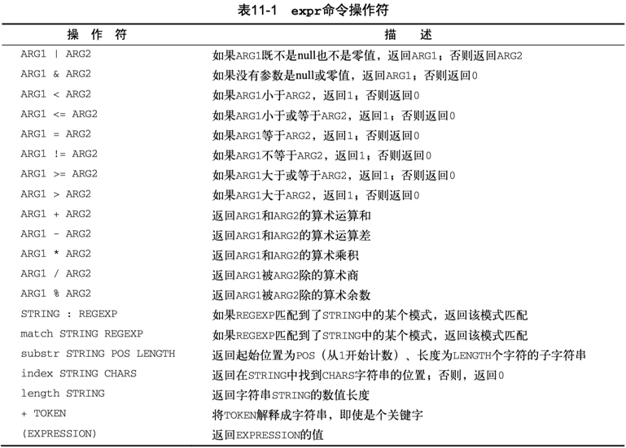

Linux 下的 Shell 编程之表达式。

<!-- more -->

[Difference between let, expr and $[]](https://askubuntu.com/questions/939294/difference-between-let-expr-and)

命令行执行运算表达式：

```sh
$ expr 5 + 1
6

$ $(expr 5 + 1)
zsh: command not found: 6

$ $[5 + 1]
zsh: command not found: 6

$ $((5+1))
zsh: command not found: 6
```

> 如果想在命令行执行数学计算，建议使用数学计算器 `bc`（bash calculator）。

在 bash shell 脚本中有以下几种运算表达式的书写方式。

## expr

最开始，Bourne shell 提供了一个特别的命令用来处理数学表达式。
expr 命令允许在命令行上处理数学表达式，但是特别笨拙。

expr 命令能够识别少数的数学和字符串操作符，见表11-1。



需要注意两点：

1. 操作符两侧需要空格隔开算子；  
2. 算子引用变量需要用美元符号；  

```sh
$ x=$(expr 5 + 1)
$ echo $x
6

#星号需要转义

$ y=`expr 5 \* 2`
$ echo $y
10
```

可用 expr 表达式实现 for 循环中记录递增的索引：

```sh
$ i=0
$ index=`expr $i + 1` # 等效于 index=$(expr $i + 1)
$ echo $i $index
0 1
```

综合示例2：

```sh
#!/bin/bash

$ var1=5
$ var2=1
$ x=$var1+$var2
$ echo "x=$x"
x=5+1

$ y=$(expr $var1+$var2)
$ echo "y=$y"
y=5+1

$ z=$(expr $var1 + $var2)
$ echo "z=$z"
z=6
```

前两种运算符与算子之间没有空格，被当成了字符串拼接。
第三种是正确的 expr 算术表达式写法，结果符合预期。

## let

`let` command performs arithmetic evaluation and is a shell built-in.

bash shell 内置支持的 let 表达式，直接引用变量，而无需美元符号解引用，更接近于 C 等现代编程语言里面的自然表达式。

范式：`let var3=var1+var2`

```sh
$ z=0
$ let z=z+3 # 等效: let z+=3
$ let "z += 3"
$ echo "z = $z"
6

$ let 'sum=10+1'
$ echo "sum = $sum"
sum = 11
```

综合示例：

```sh
$ var1=5
$ var2=1
$ let x=var1+var2
$ echo "x=$x"
x=6

$ let "y=var1+var2"
$ echo "y=$y"
y=6
```

let 表达式更自然，算子引用的变量直接采用变量名，无需添加美元符号，推荐使用。

以下用 `let` 表达式实现 for 循环中记录递增的索引：

```sh
$ i=0
$ let index=i+1
$ echo $i $index
0 1

$ let i++
$ echo $i
1

$ let i+=1
$ echo $i
2

$ let index=i++
$ echo $i $index
3 2

$ let index=++i
$ echo $i $index
4 4
```

## $[]

bash shell 为了保持跟 Bourne shell 的兼容而包含了 expr 命令，但同时提供了一种更简单的方法来执行数学表达式。
在 bash 中，在将一个数学运算结果赋给某个变量时，可以用美元符号和方括号（`$[operation]`）将数学表达式围起来。

用方括号执行shell数学运算比用expr命令方便很多。

1. 操作符两侧非必须要用空格隔开算子；  
2. 算子可直接引用变量，可无需美元符号；  

常量计算表达式：

```sh
$ x=$[5 + 1]
$ echo $x
6

$ y=$[5*2]
$ echo $y
10
```

用 `$[]` 表达式实现 for 循环中记录递增的索引：

```sh
$ i=0
$ index=$[$i+1]
$ echo $i $index
0 1
```

变量计算表达式：

```sh
$ var1=5
$ var2=1

$ x=$[var1 + var2]
$ echo "x=$x"
x=6
```

在使用方括号来计算公式时，不用担心shell会误解乘号或其他符号。  
对于方括号中的星号，shell知道它执行数学中的乘法运算而不是通配符，因为它在方括号内。

```sh
$ var1=100
$ var2=50
$ var3=45
$ # var4=$[$var1 * ($var2 - $var3)]
$ var4=$[var1*(var2-var3)] # 简写
$ echo The final result is $var4
The final result is 500
```

无论是 expr 表达式，还是中括号运算式，bash shell 数学运算符只支持整数运算。

```sh
$ var1=100
$ var2=45
$ var3=$(expr $var1 / $var2)
$ echo The final result is $var3
2
$ var4=$[var1/var2]
$ echo The final result is $var4
2
```

如果需要在shell脚本中进行浮点数运算，可以考虑看看 z shell，zsh 提供了完整的浮点数算术操作。  
也可将表达式重定向到 bash 内置计算器 `bc` 做计算，参考 REDIRECTION 相关议题。

## (())

双括号命令 `(( expression ))` 支持更多的数学运算符。
双括号表达式有状态返回码，当运算结果非零时，返回0；否则，返回1。
相比test命令只能使用简单的算术操作，双括号命令允许在比较过程中使用高级数学表达式。

表12-4列出了双括号命令中会用到的其他运算符：


可以在脚本中使用双括号来执行数学运算，也可以使用if判断计算结果状态。

```sh
#!/bin/bash

n=0
(( n += 1 )) #Increment
echo $? # 返回0
(( n -= 1))
echo $? # 返回1
echo "n = $n"

val1=10

if (( $val1 ** 2 > 90 ))
then (( val2 = $val1 ** 2 ))
    echo "The square of $val1 is $val2"
fi
```

关于双括号的场景，参考bash中C语言风格的for循环格式：

```sh
for (( variable assignment ; condition ; iteration process ))

#实例

for (( a = 1; a < 10; a++ ))
```

注意，有些部分并没有遵循bash shell标准的for命令：

- 变量赋值可以有空格  
- 条件中的变量不以美元符开头  
- 迭代过程的算式未用expr命令格式。  

### $(())

[Arithmetic Expansion](https://www.tldp.org/LDP/abs/html/arithexp.html)

在 dash shell、z shell 脚本中执行算术运算的正确格式是用双圆括号方法 —— `$((expression))`。

```sh
# man bash
   Arithmetic Expansion
       Arithmetic expansion allows the evaluation of an arithmetic expression and the substitu-
       tion of the result.  The format for arithmetic expansion is:

              $((expression))

       The  expression is treated as if it were within double quotes, but a double quote inside
       the parentheses is not treated specially.  All tokens in the expression undergo  parame-
       ter  expansion,  string  expansion, command substitution, and quote removal.  Arithmetic
       expansions may be nested.

       The evaluation is performed according to the rules listed below under ARITHMETIC EVALUA-
       TION.  If expression is invalid, bash prints a message indicating failure and no substi-
       tution occurs.
```

根据 Shell Check 建议，在做数学运算时，应采用 `$(())` 代替 `expr` 和 `let` 表达式以及 `$[ ]`。

- [SC2003](https://github.com/koalaman/shellcheck/wiki/SC2003): `expr` is antiquated. Consider rewriting this using `$((..))`, `${}` or `[[ ]]`.  
- [SC2007](https://github.com/koalaman/shellcheck/wiki/SC2007): Use `$((..))` instead of deprecated `$[..]`.  
- [SC2219](https://github.com/koalaman/shellcheck/wiki/SC2219): Instead of `let` expr, prefer `(( expr ))` .

**注意**：双括号中的表达式，解引用变量时可不添加美元符号。

> Within double parentheses, parameter dereferencing is optional.

表达式 `OPTIND=$(($OPTIND + 1))` 将被 ShellCheck 检测报错 [C2004](https://github.com/koalaman/shellcheck/wiki/SC2004): `$`/`${}` is unnecessary on arithmetic variables. 应修改为 `OPTIND=$((OPTIND + 1))`。

示例：

```sh
#!/bin/bash

val3=$((val2+3))
#val3=$(($val2+3)) #Also correct

echo "val3=$val3"
```

双重括号表达式基本上和 let 表达式等效。

以下用 `(( expr ))` 表达式实现 for 循环中记录递增的索引：

```sh
$ i=0
$ ((i += 1))
$ echo $i
1

$ index=$((i+1))
$ echo $i $index
1 2
```

减法计算间隔耗时：

```Shell
$ time_start=1668913082
$ time_end=1668913195
$ time_cost=$(( $time_end - $time_start ))
$ echo $time_cost
113
```

乘法计算倍积：

```Shell
$ SHOW_COUNT=5
$ echo $(( $SHOW_COUNT * 3 ))
15

$ x=5
$ echo $((2*x))
10
```

双乘计算幂：

```Shell
$ echo $((2**x))
32
```

浮点数乘法，printf 可限定输出浮点位数：

```Shell
$ value1=$(( 4 * 5.1 ))
$ echo $value1
20.399999999999999
$ printf "%6.3f\n" $value1
20.400
```

整除取模运算：

```Shell
SECS=3600
UNIT_TIME=60
STEPS=$(( $SECS / $UNIT_TIME ))
echo $STEPS
60
```

取模和取余运算：

```Shell
$ value1=10
$ value2=$(( $value1 / 3 ))
$ echo $value2
3
$ value3=$(( $value1 % 3 ))
$ echo $value3
1
```

将被除数浮点化，以便计算完整的浮点除法结果：

```Shell
$ value1=10
$ value2=$(( $value1 / 3. ))
$ echo $value2
3.3333333333333335
$ printf "%.3f\n" $value2
3.333
```
