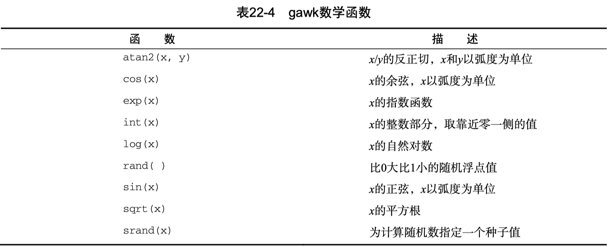
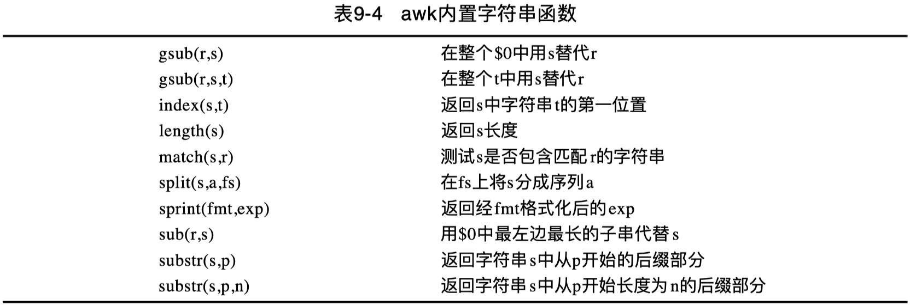
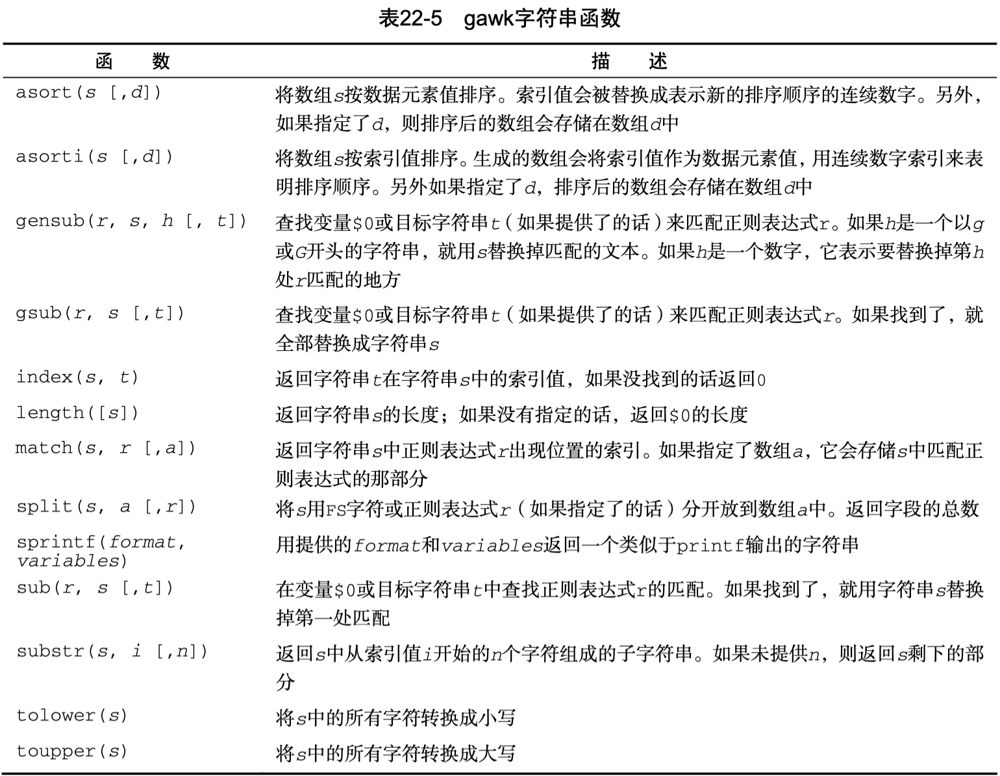

Linux 下的 awk 命令中的函数运用。

<!-- more -->

## Arith



## String





> `asort`、`asorti` 和 `gensub` 为 gawk 特有函数，macOS awk 不支持。

相关函数梳理如下：

`gsub()` 函数有点类似于 sed 查找和替换。它允许替换一个字符串或字符为另一个字符串或字符，并以正则表达式的形式执行。  

> 第一个函数作用于记录 `$0`；  
> 第二个函数允许指定目标，若未指定目标，缺省为 `$0`。  

`index(s,t)` 函数返回目标字符串 s 中查询字符串 t 的首位置。  
`length(s)` 函数返回字符串 s 的字符长度。  
`match(s,r)` 函数测试字符串 s 是否包含一个正则表达式 r 定义的匹配。  
`split(s,a,fs)` 使用域分隔符 fs 将字符串s划分为指定序列a。  
`sprintf(fmt,exp)` 函数类似于 printf 函数，返回基本输出格式 fmt 的结果字符串 exp。  
`sub(r,s)` 函数将用 s 替代 `$0` 中最左边最长的子串，该子串被（r）匹配。  
`substr(s,p)` 返回字符串 s 在位置 p 后的后缀。  
`substr(s,p,n)` 同上，并指定子串长度为 n。  

### length

返回所需字符串长度。

以下返回常量字符串长度：

```bash
$ awk 'BEGIN{print length("A FEW GOOD MEN")}'
14
```

以下检验字符串 J.Troll 返回名字及其长度，即人名构成的字符个数。

```bash
$ awk '$1=="J.Troll"{print length($1),$1}' grade.txt
7 J.Troll

$ awk '$1=="J.Troll"{print "length(",$1,") =",length($1)}' grade.txt
length( J.Troll ) = 7
```

### index

查询字符串s中t出现的第一位置，必须用双引号将字符串括起来。

```bash
$ awk 'BEGIN{print index("Bunny","ny")}'
4
```

> 注意：索引从1开始。

[shell 查找字符串中字符出现的位置](https://www.cnblogs.com/sea-stream/p/11403014.html)

```bash
$ test="cat"
$ sentence="The cat sat on the mat"
$ index=`awk -v a="$sentence" -v b="$test" 'BEGIN{print index(a,b)}'`
$ echo $index
5
```

#### match

match 测试目标字符串是否包含查找字符的一部分。  
可以对查找部分使用正则表达式，返回值为成功出现的字符（子串）索引位置。如果未找到，则返回 0。

```bash
# 在 ANCD 中查找 d
$ awk 'BEGIN{print match("ANCD", /d/)}'
0

# 在 ANCD 中查找 C
$ awk 'BEGIN{print match("ANCD", /C/)}'
3

# 在学生 J.Lulu 中查找子串 u
$ awk '$1=="J.Lulu"{print match($1, "u")}' grade.txt
4

# 在学生 J.Lulu 中查找子串 lu
$ awk '$1=="J.Lulu"{print match($1, "lu")}' grade.txt
5
```

#### 多行划分区块删除

在 awk-pattern 中的 多行划分区块 示例中，基于 `- path: ` 划分区块。

```bash
$ awk 'BEGIN {RS="- path: "; FS="\n"; ORS=""} $1~/\/Classes\/ui\/DeviceMgr\//' bak.code.yml
```

留下了一个问题：如何进一步基于 awk 命令移除这些匹配的 CR 规则区块记录呢？

sed 天然适合用来执行此类区块匹配及删除操作：

```bash
# 指定备份扩展名为空，即不备份
sed -i '' '/- path: \/Classes\/ui\/DeviceMgr\//,/owner_rule/d' bak.code.yml
```

由于 awk 没有直接的删除命令，因此无法模式匹配删除，相应的等效实现稍显复杂。
只能反向匹配剩余的记录，由于区块记录分隔符自身不在匹配记录中，需要想办法补齐分割掉的 RS 前缀。

1. 首先使用域模式的否定匹配，过滤出所有不包含 `/Classes/ui/DeviceMgr/` 的目录，即需要保留的；  
2. 由于 .code.yml 文件开头有一大段规则描述，故忽略掉第1个 `- path: ` 之前的第1条记录，相当于 `if (NR==1) next;` 直接打印第1条记录；  
3. 如果记录块的第1行以 `/` 开头（合起来就是 `- path: /xxx`），或第2行包含 `owners:`（第1行路径可能非斜杠开头，也可能是行号），则补齐切割掉的 RS 前缀（`- path: `），并且打印该条记录；不匹配的则直接打印该记录块。  

```bash
# 调试
awk 'BEGIN {RS="- path: "; FS="\n"; ORS=""; OFS="\n"}
    $1 !~ /\/Classes\/ui\/DeviceMgr\// {
        if (NR > 1 && (index($1, "/")==1 || index($2, "owners:")))
            $1="- path: "$1;
        print $0
    }' bak.code.yml | more
```

调试OK后，可将移除匹配区块后的内容重定向输出到新的文件：

```bash
awk 'BEGIN {RS="- path: "; FS="\n"; ORS=""; OFS="\n"}
    $1 !~ /\/Classes\/ui\/DeviceMgr\// {
        if (NR > 1 && (index($1, "/")==1 || index($2, "owners:")))
            $1="- path: "$1;
        print $0
    }' bak.code.yml > rm.code.yml
```

执行 `diff bak.code.yml rm.code.yml` 或 `code --diff bak.code.yml rm.code.yml` 对比，校验移除是否符合预期。

### substr

返回常量字符串从指定索引开始的后缀：

```bash
awk 'BEGIN{STR="A FEW GOOD MEN"; print substr(STR,7)}'
GOOD MEN
```

以下为 index 和 substr 综合示例：

```bash
# a 在句子中的索引位置
$ echo 'This is a test' | awk '{print index($0,$3)}'
9

# 从 a 索引开始至末尾的子串
$ echo 'This is a test' | awk '{print substr($0, index($0,$3))}'
a test

# 从 a 索引开始长度为4的子串
echo 'This is a test' | awk '{print substr($0, index($0,$3), 4)}'
a te
```

返回从1开始长度为5的子串：

```bash
$ awk '$1=="L.Tansley"{print substr($1,1,5)}' grade.txt
L.Tan
```

substr 的另一种形式是返回字符串后缀或指定位置后面字符。

```bash
$ awk '{print substr($1, 3)}' grade.txt
Tansley
Lulu
Bunny
Troll
Tansley
```

#### pipe

```bash
$ echo "Stand-by" | awk '{print length($0)}'
8
$ STR="mydoc.txt"
$ echo $STR | awk '{print substr($0,1,5)}'
mydoc
$ echo $STR | awk '{print substr($0,7)}'
txt
```

以下为 index 和 substr 综合示例，基于文件名分隔符切分文件名和后缀：

```bash
echo $STR | awk '{
    l=length($0)
    i=index($0,".")
    prefix=substr($0,1,i-1)
    suffix=substr($0,i+1)
    print "prefix="prefix,"suffix="suffix
}'
prefix=mydoc suffix=txt
```

### split

使用 split 返回字符串数组元素个数。

工作方式如下：如果有一字符串，包含一指定分隔符 `-`，例如 `AD2-KP9-JU2-LP-1`，将之划分成一个数组。
使用 split，指定分隔符及数组名，返回数组下标数，这里结果为4。

```bash
$ awk 'BEGIN{print split("123#456#789",myarray,"#")}'
3
$ awk 'BEGIN{print split("AD2-KP9-JU2-LP-1",parts_array,"-")}'
5
```

for 循环遍历数组：

```bash
awk 'BEGIN{
    print split("AD2-KP9-JU2-LP-1",parts_array,"-")
    for (i in parts_array)
    {
        print "Index:",i,"- Value:",parts_array[i]
    }
}'
5
Index: 2 - Value: KP9
Index: 3 - Value: JU2
Index: 4 - Value: LP
Index: 5 - Value: 1
Index: 1 - Value: AD2
```

接上述基于 pipe 从shell中向awk传入字符串的例子，基于 `split` 函数分割文件名和后缀：

```bash
echo $STR | awk '{
    print split($0,components,".")
    print "prefix="components["1"],"suffix="components["2"]
}'
2
prefix=mydoc suffix=txt
```

### sub

使用 sub 发现并替换模式的 **第一次** 出现位置。

```bash
# 模式 op 第一次出现时，进行替换
$ awk 'BEGIN{STR="poped popo pill"; sub(/op/,"OP",STR); print STR}'
pOPed popo pill
```

匹配记录（`$0`）中第一处出现的模式 `4842`，进行替换

```bash
$ awk 'sub(/4842/,4899)' grade.txt
J.Troll     07/99   4899    Brown-3     12  26  26
```

以下脚本使用 `awk -v` 前置传递变量，使用 `$0 ~ pattern` 进行模式匹配，`-F` 切割提取最后一个域：

```bash
local nwi_prefix="Network interfaces: "
scutil --nwi | awk -v pattern="$nwi_prefix" -F ': ' '$0 ~ pattern {print $NF}'
```

或在模式匹配后，在 body 中使用 sub 函数替换移除前缀再执行 print 打印：

```bash
scutil --nwi | awk -v pattern="$nwi_prefix" '$0 ~ pattern {sub(prefix, ""); print}'
```

#### gsub

gsub 相对 sub，多了个 g 标志，发现并替换记录中所有匹配模式的地方。

```bash
# 模式 op 所有出现的地方，都进行替换
$ awk 'BEGIN{STR="poped popo pill"; gsub(/op/,"OP",STR); print STR}'
pOPed pOPo pill
```

## user-defined

函数定义作为独立部分，独立于 begin、body、end 部分：

```bash
$ awk '
    function myprint()
    {
        printf "%-16s - %s\n", $1, $4
    }
    BEGIN{FS="\n"; RS=""}
    {
        myprint()
    }' data2
Riley Mullen     - (312)555-1234
Frank Williams   - (317)555-9876
Haley Snell      - (313)555-4938
```

可以参考 awk [trim](https://gist.github.com/andrewrcollins/1592991) 函数。
