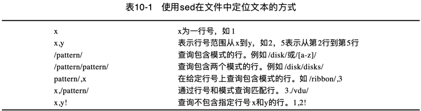
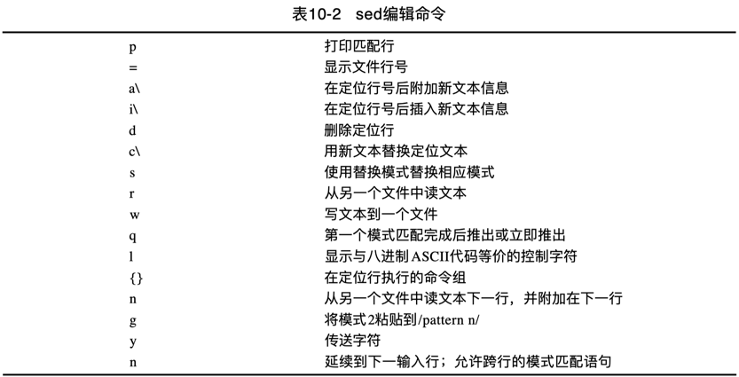

Linux 下的 sed 命令基本知识。

<!-- more -->

shell 脚本最常见的一个用途就是处理文本文件。检查日志文件、读取配置文件、处理数据元素，shell 脚本可以帮助我们将文本文件中的各种数据的日常处理任务自动化。

对于日常工作中的文本编辑需求，可以选择 vscode 这种 GUI 客户端或 vim 这种 CUI 客户端进行操作，vscode 和 vim 这两种编辑器都支持通过鼠标或键盘来完成交互式编辑工作。

有时候需要自动处理（编辑）文本文件，但是又不想动用全副武装的交互式文本编辑器。此时，需要一个能够实现自动格式化、插入、修改或删除文本元素的简单非交互式命令行编辑器。

Unix/Linux 世界，提供了两个广泛使用的命令行编辑器：`sed` 和 `awk`。

## sed

**sed**（`s`tream `ed`itor）意即流式编辑器，和普通的交互式文本编辑器恰好相反。
流式编辑器基于预先提供的一组规则命令来操作数据流，实现无交互静默编辑。

1. **流** 可以是管道重定向的 STDIN，也可以是文件。  
2. **规则** 要么从命令行中输入，要么存储在一个脚本文件中。  

sed 流编辑器的基本处理单位是 **行**，即按顺序逐行处理。在流编辑器将所有命令与一行数据匹配完毕后，会读取下一行数据并重复这个过程，直至处理完流中的所有数据行。  

sed 编辑器一般会执行下列操作：

1. 一次从输入中读取一行数据；  
2. 根据所提供的编辑器命令匹配数据；  
3. 按照命令修改（编辑）流中的数据；  
4. 将编辑后的新的数据输出到 STDOUT。  

需要明白的是，sed 编辑器并不会修改原始文本文件的内容。它只是将修改后的数据发送到 STDOUT，原始文本文件依然保留着原始数据。  
或者说，sed 编辑器并不与初始化文件打交道，它操作的只是一个拷贝，然后所有的改动如果没有重定向到一个文件，将输出到屏幕。  

### format

sed 命令的一般格式如下：

```Shell
sed options command-script input-file
```

### options

sed 主要有5个常用命令选项：

选项         | 描述
------------|------------------------------------------------
`-n`        | 按行读取输入时，不逐行回显，可使用 print 命令输出指定行
`-e script` | 在处理输入中，将 script 中指定的命令添加到已有的命令中
`-f file`   | 在处理输入中，将 file 中指定的命令添加到已有的命令中
`-E`(`-r`)  | 支持扩展型正则表达式（ERE）
`-i`        | 编辑完回写（Edit in-place）

其中 `script` 参数指定了应用于流数据上的单个命令。

#### -n

sed 在逐行读取处理输入文本时，默认会将读取到的每一行回显到标准控制台，再执行处理。

`-n` 选项将禁止 sed 默认的逐行读取回显，但模式匹配后的 `p` 标记可指定输出，二者配合的效果是只输出匹配定位的行。

```Shell
# macOS/FreeBSD/Darwin
	-n	     By	default, each line of input is echoed to the standard output
	     after all of the commands have been applied to it.	 The -n	option
	     suppresses	this behavior.

# unix/POSIX
	-n
	Suppress the default output (in which each line, after it is examined for editing, is written to standard output). Only lines explicitly selected for output are written.

# linux
       -n, --quiet, --silent

              suppress automatic printing of pattern space
```

以下在第二行之后追加一行，默认会打印所有行：

```Shell
# macOS
$ sed '2 a\
quote> append one line after second line
quote> ' data.txt

One line of test text.
Two lines of test text.
append one line after second line
Three lines of test text.
```

以下脚本原意是打印第二行，但是却打印了所有行，外加打印第二行。

```Shell
$ cat data.txt
One line of test text.
Two lines of test text.
Three lines of test text.

$ sed '2p' data.txt
One line of test text.
Two lines of test text.
Two lines of test text.
Three lines of test text.
```

加上 `-n` 之后，不回显读取的行，只执行p(rint)打印第二行，符合预期。

```Shell
$ sed -n '2p' data.txt
Two lines of test text.
```

#### -i

`-i` 选项支持将编辑操作的结果回写到源文件。

```Shell
# macOS/FreeBSD/Darwin
     -i	extension
	     Edit files	in-place similarly to -I, but treat each file indepen-
	     dently from other files.  In particular, line numbers in each
	     file start	at 1, the "$" address matches the last line of the
	     current file, and address ranges are limited to the current file.
	     (See Sed Addresses.)  The net result is as	though each file were
	     edited by a separate sed instance.

     -I extension
             Edit files in-place, saving backups with the specified extension.  If a zero-length extension
             is given, no backup will be saved.  It is not recommended to give a zero-length extension when
             in-place editing files, as you risk corruption or partial content in situations where disk
             space is exhausted, etc.

# linux

       -i[SUFFIX], --in-place[=SUFFIX]

              edit files in place (makes backup if SUFFIX supplied)
```

`-i` 参数用于指定备份文件的后缀。

> 当只回写而不需要备份时，Linux/Unix 平台可省略 -i extension 参数。

```Shell
# macOS、Linux，修改回写之前，先备份 Test.txt.bak
sed -i '.bak' 's/main/fun/g' 'Test.txt'
```

**注意**：在 macOS 平台上，即使不需要备份，也必须指定 -i extension 参数。

此时，可指定长度为0的空字符串：

```Shell
# macOS
sed -i '' 's/main/fun/g' 'Test.txt'
```

### match

因为 sed 是一个非交互性编辑器，必须通过行号或正则表达式指定要操作的文本行。

默认情况下，在 sed 编辑器中使用的命令会作用于文本数据的所有行。如果只想将命令作用于特定行或某些行，则必须进行行寻址（line addressing）或模式匹配。

可见，sed 定位要编辑的对象（文本行）的方式有两种：

1. 以数字形式标示行（区间）；  
2. 使用文本模式来过滤出行；  



行号和模式可以混合界定区间：

- `/pattern/, line_number`: 匹配模式到指定行区间；  
- `line_number, /pattern/`: 指定行到匹配模式区间；  

### edit

sed 提供了以下编辑命令：



## basic

不指定 input-file 的默认情况下，sed 编辑器会将指定的命令应用到 STDIN 输入流上。  
这样，可以直接将数据通过管道输入 sed 编辑器处理。  

### 在命令行定义编辑器命令

在命令行使用 sed 命令时，要加单引号，也允许加双引号。

以下通过sed命令过滤显示文件中指定行号对应的行：

```Shell
# 打印第1行
$ sed -n '1p' file.txt

# 打印第2行
$ sed -n '2p' file.txt

# 打印前3行，然后退出
sed '3 q' file.txt

# 打印第4~8行
sed -n '4,8p' file.txt

# 打印末尾行
$ sed -n '$p' file.txt

# 打印整个文件
$ sed -n '1,$p' file.txt
```

以下通过sed命令过滤不显示文件中指定行号对应的行：

```Shell
# 打印除第3行外的所有其他行
sed -n '3!p' file.txt

# 打印除前3行外的所有其他行
sed -n '1,3!p' file.txt

# 打印除第2~4行外的所有其他行
sed -n '2,4!p' file.txt
```

#### 输出到文件

由于不与源文件直接交互，如果想要保存改动的内容，将所有输出重定向到一个文件即可。

例如：过滤出 input-file.txt 文件中指定范围的行到 output-file.txt 文件。

```Shell
$ sed -n '100,199p' input-file.txt > output-file.txt
```

或使用 `w` 写入命令：

```Shell
$ sed -n '100,199 w output-file.txt' input-file.txt
$ sed -n '100,199w output-file.txt' input-file.txt
```

#### 模式匹配示例

示例1：从 bak.code.yml 文件中匹配出 CR owner 规则区块，`-n` 指定只输出匹配结果：

```Shell
sed -n '/- path: \/Classes\/ui\/DeviceMgr\//,/owner_rule/p' bak.code.yml
```

示例2：过滤打印 git 冲突文件中 ours 部分：

```Shell
$ sed -n '/^<<<<<<< HEAD$/,/^=======$/p' git-Conflict-File.h
```

示例3：过滤打印 git 冲突文件中 theirs incoming 结尾分隔行（形如 `>>>>>>> origin/master`）：

```Shell
$ sed -n '/^>>>>>>> /p' git-Conflict-File.h
```

示例4：过滤打印 git 冲突文件中 theirs 部分：

```Shell
$ sed -n '/^=======$/,/^>>>>>>> /p' git-Conflict-File.h
```

`svn log -v | sed -n '/fan/,/-----$/ p'`

### 在命令行使用多个编辑器命令

命令之间必须用分号（`;`）隔开，并且在命令末尾和分号之间不能有空格。

以下示例打印第2行的行号，然后打印第2行的内容：

```Shell
$ sed -n '2=; 2p' detail.txt
```

也可像 grep 那样，通过 `-e` 指定多条命令：

```Shell
$ sed -n -e '2=' -e '2p' detail.txt
```

以下两句 sed 命令等价，都是打印匹配行号和行内容：

```Shell
sed -n -e '/ID:50/=; /ID:50/p' ss.txt
sed -n -e '/ID:50/=' -e '/ID:50/p' ss.txt
```

在单行上执行多条命令，还可以用花括号（`{}`）将多条命令组合在一起：

```Shell
sed -n '2{=;p}' detail.txt
sed -n '/ID:50/{=;p}' ss.txt
```

但是 macOS 上不支持这种区块代码在一行执行：

```Shell
$ sed -n '2{=;p}' detail.txt
sed: 1: "2{=;p}": extra characters at the end of p command
```

需要在 p 命令处换行：换行后会出现 *次提示符*（`qoute> `） ，输入将闭合大括号及封尾单引号，最后输入处理文件参数，换行执行。

```Shell
$ sed -n '2{=;p
quote> }' detail.txt

# 或者这样写

$ sed -n '2{
quote> =
quote> p
quote> }' detail.txt
```

必须要记住，要在封尾单引号所在行结束命令。
bash shell 命令一旦发现了封尾的单引号，就会执行命令。
开始执行后，sed 命令就会将你指定的每条命令应用到文本文件的每一行上。

也可直接将写好的跨行代码块整体复制粘贴到命令行执行，不用在命令行逐行输入：

```Shell
sed -n '2{=;p
    }' detail.txt

# 或者这样写

sed -n '2{
    =
    p
}' detail.txt
```

如果不指定行，默认对数据流逐行处理。以下逐行打印行号和内容：

```Shell
$ sed -n '{
    =
    p
}' detail.txt
```

### 从文件中读取编辑器命令

如果有大量要处理的 sed 命令，那么可以将它们放进一个单独的脚本文件中。
sed 命令通过 `-f` 选项来指定从脚本文件读取命令执行。

```Shell
$ cat script1.sed
s/brown/green/
s/fox/elephant/
s/dog/cat/

$ sed -f script1.sed detail.txt
The quick green elephant jumps over the lazy cat.
The quick green elephant jumps over the lazy cat.
The quick green elephant jumps over the lazy cat.
The quick green elephant jumps over the lazy cat.
```

在脚本文件中，不必在每条命令后面添加一个分号，sed 编辑器知道每行都是一条独立的命令。

#### shebang

也可考虑在 sed 脚本开头添加 Shebang 标示脚本语言执行命令。

macOS: `#!/usr/bin/sed -f`  
linux: `#!/bin/sed -f`  

> 具体执行 `which sed` 查看 sed 命令位置。

这样，就可以直接像执行 shell 脚本一样，这样书写：

```Shell
$ chmod u+x script1.sed

$ ./script1.sed detail.txt
The quick green elephant jumps over the lazy cat.
The quick green elephant jumps over the lazy cat.
The quick green elephant jumps over the lazy cat.
The quick green elephant jumps over the lazy cat.
```
