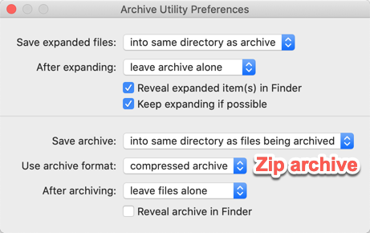

linux 下的 压缩/解压缩（zip/unzip）命令。

<!-- more -->

[macOS 之 zip unzip 命令](https://blog.csdn.net/yxys01/article/details/73848720)  

将当前目录下，除了 `donotinclude.h`、`orthis.h` 之外的所有 `.h` 和 `.c` 文件压缩打包成 archive：

```
zip archive "*.h" "*.c" -x donotinclude.h orthis.h > tofile
```

## archive

zip 打包当前目录：

```
zip -r archive.zip .
zip -r archive.zip ./*
```

zip 打包 log 文件：

```
FAN-MB1:zip $ zip -v avg_speed ~/Downloads/Logs/*-avg_speed.log
  adding: ~/Downloads/Logs/2019-12-01-10-avg_speed.log	(in=2394) (out=795) (deflated 67%)
  adding: ~/Downloads/Logs/2019-12-01-11-avg_speed.log	(in=1638) (out=642) (deflated 61%)
  adding: ~/Downloads/Logs/2019-12-01-15-avg_speed.log	(in=1640) (out=656) (deflated 60%)
  adding: ~/Downloads/Logs/2019-12-01-21-avg_speed.log	(in=1184) (out=472) (deflated 60%)
total bytes=6856, compressed=2565 -> 63% savings

FAN-MB1:zip $ zip -v map_image ~/Downloads/Images/map-*.png
  adding: Users/faner/Downloads/Images/map-深圳市东湖公园.png 	(in=2619042) (out=2597184) (deflated 1%)
  adding: Users/faner/Downloads/Images/map-深圳市梧桐山森林公园.png 	(in=2592064) (out=2567088) (deflated 1%)
  adding: Users/faner/Downloads/Images/map-深圳市民中心周边公园.png 	(in=2888867) (out=2877121) (deflated 0%)
total bytes=8099973, compressed=8041393 -> 1% savings
```

### exclude

```
zip -r archive.zip . -x .DS_Store
zip -r archive.zip . -x __MACOSX/\*

zip -r archive.zip . -x \*/.DS_Store \*/__MACOSX/\*
```

### append

[Linux zip追加文件](https://www.acgist.com/article/297.html)  

向已存在的 `exist.zip` 中追加打包 `extra.txt` 文件。

```
zip exist.zip extra.txt
```

### zip分卷压缩

[zip分卷压缩](https://blog.csdn.net/chenxi910911/article/details/89140607)

1. 首先将其压缩成一个大的zip压缩包之后再分卷

```
zip -r a.zip dir
```

2. 将压缩完的大压缩包zip分卷

```
zip -s 100M a.zip --out b.zip
```

命令执行完会在文件夹下生成 b.zip、b.z01、b.z02 ...等。

## preview

[Preview an archive contents without extracting it](https://apple.stackexchange.com/questions/364706/preview-an-archive-contents-without-extracting-it)  

- [zip](https://smallbusiness.chron.com/zip-files-unix-53642.html): `unzip -l FILE.zip`，或 `-v`  
- tar.gz: `tar -tzvf FILE.tar.gz`  
- tar.bz2: `tar -tjvf FILE.tar.bz2` 或 `bunzip2 -c FILE.tar.bz2 | tar tvf -`  
- .7z: `7z l FILE.7z`  

**其他**：

```
uncompress -c filename.Z
zcat filename.Z
```

---

`file` 命令查看文件属性：

```
faner@FAN-MB1:~/Downloads/zip
> file avg_speed.zip
avg_speed.zip: Zip archive data, at least v2.0 to extract
faner@FAN-MB1:~/Downloads/zip
> file -bI avg_speed.zip
application/zip; charset=binary
```

`unzip -l` 预览压缩包内容：

```
FAN-MB1:zip $ unzip -l avg_speed.zip
Archive:  avg_speed.zip
  Length      Date    Time    Name
---------  ---------- -----   ----
     2394  12-01-2019 16:54   Users/faner/Downloads/Logs/2019-12-01-10-avg_speed.log
     1638  12-01-2019 16:55   Users/faner/Downloads/Logs/2019-12-01-11-avg_speed.log
     1640  12-01-2019 17:00   Users/faner/Downloads/Logs/2019-12-01-15-avg_speed.log
     1184  12-01-2019 21:38   Users/faner/Downloads/Logs/2019-12-01-21-avg_speed.log
---------                     -------
     6856                     4 files

FAN-MB1:zip $ unzip -l map_image.zip
Archive:  map_image.zip
  Length      Date    Time    Name
---------  ---------- -----   ----
  2619042  12-02-2018 10:37   Users/faner/Downloads/Images/map-深�?��?�?�?�?��?�.png
  2592064  12-02-2018 10:38   Users/faner/Downloads/Images/map-深�?��?梧�?山森�??�?��?�.png
  2888867  12-02-2018 10:33   Users/faner/Downloads/Images/map-深�?��?�?中�?�?�边�?��?�.png
---------                     -------
  8099973                     3 files
```

### delete hidden items

用 macOS Archive Utility.app 打包生成的 zip 文件中，通常包含 `.DS_Store` 文件。
[如何删除 macOS 压缩包中的隐藏文件](https://sspai.com/post/44953)？

`zip -d`（`--delete`）: Remove (delete) entries from a zip archive.

删除 macOS 下打包进去的 `.DS_Store`：

```
zip -d test.zip .DS_Store
```

```
zip -d foo foo/tom/junk foo/harry/\* \*.o
zip -d foo foo/tom/junk "foo/harry/*" "*.o"
```

---

用 macOS Archive Utility.app 打包生成的 zip 文件中，通常包含 `__MACOSX/` 目录。

```
FAN-MB1:zip $ unzip -l map_image-arch.zip
Archive:  map_image-arch.zip
  Length      Date    Time    Name
---------  ---------- -----   ----
  2619042  12-02-2018 10:37   map-深�?��?�?�?�?��?�.png
      575  12-02-2018 10:37   __MACOSX/._map-深�?��?�?�?�?��?�.png
  2592064  12-02-2018 10:38   map-深�?��?梧�?山森�??�?��?�.png
      575  12-02-2018 10:38   __MACOSX/._map-深�?��?梧�?山森�??�?��?�.png
  2888867  12-02-2018 10:33   map-深�?��?�?中�?�?�边�?��?�.png
      575  12-02-2018 10:33   __MACOSX/._map-深�?��?�?中�?�?�边�?��?�.png
---------                     -------
  8101698                     6 files
```

执行 `zip -d` 删除 `__MACOSX/` 目录下的内容：

```
FAN-MB1:zip $ zip -d map_image-arch.zip __MACOSX/\*
deleting: __MACOSX/._map-深圳市东湖公园.png
deleting: __MACOSX/._map-深圳市梧桐山森林公园.png
deleting: __MACOSX/._map-深圳市民中心周边公园.png

FAN-MB1:zip $ unzip -l map_image-arch.zip
Archive:  map_image-arch.zip
  Length      Date    Time    Name
---------  ---------- -----   ----
  2619042  12-02-2018 10:37   map-深�?��?�?�?�?��?�.png
  2592064  12-02-2018 10:38   map-深�?��?梧�?山森�??�?��?�.png
  2888867  12-02-2018 10:33   map-深�?��?�?中�?�?�边�?��?�.png
---------                     -------
  8099973                     3 files
```

如果想保留原始压缩包，可通过 `-O output-file` 指定保存操作后的结果。

> 同时删除打包进去的隐藏文件和文件夹：`zip -d file.zip .DS_Store __MACOSX/\*`

## extract

利用 unzip 命令解压 zip 到同名子目录（`-d` 指定）：

```
faner@FAN-MB1:~/Downloads/zip
> unzip avg_speed-arch.zip -d avg_speed-arch
Archive:  avg_speed-arch.zip
  inflating: avg_speed-arch/2019-12-01-10-avg_speed.log
  inflating: avg_speed-arch/__MACOSX/._2019-12-01-10-avg_speed.log
  inflating: avg_speed-arch/2019-12-01-11-avg_speed.log
  inflating: avg_speed-arch/__MACOSX/._2019-12-01-11-avg_speed.log
  inflating: avg_speed-arch/2019-12-01-15-avg_speed.log
  inflating: avg_speed-arch/__MACOSX/._2019-12-01-15-avg_speed.log
  inflating: avg_speed-arch/2019-12-01-21-avg_speed.log
  inflating: avg_speed-arch/__MACOSX/._2019-12-01-21-avg_speed.log
```

只解压其中的某一个文件到当前目录：

```
faner@FAN-MB1:~/Downloads/zip
> unzip avg_speed-arch.zip 2019-12-01-10-avg_speed.log
Archive:  avg_speed-arch.zip
  inflating: 2019-12-01-10-avg_speed.log
```

## GUI

macOS 原生自带了 Archive Utility.app 软件：



1. After expanding 可选择在解压后保留或移除压缩包：

- [x] leave archive alone  
- [ ] move archive to Trash  
- [ ] delete archive  

2. Use archive format 可以从 Compressed archive 修改为 Zip archive。

[How to Open and Browse ZIP Files on macOS Without Unarchiving Them](https://www.howtogeek.com/308468/how-to-open-and-browse-zip-files-on-macos-without-unarchiving-them/)

1. `Dr. Unarchiver`: Straightforward ZIP, RAR, and Other Archive Management  
2. `Zipster`: Mount ZIP Files in the Finder (and Only ZIP Files)  

[Mac 上最方便的压缩与解压缩软件是什么？](https://www.zhihu.com/question/20383279)  

[Keka](https://www.keka.io/en/)  
[The Unarchiver](https://theunarchiver.com/)  

[ezip](https://ezip.awehunt.com/)  
https://apps.apple.com/cn/app/id1127253508?mt=12

[BetterZip](https://macitbetter.com/)  
[Bandizip](https://www.bandisoft.com/)  
