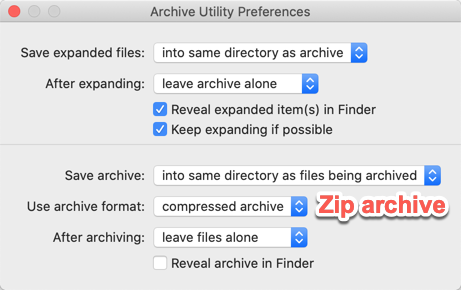

linux 下的 压缩/解压缩（zip/unzip）命令。

<!-- more -->

[macOS 之 zip unzip 命令](https://blog.csdn.net/yxys01/article/details/73848720)  

## zip

`zip` - package and compress (archive) files

### format

The basic command format is `zip options archive inpath inpath ...`

where `archive` is a new or existing zip archive and `inpath` is a directory or file path optionally including wildcards.

- If the name of the zip archive *does not* contain an extension, the extension *`.zip`* is added.

zip 打包当前目录：

```bash
zip -r archive.zip .
zip -r archive.zip ./*
```

zip 打包 log 文件：

```bash
$ zip -v avg_speed ~/Downloads/Logs/*-avg_speed.log
  adding: ~/Downloads/Logs/2019-12-01-10-avg_speed.log	(in=2394) (out=795) (deflated 67%)
  adding: ~/Downloads/Logs/2019-12-01-11-avg_speed.log	(in=1638) (out=642) (deflated 61%)
  adding: ~/Downloads/Logs/2019-12-01-15-avg_speed.log	(in=1640) (out=656) (deflated 60%)
  adding: ~/Downloads/Logs/2019-12-01-21-avg_speed.log	(in=1184) (out=472) (deflated 60%)
total bytes=6856, compressed=2565 -> 63% savings
```

zip 打包 png 文件：

```bash
$ zip -v map_image ~/Downloads/Images/map-*.png
  adding: Users/faner/Downloads/Images/map-深圳市东湖公园.png 	(in=2619042) (out=2597184) (deflated 1%)
  adding: Users/faner/Downloads/Images/map-深圳市梧桐山森林公园.png 	(in=2592064) (out=2567088) (deflated 1%)
  adding: Users/faner/Downloads/Images/map-深圳市民中心周边公园.png 	(in=2888867) (out=2877121) (deflated 0%)
total bytes=8099973, compressed=8041393 -> 1% savings
```

### exclude

将当前目录下，除了 `donotinclude.h`、`orthis.h` 之外的所有 `.h` 和 `.c` 文件压缩打包成 archive，并将命令执行输出重定向到指定文件 `tofile`：

```bash
zip archive "*.h" "*.c" -x donotinclude.h orthis.h > tofile
```

zip 打包当前目录，排除 `.DS_Store` 文件及 `__MACOSX` 文件夹（下的所有文件）：

```bash
zip -r archive.zip . -x .DS_Store
zip -r archive.zip . -x __MACOSX/\*

zip -r archive.zip . -x \*/.DS_Store \*/__MACOSX/\*
```

### zip split

[zip分卷压缩](https://blog.csdn.net/chenxi910911/article/details/89140607)

1. 首先将其压缩成一个大的zip压缩包之后再分卷

```bash
zip -r a.zip dir
```

2. 将压缩完的大压缩包zip分卷

```bash
zip -s 100M a.zip --out b.zip
```

命令执行完会在文件夹下生成 b.zip、b.z01、b.z02 ...等。

### modes

zip now supports two distinct types of command modes, `external` and `internal`.

- The *external* modes (`add`, `update`, and `freshen`) read files from the file system (as well as from an existing archive) while the *internal* modes (`delete` and `copy`) operate exclusively on entries in an existing archive.

```bash
add
      Update existing entries and add new files.  If the archive does not exist create it.
      This is the default mode.

update (-u)
      Update existing entries if newer on the file system and add new files.  If the archive
      does not exist issue warning then create a new archive.

freshen (-f)
      Update existing entries of an archive if newer on the file system.  Does not add new
      files to the archive.

delete (-d)
      Select entries in an existing archive and delete them.

copy (-U)
      Select entries in an existing archive and copy them to a new archive.  This new mode is
      similar to update but command line patterns select entries in the existing archive
      rather than files from the file system and it uses the --out option to write the
      resulting archive to a new file rather than update the existing archive, leaving the
      original archive unchanged.
```

面对一堆文件压缩包，`zip` 命令就像是一个**无需解压就能直接操作的“虚拟档案管理员”**。如果不加区分地使用，很容易导致压缩包里混入了旧文件、漏掉了新文件，或者充斥着大量冗余备份。

为了帮你彻底理清这 5 个命令的使用场景，我们可以把 `.zip` 压缩包想象成一个**“实体档案盒”**。下面为你梳理它们各自的工作逻辑和最佳适用场景：

| 命令 (Flag) | 档案盒比喻 | 遇到新文件 | 遇到同名旧文件 | 遇到同名新文件 | 典型应用场景 |
| :--- | :--- | :---: | :---: | :---: | :--- |
| **add** (默认) | **粗暴收纳员** | 塞进去 | 直接覆盖 | 直接覆盖 | 初次打包、全量备份 |
| **update** (-u) | **精明盘点员** | 塞进去 | 留下旧的 | 替换成新的 | 增量备份、日常同步 |
| **freshen** (-f) | **版本校对员** | 视而不见 | 留下旧的 | 替换成新的 | 修复/更新部分文件 |
| **delete** (-d) | **无情剪刀手** | / | 彻底撕毁 | / | 清理敏感/冗余文件 |
| **copy** (-U --out)| **克隆分拣机** | 挑出来复制 | 留下旧的 | 复制新的过去 | 提取部分文件、格式转换 |

#### 1. `add` —— 简单粗暴的“全能打包工” (默认模式)

* **行为逻辑**：不管三七二十一，把文件扔进包里。如果没有这个包，它就顺手缝一个。
* **生动场景**：你要给朋友发送一个项目的初始代码，或者你要做一次全新的系统备份。你不在乎覆盖，因为这就是一次全新的归档。
* **命令示例**：

For example, if `foo.zip` exists and contains `foo/file1` and `foo/file2`, and the directory `foo` contains the files `foo/file1` and `foo/file3`, then `zip -r foo.zip foo` or more concisely `zip -r foo foo` will **replace** `foo/file1` in `foo.zip` and **add** `foo/file3` to `foo.zip`. After this, foo.zip contains `foo/file1`, `foo/file2`, and `foo/file3`, with `foo/file2` *unchanged* from before.

So if before the zip command is executed `foo.zip` has:

- foo/file1
- foo/file2

and directory `foo` has:

- file1
- file3

then `foo.zip` will have:

- foo/file1
- foo/file2
- foo/file3

where `foo/file1` is replaced and `foo/file3` is new.

[Linux zip追加文件](https://www.acgist.com/article/297.html)  

```bash
# 创建一个全新的 archive.zip，并把 all_files/ 下的东西全塞进去
zip -r archive.zip all_files/

# 顺手把新生成的 log.txt 也强行塞进已有的包里（覆盖同名旧文件）
zip archive.zip log.txt
```

#### 2. `update` —— 懂变通的“增量备份大师” (-u)

* **行为逻辑**：只进不出，升级换代。遇到文件系统的新文件就收下；遇到压缩包里没有的就新增；但如果文件系统里的文件比压缩包里的还要旧，它就会聪明地跳过，**绝对不会让压缩包里的文件“降级”**。
* **生动场景**：每天凌晨自动运行的备份脚本。你只希望把当天修改过的新文件更新进去，绝对不能因为不小心执行了旧脚本，就把压缩包里刚改好的最新版给覆盖了。
* **命令示例**：

  ```bash
  # 将当前目录下所有变动过的 .py 文件智能更新到备份包中
  zip -u backup.zip *.py
  ```

#### 3. `freshen` —— 苛刻的“版本更新专员” (-f)

* **行为逻辑**：铁面无私，只换旧的，绝不添新。它只会在压缩包里寻找同名文件，如果发现本地磁盘上的更新，就替换掉包里的旧版本。**如果本地有个包里没有的新文件，它会完全无视。**
* **生动场景**：你从同事那里拿到了一个大型项目压缩包，同事告诉你他修改了其中几个核心文件发给了你。你把这些核心文件放在旁边，执行 `freshen` 操作，就能精准地把包里的旧文件“刷新”成新版本，而不会被无关的新文件弄乱结构。
* **命令示例**：

  ```bash
  # 仅用当前目录下更新的文件去刷新压缩包内的同名文件
  zip -f project.zip
  ```

#### 4. `delete` —— 干净利落的“空间魔法师” (-d)

* **行为逻辑**：精准打击，物理超度。根据通配符匹配，把压缩包里指定的文件彻底抹除，且不改变其他文件。
* **生动场景**：你发现压缩包里混入了一些巨大的临时文件（如 `.DS_Store` 或 `node_modules/`），或者包含密码的配置文件不小心被打包进去了。用 `delete` 可以直接将其从压缩包内“物理销毁”，免去了先解压再重新打包的麻烦。
* **命令示例**：

用 macOS Archive Utility.app 打包生成的 zip 文件中，通常包含 `.DS_Store` 文件。[如何删除 macOS 压缩包中的隐藏文件](https://sspai.com/post/44953)？

```bash
# 删除 macOS 下打包进去的 `.DS_Store`：
zip -d archive.zip "*.DS_Store"
```

remove the entry foo/tom/junk, all of the files that start with foo/harry/, and all of the files that end with .o (in any path).

```bash
zip -d foo foo/tom/junk foo/harry/\* \*.o
zip -d foo foo/tom/junk "foo/harry/*" "*.o"
```

---

用 macOS Archive Utility.app 打包生成的 zip 文件中，通常包含 `__MACOSX/` 目录。

```bash
$ unzip -l map_image-arch.zip
Archive:  map_image-arch.zip
  Length      Date    Time    Name
---------  ---------- -----   ----
  2619042  12-02-2018 10:37   map-深�?��?�?�?�?��?�.png
      575  12-02-2018 10:37   __MACOSX/._map-深�?��?�?�?�?��?�.png
  2592064  12-02-2018 10:38   map-深�?��?梧�?山森�??�?��?�.png
      575  12-02-2018 10:38   __MACOSX/._map-深�?��?梧�?山森�??�?��?�.png
  2888867  12-02-2018 10:33   map-深�?��?�?中�?�?�边�?��?�.png
      575  12-02-2018 10:33   __MACOSX/._map-深�?��?�?中�?�?�边�?��?�.png
---------                     -------
  8101698                     6 files
```

执行 `zip -d` 删除 `__MACOSX/` 目录下的内容：

```bash
$ zip -d map_image-arch.zip __MACOSX/\*
deleting: __MACOSX/._map-深圳市东湖公园.png
deleting: __MACOSX/._map-深圳市梧桐山森林公园.png
deleting: __MACOSX/._map-深圳市民中心周边公园.png

$ unzip -l map_image-arch.zip
Archive:  map_image-arch.zip
  Length      Date    Time    Name
---------  ---------- -----   ----
  2619042  12-02-2018 10:37   map-深�?��?�?�?�?��?�.png
  2592064  12-02-2018 10:38   map-深�?��?梧�?山森�??�?��?�.png
  2888867  12-02-2018 10:33   map-深�?��?�?中�?�?�边�?��?�.png
---------                     -------
  8099973                     3 files
```

如果想保留原始压缩包，可通过 `-O output-file` 指定保存操作后的结果。

> 同时删除打包进去的隐藏文件和文件夹：`zip -d file.zip .DS_Store __MACOSX/\*`

#### 5. `copy` —— 高效的“分类克隆搬运工” (-U --out)

* **行为逻辑**：它不是修改原包，而是基于原包**生成一个全新的包**。它会把原包里符合条件的文件“复制”到新包里。如果在命令行后面再加文件/通配符，它还会顺便把本地的新文件也一并打包进这个新包里。
* **生动场景**：你有一个巨大的杂项压缩包，现在你只想把里面的图片文件提取出来发给别人。用 `copy` 可以直接过滤并重组成一个新的纯图片包，原包完好无损。
* **命令示例**：

  ```bash
  # 从 original.zip 中挑出所有 jpg 图片，复制到新生成的 photos.zip 中
  zip -U original.zip "*.jpg" --out photos.zip
  
  # 进阶：不仅提取原包里的 jpg，还把当前目录下新增的 png 也一起打包进新包
  zip -U original.zip "*.jpg" *.png --out new_archive.zip
  ```

#### 总结建议

在日常的自动化脚本或频繁的文件同步中，**最常用的是 `update` (`-u`)**，因为它最符合人类“只备份新东西”的直觉；而在需要对压缩包进行“外科手术式”精确调整时，**`delete` (`-d`)** 和 **`copy` (`-U`)** 则是提升效率的绝佳利器。

## unzip

`unzip` - list, test and extract compressed files in a ZIP archive

- `[-x xfile(s)]`: An optional list of archive members to be excluded from processing.
- `[-d exdir]`: An optional directory to which to extract files.

**OPTIONS**:

- `-f`: freshen existing files, i.e., extract *only* those files that already exist on disk and that are newer than the disk copies.
- `-l`: list archive files (short format). The names, uncompressed file sizes and modification dates and times of the specified files are printed, along with totals for all files specified. 
- `-u`: update existing files and create new ones if needed. This option performs the same function as the `-f` option, extracting (with query) files that are newer than those with the same name on disk, and in addition it extracts those files that do not already exist on disk.
- `-v`: list archive files (verbose format) or show diagnostic version info. This option has evolved and now behaves as both an option and a modifier.

### preview

[Preview an archive contents without extracting it](https://apple.stackexchange.com/questions/364706/preview-an-archive-contents-without-extracting-it)  

- [zip](https://smallbusiness.chron.com/zip-files-unix-53642.html): `unzip -l FILE.zip`，或 `-v`  
- tar.gz: `tar -tzvf FILE.tar.gz`  
- tar.bz2: `tar -tjvf FILE.tar.bz2` 或 `bunzip2 -c FILE.tar.bz2 | tar tvf -`  
- .7z: `7z l FILE.7z`  

**其他**：

```bash
uncompress -c filename.Z
zcat filename.Z
```

---

`file` 命令查看文件属性：

```bash
$ file avg_speed.zip
avg_speed.zip: Zip archive data, at least v2.0 to extract

$ file -bI avg_speed.zip
application/zip; charset=binary
```

`unzip -l` 预览压缩包内容：

```bash
$ unzip -l avg_speed.zip
Archive:  avg_speed.zip
  Length      Date    Time    Name
---------  ---------- -----   ----
     2394  12-01-2019 16:54   Users/faner/Downloads/Logs/2019-12-01-10-avg_speed.log
     1638  12-01-2019 16:55   Users/faner/Downloads/Logs/2019-12-01-11-avg_speed.log
     1640  12-01-2019 17:00   Users/faner/Downloads/Logs/2019-12-01-15-avg_speed.log
     1184  12-01-2019 21:38   Users/faner/Downloads/Logs/2019-12-01-21-avg_speed.log
---------                     -------
     6856                     4 files

$ unzip -l map_image.zip
Archive:  map_image.zip
  Length      Date    Time    Name
---------  ---------- -----   ----
  2619042  12-02-2018 10:37   Users/faner/Downloads/Images/map-深�?��?�?�?�?��?�.png
  2592064  12-02-2018 10:38   Users/faner/Downloads/Images/map-深�?��?梧�?山森�??�?��?�.png
  2888867  12-02-2018 10:33   Users/faner/Downloads/Images/map-深�?��?�?中�?�?�边�?��?�.png
---------                     -------
  8099973                     3 files
```

### extract

利用 unzip 命令解压 zip 到同名子目录（`-d` 指定）：

```bash
$ unzip avg_speed-arch.zip -d avg_speed-arch
Archive:  avg_speed-arch.zip
  inflating: avg_speed-arch/2019-12-01-10-avg_speed.log
  inflating: avg_speed-arch/__MACOSX/._2019-12-01-10-avg_speed.log
  inflating: avg_speed-arch/2019-12-01-11-avg_speed.log
  inflating: avg_speed-arch/__MACOSX/._2019-12-01-11-avg_speed.log
  inflating: avg_speed-arch/2019-12-01-15-avg_speed.log
  inflating: avg_speed-arch/__MACOSX/._2019-12-01-15-avg_speed.log
  inflating: avg_speed-arch/2019-12-01-21-avg_speed.log
  inflating: avg_speed-arch/__MACOSX/._2019-12-01-21-avg_speed.log
```

只解压其中的某一个文件到当前目录：

```bash
$ unzip avg_speed-arch.zip 2019-12-01-10-avg_speed.log
Archive:  avg_speed-arch.zip
  inflating: 2019-12-01-10-avg_speed.log
```

## GUI

macOS 原生自带了 Archive Utility.app 软件：



1. After expanding 可选择在解压后保留或移除压缩包：

- [x] leave archive alone  
- [ ] move archive to Trash  
- [ ] delete archive  

2. Use archive format 可以从 Compressed archive 修改为 Zip archive。

[How to Open and Browse ZIP Files on macOS Without Unarchiving Them](https://www.howtogeek.com/308468/how-to-open-and-browse-zip-files-on-macos-without-unarchiving-them/)

1. `Dr. Unarchiver`: Straightforward ZIP, RAR, and Other Archive Management  
2. `Zipster`: Mount ZIP Files in the Finder (and Only ZIP Files)  

[Mac 上最方便的压缩与解压缩软件是什么？](https://www.zhihu.com/question/20383279)  

[Keka](https://www.keka.io/en/)  
[The Unarchiver](https://theunarchiver.com/)  

[ezip](https://ezip.awehunt.com/)  
https://apps.apple.com/cn/app/id1127253508?mt=12

[BetterZip](https://macitbetter.com/)  
[Bandizip](https://www.bandisoft.com/)  
