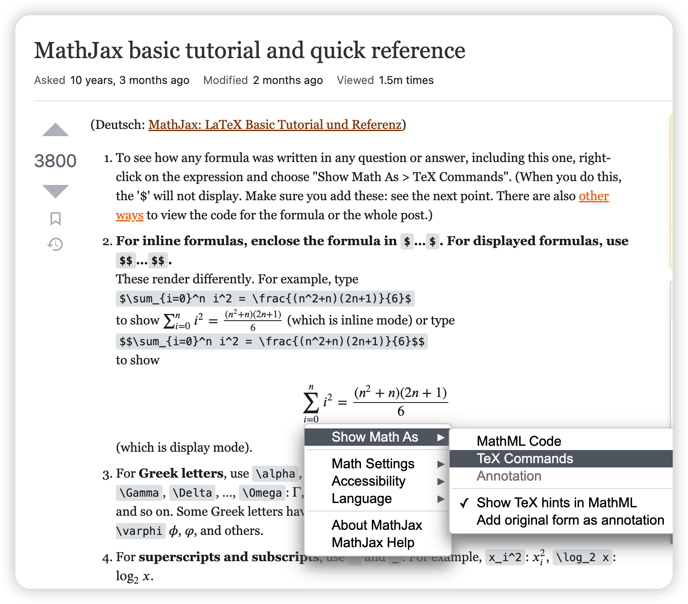
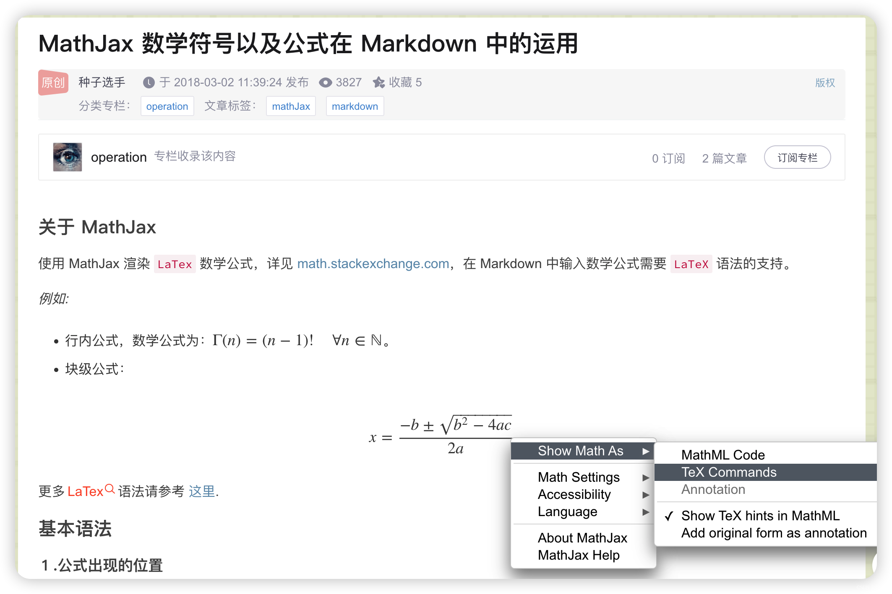
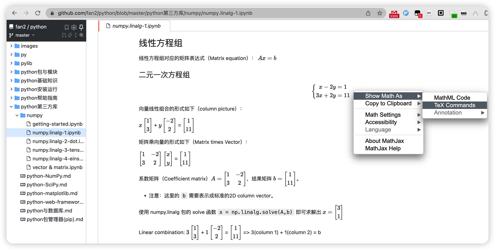

本文梳理了 Markdown 插入数学公式。

<!-- more -->

## 标识

[TeX and LaTeX math delimiters](https://docs.mathjax.org/en/latest/input/tex/delimiters.html)

- Inline math: `$...$`, will be rendered inline.
- Display (block) math: `$$...$$`, will be rendered in block.

在MathJax中，默认的displayed公式分隔符有 `$$...$$` 和 `\[...\]` ，而默认的inline公式分隔符为 `\(...\)`，当然这些都是可以自定义的，具体配置请参考文档。在本文中，使用 `$$...$$` 作为displayed分隔符，`$...$` 作为inline分隔符。

需要注意的是，CSDN markdown、vscode markdown内置预览插件等编辑器中，行内数学公式的美元符号前后均**不能有空格**，否则无法正常渲染。

> 在 vscode markdown preview enhanced 插件和 jupyter notebook markdwn cell 中，行内数学公式的美元符号前后有空格也能正常渲染。

1. Inline math equations are wrapped in **single** dollar signs.

	- For example, `$x^2$` becomes $x^2$.
	- Pythagorean Theorem: `$a^2 + b^2 = c^2$`: $a^2 + b^2 = c^2$.
	- Einstein’s Theory of Special Relativity: `e=mc^2`: $e=mc^2$.

2. KaTeX blocks begin and end with **two** dollar signs:

	- `% comment` 为注释行，不会被渲染展示。
	- 行末插入 `\\` 或 `\cr` 换行。

```TeX
$$
% Pythagorean Theorem
a^2 + b^2 = c^2 \\

% Einstein’s Theory of Special Relativity
e=mc^2
$$
```

$$
% % Pythagorean Theorem
a^2 + b^2 = c^2 \\
% Einstein’s Theory of Special Relativity
e=mc^2
$$

## Environments

环境变量的起始标记为 `\begin{ENV}` ，结束标记为 `\end{ENV}`。

常用的环境变量包括以下：

### 公式/等式

1. 单行等式：`equation`，不支持 `\\` 换行。需内嵌 `split` 分行，相当于 `$$ ... $$` 加 `\\` 换行，但 equation 指定的公式组会添加（一个）自动编号。
2. 对齐等式：`align`（`aligned`,`alignat`,`alignedat`），默认右对齐，可使用 `&` 指定对齐点（位置）；`gather`（`gathered`），默认居中对齐，不支持指定对齐点。

	- align、gather 会自动给每一行编号，end 后可追加 `\tag{N}`，忽略自动行编号，指定公式组编号。

3. 条件等式：`cases`（`rcases`），不会自动添加编号，支持使用 `&` 指定对齐点。

### 数组/矩阵

1. 数组/行：`array`，begin前面可添加 `\def\arraystretch{LINE-SPACE}` 前缀指定行间距。
2. 矩阵：`matrix`，支持 `pmatrix`、`bmatrix`、`Bmatrix`、`vmatrix`、`Vmatrix` 等扩展标记。

### 格式控制

1. `align`、`alignat`、`gather` 只能用于 Display 块模式（ `$$...$$` ），Inline 行内模式（ `$...$` ）得使用 `aligned`、`alignedat`、`gathered` 。
	- To input a numerical LPP, use `alignat` instead of align to get better alignment between signs, variables and coefficients.
2. 对于公式 `equation`、`align`、`alignat`、`gather` 自动编号，可在 ENV 名称添加 `*` 忽略自动编号，例如 `equation*`、`align*`、`gather*`。
	- 也可以通过显式指定 `\nonumber` 或 `\notag` 来忽略（某一行）自动编号。
3. ENV块结尾添加 `\tag` 标签支持进行序号标记或文字注释，将替换覆盖自动（行）编号。注意：行内公式不支持该标签！
	- `align`, `alignat`, `gather` 支持为每一行自定义 `\tag`。

## 空格

CSDN markdown、vscode markdown内置预览插件等编辑器中，行内数学公式的美元符号前后均**不能有空格**，否则不能正常渲染。

单个美元符号和双美元符号跨行公式块中的键盘空格将被忽略，如果想在公式中插入空格，需采用特殊符号。

1. 无空格 `$a b$`：$ab$
2. 小空格，符号`\,`，$a\,b$
3. 中空格，符号 `\:`，$a\:b$
4. 大空格，符号 `\ `，$a\ b$
5. 四空格 `$a \quad b$`：$a \quad b$
6. 八空格 `$a \qquad b$`：$a \qquad b$

## 边界

点积符号为 `\cdot`，a和b的点积写成 `$a\cdotb$` 将报错，因为反斜杠后面都将视作符号而解析失败。
此时，可在点积符号结束处插入空格 `$a\cdot b$`：$a\cdot b$。

另外一种思路是，将反斜杠符号整体加上大括号 `$a{\cdot}b$` 则可正确解析为 $a{\cdot}b$（貌似更紧凑）。

如果要用多个字母作为上、下标（`^`、`_`），则可用大括号将多个字母括起来作为一个整体脚标使用。

## 修饰

1. `\boxed{...}` 支持将公式添加边框：`$\boxed{e^{i\pi}+1=0}$`（$\boxed{e^{i\pi}+1=0}$）。
2. `\color{color} formulae` 支持指定后续公式的颜色：`$\color{blue} F=ma$`（$\color{blue} F=ma$）。
3. `\textcolor{color} {formula}` 支持指定后续大括号内的公式文本颜色：`$\textcolor{blue}{F=ma}$`（$\textcolor{blue}{F=ma}$）。
4. `\colorbox{color} {formula}` 支持为后续大括号内的公式添加背景颜色：`$\colorbox{yellow}{F=ma}$`（$\colorbox{yellow}{F=ma}$）。

## 括号

1. 使用原始的小括号 `( )` 、中括号 `[   ]` 得到的大小是固定的。
2. 由于大括号 `{}` 被用于分组，因此可以使用 `\lbrace` 和 `\rbrace` 来表示。
3. 使用 `\left(` 或 `\right)` 可使括号大小与包裹其中的公式列高自动适应（适用于所有括号类型）。

| 标记 | 含义  | 示例 |
|--|--|--|
| 竖线 | `$\vert$`、`$\mid$` | $a \vert b$、$a \mid b$ |
| 闭合单竖线 | `$\lvert abs \rvert$` | $\lvert abs \rvert$ |
| 闭合双竖线 | `$\lVert v \rVert$` | $\lVert v \rVert$ |
| 尖括号 | `$\lang  \rang$` 或 `$\langle \rangle$` | $\lang a \vert b \rang$ 或 $\langle a \mid b \rangle$ |
| 大括号 | `$\lbrace \rbrace$` | $\lbrace 1,2,3,4,\ldots \rbrace$ |

## 点号

| 符号 | 意义 | 示例 |
|--|--|--|
| `\cdot` / `\sdot` / `\cdotp` | 中点 | $\vec{c} = \vec{a} \cdot \vec{b}$ |
| `\ldots` / `\dotsc` / `\dotso` / `\mathellipsis` | 底端对齐的省略号 | $1,2,\ldots,n$ |
| `\cdots` / `\dots` / `\dotsb` / `\dotsi` / `\dotsm` | 中线对齐的省略号 | $x_1^2 + x_2^2 + \cdots + x_n^2$ |
| `\vdots` | 竖直对齐的省略号 |  $\vdots$ |
| `\ddots` | 斜对齐(左上右下)的省略号 | $\ddots$ |


```TeX
$$f(x_1,x_2,\underbrace{\ldots}_{\rm ldots} ,x_n) = x_1^2 + x_2^2 + \underbrace{\cdots}_{\rm cdots} + x_n^2$$
```

$$f(x_1,x_2,\underbrace{\ldots}_{\rm ldots} ,x_n) = x_1^2 + x_2^2 + \underbrace{\cdots}_{\rm cdots} + x_n^2$$

下文中多元一次方程组的系数矩阵，即综合运用了中省略号、竖省略号和斜对齐省略号。

## 脚标

对数：`$\log_xy$`（$\log_xy$）、`$\log_216 = 4$`（$\log_216=4$）
多项式中x的幂：`$x^2$`（$x^2$）、`$x^{10}$`（$x^{10}$）、`$E=mc^2$`（$E=mc^2$）
下标序号：`$x_i$`（$x_i$）、`$x_{i+1}$`（$x_{i+1}$）、`$x_{ij}$`（$x_{ij}$）
同时存在上下标，先写上标（`$x^2_i$`）或先写下标（`$x_i^2$`），结果都为 $x_i^2$。

- 排列组合数可以写为 `$C{^k_n}$`（$C{^k_n}$）或 `$C{k \atop n}$`（$C{k \atop n}$）
- inner product: `$\lt x \vert y \gt = x^Ty$`（$\lt x \vert y \gt = x^Ty$）
- outer product: `$\lvert x \gt \lt y \rvert =xy^T$`（$\lvert x \gt \lt y \rvert =xy^T$）
- 圆面积：`$S=\pi{r^2}$`（$S=\pi{r^2}$）；圆球面积：`$S=4πr^2$`（$S=4πr^2$）；圆球体积：`$V_3＝\frac{4{\pi}r^3}{3}$`（$V_3＝\frac{4{\pi}r^3}{3}$）。
- 欧拉公式：`$e^{i\theta} = \cos\theta + i·\sin\theta$`（$e^{i\theta} = \cos\theta + i·\sin\theta$）、`$e^{i\pi}+1=0$`（$e^{i\pi}+1=0$）。


**注意**：若要用多个字母作为脚标，则需要用大括号将多个字母括起来作为整体脚标。

如果不加大括号，则符号（`^`、`_`）只会将紧邻其后第一个字母视作脚标，后续字母将渲染为普通字母：`$x^10$`（$x^10$）、`$x_ij$`（$x_ij$）。

## 分数

`$\frac md$` 表示分式 $\frac md$，第一个字母是分子，第二个字母是分母。

用大括号将复合分子、分母括起来：`\frac{5}{3\times{5}}`：$\frac{5}{3\times{5}}$

也可使用大括号内的 `\over` 实现：`${a+1 \over b+1}$`：${a+1 \over b+1}$

分数幂及等效的开方表示：`$x^{\frac 1n} = \sqrt[n]{x}$`（$x^{\frac 1n} = \sqrt[n]{x}$）

组合数：`${n+1 \choose 2k}$` 或 `$\binom{n+1}{2k}$`：$C{^k_n} = {k \choose n} = \frac{n!}{k!(n-k)!}$

> TeX expr: `$C{^k_n} = {k \choose n} = \frac{n!}{k!(n-k)!}$`

## 极限
`$\lim_{x\to 0}lnx$` 显示为 $\lim_{x\to 0}lnx$。

自然底数 e 的定义式：$e = \lim_{n\rightarrow+\infty}(1+\frac{1}{n})^n = \lim_{n\rightarrow+\infty}(1+\frac{100\%}{n})^n$

> TeX expr: `$e = \lim_{n\rightarrow+\infty}(1+\frac{1}{n})^n = \lim_{n\rightarrow+\infty}(1+\frac{100\%}{n})^n$`

假设增长率为虚数是否成立：$e^i = \lim_{n\rightarrow+\infty}(1+\frac{100\%·i}{n})^n$ ？

> TeX expr: `$e^i = \lim_{n\rightarrow+\infty}(1+\frac{100\%·i}{n})^n$`

## 希腊字母

小写希腊字母：例如 `$\gamma$` 显示为 $\gamma$，`$\phi$`（$\phi$）。
大写希腊字母：首字母大写，例如 `$\Gamma$ ` 显示为 $\Gamma$，`$\Phi$`（$\Phi$）。
斜体希腊字母：加上 `var` 前缀，例如 `$\varGamma$` ，显示为 $\varGamma$，`$\varphi$`（$\varphi$）。

> 参考 [希腊字母读音](https://gist.github.com/iguoli/49712aab3e4e756173432857cd17a8f7) 和 [数学符号及读法大全](https://zhuanlan.zhihu.com/p/392807096)。

## 顶部符号

1. 顶部点：`$\dot x$`: $\dot x$
2. 顶部两点：`$\ddot x$`: $\ddot x$
3. 顶部竖点：`$\dot {\dot x}$`: $\dot {\dot x}$
4. 顶部横线 `$\overline x$`: $\overline x$；底部下划线 `$\underline{x}$`：$\underline{x}$
5. 用 `\vec{a}` 表示矢量 a：`$\vec{c} = \vec{a} \cdot \vec{b}$`：$\vec{c} = \vec{a} \cdot \vec{b}$
6. 用 `\overrightarrow{a}` 长箭头表示向量：`$\overrightarrow{AB}$`：$\overrightarrow{AB}$
7. 用 `\hat x` 表示尖帽：`$\hat y=a\hat x+b$`：$\hat y=a\hat x+b$
8. 多字符可以使用 `$\widehat {xy}$`：$\widehat {xy}$

## 向量夹角

下面这段文字阐述了基于向量点积和模推导出向量夹角的过程，其中包括：

1. 希腊字母：`\theta`（θ）、`\beta`（β）、`\alpha`（α）
2. 正余弦三角函数符号：`\cos`、`\sin`
3. 向量的模：双竖线 `{\lVert}v{\rVert}`
4. 分式：`\frac{m}{d}`

```
向量 $v$ 和向量 $w$ 的夹角 $\theta$ 的余弦值 $\cos\theta = \frac{v \cdot w}{{\lVert}v{\rVert}{\lVert}w{\rVert}}$

对于二维向量，设向量 $v$ 与 x 轴的夹角为 $\beta$，向量 $w$ 与 x 轴的夹角为 $\alpha$。  
同方向上的单位向量 $u_v = \frac{v}{{\lVert}v{\rVert}} = (\cos\beta, \sin\beta)$, $u_w = \frac{w}{{\lVert}w{\rVert}} =(\cos\alpha, \sin\alpha)$  
由余弦差角公式：$\cos\theta = \cos(\beta-\alpha)=\cos\beta\cos\alpha+\sin\beta\sin\alpha = u_v \cdot u_w = \frac{v \cdot w}{{\lVert}v{\rVert}{\lVert}w{\rVert}}$
```

向量 $v$ 和向量 $w$ 的夹角 $\theta$ 的余弦值 $\cos\theta = \frac{v \cdot w}{{\lVert}v{\rVert}{\lVert}w{\rVert}}$

对于二维向量，设向量 $v$ 与 x 轴的夹角为 $\beta$，向量 $w$ 与 x 轴的夹角为 $\alpha$。  
同方向上的单位向量 $u_v = \frac{v}{{\lVert}v{\rVert}} = (\cos\beta, \sin\beta)$, $u_w = \frac{w}{{\lVert}w{\rVert}} =(\cos\alpha, \sin\alpha)$  
由余弦差角公式：$\cos\theta = \cos(\beta-\alpha)=\cos\beta\cos\alpha+\sin\beta\sin\alpha = u_v \cdot u_w = \frac{v \cdot w}{{\lVert}v{\rVert}{\lVert}w{\rVert}}$

## 线性矩阵
`{matrix}` 标识无边框矩阵的开始和结束，每一行以 `\\` 结尾，行间元素以 `&` 分隔。

行内矩阵：$\begin{matrix} 1 & 2 & 3 \\ 4 & 5 & 6 \\ 7 & 8 & 9 \end{matrix}$

> TeX expr: `$\begin{matrix} 1 & 2 & 3 \\ 4 & 5 & 6 \\ 7 & 8 & 9 \end{matrix}$`

跨行矩阵：

```TeX
$$
  \begin{matrix}
   1 & 2 & 3 \\
   4 & 5 & 6 \\
   7 & 8 & 9
  \end{matrix} \tag{无边框矩阵}
$$
```

$$
  \begin{matrix}
   1 & 2 & 3 \\
   4 & 5 & 6 \\
   7 & 8 & 9
  \end{matrix} \tag{无边框矩阵}
$$

当数字宽度不一致时，列向默认是居中对齐，也可在 `matrix`后面加 `*`，再用中括号指定列对齐方式（`[l]`、`[c]`、`[r]`）。

```TeX
$$
  \begin{matrix*}[l]
   1 & 20 & 300 \\
   40 & 500 & 60 \\
   700 & 8 & 9
  \end{matrix*}
  \tag{列左对齐}
$$
```

$$
  \begin{matrix*}[l]
   1 & 20 & 300 \\
   40 & 500 & 60 \\
   700 & 8 & 9
  \end{matrix*}
  \tag{列左对齐}
$$

### 边框矩阵

教科书上一般习惯书写带有边框的矩阵。

1. 中括号块：` \left[`、`\right]`

```TeX
$$
  \left[
  \begin{matrix}
   1 & 2 & 3 \\
   4 & 5 & 6 \\
   7 & 8 & 9
  \end{matrix}
  \right]
  \tag{中括号矩阵}
$$
```

$$
  \left[
  \begin{matrix}
   1 & 2 & 3 \\
   4 & 5 & 6 \\
   7 & 8 & 9
  \end{matrix}
  \right]
  \tag{中括号矩阵}
$$

2. 大括号块：` \left{`、`\right}`

```TeX
$$
  \left\{
  \begin{matrix}
   1 & 2 & 3 \\
   4 & 5 & 6 \\
   7 & 8 & 9
  \end{matrix}
  \right\}
  \tag{大括号矩阵}
$$
```

$$
  \left\{
  \begin{matrix}
   1 & 2 & 3 \\
   4 & 5 & 6 \\
   7 & 8 & 9
  \end{matrix}
  \right\}
  \tag{大括号矩阵}
$$

### 扩展标记

也可用下列词替换 `matrix`：

| 标记 | 含义 | 示意 | 示例 |
|--|--|--|--|
| `pmatrix` | 小括号边框 | () | $\begin{pmatrix} 1 & 2 & 3 \\ 4 & 5 & 6 \\ 7 & 8 & 9 \end{pmatrix}$ |
| `bmatrix` | 中括号边框 | [] | $\begin{bmatrix} 1 & 2 & 3 \\ 4 & 5 & 6 \\ 7 & 8 & 9 \end{bmatrix}$ |
| `Bmatrix` | 大括号边框 | {} | $\begin{Bmatrix} 1 & 2 & 3 \\ 4 & 5 & 6 \\ 7 & 8 & 9 \end{Bmatrix}$ |
| `vmatrix` | 单竖线边框 | \|\| | $\begin{vmatrix} 1 & 2 & 3 \\ 4 & 5 & 6 \\ 7 & 8 & 9 \end{vmatrix}$ |
| `Vmatrix` | 双竖线边框 | ‖‖ | $\begin{Vmatrix} 1 & 2 & 3 \\ 4 & 5 & 6 \\ 7 & 8 & 9 \end{Vmatrix}$ |

### 数组阵列

需要借助以 `{array}` 起始和结束的阵列标识。

- 对齐方式：在 `{array}` 后的 `{}` 中逐列统一声明
- 左对齐：`l`；居中：`c`；右对齐：`r`
- 竖直线：在声明对齐方式时，`|` 表示在列之间插入竖直线
- 插入水平线：`\hline`

**示例1**：增广矩阵（enlarged, Augmented）

> `cc|c` 表示三列居中对齐，第二列和第三列之间插入竖线分割。

```TeX
$$
\left[
\begin{array}  {c c | c} %三列居中对齐，第二列和第三列之间插入竖线分割
1 & 2 & 3 \\ % 换行
4 & 5 & 6
\end{array}
\right]
$$
```

$$
\left[
\begin{array}  {c c | c}
1 & 2 & 3 \\ % 换行
4 & 5 & 6
\end{array}
\right]
$$

**示例2**：简易表格1

```TeX
$$
\begin{array}{c|lll}
{↓}&{a}&{b}&{c}\\
\hline
{R_1}&{d}&{e}&{f}\\
{R_2}&{h}&{i}&{j}\\
\end{array}
$$
```

$$
\begin{array}{c|lll}
{↓}&{a}&{b}&{c}\\
\hline
{R_1}&{d}&{e}&{f}\\
{R_2}&{h}&{i}&{j}\\
\end{array}
$$

**示例3**：简易表格2

> `c|lcr`表示第一列居中对齐，然后插入竖线，后面三列分别左、中、右对齐。

```TeX
$$
\begin{array}{c|lcr}
n & \text{Left} & \text{Center} & \text{Right} \\
\hline
1 & 0.24 & 1 & 125 \\
2 & -1 & 189 & -8 \\
3 & -20 & 2000 & 1+10i \\
\end{array}
$$
```

$$
\begin{array}{c|lcr}
n & \text{Left} & \text{Center} & \text{Right} \\
\hline
1 & 0.24 & 1 & 125 \\
2 & -1 & 189 & -8 \\
3 & -20 & 2000 & 1+10i \\
\end{array}
$$

**示例4**：虚线分割

> 将分隔符从竖线（`|`）换成冒号（`:`），则纵向分割线变成虚线；
> 横向分割线 `\hline` 为实线，`\hdashline` 为虚线。
> 开头的 `\def\arraystretch{1.5}` 指定行间距。

```TeX
$$
\def\arraystretch{1.5}
   \begin{array}{c:c:c}
   a & b & c \\ \hline
   d & e & f \\
   \hdashline
   g & h & i
\end{array}
$$
```

$$
\def\arraystretch{1.5}
   \begin{array}{c:c:c}
   a & b & c \\ \hline
   d & e & f \\
   \hdashline
   g & h & i
\end{array}
$$

**示例5**：矩阵分块

> shape 为 (2,2,4) 和 (2,4,2) 的3D矩阵，可以用2D数组表示，将纵深第三维用分块示意。

```TeX
$x(2,2,4) = \left[ \begin{array}{cccc:cccc} 0 & 1 & 2 & 3 & 4 & 5 & 6 & 7 \\ \hdashline 8 & 9 & 10 & 11 & 12 & 13 & 14 & 15 \\ \end{array} \right] = \begin{bmatrix} x_0 \\ x_1 \\ \end{bmatrix} = \begin{bmatrix} x_{00} & x_{01} \\ x_{10} & x_{11} \\ \end{bmatrix}$，每一块 $x_{ij}$ 代表第三维长度为4的向量。

$y(2,4,2) = \left[ \begin{array}{cc:cc:cc:cc} 0 & 1 & 2 & 3 & 4 & 5 & 6 & 7 \\ \hdashline 8 & 9 & 10 & 11 & 12 & 13 & 14 & 15 \\ \end{array} \right] = \begin{bmatrix} y_0 \\ y_1 \\ \end{bmatrix} = \begin{bmatrix} y_{00} & y_{01} & y_{02} & y_{03} \\ y_{10} & y_{11} & y_{12} & y_{13} \\ \end{bmatrix}$，每一块 $y_{ij}$ 代表第三维长度为2的向量。
```

$x(2,2,4) = \left[ \begin{array}{cccc:cccc} 0 & 1 & 2 & 3 & 4 & 5 & 6 & 7 \\ \hdashline 8 & 9 & 10 & 11 & 12 & 13 & 14 & 15 \\ \end{array} \right] = \begin{bmatrix} x_0 \\ x_1 \\ \end{bmatrix} = \begin{bmatrix} x_{00} & x_{01} \\ x_{10} & x_{11} \\ \end{bmatrix}$，每一块 $x_{ij}$ 代表第三维长度为4的向量。

$y(2,4,2) = \left[ \begin{array}{cc:cc:cc:cc} 0 & 1 & 2 & 3 & 4 & 5 & 6 & 7 \\ \hdashline 8 & 9 & 10 & 11 & 12 & 13 & 14 & 15 \\ \end{array} \right] = \begin{bmatrix} y_0 \\ y_1 \\ \end{bmatrix} = \begin{bmatrix} y_{00} & y_{01} & y_{02} & y_{03} \\ y_{10} & y_{11} & y_{12} & y_{13} \\ \end{bmatrix}$，每一块 $y_{ij}$ 代表第三维长度为2的向量。

---

3D数组（矩阵）$z_{333}$ 的shape为(3,3,3)，用2D数组示意如下（分块为第三维平铺），这样方便看出其对角线矩阵。

```TeX
$ z_{333} = \left[ \begin{array}{ccc:ccc:ccc} 0 & 1 & 2 & 3 & 4 & 5 & 6 & 7 & 8 \\ \hline 9 & 10 & 11 & 12 & 13 & 14 & 15 & 16 & 17 \\ \hline 18 & 19 & 20 & 21 & 22 & 23 & 24 & 25 & 26 \\ \end{array} \right] $，diag = $ \begin{bmatrix} 0 & 12 & 24 \\ 1 & 13 & 25 \\ 2 & 14 & 26 \\ \end{bmatrix} $
```

$z_{333} = \left[ \begin{array}{ccc:ccc:ccc} 0 & 1 & 2 & 3 & 4 & 5 & 6 & 7 & 8 \\ \hdashline 9 & 10 & 11 & 12 & 13 & 14 & 15 & 16 & 17 \\ \hdashline 18 & 19 & 20 & 21 & 22 & 23 & 24 & 25 & 26 \\ \end{array} \right]$，diag = $\begin{bmatrix} 0 & 12 & 24 \\ 1 & 13 & 25 \\ 2 & 14 & 26 \\ \end{bmatrix}$

## 线性方程组

这里借助左大括号块和 `{array}` 分组表达式来书写方程组：

```TeX
$$
\left \{
\begin{array}{c}
a_1x+b_1y+c_1z=d_1 \\ 
a_2x+b_2y+c_2z=d_2 \\ 
a_3x+b_3y+c_3z=d_3
\end{array}
\right.
$$
```

$$
\left \{
\begin{array}{c}
a_1x+b_1y+c_1z=d_1 \\ 
a_2x+b_2y+c_2z=d_2 \\ 
a_3x+b_3y+c_3z=d_3
\end{array}
\right.
$$

线性方程组对应的矩阵表达式（Matrix equation）： $Ax = b$

### 二元一次方程组

二元一次方程组：$\left\{ \begin{array}{c} x - 2y = 1 \\ 3x + 2y = 11 \end{array} \right.$

> TeX expr：`$\left\{ \begin{array}{c} x - 2y = 1 \\ 3x + 2y = 11 \end{array} \right.$`

向量线性组合的形式如下（column picture）：

```TeX
$x \begin{bmatrix} 1 \\ 3 \\ \end{bmatrix}$ + $y \begin{bmatrix} -2 \\ 2 \\ \end{bmatrix}$ = $\begin{bmatrix} 1 \\ 11 \\ \end{bmatrix}$
```

$x \begin{bmatrix} 1 \\ 3 \\ \end{bmatrix}$ + $y \begin{bmatrix} -2 \\ 2 \\ \end{bmatrix}$ = $\begin{bmatrix} 1 \\ 11 \\ \end{bmatrix}$

矩阵乘向量的形式如下（Matrix times Vector）：

```TeX
$\begin{bmatrix} 1 & -2 \\ 3 & 2 \\ \end{bmatrix}$ $\begin{bmatrix} x \\ y \\ \end{bmatrix}$ = $\begin{bmatrix} 1 \\ 11 \\ \end{bmatrix}$
```

$\begin{bmatrix} 1 & -2 \\ 3 & 2 \\ \end{bmatrix}$ $\begin{bmatrix} x \\ y \\ \end{bmatrix}$ = $\begin{bmatrix} 1 \\ 11 \\ \end{bmatrix}$

系数矩阵（Coefficient matrix）$A = \begin{bmatrix} 1 & -2 \\ 3 & 2 \\ \end{bmatrix}$，结果矩阵 $b = \begin{bmatrix} 1 \\ 11 \\ \end{bmatrix}$。

- **注意**：这里的 `b` 需要表示成标准的2D column vector。

使用 numpy.linalg 包的 solve 函数 `x = np.linalg.solve(A,b)` 即可求解出 $x = \begin{bmatrix} 3 \\ 1 \\ \end{bmatrix}$。

### 三元一次方程组
以 `{cases}` 标识书写方程组（`&=` 设置 = 对齐）：

```TeX
$$
\begin{cases}
2x+1y+(-2)z &= -3\\
3x+0y+1z &= 5\\
1x+1y+(-1)z &= -2\\
\end{cases}
$$
```

$$
\begin{cases}
2x+1y+(-2)z &=-3 \\
3x+0y+1z &=5 \\
1x+1y+(-1)z &= -2\\
\end{cases}
$$

也可使用 `alignat` 实现变量对齐（`*`忽略自动编号）书写方程组：

```Tex
$$
\left\{
\begin{alignat*}{3.5}
2&x+&1&y+&(-2)&z = &-3 \\
3&x+&0&y+&1&z = &5 \\
1&x+&1&y+&(-1)&z = &-2
\end{alignat*} 
\right.
$$
```

$$
\left\{
\begin{alignat*}{3.5}
2&x+&1&y+&(-2)&z = &-3 \\
3&x+&0&y+&1&z = &5 \\
1&x+&1&y+&(-1)&z = &-2
\end{alignat*} 
\right.
$$

向量线性组合的形式如下（column picture）：

```TeX
$x \begin{bmatrix} 2 \\ 3 \\ 1 \\ \end{bmatrix}$ + $y \begin{bmatrix} 1 \\ 0 \\ 1 \\ \end{bmatrix}$ + $z \begin{bmatrix} -2 \\ 1 \\ -1 \\ \end{bmatrix}$ = $\begin{bmatrix} -3 \\ 5 \\ -2 \\ \end{bmatrix}$
```

$x \begin{bmatrix} 2 \\ 3 \\ 1 \\ \end{bmatrix}$ + $y \begin{bmatrix} 1 \\ 0 \\ 1 \\ \end{bmatrix}$ + $z \begin{bmatrix} -2 \\ 1 \\ -1 \\ \end{bmatrix}$ = $\begin{bmatrix} -3 \\ 5 \\ -2 \\ \end{bmatrix}$

矩阵乘向量的形式如下（Matrix times Vector）：

```TeX
$\begin{bmatrix} 2 & 1 & -2 \\ 3 & 0 & 1 \\ 1 & 1 & -1 \\ \end{bmatrix}$ $\begin{bmatrix} x \\ y \\ z \\ \end{bmatrix}$ = $\begin{bmatrix} -3 \\ 5 \\ -2 \\ \end{bmatrix}$
```

$\begin{bmatrix} 2 & 1 & -2 \\ 3 & 0 & 1 \\ 1 & 1 & -1 \\ \end{bmatrix}$ $\begin{bmatrix} x \\ y \\ z \\ \end{bmatrix}$ = $\begin{bmatrix} -3 \\ 5 \\ -2 \\ \end{bmatrix}$

系数矩阵（Coefficient matrix）$A = \begin{bmatrix} 2 & 1 & -2 \\ 3 & 0 & 1 \\ 1 & 1 & -1 \\ \end{bmatrix}$，结果矩阵 $b = \begin{bmatrix} -3 \\ 5 \\ -2 \\ \end{bmatrix}$。

### 条件表达式

在定义分段函数时，经常需要分情况给出表达式，此时可使用 `\begin{cases}…\end{cases} `。

> 使用 `&` 指示需要对齐的位置。

以下定义了分段函数：

```Tex
$$
% abs
f(x)=
\begin{cases}
		-x, & x<0 \\
		x, & x \ge 0
\end{cases}
$$

$$
% i^n
f(n) = 
\begin{cases}
1, &n=4k, k\in\mathbb{Z} \\
i, &n=4k+1, k\in\mathbb{Z} \\
-1, &n=4k+2, k\in\Bbb{Z} \\
-i, &n=4k+3, k\in\Bbb{Z}
\end{cases}
$$
```

$$
% abs
f(x)=
\begin{cases}
		-x, & x<0 \\
		x, & x \ge 0
\end{cases}
$$

$$
% i^n
f(n) = 
\begin{cases}
1, &n=4k, \forall k\in\mathbb{Z} \\
i, &n=4k+1, \forall k\in\mathbb{Z} \\
-1, &n=4k+2, \forall k\in\Bbb{Z} \\
-i, &n=4k+3, \forall k\in\Bbb{Z}
\end{cases}
$$

---

也可基于分段表达式撰写方程组：

```TeX
$$
\begin{cases}
a_{11}x_1+a_{12}x_2+\ldots+a_{1n}x_n=0 \\
a_{21}x_1+a_{22}x_2+\ldots+a_{2n}x_n=0 \\
\qquad \qquad \cdots \qquad \cdots \qquad \cdots \\
a_{m1}x_1+a_{m2}x_2+\ldots+a_{mn}x_n=0 \\
\end{cases}
$$
```

$$
\begin{cases}
a_{11}x_1+a_{12}x_2+\ldots+a_{1n}x_n=0 \\
a_{21}x_1+a_{22}x_2+\ldots+a_{2n}x_n=0 \\
\qquad \qquad \vdots \qquad  \vdots \qquad \vdots \\
a_{m1}x_1+a_{m2}x_2+\ldots+a_{mn}x_n=0 \\
\end{cases}
$$

系数矩阵（Coefficient matrix）表示如下，综合运用了中省略号、竖省略号和斜对齐省略号。

```TeX
$$
\left[
\begin{matrix}
a_{11} & a_{12} & \cdots & a_{1n} \\
a_{21} & a_{22} & \cdots & a_{2n} \\
\vdots & \vdots & \ddots & \vdots \\
a_{m1} & a_{m2} & \cdots & a_{mn} \\
\end{matrix}
\right]
$$
```

$$
\left[
\begin{matrix}
a_{11} & a_{12} & \cdots & a_{1n} \\
a_{21} & a_{22} & \cdots & a_{2n} \\
\vdots & \vdots & \ddots & \vdots \\
a_{m1} & a_{m2} & \cdots & a_{mn} \\
\end{matrix}
\right]
$$

## 查看公式TeX命令

right-click on the expression and choose `Show Math As > TeX Commands` to inspect the MathJax Equation/Original Source. When you do this, the math delimiters(`$` and `$$`) will not display.

在 stackexchage 网页右键查看数学公式原始KaTeX指令：



在 CSDN 博客右键查看数学公式原始KaTeX指令：



在 github 在线渲染的ipynb右键查看数学公式原始KaTeX指令：



## cheatsheet

KaTeX supported functions/symbols: [sorted by type](https://katex.org/docs/supported.html), [sorted alphabetically](https://katex.org/docs/support_table.html).

- [MathJax basic tutorial and quick reference](https://math.meta.stackexchange.com/questions/5020/mathjax-basic-tutorial-and-quick-reference)
- [Writing Mathematic Fomulars in Markdown](https://csrgxtu.github.io/2015/03/20/Writing-Mathematic-Fomulars-in-Markdown/)

## refs

[vscode-markdown-math](https://github.com/fan2/Text-Reader-Editor/blob/master/vscode/vscode-markdown-math.md)

[Markdown 数学公式一览](https://www.cnblogs.com/XiiX/p/14619121.html)  
[markdown数学公式（常用版介绍）](https://blog.csdn.net/RNG_uzi_/article/details/108947641)  
[MathJax 数学符号以及公式在 Markdown 中的运用](https://blog.csdn.net/qq_36148847/article/details/79419814)  

[Markdown数学公式语法](https://www.jianshu.com/p/383e8149136c)  
[markdown math 数学公式语法](https://blog.csdn.net/dss_dssssd/article/details/82692894#9%E7%AE%AD%E5%A4%B4%E7%AC%A6%E5%8F%B7)  
[史上最全Markdown符号公式总结](https://blog.csdn.net/weixin_42782150/article/details/104878759)  
[使用Markdown输出LaTex数学公式](https://zhuanlan.zhihu.com/p/59412540)  
