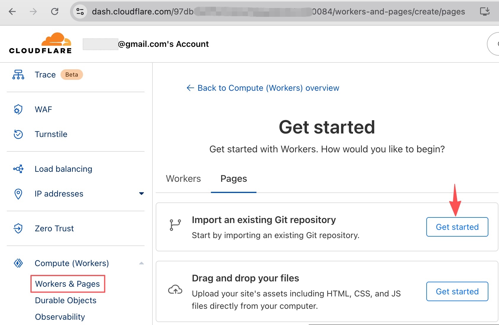
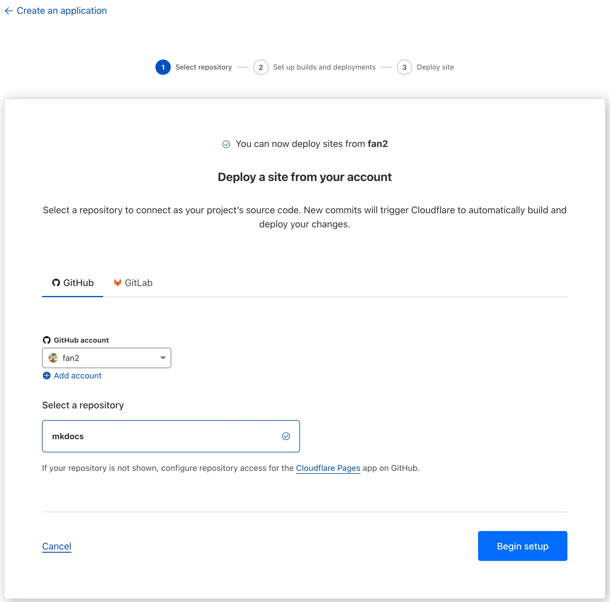
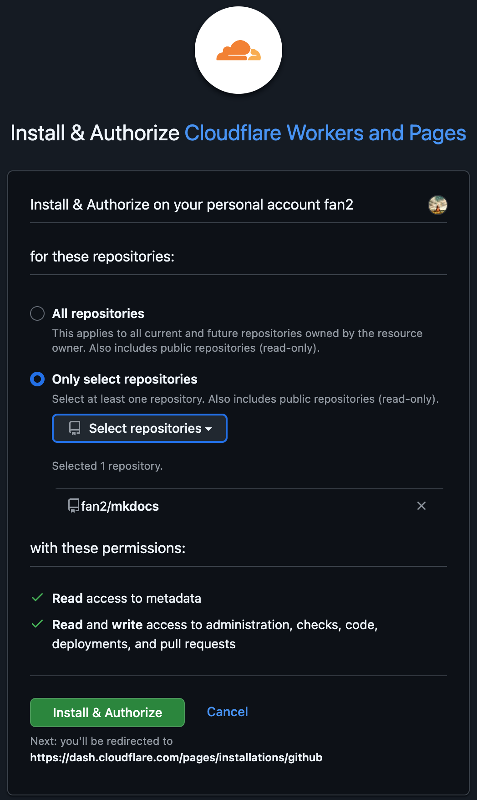
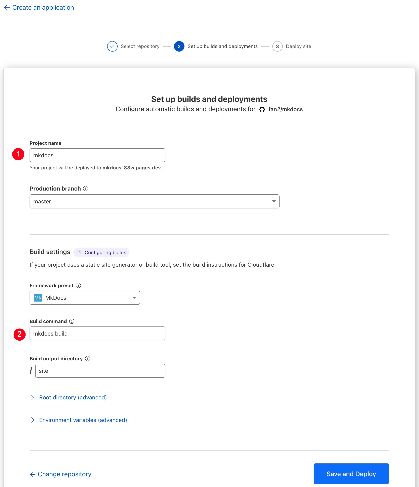
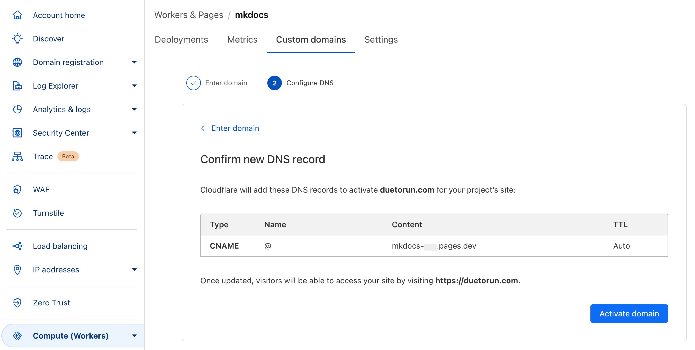
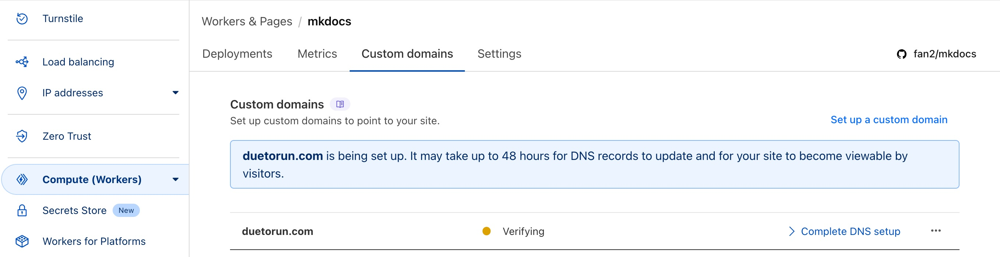
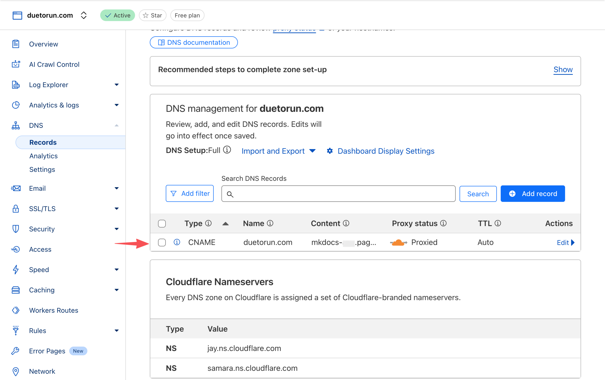
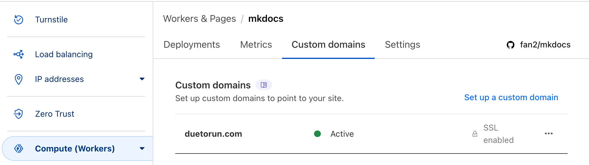

User Guide:

- [Command Line Interface](https://www.mkdocs.org/user-guide/cli/)
- [Deploying your docs](https://www.mkdocs.org/user-guide/deploying-your-docs/)

本文梳理了 `build` 构建和 `gh-deploy` 部署命令及部署工作流。

<!-- more -->

## get-deps

Show required PyPI packages inferred from plugins in mkdocs.yml

Usage: `mkdocs get-deps [OPTIONS]`

检查当前 mkdocs.yml 中配置的插件依赖的 PyPI 包。

```bash
# python3 -m mkdocs get-deps
pifan@rpi4b-ubuntu~/Sites/mkdocs $ mkdocs get-deps
mkdocs
mkdocs-material
pymdown-extensions
```

## mkdocs serve

Run the builtin development server: `mkdocs serve [OPTIONS]`, see usage with `mkdoc serve --help`.

Name             | Type    | Description                                                                         | Default
-----------------|---------|-------------------------------------------------------------------------------------|--------
`-a`, --dev-addr | text    | IP address and port to serve documentation locally (default: localhost:8000)        | None
--no-livereload  | boolean | Disable the live reloading in the development server                                | False
--livereload     | boolean | Enable the live reloading in the development server                                 | False
--dirty          | text    | Only re-build files that have changed.                                              | False
`-c`, --clean    | text    | Build the site without any effects of mkdocs serve - pure mkdocs build, then serve. | False
`-w`, --watch    | path    | A directory or file to watch for live reloading. Can be supplied multiple times.    | []
`-v`, --verbose  | boolean | Enable verbose output                                                               | False

1. 默认的 IP 端口是 localhost:8000，可指定 `-a 0.0.0.0:8000`，方便局域网调试。
2. 指定 `--dirty` 只增量编译改动的文件，文档规模增大后，可提高调试时的热加载反馈。

执行 `mkdocs serve` 启动本地测试服务：`-a` 指定监听端口；`--livereload` 开启热加载；`--dirty` 只编译改动的文件。

```bash hl_lines="5"
$ mkdocs serve -a 0.0.0.0:8000 --livereload --dirty
INFO    -  Building documentation...
WARNING -  A 'dirty' build is being performed, this will likely lead to inaccurate navigation and other links within your site. This option is designed for site development purposes only.
INFO    -  Documentation built in 23.15 seconds
INFO    -  [08:12:44] Watching paths for changes: 'docs', 'mkdocs.yml'
INFO    -  [08:12:44] Serving on http://0.0.0.0:8000/
```

当修改了 mkdocs.yml 文件或 docs 目录下的文件，浏览器会自动刷新。

```bash hl_lines="1 4"
INFO    -  [08:15:38] Detected file changes
INFO    -  Building documentation...
INFO    -  Documentation built in 0.55 seconds
INFO    -  [08:15:39] Reloading browsers
```

在 mkdocs.yml 中配置了博客的 URL 格式：

```yaml
      post_url_date_format: yyyyMMdd
      post_url_format: "{date}/{file}"
```

## serve & preview

在 vscode 中修改博客文章后，开发者希望能在本地（浏览器）即时预览当前正在打开/修改的文档的渲染效果。

第一种方式是 vscode 中预览 Markdown，安装 [MkDocs Material Preview](https://marketplace.visualstudio.com/items?itemName=0x10.mkdocs-material-preview) ，它通过附加插件扩展 VS Code 内置的 Markdown 解析器--`markdown-it`，增强支持渲染/预览 Material 特性组件，包括 Content Tabs、Admonitions、Code Block Enhancements。

第二种方式是在浏览器预览网页渲染效果。执行 `mkdocs serve` 启动本地服务后，将看到控制台日志 `INFO    -  [15:15:55] Serving on http://0.0.0.0:8000/`，在浏览器地址栏输入 http://localhost:8000/ 将打开博客首页，从 blog 目录中找到要预览的文章。

- 如果想在局域网手机上预览移动端渲染效果，将 localhost 改为 server (serve host) 的实际 IP 地址即可。

> [MkDocs Preview](https://marketplace.visualstudio.com/items?itemName=aswinunni01.mkdocs-vscode): It spins up a live MkDocs server in the background and provides an integrated, side-by-side preview directly within your editor.
> It only displays the blog homepage just like manually starting the server for a preview, and it does not support quick previewing of the current article.

[安装Material博客(sidecar to mkdocs)](./12-material-blog.md) 中配置了 blog 的 `blog_dir: blog`（`post_dir: posts`） 和 `post_url_format: {date}/{file}`。根据 POST URL 配置规则，可基于文档的创建时间和文件名手动拼接出 URL 再粘贴到浏览器地址栏打开访问。

由于每篇博客的创建时间都在开头的 meta 声明中，需要打开文档才能找到，无法快速拼接出其 URL。因此，可以考虑基于 vscode task 自动化这个过程，加快调试效率。

> [Integrate with External Tools via Tasks](https://code.visualstudio.com/docs/debugtest/tasks): VS Code tasks are used to run scripts and automate processes within the editor, such as building, linting, testing, or deploying software, without having to use the command line directly. They integrate with various external tools like npm, Gulp, Make, and Rake.

在存放 mkdocs.yml 的 mkdocs 工程根目录下创建 .vscode 文件夹，其下有4个文件：

```bash
$ tree .vscode
.vscode
├── preview.sh
├── serve.env
├── serve.sh
└── tasks.json

1 directory, 4 files
```

`serve.env` 定义了调试相关的环境变量，被2个sh脚本导入引用：

```bash
$ cat .vscode/serve.env
# mkdocs serve info
# bind to all available network interfaces
MKDOCS_SERVE_IP=${MKDOCS_SERVE_IP:-0.0.0.0}
MKDOCS_PREVIEW_IP=localhost  # or specific IP
MKDOCS_SERVE_PORT=${MKDOCS_SERVE_PORT:-8000}
MKDOCS_SERVE_ADDR=$MKDOCS_SERVE_IP:$MKDOCS_SERVE_PORT
MKDOCS_PREVIEW_ADDR=$MKDOCS_PREVIEW_IP:$MKDOCS_SERVE_PORT
```

`tasks.json` 为 vscode 任务配置文件，用来配置编译/调试任务，包括 serve 和 preview 两个 subtasks。

1. serve task: `MkDocs: serve with HMR`，执行 *serve.sh* 启动 mkdocs serve 热加载服务。

```json title="tasks.json - subtask serve"
        {
            "label": "MkDocs: serve with HMR",
            "type": "shell",
            "command": ".vscode/serve.sh",
            "args": [
                // "0.0.0.0",
                // "8000"
            ],
            "group": "build",
            "presentation": {
                "reveal": "always"
            }
        },
```

在脚本 serve.sh 中，先调用 `lsof -i` 检查调试端口（默认 8000）是否被占用，然后执行 `mkdocs serve` 命令启动调试 server。

??? note "serve.sh"

    ```bash
    #!/bin/bash

    # load envvars
    if ! source .vscode/serve.env; then
        echo "PLS config mkdocs serve envvars in serve.env"
        exit 1
    fi

    # main entrypoint
    if lsof -i :$MKDOCS_SERVE_PORT; then
        echo "mkdocs server is already listening at $MKDOCS_SERVE_PORT!"
        exit 0
    else  # start mkdocs server
        mkdocs serve -a $MKDOCS_SERVE_ADDR --livereload --dirty
    fi
    ```

2. preview task: `MkDocs: preview in Chrome`，执行 *preview.sh* 拼接 blog_url 然后在 Chrome 浏览器中打开预览。

    - [Variables reference](https://code.visualstudio.com/docs/reference/variables-reference)：vscode 内置变量 `${file}` 为当前打开文件的绝对路径（含文件名和扩展名）。

```json title="tasks.json - subtask preview"
        {
            "label": "MkDocs: preview in Chrome",
            "type": "shell",
            "command": ".vscode/preview.sh",
            "args": [
                "${file}", // 当前打开文件的绝对路径（含文件名和扩展名）
                // "${fileBasenameNoExtension}", // 当前打开文件的主文件名（不含扩展名）
            ],
            "group": "test",
            "presentation": {
                "reveal": "always"
            }
        }
```

preview.sh 首先基于 `sed` 或 `awk` 命令从文件内容中提取出日期，再拼接不含扩展名的文件名，即为博客的相对路径（blog_path）。
假设监听端口为8000，则博客的 base_url=`http://localhost:8000/blog`，base_url+blog_path 拼接出博客 URL（blog_url）。
脚本最后调用 `open -a "Google Chrome" "$blog_url"` 在 Google Chrome 浏览器中新开 tab 打开博客进行预览。

??? note "preview.sh"

    ```bash
    #!/bin/bash

    # check task args
    if [ $# -eq 0 ]; then
        echo "PLS specify \${file} (the openned file path) as task arg."
        exit 1
    fi

    # load envvars
    if ! source .vscode/serve.env; then
        echo "PLS config mkdocs serve envvars in serve.env"
        exit 1
    fi

    # access via localhost or specific IP address
    MKDOCS_BLOG=http://$MKDOCS_PREVIEW_ADDR/blog

    script=$0   # sh relative to .vscode
    file=$1     # absolute path of current open file
    echo "current_open_file=$file"

    # avoid current sh
    if [[ $file == *$script ]]
    then
        echo "$script does not support previewing."
        exit 1
    fi

    # check path & suffix extension
    blog_posts_path=/docs/blog/posts/
    if [[ ! $file =~ $blog_posts_path ]]; then
        echo "Only support preview blog under $blog_posts_path"
        exit 1
    elif [[ $file != *.md ]]; then
        echo "Only support preview blog suffixed with md"
        exit 1
    fi

    blog_post=${file#*"$blog_posts_path"}
    echo "blog_post=$blog_post"
    full_file_name=$(basename "$file")  # get file name with extension
    file_name=${full_file_name%.*}      # remove extension .md

    # extract blog created time and concat with file name to build blog url
    # consider two date formats: complete ISO datetime and simple date
    created_date=$(awk '/^[[:space:]]+created:/ {gsub(/-/, "", $2); gsub(/T.*/, "", $2); print $2}' "$file")
    # created_date=$(sed -n -E 's/^[[:space:]]+created:[[:space:]]*//p' "$file" | sed 's/T.*//' | tr -d '-')
    blog_path=$created_date/$file_name  # concat blog path
    blog_url=$MKDOCS_BLOG/$blog_path    # concat blog url

    # open blog url in Google Chrome Browser under macOS
    echo "preview in Google Chrome: $blog_url"
    open -a "Google Chrome" "$blog_url"
    ```

在 vscode 中，`⌘⇧P` 打开命令面板（Pallette），输入选择 *Tasks: Run Task*：

1. *MkDocs: serve with HMR* 启动 `mkdocs serve --livereload --dirty` 热加载服务。
2. *MkDocs: preview in Chrome* 在 Chrome 浏览器中预览 vscode 当前打开的博客文章。

## mkdocs build

Build the MkDocs documentation: `mkdocs build [OPTIONS]`

Name                    | Type     | Description                                                                           | Default
------------------------|----------|---------------------------------------------------------------------------------------|--------
`-c`, --clean / --dirty | boolean  | Remove old files from the site_dir before building (the default).                     | True
`-f`, --config-file     | filename | Provide a specific MkDocs config. This can be a file name, or '-' to read from stdin. | None
`-d`, --site-dir        | path     | The directory to output the result of the documentation build.                        | None
`-v`, --verbose         | boolean  | Enable verbose output                                                                 | False

关于 [build速度](http://hpc.ncpgr.cn/linux/086-mkdocs/#buildsu-du) 问题：

mkdocs build 默认使用了 `--clean` 选项，即会在build之前删掉所有之前build时创建的静态文件，如果文档数量较多，整个过程速度会比较慢，如本站build的时间约为25秒，build期间网站不可使用。如果修改比较频繁，则比较影响使用体验。

因此对大型文档网站，只对部分页面进行了修改，可以使用 `mkdocs build --dirty`，只build修改了页面，速度会快很多，如本站使用 `mkdocs build --dirty` 后build的时间缩短为不到2秒。

[官方解释](https://www.mkdocs.org/about/release-notes/#version-016-2016-11-04):

For large sites the build time required to create the pages can become problematic, thus a "dirty" build mode was created. This mode simply compares the modified time of the generated HTML and source markdown. If the markdown has changed since the HTML then the page is re-constructed. Otherwise, the page remains as is. It is important to note that this method for building the pages is for development of content only, since the navigation and other links do not get updated on other pages.

## gh-deploy

Deploy your documentation to GitHub Pages: `mkdocs gh-deploy [OPTIONS]`

Name                    | Type    | Description                                                                                                                              | Default
------------------------|---------|------------------------------------------------------------------------------------------------------------------------------------------|--------
`-c`, --clean / --dirty | boolean | Remove old files from the site_dir before building (the default).                                                                        | True
`-m`, --message         | text    | A commit message to use when committing to the GitHub Pages remote branch. Commit {sha} and MkDocs {version} are available as expansions | None
`-b`, --remote-branch   | text    | The remote branch to commit to for GitHub Pages. This overrides the value specified in config                                            | None
`-r`, --remote-name | text | The remote name to commit to for GitHub Pages. This overrides the value specified in config
`--no-history` | boolean | Replace the whole Git history with one new commit. | False
`-d`, --site-dir | path | The directory to output the result of the documentation build. | None

Behind the scenes, MkDocs will build your docs and use the `ghp-import` tool to commit them to the `gh-pages` branch and push the gh-pages

`gh-deploy` 命令执行 `mkdocs build`，然后将生成的静态网页 site 提交到 `gh-pages` 分支（默认的 remote-branch）。

## workflow

在主分支 master 修改了源码 mkdocs.yml 和 docs，本地 serve 验证后，自行 commit-push 提交。

build 会生成 site 目录，gh-deploy 会上传其内容至 gh-pages。
在 .gitignore 中添加 `site/`，使 master 分支忽略临时产物。

**提交流程**：先提交 master，再执行 `gh-deploy` 提交到部署分支。

> gh-deploy 会检测 mkdocs.yml 配置文件。

1. 可采用 `-m` 自定义本次部署提交

    - 默认日志格式是 `Deployed <master-last-commit-hash> with MkDocs version: 1.5.3`。

2. 可通过 `-b` 指定本次部署提交分支，下次不指定，还是提交到默认分支 `gh-pages`。
3. 可通过 `-r` 指定本次部署提交仓库，默认仓库是 `origin`，可指定 `upstream`。
4. `--no-history` 清除部署分支旧的提交记录，以此次提交作为部署起点。

## deploy to nginx

刚好之前在 Raspberry Pi 4B/Ubuntu 上用 nginx 部署 WebDav 服务，81 端口服务只使用了 /webdav 二级路由，可以考虑将 mkdocs material blog 挂载到根路由。

!!! note ""

    关于 nginx 配置，[rpi4b-ubuntu安装nginx-extras并配置WebDav](../webdav/ubuntu-install-nginx-full-config-webdav.md) 中有详细阐述。

ubuntu 下执行 `nginx -V` 可知 nginx 的默认工作空间为 --prefix=/usr/share/nginx。

对于自启的非80服务（这里监听 81 端口），`location /` 未指定 root 时，Docroot 默认为 /usr/share/nginx/html。

这里懒得修改 webdav 配置文件了，假设工程存储在 ~/Sites/mkdocs 目录，执行 `mkdocs build` 生成的静态站点产物目录为 site，那么只需将 site 软链为 /usr/share/nginx/html 即可完成部署，参考 [用mkdocs+nginx搭建个人网站](https://zhuanlan.zhihu.com/p/551345157)。

```bash
$ sudo mv /usr/share/nginx/html/ /usr/share/nginx/html_bak/
$ sudo ln -s /home/pifan/Sites/mkdocs/site/ /usr/share/nginx/html
```

局域网内，在浏览器输入 http://rpi4b-ubuntu.local:81/（或使用 IP 代替 host），即可访问博客站点。

接下来，可自行购买 VPS 将站点部署上去；或 [将域名交由 cloudflare 托管](https://developers.cloudflare.com/registrar/get-started/transfer-domain-to-cloudflare/)，然后创建一条 [Cloudflare Zero Trust](https://one.dash.cloudflare.com/) 内网穿透隧道（Cloudflare Tunnel），将内网服务（blog+webdav）暴露到公网。

=== "Cloudflare Zero Trust"

    Cloudflare Zero Trust provides the power of Cloudflare's global network to your internal teams and infrastructure. It empowers users with secure, fast, and seamless access to any device on the Internet.

=== "Cloudflare Tunnel"

    Cloudflare Tunnel (formerly Argo Tunnel) establishes a secure outbound connection within your infrastructure to connect applications and machines to Cloudflare.

=== "cloudflared"

    cloudflared is the software powering Cloudflare Tunnel. It runs on origin servers to connect to Cloudflare's network and on client devices for non-HTTP traffic.

[Cloudflare Docs](https://developers.cloudflare.com/) - [Cloudflare Zero Trust docs](https://developers.cloudflare.com/cloudflare-one/) - [Create a locally-managed tunnel (CLI)](https://developers.cloudflare.com/cloudflare-one/connections/connect-networks/get-started/create-local-tunnel/)

## deploy to Cloudflare Pages

[Cloudflare Pages](https://pages.cloudflare.com/) 是 Cloudflare 提供的静态站点托管服务，支持 GitHub、GitLab、Bitbucket 等主流代码托管平台。

1. 登入 Cloudflare，点击左侧菜单的 Workers & Pages，进入 Pages 控制台，点击 `Import an existing Git repository`：



2. 点击【Connect Github】按钮：


3. 输入 Github account 账号，选择一个仓库 `mkdocs`：



4. 在弹出的 Github 授权界面中，点击【Install & Authorize】按钮：



5. 输入 Project name: `mkdocs`，Framework preset 选择 MkDocs 框架，输入构建命令（Build command）: `mkdocs build`。

??? warning "dependency requirements of mkdocs-material"

    参考 [Build image · Cloudflare Pages docs](https://developers.cloudflare.com/pages/configuration/build-image/#supported-languages-and-tools)，构建机 Supported languages and tools 默认安装了 python/pip，但是并没有 mkdocs。

    需要在执行 `mkdocs build` 的工程目录下放置 requirements.txt 以便构建机（Workers）预安装依赖的 mkdocs-material 工具集。

    在工程目录下执行 `mkdocs get-deps` 获取依赖：mkdocs-material 依赖 `mkdocs` 和 `pymdown-extensions`。

    ```bash
    $ mkdocs get-deps
    mkdocs
    mkdocs-material
    pymdown-extensions
    ```

    假如还要依赖 `mkdocs-callouts` 插件，以便将 Obsidian style callouts 转换成 mkdocs supported 'admonitions' (a.k.a. callouts)，则项目的直接依赖如下：

    ```yaml title='requirements.in'
    mkdocs-material~=9.7.0
    mkdocs-callouts>=1.16.0
    ```

    接下来，可借助 `pip-tools` 的 `pip-compile` 命令或 `uv` 的 `pip compile` 来基于 `requirements.in` 生成完整的 `requirements.txt`。

    ```bash
    $ uv pip compile requirements.in -o requirements.txt

    $ cat requirements.txt
    # This file was autogenerated by uv via the following command:
    #    uv pip compile requirements.in -o requirements.txt
    babel==2.17.0
        # via mkdocs-material
    backrefs==6.1
        # via mkdocs-material
    certifi==2025.11.12
        # via requests
    # ...
    ```



6. 点击【Custom Domains】，Enter domain 输入在 Cloudflare 上购买托管的域名，下一步 Configure DNS 显示 Cloudflare 将会为站点配置一条 DNS 记录，点击【Activate domain】进入验证（Verifying）：





7. 在 Cloudflare 的 DNS Records 管理界面，可以找到刚刚添加的 CNAME 记录：



8.回到 Workers & Pages / mkdocs 的 Custom domains 界面，可以看到自定义域名已经激活生效：



上面已将 Cloudflare Pages 项目连接到 GitHub 库，当向分支推送更改时将会自动触发 Cloudflare Workers 构建部署 Pages。
