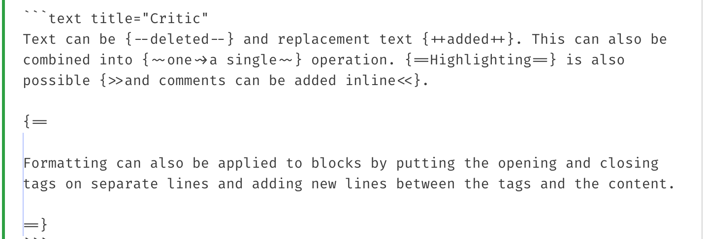

User Guide - [Writing your docs](https://www.mkdocs.org/user-guide/writing-your-docs/)。

MkDocs pages must be authored in [Markdown](https://daringfireball.net/projects/markdown/).

MkDocs uses the [Python-Markdown](https://python-markdown.github.io/) library to render Markdown documents to HTML.

Material for MkDocs - [Python Markdown](https://squidfunk.github.io/mkdocs-material/setup/extensions/python-markdown/)

<!-- more -->

## markdown_extensions

MkDocs includes support for extending the Markdown syntax with Python-Markdown [extensions](https://python-markdown.github.io/extensions/). See the MkDocs' [markdown\_extensions](https://www.mkdocs.org/user-guide/configuration/#markdown_extensions) configuration setting for details on how to enable extensions.

MkDocs includes some extensions by default, which are highlighted below.

1. Internal links: `toc`
2. Meta-Data: `meta`
3. Tables: `tables`
4. Fenced code blocks: `fenced_code`

    - 貌似默认主题已带代码高亮，参考 [Choosing your Theme](https://www.mkdocs.org/user-guide/choosing-your-theme/) - mkdocs。

建议启用以下扩展：

1. `nl2br`
2. `sane_lists`
3. `footnotes`
4. `codehilite`: 需要安装 Pygments

## More extensions

[User Guide](https://www.mkdocs.org/user-guide/configuration/) - Configuration

Formatting options | markdown_extensions

The Python-Markdown documentation provides a [list of extensions](https://python-markdown.github.io/extensions/) which are available out-of-the-box. For a list of configuration options available for a given extension, see the documentation for that extension.

You may also install and use various third party extensions ([Python-Markdown wiki](https://github.com/Python-Markdown/markdown/wiki/Third-Party-Extensions), [MkDocs project catalog](https://github.com/mkdocs/catalog)). Consult the documentation provided by those extensions for installation instructions and available configuration options.

### checklist

[checklist](https://github.com/FND/markdown-checklist): Adds GitHub-style task lists with checkboxes

执行 `pip install markdown-checklist` 安装扩展插件，然后在 mkdocs.yml 中引入：

```YAML
markdown_extensions:

   - markdown_checklist.extension
```

- [ ] undo1
- [ ] undo2
- [x] done1
- [x] done2

## YAML Style Meta-Data

YAML style meta-data consists of YAML key/value pairs wrapped in YAML style delimiters to mark the start and/or end of the meta-data. The first line of a document must be `---`. The meta-data ends at the first line containing an end deliminator (either `---` or `...`). The content between the delimiters is parsed as YAML.

```YAML
---
title: My Document
summary: A brief description of my document.
authors:
    - Waylan Limberg
    - Tom Christie
date: 2018-07-10
some_url: https://example.com
---
This is the first paragraph of the document.
```

YAML is able to detect data types. Therefore, in the above example, the values of `title`, `summary` and `some_url` are strings, the value of `authors` is a list of strings and the value of `date` is a datetime.date object. Note that the YAML keys are case sensitive and MkDocs expects keys to be all lowercase. The top level of the YAML must be a collection of key/value pairs, which results in a Python dict being returned. If any other type is returned or the YAML parser encounters an error, then MkDocs does not recognize the section as meta-data, the page's meta attribute will be empty, and the section is not removed from the document.

关于 metadata 的扩展使用案例，参考：

- [Mkdocs Material使用记录](https://shafish.cn/blog/mkdocs/)
- [Material for MkDocs改动的几个地方](https://zimohan.com/it/materialmkdocs.html)

## material extensions

Material for MkDocs - [Python Markdown Extensions](https://squidfunk.github.io/mkdocs-material/setup/extensions/python-markdown-extensions/)

Material for MkDocs - [Reference](https://squidfunk.github.io/mkdocs-material/reference/)

### tasklist

[Lists](https://squidfunk.github.io/mkdocs-material/reference/lists/)。

不用再安装 `markdown-checklist`，采用 `pymdownx.tasklist` 平替，效果区别如下：

1. 前面没有无序列表的 bullet 点号；
2. custom_checkbox 自定义绿色圆形勾选图标。

```YAML
markdown_extensions:
  - def_list
  - pymdownx.tasklist:
      custom_checkbox: true
```

### Content Tabs

[Content tabs](https://squidfunk.github.io/mkdocs-material/reference/content-tabs/)

Sometimes, it's desirable to group alternative content under different tabs, e.g. when describing how to access an API from different languages or environments. Material for MkDocs allows for beautiful and functional tabs, grouping code blocks and other content.

- 这里涉及到设定代码块标题：title="Content Tabs"。
- 注意缩进。

```Markdown title="Content Tabs"
=== "Unordered list"

    * Sed sagittis eleifend rutrum
    * Donec vitae suscipit est
    * Nulla tempor lobortis orci

=== "Ordered list"

    1. Sed sagittis eleifend rutrum
    2. Donec vitae suscipit est
    3. Nulla tempor lobortis orci
```

=== "Unordered list"

    * Sed sagittis eleifend rutrum
    * Donec vitae suscipit est
    * Nulla tempor lobortis orci

=== "Ordered list"

    1. Sed sagittis eleifend rutrum
    2. Donec vitae suscipit est
    3. Nulla tempor lobortis orci

### Formatting

[Formatting](https://squidfunk.github.io/mkdocs-material/reference/formatting/)

```YAML
markdown_extensions:
  - pymdownx.critic
  - pymdownx.caret
  - pymdownx.mark
  - pymdownx.tilde
  - pymdownx.keys
```

#### Critic Markup

The [Critic](https://squidfunk.github.io/mkdocs-material/setup/extensions/python-markdown-extensions/#critic) extension allows for the usage of [Critic Markup](https://github.com/CriticMarkup/CriticMarkup-toolkit) to highlight `added`, `deleted` or `updated` sections in a document, i.e. for tracking changes in Markdown syntax.

=== "Critic Demo"

    Text can be {--deleted--} and replacement text {++added++}. This can also be
    combined into {~~one~>a single~~} operation. {==Highlighting==} is also
    possible {>>and comments can be added inline<<}.

    {==

    Formatting can also be applied to blocks by putting the opening and closing
    tags on separate lines and adding new lines between the tags and the content.

    ==}

=== "Critic Code"

    

#### Highlighting

The [Caret, Mark & Tilde](https://squidfunk.github.io/mkdocs-material/setup/extensions/python-markdown-extensions/#caret-mark-tilde) extensions add the ability to highlight text and define sub- and superscript using a simple syntax.

=== "Highlighting Demo"

    - ==This was marked==
    - ^^This was inserted^^
    - ~~This was deleted~~

=== "Highlighting Code"

    ```text
    - ==This was marked==
    - ^^This was inserted^^
    - ~~This was deleted~~
    ```

#### Sub & Sup

When Caret & Tilde are enabled, text can be sub- and superscripted with a simple syntax, which is more convenient than directly using the corresponding `sub` and `sup` HTML tags:


=== "sub-sup Demo"

    - 6CO~2~ + 6H~2~O -> C~6~H~12~O~6~[(CH~2~O)~n~] + 6O~2~
    - A^T^A

=== "sub-sup Code"

    ```text
    6CO~2~ + 6H~2~O -> C~6~H~12~O~6~[(CH~2~O)~n~] + 6O~2~
    A^T^A
    ```

#### Keys

The [Keys](https://squidfunk.github.io/mkdocs-material/setup/extensions/python-markdown-extensions/#keys) extension adds a simple syntax to allow for the rendering of keyboard keys and combinations, e.g. Ctrl+Alt+Del. 

=== "Keys Demo"

    ++ctrl+alt+del++
    <kbd>⌃</kbd><kbd>⌥</kbd><kbd> ⌫ </kbd>

=== "Keys Code"

    ```text
    ++ctrl+alt+del++
    <kbd>⌃</kbd><kbd>⌥</kbd><kbd> ⌫ </kbd>
    ```

### Code Blocks

Code blocks and examples are an essential part of technical project documentation. Material for MkDocs provides different ways to set up syntax highlighting for code blocks, either during build time using Pygments or during runtime using a JavaScript syntax highlighter.

关于 GitHub 配置 Fenced Code Block 语法高亮所使用的 YAML 标记 ，可参考 [初探YAML][]、[YAML学习][]、[YAML学习总结][]、[YAML--想要爱你很容易][]。

[初探YAML]:http://www.cnblogs.com/chwkai/archive/2009/03/01/249924.html
[YAML学习]:http://blog.csdn.net/conquer0715/article/details/42108061
[YAML学习总结]:http://www.cnblogs.com/dbasys/archive/2007/06/11/2127620.html
[YAML--想要爱你很容易]:http://www.ibm.com/developerworks/cn/xml/x-1103linrr/

语言类型标记参考 [linguist/languages.yml](https://github.com/github-linguist/linguist/blob/master/lib/linguist/languages.yml) 和 [Languages — Pygments](https://pygments.org/languages/)。以 Shell Script 为例，语言类型标记可以为 shell 或 bash。

=== "linguist"

    ```YAML
    Shell:
      type: programming
      color: "#89e051"
      aliases:
      - sh
      - shell-script
      - bash
      - zsh
    ```

=== "Pygments"

    Name | Extension(s) | Short name(s)
    -----|--------------|-----------------
    Bash | *.sh, *.ksh, *.bash, *.ebuild, *.eclass, *.exheres-0, *.exlib, *.zsh, .bashrc, bashrc, .bash\*, bash\*, zshrc, .zshrc, .kshrc, kshrc, PKGBUILD | bash, sh, ksh, zsh, shell, openrc

markdown_extensions 中引入 pymdownx 四大扩展：

- Highlight
- InlineHilite
- SuperFences
- Snippets

```YAML
markdown_extensions:
  - pymdownx.superfences # Supersede fenced_code
  - pymdownx.highlight: # Supersede fenced_codecodehilite
      anchor_linenums: true
      line_spans: __span
      pygments_lang_class: true
  - pymdownx.inlinehilite
  - pymdownx.snippets  # embed external files
```

在 theme.features 中添加代码复制、行选择和折叠注释功能支持。

```YAML
theme:
  name: material
  features:
    # Code Blocks
    - content.code.copy # Code Blocks 代码复制按钮
    - content.code.select # Code Block 行选择按钮
    - content.code.annotate # 折叠注释(隐藏/展开)
```

以下示例综合演示了代码块的功能支持：

- Adding a title
- Show line numbers
- Highlighting specific lines
- Adding [annotations](https://squidfunk.github.io/mkdocs-material/reference/annotations/)

=== "Code Blocks Demo"

    ```py title="bubble_sort.py" linenums="1" hl_lines="2 3"
    def bubble_sort(items):
        for i in range(len(items)):
            for j in range(len(items) - 1 - i):
                if items[j] > items[j + 1]: # (1)
                    items[j], items[j + 1] = items[j + 1], items[j]
    ```

    1.  :man_raising_hand: I'm a code annotation! I can contain `code`, __formatted
        text__, images, ... basically anything that can be written in Markdown.

=== "Code Blocks Code"

    \`\`\`py title="bubble_sort.py" linenums="1" hl_lines="2 3"
    def bubble_sort(items):
    &ensp;&ensp;&ensp;&ensp;for i in range(len(items)):
    &ensp;&ensp;&ensp;&ensp;&ensp;&ensp;&ensp;&ensp;for j in range(len(items) - 1 - i):
    &ensp;&ensp;&ensp;&ensp;&ensp;&ensp;&ensp;&ensp;&ensp;&ensp;&ensp;&ensp;if items[j] > items[j + 1]: # (1)
    &ensp;&ensp;&ensp;&ensp;&ensp;&ensp;&ensp;&ensp;&ensp;&ensp;&ensp;&ensp;&ensp;&ensp;&ensp;&ensp;items[j], items[j + 1] = items[j + 1], items[j]
    \`\`\`

    ```text
    1.  :man_raising_hand: I'm a code annotation! I can contain `code`, __formatted
        text__, images, ... basically anything that can be written in Markdown.
    ```

### MathJax

MathJax and KaTeX are two popular libraries for displaying mathematical content in browsers. Although both libraries offer similar functionality, they use different syntaxes and have different configuration options. This documentation site provides information on how to integrate them with Material for MkDocs easily.

加入以下配置，支持渲染数学公式，参考 [Markdown-Formula](./2-Markdown-Formula.md)。

```YAML
markdown_extensions:
  - pymdownx.arithmatex:
      generic: true

extra_javascript:
  - javascripts/mathjax.js
  - https://polyfill.io/v3/polyfill.min.js?features=es6
  - https://cdn.jsdelivr.net/npm/mathjax@3/es5/tex-mml-chtml.js
```

### Admonitions

Admonitions, also known as *call-outs*, are an excellent choice for including side content without significantly interrupting the document flow. Material for MkDocs provides several different types of admonitions and allows for the inclusion and nesting of arbitrary content.

```YAML
markdown_extensions:
  - admonition
  - pymdownx.details
  - pymdownx.superfences
```

#### Admonition Box

以下是 Admonition note 示例，默认标题是 `Note`。

> 可以在 note 后指定自定义标题: `!!! note "Pay Attention"`
> 也可以指定标题为空，即移除标题：`!!! note ""`

=== "Admonition Demo"

    !!! note

        Lorem ipsum dolor sit amet, consectetur adipiscing elit. Nulla et euismod nulla. Curabitur feugiat, tortor non consequat finibus, justo purus auctor massa, nec semper lorem quam in massa.

=== "Admonition Code"

    ```text title="Admonition"
    !!! note

        Lorem ipsum dolor sit amet, consectetur adipiscing elit. Nulla et euismod nulla. Curabitur feugiat, tortor non consequat finibus, justo purus auctor massa, nec semper lorem quam in massa.
    ```

#### Collapsible blocks

When Details is enabled and an admonition block is started with `???` instead of `!!!`, the admonition is rendered as a collapsible block with a small toggle on the right side.

将 `!!!` 替换为 `???`，则支持可折叠块，点击展开。

> 在 `???` 后加一个 `+`，则默认展开。

=== "Collapsible blocks Demo"

    ??? note

        Lorem ipsum dolor sit amet, consectetur adipiscing elit. Nulla et euismod nulla. Curabitur feugiat, tortor non consequat finibus, justo purus auctor massa, nec semper lorem quam in massa.

=== "Collapsible blocks Code"

    ```text title="Collapsible blocks"
    ??? note

        Lorem ipsum dolor sit amet, consectetur adipiscing elit. Nulla et euismod nulla. Curabitur feugiat, tortor non consequat finibus, justo purus auctor massa, nec semper lorem quam in massa.
    ```

#### Inline blocks

Admonitions can also be rendered as inline blocks (e.g., for sidebars), placing them to the right using the `inline` + `end` modifiers, or to the left using only the `inline` modifier:

> 排版挺难控制。

!!! info inline end "Lorem ipsum"

    Lorem ipsum dolor sit amet, consectetur adipiscing elit. Nulla et euismod nulla. Curabitur feugiat, tortor non consequat finibus, justo purus auctor massa, nec semper lorem quam in massa.

```text
!!! info inline end "Lorem ipsum"

    Lorem ipsum dolor sit amet, consectetur
    adipiscing elit. Nulla et euismod nulla.
    Curabitur feugiat, tortor non consequat
    finibus, justo purus auctor massa, nec
    semper lorem quam in massa.
    inline end padding; inline end padding;
    inline end padding; inline end padding;
```

#### Supported types

Admonitions 除了支持 `note` 提示，还支持以下提示类型：

- `abstract`: 总结
- `info`：信息
- `tip`：提示
- `success`：成功
- `question`：疑问
- `warning`：警告
- `failure`：失败
- `danger`：危险
- `bug`：问题
- `example`：示例
- `quote`：引用

=== "note"

    !!! note

        Lorem ipsum dolor sit amet, consectetur adipiscing elit. Nulla et euismod nulla. Curabitur feugiat, tortor non consequat finibus, justo purus auctor massa, nec semper lorem quam in massa.

=== "abstract"

    !!! abstract

        Lorem ipsum dolor sit amet, consectetur adipiscing elit. Nulla et euismod nulla. Curabitur feugiat, tortor non consequat finibus, justo purus auctor massa, nec semper lorem quam in massa.

=== "info"

    !!! info

        Lorem ipsum dolor sit amet, consectetur adipiscing elit. Nulla et euismod nulla. Curabitur feugiat, tortor non consequat finibus, justo purus auctor massa, nec semper lorem quam in massa.

=== "tip"

    !!! tip

        Lorem ipsum dolor sit amet, consectetur adipiscing elit. Nulla et euismod nulla. Curabitur feugiat, tortor non consequat finibus, justo purus auctor massa, nec semper lorem quam in massa.

=== "success"

    !!! success

        Lorem ipsum dolor sit amet, consectetur adipiscing elit. Nulla et euismod nulla. Curabitur feugiat, tortor non consequat finibus, justo purus auctor massa, nec semper lorem quam in massa.

=== "question"

    !!! question

        Lorem ipsum dolor sit amet, consectetur adipiscing elit. Nulla et euismod nulla. Curabitur feugiat, tortor non consequat finibus, justo purus auctor massa, nec semper lorem quam in massa.

=== "warning"

    !!! warning

        Lorem ipsum dolor sit amet, consectetur adipiscing elit. Nulla et euismod nulla. Curabitur feugiat, tortor non consequat finibus, justo purus auctor massa, nec semper lorem quam in massa.

=== "failure"

    !!! failure

        Lorem ipsum dolor sit amet, consectetur adipiscing elit. Nulla et euismod nulla. Curabitur feugiat, tortor non consequat finibus, justo purus auctor massa, nec semper lorem quam in massa.

=== "danger"

    !!! danger

        Lorem ipsum dolor sit amet, consectetur adipiscing elit. Nulla et euismod nulla. Curabitur feugiat, tortor non consequat finibus, justo purus auctor massa, nec semper lorem quam in massa.

=== "bug"

    !!! bug

        Lorem ipsum dolor sit amet, consectetur adipiscing elit. Nulla et euismod nulla. Curabitur feugiat, tortor non consequat finibus, justo purus auctor massa, nec semper lorem quam in massa.

=== "example"

    !!! example

        Lorem ipsum dolor sit amet, consectetur adipiscing elit. Nulla et euismod nulla. Curabitur feugiat, tortor non consequat finibus, justo purus auctor massa, nec semper lorem quam in massa.

=== "quote"

    !!! quote

        Lorem ipsum dolor sit amet, consectetur adipiscing elit. Nulla et euismod nulla. Curabitur feugiat, tortor non consequat finibus, justo purus auctor massa, nec semper lorem quam in massa.

### Grids

**Card grids** wrap each grid item with a beautiful hover card that levitates on hover. They come in two slightly different syntaxes: list and block syntax, adding support for distinct use cases.

The list syntax is essentially a shortcut for card grids, and consists of an unordered (or ordered) list wrapped by a `div` with both, the `grid` and `cards` classes:

```html title="Card grid"
<div class="grid cards" markdown>

- :fontawesome-brands-html5: __HTML__ for content and structure
- :fontawesome-brands-js: __JavaScript__ for interactivity
- :fontawesome-brands-css3: __CSS__ for text running out of boxes
- :fontawesome-brands-internet-explorer: __Internet Explorer__ ... huh?

</div>
```

<div class="grid cards" markdown>

- :fontawesome-brands-html5: __HTML__ for content and structure
- :fontawesome-brands-js: __JavaScript__ for interactivity
- :fontawesome-brands-css3: __CSS__ for text running out of boxes
- :fontawesome-brands-internet-explorer: __Internet Explorer__ ... huh?

</div>

```html title="Card grid, complex example"
<div class="grid cards" markdown>

-   :material-clock-fast:{ .lg .middle } __Set up in 5 minutes__

    ---

    Install [`mkdocs-material`](#) with [`pip`](#) and get up
    and running in minutes

    [:octicons-arrow-right-24: Getting started](#)

-   :fontawesome-brands-markdown:{ .lg .middle } __It's just Markdown__

    ---

    Focus on your content and generate a responsive and searchable static site

    [:octicons-arrow-right-24: Reference](#)

-   :material-format-font:{ .lg .middle } __Made to measure__

    ---

    Change the colors, fonts, language, icons, logo and more with a few lines

    [:octicons-arrow-right-24: Customization](#)

-   :material-scale-balance:{ .lg .middle } __Open Source, MIT__

    ---

    Material for MkDocs is licensed under MIT and available on [GitHub]

    [:octicons-arrow-right-24: License](#)

</div>
```

<div class="grid cards" markdown>

-   :material-clock-fast:{ .lg .middle } __Set up in 5 minutes__

    ---

    Install [`mkdocs-material`](#) with [`pip`](#) and get up
    and running in minutes

    [:octicons-arrow-right-24: Getting started](#)

-   :fontawesome-brands-markdown:{ .lg .middle } __It's just Markdown__

    ---

    Focus on your content and generate a responsive and searchable static site

    [:octicons-arrow-right-24: Reference](#)

-   :material-format-font:{ .lg .middle } __Made to measure__

    ---

    Change the colors, fonts, language, icons, logo and more with a few lines

    [:octicons-arrow-right-24: Customization](#)

-   :material-scale-balance:{ .lg .middle } __Open Source, MIT__

    ---

    Material for MkDocs is licensed under MIT and available on [GitHub]

    [:octicons-arrow-right-24: License](#)

</div>

The block syntax allows for arranging cards in grids **together** with other elements, as explained in the section on generic grids. Just add the `card` class to any block element inside a `grid`:

```html title="Card grid, blocks"
<div class="grid" markdown>

:fontawesome-brands-html5: __HTML__ for content and structure
{ .card }

:fontawesome-brands-js: __JavaScript__ for interactivity
{ .card }

:fontawesome-brands-css3: __CSS__ for text running out of boxes
{ .card }

> :fontawesome-brands-internet-explorer: __Internet Explorer__ ... huh?

</div>
```

<div class="grid" markdown>

:fontawesome-brands-html5: __HTML__ for content and structure
{ .card }

:fontawesome-brands-js: __JavaScript__ for interactivity
{ .card }

:fontawesome-brands-css3: __CSS__ for text running out of boxes
{ .card }

> :fontawesome-brands-internet-explorer: __Internet Explorer__ ... huh?

</div>

Generic grids allow for arranging arbitrary block elements in a grid, including admonitions, code blocks, content tabs and more. Just wrap a set of blocks by using a `div` with the `grid` class:

```html title="Generic grid"
<div class="grid" markdown>

=== "Unordered list"

    * Sed sagittis eleifend rutrum
    * Donec vitae suscipit est
    * Nulla tempor lobortis orci

=== "Ordered list"

    1. Sed sagittis eleifend rutrum
    2. Donec vitae suscipit est
    3. Nulla tempor lobortis orci

\`\`\` title="Content tabs"
=== "Unordered list"

    * Sed sagittis eleifend rutrum
    * Donec vitae suscipit est
    * Nulla tempor lobortis orci

=== "Ordered list"

    1. Sed sagittis eleifend rutrum
    2. Donec vitae suscipit est
    3. Nulla tempor lobortis orci
\`\`\`

</div>
```

<div class="grid" markdown>

=== "Unordered list"

    * Sed sagittis eleifend rutrum
    * Donec vitae suscipit est
    * Nulla tempor lobortis orci

=== "Ordered list"

    1. Sed sagittis eleifend rutrum
    2. Donec vitae suscipit est
    3. Nulla tempor lobortis orci

``` title="Content tabs"
=== "Unordered list"

    * Sed sagittis eleifend rutrum
    * Donec vitae suscipit est
    * Nulla tempor lobortis orci

=== "Ordered list"

    1. Sed sagittis eleifend rutrum
    2. Donec vitae suscipit est
    3. Nulla tempor lobortis orci
```

</div>
