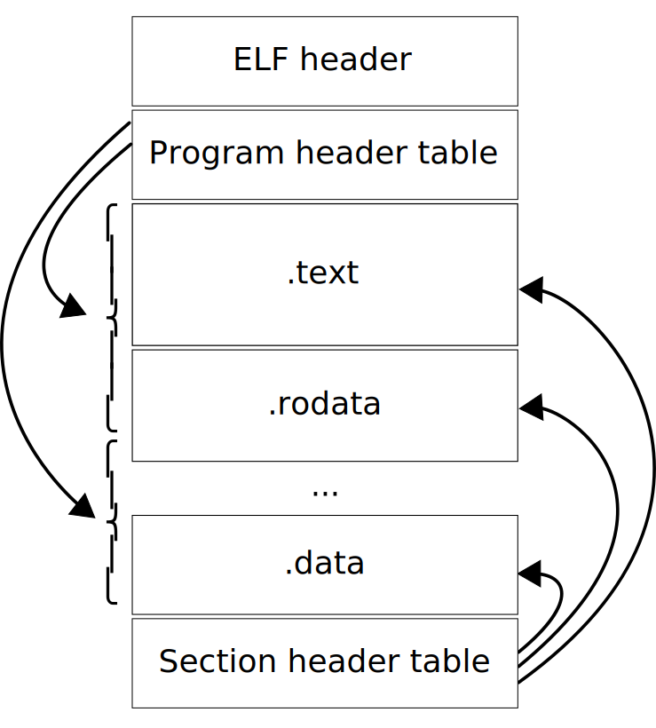
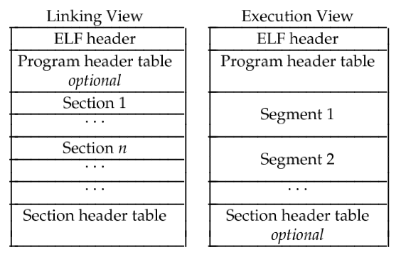

The Executable and Linkable Format (`ELF`), is a common standard file format for executable files, object code, shared libraries, and core dumps.

`DWARF` is a widely used, standardized debugging data format. It was originally designed along with Executable and Linkable Format (ELF).

<!-- more -->

## ELF

[Executable and Linkable Format](https://en.wikipedia.org/wiki/Executable_and_Linkable_Format)

- sysvabi64 - [System V ABI for the Arm® 64-bit Architecture (AArch64)](https://github.com/ARM-software/abi-aa/blob/844a79fd4c77252a11342709e3b27b2c9f590cf1/sysvabi64/sysvabi64.rst)
- aaelf64 - [ELF for the Arm® 64-bit Architecture (AArch64)](https://github.com/ARM-software/abi-aa/blob/main/aaelf64/aaelf64.rst)

In computing, the Executable and Linkable Format (***ELF***, formerly named Extensible Linking Format), is a common standard file format for executable files, object code, shared libraries, and core dumps. First published in the specification for the application binary interface (ABI) of the Unix operating system version named System V Release 4 (SVR4), and later in the Tool Interface Standard, it was quickly accepted among different vendors of Unix systems. In 1999, it was chosen as the standard binary file format for Unix and Unix-like systems on x86 processors by the 86open project.

Each ELF file is made up of one ELF header, followed by file data. The data can include:

- `Program header table`, describing zero or more memory segments
- `Section header table`, describing zero or more sections
- `Data` referred to by entries in the program header table or section header table

<!--  -->

<figure markdown="span">
    {: style="width:60%;height:60%"}
</figure>

An ELF file has two views: the program header shows the *segments* used at run time, whereas the section header lists the set of *sections*.

<figure markdown="span">
    {: style="width:75%;height:75%"}
    <figcaption>Linking View vs. Execution View</figcaption>
</figure>

<!--  -->


The `segments` contain information that is needed for run time execution of the file, while `sections` contain important data for linking and relocation. Any byte in the entire file can be owned by one section at most, and orphan bytes can occur which are unowned by any section.

1. File header
2. Program header
3. Section header

## DWARF

[DWARF 3.0 Standard](https://dwarfstd.org/dwarf3std.html)

[DWARF](https://en.wikipedia.org/wiki/DWARF) is a widely used, standardized debugging data format. DWARF was originally designed along with Executable and Linkable Format (ELF), although it is independent of object file formats. The name is a medieval fantasy complement to "ELF" that had no official meaning, although the name "Debugging With Arbitrary Record Formats" has since been proposed as a backronym.

DWARF originated with the C compiler and sdb debugger in Unix System V Release 4 (SVR4).

---

aadwarf64 - [DWARF for the Arm® 64-bit Architecture (AArch64)](https://github.com/ARM-software/abi-aa/blob/main/aadwarf64/aadwarf64.rst)

The ABI for the Arm 64-bit architecture specifies the use of DWARF 3.0 format debugging data. For details of the base standard see GDWARF.

The ABI for the Arm 64-bit architecture gives additional rules for how DWARF 3.0 should be used, and how it is extended in ways specific to the Arm 64-bit architecture. The following topics are covered in detail:

- The enumeration of DWARF register numbers for using in `.debug_frame` and `.debug_info` sections (DWARF register names).
- The definition of Canonical Frame Address (`CFA`) used by this ABI (Canonical frame address).
- The definition of Common Information Entries (`CIE`) used by this ABI (Common information entries).
- The definition of Call Frame Instructions (`CFI`) used by this ABI (Call frame instructions).
- The definition of DWARF Expression Operations used by this ABI (dwarf expression operations).

### CFI directives

[CFI directives (Using as)](https://sourceware.org/binutils/docs/as/CFI-directives.html)

[CFI support for GNU assembler (GAS)](https://www.logix.cz/michal/devel/gas-cfi/)

7.12.2 `.cfi_startproc [simple]`

- `.cfi_startproc` is used at the beginning of each function that should have an entry in `.eh_frame`. It initializes some internal data structures. Don’t forget to close the function by `.cfi_endproc`.

- Unless `.cfi_startproc` is used along with parameter simple it also emits some architecture dependent initial CFI instructions.

7.12.3 `.cfi_endproc`

- `.cfi_endproc` is used at the end of a function where it closes its unwind entry previously opened by `.cfi_startproc`, and emits it to `.eh_frame`.

7.12.11 `.cfi_def_cfa_offset offset`

- `.cfi_def_cfa_offset` modifies a rule for computing CFA. Register remains the same, but offset is new. Note that it is the absolute offset that will be added to a defined register to compute CFA address.

7.12.13 `.cfi_offset register, offset`

- Previous value of register is saved at offset *offset* from CFA.

7.12.17 `.cfi_restore register`

- `.cfi_restore` says that the rule for register is now the same as it was at the beginning of the function, after all initial instruction added by `.cfi_startproc` were executed.

[assembly - What are CFI directives in Gnu Assembler (GAS) used for? - Stack Overflow](https://stackoverflow.com/questions/2529185/what-are-cfi-directives-in-gnu-assembler-gas-used-for)

- [c++ - How to remove "noise" from GCC/clang assembly output? - Stack Overflow](https://stackoverflow.com/questions/38552116/how-to-remove-noise-from-gcc-clang-assembly-output)

To disable these, use the gcc option

```bash
-fno-asynchronous-unwind-tables
-fno-dwarf2-cfi-asm
```

I've got a feeling it stands for `Call Frame Information` and is a GNU AS extension to manage call frames. 

The CFI directives are used for debugging. It allows the debugger to unwind a stack. For example: if procedure A calls procedure B which then calls a common procedure C. Procedure C fails. You now want to know who actually called C and then you may want to know who called B.

A debugger can unwind this stack by using the stack pointer (%rsp) and register %rbp, however it needs to know how to find them. That is where the CFI directives come in.

```asm
movq %rsp, %rbp
.cfi_def_cfa_register 6
```

so the last line here tell it that the "Call frame address" is now in register 6 (%rbp)

## refs

[The ELF format - how programs look from the inside](https://www.caichinger.com/elf.html)

[Executable and Linkable Format (ELF).pdf](https://www.cs.cmu.edu/afs/cs/academic/class/15213-f00/docs/elf.pdf)

---

[ARM Cortex-A Series Programmer's Guide for ARMv8-A](https://developer.arm.com/documentation/den0024/latest)

- Chapter 9 The ABI for ARM 64-bit Architecture

[Blue Fox: Arm Assembly Internals and Reverse Engineering](https://www.amazon.com/Blue-Fox-Assembly-Internals-Analysis/dp/1119745306)

- Part I Arm Assembly Internals - Chapter 2 ELF File Format Internals

[Learning Linux Binary Analysis](https://www.amazon.com/Learning-Binary-Analysis-elfmaster-ONeill/dp/1782167102)

- Chapter 2: The ELF Binary Format

[Practical Binary Analysis](https://www.amazon.com/Practical-Binary-Analysis-Instrumentation-Disassembly/dp/1593279124)

- Part I: Binary Formats - Chapter 2: The ELF Format
