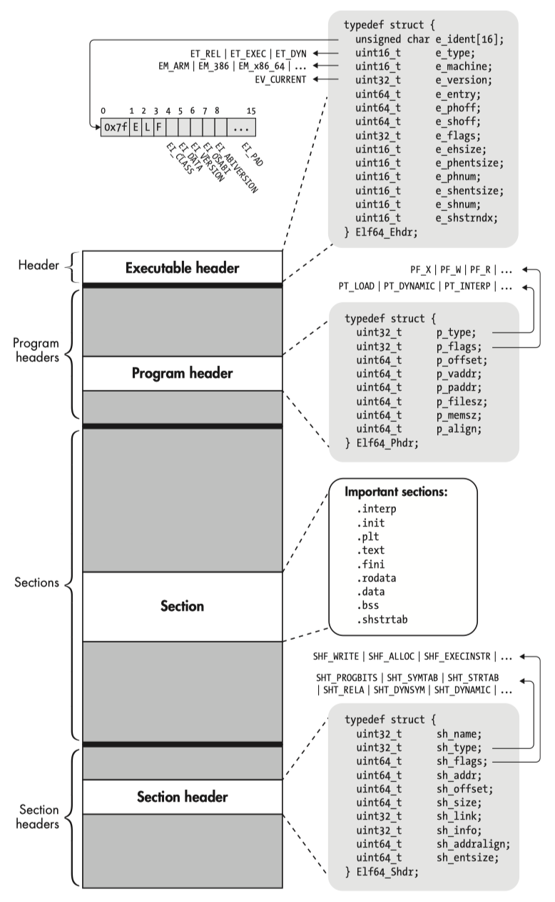

The Executable and Linkable Format (`ELF`), is a common standard file format for executable files, object code, shared libraries, and core dumps.

<!-- more -->

[Executable and Linkable Format](https://en.wikipedia.org/wiki/Executable_and_Linkable_Format)

- sysvabi64 - [System V ABI for the Arm® 64-bit Architecture (AArch64)](https://github.com/ARM-software/abi-aa/blob/844a79fd4c77252a11342709e3b27b2c9f590cf1/sysvabi64/sysvabi64.rst)
- aaelf64 - [ELF for the Arm® 64-bit Architecture (AArch64)](https://github.com/ARM-software/abi-aa/blob/main/aaelf64/aaelf64.rst)

In computing, the Executable and Linkable Format (***ELF***, formerly named Extensible Linking Format), is a common standard file format for executable files, object code, shared libraries, and core dumps. First published in the specification for the application binary interface (ABI) of the Unix operating system version named System V Release 4 (SVR4), and later in the Tool Interface Standard, it was quickly accepted among different vendors of Unix systems. In 1999, it was chosen as the standard binary file format for Unix and Unix-like systems on x86 processors by the 86open project.

```bash
$ man elf
elf - format of Executable and Linking Format (ELF) files
```

## layout

Each ELF file is made up of one ELF header, followed by file data. The data can include:

- `Program header table`, describing zero or more memory segments
- `Section header table`, describing zero or more sections
- `Data` referred to by entries in the program header table or section header table

<!--  -->

<figure markdown="span">
    {: style="width:60%;height:60%"}
</figure>

An ELF file has two views: the program header shows the *segments* used at run time, whereas the section header lists the set of *sections*.

<figure markdown="span">
    {: style="width:75%;height:75%"}
    <figcaption>Linking View vs. Execution View</figcaption>
</figure>

<!--  -->


The `segments` contain information that is needed for run time execution of the file, while `sections` contain important data for linking and relocation. Any byte in the entire file can be owned by one section at most, and orphan bytes can occur which are unowned by any section.

1. File header
2. Program header
3. Section header

<figure markdown="span">
    {: style="width:90%;height:90%"}
    <figcaption>A 64-bit ELF binary at a glance</figcaption>
</figure>

## header

??? info "/usr/include/elf.h"

    ```c

    /* Type of addresses.  */
    typedef uint32_t Elf32_Addr;
    typedef uint64_t Elf64_Addr;

    /* Type of file offsets.  */
    typedef uint32_t Elf32_Off;
    typedef uint64_t Elf64_Off;

    /* The ELF file header.  This appears at the start of every ELF file. */

    #define EI_NIDENT (16)

    typedef struct
    {
      unsigned char e_ident[EI_NIDENT]; /* Magic number and other info */
      Elf32_Half    e_type;         /* Object file type */
      Elf32_Half    e_machine;      /* Architecture */
      Elf32_Word    e_version;      /* Object file version */
      Elf32_Addr    e_entry;        /* Entry point virtual address */
      Elf32_Off     e_phoff;        /* Program header table file offset */
      Elf32_Off     e_shoff;        /* Section header table file offset */
      Elf32_Word    e_flags;        /* Processor-specific flags */
      Elf32_Half    e_ehsize;       /* ELF header size in bytes */
      Elf32_Half    e_phentsize;    /* Program header table entry size */
      Elf32_Half    e_phnum;        /* Program header table entry count */
      Elf32_Half    e_shentsize;    /* Section header table entry size */
      Elf32_Half    e_shnum;        /* Section header table entry count */
      Elf32_Half    e_shstrndx;     /* Section header string table index */
    } Elf32_Ehdr;

    typedef struct
    {
      unsigned char e_ident[EI_NIDENT]; /* Magic number and other info */
      Elf64_Half    e_type;         /* Object file type */
      Elf64_Half    e_machine;      /* Architecture */
      Elf64_Word    e_version;      /* Object file version */
      Elf64_Addr    e_entry;        /* Entry point virtual address */
      Elf64_Off     e_phoff;        /* Program header table file offset */
      Elf64_Off     e_shoff;        /* Section header table file offset */
      Elf64_Word    e_flags;        /* Processor-specific flags */
      Elf64_Half    e_ehsize;       /* ELF header size in bytes */
      Elf64_Half    e_phentsize;    /* Program header table entry size */
      Elf64_Half    e_phnum;        /* Program header table entry count */
      Elf64_Half    e_shentsize;    /* Section header table entry size */
      Elf64_Half    e_shnum;        /* Section header table entry count */
      Elf64_Half    e_shstrndx;     /* Section header string table index */
    } Elf64_Ehdr;
    ```

The initial 16 bytes correspond to the `e_ident` member, which means "ELF Identification".
It markes the file as an object file and provide machine-independent data with which to decode and interpret the file's contents.

> hexdump: `hd -n 16 $ELF`

Name          | Value | Purpose
--------------|-------|----------------------------
EI_MAGO       | 0     | File identification byte 0 index
EI_MAG1       | 1     | File identification byte 1 index
EI_MAG2       | 2     | File identification byte 2 index
EI_MAG3       | 3     | File identification byte 3 index
EI_CLASS      | 4     | File class byte index
EI_DATA       | 5     | Data encoding byte index
EI_VERSION    | 6     | File version byte index
EI_OSABI      | 7     | OS ABI identification
EI_ABIVERSION | 8     | ABI version
EI_PAD        | 9     | Byte index of padding bytes

A file's first 4 bytes hold a "magic number," identifying the file as an ELF object file.

Name    | Value | Position
--------|-------|-----------------
ELFMAGO | 0x7f  | e_ident[EI_MAG0]
ELFMAG1 | 'E'   | e_ident[EI_MAG1]
ELFMAG2 | 'I'   | e_ident[EI_MAG2]
ELFMAG3 | 'F'   | e_ident[EI_MAG3]

The next byte, `e_ident[EI_CLASS]`, identifies the file's class, or capacity.

Name         | Value | Meaning
-------------|-------|----------------
ELFCLASSNONE | 0     | Invalid class
ELFCLASS32   | 1     | 32-b it objects
ELFCLASS64   | 2     | 64-b it objects

Byte `e_ident[EI_DATA]` specifies the data encoding of the processor-specific data in the object file. The following encodings are currently defined.

Name        | Value | Meaning
------------|-------|----------------------
ELFDATANONE | 0     | Invalid data encoding
ELFDATA2LSB | 1     | 2's complement, little endian
ELFDATA2MSB | 2     | 2's complement, big endian

`e_type` identifies the object file type.

> `hexdump -s 16 -n 2 -e '"%07.7_ax  " /2 "%04x " "\n"' $ELF`

Name    | Value | Meaning
--------|-------|-------------------
ET_NONE | 0     | No file type
ET_REL  | 1     | Relocatable file
ET_EXEC | 2     | Executable file
ET_DYN  | 3     | Shared object file
ET_CORE | 4     | Core file

`e_machine` specifies the required architecture for an individual file.

> `hexdump -s 18 -n 2 -e '"%07.7_ax  " /2 "%04x " "\n"' $ELF`

Name           | Value | Meaning
---------------|-------|-------------------------
EM_NONE        | 0     | No machine
EM_SPARC       | 2     | SUN SPARC
EM_386         | 3     | Intel 80386
EM_68K         | 4     | Motorola m68k family
EM_88K         | 5     | Motorola m88k family
EM_MIPS        | 8     | MIPS R3000 big-endian
EM_MIPS_RS3_LE | 10    | MIPS R3000 little-endian
EM_ARM         | 40    | ARM
EM_X86_64      | 62    | AMD x86-64 architecture
EM_AARCH64     | 183   | ARM AARCH64
EM_RISCV       | 243   | RISC-V

## refs

[Linux Foundation Referenced Specifications](https://refspecs.linuxfoundation.org/)
[TIS - ELF Specification Version 1.2](https://refspecs.linuxfoundation.org/elf/elf.pdf)

[ARM Cortex-A Series Programmer's Guide for ARMv8-A](https://developer.arm.com/documentation/den0024/latest)

- Chapter 9 The ABI for ARM 64-bit Architecture

[Blue Fox: Arm Assembly Internals and Reverse Engineering](https://www.amazon.com/Blue-Fox-Assembly-Internals-Analysis/dp/1119745306)

- Chapter 2 ELF File Format Internals

[Learning Linux Binary Analysis](https://www.amazon.com/Learning-Binary-Analysis-elfmaster-ONeill/dp/1782167102)

- Chapter 2: The ELF Binary Format

[Practical Binary Analysis](https://www.amazon.com/Practical-Binary-Analysis-Instrumentation-Disassembly/dp/1593279124)

- Chapter 1: Anatomy of a Binary
- Chapter 2: The ELF Format

---

[ELF Format Cheatsheet](https://gist.github.com/x0nu11byt3/bcb35c3de461e5fb66173071a2379779)

[Differences Between ELF-32 and ELF-64](https://interrupt.memfault.com/blog/elf-format-differences)

[Executable and Linkable Format (ELF).pdf](https://www.cs.cmu.edu/afs/cs/academic/class/15213-f00/docs/elf.pdf)

[ELF 文件 - CTF Wiki](https://ctf-wiki.org/executable/elf/structure/basic-info/)

[Binary analysis - ELF’s Story](https://aleeamini.com/category/binary-analysis/)

[The ELF format - how programs look from the inside](https://www.caichinger.com/elf.html)

[Linux Reverse Engineering CTFs for Beginners](https://osandamalith.com/2019/02/11/linux-reverse-engineering-ctfs-for-beginners/)
