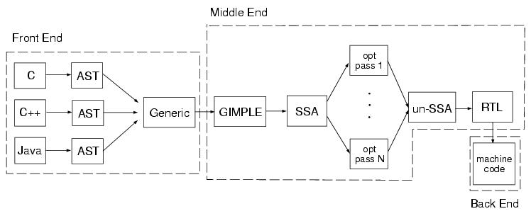

Try and tease out mainstream compilers(GNU/GCC, Clang/LLVM, Microsoft Visual Studio) architecture/framework, toolchain, binutils and language(C/C++) standards.

The following concepts/topics will be involved:

1. gcc/g++, glibc/libstdc++, gdb
2. clang/clang++, llvm-gcc/llvm-g++, libc/libc++, lldb
3. msvc/cl, windbg

<!-- more -->

## GNU/GCC

[The GNU Operating System and the Free Software Movement](https://www.gnu.org/)

!!! abstract "What is GNU?"

    GNU is an operating system that is [free software](https://www.gnu.org/philosophy/free-sw.html)—that is, it respects users' freedom. The GNU operating system consists of GNU packages (programs specifically released by the GNU Project) as well as free software released by third parties. The development of GNU made it possible to use a computer without software that would trample your freedom.

    We recommend installable versions of GNU (more precisely, [GNU/Linux](https://www.gnu.org/gnu/linux-and-gnu.html) distributions) which are entirely free software.

[GCC, the GNU Compiler Collection](https://gcc.gnu.org/)

!!! abstract "What is GCC?"

    The GNU Compiler Collection includes front ends for [C](https://gcc.gnu.org/c99status.html), [C++](https://gcc.gnu.org/projects/cxx-status.html), Objective-C, Fortran, Ada, Go, and D, as well as libraries for these languages (libstdc++,...). GCC was originally written as the compiler for the [GNU operating system](http://www.gnu.org/gnu/thegnuproject.html). The GNU system was developed to be 100% free software, free in the sense that it respects the user's freedom.

    We strive to provide regular, high quality [releases](https://gcc.gnu.org/releases.html), which we want to work well on a variety of native and cross targets (including GNU/Linux), and encourage everyone to contribute changes or help testing GCC.

[GCC, the GNU Compiler Collection](https://gcc.gnu.org/) @[git](git://gcc.gnu.org/git/gcc.git) - [wiki](https://en.wikipedia.org/wiki/GNU_Compiler_Collection)

[GCC online documentation](https://gcc.gnu.org/onlinedocs/) - [gcc](https://gcc.gnu.org/onlinedocs/gcc/)

- [Option Summary](https://gcc.gnu.org/onlinedocs/gcc/Option-Summary.html)
- [Overall Options](https://gcc.gnu.org/onlinedocs/gcc/Overall-Options.html)

[GCC Internals](https://gcc.gnu.org/onlinedocs/gccint/index.html)

### Architecture

[GNU C Compiler Internals/Architecture](https://en.wikibooks.org/wiki/GNU_C_Compiler_Internals/GNU_C_Compiler_Architecture)

For a C source file they are the preprocessor and compiler `cc1`, the assembler `as`, and the linker `collect2`. The first and the third programs come with a GCC *distribution*, the assembler is a part of the GNU *binutils* package.

<figure markdown="span">
    
</figure>

[Developer Options](https://gcc.gnu.org/onlinedocs/gcc/Developer-Options.html): `-dumpspecs` : Print the compiler’s built-in [Spec Files](https://gcc.gnu.org/onlinedocs/gcc/Spec-Files.html):

- cpp : Options to pass to the C preprocessor
- cc1 : Options to pass to the C compiler
- cc1plus : Options to pass to the C++ compiler

[cpp - The C Preprocessor](https://gcc.gnu.org/onlinedocs/cpp/)

- [Invocation](https://gcc.gnu.org/onlinedocs/cpp/Invocation.html): the preprocessor is actually *integrated* with the compiler rather than a separate program.
- [Preprocessor Options](https://gcc.gnu.org/onlinedocs/gcc/Preprocessor-Options.html): `-no-integrated-cpp`: Perform preprocessing as a *separate* pass before compilation.

[FAQ - GCC Wiki](https://gcc.gnu.org/wiki/FAQ#include_search_path): the GCC C compiler (`cc1`) and C++ compiler (`cc1cplus`)

[Why cc1 is called cc1?](https://stackoverflow.com/questions/13753854/why-cc1-is-called-cc1) [Relationship between cc1 and gcc?](https://unix.stackexchange.com/questions/77779/relationship-between-cc1-and-gcc)

> The 1 in `cc1` indicates that it is the first stage of the build process. The second stage is `collect2`.

[Collect2 (GCC Internals)](https://gcc.gnu.org/onlinedocs/gccint/Collect2.html): The program `collect2` is installed as `ld` in the directory where the passes of the compiler are installed.

### gcc and g++

GNU C Compiler: `gcc` / `cc`

- `c89` - ANSI (1989) C compiler
- `c99` - ANSI (1999) C compiler

GNU C++ Compiler: `g++` / `c++`

[Invoking G++ - Compiling C++ Programs](https://gcc.gnu.org/onlinedocs/gcc/Invoking-G_002b_002b.html)

GCC recognizes C++ header/source files with these names and compiles them as C++ programs even if you call the compiler the same way as for compiling C programs (usually with the name `gcc`).

However, the use of `gcc` does not add the C++ library. `g++` is a program that calls GCC and automatically specifies *linking* against the C++ library. It treats ‘.c’, ‘.h’ and ‘.i’ files as C++ source files instead of C source files unless `-x` is used. This program is also useful when precompiling a C header file with a ‘.h’ extension for use in C++ compilations. On many systems, `g++` is also installed with the name `c++`.

[What is the difference between g++ and gcc?](https://stackoverflow.com/questions/172587/what-is-the-difference-between-g-and-gcc)

`g++` is roughly equivalent to `gcc -xc++ -lstdc++ -shared-libgcc` (the 1st is a compiler option, the 2nd two are linker options).

- `-xc++`: Specify explicitly the language
- `-lstdc++`: Search the library named `stdc++`(libstdc++) when linking
- `-shared-libgcc`: G++ driver automatically adds this to use exceptions for C++ programs

[Difference between GCC and G++](https://www.geeksforgeeks.org/difference-between-gcc-and-g/)

g++ | gcc
----|-----
g++ is used to compile C++ program. | gcc is used to compile C program.
g++ can compile any .c or .cpp files but they will be treated as C++ files only. | gcc can compile any .c or .cpp files but they will be treated as C and C++ respectively.
Command to compile C++ program through g++ is `g++ fileName.cpp -o binary` | command to compile C program through gcc is `gcc fileName.c -o binary`
Using g++ to link the object files, files automatically links in the std C++ libraries. | gcc does not do this.
g++ compiles with more predefined macros. | gcc compiles C++ files with more number of predefined macros. Some of them are `#define __GXX_WEAK__ 1`, `#define __cplusplus 1`, `#define __DEPRECATED 1`, etc

下面是 rpi4b-ubuntu 的 /usr/bin 下 `cpp`、`gcc`、`g++` 命令，真身分别为 aarch64-linux-gnu-cpp-11、aarch64-linux-gnu-gcc-11、aarch64-linux-gnu-g++-11。

- aarch64-linux-gnu-gcc-11、aarch64-linux-gnu-g++-11 这两个二进制文件 size 一样，但是 md5sum 不一致。

```Shell
$ ls -l /usr/bin | grep -E "cpp|cc|[g|c]\+\+"
-rwxr-xr-x 1 root root         428 Nov 18  2020 c89-gcc
-rwxr-xr-x 1 root root         454 Nov 18  2020 c99-gcc

-rwxr-xr-x 1 root root      876656 May 13  2023 aarch64-linux-gnu-cpp-11
lrwxrwxrwx 1 root root          24 May 13  2023 cpp-11 -> aarch64-linux-gnu-cpp-11
lrwxrwxrwx 1 root root           6 Aug  5  2021 aarch64-linux-gnu-cpp -> cpp-11
lrwxrwxrwx 1 root root           6 Aug  5  2021 cpp -> cpp-11

-rwxr-xr-x 1 root root      872560 May 13  2023 aarch64-linux-gnu-gcc-11
lrwxrwxrwx 1 root root          24 May 13  2023 gcc-11 -> aarch64-linux-gnu-gcc-11
lrwxrwxrwx 1 root root           6 Aug  5  2021 aarch64-linux-gnu-gcc -> gcc-11
lrwxrwxrwx 1 root root           6 Aug  5  2021 gcc -> gcc-11

-rwxr-xr-x 1 root root      872560 May 13  2023 aarch64-linux-gnu-g++-11
lrwxrwxrwx 1 root root          24 May 13  2023 g++-11 -> aarch64-linux-gnu-g++-11
lrwxrwxrwx 1 root root           6 Aug  5  2021 aarch64-linux-gnu-g++ -> g++-11
lrwxrwxrwx 1 root root           6 Aug  5  2021 g++ -> g++-11

lrwxrwxrwx 1 root root          20 Feb 21 10:59 cc -> /etc/alternatives/cc
lrwxrwxrwx 1 root root          21 Feb 21 10:59 c++ -> /etc/alternatives/c++
```

进一步验证，`cc`、`c++` 分别是 gcc、g++ 的软链。

```Shell
$ ls -l /etc/alternatives/cc
lrwxrwxrwx 1 root root 12 Feb 21 10:59 /etc/alternatives/cc -> /usr/bin/gcc

$ ls -l /etc/alternatives/c++
lrwxrwxrwx 1 root root 12 Feb 21 10:59 /etc/alternatives/c++ -> /usr/bin/g++
```

### GNU binutils

[GNU Binary Utilities](https://en.wikipedia.org/wiki/GNU_Binary_Utilities) - [elfutils](https://sourceware.org/elfutils/)

[GNU Hurd](https://www.gnu.org/savannah-checkouts/gnu/hurd/binutils.html) / [GNU Binutils](https://www.gnu.org/software/binutils/) - @[sourceware](https://sourceware.org/binutils/) - [Documentation](https://sourceware.org/binutils/docs/)

Computer Systems - A Programmer's Perspective | Chapter 7: Linking - 7.14 Tools for Manipulating Object Files:

> There are a number of tools available on Linux systems to help you understand and manipulate object files. In particular, the GNU *binutils* package is especially helpful and runs on every Linux platform.

The GNU Binutils are a collection of binary tools. The main ones are:

- [ld](https://sourceware.org/binutils/docs/ld/index.html) - the [GNU linker](https://en.wikipedia.org/wiki/Linker_(computing)#GNU_linker).
- [as](https://sourceware.org/binutils/docs/as/index.html) - the [GNU Assembler](https://en.wikipedia.org/wiki/GNU_Assembler).
- `gold` - a new, faster, ELF only linker.

But they also include:

- `addr2line` - Converts addresses into filenames and line numbers.
- `ar` - A utility for creating, modifying and extracting from archives.
- `c++filt` - Filter to demangle encoded C++ symbols.
- `dlltool` - Creates files for building and using DLLs.
- `elfedit` - Allows alteration of ELF format files.
- `nm` - Lists symbols from object files.
- `objcopy` - Copies and translates object files.
- `objdump` - Displays information from object files.

    - The mother of all binary tools.
    - Can display *all* of the information in an object file.
    - `-f`/`-a`/`-h`/`-x`: display file/archive/section/all headers.
    - Its most useful function is *disassembling* the binary instructions in the `.text` section.

- `ranlib` - Generates an index to the contents of an archive.
- `readelf` - Displays information from any ELF format object file.
    - Subsumes the functionality of `size` and `nm`.
- `size` - Lists the section sizes of an object or archive file.
- `strip` - Discards symbols.

Linux systems also provide the ldd program for manipulating shared libraries:

- `ldd` - print shared object dependencies. Lists the shared libraries that an executable needs at run time.

---

关于 binutils，可参考阅读 [熟悉binutils工具集.pdf](https://github.com/guyongqiangx/makefile-study/blob/main/%E7%86%9F%E6%82%89binutils%E5%B7%A5%E5%85%B7%E9%9B%86.pdf)。

在 Linux(Ubuntu) 下，这些 GNU Binutils 一般预装在 `/usr/bin/` 目录下。

执行 `find` 命令，查看 /usr/bin 目录下的 arm64 GNU C 编译器工具链（不包括软链）。

??? info "/usr/bin/aarch64-linux-gnu-*"

    ```bash linenums="1"
    $ find /usr/bin ! -type l -name "aarch64-linux-gnu-*" | xargs ls -l
    -rwxr-xr-x 1 root root    18920  1月 23 23:08 /usr/bin/aarch64-linux-gnu-addr2line
    -rwxr-xr-x 1 root root    51440  1月 23 23:08 /usr/bin/aarch64-linux-gnu-ar
    -rwxr-xr-x 1 root root   415208  1月 23 23:08 /usr/bin/aarch64-linux-gnu-as
    -rwxr-xr-x 1 root root    14384  1月 23 23:08 /usr/bin/aarch64-linux-gnu-c++filt
    -rwxr-xr-x 1 root root   876656  5月 13  2023 /usr/bin/aarch64-linux-gnu-cpp-11
    -rwxr-xr-x 1 root root  1883496  1月 23 23:08 /usr/bin/aarch64-linux-gnu-dwp
    -rwxr-xr-x 1 root root    31224  1月 23 23:08 /usr/bin/aarch64-linux-gnu-elfedit
    -rwxr-xr-x 1 root root   872560  5月 13  2023 /usr/bin/aarch64-linux-gnu-g++-11
    -rwxr-xr-x 1 root root   872560  5月 13  2023 /usr/bin/aarch64-linux-gnu-gcc-11
    -rwxr-xr-x 1 root root    18824  5月 13  2023 /usr/bin/aarch64-linux-gnu-gcc-ar-11
    -rwxr-xr-x 1 root root    18824  5月 13  2023 /usr/bin/aarch64-linux-gnu-gcc-nm-11
    -rwxr-xr-x 1 root root    18824  5月 13  2023 /usr/bin/aarch64-linux-gnu-gcc-ranlib-11
    -rwxr-xr-x 1 root root   401168  5月 13  2023 /usr/bin/aarch64-linux-gnu-gcov-11
    -rwxr-xr-x 1 root root   249464  5月 13  2023 /usr/bin/aarch64-linux-gnu-gcov-dump-11
    -rwxr-xr-x 1 root root   270040  5月 13  2023 /usr/bin/aarch64-linux-gnu-gcov-tool-11
    -rwxr-xr-x 1 root root   110112  1月 23 23:08 /usr/bin/aarch64-linux-gnu-gprof
    -rwxr-xr-x 1 root root  1636696  1月 23 23:08 /usr/bin/aarch64-linux-gnu-ld.bfd
    -rwxr-xr-x 1 root root  5497328  1月 23 23:08 /usr/bin/aarch64-linux-gnu-ld.gold
    -rwxr-xr-x 1 root root 23037768  5月 13  2023 /usr/bin/aarch64-linux-gnu-lto-dump-11
    -rwxr-xr-x 1 root root    40312  1月 23 23:08 /usr/bin/aarch64-linux-gnu-nm
    -rwxr-xr-x 1 root root   162120  1月 23 23:08 /usr/bin/aarch64-linux-gnu-objcopy
    -rwxr-xr-x 1 root root   357328  1月 23 23:08 /usr/bin/aarch64-linux-gnu-objdump
    -rwxr-xr-x 1 root root     3126 11月 20 23:14 /usr/bin/aarch64-linux-gnu-python3.10-config
    -rwxr-xr-x 1 root root    51440  1月 23 23:08 /usr/bin/aarch64-linux-gnu-ranlib
    -rwxr-xr-x 1 root root   768360  1月 23 23:08 /usr/bin/aarch64-linux-gnu-readelf
    -rwxr-xr-x 1 root root  3382960  5月  4  2022 /usr/bin/aarch64-linux-gnu-run
    -rwxr-xr-x 1 root root    22752  1月 23 23:08 /usr/bin/aarch64-linux-gnu-size
    -rwxr-xr-x 1 root root    27008  1月 23 23:08 /usr/bin/aarch64-linux-gnu-strings
    -rwxr-xr-x 1 root root   162128  1月 23 23:08 /usr/bin/aarch64-linux-gnu-strip
    ```

过滤 /usr/bin 目录，可以看到一级软链：`addr2line`、`ar`、`as`、`gold`、`gprof`、`ld`、`nm`、`objcopy`、`objdump`、`ranlib`、`readelf`、`size`、`strings`、`strip`。`cpp`、`gcc`、`g++`、`cc`、`c++` 等为多级软链，具体参考上一节溯源。

??? info "/usr/bin/aarch64-linux-gnu-*@"

    ```bash linenums="1"
    $ ls -l /usr/bin | grep "\-> aarch64-linux-gnu"
    lrwxrwxrwx 1 root root          25  1月 23 23:08 aarch64-linux-gnu-gold -> aarch64-linux-gnu-ld.gold
    lrwxrwxrwx 1 root root          24  1月 23 23:08 aarch64-linux-gnu-ld -> aarch64-linux-gnu-ld.bfd
    lrwxrwxrwx 1 root root          27  1月 23 23:08 addr2line -> aarch64-linux-gnu-addr2line
    lrwxrwxrwx 1 root root          20  1月 23 23:08 ar -> aarch64-linux-gnu-ar
    lrwxrwxrwx 1 root root          20  1月 23 23:08 as -> aarch64-linux-gnu-as
    lrwxrwxrwx 1 root root          25  1月 23 23:08 c++filt -> aarch64-linux-gnu-c++filt
    lrwxrwxrwx 1 root root          24  5月 13  2023 cpp-11 -> aarch64-linux-gnu-cpp-11
    lrwxrwxrwx 1 root root          21  1月 23 23:08 dwp -> aarch64-linux-gnu-dwp
    lrwxrwxrwx 1 root root          25  1月 23 23:08 elfedit -> aarch64-linux-gnu-elfedit
    lrwxrwxrwx 1 root root          24  5月 13  2023 g++-11 -> aarch64-linux-gnu-g++-11
    lrwxrwxrwx 1 root root          24  5月 13  2023 gcc-11 -> aarch64-linux-gnu-gcc-11
    lrwxrwxrwx 1 root root          27  5月 13  2023 gcc-ar-11 -> aarch64-linux-gnu-gcc-ar-11
    lrwxrwxrwx 1 root root          27  5月 13  2023 gcc-nm-11 -> aarch64-linux-gnu-gcc-nm-11
    lrwxrwxrwx 1 root root          31  5月 13  2023 gcc-ranlib-11 -> aarch64-linux-gnu-gcc-ranlib-11
    lrwxrwxrwx 1 root root          25  5月 13  2023 gcov-11 -> aarch64-linux-gnu-gcov-11
    lrwxrwxrwx 1 root root          30  5月 13  2023 gcov-dump-11 -> aarch64-linux-gnu-gcov-dump-11
    lrwxrwxrwx 1 root root          30  5月 13  2023 gcov-tool-11 -> aarch64-linux-gnu-gcov-tool-11
    lrwxrwxrwx 1 root root          22  1月 23 23:08 gold -> aarch64-linux-gnu-gold
    lrwxrwxrwx 1 root root          23  1月 23 23:08 gprof -> aarch64-linux-gnu-gprof
    lrwxrwxrwx 1 root root          20  1月 23 23:08 ld -> aarch64-linux-gnu-ld
    lrwxrwxrwx 1 root root          24  1月 23 23:08 ld.bfd -> aarch64-linux-gnu-ld.bfd
    lrwxrwxrwx 1 root root          25  1月 23 23:08 ld.gold -> aarch64-linux-gnu-ld.gold
    lrwxrwxrwx 1 root root          29  5月 13  2023 lto-dump-11 -> aarch64-linux-gnu-lto-dump-11
    lrwxrwxrwx 1 root root          20  1月 23 23:08 nm -> aarch64-linux-gnu-nm
    lrwxrwxrwx 1 root root          25  1月 23 23:08 objcopy -> aarch64-linux-gnu-objcopy
    lrwxrwxrwx 1 root root          25  1月 23 23:08 objdump -> aarch64-linux-gnu-objdump
    lrwxrwxrwx 1 root root          24  1月 23 23:08 ranlib -> aarch64-linux-gnu-ranlib
    lrwxrwxrwx 1 root root          25  1月 23 23:08 readelf -> aarch64-linux-gnu-readelf
    lrwxrwxrwx 1 root root          22  1月 23 23:08 size -> aarch64-linux-gnu-size
    lrwxrwxrwx 1 root root          25  1月 23 23:08 strings -> aarch64-linux-gnu-strings
    lrwxrwxrwx 1 root root          23  1月 23 23:08 strip -> aarch64-linux-gnu-strip
    ```

如果要在 rpi4b-ubuntu/Cortex-A72(Aarch64) 上交叉编译 Cortex-R/M 或 Aarch32 位 hf 的目标 ELF，请参考 [Arm GNU Toolchain](./arm-toolchain.md) 安装 `gcc-arm-none-eabi`（arm-none-eabi-gcc） 和 `gcc-arm-linux-gnueabihf`（arm-linux-gnueabihf-gcc）。

### Language Standards

[Language Standards Supported by GCC](https://gcc.gnu.org/onlinedocs/gcc/Standards.html)

[Options Controlling the Kind of Output](https://gcc.gnu.org/onlinedocs/gcc/Overall-Options.html)

```Shell
-x language
Specify explicitly the language for the following input files (rather than letting the compiler choose a default based on the file name suffix). This option applies to all following input files until the next -x option.
```

[Options Controlling C Dialect](https://gcc.gnu.org/onlinedocs/gcc/C-Dialect-Options.html)

```Shell
-ansi
In C mode, this is equivalent to -std=c90. In C++ mode, it is equivalent to -std=c++98.

-std=
Determine the language standard. See Language Standards Supported by GCC, for details of these standard versions. This option is currently only supported when compiling C or C++.
```

[Options Controlling C++ Dialect](https://gcc.gnu.org/onlinedocs/gcc/C_002b_002b-Dialect-Options.html)

```Shell
-stdlib=libstdc++,libc++
When G++ is configured to support this option, it allows specification of alternate C++ runtime libraries. Two options are available: libstdc++ (the default, native C++ runtime for G++) and libc++ which is the C++ runtime installed on some operating systems (e.g. Darwin versions from Darwin11 onwards). The option switches G++ to use the headers from the specified library and to emit -lstdc++ or -lc++ respectively, when a C++ runtime is required for linking.
```

!!! question "c++11/gnu++11 有什么区别？"

    -std=`c++11`: The 2011 ISO C++ standard plus amendments.
    -std=`gnu++11`: GNU dialect of -std=c++11. ISO C 2011 with GNU extensions.

    [What are the differences between -std=c++11 and -std=gnu++11?](https://stackoverflow.com/questions/10613126/what-are-the-differences-between-std-c11-and-std-gnu11)  

    the difference between the two options is whether GNU extensions that violates the C++ standard are **enabled** or not. The GNU extensions are described [here](https://gcc.gnu.org/onlinedocs/gcc/C_002b_002b-Extensions.html).

使用 gcc 编译链接的时候，默认是采用动态链接的方式。如果要指定静态链接，有两种方式：

1. 使用 `-static` 选项，开启全静态链接。
2. 使用 `-Wl,-Bstatic`，`-Wl,-Bdynamic` 选项，将部分动态库设置为静态链接。

参考 [gcc 全静态链接](https://www.cnblogs.com/motadou/p/4471088.html)，[Q: linker "-static" flag usage](https://gcc.gnu.org/legacy-ml/gcc/2000-05/msg00517.html) 和 GCC [Link Options](https://gcc.gnu.org/onlinedocs/gcc/Link-Options.html) 中的相关选项说明。

- -static
- -static-libgcc
- -static-libstdc++

一些抑制/定制默认链接的选项：

```Shell
-nostartfiles
Do not use the standard system startup files when linking.

-nodefaultlibs
Do not use the standard system libraries when linking.

-nolibc
Do not use the C library or system libraries tightly coupled with it when linking.

-nostdlib
Do not use the standard system startup files or libraries when linking.

-nostdlib++
Do not implicitly link with standard C++ libraries.
```

#### glibc

[The GNU C Library](https://www.gnu.org/software/libc/) - [wiki](https://en.wikipedia.org/wiki/Glibc)

- [Documentation for the GNU C Library](https://sourceware.org/glibc/manual/)
- [The GNU C Reference Manual](https://www.gnu.org/software/gnu-c-manual/gnu-c-manual.html)

GNU C sourceware: [sourceware](https://sourceware.org/glibc/)

- [Release tarballs](https://ftp.gnu.org/gnu/libc/)
- [Sources](https://sourceware.org/glibc/sources.html) - [gitweb](https://sourceware.org/git/?p=glibc.git)
- [git](git://sourceware.org/git/glibc.git) - [Unofficial mirror @github](https://github.com/bminor/glibc)

[Linux的libc库](https://blog.csdn.net/Erice_s/article/details/106184779)，[libc、glibc 和 glib 的关系](https://blog.csdn.net/yasi_xi/article/details/9899599)
[What is the role of libc(glibc) in our linux app?](https://stackoverflow.com/questions/11372872/what-is-the-role-of-libcglibc-in-our-linux-app)
[Is the development of libc tied with Linux?](https://www.quora.com/Is-the-development-of-libc-tied-with-Linux-I-mean-is-libc-Linux-specific-I-thought-that-libc-is-a-standard-that-is-OS-independent-but-I-am-not-sure-Is-libc-updated-anytime-Linux-changes-its-syscalls)

> There is GNU Libc and the C standard library. The former is an implementation of the latter, but there are many other implementations. Even on Linux glibc is not the only option.

Linux/ubuntu 下可执行 `man libc` 或 `info libc` 查看 [libc(7) - Linux manual page](https://man7.org/linux/man-pages/man7/libc.7.html)。

- [Ubuntu Manpage: libc - overview of standard C libraries on Linux](https://manpages.ubuntu.com/manpages/bionic/man7/libc.7.html)

!!! note "libc vs. glibc"

    The term `libc` is commonly used as a shorthand for the “standard C library”.

    By far the most widely used C library on Linux is the GNU C Library, often referred to as `glibc`.

    In the early to mid 1990s, there was for a while *Linux libc*, a fork of glibc 1.x created by Linux developers who felt that glibc development at the time was not sufficing for the needs of Linux. Often, this library was referred to (ambiguously) as just `libc`.

    However, notwithstanding the original motivations of the Linux libc effort, by the time glibc 2.0 was released (in 1997), it was clearly superior to Linux libc, and all major Linux distributions that had been using Linux libc soon **switched** back to `glibc`.

GNU/Linux Options 中支持配置 C library 的选项：

- `-mglibc`
- `-muclibc`(*-*-linux-*uclibc*)
- `-mmusl`(*-*-linux-*musl*)
- `-mbionic`(*-*-linux-*android*)

??? info "获取查看 glibc 版本号"

    [glibc 查看版本号](https://www.cnblogs.com/motadou/p/4473966.html), [Linux(Ubuntu/CentOS) 下查看 GLIBC 版本](https://blog.csdn.net/gatieme/article/details/108945425)

    通过 `getconf` 命令获取 GNU_LIBC_VERSION：

    ```Shell
    $ getconf GNU_LIBC_VERSION
    glibc 2.35
    ```

    `ldd` 是 glibc 提供的命令，执行 `ldd --version` 会输出 glibc 的版本号：

    ```Shell
    $ ldd --version
    ldd (Ubuntu GLIBC 2.35-0ubuntu3.7) 2.35
    Copyright (C) 2022 Free Software Foundation, Inc.
    This is free software; see the source for copying conditions.  There is NO
    warranty; not even for MERCHANTABILITY or FITNESS FOR A PARTICULAR PURPOSE.
    Written by Roland McGrath and Ulrich Drepper.
    ```

    直接执行 libc.so，可以看到 GLIBC 版本为 2.35：

    ```Shell
    $ /lib/aarch64-linux-gnu/libc.so.6
    GNU C Library (Ubuntu GLIBC 2.35-0ubuntu3.7) stable release version 2.35.
    Copyright (C) 2022 Free Software Foundation, Inc.
    This is free software; see the source for copying conditions.
    There is NO warranty; not even for MERCHANTABILITY or FITNESS FOR A
    PARTICULAR PURPOSE.
    Compiled by GNU CC version 11.4.0.
    libc ABIs: UNIQUE ABSOLUTE
    For bug reporting instructions, please see:
    <https://bugs.launchpad.net/ubuntu/+source/glibc/+bugs>.
    ```

#### libstdc++

[The GNU C++ Library](https://gcc.gnu.org/onlinedocs/libstdc++/)

[The GNU C++ Library Manual](https://gcc.gnu.org/onlinedocs/libstdc++/manual/index.html)

The GCC project includes an implementation of the C++ Standard Library called `libstdc++`, licensed under the GPLv3 License with an exception to link non-GPL applications when sources are built with GCC.

[厘清 gcc、glibc、libstdc++ 的关系](https://www.jianshu.com/p/a3c983edabd1)

[如何升级linux的libstdc++.so - 知乎](https://zhuanlan.zhihu.com/p/498529973)

### GDB

[GCC Debugging Options](https://gcc.gnu.org/onlinedocs/gcc/Debugging-Options.html)

[GNU Hurd / GNU GDB](https://www.gnu.org/savannah-checkouts/gnu/hurd/gdb.html) - [wiki](https://en.wikipedia.org/wiki/GNU_Debugger)

[GDB: The GNU Project Debugger](https://sourceware.org/gdb/current/onlinedocs/)

- [GDB’s Obsolete Annotations](https://sourceware.org/gdb/current/onlinedocs/annotate.html)
- Debugging with GDB: [integrated](https://sourceware.org/gdb/current/onlinedocs/gdb), [index/toc](https://sourceware.org/gdb/current/onlinedocs/gdb.html/index.html)
- @[sourceware](https://www.sourceware.org/gdb/), [git](git://sourceware.org/git/binutils-gdb.git)

VisualGDB - [GDB Command Reference](https://visualgdb.com/gdbreference/commands/)

[GDB online Debugger](https://www.onlinegdb.com/)

## Clang/LLVM

In 2006, [Chris Lattner](https://nondot.org/sabre/) started working on a new project named Clang. The combination of Clang *frontend* and LLVM *backend* is named Clang/LLVM or simply Clang.

[The LLVM Compiler Infrastructure Project](https://llvm.org/) - [wiki](https://en.wikipedia.org/wiki/LLVM) @[github](https://github.com/llvm/llvm-project)

- [LLVM's Documentation](https://llvm.org/docs/)

[Clang C Language Family Frontend for LLVM](https://clang.llvm.org/) - [wiki](https://en.wikipedia.org/wiki/Clang)

- [Clang's documentation](https://clang.llvm.org/docs/)
- [Clang Compiler User’s Manual](https://clang.llvm.org/docs/UsersManual.html)
- [clang - the Clang C, C++, and Objective-C compiler](https://clang.llvm.org/docs/CommandGuide/clang.html)
- [Clang command line argument reference](https://clang.llvm.org/docs/ClangCommandLineReference.html)
- [Preprocessor options](https://clang.llvm.org/docs/ClangCommandLineReference.html#preprocessor-options)

作为 Apple Developer，往往首先需要在 macOS 开发机上安装 Xcode IDE，Clang/LLVM 编译器工具链包含在 Xcode command-line tools 中。

!!! abstract "What is the Command Line Tools Package?"

    [Technical Note TN2339: Building from the Command Line with Xcode FAQ](https://developer.apple.com/library/archive/technotes/tn2339/_index.html)

    The Command Line Tools Package is a small self-contained package available for download separately from Xcode and that allows you to do command line development in macOS. It consists of the macOS SDK and command-line tools such as *Clang*, which are installed in the `/Library/Developer/CommandLineTools` directory.

    > In macOS 10.9 and later, the Downloads pane of Xcode Preferences does not support downloading command-line tools.

如果不是 Apple Native Developer，只是把 macOS 当做 User-friendly 的 Unix-like 开发机使用，可以自行前往 [Download for Apple Developers page](https://developer.apple.com/download/all/) 下载安装 Command Line Tools。在 macOS 上安装 homebrew 也会提示需要安装 Xcode Command Line Tools。

!!! abstract "Command Line Tools for Xcode"

    This package enables *UNIX-style* development via Terminal by installing command line developer tools, as well as macOS SDK frameworks and headers. Many useful tools are included, such as the Apple *LLVM* compiler, linker, and Make. If you use Xcode, these tools are also **embedded** within the Xcode IDE.

### Architecture

[Introduction to the LLVM Compiler System](https://llvm.org/pubs/2008-10-04-ACAT-LLVM-Intro.html)

[The Architecture of Open Source Applications (Volume 1) LLVM](https://aosabook.org/en/v1/llvm.html)

Three Major Components of a Three-Phase Compiler:

<figure markdown="span">
    
</figure>

<figure markdown="span">
    
</figure>

Implications of this Design - Retargetablity:

<figure markdown="span">
    
</figure>

LLVM's Implementation of Three-Phase Design:

<figure markdown="span">
    
</figure>

!!! abstract "LLVM Linker"

    The `lld` subproject is an attempt to develop a built-in, platform-independent linker for LLVM. lld aims to remove dependence on a third-party linker. As of May 2017, lld supports [ELF](https://en.wikipedia.org/wiki/Executable_and_Linkable_Format), [PE/COFF](https://en.wikipedia.org/wiki/PE/COFF), [Mach-O](https://en.wikipedia.org/wiki/Mach-O), and [WebAssembly](https://en.wikipedia.org/wiki/WebAssembly) in descending order of completeness. lld is faster than both flavors of GNU ld.

    Unlike the GNU linkers, lld has built-in support for [link-time optimization](https://en.wikipedia.org/wiki/Link-time_optimization) (LTO). This allows for faster code generation as it bypasses the use of a linker plugin, but on the other hand prohibits interoperability with other flavors of LTO.

### GCC compatibility

[xcode - Why can't I check my version of GCC compiler on OS X - Stack Overflow](https://stackoverflow.com/questions/20171095/why-cant-i-check-my-version-of-gcc-compiler-on-os-x)

> Apple no longer distributes GCC with Xcode. They now use `Clang` as the default (and only!) compiler on Mac OS X. cc, gcc, and clang (as well as the C++ variants, c++, g++, and clang++) are now all **linked** to run clang under current versions of Xcode.

[installation compiler cc or gcc in Mac OS 10.13.3 - Apple Community](https://discussions.apple.com/thread/8440495?sortBy=best)

> Apple no longer includes GNU products due to their GPL3 licensing issues. The clang/llvm compiler technology does have limited, legacy (older) GNU C/C++ compatibility — even down to the gcc/g++ commands (**linked** to clang/llvm GNU compatibility mode) which can compile well-written C/C++ code that does not have specific GNU dependencies.

[Clang Performance and GCC compatibility](https://en.wikipedia.org/wiki/Clang#Performance_and_GCC_compatibility)

> Clang Compiler Driver (Drop-in Substitute for GCC): The clang tool is the compiler driver and front-end, which is designed to be a drop-in replacement for the gcc command.

!!! abstract "GCC compatibility"

    Clang is compatible with GCC. Its command-line interface shares many of GCC's flags and options. Clang implements many GNU language extensions and compiler intrinsics, some of which are purely for compatibility. For example, even though Clang implements atomic intrinsics which correspond exactly with C11 atomics, it also implements GCC's __sync_* intrinsics for compatibility with GCC and libstdc++. Clang also maintains ABI compatibility with GCC-generated object code. In practice, Clang is a drop-in replacement for GCC.

[gcc - Is there a binutils for llvm? - Stack Overflow](https://stackoverflow.com/questions/5238582/is-there-a-binutils-for-llvm)

### llvm-gcc/llvm-g++

在 macOS 上执行 `which clang` 和 `clang --version` 检查 clang 的位置和版本。

```Shell
$ which clang
/usr/bin/clang

# /usr/bin/clang --version
$ clang --version
Apple clang version 15.0.0 (clang-1500.3.9.4)
Target: arm64-apple-darwin23.5.0
Thread model: posix
InstalledDir: /Applications/Xcode.app/Contents/Developer/Toolchains/XcodeDefault.xctoolchain/usr/bin
```

在 XcodeDefault.xctoolchain/usr/bin 下，clang 还有个软链替身（symbolic link）——clang++。

[Clang is the name of the whole compiler](https://stackoverflow.com/questions/20047218/what-is-the-difference-clang-clang-std-c11). However, from a command-line point of view:

- `clang` is the C compiler
- `clang++` is the C++ compiler

Clang is compatible with GCC. Its command-line interface shares many of GCC's flags and options.

在 macOS 中，clang/[gcc](https://veryitman.com/2018/10/13/macOS-%E4%B8%AD%E7%A5%9E%E7%A7%98%E7%9A%84-GCC/) 以某种方式指向 `llvm-gcc` 编译器。

> llvm-gcc is a C, C++, Objective-C and Objective-C++ compiler.
> llvm-gcc uses gcc front-end and gcc's command line interface.
> In Apple's version of GCC, both cc and gcc are actually *symbolic links* to the llvm-gcc compiler.

而 clang/g++ 则以某种方式指向 `llvm-g++` 编译器。

> llvm-g++ is a compiler driver for C++.
> Similarly, c++ and g++ are links to llvm-g++.

[llvmgcc](https://releases.llvm.org/2.8/docs/CommandGuide/html/llvmgcc.html): llvm-gcc - LLVM C front-end

!!! abstract "llvm-gcc"

    The **llvm-gcc** command is the LLVM C front end. It is a modified version of gcc that compiles C/ObjC programs into native objects, LLVM bitcode or LLVM assembly language, depending upon the options.

    By default, **llvm-gcc** compiles to native objects just like GCC does. If the` -emit-llvm` and `-c` options are given then it will generate LLVM bitcode files instead. If `-emit-llvm` and `-S` are given, then it will generate LLVM assembly.

    Being derived from the GNU Compiler Collection, **llvm-gcc** has many of gcc's features and accepts most of gcc's options. It handles a number of gcc's extensions to the C programming language. See the gcc documentation for details.

[llvmgxx](https://releases.llvm.org/2.8/docs/CommandGuide/html/llvmgxx.html): llvm-g++ - LLVM C++ front-end

!!! abstract "llvm-g++"

    The **llvm-g++** command is the LLVM C++ front end. It is a modified version of g++ that compiles C++/ObjC++ programs into native code, LLVM bitcode or assembly language, depending upon the options.

    By default, **llvm-g++** compiles to native objects just like GCC does. If the `-emit-llvm` option is given then it will generate LLVM bitcode files instead. If `-S` (assembly) is also given, then it will generate LLVM assembly.

    Being derived from the GNU Compiler Collection, **llvm-g++** has many of g++'s features and accepts most of g++'s options. It handles a number of g++'s extensions to the C++ programming language.

`which gcc` 和 `which g++` 输出位置为 `/usr/bin`；但是 `gcc --version` 和 `g++ --version` 输出的 InstalledDir 目录为 `$(xcode-select -p)/Toolchains/XcodeDefault.xctoolchain/usr/bin`。

=== "gcc --version"

    ```Shell
    $ which llvm-gcc
    /usr/bin/llvm-gcc

    $ which gcc
    /usr/bin/gcc

    # llvm-gcc --version
    $ gcc --version
    Apple clang version 15.0.0 (clang-1500.3.9.4)
    Target: arm64-apple-darwin23.5.0
    Thread model: posix
    InstalledDir: /Applications/Xcode.app/Contents/Developer/Toolchains/XcodeDefault.xctoolchain/usr/bin
    ```

=== "g++ --version"

    ```Shell
    $ which llvm-g++
    /usr/bin/llvm-g++

    $ which g++
    /usr/bin/g++

    # llvm-g++ --version
    $ g++ --version
    Apple clang version 15.0.0 (clang-1500.3.9.4)
    Target: arm64-apple-darwin23.5.0
    Thread model: posix
    InstalledDir: /Applications/Xcode.app/Contents/Developer/Toolchains/XcodeDefault.xctoolchain/usr/bin
    ```

这两个目录有什么关联（猫腻）呢？

在 macOS 下执行 `cat /etc/paths` 可以看到环境变量中有 `/usr/local/bin` 和 `/usr/bin`，没有 Xcode 或 CommandLineTools 相关的 /usr/bin 目录。执行 `echo $PATH` 查看 PATH，其中也没有这些 Xcode Compiler Toolchain 目录。

可以确定的是，llvm-gcc/llvm-g++ 来自 /usr/bin，至少从命令行执行层面来看是这样的。

### clang/llvm binutils

[Technical Note TN2339: Building from the Command Line with Xcode FAQ](https://developer.apple.com/library/archive/technotes/tn2339/_index.html)

!!! abstract "xcode command-line tools bundled shims or wrapper in /usr/bin"

    If Xcode is installed on your machine, then there is no need to install them. Xcode comes bundled with all your command-line tools. macOS 10.9 and later includes shims or wrapper executables. These shims, installed in `/usr/bin`, can map any tool included in `/usr/bin` to the corresponding one inside Xcode. `xcrun` is one of such shims, which allows you to find or run any tool inside Xcode from the command line. Use it to invoke any tool within Xcode from the command line.

执行 `man xcode-select` 查看帮助，手册中的 Usage 部分和 FILES 有相关说明：

```Shell
man xcode-select

Usage

       After setting a developer directory, all of the xcode-select provided developer tool shims (see
       FILES) will automatically invoke the version of the tool inside the selected developer directory.
       Your own scripts, makefiles, and other tools can also use xcrun(1) to easily lookup tools inside
       the active developer directory, making it easy to switch them between different versions of the
       Xcode tools and allowing them to function properly on systems where the Xcode application has
       been installed to a non-default location.

FILES

       /usr/bin/git /usr/bin/make

       /usr/bin/c89 /usr/bin/c99
       /usr/bin/clang++ /usr/bin/clang
       /usr/bin/cpp /usr/bin/ctags
       /usr/bin/g++ /usr/bin/gcc

       /usr/bin/as /usr/bin/ar
       /usr/bin/ld /usr/bin/lldb
       /usr/bin/nm /usr/bin/objdump
       /usr/bin/ranlib /usr/bin/size
       /usr/bin/strings /usr/bin/strip
       Runs the matching BSD tool from with the active developer directory.
```

xcode-select 和 xcrun 命令：

- `xcode-select -s`: Sets the active developer directory to the given path, for example /Applications/Xcode-beta.app.
- `xcode-select -p`: Prints the path to the currently selected developer directory.
- `xcrun` - Run or locate development tools and properties.

#### xcode_select.tool-shim

use `xcrun` to easily lookup tools inside the active developer directory:

```Shell
# xcrun provide the absolute path
$ xcrun -f gcc
/Applications/Xcode.app/Contents/Developer/usr/bin/gcc
# xcrun gcc --version

$ xcrun -f g++
/Applications/Xcode.app/Contents/Developer/usr/bin/g++
# xcrun g++ --version

$ xcrun -f cc
/Applications/Xcode.app/Contents/Developer/Toolchains/XcodeDefault.xctoolchain/usr/bin/cc
$ xcrun -f c++
/Applications/Xcode.app/Contents/Developer/Toolchains/XcodeDefault.xctoolchain/usr/bin/c++
$ xcrun -f cpp
/Applications/Xcode.app/Contents/Developer/Toolchains/XcodeDefault.xctoolchain/usr/bin/cpp
```

综上可知，macOS 下 clang/llvm 的 compiler toolchain Binutils 分布在四个 /usr/bin 目录下：

1. /usr/bin
2. /Library/Developer/CommandLineTools/usr/bin
3. /Applications/Xcode.app/Contents/Developer/usr/bin
4. /Applications/Xcode.app/Contents/Developer/Toolchains/XcodeDefault.xctoolchain/usr/bin

对四个 /usr/bin 目录分支执行 `ls -l` 过滤出 clang/clang++, gcc/cc, g++/c++ 相关命令。

```Shell
usrbin=/usr/bin
cmdbin=/Library/Developer/CommandLineTools/usr/bin
xcdevpath=`xcode-select -p` # /Applications/Xcode.app/Contents/Developer
xcdevbin=$xcdevpath/usr/bin
xctcbin=$xcdevpath/Toolchains/XcodeDefault.xctoolchain/usr/bin

ls -l $usrbin | grep -E "clang|(cc|gcc)$|[g|c]\+\+"
ls -l $cmdbin | grep -E "clang|(cc|gcc)$|[g|c]\+\+"
ls -l $xcdevbin | grep -E "clang|(cc|gcc)$|[g|c]\+\+"
ls -l $xctcbin | grep -E "clang|(cc|gcc)$|[g|c]\+\+"

# 可以执行以下命令查看目录之间的公共分布
comm -12 <(ls $usrbin) <(ls $cmdbin)
comm -12 <(ls $usrbin) <(ls $xcdevbin)
comm -12 <(ls $usrbin) <(ls $xctcbin)
```

=== "usrbin"

    ```Shell
    $ ls -l $usrbin | grep -E "clang|cpp|(cc|gcc)$|[g|c]\+\+"
    -rwxr-xr-x  77 root   wheel    119008 Apr 20 12:52 c++
    -rwxr-xr-x  77 root   wheel    119008 Apr 20 12:52 cc
    -rwxr-xr-x  77 root   wheel    119008 Apr 20 12:52 clang
    -rwxr-xr-x  77 root   wheel    119008 Apr 20 12:52 clang++
    -rwxr-xr-x  77 root   wheel    119008 Apr 20 12:52 cpp
    -rwxr-xr-x  77 root   wheel    119008 Apr 20 12:52 g++
    -rwxr-xr-x  77 root   wheel    119008 Apr 20 12:52 gcc
    -rwxr-xr-x  77 root   wheel    119008 Apr 20 12:52 llvm-g++
    -rwxr-xr-x  77 root   wheel    119008 Apr 20 12:52 llvm-gcc
    ```

=== "cmdbin"

    ```Shell
    $ ls -l $cmdbin | grep -E "clang|cpp|(cc|gcc)$|[g|c]\+\+"
    lrwxr-xr-x  1 root  wheel          5 Mar  8 00:55 c++ -> clang
    lrwxr-xr-x  1 root  wheel          5 Mar  8 00:55 cc -> clang
    -rwxr-xr-x  1 root  wheel  251484800 Feb 23 10:06 clang
    lrwxr-xr-x  1 root  wheel          5 Mar  8 00:55 clang++ -> clang
    lrwxr-xr-x  1 root  wheel          3 Mar  8 00:55 g++ -> gcc
    -rwxr-xr-x  1 root  admin       3344 Feb  3 02:02 cpp
    -rwxr-xr-x  1 root  admin     101088 Feb 23 10:06 gcc
    ```

=== "xcdevbin"

    ```Shell
    $ ls -l $xcdevbin | grep -E "clang|cpp|(cc|gcc)$|[g|c]\+\+"
    lrwxr-xr-x  1 root  wheel         3 Mar  6 13:05 g++ -> gcc
    -rwxr-xr-x  1 root  wheel    101088 Feb 23 10:06 gcc
    ```

=== "xctcbin"

    ```Shell
    $ ls -l $xctcbin | grep -E "clang|cpp|(cc|gcc)$|[g|c]\+\+"
    lrwxr-xr-x  1 root  wheel          5 Mar  6 13:04 c++ -> clang
    lrwxr-xr-x  1 root  wheel          5 Mar  6 13:04 cc -> clang
    -rwxr-xr-x  1 root  wheel  251484800 Feb 23 10:06 clang
    lrwxr-xr-x  1 root  wheel          5 Mar  6 13:04 clang++ -> clang
    -rwxr-xr-x  1 root  wheel       3344 Feb  3 02:01 cpp
    ```

从输出结果来看，有些是实体文件，有些是软链替身：

1. 系统 /usr/bin 下的 clang/clang++, cpp, gcc/cc, g++/c++ 等 size 和 md5 一致。执行 `strings` 命令或 `otool -P` 查看其中的 plist 可知，它们均为 xcode_select.tool-shim。
2. CommandLineTools（cmdbin）和 `xcode-select -p`（xcdevbin）下的 clang++ 和 cc/c++ 均指向 clang ，g++ 指向 gcc（貌似还是 xcode_select.tool-shim？）。

#### corresponding to GNU

除了 llvm-gcc/llvm-g++ 编译器，从 `man xcode-select` 的 FILES 部分，可以看到 /usr/bin 下的 as、ar、ld、lldb、nm、objdump、ranlib、strings、size、strip 等 GNU compatible 同名 binutils 也是 xcode_select.tool-shim。当我们在执行 `objdump` 时，实际上等价于 `xcrun objdump`。

下面稍微梳理对比一下 clang 和 gcc 提供的常用工具集（binutils）。

clang 相比 gcc 少了以下命令，有些官方提供了 drop-in replacement：

- `gold`: [The LLVM gold plugin](https://llvm.org/docs/GoldPlugin.html)
- `addr2line`: [llvm-addr2line - a drop-in replacement for addr2line](https://llvm.org/docs/CommandGuide/llvm-addr2line.html)
- `elfedit`: segedit
- `objcopy`: [llvm-objcopy - object copying and editing tool](https://llvm.org/docs/CommandGuide/llvm-objcopy.html)
- `readelf`: [llvm-readelf - GNU-style LLVM Object Reader](https://llvm.org/docs/CommandGuide/llvm-readelf.html)

clang 相比 gcc 多了以下命令，有些是针对 [Mach-O](https://en.wikipedia.org/wiki/Mach-O)（参考 [Overview](https://developer.apple.com/library/archive/documentation/Performance/Conceptual/CodeFootprint/Articles/MachOOverview.html)，[Reference](https://github.com/aidansteele/osx-abi-macho-file-format-reference)）格式特有的操作工具：

- `cmpdylib` - compare two dynamic shared libraries for compatibility
- `dsymutil` - manipulate archived DWARF debug symbol files
- `dwarfdump` - dump and verify DWARF debug information
- `install_name_tool` - change dynamic shared library install names
- `libtool` - create libraries
- `lipo` - create or operate on universal files

    - `lipo -info`: Display a brief description

- `lorder` – list dependencies for object files
- `nmedit` - change global symbols to local symbols
- `otool`(-classic) - object file displaying tool

    - `otool -h`: Display the Mach header
    - `otool -L`: Display the shared libraries uses - 对应 Linux 下的 `ldd`

- `segedit` - extract and replace sections from object files
- `unifdef`, unifdefall – remove preprocessor conditionals from code
- `vtool` – Mach-O version number utility

[Cross-compilation using Clang](https://clang.llvm.org/docs/CrossCompilation.html)
[Building Linux with Clang/LLVM — The Linux Kernel documentation](https://docs.kernel.org/kbuild/llvm.html)

```Shell
make CC=clang LD=ld.lld AR=llvm-ar NM=llvm-nm STRIP=llvm-strip \
  OBJCOPY=llvm-objcopy OBJDUMP=llvm-objdump READELF=llvm-readelf \
  HOSTCC=clang HOSTCXX=clang++ HOSTAR=llvm-ar HOSTLD=ld.lld
```

### Language Standards

[LLVM Language Reference Manual](https://llvm.org/docs/LangRef.html)

[Clang - C Programming Language Status](https://clang.llvm.org/c_status.html)
[Clang - C++ Programming Language Status](https://clang.llvm.org/cxx_status.html)

[clang - the Clang C, C++, and Objective-C compiler](https://clang.llvm.org/docs/CommandGuide/clang.html)

OPTIONS | Language Selection and Mode Options:

```Shell
-x <language>
Treat subsequent input files as having type language.

-ansi
Same as -std=c89.

-std=<standard>
Specify the c/c++ language standard to compile for.

The default C language standard is gnu17, except on PS4, where it is gnu99.
The default C++ language standard is gnu++17.

-stdlib=<library>
Specify the C++ standard library to use; supported options are libstdc++ (GNU GCC) and libc++ (Clang). If not specified, platform default will be used.
```

[Clang command line argument reference](https://clang.llvm.org/docs/ClangCommandLineReference.html)

Introduction:

```Shell
-std-default=<arg>
-stdlib=<arg>, --stdlib=<arg>, --stdlib <arg>
C++ standard library to use. <arg> must be ‘libc++’, ‘libstdc++’ or ‘platform’.
```

Compilation options:

```Shell
-std=<arg>, --std=<arg>, --std <arg>
Language standard to compile for
```

[Compiler Specifics — alpaka 1.0.0-rc1 documentation](https://alpaka.readthedocs.io/en/latest/advanced/compiler.html)

[C++ Language Support - Xcode - Apple Developer](https://developer.apple.com/xcode/cpp/)

Apple supports C++ with the Apple `Clang` compiler (included in Xcode) and the `libc++` C++ standard library runtime (included in SDKs and operating systems). The compiler and runtime are regularly updated to offer new functionality, including many leading-edge features specified by the ISO C++ standard.

关于静态链接，参考 [Clang command line argument reference](https://clang.llvm.org/docs/ClangCommandLineReference.html) 相关选项：

- -static-libgcc
- -static-libstdc++

#### libc

[C Language Features](https://clang.llvm.org/docs/UsersManual.html#c-language-features)

[The LLVM C Library](https://libc.llvm.org/) is an incomplete, upcoming, ABI independent C standard library designed by and for the LLVM project.

!!! warning "libc incompleteness"

    The `libc` is not complete. If you need a fully functioning C library right now, you should continue to use your standard system libraries.

Xcode Project Settings | Language | C Language Dialect 对应 project.pbxproj 中 buildSettings 字典的 key = `GCC_C_LANGUAGE_STANDARD`。

#### libc++

[C++ Language Features](https://clang.llvm.org/docs/UsersManual.html#cxx)

The LLVM project includes an implementation of the C++ Standard Library named `libc++`, dual-licensed under the MIT License and the UIUC license.

[“libc++” C++ Standard Library — libc++ documentation](https://libcxx.llvm.org/)

`libc++` is a new implementation of the C++ standard library, targeting C++11 and above.

Xcode Project Settings | Language - C++:

- C++ Language Dialect 对应 project.pbxproj 中 buildSettings 字典的 key = `CLANG_CXX_LANGUAGE_STANDARD`。
- C++ Standard Library 对应 project.pbxproj 中 buildSettings 字典的 key = `CLANG_CXX_LIBRARY`。

### LLDB

[Controlling Debug Information](https://clang.llvm.org/docs/UsersManual.html#controlling-debug-information)
[Debug information generation](https://clang.llvm.org/docs/ClangCommandLineReference.html#debug-information-generation)

[LLDB](https://lldb.llvm.org/) - [wiki](https://en.wikipedia.org/wiki/LLDB_(debugger))

- [GDB to LLDB command map](https://lldb.llvm.org/use/map.html)
- [Tutorial](https://lldb.llvm.org/use/tutorial.html)
- [Debugging](https://lldb.llvm.org/resources/debugging.html)

[Getting Started with LLDB](https://developer.apple.com/library/archive/documentation/IDEs/Conceptual/gdb_to_lldb_transition_guide/document/lldb-basics.html)
[GDB and LLDB Command Examples](https://developer.apple.com/library/archive/documentation/IDEs/Conceptual/gdb_to_lldb_transition_guide/document/lldb-command-examples.html)

[Dancing in the Debugger — A Waltz with LLDB](https://www.objc.io/issues/19-debugging/lldb-debugging/)
[ObjC 中国 - 与调试器共舞 - LLDB 的华尔兹](https://objccn.io/issue-19-2/)

## MSVC

[MSVC](https://en.wikipedia.org/wiki/Microsoft_Visual_C%2B%2B)

[Install Visual Studio](https://learn.microsoft.com/en-us/visualstudio/install/install-visual-studio?view=vs-2022)
[Visual Studio documentation](https://learn.microsoft.com/en-us/visualstudio/windows/?view=vs-2022)

### Binutils

[C/C++ projects and build systems in Visual Studio](https://learn.microsoft.com/en-us/cpp/build/projects-and-build-systems-cpp)

Compiler and build tools reference - [C/C++ Building Reference - Visual Studio](https://learn.microsoft.com/en-us/cpp/build/reference/c-cpp-building-reference)

Win10 下安装的 Visual Studio 的 VC Binutils 目录：

1. VS2015: `C:\Program Files (x86)\Microsoft Visual Studio 14.0\VC\bin`；
2. VS2022 Community: `C:\Program Files\Microsoft Visual Studio\2022\Community\VC\Tools\MSVC\14.39.33519\bin\Hostx86\x64`。

[Use the Microsoft C++ toolset from the command line](https://learn.microsoft.com/en-us/cpp/build/building-on-the-command-line) - [Compiler Options](https://learn.microsoft.com/lt-lt/cpp/build/reference/compiler-options)

- [CL](https://learn.microsoft.com/en-us/cpp/build/reference/compiling-a-c-cpp-program): Use the compiler (`cl.exe`) to compile and link source code files into apps, libraries, and DLLs.
- [Link](https://learn.microsoft.com/en-us/cpp/build/reference/linking): Use the linker (`link.exe`) to link compiled object files and libraries into apps and DLLs.

- [LIB.EXE](https://learn.microsoft.com/en-us/cpp/build/reference/lib-reference) is used to create and manage a library of Common Object File Format (COFF) object files. It can also be used to create export files and import libraries to reference exported definitions.
- [EDITBIN.EXE](https://learn.microsoft.com/en-us/cpp/build/reference/editbin-reference) is used to modify COFF binary files.
- [DUMPBIN.EXE](https://learn.microsoft.com/en-us/cpp/build/reference/dumpbin-reference) displays information (such as a symbol table) about COFF binary files.
- [Decorated names](https://learn.microsoft.com/en-us/cpp/build/reference/decorated-names) - Viewing undecorated names: You can use `undname.exe` to convert a decorated name to its undecorated form. ref to [Demangling in MSVC - c++](https://stackoverflow.com/questions/13777681/demangling-in-msvc).

[NMAKE](https://learn.microsoft.com/en-us/cpp/build/reference/nmake-reference): Use NMAKE (`nmake.exe`) reads and executes makefiles, to build C++ projects by using a traditional makefile.

[CMake](https://learn.microsoft.com/en-us/cpp/build/cmake-projects-in-visual-studio): CMake (`cmake.exe`) is a cross-platform, open-source tool for defining build processes that run on multiple platforms.

[CMake projects in Visual Studio](https://learn.microsoft.com/en-us/cpp/build/cmake-projects-in-visual-studio)

- [Walkthrough: Build and Debug C++ with Microsoft Windows Subsystem for Linux 2 (WSL 2) and Visual Studio 2022](https://learn.microsoft.com/en-us/cpp/build/walkthrough-build-debug-wsl2)
- [Clang/LLVM support in Visual Studio CMake projects](https://learn.microsoft.com/en-us/cpp/build/clang-support-cmake)

### Language Standards

[/std (Specify Language Standard Version)](https://learn.microsoft.com/en-us/cpp/build/reference/std-specify-language-standard-version)

[Microsoft C++ compiler versions](https://learn.microsoft.com/en-us/cpp/overview/compiler-versions)

[C and C++ in Visual Studio](https://learn.microsoft.com/en-us/cpp/overview/visual-cpp-in-visual-studio)
[Microsoft C/C++ language conformance](https://learn.microsoft.com/en-us/cpp/overview/visual-cpp-language-conformance)
[C++ conformance improvements in Visual Studio 2022](https://learn.microsoft.com/en-us/cpp/overview/cpp-conformance-improvements)

[Microsoft C/C++ Documentation](https://learn.microsoft.com/en-us/cpp/?view=msvc-160): C++, C, and Assembler
[C runtime library reference](https://learn.microsoft.com/en-us/cpp/c-runtime-library/c-run-time-library-reference?view=msvc-160)
[Universal C runtime routines by category](https://learn.microsoft.com/en-us/cpp/c-runtime-library/run-time-routines-by-category?view=msvc-160)

[C/C++ language and standard libraries reference](https://learn.microsoft.com/en-us/cpp/cpp/c-cpp-language-and-standard-libraries)

### WinDbg

[First look at the debugger - Visual Studio (Windows)](https://learn.microsoft.com/en-us/visualstudio/debugger/debugger-feature-tour?view=vs-2022)

[Debugging Tools for Windows - Windows drivers](https://learn.microsoft.com/en-us/windows-hardware/drivers/debugger/debugger-download-tools)

[WinDbg](http://www.windbg.org/) - [wiki](https://en.wikipedia.org/wiki/WinDbg)

[Install WinDbg](https://learn.microsoft.com/en-us/windows-hardware/drivers/debugger/)

## refs

[The Edge of C++](https://accu.org/journals/overload/28/159/deak/)

[Top C++ Compilers - Incredibuild](https://www.incredibuild.com/blog/top-c-compilers)

[List of Top 10 C/C++ Compilers](https://terminalroot.com/list-of-top-10-c-cpp-compilers/)

[GCC vs. Clang/LLVM: An In-Depth Comparison of C/C++ Compilers](https://alibabatech.medium.com/gcc-vs-clang-llvm-an-in-depth-comparison-of-c-c-compilers-899ede2be378)
