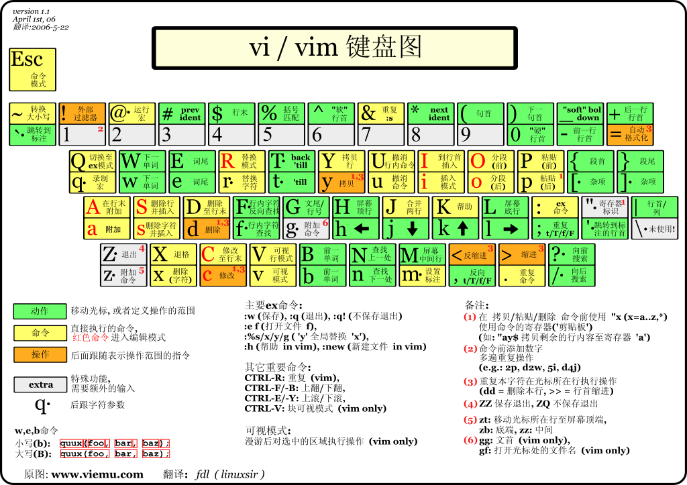

在 vim 底行模式输入 `:h key-notation` 可以查看 vimdoc 的标记体例（intro.txt）。

本文包括给程式设计师的Vim入门图解说明、Vi/Vim 键盘图等 Cheat-Sheet。

<!-- more -->

```Shell
                                        *key-notation* *key-codes* *keycodes*
These names for keys are used in the documentation.  They can also be used
with the ":map" command (insert the key name by pressing CTRL-K and then the
key you want the name for).

notation        meaning             equivalent  decimal value(s)      
-----------------------------------------------------------------------
<Nul>           zero                    CTRL-@    0 (stored as 10) *<Nul>*
<BS>            backspace               CTRL-H    8     *backspace*
<Tab>           tab                     CTRL-I    9     *tab* *Tab*
                                                        *linefeed*
<NL>            linefeed                CTRL-J   10 (used for <Nul>)
<FF>            formfeed                CTRL-L   12     *formfeed*
<CR>            carriage return         CTRL-M   13     *carriage-return*
<Return>        same as <CR>                            *<Return>*
<Enter>         same as <CR>                            *<Enter>*
<Esc>           escape                  CTRL-[   27     *escape* *<Esc>*

<Up>            cursor-up                       *cursor-up* *cursor_up*
<Down>          cursor-down                     *cursor-down* *cursor_down*
<Left>          cursor-left                     *cursor-left* *cursor_left*
<Right>         cursor-right                    *cursor-right* *cursor_right*

<S-...>         shift-key                       *shift* *<S-*
<C-...>         control-key                     *control* *ctrl* *<C-*
<M-...>         alt-key or meta-key             *meta* *alt* *<M-*
<A-...>         same as <M-...>                 *<A-*

```

> 在 vim 帮助 txt 文档中，以 `*` 标注的为**索引关键字**，例如右上角的 `*key-notation*`、`*key-codes*`、`*keycodes*`，以及 `*<Return>*`、 `*<Enter>*`、 `*<Esc>*`、 `*cursor-up*`、 `*shift* *`、 `*control*`、 `*meta*`。

输入 `:h h`、`:h j`、`:h k`、`:h l` 分别查看常规模式下 h/j/k/l 单按键的作用，定位到光标移动所在说明文档 motion.txt 中。  

`CTRL-W_w`（同时按下 <kbd>Ctrl</kbd> 和 <kbd>w</kbd>，再按下 <kbd>w</kbd>）可简写标记为`<C-w>w`（bash manual page 中也惯用此类 emacs 风格标记组合快捷键）。  
但是只能通过输入 `:h CTRL-W_w`（等价于 `:h CTRL-W_CTRL-W`）来查看该命令的帮助说明（windows.txt），而无法通过 `:h <C-w>w` 来查看帮助。 

另外 `:h CTRL-R` 可查看 normal 模式下的组合键帮助说明（undo.txt）；而通过 `:h c_CTRL-R`（等效 `:h c_<C-R>`）则查看的是 commandline 模式下的组合键帮助说明。   

Cheat-Sheet
---

[**Vim cheatsheet**](https://devhints.io/vim)  
[Vim Commands Cheat Sheet](https://www.fprintf.net/vimCheatSheet.html)  
[VIM QUICK REFERENCE CARD](http://users.ece.utexas.edu/~adnan/vimqrc.html)  

[Vim Cheat Sheet](https://www.linuxtrainingacademy.com/vim-cheat-sheet/)  
[Vim Cheat Sheet](https://vim.rtorr.com/)  
[A Great Vim Cheat Sheet](https://www.sogou.com/link?url=40EjMDkDaLAsIcyDVlsW9N9hg9PL4llu)  

[给程式设计师的Vim入门图解说明](http://blog.vgod.tw/2009/12/08/vim-cheat-sheet-for-programmers/?variant=zh-cn)
---


[Graphical vi-vim Cheat Sheet and Tutorial](http://www.viemu.com/a_vi_vim_graphical_cheat_sheet_tutorial.html)

[Vi/Vim 键盘图](http://www.cnblogs.com/ldp-web/archive/2011/10/22/2220920.html)
---

[vim键盘图](http://km.oa.com/articles/show/68423)



