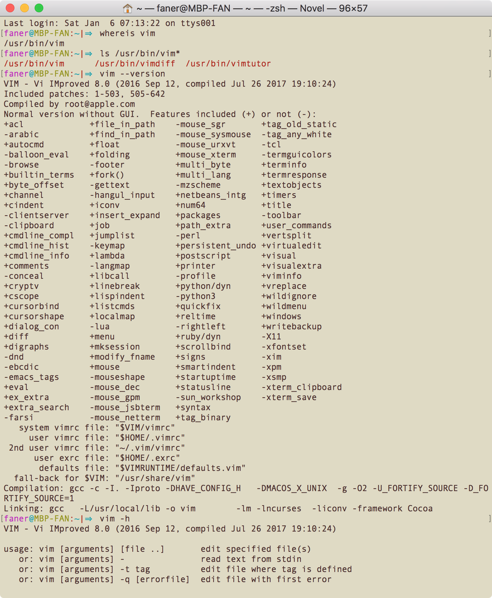

本文梳理了 vim 的配置文件及环境变量以及使用 vim 打开文件和编辑文件的基础操作。

<!-- more -->

## Where is vim（on macOS）

```shell
$ whereis vim
/usr/bin/vim
$ ls /usr/bin/vim*              
/usr/bin/vim      /usr/bin/vimdiff  /usr/bin/vimtutor
```

## vim version

vim 一共有五种版本

缩写 | 全称
----|----
T   |  tiny
S   |  small
N   |  **normal**
B   |  big
H   |  huge

```shell
# macOS
$ vim --version
VIM - Vi IMproved 8.0 (2016 Sep 12, compiled Jul 26 2017 19:10:24)
Included patches: 1-503, 505-642
Compiled by root@apple.com
Normal version without GUI.  Features included (+) or not (-):
```

> 在 vim 编辑模式下，底行模式输入 `:version` 也可查看 vim 版本信息。

macOS 默认安装的版本是 `normal version`，后面列出了包含（+）和未包含（-）的features。



因为 vim 中有些插件会使用 python 和 ruby，我们可以[编译升级 Mac 上的 vim 到7.4 huge版](http://blog.csdn.net/u011542994/article/details/39058779)，启用 python 和 ruby 的支持特性。

---

raspbian 和 CentOS 默认安装的 Huge 版本。

```shell
# raspbian
pi@raspberrypi:~ $ vim --version
VIM - Vi IMproved 8.0 (2016 Sep 12, compiled Sep 30 2017 18:21:38)
Included patches: 1-197, 322, 377-378, 550, 703, 706-707
Modified by pkg-vim-maintainers@lists.alioth.debian.org
Compiled by pkg-vim-maintainers@lists.alioth.debian.org
Huge version without GUI.  Features included (+) or not (-):
```

## 配置文件及环境变量

`vim --version` 结尾部分给出了配置文件的路径：

```shell
# macOS/raspbian
   system vimrc file: "$VIM/vimrc"
     user vimrc file: "$HOME/.vimrc"
 2nd user vimrc file: "~/.vim/vimrc"
      user exrc file: "$HOME/.exrc"
       defaults file: "$VIMRUNTIME/defaults.vim"
  fall-back for $VIM: "/usr/share/vim"
```

- fall-back：编译时指定的安装路径，即 `$VIM`=*`/usr/share/vim`*；  
- 系统级别的 vim 配置文件：`$VIM/vimrc`；  
- 用户级别首选 vim 配置文件：`$HOME/.vimrc`；  
- 用户级别可选 vim 配置文件：`~/.vim/vimrc`；  
- 用户级别 ex 配置文件：`$HOME/.exrc`；  
- vim 默认配置文件：`$VIMRUNTIME/defaults.vim`  

### 配置文件（vimrc）

说明文档 `/usr/share/vim/vim[0-9][0-9]/doc/usr_05.txt` 中有关于 vimrc 文件格式说明及配置范例可供参考：

- |05.1|  The vimrc file - `:h vimrc-intro`  
- |05.2|  The example vimrc file explained : `:h vimrc_example.vim`  

说明文档 `/usr/share/vim/vim[0-9][0-9]/doc/starting.txt` 中的 4. Initialization（帮助关键词为 *initialization*, *startup*）章节中有关于启动加载配置文件（*`vimrc`*）的帮助说明。

- `:h vimrc`：查看 vimrc 相关的帮助；  

> `vim[0-9][0-9]`：此处采用两位十进制数字通配符（wildcard）来代表动态发展的vim版本，因为vim版本是不断升级的，如 vim73、vim74、vim80。

### 环境变量（`$VIM` 和 `$VIMRUNTIME`）

配置文件的路径中引用了 `HOME` 和 `VIM` 及 `VIMRUNTIME` 这三个环境变量。

`HOME` 即通常所说的当前用户家目录（~），`VIM` 可在 vim 编辑器底行模式下利用 echo 命令查看。  
关于 `$VIM` 和 `$VIMRUNTIME` 相关的说明可参考 `/usr/share/vim/vim[0-9][0-9]/doc/starting.txt` 中的 4. Initialization（帮助关键词为 *initialization*, *startup*）。

- `:h $VIM`：查看环境变量 `$VIM` 相关的说明；  
- `:h $VIMRUNTIME`：查看环境变量 `$VIMRUNTIME` 相关的说明。  

在终端输入 `vim`（vim doc）进入 vim 编辑器，然后按下 <kbd>Q</kbd>（`<S-q>`）进入 Ex 多行命令行模式，依次输入 `echo $VIM` 和 `echo $VIMRUNTIME` 即可检查 vim 环境变量。

```shell
# macOS or raspbian
Entering Ex mode.  Type "visual" to go to Normal mode.                        
:echo $VIM
/usr/share/vim
:echo $VIMRUNTIME
/usr/share/vim/vim80
```

输入 `visual` 退出 Ex 模式，回到正常模式；或直接输入 q 退出 vim。

> 也可在 vim 底行模式输入 `:! echo $VIM` 或 `:! echo $VIMRUNTIME` 打印这两个环境变量的值。

## vim FILES

```shell
# macOS
/usr/share/vim|⇒  ls
vim80 vimrc

# raspbian
pi@raspberrypi:/usr/share/vim $ ls
addons  registry  vim80  vimfiles  vimrc
```

### FILES

`man vim` 的 FILES 章节列举了 vim 配置及说明相关的主要文件：

```shell
# macOS 的 man pages 太过陈旧，以下摘自 raspbian 的最新 vim man page
FILES
       /usr/share/vim/vim80/doc/*.txt
                      The Vim documentation files.  Use ":help doc-file-list" to get the com‐
                      plete list.

       /usr/share/vim/vim80/doc/tags
                      The tags file used for finding information in the documentation files.

       /usr/share/vim/vim80/syntax/syntax.vim
                      System wide syntax initializations.

       /usr/share/vim/vim80/syntax/*.vim
                      Syntax files for various languages.

       /usr/share/vim/vimrc
                      System wide Vim initializations.

       ~/.vimrc       Your personal Vim initializations.

       /usr/share/vim/gvimrc
                      System wide gvim initializations.

       ~/.gvimrc      Your personal gvim initializations.

       /usr/share/vim/vim80/optwin.vim
                      Script used for the ":options" command, a nice  way  to  view  and  set
                      options.

       /usr/share/vim/vim80/menu.vim
                      System wide menu initializations for gvim.

       /usr/share/vim/vim80/bugreport.vim
                      Script to generate a bug report.  See ":help bugs".

       /usr/share/vim/vim80/filetype.vim
                      Script  to  detect  the  type of a file by its name.  See ":help 'file‐
                      type'".

       /usr/share/vim/vim80/scripts.vim
                      Script to detect the type of a file by its contents.  See ":help 'file‐
                      type'".

       /usr/share/vim/vim80/print/*.ps
                      Files used for PostScript printing.

       For recent info read the VIM home page:
       <URL:http://www.vim.org/>
```

### directories

以下列举了 `$VIMRUNTIME`（vim80） 下的目录：

```shell
# ls -al | grep '^d'
/usr/share/vim/vim80|⇒  ls -d */
autoload/ compiler/ ftplugin/ keymap/   macros/   plugin/   spell/    tools/
colors/   doc/      indent/   lang/     pack/     print/    syntax/   tutor/

/usr/share/vim/vim80|⇒  tree -d -L 1
.
├── autoload
├── colors
├── compiler
├── doc
├── ftplugin
├── indent
├── keymap
├── lang
├── macros
├── pack
├── plugin
├── print
├── spell
├── syntax
├── tools
└── tutor

16 directories
```

目录       | 作用              | 说明
----------|---------------|-------
tutor      | 入门教程     | vimtutor
doc         | 帮助文档     | :help
colors    | 配色方案     | :colorscheme
plugin    | 插件目录     | Vim Script脚本格式

其中 `*.vim` 为 [Vim Script](http://vim-scripts.org/) 脚本格式文件，例如：

> 1. ***filetype***: 文件类型检查
>> **filetype.vim**: detect file types
>> **ftoff.vim**:    switch off detection of file types

> 2. ***ftplugin***: 文件类型检查插件
>> **ftplugin.vim**: switch on loading plugins for file types
>> **ftplugof.vim**: switch off loading plugins for file types

> 3. ***indent***: 不同语言语法缩进
>> **indent.vim**:   switch on loading indent files for file types
>> **indoff.vim**:   switch off loading indent files for file types

> 4. ***syntax***：不同语言语法高亮检测插件
>> **syntax**:       c.vim / cpp.vim / objc.vim / objcpp.vim / markdown.vim

## hi, vim

### vim 命令选项

通常情況下，您可以打开终端，输入︰

	vim tutor <回車>

這裡的 **vim** 表示進入vim編輯器的启动命令（start the Vim editor），而 **tutor** 則是您準備要編輯的文件（the file you wish to edit）。

执行 `vim --help` 可查看 vim 命令启动参数及选项：

```shell
$ vim -h
VIM - Vi IMproved 8.0 (2016 Sep 12, compiled Jul 26 2017 19:10:24)

usage: vim [arguments] [file ..]       edit specified file(s)
   or: vim [arguments] -               read text from stdin
   or: vim [arguments] -t tag          edit file where tag is defined
   or: vim [arguments] -q [errorfile]  edit file with first error

Arguments:
   --			Only file names after this
   -v			Vi mode (like "vi")
   -e			Ex mode (like "ex")
   -E			Improved Ex mode
   -s			Silent (batch) mode (only for "ex")
   -d			Diff mode (like "vimdiff")
   -y			Easy mode (like "evim", modeless)
   -R			Readonly mode (like "view")
   -Z			Restricted mode (like "rvim")
   -m			Modifications (writing files) not allowed
   -M			Modifications in text not allowed
   -b			Binary mode
   -l			Lisp mode
   -C			Compatible with Vi: 'compatible'
   -N			Not fully Vi compatible: 'nocompatible'
   -V[N][fname]		Be verbose [level N] [log messages to fname]
   -D			Debugging mode
   -n			No swap file, use memory only
   -r			List swap files and exit
   -r (with file name)	Recover crashed session
   -L			Same as -r
   -T <terminal>	Set terminal type to <terminal>
   --not-a-term		Skip warning for input/output not being a terminal
   --ttyfail		Exit if input or output is not a terminal
   -u <vimrc>		Use <vimrc> instead of any .vimrc
   --noplugin		Don't load plugin scripts
   -p[N]		Open N tab pages (default: one for each file)
   -o[N]		Open N windows (default: one for each file)
   -O[N]		Like -o but split vertically
   +			Start at end of file
   +<lnum>		Start at line <lnum>
   --cmd <command>	Execute <command> before loading any vimrc file
   -c <command>		Execute <command> after loading the first file
   -S <session>		Source file <session> after loading the first file
   -s <scriptin>	Read Normal mode commands from file <scriptin>
   -w <scriptout>	Append all typed commands to file <scriptout>
   -W <scriptout>	Write all typed commands to file <scriptout>
   -x			Edit encrypted files
   --startuptime <file>	Write startup timing messages to <file>
   -i <viminfo>		Use <viminfo> instead of .viminfo
   -h  or  --help	Print Help (this message) and exit
   --version		Print version information and exit
```

### vim 打开（新建）编辑

1. 打开终端，输入 `vim hivim.txt`（假设当前家目录下尚不存在 hivim.txt 文件），vim默认为普通模式（normal mode）。vim将为 New File（`hivim.txt`）新建一个 **buffer**，此时尚不存在文件 `~/hivim.txt`。光标停留在第一行，下面的波浪线 `~` 表示空行。  
	> 输入 *CTRL-G* 或 *:f* / *:fi* / *:file* 可在底部[查看当前打开文档的路径](http://blog.csdn.net/juneman/article/details/42425997)。  
2. 按键 `i` 进入编辑模式（insert mode），输入 `hello world from vim!`。  
3. 按下 `esc` 键盘切回普通模式，输入 `:wq` 保存退出（write and quit）。  
4. 输入 `cat hivim.txt` [^cat] 查看刚才使用 vim 新建-编辑-保存 的文件。  

```shell
➜  ~  cat hivim.txt
cat: hivim.txt: No such file or directory
➜  ~  vim hivim.txt
➜  ~  cat hivim.txt
hello world from vim!
➜  ~  
```

#### write

使用 vim 打开 \<vimfile\> 进行编辑时，vim 会自动在当前文件路径下创建一个名为`.<vimfile>.swp` 的缓存副本（swap buffer），最终需要调用 `:w`（`:write`）命令将副本中的编辑（diff）写入（patch）文件保存。

调用 `vim` 命令打开文件时，可以指定 `-n` 选项，此时无需创建swp文件，直接在内存中针对源文件编辑保存。

```shell
   -n			No swap file, use memory only
```

调用 `vim -r` 或 `:! vim -r` 命令可以列举查看当前所有的 swap files。

```shell
   -r			List swap files and exit
```

### vim 打开阅读

#### 只读，可强制编辑，可强制写入（-R）

`vim -R` 以只读方式打开 `/usr/share/vim/vim[0-9][0-9]/tutor/tutor.utf-8`：

```shell
➜  ~  cd /usr/share/vim/vim[0-9][0-9]/tutor
➜  tutor  vim -R tutor.utf-8
```

当 vim 以只读方式打开文件时：

- 若尝试通过`i`、`a`、`o`进入编辑模式，会提示：  
	> Warning: Changing a readonly file  
- 编辑后，若尝试通过`:q`退出，会提示：  
	> No write since last change (add ! to override)  
- 编辑后，若尝试通过`:w`保存，会提示：  
	> 'readonly' option is set (add ! to override)  

但是，还是可以通过 `:wq!` 强制写入保存退出。

#### 可编辑，不可强制写入（-m）

在使用 vim 打开文档时，若想针对缓冲副本（*.swp 文件）进行编辑，以便边学习边实践，但禁止最终写入保存，可以 `-m` 选项执行 vim 命令。

```shell
   -m			Modifications (writing files) not allowed
```

若尝试通过 `:w` 写入文件，会提示：

> File not written: Writing is disabled by 'write' option

例如，以下通过 `vim -m` 命令对照阅读英文版 vimtutor（`tutor.utf-8`），可边阅读边实践：

```shell
➜  ~  vim -m /usr/share/vim/vim[0-9][0-9]/tutor/tutor.utf-8
```

#### 只读，不可编辑，不可强制写入（-M）

如果仅仅使用 vim 打开文档进行阅读（类似 `less` 命令），不可编辑也不可写入，则可以 `-M` 选项执行 vim 命令。

```shell
   -M			Modifications in text not allowed
```

若尝试通过 `i`、`a`、`o` 进入编辑模式，会提示：

> Cannot make changes, 'modifiable' is off

例如，以下通过 `vim -M` 命令以只读方式（不可编辑）对照阅读英文版vimtutor（`tutor.utf-8`）：

```shell
➜  ~  vim -M /usr/share/vim/vim[0-9][0-9]/tutor/tutor.utf-8
```

[^cat]: The **[cat](https://en.wikipedia.org/wiki/Cat_(Unix))** (short for “concatenate“) command reads one or more files and prints them to standard output.
