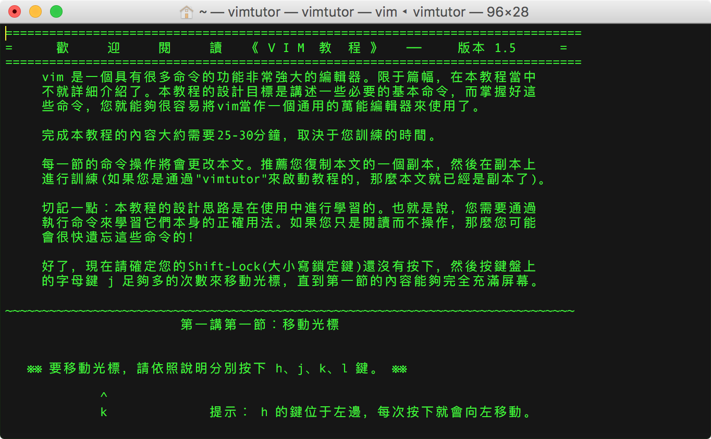

本文梳理了如何查看 vim 帮助手册以及查询帮助示例。

<!-- more -->

## vimtutor

终端输入 **`vimtutor`** 命令可查看 vim 入门教程：

```shell
faner@MBP-FAN:~|⇒  vimtutor 
```



输入 `:q` 退出。

**说明：**

> 通過"vimtutor"來啟動教程，每次都会生成一份副本，方便边学习边实践。  
> 底行输入 *:f* / *:fi* / *:file* 即可查看当前打开的 tutor 副本的路径：  
>> /private/var/folders/k6/7f8bh1ws4ygfg9pcq48w5tk00000gn/T/tutor***

> 退出 tutor 时，该副本`tutor***`将会被删除。

---

`/usr/share/vim/vim[0-9][0-9]/tutor` 目录下存放着多语言版本的帮助教程，中文 macOS 系统终端输入 **`vimtutor`** 命令，将打开对应繁体中文版本《tutor.zh.utf-8》（`vimtutor zh`）的副本：

```
➜  ~  cd /usr/share/vim/vim[0-9][0-9]/tutor
➜  tutor  vim tutor.zh.utf-8

===============================================================================
=      歡     迎     閱     讀   《 V I M  教  程 》   ──     版本 1.5      =
===============================================================================
```

我们也可以通过 `vimtutor en` 指定打开en英文版《tutor.utf-8》教程：

```
===============================================================================
=    W e l c o m e   t o   t h e   V I M   T u t o r    -    Version 1.7      =
===============================================================================
```

## vim manual

以下节选 vim manual page 的概要（SYNOPSIS）和描述（DESCRIPTION）章节：

```shell
pi@raspberrypi:~ $ man vim

VIM(1)                             General Commands Manual                             VIM(1)

NAME
       vim - Vi IMproved, a programmers text editor

SYNOPSIS
       vim [options] [file ..]
       vim [options] -
       vim [options] -t tag
       vim [options] -q [errorfile]

       ex
       view
       gvim gview evim eview
       rvim rview rgvim rgview

DESCRIPTION
       Vim  is  a  text  editor that is upwards compatible to Vi.  It can be used to edit all
       kinds of plain text.  It is especially useful for editing programs.

       There are a lot of enhancements above Vi: multi level undo, multi windows and buffers,
       syntax  highlighting,  command line editing, filename completion, on-line help, visual
       selection, etc..  See ":help vi_diff.txt" for a summary of the differences between Vim
       and Vi.

       While running Vim a lot of help can be obtained from the on-line help system, with the
       ":help" command.  See the ON-LINE HELP section below.

       Most often Vim is started to edit a single file with the command

            vim file

       More generally Vim is started with:

            vim [options] [filelist]
```

## vim doc

vim 的帮助说明文档存放在 `/usr/share/vim/vim[0-9][0-9]/doc` 目录下。

可执行 `ls /usr/share/vim/vim[0-9][0-9]/doc` 一览其下的所有帮助文档（*.txt）。

当然，我们可以直接在终端 Shell Prompt 中输入 `vim -R /usr/share/vim/vim[0-9][0-9]/doc/*.txt`（`-R`选项表示 readonly），打开查看我们感兴趣的 vim 话题。

### 元帮助文档（helphelp）

或在 vim 底行模式下输入 `:h help` 或 `:help help`，vim 将新起分屏（window）以只读方式打开 `/usr/share/vim/vim[0-9][0-9]/doc` 中如何使用帮助的说明文档 `helphelp.txt`（帮助文档的帮助文档）。  

> 关于”底行模式”，参考下一节。

### 帮助文档（help）

按下 `<F1>` 键或在 vim 底行模式输入 `:help`（`:h`），可以查看帮助文档。  
vim 将新起分屏（window）以只读方式打开 `/usr/share/vim/vim[0-9][0-9]/doc/help.txt` 文件。  

> Open a window and display the help file in read-only mode.

按下组合键 `CTRL-W_w`（可简记为`<C-w>w`：按下 `ctrl+w`，再按一次 `w`），可在当前 vim 窗口和 help 分屏窗口之间切换；输入 `：q` 或 `:close` 可以关闭帮助窗口。

在 VIM - main help file（`help.txt`）中，我们可以查看到 vim 帮助系统的组织层次。
其中主要分 **`USER MANUAL`** 和 **`REFERENCE MANUAL`** 两个部分：

1. **USER MANUAL**: These files explain how to accomplish an editing task.  

	> Getting Started ~: `usr_1*.txt`  
	> Editing Effectively ~: `usr_2*.txt`  
	> Tuning Vim ~: `usr_4*.txt`  
	> Making Vim Run ~(Installing Vim): `usr_90.txt`  

2. **REFERENCE MANUAL**: These files explain every detail of Vim.  *reference_toc*  

以下节选 REFERENCE MANUAL 部分议题：

```
General subjects ~

- |intro.txt| general introduction to Vim; notation used in help files  
- |help.txt|  overview and quick reference (this file)  
- |helphelp.txt|  about using the help files  

Basic editing ~

- |starting.txt|  starting Vim, Vim command arguments, initialisation  
- |editing.txt|   editing and writing files  
- |motion.txt|    commands for moving around  
```

可执行 `cat` 或 `vim -R` 命令打开 intro.txt 文件查看 vim 介绍：

```shell
Introduction to Vim                                     *ref* *reference*                       

1. Introduction                 |intro|
2. Vim on the internet          |internet|
3. Credits                      |credits|
4. Notation                     |notation|
5. Modes, introduction          |vim-modes-intro|
6. Switching from mode to mode  |mode-switching|
7. The window contents          |window-contents|
8. Definitions                  |definitions|

==============================================================================
1. Introduction                                         *intro*
```

可执行 `cat` 或 `vim -R` 命令打开 starting.txt 文件查看 vim 启动说明：

```shell
Starting Vim                                            *starting*                              

1. Vim arguments                |vim-arguments|
2. Vim on the Amiga             |starting-amiga|
3. Running eVim                 |evim-keys|
4. Initialization               |initialization|
5. $VIM and $VIMRUNTIME         |$VIM|
6. Suspending                   |suspend|
7. Saving settings              |save-settings|
8. Views and Sessions           |views-sessions|
9. The viminfo file             |viminfo-file|

==============================================================================
1. Vim arguments                                        *vim-arguments*
```

> 在 vim txt 文档中，每节标题的右侧以 `*` 标注的为索引关键字，例如 *ref*、*intro*，*starting*、*vim-arguments*。

#### 搜索帮助（Search for help）

help.txt 中介绍了搜索帮助的方法：

> **Search for help**:  Type "`:help word`", then hit `CTRL-D` to see matching help entries for "word". Or use "`:helpgrep word`".

在 vim 底行模式输入 `:h[elp] word`，可搜索 vim 中匹配关键字 word 的命令或选项的说明文档。

#### 查询帮助示例

- 查看 `vimrc` 相关的话题：

	> :h `vimrc`

- 查看如何使用帮助：

	> :help `help`

- 查看 vimdoc 的标记体例：

	> :h `key-notation`

- 查看 `h` 按键的作用（motion left）

	> :h `h`

- 查看 `w` 按键的作用（words forward）

	> :h `w`

- 查看底行模式下 `w` 命令的作用（`:w`/`:write`）

	> :h `:w`

- 查看 `noh` 命令的作用（`:noh`/`:nohlsearch`）

	> :h `noh`

- 查看复合按键 `[[` （连按 <kbd>[</kbd>）的作用（sections backward）

	> :h `[[`

- 查看模式切换相关的话题：

	> :h `mode-switching` 

- 查看多窗格切换 `CTRL-W` 相关命令：

	> :h `CTRL-W_j[khl]` 或 :h `CTRL-W_CTRL-J[KHL]` ：Move cursor to Nth window below/above/left/right current one.  

- 分别查看 `CTRL-C` 组合按键（Ctrl+c，可简记为 `<C-c>`）命令在 normal、insert、visual、command-line 模式下的作用：

	> :help `CTRL-C`  
	> :help `i_CTRL-C`  
	> :help `v_CTRL-C`  
	> :help `c_CTRL-C`  

### [vimman](https://github.com/yonchu/vimman)

vimman - View vim plugin manuals (help) like man in zsh

git clone 到 `$ZSH_CUSTOM/scripts/vimman` 后，在 `~/.zshrc` 中 source 该 zsh 脚本重启生效。

示例：**`vimman number`** 查看 `number` 相关帮助主题：

```shell
MBP-FAN ~ » vimman CTRL-W
:help CTRL-W
```

### vim在线帮助

[**VI**(1P)](http://man7.org/linux/man-pages/man1/vi.1p.html) @ [Linux man pages online](http://man7.org/linux/man-pages/)  
[Vim documentations](http://www.vim.org/docs.php)  
[Vim documentation: help](http://vimdoc.sourceforge.net/)  

[如何使用 Vim 的 help](http://blog.csdn.net/simple_the_best/article/details/72820669)  
[如何高效的使用vim的帮助](https://www.jianshu.com/p/e5e730c047f6)  