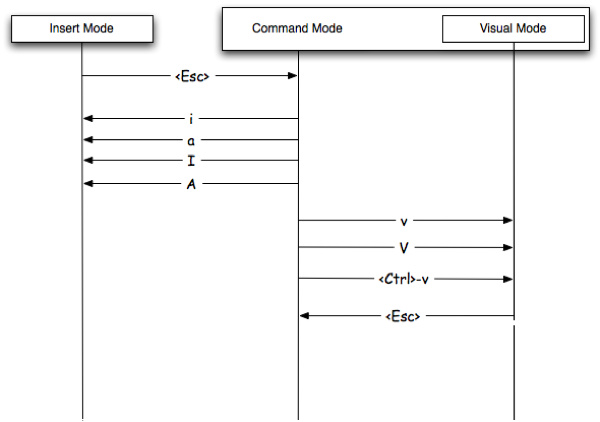

本文梳理了 vim 的常用工作模式及它们之间的互相切换。

<!-- more -->

## [vim 的几种模式](http://haoxiang.org/2011/09/vim-modes-and-mappin/)

`:h vim-modes` 可查看 intro.txt 中 vim 模式相关的说明；  

vim 的模式众多，但通常被提及的主要有以下几种。

### Normal-mode（n）

也就是最一般的普通模式，进入 vim 之后，默认处于这种阅读模式。

在普通模式下，通过输入指令可进入编辑模式，因此有些文档中也常称为（等待）指令模式（command mode）。

### Visual-mode（v）

在普通模式下，按下 **`v`** 键进入可视模式，在该模式下可利用方向键基于当前光标扩散 **选定高亮** 一些字符、行、列。  

普通模式一般可针对 char、word、line 进行基本选择编辑/删除操作；  
可视模式可看做是 **可针对选定块进行操作** 的增强模式。  

### Insert-mode（i）

插入模式，其实就是指可编辑输入状态。

在普通模式下，按下 **`a/A`**、**`i/I`**、**`o/O`** 等指令即可切换到插入模式（Insert Mode）。

[](http://ww4.sinaimg.cn/mw690/6941baebgw1er8gsaqhghj20go0bqmxm.jpg)

### Select-mode (s)

**gvim** 常用模式，姑且称作**选择模式**吧。

和可视模式不同的是，在这个模式下，选择完了高亮区域后，敲任何按键就直接输入并替换选择的文本了，类似 GUI 编辑器下基于鼠标拖选块替换编辑的效果。  

<del>用鼠标拖选区域的时候，就进入了选择模式。</del>  

普通模式下通过 **`gh`** 组合键可进入选择模式，按下 `<esc>` 退回到普通模式。

### Command-line mode(Cmdline-mode)（c）

在普通模式下，按下 **`:`**，`/`/`?`，`!` 将进入命令行模式。

因为是在窗口底部（bottom prompt）支持输入一行命令调用 vim 的各种强大功能，因此也被称为底行模式（Last-line mode）。

- `:`：可执行 vim 内置命令（Ex commands），或 `:!` 临时执行 bash 命令；  
- `/`,`?`：可执行模式匹配命令（the pattern search commands）；  
- `!`：执行外部 shell 命令（the filter command？）  

按下 `<Enter>` 键执行命令后，或按下 `<Esc>` / `CTRL-C`（`<C-c>`），即可退出底行模式。

#### Ex-mode

在普通模式下，按 **`Q`**（`<S-q>`）键进入 Ex 模式，执行完一行命令后，依旧停留在 Ex-mode。

输入 `vi`（`visual`）可切回普通模式。

#### [command-line history](http://vim.wikia.com/wiki/Using_command-line_history)

在正常模式下，输入 **`q:`** 将在源文档下方、[Command Line] 上方打开一个 vim 命令行历史分屏窗格（*command-line history*），同时进入底行命令模式。

> 输入 **`q/`** 或 **`q?`** 将对应打开搜索历史分屏窗格。

默认光标聚焦于 vim 历史命令窗格，通过 `j`/`k` 可上下翻看选择历史命令，按下 `<Enter>` 键执行；或按下 `:` 切换聚焦底行输入。

输入 **`:q`** 或连按两次 **`CTRL-C`** 即可关闭命令历史分屏窗格，切回普通模式。

> 执行 **`:his`** (`:history`) 可以查看执行命令的历史，按 <kbd>q</kbd> 键退出。  

>> `:his :` 可查看 cmd history  
>> `:his /` 或 `:his ?` 可查看 search history  

> 输入 `@:` 可执行最近一条命令（ Repeat last command-line）。  

## vim 模式切换

`:h mode-switching` 可查看 intro.txt 中的模式切换（Switching from mode to mode）相关的说明。  

[vi/vim 典型的三种模式切换关系](http://blog.csdn.net/motor87/article/details/5848501)：

[](http://www.live-in.org/archives/774.html)

### NORMAL -> VISUAL

参考：`/usr/share/vim/vim[0-9][0-9]/doc/visual.txt`。

按键               | 说明                      | 备注
------------------|---------------------------|--------
`v`               | 普通模式切换到可视模式       | 从当前光标开始选择：<br/>- 通过 `h`/`l` 或 `b`/`w` 展开行内选择<br/>- 通过`j`/`k`扩展行间选择
`V`(`<S-v>`)      | 普通模式切换到可视**行**模式 | VISUAL LINE：<br/>针对整行选定模式
`<C-v>`           | 普通模式切换到可视**块**模式 | VISUAL BLOCK：<br/>针对列块选定模式

**说明：**

> 对选中部分可以 `:w [FILENAME]` **另存为**文件（SELECTING TEXT TO WRITE：saves the Visually selected lines in file FILENAME）。

### NORMAL -> REPLACE

按键              | 说明                | 备注
-----------------|---------------------|--------
`R`              | 一直替换光标所在的字符 | replace mode

> `r`：替换光标所在的字符（replace char），只替换一次。替换后恢复指令模式。  

### NORMAL -> INSERT

参考：`/usr/share/vim/vim[0-9][0-9]/doc/insert.txt`。

#### 当前光标 所在位置/行首 字符前插入

按键             | 说明                 | 备注
----------------|----------------------|--------
`i`             | 从当前光标位置开始**插入** | insert before cursor
`I`             | 从本行行首（第一个非空白字元前面）<br/>开始**插入** |  Insert text before the first non-blank in the line<br/>等效于 `^i`

#### 当前光标 所在位置/行未 字符后插入

按键            | 说明                 | 备注
---------------|----------------------|--------
`a`            | 在当前字符后**追加**    | append after cursor
`A`            | 从本行行尾开始**追加**  | Append text at the end of the line<br>等效于 `$a`

`ea` – insert (append) at the end of the word

#### 当前光标所在行 上/下 插入新行

按键            | 说明                     | 备注
---------------|--------------------------|--------
`o`            | 在本行**下面增一行**开始编辑 | open below
`O`            | 在本行**上面增一行**开始编辑 | Open above

### NORMAL -> COMMAND LINE

参考：`/usr/share/vim/vim[0-9][0-9]/doc/cmdline.txt`。

在普通模式中，輸入『 : / ? 』三個中的任何一個键，即可將光标移動到当前屏幕最底下那一行，即进入**底行模式**。

按键           | 说明                   | 备注
---------------|------------------------|--------
`:`            | 切入**底行模式**<br>（Last Line Mode）| `<C-d>`：list possible completions；<br>可通过上下方向键翻阅[历史命令](http://blog.sina.com.cn/s/blog_5ac88b350100an4p.html)
`q:`           | 打开Command Line分屏窗口 | 可使用方向键翻看命令行历史记录（可编辑）<br/>按下 `<CR>` 键执行；按下 `<C-c>` 可切回。
`Q`            | Ex Mode                | **多行**的 Command-Line 模式<br>输入`visual`(`vi`)可切回。
`:! {command}` | 暂时离开 vim 运行某个终端命令<br>（EXECUTE EXTERNAL SHELL COMMAND） | 例如 `:! pwd` 暂时列出当前目录<br>按下 `<CR>` 键可切回到 vim。

> 底行模式输入 *:linenumber* 可跳转到指定行。  
	> 输入 *:f* / *:fi* / *:file* 可在底部[查看当前打开文档的路径](http://blog.csdn.net/juneman/article/details/42425997)。  
> `:` 进入 vim 内部 Ex 命令执行环境；`!` 则可临时切换执行外部 shell 命令。   

#### [jobs](https://tldp.org/LDP/abs/html/x9644.html)

[Understanding the job control commands in Linux](https://www.thegeekdiary.com/understanding-the-job-control-commands-in-linux-bg-fg-and-ctrlz/)  
[How To Use Bash's Job Control to Manage Foreground and Background Processes](https://www.digitalocean.com/community/tutorials/how-to-use-bash-s-job-control-to-manage-foreground-and-background-processes)  

**`Ctrl-z`** 命令将当前的 Vi/Vim 进程放到后台执行，之后 shell 环境即可为你所用；  
在 shell prompt 中执行 **`fg`** 命令则将位于后台的 Vi/Vim 进程切到前台恢复执行。  

vim 打开第1个文件后按下 <C-z> 临时切出，再打开第2个文件：

```
# vim 打开编辑第1个文件，按下 <C-z> 临时切出
$ vim mars/build_ios.py

[1]  + 20091 suspended  vim mars/build_ios.py

# vim 打开编辑第2个文件，按下 <C-z> 临时切出
$ vim mars/build_android.py

[2]  + 20133 suspended  vim mars/build_android.py
```

输入 `jobs` 查看后台任务列表：

```
$ jobs
[1]  - suspended  vim mars/build_ios.py
[2]  + suspended  vim mars/build_android.py
```

> 输入 `jobs -` 再按下 tab 可查看 jobs 命令支持的可选项。

vim 打开编辑第3个文件，按下 <C-z> 临时切出

```
$ vim mars/build_osx.py

[3]  + 20233 suspended  vim mars/build_osx.py

$ jobs
[1]    suspended  vim mars/build_ios.py
[2]  - suspended  vim mars/build_android.py
[3]  + suspended  vim mars/build_osx.py
```

输入 `fg`，等效于 `fg %+` 和 `fg %%`，将最后一次挂起的任务切回前台执行。

```
$ fg
[3]    20233 continued  vim mars/build_osx.py

[3]  + 20233 suspended  vim mars/build_osx.py
```

输入 `fg %-` 或 `fg %2` 切换恢复第2个任务：

```
$ fg %-
[2]    20133 continued  vim mars/build_android.py

[2]  + 20133 suspended  vim mars/build_android.py
```

```
$ fg %+ # fg %%
[2]    20133 continued  vim mars/build_android.py

[2]  + 20133 suspended  vim mars/build_android.py
```

执行 `fg %1` 指定切换恢复第1个任务：

```
$ fg %1
[1]    20091 continued  vim mars/build_ios.py

[1]  + 20091 suspended  vim mars/build_ios.py

$ jobs
[1]  + suspended  vim mars/build_ios.py
[2]  - suspended  vim mars/build_android.py
[3]    suspended  vim mars/build_osx.py
```

执行 `disown %N` 命令，将任务N从活动jobs列表移动，相当于非正常关闭vim。

```
$ disown %-
disown: warning: job is suspended, use `kill -CONT -20133' to resume
$ jobs
[1]  + suspended  vim mars/build_ios.py
[3]  - suspended  vim mars/build_osx.py
```

重新执行 `vim mars/build_android.py` 将提示恢复建议：

```
Swap file "mars/.build_android.py.swp" already exists!
[O]pen Read-Only, (E)dit anyway, (R)ecover, (Q)uit, (A)bort:
```

#### shell

在 Vi/Vim 的正常模式下输入 **`:sh`** 创建 shell 窗口。  
在 shell prompt 中执行 **`exit`** 命令即可返回到 Vi/Vim 继续编辑。  

```
:sh[ell]                This command starts a shell.  When the shell exits
                        (after the "exit" command) you return to Vim.  The
                        name for the shell command comes from 'shell' option.
```

```shell
# 按下 <C-z> 临时退出 man/less/vi 返回终端
$ man less
[1]  + 2100 suspended  man less

# 执行 shell 命令
$ echo $PAGER
less

# 输入 fg 返回 man/less/vi
$ fg
[1]  + 2100 continued  man less
```

##### !

底行模式输入 `:!{cmd}` 临时执行 shell 命令 cmd，根据提示 `Press ENTER or type command to continue` 按下回车键返回 vim。

输入 `:!!` 执行上一条命令，类似 `//`、`??`。

```
                                                        :!cmd :! E34
:!{cmd}                 Execute {cmd} with the shell.  See also the 'shell'
                        and 'shelltype' option.

                        If {cmd} contains "%" it is expanded to the current
                        file name.  Special characters are not escaped, use
                        quotes to avoid their special meaning:
                                :!ls "%"
                        If the file name contains a "$" single quotes might
                        work better (but a single quote causes trouble):
                                :!ls '%'
                        This should always work, but it's more typing:
                                :exe "!ls " . shellescape(expand("%"))

                        A newline character ends {cmd}, what follows is
                        interpreted as a following ":" command.  However, if
                        there is a backslash before the newline it is removed
                        and {cmd} continues.  It doesn't matter how many
                        backslashes are before the newline, only one is
                        removed.

                                                        :!!
:!!                     Repeat last ":!{cmd}".
```

当我们正在编辑一个 shell 脚本（`*.sh`）时，可底行执行 `:!/bin/bash %` 来运行当前脚本。

#### terminal

底行模式输入 `:ter` 在当前编辑窗格的顶部创建一个常驻的[集成终端窗口](https://zhuanlan.zhihu.com/p/102287909)，默认 cd 进入当前编辑文档所在的目录作为工作目录。

终端窗口默认是 INSERT 插入模式，可以输入 `<C-\><C-N>` 切换到普通模式。

```
:[range]ter[minal] [options] [command]                  :ter :terminal
                        Open a new terminal window.
```

If you want to split the window vertically, use: `:vertical terminal`, Or short: `:vert ter`.

1. `ter`: create a terminal horizonally, top of current focus window.
2. `vert ter`: create a terminal vertically, left to current focus window.
3. `:bel ter`: create a terminal horizonally, below of current focus window.
4. `:bel vert ter`: create a terminal vertically, right to current focus window.

亦可执行 `:tab :ter` 在当前聚焦窗格右侧新建 tab 页打开终端窗口。

- `:0tab :ter`: 在最左侧新建 tab 打开终端；  
- `:$tab :ter`: 在最右侧新建 tab 打开终端；  

[Scroll up to in Vim term - Super User](https://superuser.com/questions/1439330/scroll-up-to-in-vim-term)

- `<C-w><S-n>`(CTRL-W_N): pauses the terminal, navigate it like any buffer.
- Pressing `i` takes you back into the terminal as you were before.

关于切换分屏、尺寸调整、移动窗格，参考 [vim窗格](./012-vim-win-tab.md)。

### 返回 NORMAL 模式

按键           | 说明                   | 备注
--------------|------------------------|--------
`<C-c>`       | **CTRL-C**:Interrupt current (search) command; <br/>**i_CTRL-C**: Quit insert mode, go back to Normal mode. | **CTRL-C**<br/>**i_CTRL-C**
`<Esc>` / `<C-[>` | End insert or Replace mode, <br/>go back to Normal mode. | **i_<Esc\>**<br/>**i_CTRL-\[**
