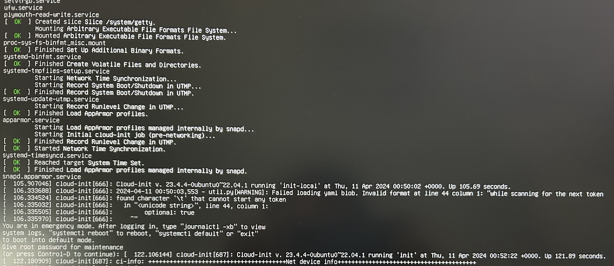
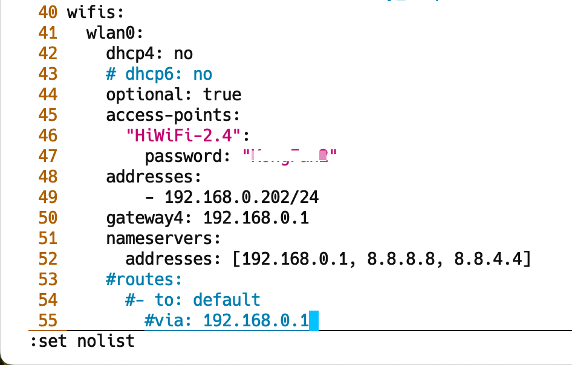
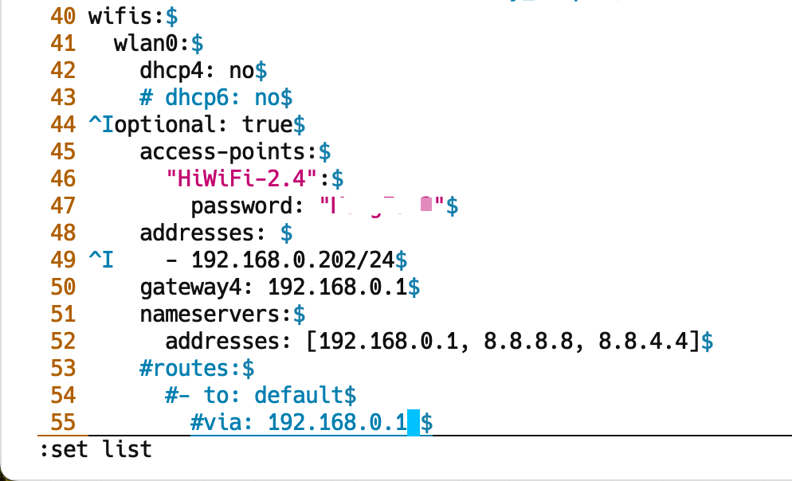

本文梳理了 vim 配置相关基础知识并列出了一些常用的配置示例。

<!-- more -->

执行 `vim --version` 尾部有关于 vimrc 的位置说明:

```bash
λ ~/ vim --version
VIM - Vi IMproved 8.0 (2016 Sep 12, compiled Aug 17 2018 17:24:51)
Included patches: 1-503, 505-680, 682-1283
Compiled by root@apple.com
Normal version without GUI.  Features included (+) or not (-):

   system vimrc file: "$VIM/vimrc"
     user vimrc file: "$HOME/.vimrc"
 2nd user vimrc file: "~/.vim/vimrc"
      user exrc file: "$HOME/.exrc"
       defaults file: "$VIMRUNTIME/defaults.vim"
  fall-back for $VIM: "/usr/share/vim"
Compilation: gcc -c -I. -Iproto -DHAVE_CONFIG_H   -DMACOS_X_UNIX  -g -O2 -U_FORTIFY_SOURCE -D_FORTIFY_SOURCE=1
Linking: gcc   -L/usr/local/lib -o vim        -lm -lncurses  -liconv -framework Cocoa
```

1. 系统级配置，对所有用户生效：`$VIM/vimrc` =  `/usr/share/vim/vimrc`；  
2. 用户级配置1，对当前用户生效：`$HOME/.vimrc` = `~/.vimrc`；  
3. 用户级配置2，对当前用户生效：`~/.vim/vimrc`。  

在每个用户的主目录下，都有一个 vi 配置文件".vimrc"或".exrc"，没有的可以新建一个。
用户可以编辑它，使这些设置在每次启动 vi 时都有效。

vim配置可以在底行模式针对当前文档编辑设定，例如 `:set ai` 设定 `autoindent`，也可以设置到配置文件中（可省掉开头的冒号）。

## 配置语法

### options/features

可通过 `:help vimrc-intro` 查看 **vimrc** 配置帮助。

具体配置选项可参考：`/usr/share/vim/vim[0-9][0-9]/doc/options.txt`

### set/enable

Typing ":set xxx" sets the option "xxx", or configure to `.vimrc`.

short  |  long（origin） |  comment
-------|----------------|-------------------------------------------
'ic'   | 'ignorecase'   |  ignore upper/lower case when searching
'is'   | 'incsearch'    |  show partial matches for a search phrase
'hls'  | 'hlsearch'     |  highlight all matching phrases

### unset/disable

Prepend "no" to switch an option off:

> :set noic

## 新建 .vimrc 或 .exrc

```bash
➜  ~  cd ~
➜  ~  touch .vimrc
➜  ~  vi .vimrc
```

vim 配置格式可参考 `/usr/share/vim/vim[0-9][0-9]/vimrc_example.vim`。

## 设置示例

### 注释

在C++语言中，以 `//` 开头的行视为注释；在 vim 脚本中，以 `"` 开头的行视为注释。

### 设置显示行号（nu/nonu）

在打开 .vimrc（.exrc） 的 vim 编辑窗口中敲 `i` 键进入 **insert** 模式，打开布尔开关 `nu`:

```vim
"显示行号
set nu "set number
```

按下 `<Esc>` 退回 **normal** 模式，再敲入 `:wq`（或 `ZZ` ）保存退出。
之后每次打开 vi/vim 时都会显示行号。

---

若不显示行号，直接删除或注释 `set nu` 这一配置行即可恢复默认；或者使能 `nu` 对应的布尔开关 `nonu`：

```vim
"不显示行号
set nonu "set no number 或 set no nu
```

**说明**：

在 `~/.vimrc` 配置文件中设置某项配置后，将对所有 vim 打开的文件全局有效。  
若想在某次 vim 打开的文档中临时关闭行号显示，可在底行模式输入 `:set nonu` 临时关闭行号。  

### 设置tab宽度为4（ts/tabstop）

vi 中tab宽度默认为8，可以通过`set tabstop`赋值更改：

```vim
"设置tab宽度为4
set ts=4 "tabstop
```

你也可以根据需要，开启softtabs，即用4个空格展开tab（expandtab）：

```vim
"tab用空格展开
set et "expandtab
```

[whitespace - Tab key == 4 spaces and auto-indent after curly braces in Vim](https://stackoverflow.com/questions/234564/tab-key-4-spaces-and-auto-indent-after-curly-braces-in-vim)
[vi - Replace tabs with spaces in vim](https://stackoverflow.com/questions/426963/replace-tabs-with-spaces-in-vim)

```vim
filetype plugin indent on
" show existing tab with 4 spaces width
set tabstop=4
" when indenting with '>', use 4 spaces width
set shiftwidth=4
" On pressing tab, insert 4 spaces
set expandtab
" NOT to use smartindent
"set smartindent
```

[linux - vim技巧：详解tabstop、softtabstop、expandtab三个选项的区别](https://segmentfault.com/a/1190000021133524)

```vim
" 值为负数，与shiftwidth保持同步一致，方便统一缩进。
set softtabstop=-1
```

修改配置开启 expandtab 后，vim 打开原来包含 tab 的文件，执行 `:%retab` 即可将所有的 tab 制表符展开为 4 个空格。

### 设置自动缩进（autoaudient）

```vim
 "自动对齐，把当前行的对齐格式应用到下一行
set ai "autoindent
```

[How can I autoformat/indent C code in vim?](https://stackoverflow.com/questions/2355834/how-can-i-autoformat-indent-c-code-in-vim)

1. `gg=G`
2. [indent](http://en.wikipedia.org/wiki/Indent_%28Unix%29)
3. [astyle](https://astyle.sourceforge.net/): config autocmd, set formatprg
3. [clang-format](https://clang.llvm.org/docs/ClangFormat.html): config autocmd, bind equalprg

[vim+astyle 格式化代码](https://blog.csdn.net/SimpleForest/article/details/77429143), [Use Artistic Style with vim](https://blog.shichao.io/2014/01/16/artistic_style_vim.html)

> 支持格式：gnu, linux, google, kr, stroustrup, ...

- 格式化选中部分：`:!astyle --style=google`
- 格式化整个文件：`:%!astyle --style=google`

[Prepare vim environment to work with clang-format](https://stackoverflow.com/questions/40686684/prepare-vim-environment-to-work-with-clang-format)

```vim
autocmd FileType h,c,cpp setlocal equalprg=clang-format
```

支持格式：LLVM, GNU, Google, Chromium, ...

- 格式化选中部分：`:!clang-format --style=Google`
- 格式化整个文件：`:%!clang-format --style=Google`

vim 插件：

- [vim-autoformat](https://github.com/vim-autoformat/vim-autoformat): based on pynvim.
- [alpaca-tc/beautify.vim](https://github.com/alpaca-tc/beautify.vim/blob/master/autoload/beautify/beautifier/astyle.vim): based on astyle.
- [rhysd/vim-clang-format](https://github.com/rhysd/vim-clang-format)

## 读取设置

[vim查看配置项的值以及查看环境变量的值](http://blog.chinaunix.net/uid-22188554-id-461603.html)

要查询某个配置开关或选项的值，可以 set 该变量为问号(?)即可查询。  

`:set <option> ?`：查看特定选项  

[What's the difference between let and set?](https://vi.stackexchange.com/questions/2076/whats-the-difference-between-let-and-set)

`:let g:netrw_liststyle`：读取查看全局 let 变量的值。  

### fileencodings

fileencodings 为文件编码格式：

```bash
                                *'fileencoding'* *'fenc'* *E213*

        Sets the character encoding for the file of this buffer.
                        
        When 'fileencoding' is different from 'encoding', conversion will be
        done when writing the file.

        See 'encoding' for the possible values.
```

> 具体编码格式可查询关键字 encoding-names 和 encoding-values。

查看 fileencodings 的值：

```vim
:set fileencodings ?
```

vim 帮助文档的编码格式为：

> fileencodings=ucs-bom,utf-8,default,latin1

---

Xcode 右侧的 File Inspector 中的 Text Settings | Text Encoding 可下拉选择当前代码文件的编码格式。

### fileformat

fileformat 为换行格式（Line Endings）：

```bash
                                        *'fileformat'* *'ff'*

This gives the <EOL> of the current buffer, which is used for
        reading/writing the buffer from/to a file:
            dos     <CR> <NL>
            unix    <NL>
            mac     <CR>
```

查看 fileformat 的值：

```vim
:set fileformat ?
```

vim 帮助文档的换行格式为：

> fileformat=unix

---

《[vi下显示回车换行符等特殊符号](http://blog.sina.com.cn/s/blog_4c76784c0100uaf9.html)》  
《[windows和linux文件CRLF转换](http://blog.csdn.net/yonggang7/article/details/38459143)》  
《[Difference between CR LF, LF and CR line break types?](https://stackoverflow.com/questions/1552749/difference-between-cr-lf-lf-and-cr-line-break-types)》  
[crlf.py](https://gist.github.com/jonlabelle/dd8c3caa7808cbe4cfe0a47ee4881059): Replace CRLF (windows) line endings with LF (unix) line endings in files.  

**CR**(Carriage Return): 回车，对应 ASCII 码为 0x13，可视转义字符为 `\r`；  
**LF**(Line Feeding)：换行，对应 ASCII 码为 0x10，可视转义字符为 `\n`。  

Windows 下使用 `\r\n` 换行；UNIX 则使用 `\n` 换行。

在 vim 中 `:set list` 显示的不可见字符中，Windows 行尾断行符标记为 `^M$`，UNIX 行尾断行符标记为 `$`。  

---

Xcode 右侧的 File Inspector 中的 Text Settings | Line Endings 有3中选项：

- macOS/Unix(LF)
- Classic Mac OS(CR)
- Windows(CRLF)

Sublime Text 的 `~/Library/Application Support/Sublime Text 3/Packages/Default/Preferences.sublime-settings`

```json
    // Determines what character(s) are used to terminate each line in new files.
    // Valid values are 'system' (whatever the OS uses), 'windows' (CRLF) and
    // 'unix' (LF only).
    "default_line_ending": "system",
```

`default_line_ending`: 默认 line ending 跟随系统，macOS 下是 LF。  
`show_line_endings`: 默认不在状态栏显示当前 Line Ending。

底部状态栏将显示当前 Line Ending：

- Windows：Windows Line Endings(CRLF)
- Unix：Unix Line Endings(LF)
- CR：Mac OS 9 Line Endings(CR)

## ubuntu

ubuntu 下 man vim，FILES 部分列出了配置文件和说明文档相关的文件路径：

```bash
$ man vim

FILES

       /usr/share/vim/vimrc
                      System wide Vim initializations.

       ~/.vimrc       Your personal Vim initializations.
```

而 /usr/share/vim/vimrc 指向 /etc/vim/vimrc：

```bash
$ ls -l /usr/share/vim/

lrwxrwxrwx  1 root root   14 Mar 14 09:05 vimrc -> /etc/vim/vimrc

$ readlink /usr/share/vim/vimrc
/etc/vim/vimrc

```

如果只修改家目录下的 ~/.vimrc 的话，只对当前用户有效。
当 `sudo vim` 时，使用的是 /etc/vim/vimrc 中的全局配置。
因此，要想修改配置，对所有用户全局生效，需要修改 /etc/vim/vimrc。

```vim title="/etc/vim/vimrc"
runtime! debian.vim

if has("syntax")
  syntax on
endif

" Source a global configuration file if available
if filereadable("/etc/vim/vimrc.local")
  source /etc/vim/vimrc.local
endif
```

我们可以新建 /etc/vim/vimrc.local，这样配置对 vim 和 sudo vim 全局生效。

### 查看不可见字符

[Show invisibles](http://vimcasts.org/episodes/show-invisibles/)  
[Vim: Show invisible characters](https://code-maven.com/slides/vim/show-invisible-characters)  
[How to Display Hidden Characters in vim?](https://askubuntu.com/questions/74485/how-to-display-hidden-characters-in-vim)  
[Make Vim show ALL white spaces as a character](https://stackoverflow.com/questions/1675688/make-vim-show-all-white-spaces-as-a-character)  

`:set list` / `:set nolist`：显示/取消显示不可见字符。

在显示不可见字符的情况下，TAB 键显示为 `^I`；而换行符(LF)显示为 `$`。

也可设置 listchars 选项定制特殊字符的显示，以下将 TAB 显示成 `>—`，而行尾多余的空白字符显示成 `-`。

```vim
:set listchars=tab:>-,trail:-
:set list
```

某天重启树莓派（rpi4b-ubuntu）后，发现工作不正常，ssh 也连接不上，无奈只得插上 microHDMI 和无线键鼠。

看到控制台提示进入紧急模式，需要以 root 身份登录进去维护。

!!! warning "You are in emergency mode."

    After logging in, type "journalctl -xb" to view system logs, "systemctl reboot" to reboot, or "exit" to boot into default mode.
    Give root password for maintenance



根据上下文是 Cloud-init 启动是加载某个 YAML 配置文件失败（Failed loading yaml blob.），可能是格式有问题（Invalid format）。

参考 [cloud-init 介绍](https://xixiliguo.github.io/linux/cloud-init.html)，其采用 YAML 格式的配置文件，其配置文件为 `/etc/cloud/cloud.cfg`。

YAML 格式的具体说明参见 [YAML 语言教程](http://www.ruanyifeng.com/blog/2016/07/yaml.html)，需要注意的是 YAML 不支持tab键，但支持空格。

控制台显示 `found character '\t' that cannot start any token`，这个 tab 键（`\t`）就是问题的元凶。之前已有国际友人踩过坑 [I'm getting "found character that cannot start any token while scanning for the next token"](https://stackoverflow.com/questions/19356278/im-getting-found-character-that-cannot-start-any-token-while-scanning-for-the)。

控制台显示的内容可以在系统日志 /var/log/syslog 中查看，接下来查看 cloud-init 日志文件 `/var/log/cloud-init.log`，定位显示是加载解析 `/boot/firmware/network-config` 出错。

```bash title="/var/log/cloud-init.log"
2024-04-11 00:50:03,529 - util.py[DEBUG]: Read 1590 bytes from /boot/firmware//network-config
2024-04-11 00:50:03,530 - util.py[DEBUG]: Attempting to load yaml from string of length 240 with allowed root types (<class 'dict'>,)
2024-04-11 00:50:03,536 - util.py[DEBUG]: Attempting to load yaml from string of length 1590 with allowed root types (<class 'dict'>,)
2024-04-11 00:50:03,553 - util.py[WARNING]: Failed loading yaml blob. Invalid format at line 44 column 1: "while scanning for the next token
found character '\t' that cannot start any token
  in "<unicode string>", line 44, column 1:
        optional: true
    ^"
```

`vim /boot/firmware/network-config` 打开 boot 网络配置文件，看起来第 44 行对齐和缩进没啥问题：



输入 `:set list` 显示 tab 键，再看发现确实有非法的 tab 键：



手刃 tab 替换为两个空格，或者 `:%s/\t/  /g` 解决问题。需要格外注意对齐层级。

后来翻看系统日志，其实这个问题由来已久。当初制作 rpi4b-ubuntu 镜像时试图配置无线 WiFi 静态 IP，当时还纳闷为啥不成功。

重启后问题依旧，cloud-init 日志显示 `schema.py[DEPRECATED]: Deprecated cloud-config provided`（refer to [askubuntu](https://askubuntu.com/questions/1423821/cloud-init-schema-py-invalid-cloud-config-provided)）。

原来最近使用树莓派挂载硬盘，在 /etc/fstab 中配置了开机 auto mount 项。后来将硬盘拔下来重新格式化了某个分区，可能 mount 参数有问题抑或 UUID 有变。

查看系统日志，看到有一些 systemd-udevd 模块的报错：

```bash title="/var/log/syslog"
Apr 11 10:19:06 rpi4b-ubuntu systemd-udevd[462]: sda1: Process '/usr/bin/unshare -m /usr/bin/snap auto-import --mount=/dev/sda1' failed with exit code 1.
Apr 11 10:19:06 rpi4b-ubuntu systemd-udevd[473]: sda3: Process '/usr/bin/unshare -m /usr/bin/snap auto-import --mount=/dev/sda3' failed with exit code 1.
Apr 11 10:19:06 rpi4b-ubuntu systemd-udevd[463]: sda2: Process '/usr/bin/unshare -m /usr/bin/snap auto-import --mount=/dev/sda2' failed with exit code 1.
```

删除 /etc/fstab 中新近配置的 mount 条目，重启成功进入系统。后续修正了 /etc/fstab 中的 mount 条目，具体参考 [rpi4b-ubuntu外挂硬盘配置samba共享服务](../linux/rpi-ubuntu/ubuntu-config-samba.md)。

## 参考

[实践中学习vim之vim配置文件、插件文件加载路径](http://blog.csdn.net/smstong/article/details/20567235)  
[优雅的配置 Vim](http://havee.me/linux/2013-10/configure-vim-gracefully.html)  
[vim set 功能设定](http://linux.chinaunix.net/techdoc/desktop/2006/11/21/944473.shtml)  
[某人的.vimrc：加详细注释](http://shansun123.iteye.com/blog/382650)  
[一套强大的vim配置文件+详细注释](http://xiaozhuge0825.blog.163.com/blog/static/5760606820101127105848596/)  
[很好很强大的vimrc（带注释版）](http://www.cnblogs.com/zourrou/archive/2011/04/16/2018493.html)  
[Vim 配置详解](http://www.cnblogs.com/witcxc/archive/2011/12/28/2304704.html)  
[vim配置的一些建议（附详细注释的vimrc）](http://liuyix.org/blog/2011/my-vimrc/)  
[Linux大棚版vimrc配置](http://roclinux.cn/?p=2675)  
[Vim 配置入门](http://www.ruanyifeng.com/blog/2018/09/vimrc.html) - 阮一峰  

[The Ultimate Vim Distribution](http://vim.spf13.com/)  
[vgod/vimrc](https://github.com/vgod/vimrc)  
[kaochenlong/eddie-vim](https://github.com/kaochenlong/eddie-vim)  
